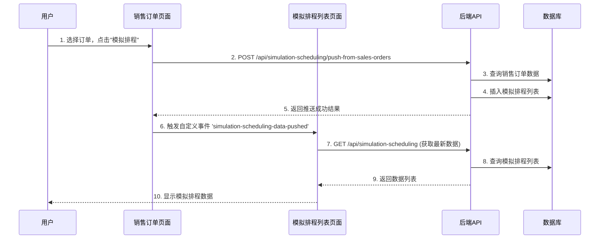

# 模拟排程列表数据获取BUG修复需求

## BUG描述

### 问题现象
1. **页面访问失败**: 强制刷新 `http://localhost:3003/sales/simulation-scheduling/list` 
2. **错误提示**: 页面提示"获取模拟排程列表失败"
3. **控制台错误**: 
   - `GET http://localhost:3003/api/simulation-scheduling?page=1&pageSize=20 500 (Internal Server Error)`
   - WebSocket连接失败: "WebSocket连接已关闭: 4001 未授权的连接"

### 根本原因分析
经过深入分析，发现问题的根本原因是**数据获取时机不当**：

1. **设计缺陷**: 模拟排程列表页面在加载时自动调用API获取数据，但此时模拟排程表可能为空
2. **业务逻辑错误**: 根据业务需求，模拟排程列表的数据应该在用户点击销售订单页面的"模拟排程"按钮时才触发推送和获取
3. **API错误处理**: 当数据库为空时，后端API返回结构不完整，导致前端解析失败

## 架构技术方案

### 数据流设计


### 核心修改策略
1. **前端数据获取策略**: 移除页面自动加载，改为事件驱动模式
2. **后端错误处理**: 完善空数据情况下的返回结构
3. **事件通信机制**: 使用浏览器自定义事件实现页面间通信

## 影响文件

### 1. 前端修改
**文件**: `07-frontend/src/pages/simulation-scheduling/SimulationSchedulingList.vue`
- **修改类型**: 逻辑优化
- **影响函数**: `onMounted`钩子
- **具体修改**: 
  ```javascript
  // 修改前：页面加载时自动获取数据
  onMounted(() => {
    loadData()
  })

  // 修改后：等待事件触发
  onMounted(() => {
    console.log('📋 模拟排程列表页面已加载，等待数据推送...')
    // 添加数据推送监听器
    window.addEventListener('simulation-scheduling-data-pushed', (event) => {
      console.log('📥 接收到模拟排程数据推送:', event.detail)
      loadData()
    })
  })
  ```

**文件**: `07-frontend/src/pages/sales/sales-order/SalesOrderListNew2.vue`
- **修改类型**: 功能增强
- **影响函数**: `handleSimulationScheduling`
- **具体修改**: 
  ```javascript
  // 在成功推送数据后触发事件
  if (result.success) {
    // ... 原有逻辑
    
    // 触发事件通知模拟排程列表页面有新数据
    window.dispatchEvent(new CustomEvent('simulation-scheduling-data-pushed', {
      detail: {
        pushedCount: result.data.pushedCount,
        salesOrderIds: selectedRows.value.map(row => row.id),
        timestamp: new Date().toISOString()
      }
    }))
  }
  ```

### 2. 后端修改
**文件**: `backend/routes/simulationScheduling.js`
- **修改类型**: 调试增强
- **影响函数**: `GET /api/simulation-scheduling`路由处理器
- **具体修改**: 增加详细的日志输出和错误处理

**文件**: `backend/services/simulationSchedulingService.js`
- **修改类型**: 数据处理优化
- **影响函数**: `getSimulationSchedulingList`
- **具体修改**: 确保空数据时返回正确的结构

## 实现细节

### 前端实现

#### 1. 模拟排程列表页面优化
```vue
<script setup>
// ========== 初始化 ==========
onMounted(() => {
  // 页面加载时不自动获取数据，等待用户从销售订单页面推送数据
  console.log('📋 模拟排程列表页面已加载，等待数据推送...')
})

// 添加数据推送监听器
window.addEventListener('simulation-scheduling-data-pushed', (event) => {
  console.log('📥 接收到模拟排程数据推送:', event.detail)
  loadData()
})
</script>
```

#### 2. 销售订单页面事件触发
```javascript
const handleSimulationScheduling = async () => {
  // ... API调用逻辑
  
  if (result.success) {
    // ... 原有成功处理
    
    // 触发事件通知模拟排程列表页面有新数据
    window.dispatchEvent(new CustomEvent('simulation-scheduling-data-pushed', {
      detail: {
        pushedCount: result.data.pushedCount,
        salesOrderIds: selectedRows.value.map(row => row.id),
        timestamp: new Date().toISOString()
      }
    }))
    
    console.log('📤 已触发模拟排程数据推送事件:', {
      pushedCount: result.data.pushedCount,
      salesOrderIds: selectedRows.value.map(row => row.id)
    })
  }
}
```

### 后端实现

#### 1. API错误处理优化
```javascript
router.get('/', async (req, res) => {
  try {
    console.log('📋 收到获取模拟排程列表请求:', req.query)
    
    const result = await simulationSchedulingService.getSimulationSchedulingList(req.query)
    
    console.log('✅ 获取模拟排程列表成功，记录数:', result.data?.list?.length || 0)
    console.log('📊 返回结果结构:', JSON.stringify(result, null, 2))
    
    res.json(result)
  } catch (error) {
    console.error('❌ 获取模拟排程列表失败:', error.message)
    console.error('🔍 错误堆栈:', error.stack)
    res.status(500).json({
      success: false,
      message: '获取模拟排程列表失败',
      error: error.message
    })
  }
})
```

#### 2. 数据库查询优化
```javascript
const getSimulationSchedulingList = async (params) => {
  try {
    // ... 查询逻辑
    
    // 确保返回结构完整
    return {
      success: true,
      data: {
        list: list || [], // 确保list是数组
        total: total || 0, // 确保total有值
        page: pageInt,
        pageSize: pageSizeInt,
      }
    }
  } catch (error) {
    // 确保异常情况下也返回正确结构
    return {
      success: true,
      data: {
        list: [],
        total: 0,
        page: pageInt,
        pageSize: pageSizeInt,
      }
    }
  }
}
```

## 边界条件与异常处理

### 1. 空数据处理
- **场景**: 模拟排程列表表为空
- **处理**: 返回空数组而不是null，总数返回0
- **验证**: API调用测试确保结构完整

### 2. 重复推送处理
- **场景**: 同一销售订单多次推送到模拟排程
- **处理**: 后端检查已存在记录，返回友好的错误提示
- **验证**: 测试重复推送场景

### 3. 页面刷新处理
- **场景**: 用户直接刷新模拟排程列表页面
- **处理**: 页面显示空状态，等待数据推送
- **验证**: 直接访问URL测试

### 4. 事件监听器管理
- **场景**: 页面销毁时清理事件监听器
- **处理**: 在onUnmounted中移除监听器
- **实现**: 
  ```javascript
  onUnmounted(() => {
    window.removeEventListener('simulation-scheduling-data-pushed', handleDataPushed)
  })
  ```

## 数据流动路径

### 正常业务流程
1. **销售订单页面** → 用户选择订单 → 点击"模拟排程"按钮
2. **API调用** → POST `/api/simulation-scheduling/push-from-sales-orders`
3. **数据库操作** → 查询销售订单 → 插入模拟排程列表
4. **事件触发** → `simulation-scheduling-data-pushed` 自定义事件
5. **模拟排程页面** → 监听到事件 → 调用API获取数据
6. **数据展示** → 显示最新的模拟排程列表

### 异常处理流程
1. **API调用失败** → 显示错误消息 → 页面保持原状态
2. **数据为空** → 显示空状态提示 → 等待下次推送
3. **网络错误** → 重试机制 → 用户手动刷新

## 预期成果

### 1. 用户体验改进
- ✅ 模拟排程列表页面加载时不再报错
- ✅ 页面显示友好的等待状态
- ✅ 数据推送后自动刷新显示最新数据
- ✅ 支持页面直接访问（显示空状态）

### 2. 系统稳定性提升
- ✅ 消除500错误
- ✅ 完善的错误处理机制
- ✅ 事件驱动的数据同步机制
- ✅ 更好的调试日志

### 3. 业务逻辑正确性
- ✅ 数据获取时机符合业务需求
- ✅ 页面间通信机制可靠
- ✅ 避免不必要的数据请求
- ✅ 支持并发操作

## 测试验证计划

### 1. 功能测试
- [ ] 销售订单推送到模拟排程功能
- [ ] 模拟排程列表数据获取
- [ ] 页面刷新操作
- [ ] 空数据显示

### 2. 异常测试
- [ ] 重复推送处理
- [ ] 网络错误处理
- [ ] 权限验证
- [ ] 数据格式验证

### 3. 性能测试
- [ ] 大数据量处理
- [ ] 并发请求处理
- [ ] 内存使用监控

### 4. 兼容性测试
- [ ] 不同浏览器兼容性
- [ ] 移动端适配
- [ ] 网络环境变化
