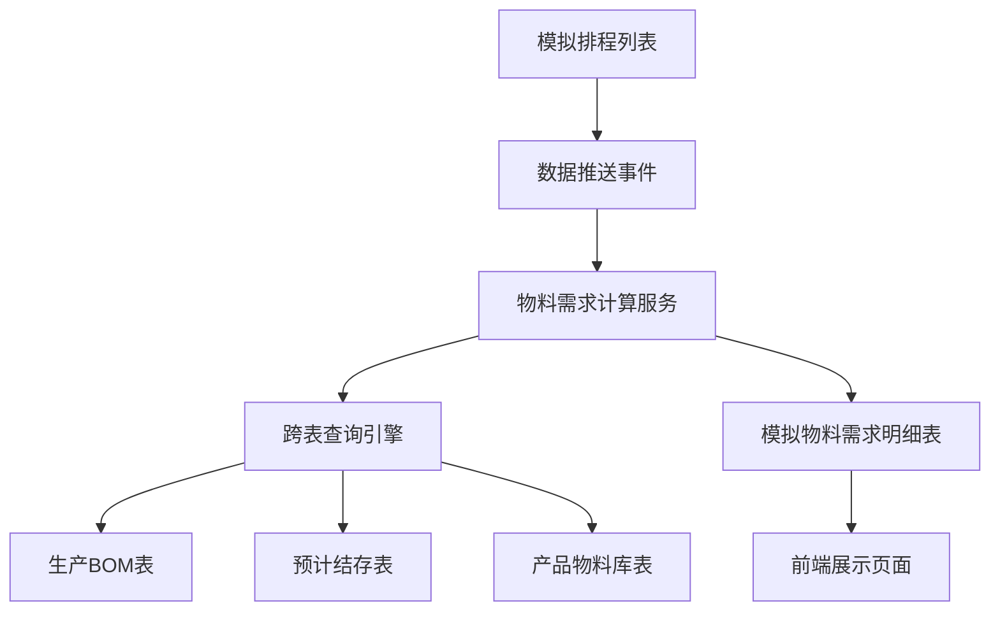
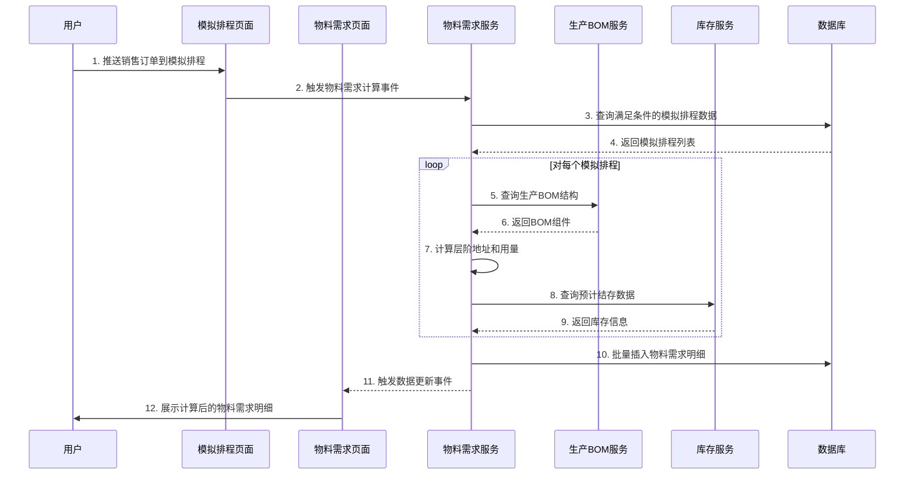

# 模拟物料需求明细功能开发需求

## 需求概述

开发"模拟物料需求明细"功能，基于模拟排程列表数据，通过复杂的跨表查询和计算逻辑，自动生成详细的物料需求明细。该功能是被动数据接收类型，当模拟排程列表没有数据时不显示"获取数据失败"。

## 业务场景具体处理逻辑

### 1. 数据来源和触发机制
- **数据来源**: 模拟排程列表 (`http://localhost:3003/sales/simulation-scheduling/list`)
- **目标页面**: 模拟物料需求明细
- **触发页面**: 模拟排程列表
- **触发时机**: 全满足 AND (客户交期不为空，且产品编号不为空，且建议补货数量不为空)
- **触发条件**: 建议补货数量 > 0

### 2. 核心业务规则
**规则1**: 模拟排程列表新增模拟物料需求明细的数据流规则

**数据流规则说明**:
- **左边**: 模拟物料需求明细
- **右边**: 模拟排程列表
- **注意**: 先按找生产BOM中所有采购来源的子件推送到模拟物料需求明细中，如果有N种采购来源子件编号，则目标行就有N行

### 3. 字段映射规则详解

#### 基础字段映射
```
1. 序号 = 按系统自动生成，类似Excel行号，不受排序规则影响，总是从上到下递增
2. 订单状态 = 订单状态
3. 内部销售订单编号 = 内部销售订单编号
4. 客户交期 = 客户交期
5. 产品编号 = 产品编号
6. 产品名称 = 产品名称
7. 建议补货数量 = 建议补货数量
```

#### 层阶地址计算规则 (跨表查询生产BOM)
**查询目标页面**: 生产BOM (`http://localhost:3003/bom/production`)

**条件1**: 生产BOM的"产品编号" = 模拟物料需求明细的"产品编号"
**条件2**: 生产BOM的子件属性的子表格"子件编号" = 模拟物料需求明细的"产品编号"

**计算逻辑**:
```
IF(AND(条件1=true)), THEN (
  层阶地址 = 0
  层阶-0阶标准用量 = 1
  0阶BOM编号数量 = 1
)
IF(AND(条件1=false, 条件2=true)), THEN (
  层阶地址 = 生产BOM的子件属性的"层阶地址"
  层阶-0阶标准用量 = 生产BOM的子件属性的"0阶标准用量"
)
IF(AND(条件1=false, 条件2=false)), THEN (
  层阶地址 = 9999999
  // 加监控器：当层阶地址=9999999时，弹出提示：该产品无生产BOM，无法模拟排程
  // 停止该产品的所有后续模拟排程
)
```

#### 0阶BOM编号计算 (跨表查询生产BOM)
**条件1**: 模拟物料需求明细的"层阶地址" = 0
**条件2**: 模拟物料需求明细的"层阶地址" != 0
**条件3**: 模拟物料需求明细的"层阶地址" != 9999999
**条件4**: 模拟物料需求明细的"层阶地址" = 9999999

**计算逻辑**:
```
IF(AND(条件1=true)), THEN (
  0阶BOM编号 = LOOKUP(生产BOM父件属性的"产品编号"=模拟物料需求明细的"产品编号", 生产BOM父件属性的"BOM编号"=模拟物料需求明细的"0阶编号")
)
IF(AND(条件2=true, 条件3=true)), THEN (
  0阶BOM编号 = LOOKUP(生产BOM子件属性的"子件编号"=模拟物料需求明细的"产品编号", 生产BOM父件属性的"BOM编号")
  // 注释：根据子件属性中查询的子件编码来确认父件属性区域的"BOM编号"
)
IF(AND(条件4=true)), THEN (
  // 0阶BOM编号 = 终止计算
)
```

#### 0阶BOM编号数量计算 (页面内计算)
```
计算时机: 层阶-0阶标准用量先计算完成，且建议补货数量先计算完成
计算条件: 模拟物料需求明细的"层阶地址" != 9999999
计算公式: 0阶BOM编号数量 = 建议补货数量 / 层阶-0阶标准用量 (取小数点后11位数)
```

#### 当前工序计算
```
当前工序 = "采购"  // 注意：这是顺排逻辑，一个产品的子件里面肯定有许多不同的采购来源物料编号
// 说明：为了把生产BOM中符合条件的所有采购来源的物料都查找出来，不能漏掉
// 符合条件是指属于产品编号的下级子件范围内
```

#### 当前层阶地址等字段计算 (跨表查询生产BOM)
**条件1**: 模拟物料需求明细的"层阶地址" = 0
**条件2**: 模拟物料需求明细的"层阶地址" != 0 且 模拟物料需求明细的"层阶地址" != 9999999
**条件3**: 模拟物料需求明细的"层阶地址" = 9999999

**IF(AND(条件1=true))**: 执行多条件查询，多结果匹配
```
查询条件全满足:
  查询条件1: 生产BOM的父件属性的"BOM编号" = 模拟物料需求明细的"0阶BOM编号"
  查询条件2: 生产BOM的子件属性的子表格中"产出工序" = 采购

查询匹配结果:
  当前层阶地址 = 生产BOM的子件属性的子表格中"层阶地址"
  当前物料编号 = 生产BOM的子件属性的子表格中"子件编号"
  当前物料名称 = 生产BOM的子件属性的子表格中"子件名称"
  当前0阶标准用量 = 生产BOM的子件属性的子表格中"0阶标准用量"
  
  // 注释：当模拟物料需求明细的"层阶地址"=0时，说明模拟物料需求明细的"产品编码"是成品
  // 所以要将"BOM编号"内的所有子件属性中"产出工序"=采购的层阶地址查询出来
```

**IF(AND(条件2=true))**: 执行多条件查询，多结果匹配
```
查询条件全满足:
  查询条件3: 生产BOM的父件属性的"BOM编号" = 模拟物料需求明细的"0阶BOM编号"
  查询条件4: 生产BOM的子件属性的子表格中"层阶地址" 包含 模拟物料需求明细的"层阶地址"
  // 举例说明：模拟物料需求明细的"层阶地址"=1，则生产BOM的子件属性的子表格中"层阶地址"
  // 1.2, 1.1, 1.2.1 等所有层阶地址从第1个"."前面就匹配的才是满足条件的
  // 因为根据层阶地址规律，就能判断1.2, 1.1, 1.2.1 都是层阶1的子件
  // 2.1, 3.4.1 等不符合条件，因为2.1属于层阶地址2的子件，3.4.1是层阶3的子件和层阶3.4的子件
  查询条件5: 生产BOM的子件属性的子表格中"产出工序" = 采购

查询匹配结果:
  当前层阶地址 = 生产BOM的子件属性的子表格中"层阶地址"
  当前物料编号 = 生产BOM的子件属性的子表格中"子件编号"
  当前物料名称 = 生产BOM的子件属性的子表格中"子件名称"
  当前0阶标准用量 = 生产BOM的子件属性的子表格中"0阶标准用量"
  
  // 注释：当模拟物料需求明细的"层阶地址"！=0且！=9999999时，说明模拟物料需求明细的"产品编码"是半成品
  // 所以要将"BOM编号"内的符合条件的半成品下的所有子件属性中"产出工序"=采购的层阶地址查询出来
```

#### 当前需求数量计算 (页面内计算)
```
计算时机: 0阶BOM编号数量先计算完成，且当前0阶标准用量先计算完成
计算条件: 模拟物料需求明细的"层阶地址" != 9999999
计算公式: 当前需求数量 = 0阶BOM编号数量 * 当前0阶标准用量
```

#### 可用库存计算 (跨表查询预计结存)
**查询目标页面**: 预计结存 (`http://localhost:3003/inventory/projected-balance`)

**查询条件**: 
```
LOOKUP(AND(
  MINIFS(预计结存的"预计发生日期" > 系统当天日期(中国时区日期)),
  预计结存的"产品(物料)编码" = 模拟物料需求明细的"当前物料编号",
  MIN(预计结存的"序号"))
), 预计结存的"预计结存" = 模拟物料需求明细的"可用库存")
```

**注意**: 
- 这是多条件查询
- 查询条件1: 比系统当天日期大且最小的日期
- 查询条件2: 物料编码要相同
- 查询条件3: 当目标页面的最小日期有许多行数据，则选择序号最小的这行数据
- 计算时机: 模拟物料需求明细的"当前物料编号"不为空则触发计算

#### 按顺序总需计算 (页面内计算)
```
计算公式: SUMIFS(
  求和条件1: 当前物料编号 = 本行的"当前物料编号",
  求和条件2: 序号 <= 本行的"序号",
  求和列: 当前需求数量
)
计算时机: 序号先计算完成 且 当前物料编号计算完成
```

#### 还需数量计算 (页面内计算)
```
计算时机: 当前"按顺序总需"计算完成，且可用库存计算完成
计算公式: 还需数量 = 按顺序总需 - 可用库存
触发条件: 当页面新增数据行或删除数据则重新计算
```

#### 其他字段计算
```
计划采购日期 = 系统当天日期 + 1天
需求天数 = IF(模拟物料需求明细的"还需数量" <= 0, 0, 
           LOOKUP(产品物料库的"物料编号" = 模拟物料需求明细的"当前物料编号", 
                  产品物料库的采购属性中的"采购周期" = 模拟物料需求明细的"需求日期"))
           // 注意：这是嵌套公式，当"还需数量"<=0，则需求天数=0
           // 当"还需数量">0,则需求天数=产品物料库中采购周期
           // 计算时机："当前物料编号"不为空，且还需数量>0
预计回厂日期 = 系统当天日期(中国时区) + 1天 + 需天数
计算时机: 需求天数先计算完成
```

#### 后道产品字段计算 (跨表查询生产BOM)
**计算时机**: 模拟物料需求明细的"当前层阶地址"计算完成
**计算条件**: 模拟物料需求明细的"层阶地址" != 9999999 且 模拟物料需求明细的"当前层阶地址"不为空

```
后道产品层阶地址, 后道工序名称, 后道工序产品编号, 后道工序产品名称, 
后道0阶标准用量, 后道产品来源 = LOOKUP(
  生产BOM的子件属性的子表格中的"层阶地址" = 模拟物料需求明细的"当前层阶地址",
  生产BOM的子件属性的子表格中的【"后道产品层阶地址", "后道工序名称", 
  "后道工序产品编号", "后道工序产品名称", "后道0阶标准用量", "子件来源"】
)
// 注意：这是多条件查询，计算公式内有多个字段匹配完成
```

#### 后道需求数量计算 (页面内计算)
```
计算时机: 0阶BOM编号数量先计算完成，且"后道0阶标准用量"先计算完成
计算条件: 模拟物料需求明细的"层阶地址" != 9999999
计算公式: 后道需求数量 = 0阶BOM编号数量 * 后道0阶标准用量
```

#### 后道可用库存计算 (跨表查询预计结存)
**查询目标页面**: 预计结存

```
LOOKUP(AND(
  MAXIFS(预计结存的"预计发生日期" <= 模拟物料需求明细的"计划回厂日期" + 1天),
  预计结存的"产品(物料)编码" = 模拟物料需求明细的"后道工序产品编号",
  MAX(预计结存的"序号"))
), 预计结存的"预计结存" = 模拟物料需求明细的"后道可用库存")
```

**注意**: 
- 查询条件1: 查询范围：小于等于模拟物料需求明细"计划回厂日期"+1天，且最大的日期
- 查询条件2: 物料编码要相同
- 查询条件3: 当目标页面的最小日期有许多行数据，则选择序号最大的这行数据
- 计算时机: "后道工序产品编号"不为空且"计划回厂日期"不为空则触发计算

#### 最后字段计算
```
是否继续排程 = IF(当前物料编号 = 产品编号, 否, 是)
计算时机: 当前物料编号先计算完成，且产品编号先计算完成

提交时间 = 系统当前时间

物料需求明细编号 = 按系统自动生成

来源编号 = 模拟排程编号
```

## 架构技术方案

### 1. 系统架构图


### 2. 数据流设计


### 3. 核心计算引擎设计

#### 跨表查询引擎
```javascript
class CrossTableQueryEngine {
  // 生产BOM查询
  async queryProductionBOM(productCode, levelAddress, bomCode) {
    // 实现复杂的BOM查询逻辑
  }
  
  // 预计结存查询
  async queryProjectedBalance(materialCode, dateCondition, selectType) {
    // 实现库存查询逻辑，支持MINIFS和MAXIFS
  }
  
  // 产品物料库查询
  async queryMaterialLibrary(materialCode) {
    // 查询采购周期等信息
  }
}
```

#### 物料需求计算引擎
```javascript
class MaterialRequirementCalculator {
  async calculateRequirements(simulationData) {
    // 1. 验证触发条件
    if (!this.validateTriggerConditions(simulationData)) {
      return;
    }
    
    // 2. 计算层阶地址
    const levelAddress = await this.calculateLevelAddress(simulationData);
    
    // 3. 计算0阶BOM编号
    const bomCode = await this.calculateBOMCode(simulationData, levelAddress);
    
    // 4. 计算数量相关字段
    const quantities = this.calculateQuantities(simulationData, levelAddress);
    
    // 5. 跨表查询获取其他字段
    const crossTableData = await this.queryCrossTableData(simulationData, levelAddress, bomCode);
    
    // 6. 组装完整数据
    return this.assembleRequirement(simulationData, {
      levelAddress,
      bomCode,
      quantities,
      ...crossTableData
    });
  }
}
```

## 影响文件

### 1. 数据库层
**文件**: `backend/db/migration/create_simulation_material_requirements_table.sql`
- **类型**: 数据库表创建
- **绝对路径**: `backend/db/migration/create_simulation_material_requirements_table.sql`
- **影响**: 新建模拟物料需求明细表，包含所有必需字段和索引

### 2. 后端服务层
**文件**: `backend/services/simulationMaterialRequirementService.js`
- **类型**: 新建业务服务
- **绝对路径**: `backend/services/simulationMaterialRequirementService.js`
- **影响函数**: 
  - `calculateMaterialRequirements()` - 物料需求计算主函数
  - `getMaterialRequirementList()` - 获取需求列表
  - `handleSimulationSchedulingUpdate()` - 处理模拟排程更新事件

### 3. 跨表查询引擎
**文件**: `backend/services/crossTableQueryService.js`
- **类型**: 新建查询服务
- **绝对路径**: `backend/services/crossTableQueryService.js`
- **影响函数**: 
  - `queryProductionBOM()` - 生产BOM查询
  - `queryProjectedBalance()` - 预计结存查询
  - `queryMaterialLibrary()` - 产品物料库查询

### 4. 后端路由层
**文件**: `backend/routes/simulationMaterialRequirements.js`
- **类型**: 新建API路由
- **绝对路径**: `backend/routes/simulationMaterialRequirements.js`
- **影响**: 提供物料需求明细的RESTful API

### 5. 前端页面组件
**文件**: `07-frontend/src/pages/simulation-material-requirements/SimulationMaterialRequirementList.vue`
- **类型**: 新建Vue页面组件
- **绝对路径**: `07-frontend/src/pages/simulation-material-requirements/SimulationMaterialRequirementList.vue`
- **影响**: 完整的物料需求明细展示页面

### 6. 前端路由配置
**文件**: `07-frontend/src/router/index.js`
- **类型**: 路由配置修改
- **影响**: 添加物料需求明细页面路由

## 实现细节

### 1. 数据库表设计

#### 模拟物料需求明细表 (simulation_material_requirements)
```sql
CREATE TABLE simulation_material_requirements (
  id INT AUTO_INCREMENT PRIMARY KEY COMMENT '主键ID',
  sequence_number INT NOT NULL COMMENT '序号',
  requirement_no VARCHAR(50) UNIQUE NOT NULL COMMENT '物料需求明细编号',
  order_status VARCHAR(50) COMMENT '订单状态',
  internal_sales_order_no VARCHAR(100) COMMENT '内部销售订单编号',
  customer_delivery_date DATE COMMENT '客户交期',
  product_code VARCHAR(100) COMMENT '产品编号',
  product_name VARCHAR(255) COMMENT '产品名称',
  suggested_replenishment_qty DECIMAL(15,2) COMMENT '建议补货数量',
  level_address VARCHAR(200) COMMENT '层阶地址',
  level0_bom_code VARCHAR(100) COMMENT '0阶BOM编号',
  level_standard_qty DECIMAL(10,4) COMMENT '层阶-0阶标准用量',
  level0_bom_quantity DECIMAL(15,2) COMMENT '0阶BOM编号数量',
  current_process VARCHAR(100) COMMENT '当前工序',
  current_level_address VARCHAR(200) COMMENT '当前层阶地址',
  current_material_code VARCHAR(100) COMMENT '当前物料编号',
  current_material_name VARCHAR(200) COMMENT '当前物料名称',
  current_level0_standard_qty DECIMAL(10,4) COMMENT '当前0阶标准用量',
  current_required_qty DECIMAL(15,2) COMMENT '当前需求数量',
  available_inventory DECIMAL(15,2) COMMENT '可用库存',
  total_required_by_order DECIMAL(15,2) COMMENT '按顺序总需',
  still_needed_qty DECIMAL(15,2) COMMENT '还需数量',
  planned_purchase_date DATE COMMENT '计划采购日期',
  requirement_days INT COMMENT '需求天数',
  estimated_return_date DATE COMMENT '预计回厂日期',
  downstream_level_address VARCHAR(200) COMMENT '后道产品层阶地址',
  downstream_process_name VARCHAR(200) COMMENT '后道工序名称',
  downstream_product_code VARCHAR(100) COMMENT '后道工序产品编号',
  downstream_product_name VARCHAR(200) COMMENT '后道工序产品名称',
  downstream_level0_standard_qty DECIMAL(10,4) COMMENT '后道0阶标准用量',
  downstream_required_qty DECIMAL(15,2) COMMENT '后道需求数量',
  downstream_available_inventory DECIMAL(15,2) COMMENT '后道可用库存',
  submit_time DATETIME COMMENT '提交时间',
  continue_scheduling TINYINT(1) DEFAULT 1 COMMENT '是否继续排程',
  downstream_product_source VARCHAR(50) COMMENT '后道产品来源',
  requirement_detail_no VARCHAR(50) COMMENT '物料需求明细编号',
  source_no VARCHAR(100) COMMENT '来源编号',
  created_at TIMESTAMP DEFAULT CURRENT_TIMESTAMP COMMENT '创建时间',
  updated_at TIMESTAMP DEFAULT CURRENT_TIMESTAMP ON UPDATE CURRENT_TIMESTAMP COMMENT '更新时间',
  
  -- 索引
  INDEX idx_requirement_no (requirement_no),
  INDEX idx_internal_sales_order_no (internal_sales_order_no),
  INDEX idx_product_code (product_code),
  INDEX idx_current_material_code (current_material_code),
  INDEX idx_source_no (source_no),
  INDEX idx_created_at (created_at),
  INDEX idx_customer_delivery_date (customer_delivery_date)
) ENGINE=InnoDB DEFAULT CHARSET=utf8mb4 COLLATE=utf8mb4_unicode_ci COMMENT='模拟物料需求明细表';
```

### 2. 后端服务实现

#### 主计算服务
```javascript
/**
 * 计算模拟物料需求明细
 * @param {Array<string>} simulationIds - 模拟排程ID数组
 * @returns {Promise<Object>} 计算结果
 */
const calculateMaterialRequirements = async (simulationIds) => {
  return await executeTransaction(async (connection) => {
    // 1. 获取满足触发条件的模拟排程数据
    const simulations = await getTriggeredSimulations(connection, simulationIds);
    
    if (simulations.length === 0) {
      return { success: true, data: { calculatedCount: 0 } };
    }
    
    // 2. 删除旧的需求数据
    await deleteOldRequirements(connection, simulations);
    
    // 3. 对每个模拟排程计算物料需求
    const allRequirements = [];
    for (const simulation of simulations) {
      const requirements = await calculateSingleSimulationRequirements(connection, simulation);
      allRequirements.push(...requirements);
    }
    
    // 4. 批量插入计算结果
    if (allRequirements.length > 0) {
      await insertRequirements(connection, allRequirements);
    }
    
    return {
      success: true,
      data: {
        calculatedCount: allRequirements.length,
        simulations: simulations.map(s => s.simulation_no)
      }
    };
  });
};

/**
 * 获取满足触发条件的模拟排程
 */
const getTriggeredSimulations = async (connection, simulationIds) => {
  const placeholders = simulationIds.map(() => '?').join(',');
  const [simulations] = await connection.execute(`
    SELECT * FROM simulation_scheduling_list 
    WHERE id IN (${placeholders})
    AND customer_delivery_date IS NOT NULL 
    AND product_code IS NOT NULL 
    AND product_code != ''
    AND suggested_replenishment_qty IS NOT NULL 
    AND suggested_replenishment_qty > 0
    ORDER BY submit_time DESC, internal_sales_order_no ASC
  `, simulationIds);
  
  return simulations;
};
```

#### 单个模拟排程计算
```javascript
/**
 * 计算单个模拟排程的物料需求
 */
const calculateSingleSimulationRequirements = async (connection, simulation) => {
  const requirements = [];
  
  // 1. 计算层阶地址
  const levelAddress = await calculateLevelAddress(connection, simulation);
  
  if (levelAddress === '9999999') {
    // 产品无生产BOM，跳过
    console.warn(`产品 ${simulation.product_code} 无生产BOM，跳过模拟排程`);
    return requirements;
  }
  
  // 2. 计算0阶BOM编号
  const bomCode = await calculateBOMCode(connection, simulation, levelAddress);
  
  // 3. 计算0阶BOM编号数量
  const bomQuantity = calculateBOMQuantity(simulation, levelAddress);
  
  // 4. 获取采购子件列表
  const purchaseComponents = await getPurchaseComponents(connection, simulation, levelAddress, bomCode);
  
  // 5. 为每个采购子件生成需求记录
  for (const component of purchaseComponents) {
    const requirement = await buildRequirementRecord(
      connection,
      simulation,
      component,
      levelAddress,
      bomCode,
      bomQuantity
    );
    
    if (requirement) {
      requirements.push(requirement);
    }
  }
  
  return requirements;
};
```

### 3. 前端页面实现

#### 页面组件结构
```vue
<template>
  <div class="simulation-material-requirements-container">
    <StandardTablePage
      page-title="模拟物料需求明细"
      settings-key="simulation-material-requirements"
      
      :table-data="filteredTableData"
      :columns="tableColumns"
      :loading="loading"
      :total="pagination.total"
      :current-page="pagination.page"
      :page-size="pagination.pageSize"
      
      :show-search="true"
      :show-selection="true"
      :show-filter="true"
      :show-pagination="true"
      :show-export="true"
      
      @page-change="handlePageChange"
      @size-change="handlePageSizeChange"
      @refresh="handleRefresh"
    >
      <!-- 空状态显示 -->
      <template #empty>
        <el-empty
          v-if="!hasSimulationData"
          description="暂无模拟排程数据"
        >
          <template #description>
            <p>暂无模拟排程数据，请先在模拟排程列表中推送销售订单</p>
            <p style="font-size: 12px; color: #909399; margin-top: 8px;">
              注意：只有满足以下条件的模拟排程才会生成物料需求明细：
            </p>
            <ul style="font-size: 12px; color: #909399; text-align: left; margin-top: 8px;">
              <li>客户交期不为空</li>
              <li>产品编号不为空</li>
              <li>建议补货数量不为空且大于0</li>
            </ul>
          </template>
          <el-button type="primary" @click="goToSimulationScheduling">
            前往模拟排程
          </el-button>
        </el-empty>
        <el-empty
          v-else
          description="暂无物料需求数据"
        />
      </template>
      
      <!-- 自定义列插槽 -->
      <template #orderStatus="{ row }">
        <el-tag :type="getStatusType(row.orderStatus)">
          {{ row.orderStatus || '-' }}
        </el-tag>
      </template>
    </StandardTablePage>
  </div>
</template>

<script setup>
import { ref, computed, onMounted, onUnmounted } from 'vue'
import { useRouter } from 'vue-router'
import StandardTablePage from '@/components/common/layout/StandardTablePage.vue'

// 路由管理
const router = useRouter()

// 状态管理
const loading = ref(false)
const tableData = ref([])
const hasSimulationData = ref(false)

// ========== 数据获取逻辑 ==========
const loadData = async () => {
  loading.value = true
  try {
    const response = await fetch('/api/simulation-material-requirements')
    const result = await response.json()
    
    if (result.success) {
      tableData.value = result.data.list || []
      hasSimulationData.value = result.data.hasSimulationData || false
    } else {
      // 被动接收数据类型，不显示"获取数据失败"错误
      console.warn('物料需求数据获取失败:', result.message)
      tableData.value = []
      hasSimulationData.value = false
    }
  } catch (error) {
    // 被动接收数据类型，不显示"获取数据失败"错误
    console.warn('物料需求数据获取异常:', error)
    tableData.value = []
    hasSimulationData.value = false
  } finally {
    loading.value = false
  }
}

// ========== 事件监听 ==========
const handleSimulationSchedulingUpdate = async (event) => {
  console.log('?? 接收到模拟排程更新事件，重新计算物料需求:', event.detail)
  
  // 延迟执行，确保模拟排程数据已保存
  setTimeout(() => {
    loadData()
  }, 1000)
}

// ========== 页面生命周期 ==========
onMounted(() => {
  // 页面加载时不自动获取数据，等待事件触发
  console.log('📋 模拟物料需求明细页面已加载，等待模拟排程数据推送...')
  
  // 监听模拟排程数据推送事件
  window.addEventListener('simulation-scheduling-data-pushed', handleSimulationSchedulingUpdate)
})

onUnmounted(() => {
  window.removeEventListener('simulation-scheduling-data-pushed', handleSimulationSchedulingUpdate)
})

// ========== 事件处理 ==========
const goToSimulationScheduling = () => {
  router.push('/sales/simulation-scheduling/list')
}
</script>

<style scoped lang="scss">
.simulation-material-requirements-container {
  padding: 20px;
  background: #f5f7fa;
  min-height: 100vh;
}
</style>
```

## 边界条件与异常处理

### 1. 数据为空处理
- **场景**: 模拟排程列表没有数据
- **处理**: 显示友好的空状态提示，不显示"获取数据失败"错误
- **实现**: 被动数据接收模式，静默处理异常

### 2. 触发条件不满足
- **场景**: 模拟排程数据不满足触发条件
- **处理**: 跳过该记录，继续处理其他记录
- **提示**: 在控制台记录详细信息

### 3. BOM结构异常
- **场景**: 产品无生产BOM结构
- **处理**: 设置层阶地址为9999999，停止该产品的模拟排程
- **监控**: 添加监控器提示用户

### 4. 跨表查询异常
- **场景**: 相关表数据不存在或查询失败
- **处理**: 使用默认值，标记需要人工关注
- **日志**: 详细记录查询条件和错误信息

## 数据流动路径

### 1. 正常业务流程
1. **模拟排程数据推送** → 销售订单推送到模拟排程列表
2. **触发条件检查** → 检查客户交期、产品编号、建议补货数量
3. **物料需求计算** → 根据BOM结构递归计算需求
4. **跨表查询** → 查询生产BOM、预计结存、产品物料库
5. **数据组装** → 按照业务规则组装完整数据
6. **前端展示** → 按优先级排序展示

### 2. 数据更新流程
1. **模拟排程变更** → 重新计算相关物料需求
2. **增量计算** → 只处理变更的记录
3. **实时同步** → 前端自动刷新显示

## 预期成果

### 1. 功能完整性
- ✅ 完整的物料需求明细展示
- ✅ 复杂的跨表查询计算
- ✅ 智能的BOM递归展开
- ✅ 精确的数量计算逻辑

### 2. 用户体验
- ✅ 被动数据接收，无错误提示
- ✅ 友好的空状态和条件说明
- ✅ 实时数据同步更新
- ✅ 丰富的筛选和搜索功能

### 3. 系统性能
- ✅ 高效的跨表查询算法
- ✅ 合理的数据分页机制
- ✅ 优化的数据库索引
- ✅ 智能的缓存策略

### 4. 业务价值
- ✅ 精确的物料需求计算
- ✅ 及时的采购计划支持
- ✅ 完整的排程模拟功能
- ✅ 智能的库存管理支持
