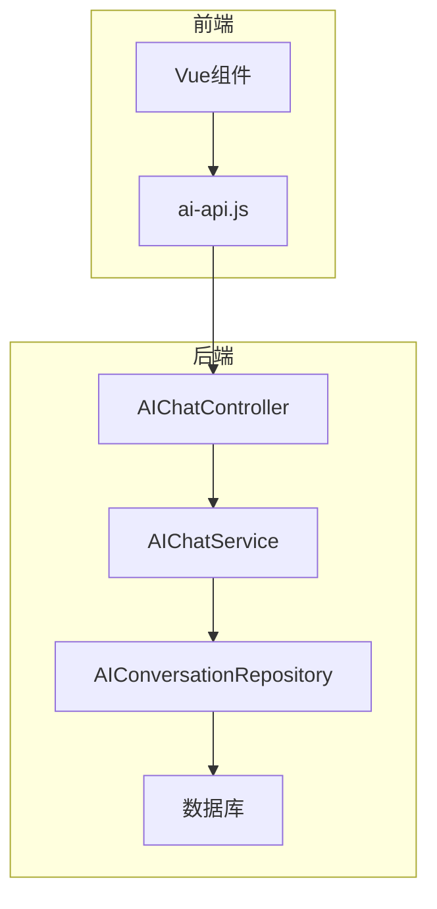
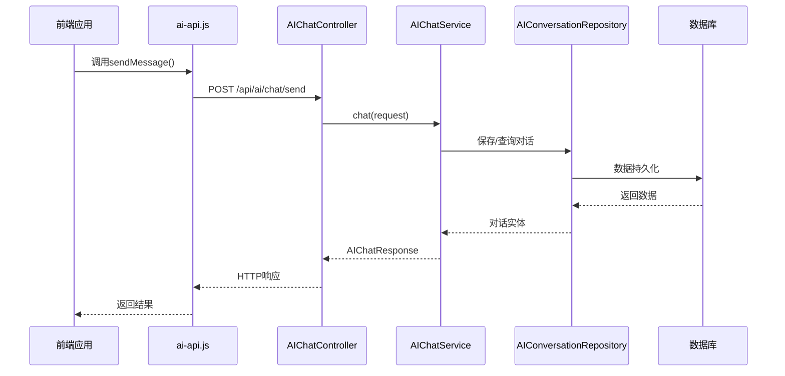
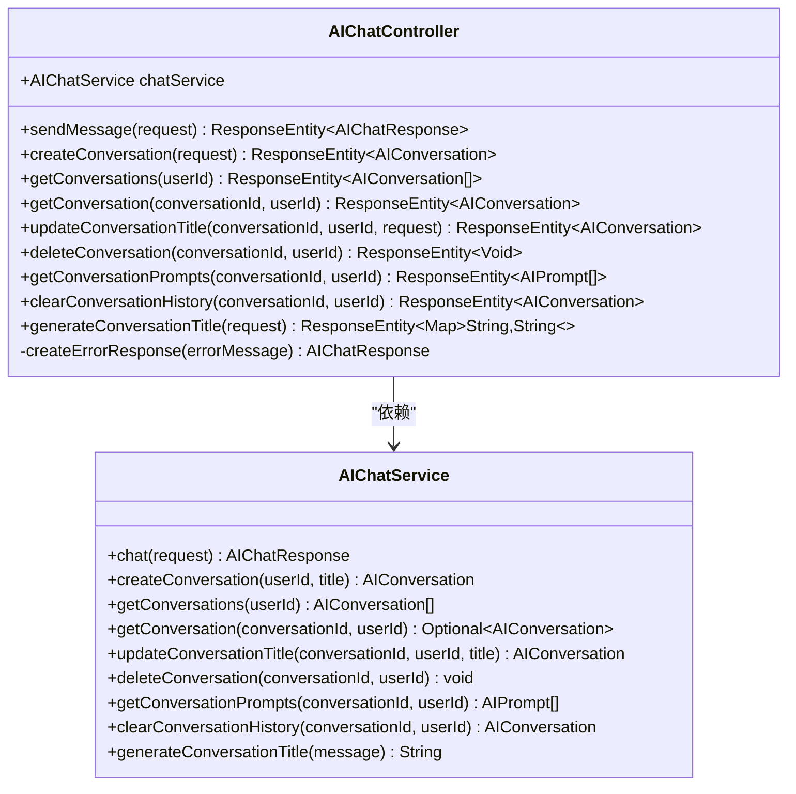
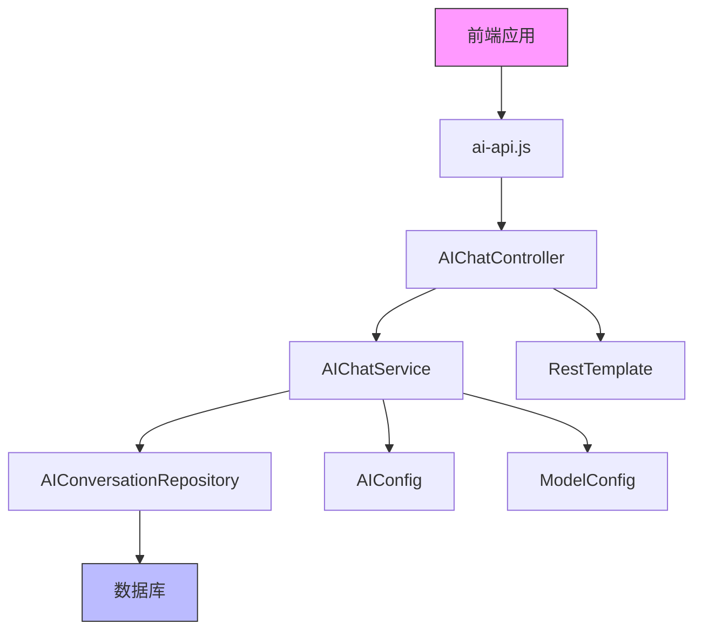
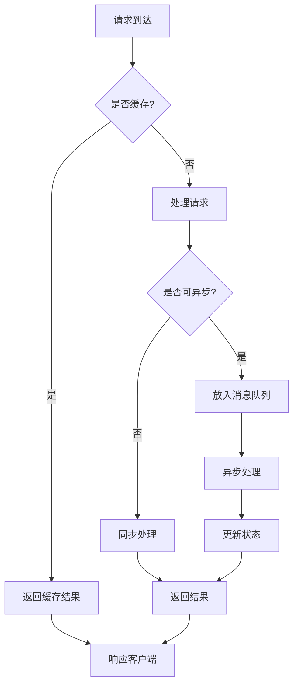
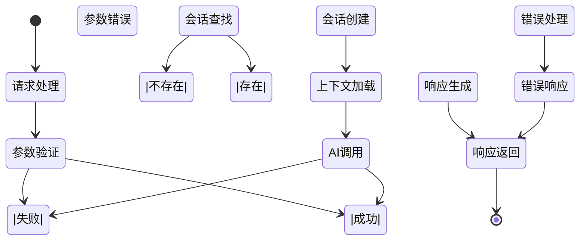

# AI对话接口

<cite>
**本文档引用文件**  
- [AIChatController.java](file://08-backend/src/main/java/com/enterprise/brain/modules/ai/controller/AIChatController.java)
- [AIChatRequest.java](file://08-backend/src/main/java/com/enterprise/brain/modules/ai/dto/request/AIChatRequest.java)
- [AIChatResponse.java](file://08-backend/src/main/java/com/enterprise/brain/modules/ai/dto/response/AIChatResponse.java)
- [AIChatServiceImpl.java](file://08-backend/src/main/java/com/enterprise/brain/modules/ai/service/impl/AIChatServiceImpl.java)
- [AIConversation.java](file://08-backend/src/main/java/com/enterprise/brain/modules/ai/entity/AIConversation.java)
- [AIPrompt.java](file://08-backend/src/main/java/com/enterprise/brain/modules/ai/entity/AIPrompt.java)
- [ai-api.js](file://07-frontend/src/services/api/ai-api.js)
</cite>

## 目录
1. [简介](#简介)
2. [项目结构](#项目结构)
3. [核心组件](#核心组件)
4. [架构概述](#架构概述)
5. [详细组件分析](#详细组件分析)
6. [依赖分析](#依赖分析)
7. [性能考虑](#性能考虑)
8. [故障排除指南](#故障排除指南)
9. [结论](#结论)

## 简介
本文档详细描述了企业级AI对话系统的RESTful接口设计与实现。系统提供完整的聊天会话管理功能，包括会话创建、消息发送、上下文维护等核心能力。后端采用Spring Boot框架实现，通过AIChatController暴露标准化API接口，前端通过ai-api.js进行封装调用。系统支持多模型选择、流式响应、对话历史管理等高级功能，并实现了完整的token计费和速率限制策略。

## 项目结构
AI对话功能主要分布在后端Java服务和前端JavaScript服务中，形成完整的MVC架构。



**图表来源**  
- [AIChatController.java](file://08-backend/src/main/java/com/enterprise/brain/modules/ai/controller/AIChatController.java#L1-L152)
- [ai-api.js](file://07-frontend/src/services/api/ai-api.js#L1-L284)

**章节来源**  
- [AIChatController.java](file://08-backend/src/main/java/com/enterprise/brain/modules/ai/controller/AIChatController.java#L1-L152)
- [ai-api.js](file://07-frontend/src/services/api/ai-api.js#L1-L284)

## 核心组件
系统核心组件包括AIChatController（控制器）、AIChatService（服务层）、AIConversation（实体）和ai-api.js（前端封装）。AIChatController处理所有RESTful请求，AIChatService实现业务逻辑，AIConversation实体管理对话状态，ai-api.js提供前端调用接口。这些组件协同工作，实现完整的AI对话功能。

**章节来源**  
- [AIChatController.java](file://08-backend/src/main/java/com/enterprise/brain/modules/ai/controller/AIChatController.java#L1-L152)
- [AIChatServiceImpl.java](file://08-backend/src/main/java/com/enterprise/brain/modules/ai/service/impl/AIChatServiceImpl.java#L1-L161)

## 架构概述
系统采用典型的分层架构，从前端到后端形成清晰的数据流。



**图表来源**  
- [AIChatController.java](file://08-backend/src/main/java/com/enterprise/brain/modules/ai/controller/AIChatController.java#L23-L34)
- [AIChatServiceImpl.java](file://08-backend/src/main/java/com/enterprise/brain/modules/ai/service/impl/AIChatServiceImpl.java#L34-L86)
- [ai-api.js](file://07-frontend/src/services/api/ai-api.js#L64-L66)

## 详细组件分析

### AIChatController分析
AIChatController是系统的核心控制器，负责处理所有AI对话相关的HTTP请求。



**图表来源**  
- [AIChatController.java](file://08-backend/src/main/java/com/enterprise/brain/modules/ai/controller/AIChatController.java#L17-L152)
- [AIChatService.java](file://08-backend/src/main/java/com/enterprise/brain/modules/ai/service/AIChatService.java#L11-L57)

**章节来源**  
- [AIChatController.java](file://08-backend/src/main/java/com/enterprise/brain/modules/ai/controller/AIChatController.java#L1-L152)

### AIChatRequest请求分析
AIChatRequest定义了发送消息请求的数据结构和参数配置。

```mermaid
classDiagram
class AIChatRequest {
-String conversationId
-String message
-String modelId
-Map~String,Object~ parameters
-boolean stream = false
-String systemPrompt
-Integer maxTokens
-Double temperature
-Double topP
-Boolean useHistory = true
-String userId
}
note right of AIChatRequest
conversationId : 对话ID，为空时创建新对话
message : 用户输入的提示内容
modelId : 使用的AI模型ID
parameters : 模型参数配置
stream : 是否启用流式响应
systemPrompt : 系统提示词
maxTokens : 最大token数
temperature : 温度参数，控制随机性
topP : 核采样参数
useHistory : 是否使用历史上下文
userId : 用户ID
end note
```

**图表来源**  
- [AIChatRequest.java](file://08-backend/src/main/java/com/enterprise/brain/modules/ai/dto/request/AIChatRequest.java#L7-L18)

**章节来源**  
- [AIChatRequest.java](file://08-backend/src/main/java/com/enterprise/brain/modules/ai/dto/request/AIChatRequest.java#L1-L18)

### 前端ai-api.js封装分析
前端通过ai-api.js对AI对话API进行封装，提供简洁的调用接口。

```mermaid
classDiagram
class aiApi {
+chatbot.sendMessage(data)
+chatbot.getHistory(params)
+chatbot.clearHistory()
+chatbot.getQuickReplies(context)
+chatbot.rateReply(data)
}
note right of aiApi
封装了所有AI对话相关的API调用
使用request.post等方法进行HTTP请求
提供Promise返回值，支持异步调用
包含错误处理和重试机制
end note
```

**图表来源**  
- [ai-api.js](file://07-frontend/src/services/api/ai-api.js#L62-L87)

**章节来源**  
- [ai-api.js](file://07-frontend/src/services/api/ai-api.js#L1-L284)

## 依赖分析
系统各组件之间存在明确的依赖关系，形成清晰的调用链。



**图表来源**  
- [AIChatController.java](file://08-backend/src/main/java/com/enterprise/brain/modules/ai/controller/AIChatController.java#L20-L21)
- [AIChatServiceImpl.java](file://08-backend/src/main/java/com/enterprise/brain/modules/ai/service/impl/AIChatServiceImpl.java#L21-L31)
- [ai-api.js](file://07-frontend/src/services/api/ai-api.js#L1-L284)

**章节来源**  
- [AIChatServiceImpl.java](file://08-backend/src/main/java/com/enterprise/brain/modules/ai/service/impl/AIChatServiceImpl.java#L1-L161)

## 性能考虑
系统在设计时考虑了多项性能优化策略，包括缓存机制、连接池和异步处理。



**图表来源**  
- [AIChatServiceImpl.java](file://08-backend/src/main/java/com/enterprise/brain/modules/ai/service/impl/AIChatServiceImpl.java#L34-L86)
- [api-integration.js](file://07-frontend/src/utils/integration/api-integration.js#L579-L624)

## 故障排除指南
系统提供了完善的错误处理机制，帮助开发者快速定位和解决问题。



**图表来源**  
- [AIChatController.java](file://08-backend/src/main/java/com/enterprise/brain/modules/ai/controller/AIChatController.java#L25-L33)
- [AIChatServiceImpl.java](file://08-backend/src/main/java/com/enterprise/brain/modules/ai/service/impl/AIChatServiceImpl.java#L34-L86)
- [error-codes.js](file://07-frontend/src/utils/error-handling/error-codes.js#L245-L293)

**章节来源**  
- [AIChatController.java](file://08-backend/src/main/java/com/enterprise/brain/modules/ai/controller/AIChatController.java#L146-L151)
- [error-codes.js](file://07-frontend/src/utils/error-handling/error-codes.js#L245-L293)

## 结论
本文档详细介绍了AI对话接口的设计与实现。系统通过清晰的分层架构和RESTful API设计，提供了完整的聊天会话管理功能。后端采用Spring Boot框架，前端通过JavaScript封装，实现了高效、可靠的AI对话服务。系统支持多模型选择、流式响应、对话历史管理等高级功能，并具备完善的错误处理和性能优化机制，为企业级AI应用提供了坚实的基础。