# AI智能分析API

<cite>
**本文档引用的文件**   
- [AIChatController.java](file://08-backend/src/main/java/com/enterprise/brain/modules/ai/controller/AIChatController.java)
- [AIModelController.java](file://08-backend/src/main/java/com/enterprise/brain/modules/ai/controller/AIModelController.java)
- [AIConversationController.java](file://08-backend/src/main/java/com/enterprise/brain/modules/ai/controller/AIConversationController.java)
- [AITrainingController.java](file://08-backend/src/main/java/com/enterprise/brain/modules/ai/controller/AITrainingController.java)
- [AIChatRequest.java](file://08-backend/src/main/java/com/enterprise/brain/modules/ai/dto/request/AIChatRequest.java)
- [AIChatResponse.java](file://08-backend/src/main/java/com/enterprise/brain/modules/ai/dto/response/AIChatResponse.java)
- [AIConversation.java](file://08-backend/src/main/java/com/enterprise/brain/modules/ai/entity/AIConversation.java)
- [AIModel.java](file://08-backend/src/main/java/com/enterprise/brain/modules/ai/entity/AIModel.java)
- [AIChatService.java](file://08-backend/src/main/java/com/enterprise/brain/modules/ai/service/AIChatService.java)
- [AIModelService.java](file://08-backend/src/main/java/com/enterprise/brain/modules/ai/service/AIModelService.java)
- [AIConfig.java](file://08-backend/src/main/java/com/enterprise/brain/modules/ai/config/AIConfig.java)
- [ai-api.js](file://07-frontend/src/services/api/ai-api.js)
</cite>

## 目录
1. [简介](#简介)
2. [项目结构](#项目结构)
3. [核心组件](#核心组件)
4. [架构概述](#架构概述)
5. [详细组件分析](#详细组件分析)
6. [依赖分析](#依赖分析)
7. [性能考虑](#性能考虑)
8. [故障排除指南](#故障排除指南)
9. [结论](#结论)

## 简介
本文档详细描述了AI智能分析模块的API接口，重点介绍AI对话和模型管理功能。文档涵盖了AIChatController中的聊天会话创建、消息发送、上下文管理等接口设计，包括AIChatRequest请求体的各个字段说明。同时记录了AI模型列表查询、模型部署、训练任务管理等操作接口。详细解释了流式响应的SSE实现机制，以及在ai-api.js中如何处理实时AI响应。还提供了对话历史管理、token计费、速率限制等高级功能的API说明。

## 项目结构
AI智能分析模块采用分层架构设计，后端基于Spring Boot框架实现，前端通过JavaScript调用API接口。系统主要分为控制器层、服务层、数据访问层和实体层，实现了清晰的职责分离。

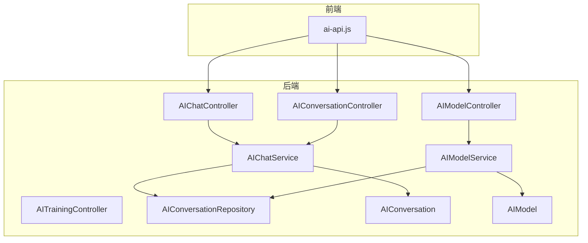

**图示来源**
- [AIChatController.java](file://08-backend/src/main/java/com/enterprise/brain/modules/ai/controller/AIChatController.java#L1-L152)
- [AIModelController.java](file://08-backend/src/main/java/com/enterprise/brain/modules/ai/controller/AIModelController.java#L1-L164)
- [ai-api.js](file://07-frontend/src/services/api/ai-api.js)

**本节来源**
- [AIChatController.java](file://08-backend/src/main/java/com/enterprise/brain/modules/ai/controller/AIChatController.java#L1-L152)
- [AIModelController.java](file://08-backend/src/main/java/com/enterprise/brain/modules/ai/controller/AIModelController.java#L1-L164)
- [AIConversationController.java](file://08-backend/src/main/java/com/enterprise/brain/modules/ai/controller/AIConversationController.java#L1-L111)

## 核心组件
AI智能分析模块的核心组件包括AI对话控制器、AI模型控制器、AI对话服务和AI模型服务。这些组件协同工作，提供完整的AI对话和模型管理功能。AIChatController负责处理聊天相关的API请求，包括消息发送、会话创建和上下文管理。AIModelController负责模型的生命周期管理，包括模型的查询、部署和配置。AIChatService和AIModelService作为服务层，封装了业务逻辑，与数据访问层进行交互。

**本节来源**
- [AIChatController.java](file://08-backend/src/main/java/com/enterprise/brain/modules/ai/controller/AIChatController.java#L1-L152)
- [AIModelController.java](file://08-backend/src/main/java/com/enterprise/brain/modules/ai/controller/AIModelController.java#L1-L164)
- [AIChatService.java](file://08-backend/src/main/java/com/enterprise/brain/modules/ai/service/AIChatService.java#L1-L57)

## 架构概述
AI智能分析模块采用典型的三层架构：表现层、业务逻辑层和数据访问层。表现层由控制器类组成，负责接收HTTP请求并返回响应。业务逻辑层由服务类实现，处理核心业务逻辑。数据访问层通过Repository接口与数据库交互。

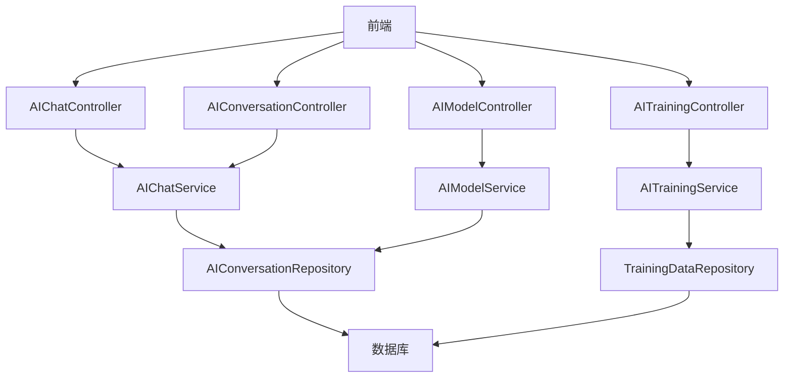

**图示来源**
- [AIChatController.java](file://08-backend/src/main/java/com/enterprise/brain/modules/ai/controller/AIChatController.java#L1-L152)
- [AIModelController.java](file://08-backend/src/main/java/com/enterprise/brain/modules/ai/controller/AIModelController.java#L1-L164)
- [AIConversationController.java](file://08-backend/src/main/java/com/enterprise/brain/modules/ai/controller/AIConversationController.java#L1-L111)
- [AITrainingController.java](file://08-backend/src/main/java/com/enterprise/brain/modules/ai/controller/AITrainingController.java#L1-L169)

## 详细组件分析

### AI对话控制器分析
AIChatController是处理AI对话相关请求的核心组件，提供了完整的聊天会话管理功能。

#### 类图
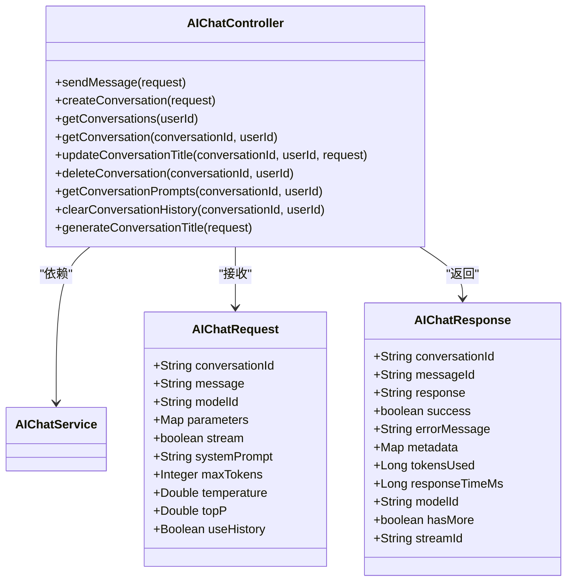

**图示来源**
- [AIChatController.java](file://08-backend/src/main/java/com/enterprise/brain/modules/ai/controller/AIChatController.java#L1-L152)
- [AIChatRequest.java](file://08-backend/src/main/java/com/enterprise/brain/modules/ai/dto/request/AIChatRequest.java#L1-L18)
- [AIChatResponse.java](file://08-backend/src/main/java/com/enterprise/brain/modules/ai/dto/response/AIChatResponse.java#L1-L19)

#### API接口说明
AIChatController提供了以下主要API接口：

| 接口路径 | HTTP方法 | 功能描述 | 请求参数 | 响应状态 |
|---------|---------|---------|---------|---------|
| /api/ai/chat/send | POST | 发送消息到AI模型 | AIChatRequest | 200成功，400参数错误，500服务器错误 |
| /api/ai/chat/conversations | POST | 创建新的对话会话 | userId, title | 201创建成功，400参数错误，500服务器错误 |
| /api/ai/chat/conversations/{userId} | GET | 获取用户的所有对话 | userId | 200成功，500服务器错误 |
| /api/ai/chat/conversations/detail/{conversationId}/{userId} | GET | 获取特定对话的详细信息 | conversationId, userId | 200成功，404未找到，500服务器错误 |
| /api/ai/chat/conversations/{conversationId}/{userId}/title | PUT | 更新对话标题 | conversationId, userId, title | 200成功，400参数错误，500服务器错误 |
| /api/ai/chat/conversations/{conversationId}/{userId} | DELETE | 删除对话 | conversationId, userId | 204删除成功，500服务器错误 |
| /api/ai/chat/conversations/{conversationId}/{userId}/prompts | GET | 获取对话中的提示历史 | conversationId, userId | 200成功，500服务器错误 |
| /api/ai/chat/conversations/{conversationId}/{userId}/clear | PUT | 清除对话历史 | conversationId, userId | 200成功，500服务器错误 |
| /api/ai/chat/generate-title | POST | 根据消息内容生成对话标题 | message | 200成功，400参数错误，500服务器错误 |

**本节来源**
- [AIChatController.java](file://08-backend/src/main/java/com/enterprise/brain/modules/ai/controller/AIChatController.java#L1-L152)
- [AIChatRequest.java](file://08-backend/src/main/java/com/enterprise/brain/modules/ai/dto/request/AIChatRequest.java#L1-L18)
- [AIChatResponse.java](file://08-backend/src/main/java/com/enterprise/brain/modules/ai/dto/response/AIChatResponse.java#L1-L19)

### AI模型管理分析
AIModelController负责AI模型的全生命周期管理，包括模型的查询、创建、更新、删除、部署和配置。

#### 类图
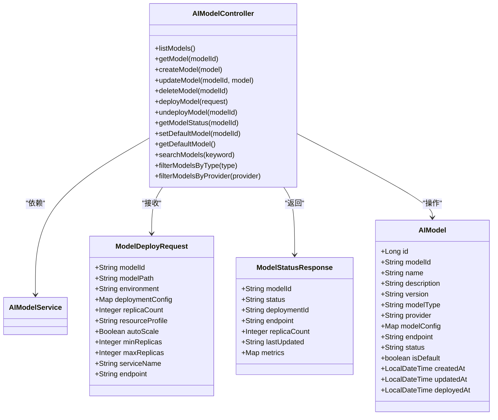

**图示来源**
- [AIModelController.java](file://08-backend/src/main/java/com/enterprise/brain/modules/ai/controller/AIModelController.java#L1-L164)
- [ModelDeployRequest.java](file://08-backend/src/main/java/com/enterprise/brain/modules/ai/dto/request/ModelDeployRequest.java#L1-L19)
- [AIModel.java](file://08-backend/src/main/java/com/enterprise/brain/modules/ai/entity/AIModel.java#L1-L44)

#### API接口说明
AIModelController提供了以下主要API接口：

| 接口路径 | HTTP方法 | 功能描述 | 请求参数 | 响应状态 |
|---------|---------|---------|---------|---------|
| /api/ai/models | GET | 获取所有模型列表 | 无 | 200成功，500服务器错误 |
| /api/ai/models/{modelId} | GET | 获取特定模型信息 | modelId | 200成功，404未找到，500服务器错误 |
| /api/ai/models | POST | 创建新模型 | AIModel对象 | 201创建成功，500服务器错误 |
| /api/ai/models/{modelId} | PUT | 更新模型信息 | modelId, AIModel对象 | 200成功，404未找到，500服务器错误 |
| /api/ai/models/{modelId} | DELETE | 删除模型 | modelId | 204删除成功，404未找到，500服务器错误 |
| /api/ai/models/deploy | POST | 部署模型 | ModelDeployRequest | 201创建成功，404未找到，500服务器错误 |
| /api/ai/models/{modelId}/deploy | DELETE | 取消部署模型 | modelId | 204删除成功，404未找到，500服务器错误 |
| /api/ai/models/{modelId}/status | GET | 获取模型部署状态 | modelId | 200成功，404未找到，500服务器错误 |
| /api/ai/models/{modelId}/default | PUT | 设置默认模型 | modelId | 200成功，404未找到，500服务器错误 |
| /api/ai/models/default | GET | 获取默认模型 | 无 | 200成功，404未找到，500服务器错误 |
| /api/ai/models/search | GET | 搜索模型 | keyword | 200成功，500服务器错误 |
| /api/ai/models/filter/type | GET | 按类型筛选模型 | type | 200成功，500服务器错误 |
| /api/ai/models/filter/provider | GET | 按提供商筛选模型 | provider | 200成功，500服务器错误 |

**本节来源**
- [AIModelController.java](file://08-backend/src/main/java/com/enterprise/brain/modules/ai/controller/AIModelController.java#L1-L164)
- [ModelDeployRequest.java](file://08-backend/src/main/java/com/enterprise/brain/modules/ai/dto/request/ModelDeployRequest.java#L1-L19)
- [AIModel.java](file://08-backend/src/main/java/com/enterprise/brain/modules/ai/entity/AIModel.java#L1-L44)

### AI对话服务分析
AIChatService是AI对话功能的核心服务层，封装了所有与AI对话相关的业务逻辑。

#### 类图
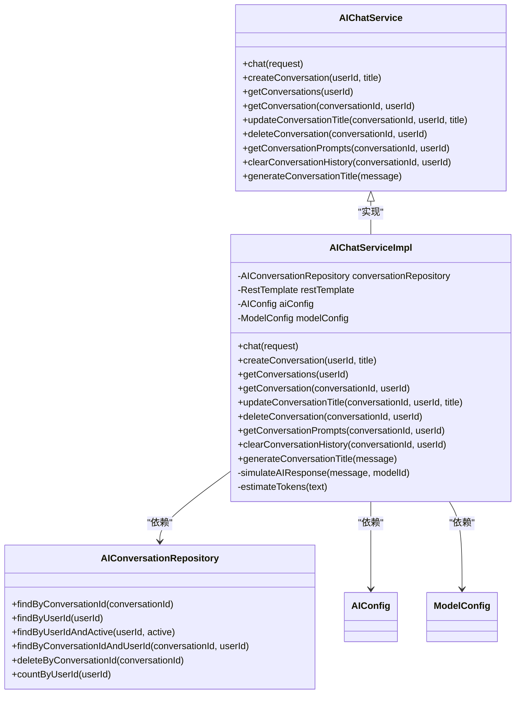

**图示来源**
- [AIChatService.java](file://08-backend/src/main/java/com/enterprise/brain/modules/ai/service/AIChatService.java#L1-L57)
- [AIChatServiceImpl.java](file://08-backend/src/main/java/com/enterprise/brain/modules/ai/service/impl/AIChatServiceImpl.java#L1-L161)
- [AIConversationRepository.java](file://08-backend/src/main/java/com/enterprise/brain/modules/ai/repository/AIConversationRepository.java#L1-L24)

#### 核心功能流程
AIChatService的核心功能流程包括消息处理、会话管理和上下文维护。

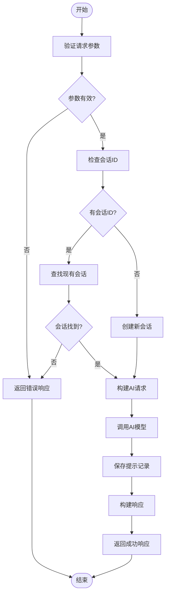

**图示来源**
- [AIChatServiceImpl.java](file://08-backend/src/main/java/com/enterprise/brain/modules/ai/service/impl/AIChatServiceImpl.java#L1-L161)
- [AIConversationRepository.java](file://08-backend/src/main/java/com/enterprise/brain/modules/ai/repository/AIConversationRepository.java#L1-L24)

**本节来源**
- [AIChatService.java](file://08-backend/src/main/java/com/enterprise/brain/modules/ai/service/AIChatService.java#L1-L57)
- [AIChatServiceImpl.java](file://08-backend/src/main/java/com/enterprise/brain/modules/ai/service/impl/AIChatServiceImpl.java#L1-L161)
- [AIConversationRepository.java](file://08-backend/src/main/java/com/enterprise/brain/modules/ai/repository/AIConversationRepository.java#L1-L24)

### AI模型服务分析
AIModelService是AI模型管理功能的核心服务层，负责模型的全生命周期管理。

#### 类图
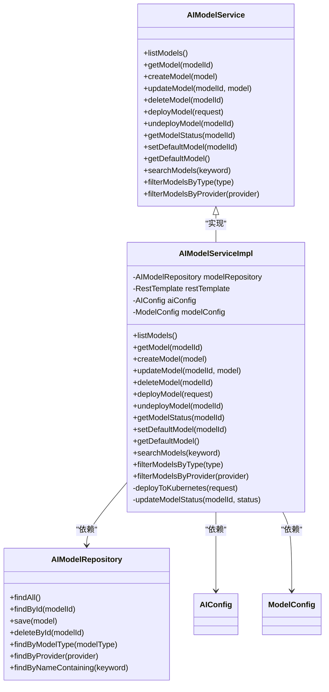

**图示来源**
- [AIModelService.java](file://08-backend/src/main/java/com/enterprise/brain/modules/ai/service/AIModelService.java#L1-L76)
- [AIModelRepository.java](file://08-backend/src/main/java/com/enterprise/brain/modules/ai/repository/AIModelRepository.java)
- [AIConfig.java](file://08-backend/src/main/java/com/enterprise/brain/modules/ai/config/AIConfig.java#L1-L102)

**本节来源**
- [AIModelService.java](file://08-backend/src/main/java/com/enterprise/brain/modules/ai/service/AIModelService.java#L1-L76)
- [AIModelRepository.java](file://08-backend/src/main/java/com/enterprise/brain/modules/ai/repository/AIModelRepository.java)
- [AIConfig.java](file://08-backend/src/main/java/com/enterprise/brain/modules/ai/config/AIConfig.java#L1-L102)

### AI训练管理分析
AITrainingController负责AI模型的训练任务管理，包括训练作业的创建、监控和数据管理。

#### 类图
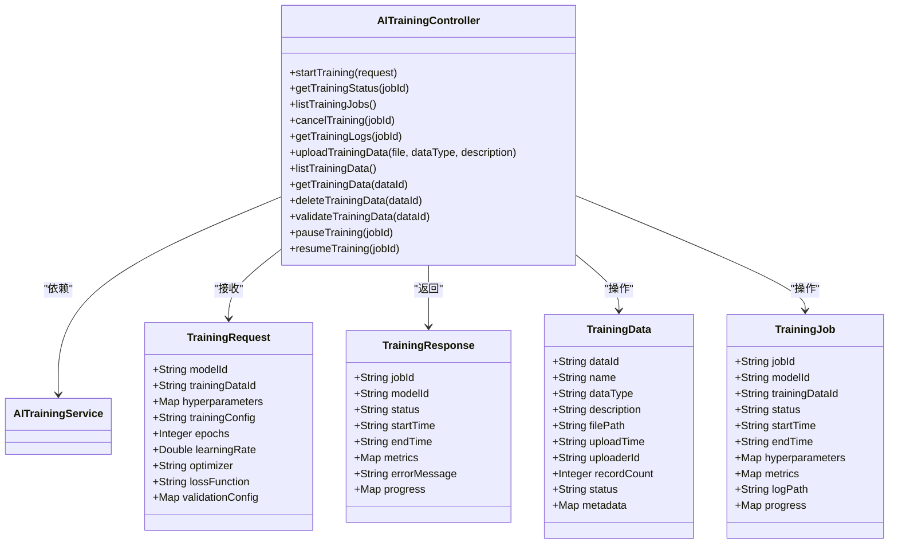

**图示来源**
- [AITrainingController.java](file://08-backend/src/main/java/com/enterprise/brain/modules/ai/controller/AITrainingController.java#L1-L169)
- [TrainingRequest.java](file://08-backend/src/main/java/com/enterprise/brain/modules/ai/dto/request/TrainingRequest.java)
- [TrainingData.java](file://08-backend/src/main/java/com/enterprise/brain/modules/ai/entity/TrainingData.java)

**本节来源**
- [AITrainingController.java](file://08-backend/src/main/java/com/enterprise/brain/modules/ai/controller/AITrainingController.java#L1-L169)
- [TrainingRequest.java](file://08-backend/src/main/java/com/enterprise/brain/modules/ai/dto/request/TrainingRequest.java)
- [TrainingData.java](file://08-backend/src/main/java/com/enterprise/brain/modules/ai/entity/TrainingData.java)

### SSE流式响应机制
服务器发送事件（SSE）机制用于实现实时AI响应的流式传输，使前端能够逐步接收AI生成的内容。

#### 序列图
```mermaid
sequenceDiagram
participant Frontend as "前端"
participant AIController as "AIChatController"
participant AIService as "AIChatService"
participant AIModel as "AI模型"
Frontend->>AIController : POST /api/ai/chat/send
activate AIController
AIController->>AIService : chat(request)
activate AIService
AIService->>AIModel : 调用AI模型API
activate AIModel
AIModel-->>AIService : 开始流式响应
AIService-->>AIController : 逐块转发响应
AIController-->>Frontend : text/event-stream响应
loop 持续传输
AIModel->>AIService : 发送数据块
AIService->>AIController : 转发数据块
AIController->>Frontend : 发送event : message
end
AIModel-->>AIService : 完成响应
deactivate AIModel
AIService-->>AIController : 发送完成事件
AIController->>Frontend : event : complete
deactivate AIController
deactivate AIService
Frontend : 处理完整响应
```

**图示来源**
- [AIChatController.java](file://08-backend/src/main/java/com/enterprise/brain/modules/ai/controller/AIChatController.java#L1-L152)
- [AIChatService.java](file://08-backend/src/main/java/com/enterprise/brain/modules/ai/service/AIChatService.java#L1-L57)
- [ai-api.js](file://07-frontend/src/services/api/ai-api.js)

### 前端AI API处理
前端通过ai-api.js文件中的API客户端处理与后端的通信，特别是SSE流式响应的处理。

#### 流程图
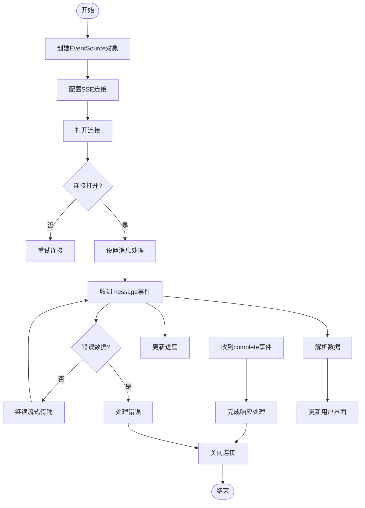

**图示来源**
- [ai-api.js](file://07-frontend/src/services/api/ai-api.js)
- [AIChatController.java](file://08-backend/src/main/java/com/enterprise/brain/modules/ai/controller/AIChatController.java#L1-L152)

**本节来源**
- [ai-api.js](file://07-frontend/src/services/api/ai-api.js)
- [AIChatController.java](file://08-backend/src/main/java/com/enterprise/brain/modules/ai/controller/AIChatController.java#L1-L152)

## 依赖分析
AI智能分析模块的依赖关系清晰，各组件之间通过定义良好的接口进行通信，实现了低耦合和高内聚的设计原则。

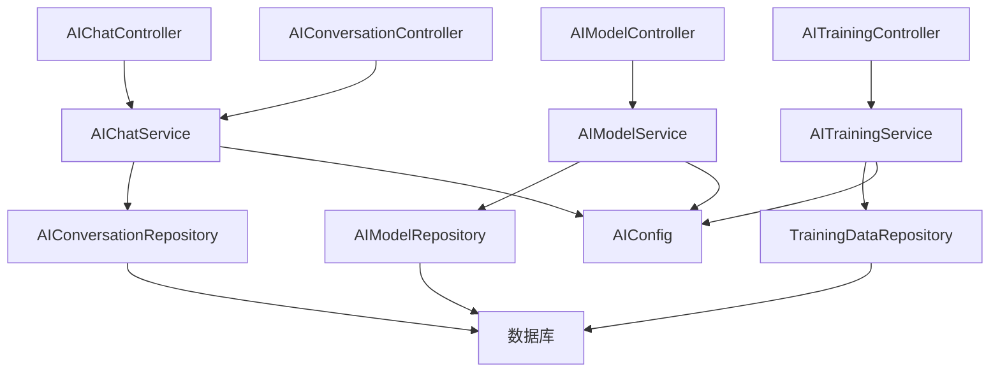

**图示来源**
- [AIChatController.java](file://08-backend/src/main/java/com/enterprise/brain/modules/ai/controller/AIChatController.java#L1-L152)
- [AIModelController.java](file://08-backend/src/main/java/com/enterprise/brain/modules/ai/controller/AIModelController.java#L1-L164)
- [AIConversationController.java](file://08-backend/src/main/java/com/enterprise/brain/modules/ai/controller/AIConversationController.java#L1-L111)
- [AITrainingController.java](file://08-backend/src/main/java/com/enterprise/brain/modules/ai/controller/AITrainingController.java#L1-L169)

**本节来源**
- [AIChatController.java](file://08-backend/src/main/java/com/enterprise/brain/modules/ai/controller/AIChatController.java#L1-L152)
- [AIModelController.java](file://08-backend/src/main/java/com/enterprise/brain/modules/ai/controller/AIModelController.java#L1-L164)
- [AIConversationController.java](file://08-backend/src/main/java/com/enterprise/brain/modules/ai/controller/AIConversationController.java#L1-L111)
- [AITrainingController.java](file://08-backend/src/main/java/com/enterprise/brain/modules/ai/controller/AITrainingController.java#L1-L169)

## 性能考虑
AI智能分析模块在设计时考虑了多项性能优化措施，包括缓存机制、连接池配置和异步处理。

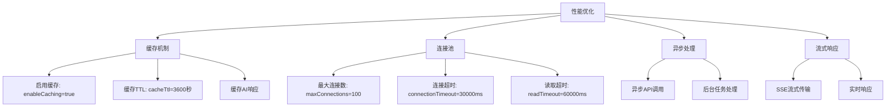

**图示来源**
- [AIConfig.java](file://08-backend/src/main/java/com/enterprise/brain/modules/ai/config/AIConfig.java#L1-L102)
- [AIChatController.java](file://08-backend/src/main/java/com/enterprise/brain/modules/ai/controller/AIChatController.java#L1-L152)

## 故障排除指南
当AI智能分析模块出现问题时，可以按照以下步骤进行排查：

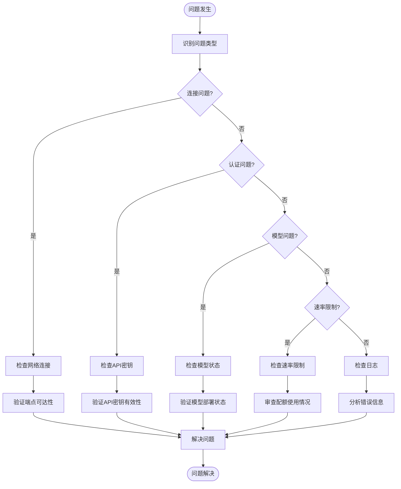

**本节来源**
- [AIChatController.java](file://08-backend/src/main/java/com/enterprise/brain/modules/ai/controller/AIChatController.java#L1-L152)
- [AIModelController.java](file://08-backend/src/main/java/com/enterprise/brain/modules/ai/controller/AIModelController.java#L1-L164)
- [AIConfig.java](file://08-backend/src/main/java/com/enterprise/brain/modules/ai/config/AIConfig.java#L1-L102)

## 结论
AI智能分析模块提供了一套完整的AI对话和模型管理API，具有良好的架构设计和清晰的接口定义。系统通过分层架构实现了关注点分离，通过SSE机制提供了实时流式响应能力。模块支持对话历史管理、模型生命周期管理、训练任务管理等高级功能，满足企业级AI应用的需求。通过合理的性能优化和错误处理机制，确保了系统的稳定性和可靠性。