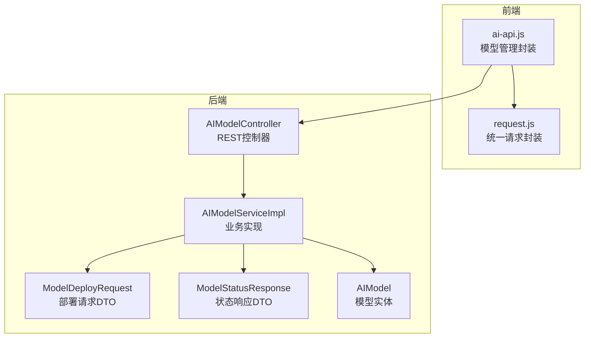
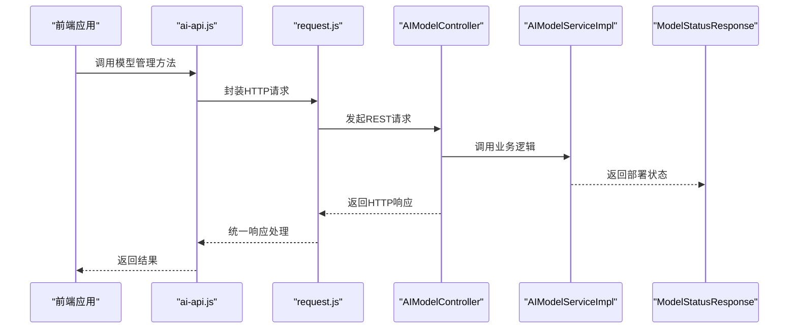
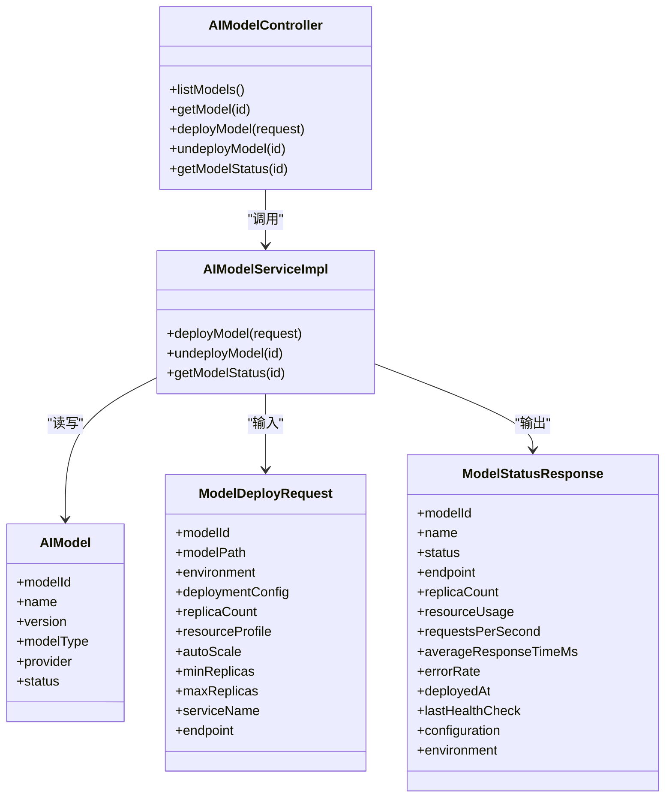

# AI模型管理接口

<cite>
**本文引用的文件**
- [AIModelController.java](file://08-backend/src/main/java/com/enterprise/brain/modules/ai/controller/AIModelController.java)
- [AIModel.java](file://08-backend/src/main/java/com/enterprise/brain/modules/ai/entity/AIModel.java)
- [ModelDeployRequest.java](file://08-backend/src/main/java/com/enterprise/brain/modules/ai/dto/request/ModelDeployRequest.java)
- [ModelStatusResponse.java](file://08-backend/src/main/java/com/enterprise/brain/modules/ai/dto/response/ModelStatusResponse.java)
- [AIModelServiceImpl.java](file://08-backend/src/main/java/com/enterprise/brain/modules/ai/service/impl/AIModelServiceImpl.java)
- [ai-api.js](file://07-frontend/src/services/api/ai-api.js)
- [request.js](file://07-frontend/src/utils/request.js)
</cite>

## 目录
1. [简介](#简介)
2. [项目结构](#项目结构)
3. [核心组件](#核心组件)
4. [架构总览](#架构总览)
5. [详细组件分析](#详细组件分析)
6. [依赖关系分析](#依赖关系分析)
7. [性能考虑](#性能考虑)
8. [故障排查指南](#故障排查指南)
9. [结论](#结论)
10. [附录](#附录)

## 简介
本文件面向后端与前端开发者，系统性梳理AI模型管理接口，重点覆盖：
- 模型列表查询与筛选
- 模型详情获取
- 模型部署与启停
- 模型状态查询
- 部署进度获取方式
- 权限控制与安全约束
- 前端封装与调用示例

目标是帮助读者快速理解接口定义、数据结构、调用流程与最佳实践。

## 项目结构
后端采用Spring MVC控制器层，前端通过统一请求封装进行HTTP调用。AI模型管理相关的关键位置如下：
- 后端控制器：AIModelController 提供REST接口
- 实体与DTO：AIModel、ModelDeployRequest、ModelStatusResponse
- 服务实现：AIModelServiceImpl 执行业务逻辑
- 前端封装：ai-api.js 对外暴露模型管理API；request.js 统一处理鉴权与错误

图表来源
- [AIModelController.java](file://08-backend/src/main/java/com/enterprise/brain/modules/ai/controller/AIModelController.java#L1-L164)
- [AIModelServiceImpl.java](file://08-backend/src/main/java/com/enterprise/brain/modules/ai/service/impl/AIModelServiceImpl.java#L100-L156)
- [ModelDeployRequest.java](file://08-backend/src/main/java/com/enterprise/brain/modules/ai/dto/request/ModelDeployRequest.java#L1-L19)
- [ModelStatusResponse.java](file://08-backend/src/main/java/com/enterprise/brain/modules/ai/dto/response/ModelStatusResponse.java#L1-L22)
- [AIModel.java](file://08-backend/src/main/java/com/enterprise/brain/modules/ai/entity/AIModel.java#L1-L44)
- [ai-api.js](file://07-frontend/src/services/api/ai-api.js#L173-L209)
- [request.js](file://07-frontend/src/utils/request.js#L1-L191)

章节来源
- [AIModelController.java](file://08-backend/src/main/java/com/enterprise/brain/modules/ai/controller/AIModelController.java#L1-L164)
- [ai-api.js](file://07-frontend/src/services/api/ai-api.js#L173-L209)
- [request.js](file://07-frontend/src/utils/request.js#L1-L191)

## 核心组件
- 控制器层：AIModelController 定义了模型管理的REST接口，包括列表、详情、创建、更新、删除、部署、启停、状态查询、默认模型设置等。
- 服务层：AIModelServiceImpl 实现部署、启停、状态查询等核心逻辑，并维护内存中的部署状态映射。
- DTO层：ModelDeployRequest 描述部署请求参数；ModelStatusResponse 描述部署后的状态与指标。
- 实体层：AIModel 描述模型的基本属性（名称、版本、类型、提供商、状态等）。

章节来源
- [AIModelController.java](file://08-backend/src/main/java/com/enterprise/brain/modules/ai/controller/AIModelController.java#L1-L164)
- [AIModelServiceImpl.java](file://08-backend/src/main/java/com/enterprise/brain/modules/ai/service/impl/AIModelServiceImpl.java#L100-L156)
- [ModelDeployRequest.java](file://08-backend/src/main/java/com/enterprise/brain/modules/ai/dto/request/ModelDeployRequest.java#L1-L19)
- [ModelStatusResponse.java](file://08-backend/src/main/java/com/enterprise/brain/modules/ai/dto/response/ModelStatusResponse.java#L1-L22)
- [AIModel.java](file://08-backend/src/main/java/com/enterprise/brain/modules/ai/entity/AIModel.java#L1-L44)

## 架构总览
下图展示从前端到后端的典型调用链路，以及部署状态的流转。

图表来源
- [ai-api.js](file://07-frontend/src/services/api/ai-api.js#L173-L209)
- [request.js](file://07-frontend/src/utils/request.js#L1-L191)
- [AIModelController.java](file://08-backend/src/main/java/com/enterprise/brain/modules/ai/controller/AIModelController.java#L76-L110)
- [AIModelServiceImpl.java](file://08-backend/src/main/java/com/enterprise/brain/modules/ai/service/impl/AIModelServiceImpl.java#L100-L156)
- [ModelStatusResponse.java](file://08-backend/src/main/java/com/enterprise/brain/modules/ai/dto/response/ModelStatusResponse.java#L1-L22)

## 详细组件分析

### 接口清单与行为说明
- GET /api/ai/models
  - 功能：获取可用模型列表
  - 返回：模型数组，元素为AIModel对象
  - 典型字段：模型标识、名称、版本、类型、提供商、状态、创建/更新时间等
  - 章节来源
    - [AIModelController.java](file://08-backend/src/main/java/com/enterprise/brain/modules/ai/controller/AIModelController.java#L21-L29)
    - [AIModel.java](file://08-backend/src/main/java/com/enterprise/brain/modules/ai/entity/AIModel.java#L12-L44)

- GET /api/ai/models/{modelId}
  - 功能：获取指定模型详情
  - 返回：单个AIModel对象
  - 章节来源
    - [AIModelController.java](file://08-backend/src/main/java/com/enterprise/brain/modules/ai/controller/AIModelController.java#L31-L40)
    - [AIModel.java](file://08-backend/src/main/java/com/enterprise/brain/modules/ai/entity/AIModel.java#L12-L44)

- POST /api/ai/models
  - 功能：创建新模型
  - 请求体：AIModel对象
  - 返回：创建成功的AIModel对象
  - 章节来源
    - [AIModelController.java](file://08-backend/src/main/java/com/enterprise/brain/modules/ai/controller/AIModelController.java#L42-L50)

- PUT /api/ai/models/{modelId}
  - 功能：更新模型信息
  - 请求体：AIModel对象
  - 返回：更新后的AIModel对象
  - 章节来源
    - [AIModelController.java](file://08-backend/src/main/java/com/enterprise/brain/modules/ai/controller/AIModelController.java#L52-L62)

- DELETE /api/ai/models/{modelId}
  - 功能：删除模型
  - 返回：无内容
  - 章节来源
    - [AIModelController.java](file://08-backend/src/main/java/com/enterprise/brain/modules/ai/controller/AIModelController.java#L64-L74)

- POST /api/ai/models/deploy
  - 功能：部署模型
  - 请求体：ModelDeployRequest
  - 返回：ModelStatusResponse（包含部署状态、端点、副本数、资源使用、性能指标、配置、环境等）
  - 章节来源
    - [AIModelController.java](file://08-backend/src/main/java/com/enterprise/brain/modules/ai/controller/AIModelController.java#L76-L86)
    - [ModelDeployRequest.java](file://08-backend/src/main/java/com/enterprise/brain/modules/ai/dto/request/ModelDeployRequest.java#L1-L19)
    - [ModelStatusResponse.java](file://08-backend/src/main/java/com/enterprise/brain/modules/ai/dto/response/ModelStatusResponse.java#L1-L22)
    - [AIModelServiceImpl.java](file://08-backend/src/main/java/com/enterprise/brain/modules/ai/service/impl/AIModelServiceImpl.java#L100-L137)

- DELETE /api/ai/models/{modelId}/deploy
  - 功能：取消部署（停止）
  - 返回：无内容
  - 章节来源
    - [AIModelController.java](file://08-backend/src/main/java/com/enterprise/brain/modules/ai/controller/AIModelController.java#L88-L98)
    - [AIModelServiceImpl.java](file://08-backend/src/main/java/com/enterprise/brain/modules/ai/service/impl/AIModelServiceImpl.java#L140-L149)

- GET /api/ai/models/{modelId}/status
  - 功能：查询模型当前状态
  - 返回：ModelStatusResponse
  - 章节来源
    - [AIModelController.java](file://08-backend/src/main/java/com/enterprise/brain/modules/ai/controller/AIModelController.java#L100-L110)
    - [AIModelServiceImpl.java](file://08-backend/src/main/java/com/enterprise/brain/modules/ai/service/impl/AIModelServiceImpl.java#L151-L156)

- PUT /api/ai/models/{modelId}/default
  - 功能：设置默认模型
  - 返回：默认模型AIModel对象
  - 章节来源
    - [AIModelController.java](file://08-backend/src/main/java/com/enterprise/brain/modules/ai/controller/AIModelController.java#L112-L122)

- GET /api/ai/models/default
  - 功能：获取默认模型
  - 返回：AIModel对象或未找到
  - 章节来源
    - [AIModelController.java](file://08-backend/src/main/java/com/enterprise/brain/modules/ai/controller/AIModelController.java#L124-L133)

- GET /api/ai/models/search?keyword={keyword}
  - 功能：按关键词搜索模型
  - 返回：AIModel列表
  - 章节来源
    - [AIModelController.java](file://08-backend/src/main/java/com/enterprise/brain/modules/ai/controller/AIModelController.java#L135-L143)

- GET /api/ai/models/filter?type={type}
  - 功能：按类型过滤模型
  - 返回：AIModel列表
  - 章节来源
    - [AIModelController.java](file://08-backend/src/main/java/com/enterprise/brain/modules/ai/controller/AIModelController.java#L145-L153)

- GET /api/ai/models/filter?provider={provider}
  - 功能：按提供商过滤模型
  - 返回：AIModel列表
  - 章节来源
    - [AIModelController.java](file://08-backend/src/main/java/com/enterprise/brain/modules/ai/controller/AIModelController.java#L155-L163)

### 响应结构说明（以“可用模型列表”为例）
- 列表项类型：AIModel
- 关键字段（示例）：模型标识、名称、版本、类型、提供商、状态、是否默认、创建/更新/部署时间等
- 字段来源
  - [AIModel.java](file://08-backend/src/main/java/com/enterprise/brain/modules/ai/entity/AIModel.java#L12-L44)

章节来源
- [AIModelController.java](file://08-backend/src/main/java/com/enterprise/brain/modules/ai/controller/AIModelController.java#L21-L29)
- [AIModel.java](file://08-backend/src/main/java/com/enterprise/brain/modules/ai/entity/AIModel.java#L12-L44)

### 部署请求参数（ModelDeployRequest）
- 关键字段与含义（示例）：
  - modelId：要部署的模型标识
  - modelPath：模型路径（本地/远程）
  - environment：部署环境（默认生产）
  - deploymentConfig：部署配置（Map）
  - replicaCount：副本数量（默认1）
  - resourceProfile：资源规格（默认standard）
  - autoScale：是否自动扩缩容
  - minReplicas/maxReplicas：最小/最大副本数
  - serviceName：服务名
  - endpoint：自定义端点
- 字段来源
  - [ModelDeployRequest.java](file://08-backend/src/main/java/com/enterprise/brain/modules/ai/dto/request/ModelDeployRequest.java#L1-L19)

章节来源
- [ModelDeployRequest.java](file://08-backend/src/main/java/com/enterprise/brain/modules/ai/dto/request/ModelDeployRequest.java#L1-L19)

### 状态响应（ModelStatusResponse）
- 关键字段与含义（示例）：
  - modelId、name：模型标识与名称
  - status：部署状态（如已部署）
  - endpoint：服务端点
  - replicaCount：副本数
  - resourceUsage：资源使用（CPU/Memory/GPU等）
  - requestsPerSecond、averageResponseTimeMs、errorRate：性能指标
  - deployedAt、lastHealthCheck：时间戳
  - configuration：部署配置
  - environment：环境
- 字段来源
  - [ModelStatusResponse.java](file://08-backend/src/main/java/com/enterprise/brain/modules/ai/dto/response/ModelStatusResponse.java#L1-L22)

章节来源
- [ModelStatusResponse.java](file://08-backend/src/main/java/com/enterprise/brain/modules/ai/dto/response/ModelStatusResponse.java#L1-L22)

### 部署流程与状态管理
- 部署流程（简化）：
  1) 前端调用POST /api/ai/models/deploy，携带ModelDeployRequest
  2) 控制器转发至服务层
  3) 服务层校验模型存在性并模拟部署，填充ModelStatusResponse
  4) 返回201 Created与状态信息
- 状态查询：
  - 前端可轮询GET /api/ai/models/{modelId}/status获取最新状态
- 启停：
  - 启动：POST /api/ai/models/deploy
  - 停止：DELETE /api/ai/models/{modelId}/deploy
- 字段来源
  - [AIModelController.java](file://08-backend/src/main/java/com/enterprise/brain/modules/ai/controller/AIModelController.java#L76-L110)
  - [AIModelServiceImpl.java](file://08-backend/src/main/java/com/enterprise/brain/modules/ai/service/impl/AIModelServiceImpl.java#L100-L149)

章节来源
- [AIModelController.java](file://08-backend/src/main/java/com/enterprise/brain/modules/ai/controller/AIModelController.java#L76-L110)
- [AIModelServiceImpl.java](file://08-backend/src/main/java/com/enterprise/brain/modules/ai/service/impl/AIModelServiceImpl.java#L100-L149)

### 权限控制与安全
- 鉴权机制：
  - 前端请求通过request.js统一注入Authorization头（Bearer Token）
  - 401时统一弹窗并跳转登录
- 权限策略建议：
  - 在控制器或服务层增加基于角色/资源的权限校验（例如仅模型所有者或管理员可部署/启停）
  - 结合后端注解或拦截器实现细粒度授权
- 字段来源
  - [request.js](file://07-frontend/src/utils/request.js#L1-L108)

章节来源
- [request.js](file://07-frontend/src/utils/request.js#L1-L108)

### 前端封装与使用示例
- 前端封装位置：ai-api.js
- 关键方法（路径引用）：
  - 获取模型列表：[ai-api.js](file://07-frontend/src/services/api/ai-api.js#L176-L178)
  - 获取模型详情：[ai-api.js](file://07-frontend/src/services/api/ai-api.js#L181-L183)
  - 部署模型：[ai-api.js](file://07-frontend/src/services/api/ai-api.js#L196-L198)
  - 取消部署：[ai-api.js](file://07-frontend/src/services/api/ai-api.js#L201-L203)
  - 获取部署状态：[ai-api.js](file://07-frontend/src/services/api/ai-api.js#L206-L208)
- 使用要点：
  - 所有方法均通过request.js封装，自动处理鉴权与错误
  - 部署时传入部署请求参数（参考ModelDeployRequest）
  - 状态查询支持轮询或WebSocket（见下一节）

章节来源
- [ai-api.js](file://07-frontend/src/services/api/ai-api.js#L173-L209)
- [request.js](file://07-frontend/src/utils/request.js#L1-L191)

### 部署进度获取（轮询与WebSocket）
- 轮询方案：
  - 前端定时调用GET /api/ai/models/{modelId}/status，根据status字段判断部署完成
- WebSocket方案：
  - 建议后端提供WebSocket端点推送部署事件（如部署开始、进度、完成、失败）
  - 前端订阅对应主题，实时接收状态变更
- 当前实现：
  - 控制器与服务层已具备状态查询能力，WebSocket需后端扩展

章节来源
- [AIModelController.java](file://08-backend/src/main/java/com/enterprise/brain/modules/ai/controller/AIModelController.java#L100-L110)
- [AIModelServiceImpl.java](file://08-backend/src/main/java/com/enterprise/brain/modules/ai/service/impl/AIModelServiceImpl.java#L151-L156)

## 依赖关系分析
- 控制器依赖服务层，服务层依赖实体与DTO
- 前端通过ai-api.js调用request.js，request.js负责鉴权与错误处理
- 部署状态在服务层内存中维护，便于快速查询

图表来源
- [AIModelController.java](file://08-backend/src/main/java/com/enterprise/brain/modules/ai/controller/AIModelController.java#L1-L164)
- [AIModelServiceImpl.java](file://08-backend/src/main/java/com/enterprise/brain/modules/ai/service/impl/AIModelServiceImpl.java#L100-L156)
- [AIModel.java](file://08-backend/src/main/java/com/enterprise/brain/modules/ai/entity/AIModel.java#L1-L44)
- [ModelDeployRequest.java](file://08-backend/src/main/java/com/enterprise/brain/modules/ai/dto/request/ModelDeployRequest.java#L1-L19)
- [ModelStatusResponse.java](file://08-backend/src/main/java/com/enterprise/brain/modules/ai/dto/response/ModelStatusResponse.java#L1-L22)

## 性能考虑
- 列表与搜索接口建议：
  - 对大数据量场景添加分页与索引
  - 对搜索关键词建立模糊匹配索引
- 部署与启停：
  - 部署过程建议异步化，返回任务ID，前端轮询或WebSocket订阅
  - 服务层内存状态适合短期查询，生产环境建议持久化
- 资源使用：
  - ModelStatusResponse中的resourceUsage可用于容量规划与告警
- 字段来源
  - [AIModelController.java](file://08-backend/src/main/java/com/enterprise/brain/modules/ai/controller/AIModelController.java#L21-L163)
  - [ModelStatusResponse.java](file://08-backend/src/main/java/com/enterprise/brain/modules/ai/dto/response/ModelStatusResponse.java#L1-L22)

## 故障排查指南
- 常见错误与处理：
  - 401 未授权：检查前端是否正确注入Authorization头；后端拦截器会统一处理并跳转登录
  - 404 模型不存在：确认modelId是否正确；部署前先创建模型
  - 500 服务器错误：查看后端异常栈与日志
- 前端统一处理：
  - request.js对401、403、404、500等状态码进行统一提示与跳转
- 字段来源
  - [request.js](file://07-frontend/src/utils/request.js#L39-L108)
  - [AIModelController.java](file://08-backend/src/main/java/com/enterprise/brain/modules/ai/controller/AIModelController.java#L21-L163)

章节来源
- [request.js](file://07-frontend/src/utils/request.js#L39-L108)
- [AIModelController.java](file://08-backend/src/main/java/com/enterprise/brain/modules/ai/controller/AIModelController.java#L21-L163)

## 结论
本接口体系提供了从模型生命周期管理到部署状态查询的完整能力。建议在现有基础上补充：
- WebSocket部署事件推送
- 更严格的权限校验与审计日志
- 部署任务队列与重试机制
- 模型版本与能力标签的标准化定义

## 附录

### API定义速览
- GET /api/ai/models
  - 查询可用模型列表
  - 返回：AIModel数组
  - 章节来源
    - [AIModelController.java](file://08-backend/src/main/java/com/enterprise/brain/modules/ai/controller/AIModelController.java#L21-L29)

- GET /api/ai/models/{modelId}
  - 查询模型详情
  - 返回：AIModel
  - 章节来源
    - [AIModelController.java](file://08-backend/src/main/java/com/enterprise/brain/modules/ai/controller/AIModelController.java#L31-L40)

- POST /api/ai/models/deploy
  - 部署模型
  - 请求体：ModelDeployRequest
  - 返回：ModelStatusResponse
  - 章节来源
    - [AIModelController.java](file://08-backend/src/main/java/com/enterprise/brain/modules/ai/controller/AIModelController.java#L76-L86)
    - [ModelDeployRequest.java](file://08-backend/src/main/java/com/enterprise/brain/modules/ai/dto/request/ModelDeployRequest.java#L1-L19)
    - [ModelStatusResponse.java](file://08-backend/src/main/java/com/enterprise/brain/modules/ai/dto/response/ModelStatusResponse.java#L1-L22)

- DELETE /api/ai/models/{modelId}/deploy
  - 停止模型
  - 返回：无内容
  - 章节来源
    - [AIModelController.java](file://08-backend/src/main/java/com/enterprise/brain/modules/ai/controller/AIModelController.java#L88-L98)

- GET /api/ai/models/{modelId}/status
  - 查询部署状态
  - 返回：ModelStatusResponse
  - 章节来源
    - [AIModelController.java](file://08-backend/src/main/java/com/enterprise/brain/modules/ai/controller/AIModelController.java#L100-L110)

- 其他
  - 默认模型设置与查询、搜索与过滤接口参见：
  - [AIModelController.java](file://08-backend/src/main/java/com/enterprise/brain/modules/ai/controller/AIModelController.java#L112-L163)