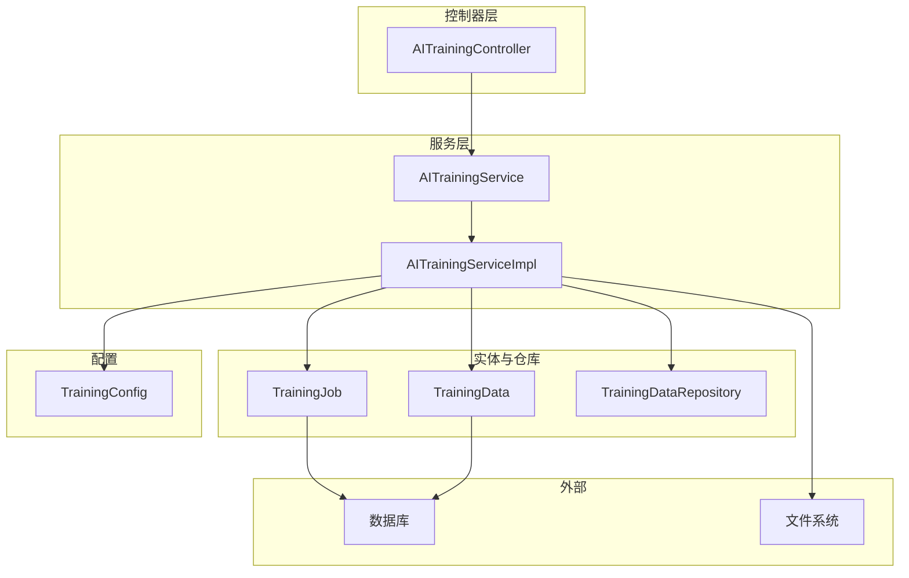
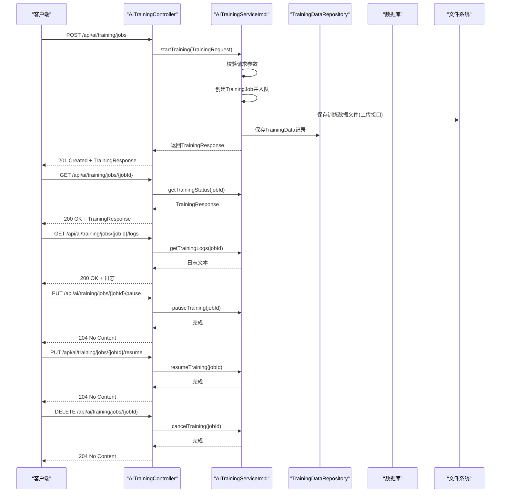
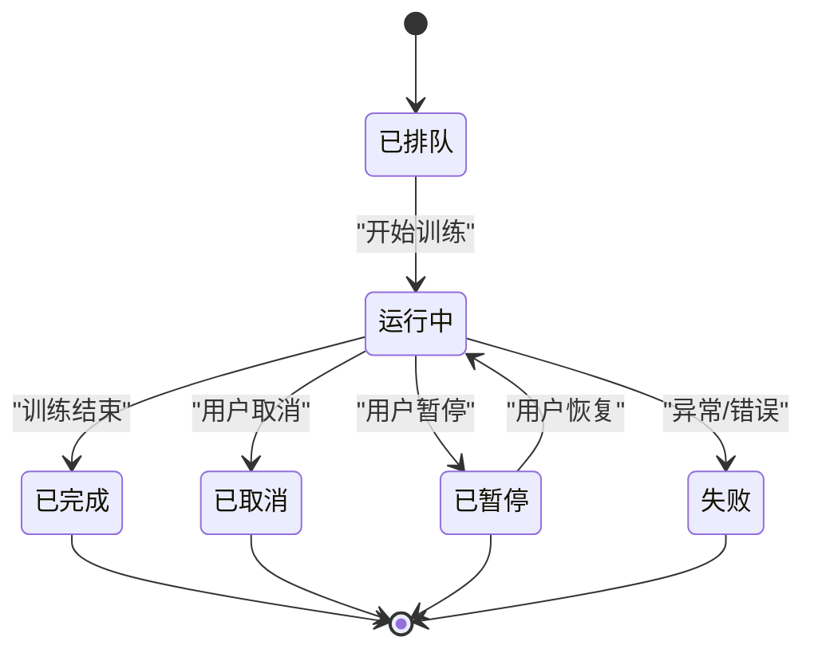
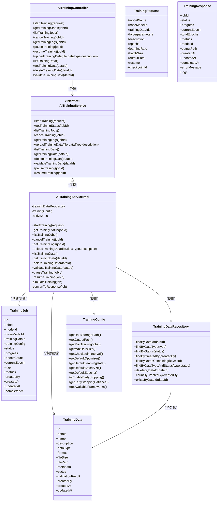

# AI训练任务接口

<cite>
**本文引用的文件**
- [AITrainingController.java](file://08-backend/src/main/java/com/enterprise/brain/modules/ai/controller/AITrainingController.java)
- [AITrainingService.java](file://08-backend/src/main/java/com/enterprise/brain/modules/ai/service/AITrainingService.java)
- [AITrainingServiceImpl.java](file://08-backend/src/main/java/com/enterprise/brain/modules/ai/service/impl/AITrainingServiceImpl.java)
- [TrainingRequest.java](file://08-backend/src/main/java/com/enterprise/brain/modules/ai/dto/request/TrainingRequest.java)
- [TrainingResponse.java](file://08-backend/src/main/java/com/enterprise/brain/modules/ai/dto/response/TrainingResponse.java)
- [TrainingJob.java](file://08-backend/src/main/java/com/enterprise/brain/modules/ai/entity/TrainingJob.java)
- [TrainingData.java](file://08-backend/src/main/java/com/enterprise/brain/modules/ai/entity/TrainingData.java)
- [TrainingDataRepository.java](file://08-backend/src/main/java/com/enterprise/brain/modules/ai/repository/TrainingDataRepository.java)
- [TrainingConfig.java](file://08-backend/src/main/java/com/enterprise/brain/modules/ai/config/TrainingConfig.java)
- [application.yml](file://08-backend/src/main/resources/application.yml)
</cite>

## 目录
1. [简介](#简介)
2. [项目结构](#项目结构)
3. [核心组件](#核心组件)
4. [架构总览](#架构总览)
5. [详细组件分析](#详细组件分析)
6. [依赖关系分析](#依赖关系分析)
7. [性能与可扩展性](#性能与可扩展性)
8. [故障排查指南](#故障排查指南)
9. [结论](#结论)
10. [附录](#附录)

## 简介
本文件面向后端开发者与集成方，系统化梳理 AI 训练任务接口，重点覆盖以下内容：
- 训练任务创建、查询、监控、暂停/恢复、取消、日志获取等接口
- POST /api/ai/training/jobs 接口的请求体 TrainingRequest 关键字段说明（训练数据集引用、基础模型选择、超参数配置等）
- GET /api/ai/training/jobs/{jobId} 返回的状态、进度、指标、日志等信息
- 实时进度获取方式（长轮询/SSE 的建议实现思路）
- 如何终止正在运行的训练任务
- 训练产物（模型权重、评估指标）的存储与引用机制
- 结合 TrainingJob 实体，描述训练任务完整生命周期与状态转换

## 项目结构
AI 训练模块位于后端工程的 Java 包 com.enterprise.brain.modules.ai 下，采用典型的分层架构：
- 控制器层：处理 HTTP 请求与响应
- 服务层：封装业务逻辑与任务调度
- 实体与仓库：持久化训练任务与数据
- DTO：请求与响应的数据传输对象
- 配置：训练与模型相关参数

图表来源
- [AITrainingController.java](file://08-backend/src/main/java/com/enterprise/brain/modules/ai/controller/AITrainingController.java#L16-L168)
- [AITrainingService.java](file://08-backend/src/main/java/com/enterprise/brain/modules/ai/service/AITrainingService.java#L11-L72)
- [AITrainingServiceImpl.java](file://08-backend/src/main/java/com/enterprise/brain/modules/ai/service/impl/AITrainingServiceImpl.java#L21-L259)
- [TrainingJob.java](file://08-backend/src/main/java/com/enterprise/brain/modules/ai/entity/TrainingJob.java#L1-L50)
- [TrainingData.java](file://08-backend/src/main/java/com/enterprise/brain/modules/ai/entity/TrainingData.java#L1-L44)
- [TrainingDataRepository.java](file://08-backend/src/main/java/com/enterprise/brain/modules/ai/repository/TrainingDataRepository.java#L1-L30)
- [TrainingConfig.java](file://08-backend/src/main/java/com/enterprise/brain/modules/ai/config/TrainingConfig.java#L1-L121)

章节来源
- [AITrainingController.java](file://08-backend/src/main/java/com/enterprise/brain/modules/ai/controller/AITrainingController.java#L16-L168)
- [application.yml](file://08-backend/src/main/resources/application.yml#L1-L42)

## 核心组件
- AITrainingController：提供训练任务的 REST 接口，包括创建、查询、列表、取消、暂停/恢复、日志获取、数据上传与管理等。
- AITrainingService/AITrainingServiceImpl：定义并实现训练任务的业务流程，包含任务状态管理、日志与指标维护、异步训练模拟等。
- TrainingRequest/TrainingResponse：请求与响应的数据结构，承载训练任务所需的关键字段与返回信息。
- TrainingJob/TrainingData：训练任务与训练数据的实体，用于持久化与状态跟踪。
- TrainingDataRepository：对训练数据进行 CRUD 与检索。
- TrainingConfig：训练相关配置项（如数据存储路径、默认超参、最大并发等）。

章节来源
- [AITrainingController.java](file://08-backend/src/main/java/com/enterprise/brain/modules/ai/controller/AITrainingController.java#L16-L168)
- [AITrainingService.java](file://08-backend/src/main/java/com/enterprise/brain/modules/ai/service/AITrainingService.java#L11-L72)
- [AITrainingServiceImpl.java](file://08-backend/src/main/java/com/enterprise/brain/modules/ai/service/impl/AITrainingServiceImpl.java#L21-L259)
- [TrainingRequest.java](file://08-backend/src/main/java/com/enterprise/brain/modules/ai/dto/request/TrainingRequest.java#L1-L20)
- [TrainingResponse.java](file://08-backend/src/main/java/com/enterprise/brain/modules/ai/dto/response/TrainingResponse.java#L1-L22)
- [TrainingJob.java](file://08-backend/src/main/java/com/enterprise/brain/modules/ai/entity/TrainingJob.java#L1-L50)
- [TrainingData.java](file://08-backend/src/main/java/com/enterprise/brain/modules/ai/entity/TrainingData.java#L1-L44)
- [TrainingDataRepository.java](file://08-backend/src/main/java/com/enterprise/brain/modules/ai/repository/TrainingDataRepository.java#L1-L30)
- [TrainingConfig.java](file://08-backend/src/main/java/com/enterprise/brain/modules/ai/config/TrainingConfig.java#L1-L121)

## 架构总览
AI 训练模块遵循“控制器-服务-实体-仓库-配置”的分层设计，控制器负责对外暴露接口，服务层负责任务编排与状态机推进，实体与仓库负责持久化，配置提供运行期参数。

图表来源
- [AITrainingController.java](file://08-backend/src/main/java/com/enterprise/brain/modules/ai/controller/AITrainingController.java#L23-L167)
- [AITrainingServiceImpl.java](file://08-backend/src/main/java/com/enterprise/brain/modules/ai/service/impl/AITrainingServiceImpl.java#L33-L235)
- [TrainingDataRepository.java](file://08-backend/src/main/java/com/enterprise/brain/modules/ai/repository/TrainingDataRepository.java#L1-L30)

## 详细组件分析

### 接口清单与行为
- POST /api/ai/training/jobs
  - 功能：提交训练任务请求，创建新的训练作业
  - 请求体：TrainingRequest
  - 响应：TrainingResponse（包含任务ID、状态、进度、指标、日志等）
  - 状态码：201 成功；400 参数错误；500 内部错误
- GET /api/ai/training/jobs/{jobId}
  - 功能：查询指定训练作业的当前状态与进度
  - 响应：TrainingResponse
  - 状态码：200 成功；404 未找到；500 内部错误
- GET /api/ai/training/jobs
  - 功能：列出所有训练作业
  - 响应：TrainingJob 列表
  - 状态码：200 成功；500 内部错误
- DELETE /api/ai/training/jobs/{jobId}
  - 功能：取消正在运行的训练作业
  - 响应：204
  - 状态码：204 成功；500 内部错误
- GET /api/ai/training/jobs/{jobId}/logs
  - 功能：获取训练日志
  - 响应：纯文本日志
  - 状态码：200 成功；404 未找到；500 内部错误
- PUT /api/ai/training/jobs/{jobId}/pause
  - 功能：暂停训练
  - 响应：204
  - 状态码：204 成功；500 内部错误
- PUT /api/ai/training/jobs/{jobId}/resume
  - 功能：恢复训练
  - 响应：204
  - 状态码：204 成功；500 内部错误
- POST /api/ai/training/data/upload
  - 功能：上传训练数据文件
  - 响应：TrainingData
  - 状态码：201 成功；400 参数错误；500 内部错误
- GET /api/ai/training/data
  - 功能：列出训练数据
  - 响应：TrainingData 列表
  - 状态码：200 成功；500 内部错误
- GET /api/ai/training/data/{dataId}
  - 功能：获取单条训练数据
  - 响应：TrainingData 或 404
  - 状态码：200/404/500
- DELETE /api/ai/training/data/{dataId}
  - 功能：删除训练数据（同时删除文件）
  - 响应：204
  - 状态码：204/404/500
- POST /api/ai/training/data/{dataId}/validate
  - 功能：校验训练数据有效性
  - 响应：布尔结果
  - 状态码：200/404/500

章节来源
- [AITrainingController.java](file://08-backend/src/main/java/com/enterprise/brain/modules/ai/controller/AITrainingController.java#L23-L167)

### TrainingRequest 请求体字段说明
- modelName：目标模型名称（字符串），用于标识训练产出的模型命名
- baseModelId：基础模型标识（字符串），用于选择预训练模型
- trainingDataIds：训练数据集ID列表（数组），至少包含一个
- hyperparameters：超参数映射（JSON），用于覆盖默认训练参数
- description：任务描述（字符串）
- epochs：训练轮数（整数，默认值见配置）
- learningRate：学习率（浮点数，默认值见配置）
- batchSize：批次大小（整数，默认值见配置）
- outputPath：输出路径（字符串），用于存放训练产物
- resume：是否从检查点恢复（布尔）
- checkpointId：检查点ID（字符串），当 resume 为真时使用

章节来源
- [TrainingRequest.java](file://08-backend/src/main/java/com/enterprise/brain/modules/ai/dto/request/TrainingRequest.java#L1-L20)
- [TrainingConfig.java](file://08-backend/src/main/java/com/enterprise/brain/modules/ai/config/TrainingConfig.java#L1-L121)

### TrainingResponse 返回字段说明
- jobId：训练作业ID（字符串）
- status：任务状态（字符串，如 queued/running/completed/failed/canceled/paused）
- progress：进度百分比（浮点数）
- currentEpoch/totalEpochs：当前轮次/总轮次（整数）
- metrics：评估指标（JSON 映射，示例包含 loss/accuracy）
- modelId：模型ID（字符串）
- outputPath：输出路径（字符串）
- createdAt/updatedAt/completedAt：时间戳
- errorMessage：错误信息（字符串，失败时返回）
- logs：日志摘要（字符串）

章节来源
- [TrainingResponse.java](file://08-backend/src/main/java/com/enterprise/brain/modules/ai/dto/response/TrainingResponse.java#L1-L22)

### 训练作业状态与生命周期
TrainingJob 实体定义了训练作业的核心属性与状态字段，并在服务层推进状态机。典型生命周期如下：

图表来源
- [TrainingJob.java](file://08-backend/src/main/java/com/enterprise/brain/modules/ai/entity/TrainingJob.java#L1-L50)
- [AITrainingServiceImpl.java](file://08-backend/src/main/java/com/enterprise/brain/modules/ai/service/impl/AITrainingServiceImpl.java#L194-L235)

章节来源
- [TrainingJob.java](file://08-backend/src/main/java/com/enterprise/brain/modules/ai/entity/TrainingJob.java#L1-L50)
- [AITrainingServiceImpl.java](file://08-backend/src/main/java/com/enterprise/brain/modules/ai/service/impl/AITrainingServiceImpl.java#L194-L235)

### 训练数据管理
- 上传：支持 multipart/form-data，包含 file、dataType、description
- 列表与查询：按 dataId、dataType、status、创建人、关键词等过滤
- 删除：删除记录并清理文件
- 校验：简单校验文件是否存在且非空，写入校验结果摘要

章节来源
- [AITrainingController.java](file://08-backend/src/main/java/com/enterprise/brain/modules/ai/controller/AITrainingController.java#L83-L115)
- [TrainingData.java](file://08-backend/src/main/java/com/enterprise/brain/modules/ai/entity/TrainingData.java#L1-L44)
- [TrainingDataRepository.java](file://08-backend/src/main/java/com/enterprise/brain/modules/ai/repository/TrainingDataRepository.java#L1-L30)
- [AITrainingServiceImpl.java](file://08-backend/src/main/java/com/enterprise/brain/modules/ai/service/impl/AITrainingServiceImpl.java#L96-L173)

### 实时进度与日志
- 当前实现：服务层以线程模拟训练过程，周期性更新进度、指标与日志
- 查询接口：GET /api/ai/training/jobs/{jobId} 返回当前状态与日志片段
- 日志接口：GET /api/ai/training/jobs/{jobId}/logs 返回完整日志文本
- 实时方案建议：
  - 长轮询：客户端定时轮询 GET /api/ai/training/jobs/{jobId}，直到状态变为 completed/failed/canceled
  - SSE：服务端推送事件（需在控制器中实现 Server-Sent Events），客户端监听事件流，接收 progress/metrics/logs 更新
  - WebSocket：建立连接后由服务端主动推送状态变更

章节来源
- [AITrainingController.java](file://08-backend/src/main/java/com/enterprise/brain/modules/ai/controller/AITrainingController.java#L36-L79)
- [AITrainingServiceImpl.java](file://08-backend/src/main/java/com/enterprise/brain/modules/ai/service/impl/AITrainingServiceImpl.java#L194-L235)

### 终止训练任务
- 取消接口：DELETE /api/ai/training/jobs/{jobId}
- 行为：将任务状态置为 canceled，并追加取消日志
- 注意：已取消的任务不会继续推进，后续恢复需重新发起

章节来源
- [AITrainingController.java](file://08-backend/src/main/java/com/enterprise/brain/modules/ai/controller/AITrainingController.java#L59-L67)
- [AITrainingServiceImpl.java](file://08-backend/src/main/java/com/enterprise/brain/modules/ai/service/impl/AITrainingServiceImpl.java#L78-L85)

### 训练产物与存储
- 训练产物（模型权重、评估指标）：
  - 指标：metrics 字段在服务层按轮次动态更新（loss/accuracy 示例）
  - 权重与模型：当前实现未落地到文件系统，仅在内存中维护
- 存储建议：
  - 使用 TrainingConfig 中的 outputPath 或自定义路径，将模型权重与指标序列化保存
  - 在 TrainingJob 中新增字段记录产物路径与版本信息
  - 提供 GET /api/ai/training/jobs/{jobId}/artifacts 接口返回产物元数据

章节来源
- [TrainingResponse.java](file://08-backend/src/main/java/com/enterprise/brain/modules/ai/dto/response/TrainingResponse.java#L1-L22)
- [TrainingJob.java](file://08-backend/src/main/java/com/enterprise/brain/modules/ai/entity/TrainingJob.java#L1-L50)
- [TrainingConfig.java](file://08-backend/src/main/java/com/enterprise/brain/modules/ai/config/TrainingConfig.java#L1-L121)

## 依赖关系分析

图表来源
- [AITrainingController.java](file://08-backend/src/main/java/com/enterprise/brain/modules/ai/controller/AITrainingController.java#L16-L168)
- [AITrainingService.java](file://08-backend/src/main/java/com/enterprise/brain/modules/ai/service/AITrainingService.java#L11-L72)
- [AITrainingServiceImpl.java](file://08-backend/src/main/java/com/enterprise/brain/modules/ai/service/impl/AITrainingServiceImpl.java#L21-L259)
- [TrainingRequest.java](file://08-backend/src/main/java/com/enterprise/brain/modules/ai/dto/request/TrainingRequest.java#L1-L20)
- [TrainingResponse.java](file://08-backend/src/main/java/com/enterprise/brain/modules/ai/dto/response/TrainingResponse.java#L1-L22)
- [TrainingJob.java](file://08-backend/src/main/java/com/enterprise/brain/modules/ai/entity/TrainingJob.java#L1-L50)
- [TrainingData.java](file://08-backend/src/main/java/com/enterprise/brain/modules/ai/entity/TrainingData.java#L1-L44)
- [TrainingDataRepository.java](file://08-backend/src/main/java/com/enterprise/brain/modules/ai/repository/TrainingDataRepository.java#L1-L30)
- [TrainingConfig.java](file://08-backend/src/main/java/com/enterprise/brain/modules/ai/config/TrainingConfig.java#L1-L121)

## 性能与可扩展性
- 并发控制：当前服务层使用并发安全的 Map 存储活动任务，适合小规模并发；生产环境建议引入队列与工作线程池，限制最大并发数（参考 TrainingConfig 的 maxTrainingJobs）
- 资源隔离：训练过程在独立线程中执行，避免阻塞主线程；建议增加资源上限与健康检查
- 存储策略：训练数据与产物建议落盘，配合分片与压缩策略降低 IO 压力
- 指标与日志：metrics 与 logs 字段为 JSONB，便于扩展；建议定期归档历史日志，避免单条记录过大
- 配置化：TrainingConfig 提供默认参数与阈值，便于运维调整

[本节为通用建议，不直接分析具体文件]

## 故障排查指南
- 参数校验失败（400）
  - 检查 baseModelId 与 trainingDataIds 是否为空
  - 检查文件大小是否超过配置的最大值
- 任务不存在（404）
  - 确认 jobId 是否正确
  - 检查任务是否已被清理或过期
- 服务器内部错误（500）
  - 查看服务端日志定位异常
  - 检查数据库连接与 Redis 缓存配置
- 训练中断
  - 用户取消：状态为 canceled
  - 暂停恢复：先暂停再恢复，状态切换为 paused/running
  - 异常：状态为 failed，查看 logs 获取错误详情

章节来源
- [AITrainingController.java](file://08-backend/src/main/java/com/enterprise/brain/modules/ai/controller/AITrainingController.java#L23-L167)
- [AITrainingServiceImpl.java](file://08-backend/src/main/java/com/enterprise/brain/modules/ai/service/impl/AITrainingServiceImpl.java#L78-L94)
- [application.yml](file://08-backend/src/main/resources/application.yml#L1-L42)

## 结论
本模块提供了完整的训练任务生命周期管理接口，具备良好的扩展性与可维护性。建议在生产环境中：
- 引入队列与工作线程池，限制并发并提升稳定性
- 将训练产物落盘并提供标准化的产物接口
- 增强实时能力（SSE/WS）与可观测性（指标采集与告警）
- 完善数据校验与数据治理流程

[本节为总结性内容，不直接分析具体文件]

## 附录

### 接口定义速览
- POST /api/ai/training/jobs
  - 请求体：TrainingRequest
  - 响应：TrainingResponse
  - 状态码：201/400/500
- GET /api/ai/training/jobs/{jobId}
  - 响应：TrainingResponse
  - 状态码：200/404/500
- GET /api/ai/training/jobs
  - 响应：TrainingJob 列表
  - 状态码：200/500
- DELETE /api/ai/training/jobs/{jobId}
  - 响应：204
  - 状态码：204/500
- GET /api/ai/training/jobs/{jobId}/logs
  - 响应：日志文本
  - 状态码：200/404/500
- PUT /api/ai/training/jobs/{jobId}/pause
  - 响应：204
  - 状态码：204/500
- PUT /api/ai/training/jobs/{jobId}/resume
  - 响应：204
  - 状态码：204/500
- POST /api/ai/training/data/upload
  - 响应：TrainingData
  - 状态码：201/400/500
- GET /api/ai/training/data
  - 响应：TrainingData 列表
  - 状态码：200/500
- GET /api/ai/training/data/{dataId}
  - 响应：TrainingData 或 404
  - 状态码：200/404/500
- DELETE /api/ai/training/data/{dataId}
  - 响应：204
  - 状态码：204/404/500
- POST /api/ai/training/data/{dataId}/validate
  - 响应：布尔
  - 状态码：200/404/500

章节来源
- [AITrainingController.java](file://08-backend/src/main/java/com/enterprise/brain/modules/ai/controller/AITrainingController.java#L23-L167)