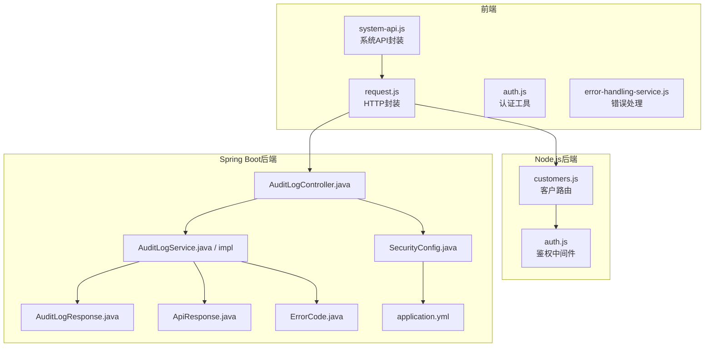
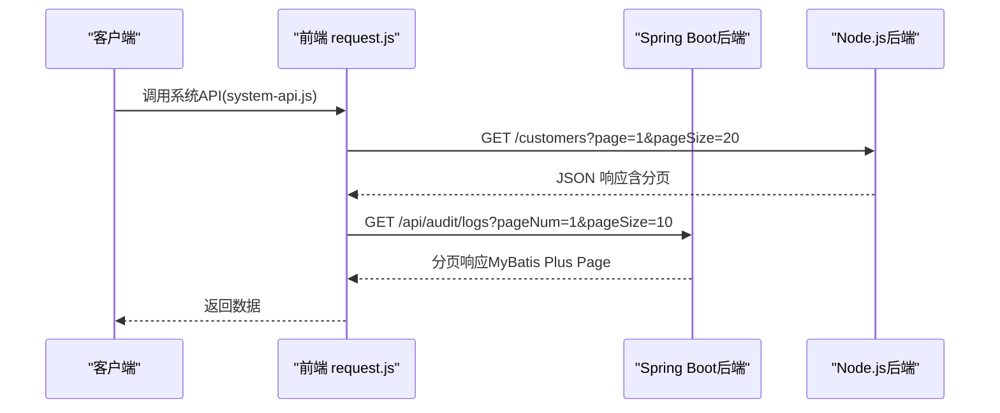
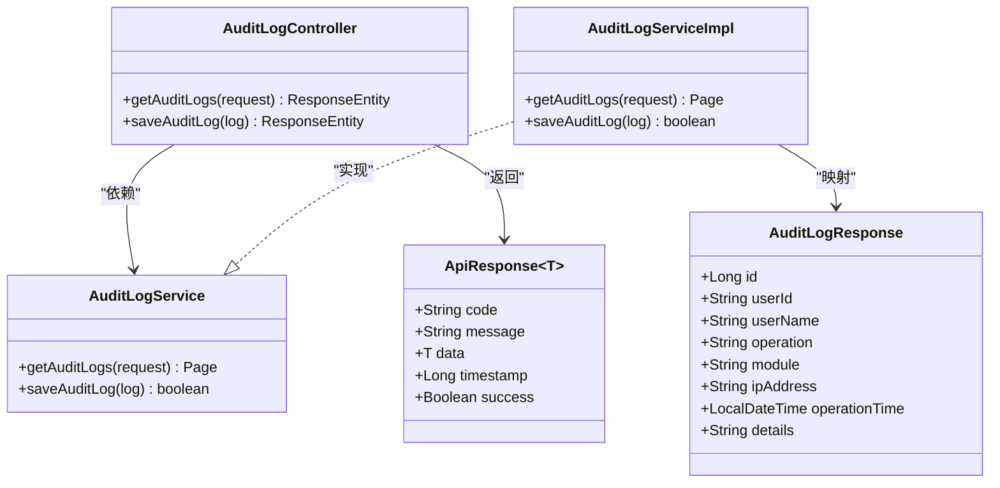
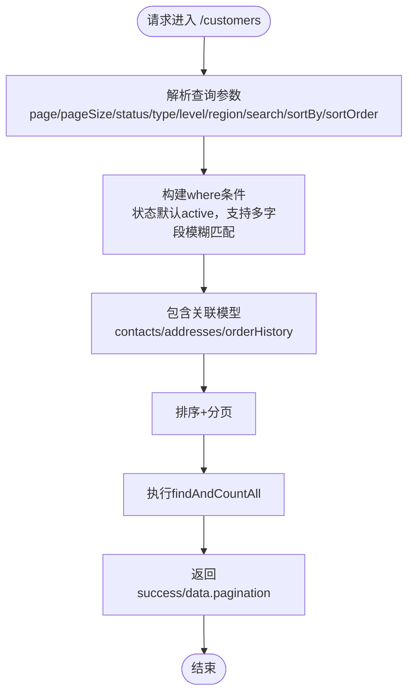
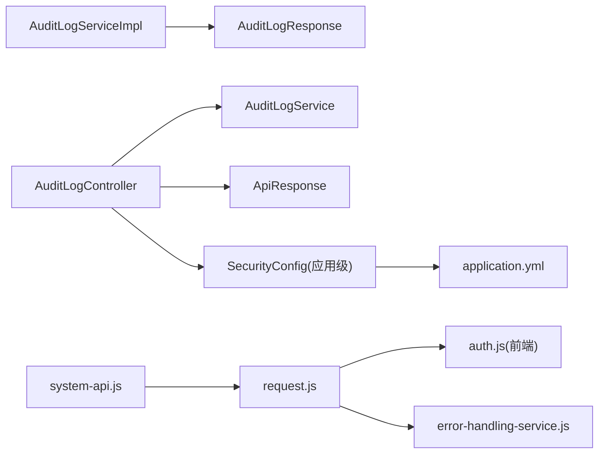

# API参考

<cite>
**本文引用的文件**
- [AuditLogController.java](file://08-backend/src/main/java/com/enterprise/brain/modules/system/audit/controller/AuditLogController.java)
- [AuditLogService.java](file://08-backend/src/main/java/com/enterprise/brain/modules/system/audit/service/AuditLogService.java)
- [AuditLogServiceImpl.java](file://08-backend/src/main/java/com/enterprise/brain/modules/system/audit/service/impl/AuditLogServiceImpl.java)
- [AuditLogResponse.java](file://08-backend/src/main/java/com/enterprise/brain/modules/system/audit/dto/response/AuditLogResponse.java)
- [customers.js](file://07-backend/routes/customers.js)
- [auth.js](file://07-backend/middleware/auth.js)
- [SecurityConfig.java（Spring Security）](file://08-backend/src/main/java/com/enterprise/brain/common/config/SecurityConfig.java)
- [SecurityConfig.java（应用级）](file://08-backend/src/main/java/com/enterprise/brain/config/SecurityConfig.java)
- [ErrorCode.java（后端错误码）](file://08-backend/src/main/java/com/enterprise/brain/common/constants/ErrorCode.java)
- [ApiResponse.java（后端统一响应）](file://08-backend/src/main/java/com/enterprise/brain/common/response/ApiResponse.java)
- [application.yml（后端配置）](file://08-backend/src/main/resources/application.yml)
- [system-api.js（前端系统API封装）](file://07-frontend/src/services/api/system-api.js)
- [request.js（前端HTTP请求封装）](file://07-frontend/src/services/utils/request.js)
- [auth.js（前端认证工具）](file://07-frontend/src/services/utils/auth.js)
- [api-integration.js（前端资源集合管理）](file://07-frontend/src/utils/integration/api-integration.js)
- [error-handling-service.js（前端错误处理）](file://07-frontend/src/services/error-handling-service.js)
- [error-codes.js（前端错误码定义）](file://07-frontend/src/utils/error-handling/error-codes.js)
- [pagination.md（分页规范）](file://rules/no-sql-web-sdk/pagination.md)
</cite>

## 目录
1. [简介](#简介)
2. [项目结构](#项目结构)
3. [核心组件](#核心组件)
4. [架构总览](#架构总览)
5. [详细组件分析](#详细组件分析)
6. [依赖关系分析](#依赖关系分析)
7. [性能考虑](#性能考虑)
8. [故障排查指南](#故障排查指南)
9. [结论](#结论)
10. [附录](#附录)

## 简介
本文件为该工程的API参考文档，覆盖Spring Boot后端与Node.js后端暴露的RESTful接口。重点包括：
- 审计日志API（Spring Boot）
- 客户管理API（Node.js）
- 统一响应格式与错误码体系
- 分页规范与版本控制策略
- 认证授权机制（JWT/OAuth）与安全配置
- curl与JavaScript/Fetch调用示例
- 速率限制与错误处理实践

## 项目结构
- 后端（Spring Boot）
  - 审计模块：AuditLogController、AuditLogService、AuditLogResponse
  - 统一响应与错误码：ApiResponse、ErrorCode
  - 安全配置：SecurityConfig（应用级与通用）
  - 配置文件：application.yml（上下文路径、Swagger）
- 前端（Vue + Fetch）
  - API封装：system-api.js
  - HTTP请求封装：request.js
  - 认证工具：auth.js
  - 错误处理：error-handling-service.js、error-codes.js
- Node.js后端（Express）
  - 客户管理路由：customers.js
  - 中间件：auth.js（鉴权）

图表来源
- [AuditLogController.java](file://08-backend/src/main/java/com/enterprise/brain/modules/system/audit/controller/AuditLogController.java#L1-L30)
- [AuditLogService.java](file://08-backend/src/main/java/com/enterprise/brain/modules/system/audit/service/AuditLogService.java#L1-L10)
- [AuditLogServiceImpl.java](file://08-backend/src/main/java/com/enterprise/brain/modules/system/audit/service/impl/AuditLogServiceImpl.java#L1-L64)
- [AuditLogResponse.java](file://08-backend/src/main/java/com/enterprise/brain/modules/system/audit/dto/response/AuditLogResponse.java#L1-L16)
- [customers.js](file://07-backend/routes/customers.js#L1-L728)
- [auth.js](file://07-backend/middleware/auth.js#L1-L200)
- [SecurityConfig.java（Spring Security）](file://08-backend/src/main/java/com/enterprise/brain/common/config/SecurityConfig.java#L1-L68)
- [SecurityConfig.java（应用级）](file://08-backend/src/main/java/com/enterprise/brain/config/SecurityConfig.java#L1-L36)
- [application.yml](file://08-backend/src/main/resources/application.yml#L1-L42)
- [system-api.js](file://07-frontend/src/services/api/system-api.js#L1-L253)
- [request.js](file://07-frontend/src/services/utils/request.js#L1-L798)
- [auth.js（前端）](file://07-frontend/src/services/utils/auth.js#L1-L744)
- [error-handling-service.js](file://07-frontend/src/services/error-handling-service.js#L284-L391)
- [error-codes.js](file://07-frontend/src/utils/error-handling/error-codes.js#L521-L572)

章节来源
- [application.yml](file://08-backend/src/main/resources/application.yml#L1-L42)
- [system-api.js](file://07-frontend/src/services/api/system-api.js#L1-L253)
- [request.js](file://07-frontend/src/services/utils/request.js#L1-L798)

## 核心组件
- 审计日志API（Spring Boot）
  - 控制器：提供分页查询与保存审计日志
  - 服务层：构建查询条件、分页、映射响应
  - DTO：审计日志响应模型
  - 统一响应：ApiResponse
  - 错误码：ErrorCode
- 客户管理API（Node.js）
  - 路由：列表、详情、创建、更新、删除、统计、订单历史、联系人管理、导出
  - 鉴权：authenticateToken、requireRole
  - 统一分页：page/pageSize、排序字段与方向
- 前端集成
  - request.js：统一请求、拦截器、重试、缓存、下载
  - system-api.js：按模块封装常用API
  - auth.js：令牌管理、刷新、过期检测
  - 错误处理：错误分类与提示、自动登录引导

章节来源
- [AuditLogController.java](file://08-backend/src/main/java/com/enterprise/brain/modules/system/audit/controller/AuditLogController.java#L1-L30)
- [AuditLogService.java](file://08-backend/src/main/java/com/enterprise/brain/modules/system/audit/service/AuditLogService.java#L1-L10)
- [AuditLogServiceImpl.java](file://08-backend/src/main/java/com/enterprise/brain/modules/system/audit/service/impl/AuditLogServiceImpl.java#L1-L64)
- [AuditLogResponse.java](file://08-backend/src/main/java/com/enterprise/brain/modules/system/audit/dto/response/AuditLogResponse.java#L1-L16)
- [ApiResponse.java](file://08-backend/src/main/java/com/enterprise/brain/common/response/ApiResponse.java#L1-L107)
- [ErrorCode.java（后端错误码）](file://08-backend/src/main/java/com/enterprise/brain/common/constants/ErrorCode.java#L1-L104)
- [customers.js](file://07-backend/routes/customers.js#L1-L728)
- [auth.js](file://07-backend/middleware/auth.js#L1-L200)
- [system-api.js](file://07-frontend/src/services/api/system-api.js#L1-L253)
- [request.js](file://07-frontend/src/services/utils/request.js#L1-L798)
- [auth.js（前端）](file://07-frontend/src/services/utils/auth.js#L1-L744)
- [error-handling-service.js](file://07-frontend/src/services/error-handling-service.js#L284-L391)

## 架构总览
- 后端采用Spring MVC（审计日志）与Express（客户管理）双栈
- 前端通过request.js封装HTTP请求，system-api.js按模块聚合API
- 安全策略：Spring Security无状态会话；Node.js中间件鉴权
- 统一响应与错误码：后端使用ApiResponse与ErrorCode；前端使用错误码定义与错误处理服务

图表来源
- [system-api.js](file://07-frontend/src/services/api/system-api.js#L1-L253)
- [request.js](file://07-frontend/src/services/utils/request.js#L1-L798)
- [customers.js](file://07-backend/routes/customers.js#L1-L728)
- [AuditLogController.java](file://08-backend/src/main/java/com/enterprise/brain/modules/system/audit/controller/AuditLogController.java#L1-L30)

## 详细组件分析

### 审计日志API（Spring Boot）
- 控制器
  - GET /api/audit/logs：分页查询审计日志
  - POST /api/audit/logs：保存审计日志
- 服务层
  - 构造查询条件：用户名、模块、起止时间
  - 使用Page分页，映射为响应DTO
- 统一响应与错误码
  - ApiResponse：code/message/data/success/timestamp
  - ErrorCode：按类别划分错误码（通用、参数、认证授权、数据、业务等）

图表来源
- [AuditLogController.java](file://08-backend/src/main/java/com/enterprise/brain/modules/system/audit/controller/AuditLogController.java#L1-L30)
- [AuditLogService.java](file://08-backend/src/main/java/com/enterprise/brain/modules/system/audit/service/AuditLogService.java#L1-L10)
- [AuditLogServiceImpl.java](file://08-backend/src/main/java/com/enterprise/brain/modules/system/audit/service/impl/AuditLogServiceImpl.java#L1-L64)
- [AuditLogResponse.java](file://08-backend/src/main/java/com/enterprise/brain/modules/system/audit/dto/response/AuditLogResponse.java#L1-L16)
- [ApiResponse.java](file://08-backend/src/main/java/com/enterprise/brain/common/response/ApiResponse.java#L1-L107)

章节来源
- [AuditLogController.java](file://08-backend/src/main/java/com/enterprise/brain/modules/system/audit/controller/AuditLogController.java#L1-L30)
- [AuditLogService.java](file://08-backend/src/main/java/com/enterprise/brain/modules/system/audit/service/AuditLogService.java#L1-L10)
- [AuditLogServiceImpl.java](file://08-backend/src/main/java/com/enterprise/brain/modules/system/audit/service/impl/AuditLogServiceImpl.java#L1-L64)
- [AuditLogResponse.java](file://08-backend/src/main/java/com/enterprise/brain/modules/system/audit/dto/response/AuditLogResponse.java#L1-L16)
- [ApiResponse.java](file://08-backend/src/main/java/com/enterprise/brain/common/response/ApiResponse.java#L1-L107)
- [ErrorCode.java（后端错误码）](file://08-backend/src/main/java/com/enterprise/brain/common/constants/ErrorCode.java#L1-L104)

### 客户管理API（Node.js）
- 路由与鉴权
  - authenticateToken：全局鉴权中间件
  - requireRole：基于角色的权限控制
- 端点
  - GET /customers：分页列表（状态、类型、等级、地区、搜索、排序）
  - GET /customers/:id：客户详情（包含联系人、地址、最近订单）
  - POST /customers：创建客户（生成编号、写入主表与扩展表）
  - PUT /customers/:id：更新客户（同步联系人与地址）
  - DELETE /customers/:id：删除客户（若有订单则停用，否则物理删除）
  - GET /customers/stats：统计（按类型/等级/地区、时间段）
  - GET /customers/:id/order-history：订单历史分页
  - POST /customers/:id/contacts：新增联系人
  - PUT /customers/:id/contacts/:contactId：更新联系人
  - DELETE /customers/:id/contacts/:contactId：删除联系人
  - GET /customers/export：导出客户（格式参数）
- 统一分页
  - page/pageSize、sortBy/sortOrder
  - 返回 total/page/pageSize/totalPages

图表来源
- [customers.js](file://07-backend/routes/customers.js#L1-L120)

章节来源
- [customers.js](file://07-backend/routes/customers.js#L1-L728)
- [auth.js](file://07-backend/middleware/auth.js#L1-L200)

### 前端集成与调用示例
- 系统API封装（system-api.js）
  - 用户、角色、权限、部门、字典、配置、监控、操作日志等模块
- HTTP请求封装（request.js）
  - 支持拦截器、重试、缓存、取消、下载、批量/链式请求
- 认证工具（auth.js）
  - 令牌存储、刷新、过期检测、临时令牌生成与校验
- 错误处理（error-handling-service.js、error-codes.js）
  - 错误分类、提示、自动登录引导、安全与关键错误上报

章节来源
- [system-api.js](file://07-frontend/src/services/api/system-api.js#L1-L253)
- [request.js](file://07-frontend/src/services/utils/request.js#L1-L798)
- [auth.js（前端）](file://07-frontend/src/services/utils/auth.js#L1-L744)
- [error-handling-service.js](file://07-frontend/src/services/error-handling-service.js#L284-L391)
- [error-codes.js](file://07-frontend/src/utils/error-handling/error-codes.js#L521-L572)

## 依赖关系分析
- 后端
  - AuditLogController 依赖 AuditLogService
  - AuditLogServiceImpl 实现 AuditLogService，并映射 AuditLogResponse
  - SecurityConfig（应用级）配置了基础路径白名单与无状态会话
  - SecurityConfig（通用）配置了CORS、无状态会话、白名单路径
  - application.yml 指定上下文路径为 /api，Swagger路径
- 前端
  - system-api.js 调用 request.js
  - request.js 内部使用 fetch，支持超时、重试、缓存、取消
  - auth.js 管理令牌与刷新流程
  - 错误处理服务对不同错误类型进行分类处理

图表来源
- [AuditLogController.java](file://08-backend/src/main/java/com/enterprise/brain/modules/system/audit/controller/AuditLogController.java#L1-L30)
- [AuditLogService.java](file://08-backend/src/main/java/com/enterprise/brain/modules/system/audit/service/AuditLogService.java#L1-L10)
- [AuditLogServiceImpl.java](file://08-backend/src/main/java/com/enterprise/brain/modules/system/audit/service/impl/AuditLogServiceImpl.java#L1-L64)
- [AuditLogResponse.java](file://08-backend/src/main/java/com/enterprise/brain/modules/system/audit/dto/response/AuditLogResponse.java#L1-L16)
- [ApiResponse.java](file://08-backend/src/main/java/com/enterprise/brain/common/response/ApiResponse.java#L1-L107)
- [SecurityConfig.java（应用级）](file://08-backend/src/main/java/com/enterprise/brain/config/SecurityConfig.java#L1-L36)
- [application.yml](file://08-backend/src/main/resources/application.yml#L1-L42)
- [system-api.js](file://07-frontend/src/services/api/system-api.js#L1-L253)
- [request.js](file://07-frontend/src/services/utils/request.js#L1-L798)
- [auth.js（前端）](file://07-frontend/src/services/utils/auth.js#L1-L744)
- [error-handling-service.js](file://07-frontend/src/services/error-handling-service.js#L284-L391)

章节来源
- [SecurityConfig.java（应用级）](file://08-backend/src/main/java/com/enterprise/brain/config/SecurityConfig.java#L1-L36)
- [SecurityConfig.java（Spring Security）](file://08-backend/src/main/java/com/enterprise/brain/common/config/SecurityConfig.java#L1-L68)
- [application.yml](file://08-backend/src/main/resources/application.yml#L1-L42)

## 性能考虑
- 分页与排序
  - Node.js：page/pageSize、sortBy/sortOrder
  - Spring Boot：pageNum/pageSize（MyBatis Plus Page）
- 前端缓存与重试
  - request.js 支持GET缓存、重试、取消
- 数据库索引与查询优化
  - 建议对常用过滤字段（如用户名、模块、时间）建立索引
  - 合理使用 limit/skip，避免全表扫描

章节来源
- [customers.js](file://07-backend/routes/customers.js#L1-L120)
- [AuditLogServiceImpl.java](file://08-backend/src/main/java/com/enterprise/brain/modules/system/audit/service/impl/AuditLogServiceImpl.java#L1-L64)
- [request.js](file://07-frontend/src/services/utils/request.js#L1-L798)
- [pagination.md](file://rules/no-sql-web-sdk/pagination.md#L1-L143)

## 故障排查指南
- 常见错误与处理
  - 认证失败/令牌过期：前端auth.js自动刷新与过期检测；错误处理服务引导登录
  - 参数错误：后端ErrorCode中参数类错误码；前端error-codes.js分类提示
  - 数据不存在：404场景（客户不存在、联系人不存在）
  - 业务冲突：如删除客户存在订单时停用而非删除
- 日志与监控
  - 前端错误处理服务记录关键/安全错误事件
  - 后端application.yml开启DEBUG级别日志

章节来源
- [auth.js（前端）](file://07-frontend/src/services/utils/auth.js#L1-L744)
- [error-handling-service.js](file://07-frontend/src/services/error-handling-service.js#L284-L391)
- [error-codes.js](file://07-frontend/src/utils/error-handling/error-codes.js#L521-L572)
- [ErrorCode.java（后端错误码）](file://08-backend/src/main/java/com/enterprise/brain/common/constants/ErrorCode.java#L1-L104)
- [customers.js](file://07-backend/routes/customers.js#L336-L387)
- [application.yml](file://08-backend/src/main/resources/application.yml#L1-L42)

## 结论
本API参考文档梳理了Spring Boot与Node.js后端的RESTful接口，明确了统一响应与错误码、分页规范、认证授权与安全配置，并提供了前端集成与调用示例。建议在生产环境中完善权限控制与速率限制策略，持续优化查询性能与错误处理体验。

## 附录

### API清单与规范

- 审计日志API（Spring Boot）
  - GET /api/audit/logs
    - 请求头：Authorization: Bearer <token>
    - 查询参数：pageNum, pageSize, userName, module, startTime, endTime
    - 成功响应：分页对象（records + total等）
    - 错误响应：后端统一错误码
  - POST /api/audit/logs
    - 请求头：Authorization: Bearer <token>
    - 请求体：AuditLogResponse（userId, userName, operation, module, ipAddress, operationTime, details）
    - 成功响应：布尔值
    - 错误响应：后端统一错误码

- 客户管理API（Node.js）
  - GET /customers
    - 请求头：Authorization: Bearer <token>
    - 查询参数：page, pageSize, type, level, region, status, search, sortBy, sortOrder
    - 成功响应：data.customers + data.pagination
    - 错误响应：JSON对象（success=false, message, error）
  - GET /customers/:id
    - 请求头：Authorization: Bearer <token>
    - 成功响应：客户详情 + stats
    - 错误响应：404或JSON对象
  - POST /customers
    - 请求头：Authorization: Bearer <token>（需销售/管理员角色）
    - 请求体：客户基本信息与联系人/地址数组
    - 成功响应：新建客户完整信息
    - 错误响应：JSON对象
  - PUT /customers/:id
    - 请求头：Authorization: Bearer <token>（需销售/管理员角色）
    - 请求体：更新字段
    - 成功响应：更新后的客户信息
    - 错误响应：JSON对象
  - DELETE /customers/:id
    - 请求头：Authorization: Bearer <token>（需管理员角色）
    - 成功响应：删除/停用结果
    - 错误响应：JSON对象
  - GET /customers/stats
    - 请求头：Authorization: Bearer <token>
    - 查询参数：startDate, endDate
    - 成功响应：typeStats/levelStats/regionStats/totalCustomers/period
  - GET /customers/:id/order-history
    - 请求头：Authorization: Bearer <token>
    - 查询参数：page, pageSize, status
    - 成功响应：orders + pagination
  - POST /customers/:id/contacts
    - 请求头：Authorization: Bearer <token>（需销售/管理员角色）
    - 请求体：联系人信息（自动处理主要联系人）
    - 成功响应：新增联系人
  - PUT /customers/:id/contacts/:contactId
    - 请求头：Authorization: Bearer <token>（需销售/管理员角色）
    - 请求体：更新字段
    - 成功响应：更新后的联系人
  - DELETE /customers/:id/contacts/:contactId
    - 请求头：Authorization: Bearer <token>（需销售/管理员角色）
    - 成功响应：删除结果
  - GET /customers/export
    - 请求头：Authorization: Bearer <token>
    - 查询参数：format, type, level, region, status
    - 成功响应：导出元信息（format/exportedAt/totalRecords）

- 统一响应与错误码
  - 后端统一响应：ApiResponse（code/message/data/success/timestamp）
  - 错误码：ErrorCode（按类别划分，如通用、参数、认证授权、数据、业务、文件、网络、第三方、缓存）

- 分页规范
  - Node.js：page/pageSize、sortBy/sortOrder
  - Spring Boot：pageNum/pageSize（MyBatis Plus Page）
  - 参考分页实现与计算公式

- 版本控制策略
  - 后端上下文路径为 /api，Swagger路径为 /v3/api-docs 与 /swagger-ui.html
  - 建议在URL中加入版本号（如 /api/v1/...），并在Swagger中维护版本文档

- 速率限制机制
  - 前端request.js具备队列与简单限流逻辑（模拟实现）
  - 建议后端引入Redis限流或Spring Cloud Gateway限流策略

- 认证授权机制
  - Spring Security：无状态会话、CORS配置、白名单路径
  - Node.js：authenticateToken中间件、requireRole角色控制
  - 前端：auth.js管理令牌、刷新与过期检测

- curl与JavaScript/Fetch调用示例
  - curl示例（Node.js）
    - curl -X GET "http://localhost:8080/api/customers?page=1&pageSize=20" -H "Authorization: Bearer <token>"
  - curl示例（Spring Boot）
    - curl -X GET "http://localhost:8080/api/audit/logs?pageNum=1&pageSize=10" -H "Authorization: Bearer <token>"
  - JavaScript/Fetch（前端）
    - 使用 system-api.js 或 request.js 的 get/post/put/delete 方法
    - 示例：request.get('/system/roles', { params })

章节来源
- [AuditLogController.java](file://08-backend/src/main/java/com/enterprise/brain/modules/system/audit/controller/AuditLogController.java#L1-L30)
- [customers.js](file://07-backend/routes/customers.js#L1-L728)
- [ApiResponse.java](file://08-backend/src/main/java/com/enterprise/brain/common/response/ApiResponse.java#L1-L107)
- [ErrorCode.java（后端错误码）](file://08-backend/src/main/java/com/enterprise/brain/common/constants/ErrorCode.java#L1-L104)
- [application.yml](file://08-backend/src/main/resources/application.yml#L1-L42)
- [system-api.js](file://07-frontend/src/services/api/system-api.js#L1-L253)
- [request.js](file://07-frontend/src/services/utils/request.js#L1-L798)
- [pagination.md](file://rules/no-sql-web-sdk/pagination.md#L1-L143)