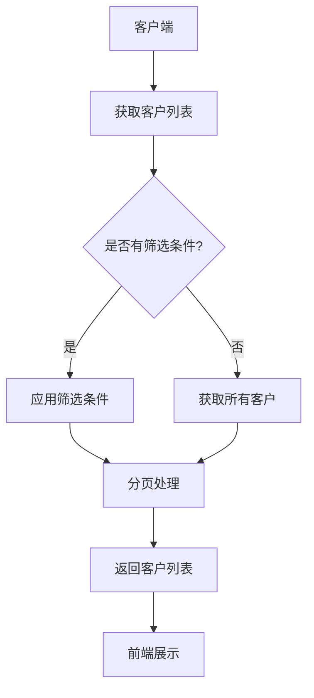
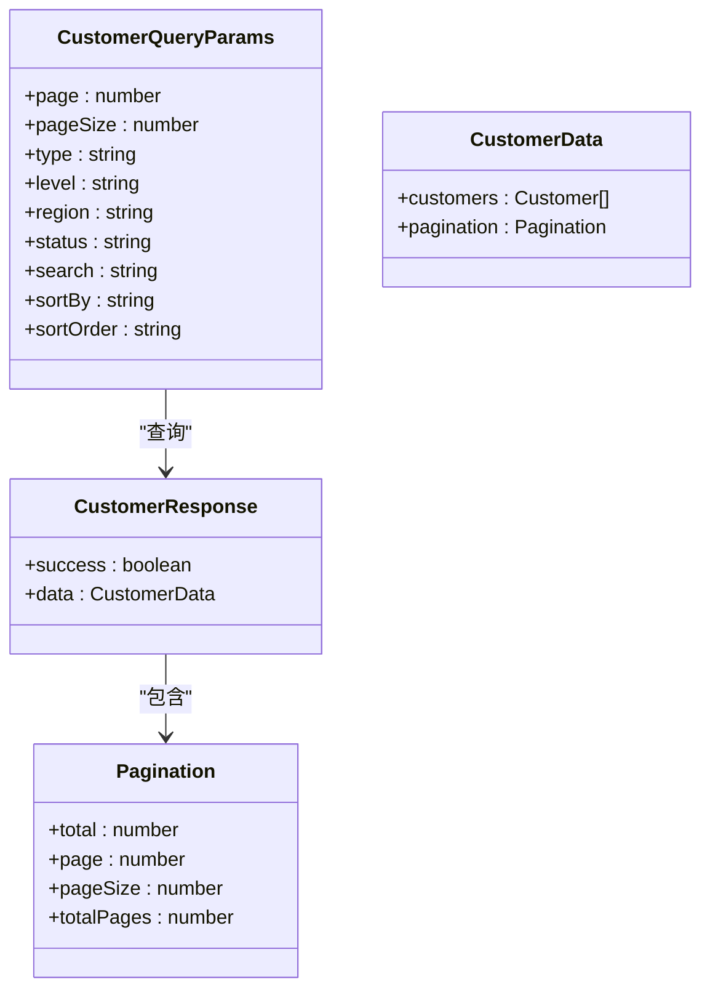
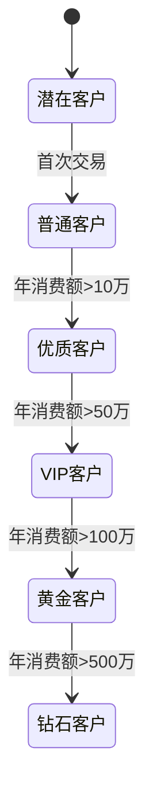
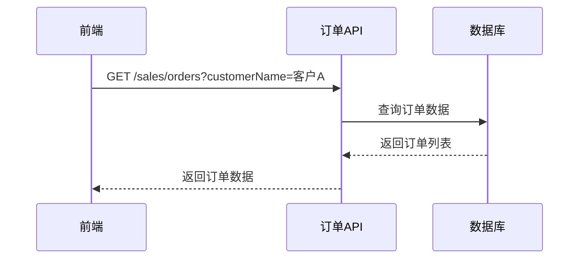
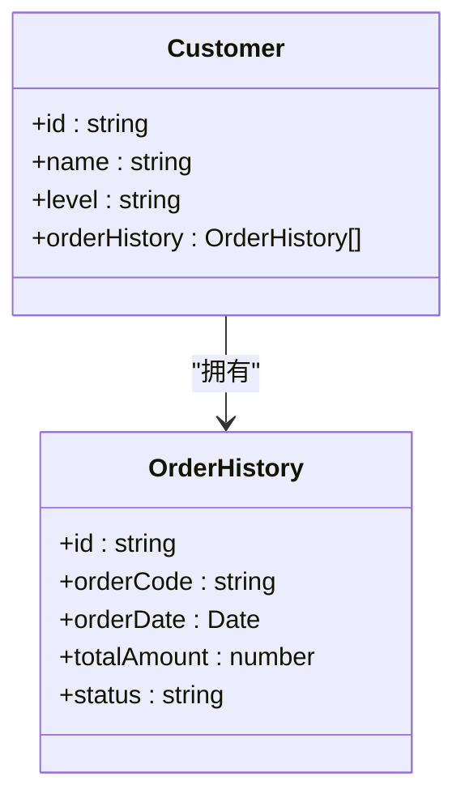
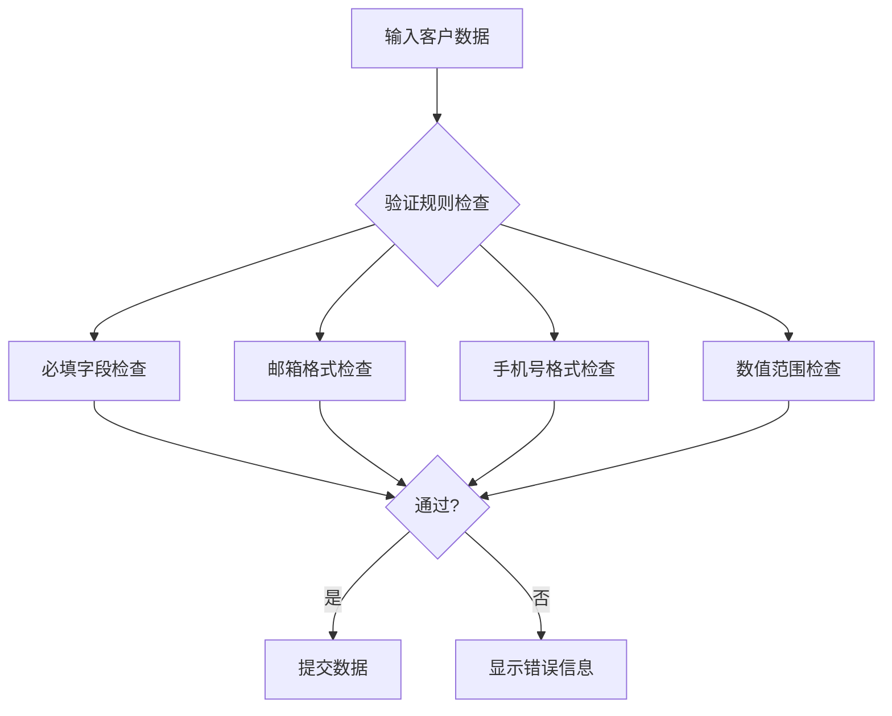
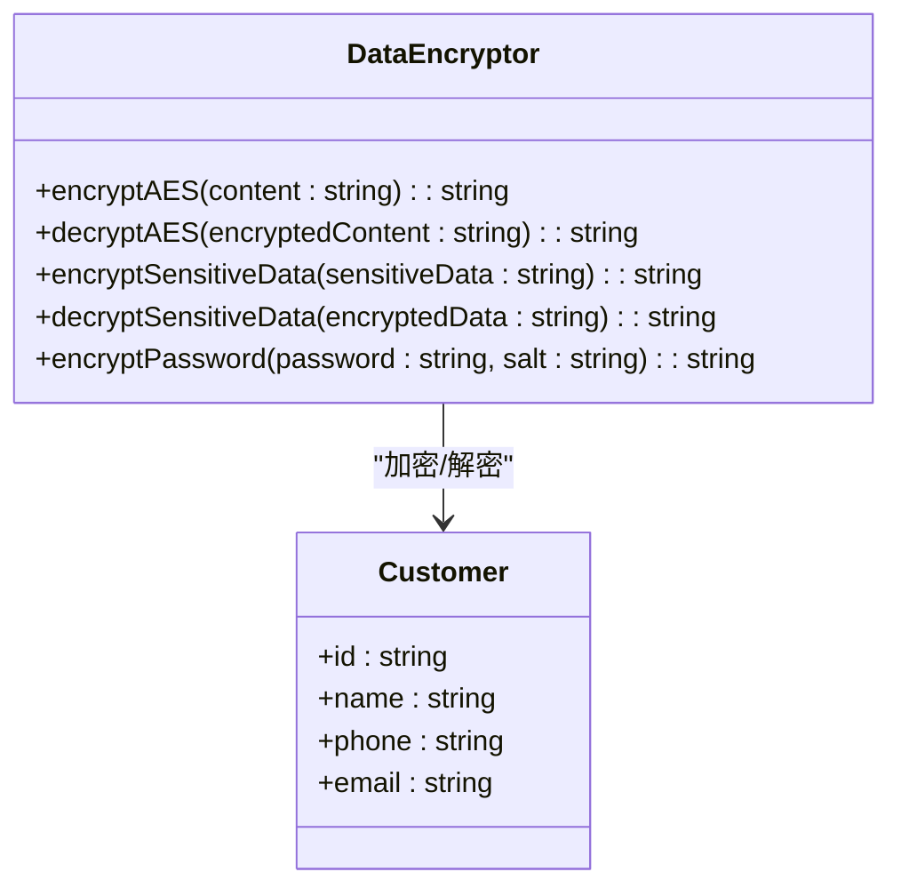
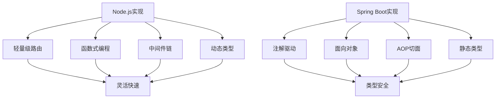
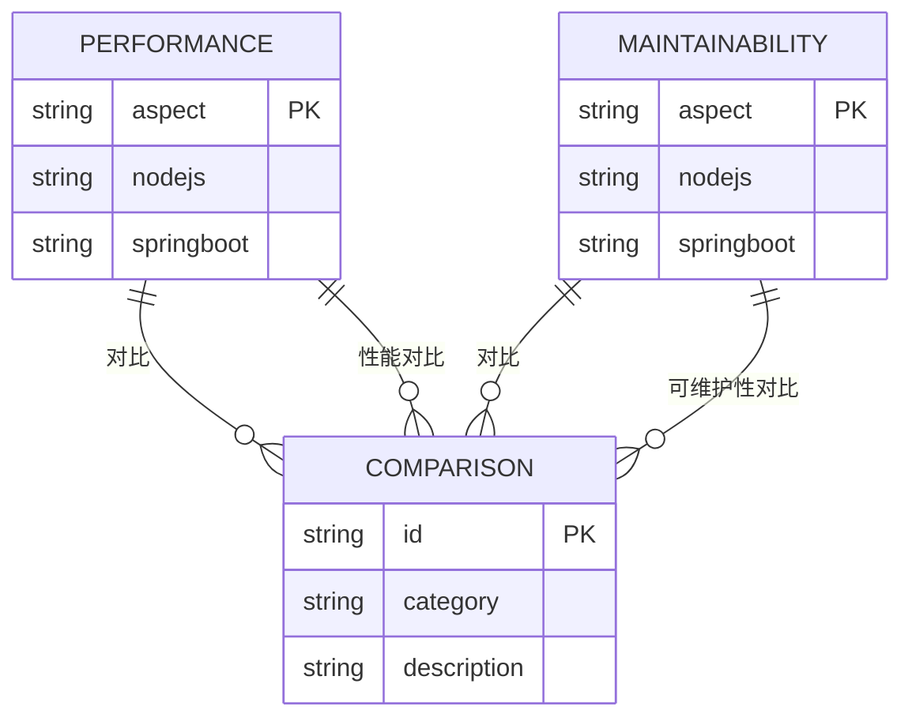

# 客户管理API

<cite>
**本文档引用的文件**   
- [customers.js](file://07-backend/routes/customers.js)
- [orderApi.js](file://07-frontend/src/api/sales/orderApi.js)
- [DataEncryptor.java](file://08-backend/src/main/java/com/enterprise/brain/common/security/DataEncryptor.java)
- [sales-api.js](file://07-frontend/src/services/api/sales-api.js)
</cite>

## 目录
1. [简介](#简介)
2. [Node.js客户管理API](#nodejs客户管理api)
3. [客户与销售订单关联关系](#客户与销售订单关联关系)
4. [数据验证与安全处理](#数据验证与安全处理)
5. [接口对比分析](#接口对比分析)

## 简介
本文档详细记录了基于Node.js和Spring Boot双实现的客户管理接口。文档涵盖了客户信息的增删改查、客户列表分页查询、客户等级管理等功能，对比分析了轻量级路由实现与完整控制器的RESTful设计差异。同时，文档解释了客户与销售订单的关联关系，以及在订单API中如何通过客户ID关联订单数据，并提供了客户数据验证规则和敏感信息加密处理说明。

## Node.js客户管理API

### 客户管理接口
Node.js实现的客户管理API提供了完整的客户生命周期管理功能，包括客户信息的增删改查、客户等级管理、联系人管理等。API基于Express框架实现，采用RESTful设计风格。

#### 客户增删改查接口
客户管理API提供了标准的CRUD操作接口：

- **获取客户列表**：`GET /sales/customers` 支持分页、筛选和排序功能
- **获取客户详情**：`GET /sales/customers/:id` 获取指定客户的所有信息
- **创建客户**：`POST /sales/customers` 创建新客户记录
- **更新客户**：`PUT /sales/customers/:id` 更新客户信息
- **删除客户**：`DELETE /sales/customers/:id` 删除客户记录

**接口来源**
- [customers.js](file://07-backend/routes/customers.js#L13-L104)

#### 客户列表分页查询
客户列表接口支持分页查询，通过查询参数控制返回结果：

**接口来源**
- [customers.js](file://07-backend/routes/customers.js#L15-L25)

#### 客户等级管理
客户管理API支持客户等级管理功能，通过level字段标识客户等级：

**接口来源**
- [customers.js](file://07-backend/routes/customers.js#L41-L44)

## 客户与销售订单关联关系

### 订单API中的客户关联
在订单API中，通过客户ID关联订单数据，实现了客户与订单的关联查询功能。

#### 订单列表查询
订单列表接口支持通过客户名称筛选订单：

**接口来源**
- [orderApi.js](file://07-frontend/src/api/sales/orderApi.js#L18-L19)

#### 客户订单历史
客户管理API提供了客户订单历史查询功能，可以获取指定客户的订单历史记录：

**接口来源**
- [customers.js](file://07-backend/routes/customers.js#L464-L502)

## 数据验证与安全处理

### 客户数据验证规则
客户管理API实现了严格的数据验证规则，确保客户数据的完整性和准确性。

#### 前端验证规则
前端通过验证服务对客户数据进行验证：

**接口来源**
- [input-validator.js](file://07-frontend/src/utils/validation/input-validator.js)
- [business-rules.js](file://07-frontend/src/utils/validation/business-rules.js)

#### 敏感信息加密处理
系统对客户敏感信息进行加密处理，确保数据安全：

**接口来源**
- [DataEncryptor.java](file://08-backend/src/main/java/com/enterprise/brain/common/security/DataEncryptor.java#L42-L203)

## 接口对比分析

### Node.js与Spring Boot实现对比
对比分析了Node.js轻量级路由实现与Spring Boot完整控制器的RESTful设计差异。

#### 设计模式对比
两种实现方式在设计模式上存在显著差异：

**接口来源**
- [customers.js](file://07-backend/routes/customers.js)
- [DataEncryptor.java](file://08-backend/src/main/java/com/enterprise/brain/common/security/DataEncryptor.java)

#### 性能与可维护性
两种实现方式在性能和可维护性方面各有优劣：

**接口来源**
- [customers.js](file://07-backend/routes/customers.js)
- [DataEncryptor.java](file://08-backend/src/main/java/com/enterprise/brain/common/security/DataEncryptor.java)