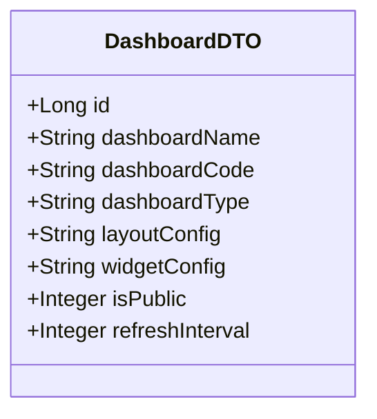
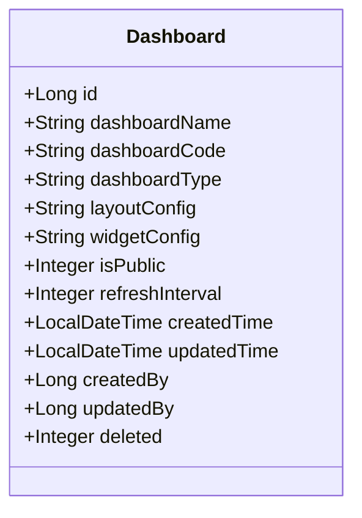
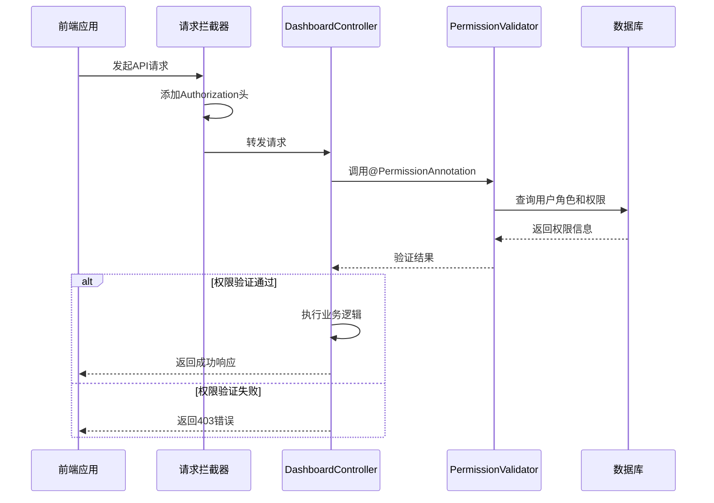
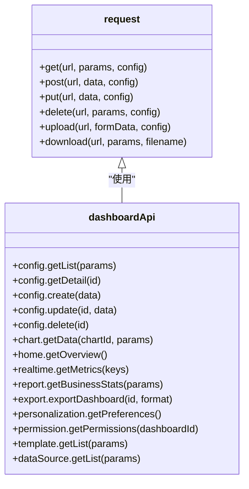

# 仪表板API

<cite>
**本文档引用文件**  
- [DashboardController.java](file://08-backend/src/main/java/com/enterprise/brain/modules/analytics/controller/DashboardController.java)
- [DashboardDTO.java](file://08-backend/src/main/java/com/enterprise/brain/modules/analytics/dto/DashboardDTO.java)
- [Dashboard.java](file://08-backend/src/main/java/com/enterprise/brain/modules/analytics/entity/Dashboard.java)
- [dashboard-api.js](file://07-frontend/src/services/api/dashboard-api.js)
- [request.js](file://07-frontend/src/utils/request.js)
- [SecurityConfig.java](file://08-backend/src/main/java/com/enterprise/brain/common/config/SecurityConfig.java)
- [PermissionValidator.java](file://08-backend/src/main/java/com/enterprise/brain/common/security/PermissionValidator.java)
- [PermissionAnnotation.java](file://08-backend/src/main/java/com/enterprise/brain/common/annotation/PermissionAnnotation.java)
- [DashboardMapper.java](file://08-backend/src/main/java/com/enterprise/brain/modules/analytics/repository/DashboardMapper.java)
</cite>

## 目录
1. [简介](#简介)
2. [核心接口说明](#核心接口说明)
3. [数据结构定义](#数据结构定义)
4. [权限控制机制](#权限控制机制)
5. [前端调用方式](#前端调用方式)
6. [错误处理与响应](#错误处理与响应)

## 简介
本API文档详细描述了仪表板管理模块的后端接口设计与前端调用方式。系统通过`DashboardController`提供完整的仪表板生命周期管理功能，包括创建、更新、删除、查询等操作。所有接口均遵循RESTful规范，并通过统一的响应格式返回数据。前端通过封装的`request`服务进行调用，实现了请求拦截、响应处理和错误提示的统一管理。

**Section sources**
- [DashboardController.java](file://08-backend/src/main/java/com/enterprise/brain/modules/analytics/controller/DashboardController.java)

## 核心接口说明

### 创建仪表板（POST /analytics/dashboard）
用于创建新的仪表板配置。

**请求参数**
- **方法**: POST
- **路径**: `/analytics/dashboard`
- **请求体**: `DashboardDTO` 对象

**响应**
- **状态码**: 200
- **响应体**: `ApiResponse<Long>`，包含新创建的仪表板ID

### 更新仪表板（PUT /analytics/dashboard/{id}）
用于更新指定ID的仪表板配置。

**请求参数**
- **方法**: PUT
- **路径**: `/analytics/dashboard/{id}`
- **路径参数**:
  - `id`: 仪表板ID (Long)
- **请求体**: `DashboardDTO` 对象

**响应**
- **状态码**: 200
- **响应体**: `ApiResponse<Boolean>`，表示更新是否成功

### 删除仪表板（DELETE /analytics/dashboard/{id}）
用于删除指定ID的仪表板。

**请求参数**
- **方法**: DELETE
- **路径**: `/analytics/dashboard/{id}`
- **路径参数**:
  - `id`: 仪表板ID (Long)

**响应**
- **状态码**: 200
- **响应体**: `ApiResponse<Boolean>`，表示删除是否成功

### 获取仪表板详情（GET /analytics/dashboard/{id}）
获取指定ID的仪表板完整信息。

**请求参数**
- **方法**: GET
- **路径**: `/analytics/dashboard/{id}`
- **路径参数**:
  - `id`: 仪表板ID (Long)

**响应**
- **状态码**: 200
- **响应体**: `ApiResponse<Dashboard>`，包含完整的仪表板实体信息

### 获取仪表板列表（GET /analytics/dashboard/list）
获取分页的仪表板列表，支持关键词搜索。

**请求参数**
- **方法**: GET
- **路径**: `/analytics/dashboard/list`
- **查询参数**:
  - `pageNum`: 页码 (Integer, 默认值: 1)
  - `pageSize`: 每页数量 (Integer, 默认值: 10)
  - `keyword`: 搜索关键词 (String, 可选)

**响应**
- **状态码**: 200
- **响应体**: `ApiResponse<Page<Dashboard>>`，包含分页信息的仪表板列表

### 获取公开仪表板（GET /analytics/dashboard/public）
获取所有公开的仪表板列表。

**请求参数**
- **方法**: GET
- **路径**: `/analytics/dashboard/public`

**响应**
- **状态码**: 200
- **响应体**: `ApiResponse<List<Dashboard>>`，包含所有公开仪表板的列表

### 获取用户可见仪表板（GET /analytics/dashboard/user/{userId}）
获取指定用户有权限查看的所有仪表板。

**请求参数**
- **方法**: GET
- **路径**: `/analytics/dashboard/user/{userId}`
- **路径参数**:
  - `userId`: 用户ID (Long)

**响应**
- **状态码**: 200
- **响应体**: `ApiResponse<List<Dashboard>>`，包含用户可见的仪表板列表

**Section sources**
- [DashboardController.java](file://08-backend/src/main/java/com/enterprise/brain/modules/analytics/controller/DashboardController.java)

## 数据结构定义

### DashboardDTO（请求体结构）
用于创建和更新仪表板的传输对象。



**字段说明**
- `id`: 仪表板ID（更新时需要）
- `dashboardName`: 仪表板名称（必填）
- `dashboardCode`: 仪表板编码（必填）
- `dashboardType`: 仪表板类型
- `layoutConfig`: 布局配置（JSON格式）
- `widgetConfig`: 组件配置（JSON格式）
- `isPublic`: 是否公开（1: 公开, 0: 私有）
- `refreshInterval`: 刷新间隔（分钟）

**Diagram sources**
- [DashboardDTO.java](file://08-backend/src/main/java/com/enterprise/brain/modules/analytics/dto/DashboardDTO.java)

### Dashboard（响应实体结构）
仪表板的完整实体对象，包含数据库中的所有字段。



**字段说明**
- `id`: 仪表板ID
- `dashboardName`: 仪表板名称
- `dashboardCode`: 仪表板编码
- `dashboardType`: 仪表板类型
- `layoutConfig`: 布局配置
- `widgetConfig`: 组件配置
- `isPublic`: 是否公开
- `refreshInterval`: 刷新间隔（分钟）
- `createdTime`: 创建时间
- `updatedTime`: 更新时间
- `createdBy`: 创建人
- `updatedBy`: 更新人
- `deleted`: 逻辑删除标记

**Diagram sources**
- [Dashboard.java](file://08-backend/src/main/java/com/enterprise/brain/modules/analytics/entity/Dashboard.java)

## 权限控制机制
系统通过注解式权限控制实现细粒度的访问控制。

### 权限验证流程


**Diagram sources**
- [PermissionValidator.java](file://08-backend/src/main/java/com/enterprise/brain/common/security/PermissionValidator.java)
- [SecurityConfig.java](file://08-backend/src/main/java/com/enterprise/brain/common/config/SecurityConfig.java)
- [PermissionAnnotation.java](file://08-backend/src/main/java/com/enterprise/brain/common/annotation/PermissionAnnotation.java)

### 权限控制规则
- **角色验证**: 支持`ADMIN`、`USER`等角色
- **权限码验证**: 支持细粒度的权限控制（如`dashboard:create`、`dashboard:delete`）
- **逻辑运算**: 支持AND和OR两种逻辑类型
- **数据权限**: 通过`validateDataPermission`方法实现数据级别的权限控制

**Section sources**
- [PermissionValidator.java](file://08-backend/src/main/java/com/enterprise/brain/common/security/PermissionValidator.java)
- [PermissionAnnotation.java](file://08-backend/src/main/java/com/enterprise/brain/common/annotation/PermissionAnnotation.java)

## 前端调用方式
前端通过`dashboard-api.js`中的`request`封装进行API调用。

### API调用封装


**Diagram sources**
- [dashboard-api.js](file://07-frontend/src/services/api/dashboard-api.js)
- [request.js](file://07-frontend/src/utils/request.js)

### 调用示例
```javascript
// 创建仪表板
dashboardApi.config.create({
  dashboardName: '销售仪表板',
  dashboardCode: 'sales_dashboard',
  dashboardType: 'SALES',
  layoutConfig: '{}',
  widgetConfig: '{}',
  isPublic: 1,
  refreshInterval: 5
})

// 获取仪表板列表
dashboardApi.config.getList({
  pageNum: 1,
  pageSize: 10,
  keyword: '销售'
})

// 获取仪表板详情
dashboardApi.config.getDetail(123)

// 更新仪表板
dashboardApi.config.update(123, {
  dashboardName: '更新后的销售仪表板',
  refreshInterval: 10
})

// 删除仪表板
dashboardApi.config.delete(123)
```

**Section sources**
- [dashboard-api.js](file://07-frontend/src/services/api/dashboard-api.js)
- [request.js](file://07-frontend/src/utils/request.js)

## 错误处理与响应
系统采用统一的响应格式和错误处理机制。

### 响应格式
所有API响应均遵循`ApiResponse<T>`格式：
```json
{
  "code": 200,
  "message": "success",
  "data": {}
}
```

### 错误码说明
| 错误码 | 说明 |
|-------|------|
| 200 | 成功 |
| 400 | 请求参数错误 |
| 401 | 未授权 |
| 403 | 权限不足 |
| 404 | 资源不存在 |
| 500 | 服务器内部错误 |

### 异常处理流程
```mermaid
flowchart TD
A[前端发起请求] --> B{请求拦截器}
B --> C[添加Authorization头]
C --> D[后端接收请求]
D --> E{权限验证}
E --> |通过| F[执行业务逻辑]
E --> |失败| G[返回403错误]
F --> H{业务异常}
H --> |是| I[返回对应错误码]
H --> |否| J[返回成功响应]
I --> K[前端响应拦截器]
J --> K
K --> L{响应类型}
L --> |Blob| M[处理文件下载]
L --> |JSON| N{code == 200}
N --> |是| O[返回data]
N --> |否| P[显示错误消息]
P --> Q[跳转登录页(401)]
```

**Diagram sources**
- [request.js](file://07-frontend/src/utils/request.js)
- [SecurityConfig.java](file://08-backend/src/main/java/com/enterprise/brain/common/config/SecurityConfig.java)

**Section sources**
- [request.js](file://07-frontend/src/utils/request.js)
- [SecurityConfig.java](file://08-backend/src/main/java/com/enterprise/brain/common/config/SecurityConfig.java)