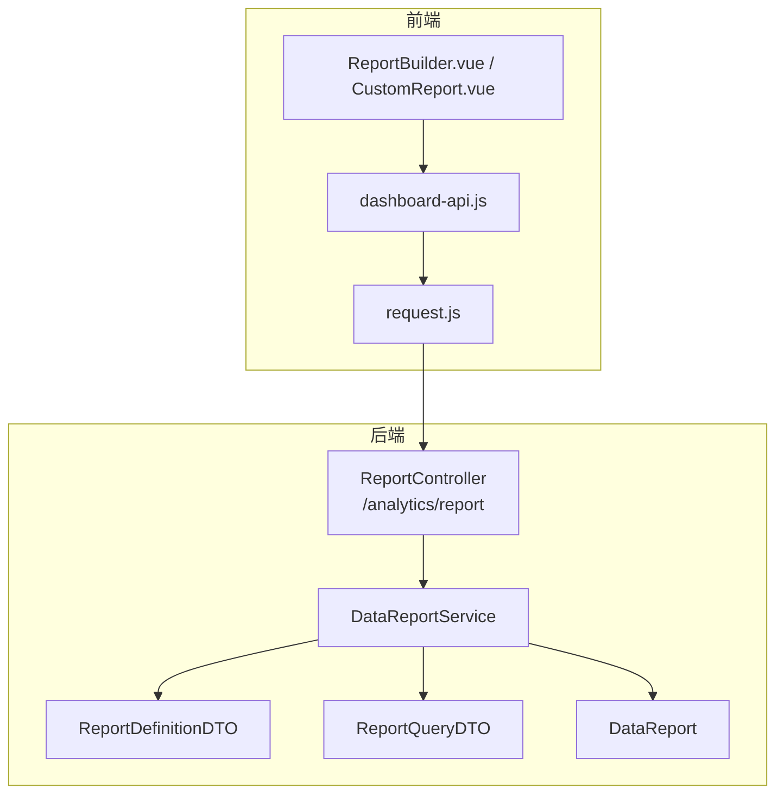
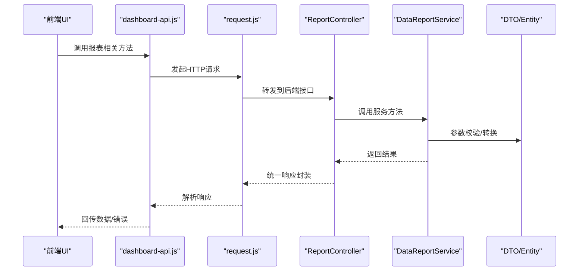
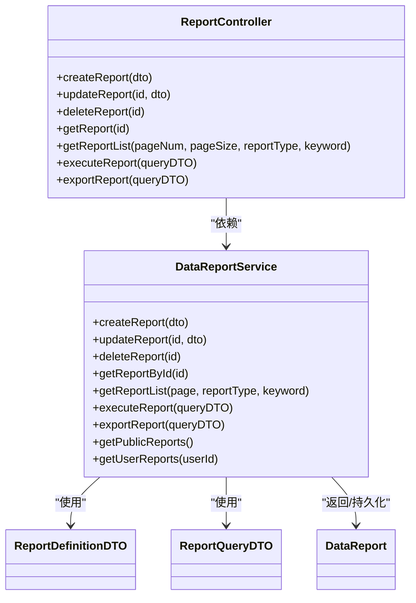

# 报表API

<cite>
**本文引用的文件**
- [ReportController.java](file://08-backend/src/main/java/com/enterprise/brain/modules/analytics/controller/ReportController.java)
- [ReportDefinitionDTO.java](file://08-backend/src/main/java/com/enterprise/brain/modules/analytics/dto/ReportDefinitionDTO.java)
- [ReportQueryDTO.java](file://08-backend/src/main/java/com/enterprise/brain/modules/analytics/dto/ReportQueryDTO.java)
- [DataReport.java](file://08-backend/src/main/java/com/enterprise/brain/modules/analytics/entity/DataReport.java)
- [DataReportService.java](file://08-backend/src/main/java/com/enterprise/brain/modules/analytics/service/DataReportService.java)
- [dashboard-api.js](file://07-frontend/src/services/api/dashboard-api.js)
- [request.js](file://07-frontend/src/utils/request.js)
- [ReportBuilder.vue](file://07-frontend/src/pages/analytics/components/ReportBuilder.vue)
- [CustomReport.vue](file://07-frontend/src/pages/analytics/CustomReport.vue)
</cite>

## 目录
1. [简介](#简介)
2. [项目结构](#项目结构)
3. [核心组件](#核心组件)
4. [架构总览](#架构总览)
5. [详细组件分析](#详细组件分析)
6. [依赖关系分析](#依赖关系分析)
7. [性能考虑](#性能考虑)
8. [故障排查指南](#故障排查指南)
9. [结论](#结论)
10. [附录](#附录)

## 简介
本文件面向报表管理模块的API文档，聚焦于后端ReportController提供的报表生命周期与查询导出能力，并结合前端dashboard-api.js中的报表相关方法进行说明。内容覆盖：
- 创建报表（POST /analytics/report）
- 更新报表（PUT /analytics/report/{id}）
- 删除报表（DELETE /analytics/report/{id}）
- 获取报表详情（GET /analytics/report/{id}）
- 获取报表列表（GET /analytics/report/list）
- 执行报表查询（POST /analytics/report/execute）
- 导出报表（POST /analytics/report/export）

同时对请求体结构（ReportDefinitionDTO、ReportQueryDTO）、返回实体（DataReport）及前端关联方法进行说明，帮助开发者快速集成与调试。

## 项目结构
后端采用Spring Boot + MyBatis-Plus，报表相关代码位于analytics模块；前端通过dashboard-api.js封装REST调用，统一经request.js进行HTTP请求与响应处理。

**图表来源**
- [ReportController.java](file://08-backend/src/main/java/com/enterprise/brain/modules/analytics/controller/ReportController.java#L1-L101)
- [DataReportService.java](file://08-backend/src/main/java/com/enterprise/brain/modules/analytics/service/DataReportService.java#L1-L93)
- [ReportDefinitionDTO.java](file://08-backend/src/main/java/com/enterprise/brain/modules/analytics/dto/ReportDefinitionDTO.java#L1-L77)
- [ReportQueryDTO.java](file://08-backend/src/main/java/com/enterprise/brain/modules/analytics/dto/ReportQueryDTO.java#L1-L61)
- [DataReport.java](file://08-backend/src/main/java/com/enterprise/brain/modules/analytics/entity/DataReport.java#L1-L121)
- [dashboard-api.js](file://07-frontend/src/services/api/dashboard-api.js#L1-L259)
- [request.js](file://07-frontend/src/utils/request.js#L1-L191)
- [ReportBuilder.vue](file://07-frontend/src/pages/analytics/components/ReportBuilder.vue#L1-L165)
- [CustomReport.vue](file://07-frontend/src/pages/analytics/CustomReport.vue#L1-L680)

**章节来源**
- [ReportController.java](file://08-backend/src/main/java/com/enterprise/brain/modules/analytics/controller/ReportController.java#L1-L101)
- [dashboard-api.js](file://07-frontend/src/services/api/dashboard-api.js#L1-L259)

## 核心组件
- ReportController：提供报表的CRUD、列表、执行查询、导出等REST接口。
- DataReportService：服务接口，定义创建、更新、删除、查询、执行、导出等契约。
- ReportDefinitionDTO：创建/更新报表的请求体结构。
- ReportQueryDTO：执行/导出报表的请求体结构。
- DataReport：数据库实体映射，用于详情与列表返回。

**章节来源**
- [DataReportService.java](file://08-backend/src/main/java/com/enterprise/brain/modules/analytics/service/DataReportService.java#L1-L93)
- [ReportDefinitionDTO.java](file://08-backend/src/main/java/com/enterprise/brain/modules/analytics/dto/ReportDefinitionDTO.java#L1-L77)
- [ReportQueryDTO.java](file://08-backend/src/main/java/com/enterprise/brain/modules/analytics/dto/ReportQueryDTO.java#L1-L61)
- [DataReport.java](file://08-backend/src/main/java/com/enterprise/brain/modules/analytics/entity/DataReport.java#L1-L121)

## 架构总览
后端以Controller为入口，调用Service完成业务处理；Service与DTO/Entity交互，最终返回统一响应对象。前端通过dashboard-api.js封装各接口调用，request.js负责统一拦截与错误处理。

**图表来源**
- [ReportController.java](file://08-backend/src/main/java/com/enterprise/brain/modules/analytics/controller/ReportController.java#L1-L101)
- [DataReportService.java](file://08-backend/src/main/java/com/enterprise/brain/modules/analytics/service/DataReportService.java#L1-L93)
- [dashboard-api.js](file://07-frontend/src/services/api/dashboard-api.js#L1-L259)
- [request.js](file://07-frontend/src/utils/request.js#L1-L191)

## 详细组件分析

### 报表管理接口总览
- 创建报表
  - 方法：POST
  - 路径：/analytics/report
  - 请求体：ReportDefinitionDTO
  - 响应：Long（报表ID）
- 更新报表
  - 方法：PUT
  - 路径：/analytics/report/{id}
  - 路径参数：id（Long）
  - 请求体：ReportDefinitionDTO
  - 响应：Boolean（是否成功）
- 删除报表
  - 方法：DELETE
  - 路径：/analytics/report/{id}
  - 路径参数：id（Long）
  - 响应：Boolean（是否成功）
- 获取报表详情
  - 方法：GET
  - 路径：/analytics/report/{id}
  - 路径参数：id（Long）
  - 响应：DataReport
- 获取报表列表
  - 方法：GET
  - 路径：/analytics/report/list
  - 查询参数：
    - pageNum（默认1）
    - pageSize（默认10）
    - reportType（可选，类型过滤）
    - keyword（可选，关键词检索）
  - 响应：Page<DataReport>
- 执行报表查询
  - 方法：POST
  - 路径：/analytics/report/execute
  - 请求体：ReportQueryDTO
  - 响应：Map<String,Object>（查询结果集）
- 导出报表
  - 方法：POST
  - 路径：/analytics/report/export
  - 请求体：ReportQueryDTO
  - 响应：String（文件路径或下载链接标识）

**章节来源**
- [ReportController.java](file://08-backend/src/main/java/com/enterprise/brain/modules/analytics/controller/ReportController.java#L1-L101)

### 请求体与返回实体结构

#### ReportDefinitionDTO（创建/更新报表）
- 字段要点
  - id：Long（可选，更新时使用）
  - reportName：字符串（必填）
  - reportCode：字符串（必填）
  - reportType：字符串（必填，取值如table/chart/dashboard）
  - dataSource：字符串（可选）
  - querySql：字符串（可选）
  - reportConfig：JSON字符串（可选）
  - chartConfig：JSON字符串（可选）
  - filterConfig：JSON字符串（可选）
  - isPublic：整型（0/1）
  - refreshInterval：整型（分钟）

**章节来源**
- [ReportDefinitionDTO.java](file://08-backend/src/main/java/com/enterprise/brain/modules/analytics/dto/ReportDefinitionDTO.java#L1-L77)

#### ReportQueryDTO（执行/导出报表）
- 字段要点
  - reportId：Long（必填）
  - filterParams：JSON字符串（可选，筛选参数）
  - sortField：字符串（可选）
  - sortOrder：字符串（可选，ASC/DESC）
  - pageNum：整型（可选）
  - pageSize：整型（可选）
  - export：布尔（可选，是否导出）
  - exportFormat：字符串（可选，excel/pdf/csv）

**章节来源**
- [ReportQueryDTO.java](file://08-backend/src/main/java/com/enterprise/brain/modules/analytics/dto/ReportQueryDTO.java#L1-L61)

#### DataReport（报表详情/列表）
- 字段要点
  - id：Long
  - reportName：字符串
  - reportCode：字符串
  - reportType：字符串（table/chart/dashboard）
  - dataSource：字符串
  - querySql：字符串
  - reportConfig：字符串
  - chartConfig：字符串
  - filterConfig：字符串
  - isPublic：整型（0/1）
  - refreshInterval：整型（分钟）
  - createdTime：时间戳
  - updatedTime：时间戳
  - createdBy：Long
  - updatedBy：Long
  - deleted：整型（逻辑删除标记）

**章节来源**
- [DataReport.java](file://08-backend/src/main/java/com/enterprise/brain/modules/analytics/entity/DataReport.java#L1-L121)

### 前端关联方法（dashboard-api.js）
- 报表数据获取相关方法
  - dashboardApi.report.getBusinessStats(params)
  - dashboardApi.report.getSalesTrend(params)
  - dashboardApi.report.getUserAnalysis(params)
  - dashboardApi.report.getProductAnalysis(params)
  - dashboardApi.report.getFinanceAnalysis(params)
- 数据导出相关方法
  - dashboardApi.export.exportData(reportType, params)
- 注意：上述方法与analytics模块的报表API并非同一组接口，但同属前端报表生态。若需对接analytics模块，请参考后端接口路径与DTO结构。

**章节来源**
- [dashboard-api.js](file://07-frontend/src/services/api/dashboard-api.js#L1-L259)

### 前端报表构建与列表页面
- 报表构建器（ReportBuilder.vue）
  - 表单字段与ReportDefinitionDTO对应，支持保存为ReportDefinitionDTO对象
  - isPublic开关会转换为1/0存储
- 自定义报表页面（CustomReport.vue）
  - 提供报表列表、分页、类型筛选、执行/编辑/复制/删除等操作
  - 执行结果以对话框展示，包含数据结果、图表展示、执行信息

**章节来源**
- [ReportBuilder.vue](file://07-frontend/src/pages/analytics/components/ReportBuilder.vue#L1-L165)
- [CustomReport.vue](file://07-frontend/src/pages/analytics/CustomReport.vue#L1-L680)

## 依赖关系分析

**图表来源**
- [ReportController.java](file://08-backend/src/main/java/com/enterprise/brain/modules/analytics/controller/ReportController.java#L1-L101)
- [DataReportService.java](file://08-backend/src/main/java/com/enterprise/brain/modules/analytics/service/DataReportService.java#L1-L93)
- [ReportDefinitionDTO.java](file://08-backend/src/main/java/com/enterprise/brain/modules/analytics/dto/ReportDefinitionDTO.java#L1-L77)
- [ReportQueryDTO.java](file://08-backend/src/main/java/com/enterprise/brain/modules/analytics/dto/ReportQueryDTO.java#L1-L61)
- [DataReport.java](file://08-backend/src/main/java/com/enterprise/brain/modules/analytics/entity/DataReport.java#L1-L121)

## 性能考虑
- 分页查询
  - 列表接口支持pageNum/pageSize，默认值已在后端设定，建议前端按需调整，避免一次性拉取过大数据。
- 导出性能
  - 导出接口返回文件路径或下载链接，建议后端异步生成文件并提供下载链接，前端轮询或直接下载。
- 查询优化
  - ReportQueryDTO支持sortField/sortOrder、pageNum/pageSize，建议在后端实现合理的索引与分页策略。
- 前端渲染
  - 大数据量表格建议使用虚拟滚动或分页展示，避免一次性渲染过多DOM节点。

[本节为通用建议，不直接分析具体文件]

## 故障排查指南
- 常见错误与处理
  - 参数校验失败：检查ReportDefinitionDTO/ReportQueryDTO必填字段是否完整。
  - 未授权/登录过期：前端request.js会在401时提示重新登录。
  - 404：确认接口路径与版本前缀是否正确。
  - 500：后端异常，查看日志定位具体异常堆栈。
- 前端统一处理
  - request.js对响应进行统一封装，非200会弹窗提示错误消息；下载场景返回blob，由调用方自行处理下载。

**章节来源**
- [request.js](file://07-frontend/src/utils/request.js#L1-L191)

## 结论
本API文档梳理了报表管理模块的核心接口与数据结构，明确了创建、更新、删除、查询、执行与导出的流程。结合前端dashboard-api.js与request.js，可快速完成前后端联调。建议在生产环境完善鉴权、参数校验、分页与导出异步化等细节，确保稳定性与性能。

[本节为总结性内容，不直接分析具体文件]

## 附录

### API清单与示例字段说明
- 创建报表
  - 路径：POST /analytics/report
  - 请求体：ReportDefinitionDTO
  - 返回：Long（报表ID）
- 更新报表
  - 路径：PUT /analytics/report/{id}
  - 路径参数：id（Long）
  - 请求体：ReportDefinitionDTO
  - 返回：Boolean
- 删除报表
  - 路径：DELETE /analytics/report/{id}
  - 路径参数：id（Long）
  - 返回：Boolean
- 获取报表详情
  - 路径：GET /analytics/report/{id}
  - 路径参数：id（Long）
  - 返回：DataReport
- 获取报表列表
  - 路径：GET /analytics/report/list
  - 查询参数：pageNum（默认1）、pageSize（默认10）、reportType（可选）、keyword（可选）
  - 返回：Page<DataReport>
- 执行报表查询
  - 路径：POST /analytics/report/execute
  - 请求体：ReportQueryDTO
  - 返回：Map<String,Object>
- 导出报表
  - 路径：POST /analytics/report/export
  - 请求体：ReportQueryDTO
  - 返回：String（文件路径或下载链接标识）

**章节来源**
- [ReportController.java](file://08-backend/src/main/java/com/enterprise/brain/modules/analytics/controller/ReportController.java#L1-L101)
- [ReportDefinitionDTO.java](file://08-backend/src/main/java/com/enterprise/brain/modules/analytics/dto/ReportDefinitionDTO.java#L1-L77)
- [ReportQueryDTO.java](file://08-backend/src/main/java/com/enterprise/brain/modules/analytics/dto/ReportQueryDTO.java#L1-L61)
- [DataReport.java](file://08-backend/src/main/java/com/enterprise/brain/modules/analytics/entity/DataReport.java#L1-L121)