# 数据分析API

<cite>
**本文档引用的文件**   
- [DashboardController.java](file://08-backend/src/main/java/com/enterprise/brain/modules/analytics/controller/DashboardController.java)
- [ReportController.java](file://08-backend/src/main/java/com/enterprise/brain/modules/analytics/controller/ReportController.java)
- [ReportQueryDTO.java](file://08-backend/src/main/java/com/enterprise/brain/modules/analytics/dto/ReportQueryDTO.java)
- [DashboardDTO.java](file://08-backend/src/main/java/com/enterprise/brain/modules/analytics/dto/DashboardDTO.java)
- [dashboard-api.js](file://07-frontend/src/services/api/dashboard-api.js)
- [KPIChart.vue](file://07-frontend/src/components/common/charts/KPIChart.vue)
- [TrendChart.vue](file://07-frontend/src/components/common/charts/TrendChart.vue)
- [PieChart.vue](file://07-frontend/src/components/common/charts/PieChart.vue)
- [DataVisualization.vue](file://07-frontend/src/pages/analytics/components/DataVisualization.vue)
</cite>

## 目录
1. [简介](#简介)
2. [仪表板服务API](#仪表板服务api)
3. [报表服务API](#报表服务api)
4. [前端数据聚合](#前端数据聚合)
5. [报表查询参数结构](#报表查询参数结构)
6. [数据可视化组件](#数据可视化组件)
7. [分页与缓存策略](#分页与缓存策略)

## 简介
本文档详细描述了数据分析模块的API接口，涵盖仪表板和报表服务。文档重点介绍DashboardController中仪表板创建、布局配置、组件数据绑定等接口，以及ReportController中自定义报表查询、数据导出等功能。同时说明了在dashboard-api.js中如何聚合多个数据源，实现KPI卡片、趋势图、饼图等可视化组件的数据请求。此外，文档还记录了报表查询请求体（ReportQueryDTO）的维度、指标、过滤条件等参数结构，以及分页和缓存策略。

## 仪表板服务API

仪表板服务API提供了完整的仪表板管理功能，包括创建、更新、删除、获取详情和列表等操作。这些接口通过DashboardController实现，为前端提供了灵活的仪表板配置能力。

### 仪表板创建与管理
仪表板创建接口允许用户创建新的仪表板配置，包括名称、编码、类型、布局配置和组件配置等信息。创建成功后返回仪表板ID，用于后续的更新和查询操作。

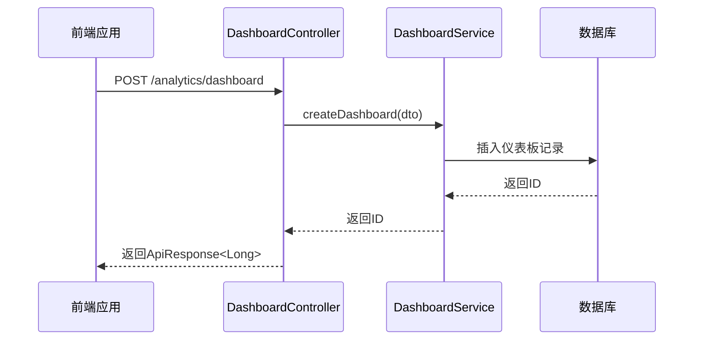

**接口详情：**
- **创建仪表板**：`POST /analytics/dashboard`
- **更新仪表板**：`PUT /analytics/dashboard/{id}`
- **删除仪表板**：`DELETE /analytics/dashboard/{id}`
- **获取仪表板详情**：`GET /analytics/dashboard/{id}`
- **获取仪表板列表**：`GET /analytics/dashboard/list`

**仪表板DTO结构：**
- `id`：仪表板ID
- `dashboardName`：仪表板名称（必填）
- `dashboardCode`：仪表板编码（必填）
- `dashboardType`：仪表板类型
- `layoutConfig`：布局配置（JSON格式）
- `widgetConfig`：组件配置（JSON格式）
- `isPublic`：是否公开
- `refreshInterval`：刷新间隔（分钟）

**Diagram sources**
- [DashboardController.java](file://08-backend/src/main/java/com/enterprise/brain/modules/analytics/controller/DashboardController.java#L30-L35)
- [DashboardDTO.java](file://08-backend/src/main/java/com/enterprise/brain/modules/analytics/dto/DashboardDTO.java#L19-L60)

**Section sources**
- [DashboardController.java](file://08-backend/src/main/java/com/enterprise/brain/modules/analytics/controller/DashboardController.java#L16-L83)
- [DashboardDTO.java](file://08-backend/src/main/java/com/enterprise/brain/modules/analytics/dto/DashboardDTO.java#L1-L60)

### 仪表板布局与组件配置
仪表板的布局和组件配置通过JSON格式的字符串进行存储和传输。布局配置定义了仪表板的整体布局结构，包括行、列、区域等信息。组件配置则定义了每个可视化组件的属性、数据绑定和显示设置。

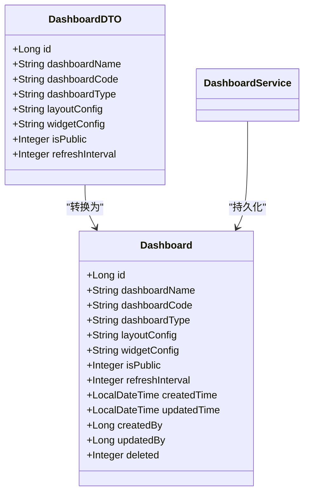

**布局配置示例：**
```json
{
  "rows": [
    {
      "height": "300px",
      "columns": [
        {
          "width": "50%",
          "widgets": ["kpi-1", "chart-1"]
        },
        {
          "width": "50%",
          "widgets": ["pie-1", "trend-1"]
        }
      ]
    }
  ]
}
```

**组件配置示例：**
```json
{
  "widgets": {
    "kpi-1": {
      "type": "kpi",
      "title": "销售额",
      "dataConfig": {
        "dataSource": "sales-api",
        "query": "/sales/total",
        "format": "currency"
      },
      "position": {"row": 0, "col": 0}
    },
    "chart-1": {
      "type": "line",
      "title": "销售趋势",
      "dataConfig": {
        "dataSource": "sales-api",
        "query": "/sales/trend",
        "xField": "date",
        "yField": "amount"
      },
      "position": {"row": 0, "col": 0}
    }
  }
}
```

**Diagram sources**
- [DashboardDTO.java](file://08-backend/src/main/java/com/enterprise/brain/modules/analytics/dto/DashboardDTO.java#L19-L60)
- [Dashboard.java](file://08-backend/src/main/java/com/enterprise/brain/modules/analytics/entity/Dashboard.java#L24-L102)

**Section sources**
- [DashboardDTO.java](file://08-backend/src/main/java/com/enterprise/brain/modules/analytics/dto/DashboardDTO.java#L1-L60)
- [Dashboard.java](file://08-backend/src/main/java/com/enterprise/brain/modules/analytics/entity/Dashboard.java#L1-L103)

## 报表服务API

报表服务API提供了完整的报表管理功能，包括创建、更新、删除、执行查询和导出等操作。这些接口通过ReportController实现，为用户提供了灵活的报表定义和查询能力。

### 报表创建与管理
报表创建接口允许用户创建新的报表定义，包括名称、编码、类型、数据源、查询SQL和报表配置等信息。创建成功后返回报表ID，用于后续的查询和导出操作。

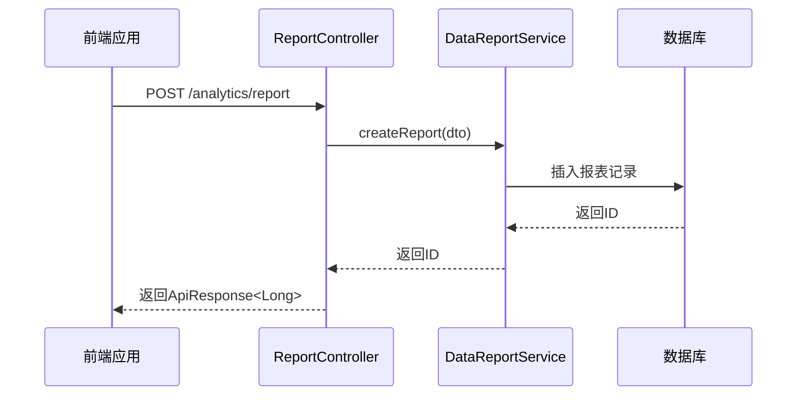

**接口详情：**
- **创建报表**：`POST /analytics/report`
- **更新报表**：`PUT /analytics/report/{id}`
- **删除报表**：`DELETE /analytics/report/{id}`
- **获取报表详情**：`GET /analytics/report/{id}`
- **获取报表列表**：`GET /analytics/report/list`
- **执行报表查询**：`POST /analytics/report/execute`
- **导出报表**：`POST /analytics/report/export`

**Diagram sources**
- [ReportController.java](file://08-backend/src/main/java/com/enterprise/brain/modules/analytics/controller/ReportController.java#L32-L36)
- [ReportDefinitionDTO.java](file://08-backend/src/main/java/com/enterprise/brain/modules/analytics/dto/ReportDefinitionDTO.java#L19-L76)

**Section sources**
- [ReportController.java](file://08-backend/src/main/java/com/enterprise/brain/modules/analytics/controller/ReportController.java#L28-L100)
- [ReportDefinitionDTO.java](file://08-backend/src/main/java/com/enterprise/brain/modules/analytics/dto/ReportDefinitionDTO.java#L1-L76)

### 报表执行与导出
报表执行接口允许用户根据定义的报表配置执行查询，并返回查询结果。导出接口则允许用户将查询结果导出为指定格式的文件，如Excel、PDF或CSV。

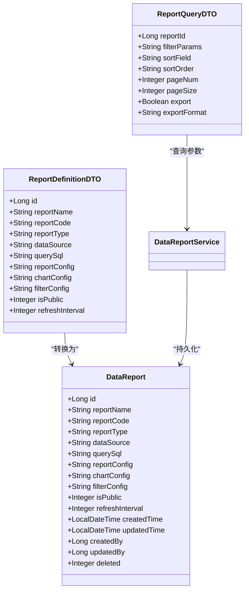

**Diagram sources**
- [ReportDefinitionDTO.java](file://08-backend/src/main/java/com/enterprise/brain/modules/analytics/dto/ReportDefinitionDTO.java#L19-L76)
- [ReportQueryDTO.java](file://08-backend/src/main/java/com/enterprise/brain/modules/analytics/dto/ReportQueryDTO.java#L20-L59)
- [DataReport.java](file://08-backend/src/main/java/com/enterprise/brain/modules/analytics/entity/DataReport.java)

**Section sources**
- [ReportDefinitionDTO.java](file://08-backend/src/main/java/com/enterprise/brain/modules/analytics/dto/ReportDefinitionDTO.java#L1-L76)
- [ReportQueryDTO.java](file://08-backend/src/main/java/com/enterprise/brain/modules/analytics/dto/ReportQueryDTO.java#L1-L60)

## 前端数据聚合

前端通过dashboard-api.js文件中的API服务聚合多个数据源，实现KPI卡片、趋势图、饼图等可视化组件的数据请求。该文件定义了多个API服务模块，包括仪表盘配置、图表组件、首页数据、实时数据、报表数据等。

### 数据聚合机制
dashboard-api.js通过模块化的方式组织API接口，每个模块负责特定类型的数据请求。这种设计使得前端可以灵活地组合不同数据源，实现复杂的数据可视化需求。

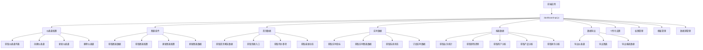

**API服务模块：**
- **config**：仪表盘配置管理
- **chart**：图表组件管理
- **home**：首页数据获取
- **realtime**：实时数据获取
- **report**：报表数据获取
- **export**：数据导出功能
- **personalization**：个性化设置
- **permission**：权限管理
- **template**：模板管理
- **dataSource**：数据源管理

**Diagram sources**
- [dashboard-api.js](file://07-frontend/src/services/api/dashboard-api.js#L4-L258)

**Section sources**
- [dashboard-api.js](file://07-frontend/src/services/api/dashboard-api.js#L1-L259)

### 可视化组件数据请求
前端通过调用dashboard-api.js中的相应接口获取可视化组件所需的数据。每个可视化组件都有对应的API接口，用于获取组件配置和数据。

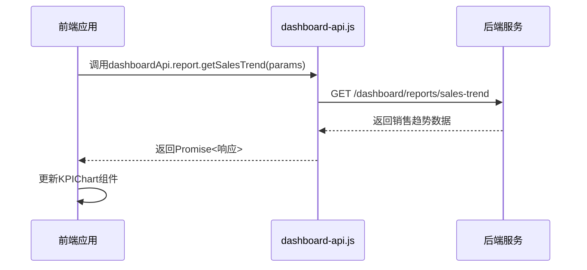

**常见数据请求：**
- **KPI卡片**：`dashboardApi.report.getBusinessStats()`
- **趋势图**：`dashboardApi.report.getSalesTrend()`
- **饼图**：`dashboardApi.report.getUserAnalysis()`
- **实时指标**：`dashboardApi.realtime.getMetrics()`
- **系统状态**：`dashboardApi.realtime.getSystemStatus()`

**Diagram sources**
- [dashboard-api.js](file://07-frontend/src/services/api/dashboard-api.js#L114-L137)
- [KPIChart.vue](file://07-frontend/src/components/common/charts/KPIChart.vue)
- [TrendChart.vue](file://07-frontend/src/components/common/charts/TrendChart.vue)
- [PieChart.vue](file://07-frontend/src/components/common/charts/PieChart.vue)

**Section sources**
- [dashboard-api.js](file://07-frontend/src/services/api/dashboard-api.js#L1-L259)
- [KPIChart.vue](file://07-frontend/src/components/common/charts/KPIChart.vue#L1-L441)
- [TrendChart.vue](file://07-frontend/src/components/common/charts/TrendChart.vue#L1-L407)
- [PieChart.vue](file://07-frontend/src/components/common/charts/PieChart.vue#L1-L263)

## 报表查询参数结构

报表查询参数通过ReportQueryDTO类定义，包含了执行报表查询所需的所有参数。这些参数允许用户灵活地定制查询条件，包括筛选、排序、分页和导出等选项。

### ReportQueryDTO参数详解
ReportQueryDTO是报表查询的核心数据传输对象，它定义了执行报表查询所需的所有参数。

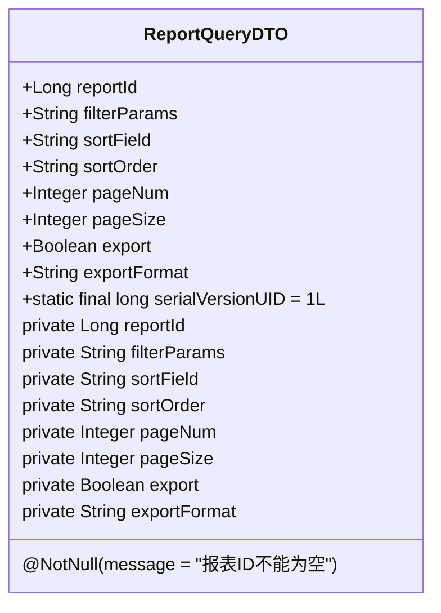

**参数说明：**
- **reportId**：报表ID，必填项，用于指定要查询的报表
- **filterParams**：筛选参数，JSON格式字符串，用于定义查询的过滤条件
- **sortField**：排序字段，指定查询结果的排序依据字段
- **sortOrder**：排序方式，可选值为ASC（升序）或DESC（降序）
- **pageNum**：页码，用于分页查询，从1开始
- **pageSize**：每页数量，用于分页查询，指定每页返回的记录数
- **export**：是否导出，布尔值，true表示导出，false表示仅查询
- **exportFormat**：导出格式，可选值为excel、pdf、csv等

**Diagram sources**
- [ReportQueryDTO.java](file://08-backend/src/main/java/com/enterprise/brain/modules/analytics/dto/ReportQueryDTO.java#L16-L60)

**Section sources**
- [ReportQueryDTO.java](file://08-backend/src/main/java/com/enterprise/brain/modules/analytics/dto/ReportQueryDTO.java#L1-L60)

### 筛选参数结构
筛选参数（filterParams）是一个JSON格式的字符串，用于定义复杂的查询过滤条件。它支持多维度、多指标的组合筛选。

```json
{
  "dimensions": [
    {
      "field": "region",
      "values": ["华东", "华北", "华南"],
      "operator": "in"
    },
    {
      "field": "productCategory",
      "values": ["电子产品", "家居用品"],
      "operator": "in"
    },
    {
      "field": "saleDate",
      "values": ["2023-01-01", "2023-12-31"],
      "operator": "between"
    }
  ],
  "metrics": [
    {
      "field": "salesAmount",
      "condition": "gt",
      "value": 10000
    },
    {
      "field": "profitMargin",
      "condition": "gte",
      "value": 0.2
    }
  ],
  "logicalOperator": "and"
}
```

**筛选参数说明：**
- **dimensions**：维度筛选，定义按哪些维度进行筛选
  - `field`：筛选字段
  - `values`：筛选值列表
  - `operator`：筛选操作符，支持in、not in、between、not between等
- **metrics**：指标筛选，定义按哪些指标进行筛选
  - `field`：指标字段
  - `condition`：条件操作符，支持gt（大于）、gte（大于等于）、lt（小于）、lte（小于等于）、eq（等于）等
  - `value`：比较值
- **logicalOperator**：逻辑操作符，连接维度和指标筛选条件，支持and、or

**Section sources**
- [ReportQueryDTO.java](file://08-backend/src/main/java/com/enterprise/brain/modules/analytics/dto/ReportQueryDTO.java#L26-L29)

## 数据可视化组件

数据可视化组件是前端实现数据展示的核心部分，包括KPI卡片、趋势图、饼图等。这些组件通过封装ECharts等图表库，提供了灵活的数据展示能力。

### KPI卡片组件
KPI卡片组件用于展示关键绩效指标，通常包括主要指标值、变化趋势和辅助信息。该组件结合了数值显示和趋势图表，提供全面的数据洞察。

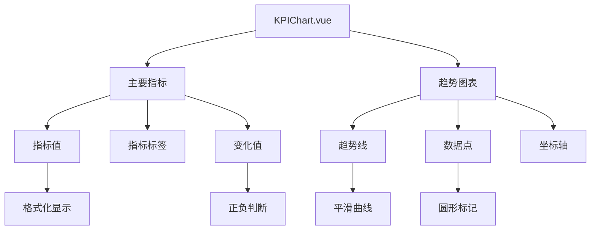

**KPI卡片特性：**
- 支持多种格式化类型：货币、百分比、数字、小数
- 显示变化值和比较文本
- 内嵌趋势图表，展示指标的历史变化
- 支持不同尺寸：小、中、大
- 可自定义图表类型：折线图、面积图
- 可自定义图表颜色

**Diagram sources**
- [KPIChart.vue](file://07-frontend/src/components/common/charts/KPIChart.vue#L1-L441)

**Section sources**
- [KPIChart.vue](file://07-frontend/src/components/common/charts/KPIChart.vue#L1-L441)

### 趋势图组件
趋势图组件用于展示数据随时间的变化趋势，支持实际值、预测值和预测区间的显示。该组件提供了丰富的配置选项，满足不同的数据展示需求。

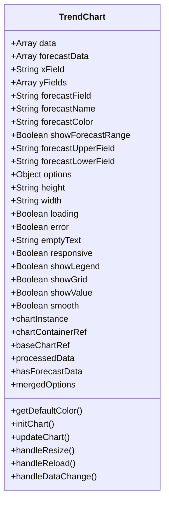

**趋势图特性：**
- 支持多系列数据展示
- 支持预测数据和预测区间显示
- 可自定义X轴和Y轴字段
- 可自定义系列名称和颜色
- 支持平滑曲线
- 支持显示数值标签
- 支持网格线和图例显示
- 响应式设计，适应不同屏幕尺寸

**Diagram sources**
- [TrendChart.vue](file://07-frontend/src/components/common/charts/TrendChart.vue#L27-L139)

**Section sources**
- [TrendChart.vue](file://07-frontend/src/components/common/charts/TrendChart.vue#L1-L407)

### 饼图组件
饼图组件用于展示数据的构成比例，支持普通饼图和环形图两种类型。该组件提供了灵活的配置选项，满足不同的数据展示需求。

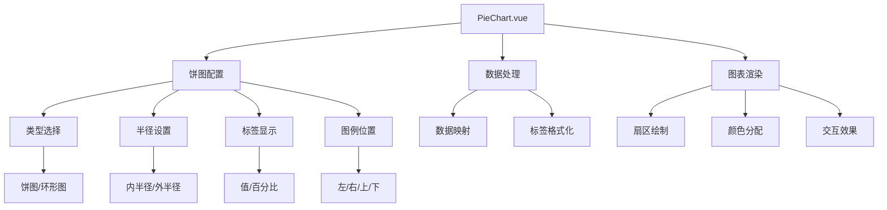

**饼图特性：**
- 支持普通饼图和环形图
- 可自定义内半径和外半径
- 支持显示值和百分比
- 可自定义图例位置：左、右、上、下
- 支持水平或垂直图例布局
- 提供丰富的交互效果
- 支持阴影效果和聚焦效果
- 响应式设计，适应不同屏幕尺寸

**Diagram sources**
- [PieChart.vue](file://07-frontend/src/components/common/charts/PieChart.vue#L28-L113)

**Section sources**
- [PieChart.vue](file://07-frontend/src/components/common/charts/PieChart.vue#L1-L263)

## 分页与缓存策略

分页和缓存策略是提高系统性能和用户体验的重要机制。通过合理的分页设置和缓存策略，可以有效减少服务器负载，提高数据查询效率。

### 分页策略
分页策略通过在API接口中添加分页参数实现，支持自定义页码和每页数量。默认情况下，系统提供合理的分页设置，用户也可以根据需要调整分页参数。

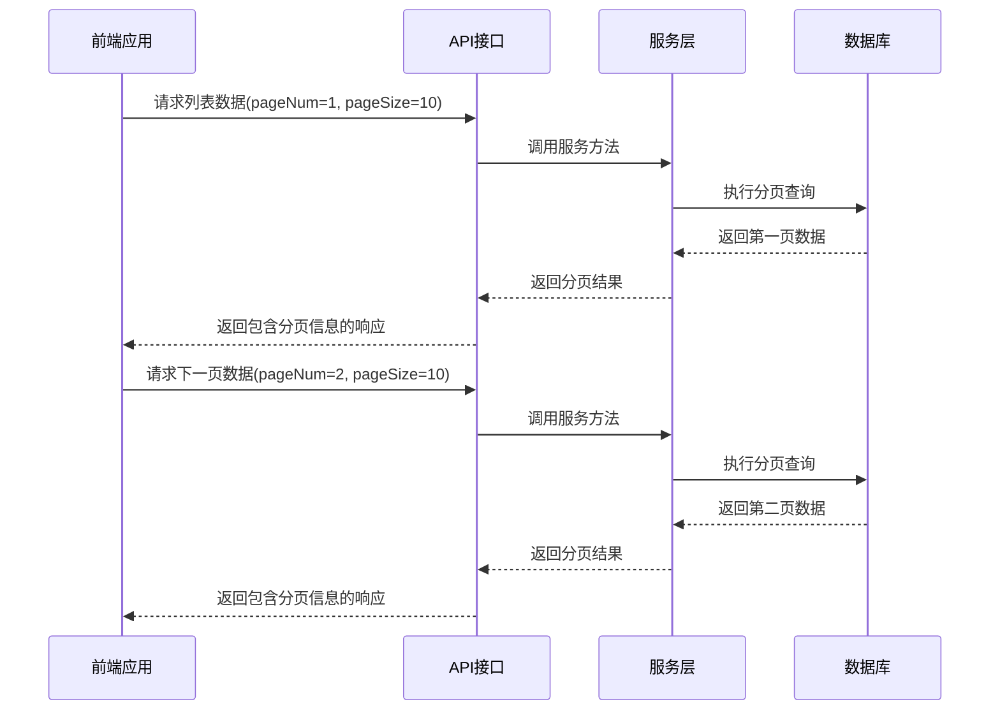

**分页参数：**
- **pageNum**：页码，从1开始，默认值为1
- **pageSize**：每页数量，默认值为10
- **total**：总记录数，由服务层计算并返回
- **pages**：总页数，由服务层计算并返回

**分页实现：**
- 使用MyBatis Plus的Page对象进行分页
- 在服务层实现分页逻辑
- 返回包含分页信息的响应结果
- 前端根据分页信息显示分页控件

**Diagram sources**
- [DashboardController.java](file://08-backend/src/main/java/com/enterprise/brain/modules/analytics/controller/DashboardController.java#L61-L67)
- [ReportController.java](file://08-backend/src/main/java/com/enterprise/brain/modules/analytics/controller/ReportController.java#L63-L69)

**Section sources**
- [DashboardController.java](file://08-backend/src/main/java/com/enterprise/brain/modules/analytics/controller/DashboardController.java#L59-L68)
- [ReportController.java](file://08-backend/src/main/java/com/enterprise/brain/modules/analytics/controller/ReportController.java#L61-L70)

### 缓存策略
缓存策略通过在服务层和API层实现，减少对数据库的频繁访问，提高系统性能。系统采用多级缓存机制，包括内存缓存和分布式缓存。

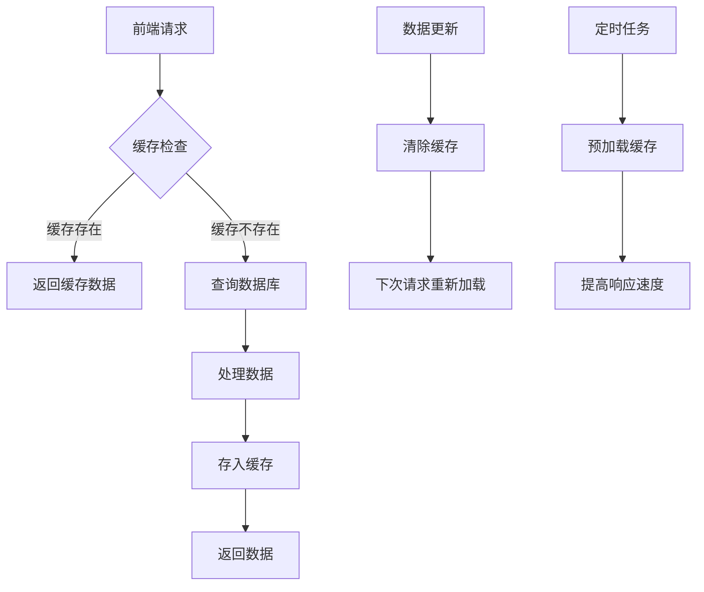

**缓存策略：**
- **缓存键设计**：基于请求参数生成唯一的缓存键
- **缓存时间**：根据数据更新频率设置合理的缓存时间
- **缓存清除**：在数据更新时清除相关缓存
- **缓存预热**：通过定时任务预加载常用数据
- **缓存穿透防护**：对不存在的数据也进行缓存，防止缓存穿透
- **缓存雪崩防护**：设置随机的缓存过期时间，避免大量缓存同时失效

**缓存实现：**
- 使用Redis作为分布式缓存
- 在服务层实现缓存逻辑
- 对频繁访问的静态数据进行缓存
- 对计算成本高的查询结果进行缓存
- 提供缓存刷新接口，支持手动刷新缓存

**Section sources**
- [DashboardService.java](file://08-backend/src/main/java/com/enterprise/brain/modules/analytics/service/DashboardService.java)
- [DataReportService.java](file://08-backend/src/main/java/com/enterprise/brain/modules/analytics/service/DataReportService.java)