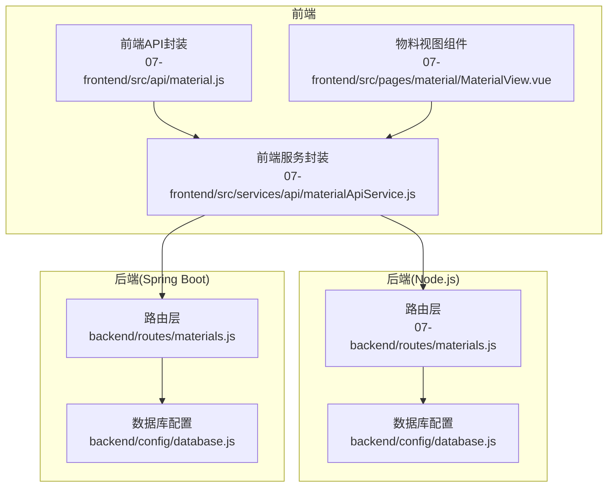
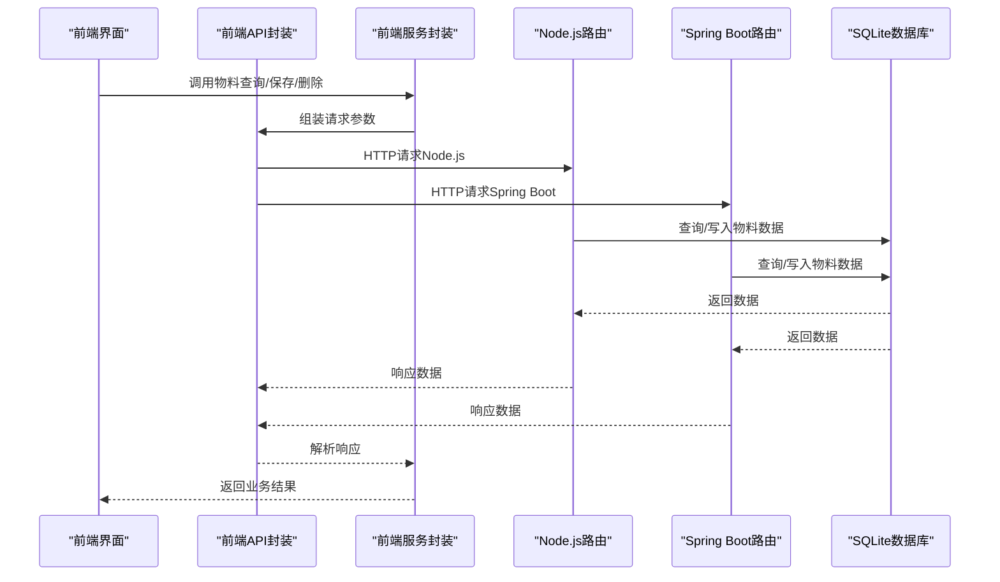
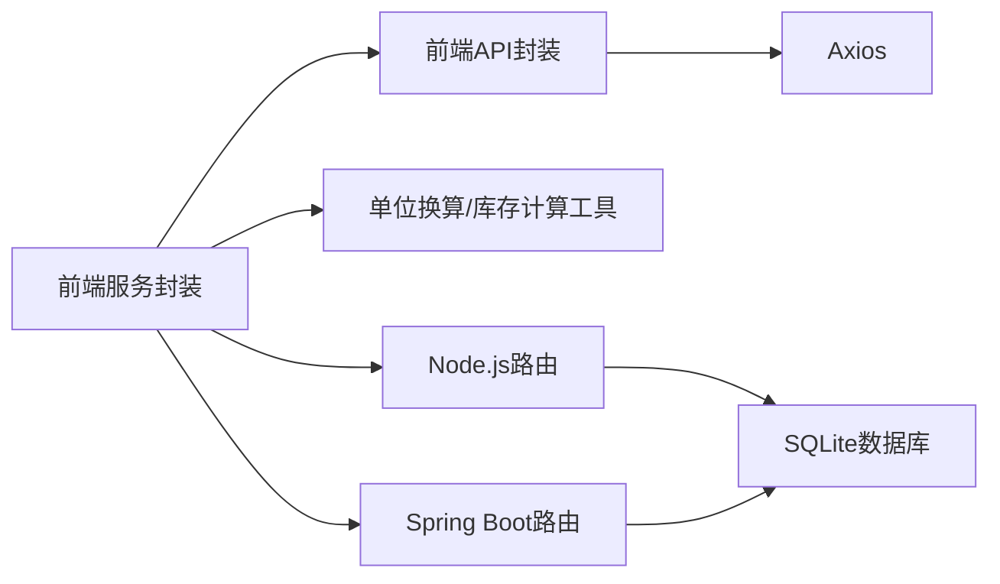

# 物料管理API

<cite>
**本文引用的文件**
- [07-backend/routes/materials.js](file://07-backend/routes/materials.js)
- [backend/routes/materials.js](file://backend/routes/materials.js)
- [07-frontend/src/api/material.js](file://07-frontend/src/api/material.js)
- [07-frontend/src/services/api/materialApiService.js](file://07-frontend/src/services/api/materialApiService.js)
- [07-frontend/src/pages/material/MaterialView.vue](file://07-frontend/src/pages/material/MaterialView.vue)
- [backend/config/database.js](file://backend/config/database.js)
- [07-frontend/src/utils/business/inventory-calculator.js](file://07-frontend/src/utils/business/inventory-calculator.js)
- [07-frontend/src/utils/calculation/unit-converter.js](file://07-frontend/src/utils/calculation/unit-converter.js)
- [07-frontend/src/platforms/mobile/pages/inventory/LocationScan.vue](file://07-frontend/src/platforms/mobile/pages/inventory/LocationScan.vue)
- [07-frontend/src/router/modules/material.js](file://07-frontend/src/router/modules/material.js)
- [backend/config/database.js](file://backend/config/database.js)
</cite>

## 目录
1. [简介](#简介)
2. [项目结构](#项目结构)
3. [核心组件](#核心组件)
4. [架构总览](#架构总览)
5. [详细组件分析](#详细组件分析)
6. [依赖分析](#依赖分析)
7. [性能考虑](#性能考虑)
8. [故障排查指南](#故障排查指南)
9. [结论](#结论)
10. [附录](#附录)

## 简介
本文件面向物料管理模块的API文档，整合Node.js与Spring Boot双后端的物料接口，覆盖物料信息的CRUD、物料分类管理、库存查询、单位换算、批次管理等业务属性，并说明在material.js前端API封装中如何统一调用不同后端的物料服务。同时提供物料与产品BOM关系的查询思路，以及在移动端库存扫描中的实际调用示例。

## 项目结构
物料管理模块由三层组成：
- 前端API封装层：负责HTTP请求封装与响应拦截、数据转换与错误处理
- 业务服务层：封装物料API调用，统一字段命名风格，提供批量与单条操作
- 后端路由层：Node.js与Spring Boot分别提供REST接口，访问SQLite数据库

图表来源
- [07-frontend/src/api/material.js](file://07-frontend/src/api/material.js#L1-L73)
- [07-frontend/src/services/api/materialApiService.js](file://07-frontend/src/services/api/materialApiService.js#L1-L211)
- [07-backend/routes/materials.js](file://07-backend/routes/materials.js#L1-L131)
- [backend/routes/materials.js](file://backend/routes/materials.js#L1-L137)
- [backend/config/database.js](file://backend/config/database.js#L1-L50)

章节来源
- [07-frontend/src/api/material.js](file://07-frontend/src/api/material.js#L1-L73)
- [07-frontend/src/services/api/materialApiService.js](file://07-frontend/src/services/api/materialApiService.js#L1-L211)
- [07-backend/routes/materials.js](file://07-backend/routes/materials.js#L1-L131)
- [backend/routes/materials.js](file://backend/routes/materials.js#L1-L137)
- [backend/config/database.js](file://backend/config/database.js#L1-L50)

## 核心组件
- 前端API封装（Axios实例）：统一基地址、超时、拦截器，屏蔽底层细节
- 前端服务封装（MaterialAPIService）：统一字段命名（下划线→驼峰）、错误处理、批量与单条操作
- 后端路由（Node.js）：提供物料列表、创建、批量创建、更新、删除、批量删除、搜索等REST接口
- 后端路由（Spring Boot）：同构接口，便于前后端统一调用
- 数据库（SQLite）：物料表与BOM相关表结构，包含物料编码、单位换算、批次等字段

章节来源
- [07-frontend/src/api/material.js](file://07-frontend/src/api/material.js#L1-L73)
- [07-frontend/src/services/api/materialApiService.js](file://07-frontend/src/services/api/materialApiService.js#L1-L211)
- [07-backend/routes/materials.js](file://07-backend/routes/materials.js#L1-L131)
- [backend/routes/materials.js](file://backend/routes/materials.js#L1-L137)
- [backend/config/database.js](file://backend/config/database.js#L1-L50)

## 架构总览
物料管理API采用“前端统一封装 + 双后端接口 + SQLite存储”的架构。前端通过MaterialAPIService统一调用后端接口；后端路由层对接数据库，提供标准REST接口；数据库层面包含物料主表与BOM相关表，支撑物料属性与BOM关系查询。

图表来源
- [07-frontend/src/services/api/materialApiService.js](file://07-frontend/src/services/api/materialApiService.js#L1-L211)
- [07-frontend/src/api/material.js](file://07-frontend/src/api/material.js#L1-L73)
- [07-backend/routes/materials.js](file://07-backend/routes/materials.js#L1-L131)
- [backend/routes/materials.js](file://backend/routes/materials.js#L1-L137)
- [backend/config/database.js](file://backend/config/database.js#L1-L50)

## 详细组件分析

### 前端API封装（Axios）
- 基地址：固定为本地开发环境的后端API地址
- 超时：30秒
- 拦截器：请求前可注入通用头；响应拦截统一提取data，便于上层处理
- 接口方法：列表、创建、批量创建、更新、删除、批量删除、搜索

章节来源
- [07-frontend/src/api/material.js](file://07-frontend/src/api/material.js#L1-L73)

### 前端服务封装（MaterialAPIService）
- 字段转换：将后端返回的下划线命名转换为驼峰命名，便于前端使用
- 统一错误处理：根据响应code判断成功/失败，抛出可读错误
- 批量操作：批量创建、批量删除，返回成功计数
- 搜索：关键词搜索，返回匹配列表
- ID策略：后端自动生成ID，前端不再管理

章节来源
- [07-frontend/src/services/api/materialApiService.js](file://07-frontend/src/services/api/materialApiService.js#L1-L211)

### 后端路由（Node.js）
- GET /materials/list：获取所有物料
- POST /materials/create：创建单个物料
- POST /materials/batch-create：批量创建物料
- PUT /materials/update/:id：更新物料
- DELETE /materials/delete/:id：删除单个物料
- DELETE /materials/batch-delete：批量删除物料
- GET /materials/search：按关键词搜索物料

章节来源
- [07-backend/routes/materials.js](file://07-backend/routes/materials.js#L1-L131)

### 后端路由（Spring Boot）
- 接口与Node.js一致，便于前端统一调用
- 提供物料CRUD、批量操作、搜索等REST接口

章节来源
- [backend/routes/materials.js](file://backend/routes/materials.js#L1-L137)

### 数据模型与业务属性
- 物料主表字段（示例关键字段）：物料编码、BOM编号、物料名称、尺寸规格、颜色、材质、类别、型号、系列、来源、描述、图片、基础单位、销售单位及转化率、采购单位及转化率、kg/pcs、pcs/kg、工序名称、标准工时、定额工时、工序单价、采购周期、采购单价、状态、创建/更新时间
- BOM相关表：设计BOM、生产BOM、销售BOM及其子件表，支持层级与组件关系

章节来源
- [backend/config/database.js](file://backend/config/database.js#L1-L50)
- [backend/config/database.js](file://backend/config/database.js#L52-L179)

### 物料视图组件（前端展示）
- 展示基础属性、销售属性、生产属性、采购属性
- 支持物料图片预览与来源标签展示

章节来源
- [07-frontend/src/pages/material/MaterialView.vue](file://07-frontend/src/pages/material/MaterialView.vue#L1-L109)

### 单位换算与库存计算（工具）
- 单位换算：支持长度、重量、体积、面积、温度等常用单位转换
- 库存计算：提供EOQ、安全库存、库存周转率、库存价值、ABC分析、老化分析、预测、持有成本等计算能力

章节来源
- [07-frontend/src/utils/calculation/unit-converter.js](file://07-frontend/src/utils/calculation/unit-converter.js#L1-L238)
- [07-frontend/src/utils/business/inventory-calculator.js](file://07-frontend/src/utils/business/inventory-calculator.js#L1-L636)

### 移动端库存扫描（示例页面）
- 提供库位扫描入口、库位信息展示、库存操作入口（查看库存、库存移位、库位维护、打印标签）
- 扫描流程：点击扫描框触发扫描动作，模拟返回库位信息

章节来源
- [07-frontend/src/platforms/mobile/pages/inventory/LocationScan.vue](file://07-frontend/src/platforms/mobile/pages/inventory/LocationScan.vue#L1-L211)

### 物料与BOM关系查询
- 数据库层面：BOM表与子件表关联，支持按产品编码/名称查询BOM及其子件
- 前端层面：可通过物料编码联动选择子件，结合库存与计划进行需求展开

章节来源
- [backend/config/database.js](file://backend/config/database.js#L125-L171)

## 依赖分析
- 前端依赖
  - Axios：HTTP请求封装
  - Element Plus/Vant：UI组件库
  - 自定义工具：单位换算、库存计算
- 后端依赖
  - SQLite：轻量级数据库
  - 路由中间件：Express（Node.js）与Spring Boot（Java）

图表来源
- [07-frontend/src/api/material.js](file://07-frontend/src/api/material.js#L1-L73)
- [07-frontend/src/services/api/materialApiService.js](file://07-frontend/src/services/api/materialApiService.js#L1-L211)
- [07-backend/routes/materials.js](file://07-backend/routes/materials.js#L1-L131)
- [backend/routes/materials.js](file://backend/routes/materials.js#L1-L137)
- [backend/config/database.js](file://backend/config/database.js#L1-L50)

## 性能考虑
- 前端缓存：MaterialAPIService对后端返回数据进行一次性转换，减少重复处理
- 批量操作：优先使用批量创建/删除接口，降低网络往返次数
- 数据库索引：物料表与BOM表已建立索引，提升查询效率
- 移动端扫描：扫描流程尽量短路，避免阻塞UI渲染

[本节为通用建议，无需代码引用]

## 故障排查指南
- 前端错误处理
  - 响应拦截器统一提取data，若后端返回非200，需检查响应message
  - MaterialAPIService对后端code进行判断，失败时抛出可读错误
- 后端错误处理
  - 路由层捕获异常并返回统一错误结构
- 常见问题
  - 接口404：确认前端基地址与后端路由路径一致
  - 数据转换异常：检查后端返回字段命名是否符合预期
  - 批量操作失败：核对ids或批量数据格式

章节来源
- [07-frontend/src/api/material.js](file://07-frontend/src/api/material.js#L1-L73)
- [07-frontend/src/services/api/materialApiService.js](file://07-frontend/src/services/api/materialApiService.js#L1-L211)
- [07-backend/routes/materials.js](file://07-backend/routes/materials.js#L1-L131)
- [backend/routes/materials.js](file://backend/routes/materials.js#L1-L137)

## 结论
本物料管理API通过前端统一封装与双后端接口，实现了物料CRUD、批量操作、搜索、单位换算与库存计算等功能。数据库层面提供物料主表与BOM相关表，支撑物料属性与BOM关系查询。移动端扫描页面展示了扫码与库位信息展示的典型流程。建议在生产环境中启用鉴权与校验，确保接口安全与数据一致性。

[本节为总结，无需代码引用]

## 附录

### API规范（Node.js后端）
- 获取所有物料
  - 方法：GET
  - 路径：/api/materials/list
  - 响应：包含code、data、message
- 创建物料
  - 方法：POST
  - 路径：/api/materials/create
  - 请求体：物料对象
  - 响应：包含code、data、message
- 批量创建物料
  - 方法：POST
  - 路径：/api/materials/batch-create
  - 请求体：物料对象数组
  - 响应：包含code、data、message
- 更新物料
  - 方法：PUT
  - 路径：/api/materials/update/:id
  - 请求体：物料对象
  - 响应：包含code、data、message
- 删除物料
  - 方法：DELETE
  - 路径：/api/materials/delete/:id
  - 响应：包含code、data、message
- 批量删除物料
  - 方法：DELETE
  - 路径：/api/materials/batch-delete
  - 请求体：ids数组
  - 响应：包含code、data、message
- 搜索物料
  - 方法：GET
  - 路径：/api/materials/search
  - 查询参数：keyword
  - 响应：包含code、data、message

章节来源
- [07-backend/routes/materials.js](file://07-backend/routes/materials.js#L1-L131)

### API规范（Spring Boot后端）
- 接口与Node.js后端一致，便于前端统一调用
- 路径前缀：/api（与前端基地址一致）

章节来源
- [backend/routes/materials.js](file://backend/routes/materials.js#L1-L137)

### 物料编码规则
- 物料编码唯一约束，建议遵循“品类+序列”规则，便于检索与BOM关联
- 前端展示与交互：物料视图组件展示物料编码、BOM编号、名称、规格、来源等

章节来源
- [backend/config/database.js](file://backend/config/database.js#L1-L50)
- [07-frontend/src/pages/material/MaterialView.vue](file://07-frontend/src/pages/material/MaterialView.vue#L1-L109)

### 单位换算与批次管理
- 单位换算：支持长度、重量、体积、面积、温度等常用单位转换
- 批次管理：数据库未显式提供批次字段，可在业务侧扩展或通过外部系统集成

章节来源
- [07-frontend/src/utils/calculation/unit-converter.js](file://07-frontend/src/utils/calculation/unit-converter.js#L1-L238)
- [backend/config/database.js](file://backend/config/database.js#L1-L50)

### 移动端库存扫描调用示例
- 扫描流程：点击扫描框触发扫描动作，模拟返回库位编码与信息
- 功能入口：查看库存、库存移位、库位维护、打印标签

章节来源
- [07-frontend/src/platforms/mobile/pages/inventory/LocationScan.vue](file://07-frontend/src/platforms/mobile/pages/inventory/LocationScan.vue#L1-L211)

### 物料与产品BOM关系查询
- 数据库表：boms、production_boms、sales_boms、design_boms、bom_components
- 前端联动：通过物料编码选择子件，结合库存与计划进行需求展开

章节来源
- [backend/config/database.js](file://backend/config/database.js#L52-L179)