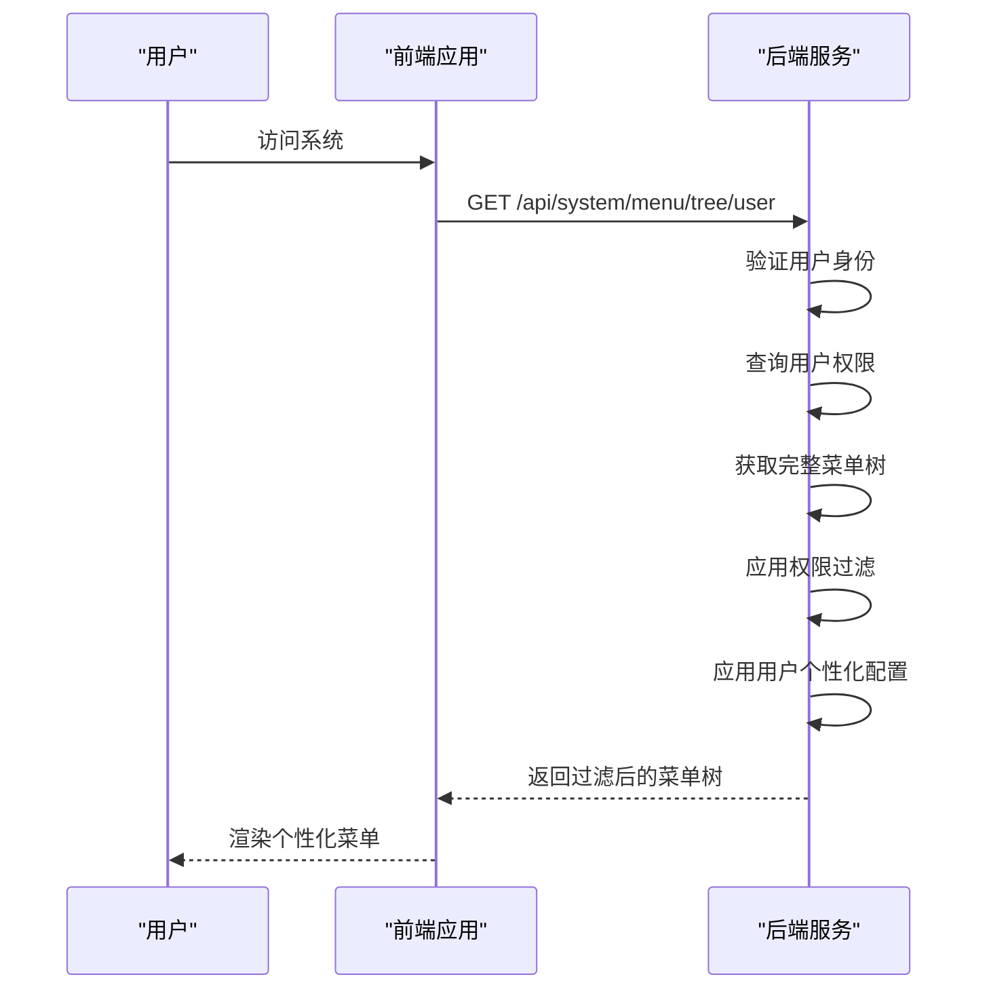
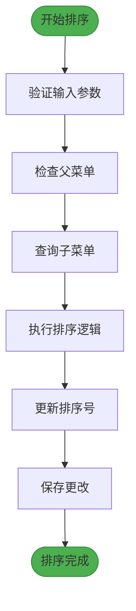
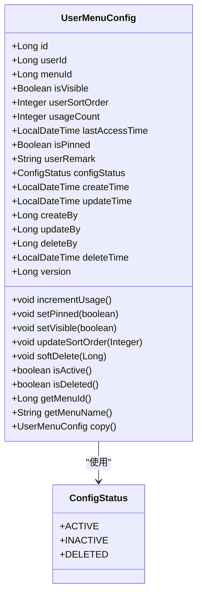
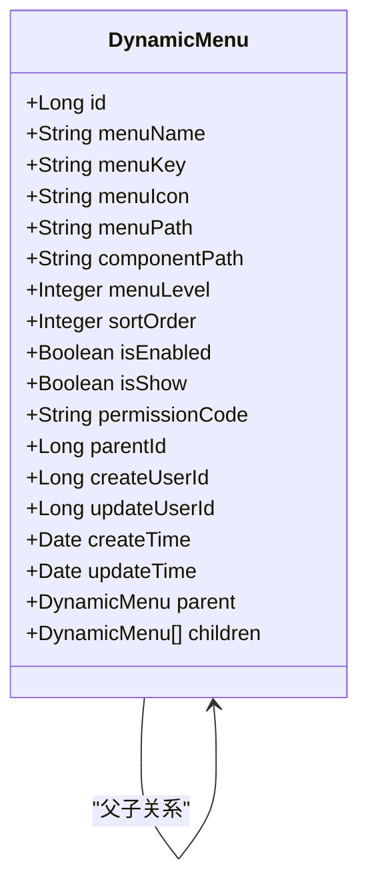
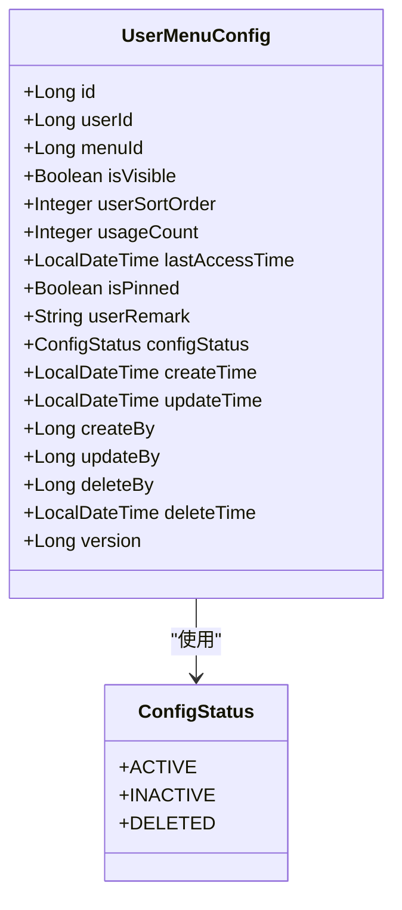

# 动态菜单API

<cite>
**本文档引用的文件**   
- [DynamicMenuController.java](file://08-backend/src/main/java/com/enterprise/brain/modules/system/menu/controller/DynamicMenuController.java)
- [DynamicMenuServiceImpl.java](file://08-backend/src/main/java/com/enterprise/brain/modules/system/menu/service/impl/DynamicMenuServiceImpl.java)
- [DynamicMenu.java](file://08-backend/src/main/java/com/enterprise/brain/modules/system/menu/entity/DynamicMenu.java)
- [UserMenuConfig.java](file://08-backend/src/main/java/com/enterprise/brain/modules/system/menu/entity/UserMenuConfig.java)
- [MenuCreateRequest.java](file://08-backend/src/main/java/com/enterprise/brain/modules/system/menu/dto/request/MenuCreateRequest.java)
- [MenuTreeResponse.java](file://08-backend/src/main/java/com/enterprise/brain/modules/system/menu/dto/response/MenuTreeResponse.java)
- [MenuSortRequest.java](file://08-backend/src/main/java/com/enterprise/brain/modules/system/menu/dto/request/MenuSortRequest.java)
- [MenuVisibilityRequest.java](file://08-backend/src/main/java/com/enterprise/brain/modules/system/menu/dto/request/MenuVisibilityRequest.java)
- [DynamicMenu.vue](file://07-frontend/src/pages/system/components/DynamicMenu.vue)
</cite>

## 目录
1. [简介](#简介)
2. [菜单CRUD操作](#菜单crud操作)
3. [菜单结构管理](#菜单结构管理)
4. [菜单排序功能](#菜单排序功能)
5. [用户个性化配置](#用户个性化配置)
6. [权限控制机制](#权限控制机制)
7. [数据模型](#数据模型)

## 简介
动态菜单API提供了一套完整的菜单管理系统，支持菜单的创建、更新、删除、查询等基本操作，以及菜单树结构管理、排序功能和用户个性化配置。系统通过权限控制确保只有授权用户才能进行相应的操作，同时允许用户根据个人需求自定义菜单的可见性和排序。

**本文档引用的文件**   
- [DynamicMenuController.java](file://08-backend/src/main/java/com/enterprise/brain/modules/system/menu/controller/DynamicMenuController.java)

## 菜单CRUD操作

动态菜单API提供了标准的CRUD（创建、读取、更新、删除）操作接口，用于管理系统的菜单项。

### 创建菜单
使用POST请求创建新的菜单项：

**接口定义**
- **URL**: `POST /api/system/menu/create`
- **权限要求**: `SYSTEM:MENU:CREATE`
- **请求体**: `MenuCreateRequest`对象

**示例请求**
```json
{
  "menuName": "系统管理",
  "menuKey": "system",
  "menuIcon": "setting",
  "menuPath": "/system",
  "componentPath": "views/system/index.vue",
  "sortOrder": 1,
  "isEnabled": true,
  "isShow": true,
  "parentId": null
}
```

**响应**
- 成功时返回新创建菜单的ID
- 失败时返回相应的错误信息

### 更新菜单
使用PUT请求更新现有菜单项：

**接口定义**
- **URL**: `PUT /api/system/menu/{menuId}`
- **权限要求**: `SYSTEM:MENU:UPDATE`
- **路径参数**: `menuId` - 要更新的菜单ID
- **请求体**: `MenuCreateRequest`对象

**示例请求**
```json
{
  "menuName": "系统管理",
  "menuKey": "system",
  "menuIcon": "setting",
  "menuPath": "/system",
  "componentPath": "views/system/index.vue",
  "sortOrder": 2,
  "isEnabled": true,
  "isShow": true,
  "parentId": null
}
```

### 删除菜单
使用DELETE请求删除菜单项：

**接口定义**
- **URL**: `DELETE /api/system/menu/{menuId}`
- **权限要求**: `SYSTEM:MENU:DELETE`
- **路径参数**: `menuId` - 要删除的菜单ID

**注意事项**
- 只有当菜单没有子菜单时才能删除
- 删除操作会级联删除相关的菜单项和用户菜单配置

### 查询单个菜单
使用GET请求查询单个菜单的详细信息：

**接口定义**
- **URL**: `GET /api/system/menu/{menuId}`
- **权限要求**: `SYSTEM:MENU:VIEW`
- **路径参数**: `menuId` - 要查询的菜单ID

**响应**
- 返回`MenuTreeResponse`对象，包含菜单的完整信息和子菜单结构

**本文档引用的文件**   
- [DynamicMenuController.java](file://08-backend/src/main/java/com/enterprise/brain/modules/system/menu/controller/DynamicMenuController.java#L19-L46)
- [DynamicMenuServiceImpl.java](file://08-backend/src/main/java/com/enterprise/brain/modules/system/menu/service/impl/DynamicMenuServiceImpl.java#L38-L50)

## 菜单结构管理

动态菜单API提供了获取完整菜单树和用户菜单树的接口，用于展示不同层级的菜单结构。

### 获取完整菜单树
获取系统中所有菜单的完整树形结构：

**接口定义**
- **URL**: `GET /api/system/menu/tree/full`
- **权限要求**: `SYSTEM:MENU:VIEW`

**响应**
- 返回完整的菜单树结构，包含所有菜单项和子菜单
- 用于管理员界面的菜单管理

### 获取用户菜单树
获取当前用户有权访问的菜单树：

**接口定义**
- **URL**: `GET /api/system/menu/tree/user`
- **权限要求**: 已认证用户

**响应**
- 返回经过权限过滤的菜单树
- 只包含用户有权限访问的菜单项
- 考虑了用户自定义的菜单可见性设置

**区别与权限要求**
- `/tree/full`：返回所有菜单，需要`SYSTEM:MENU:VIEW`权限
- `/tree/user`：返回用户可访问的菜单，只需要用户已登录
- 用户菜单树会根据用户的权限和个性化配置进行过滤



**本文档引用的文件**   
- [DynamicMenuController.java](file://08-backend/src/main/java/com/enterprise/brain/modules/system/menu/controller/DynamicMenuController.java#L48-L62)
- [DynamicMenuServiceImpl.java](file://08-backend/src/main/java/com/enterprise/brain/modules/system/menu/service/impl/DynamicMenuServiceImpl.java#L52-L75)

## 菜单排序功能

动态菜单API提供了菜单排序功能，允许管理员或用户对菜单进行排序。

### 接口定义
- **URL**: `POST /api/system/menu/sort`
- **权限要求**: `SYSTEM:MENU:SORT`
- **请求体**: `MenuSortRequest`对象

### 请求格式
```json
{
  "parentId": 1,
  "menuItems": [
    {
      "menuId": 2,
      "sortOrder": 1
    },
    {
      "menuId": 3,
      "sortOrder": 2
    },
    {
      "menuId": 4,
      "sortOrder": 3
    }
  ]
}
```

**参数说明**
- `parentId`: 父菜单ID，为null时表示顶级菜单
- `menuItems`: 菜单项列表，包含菜单ID和排序顺序
- 排序顺序从1开始，数值越小排序越靠前

### 自动排序功能
系统还提供了自动排序功能，可以根据特定规则（如创建时间、名称等）自动对菜单进行排序。

**接口定义**
- **URL**: `POST /api/system/menu/sort/auto`
- **权限要求**: `SYSTEM:MENU:SORT`



**本文档引用的文件**   
- [DynamicMenuController.java](file://08-backend/src/main/java/com/enterprise/brain/modules/system/menu/controller/DynamicMenuController.java#L64-L70)
- [MenuSortRequest.java](file://08-backend/src/main/java/com/enterprise/brain/modules/system/menu/dto/request/MenuSortRequest.java)
- [DynamicMenuServiceImpl.java](file://08-backend/src/main/java/com/enterprise/brain/modules/system/menu/service/impl/DynamicMenuServiceImpl.java#L284-L314)

## 用户个性化配置

动态菜单API允许用户根据个人需求自定义菜单的显示和排序。

### 获取用户菜单配置
获取当前用户的菜单个性化配置：

**接口定义**
- **URL**: `GET /api/system/menu/user/config`
- **权限要求**: 已认证用户

**响应**
- 返回`UserMenuResponse`对象，包含用户的菜单配置
- 包括每个菜单项的可见性、排序顺序等信息

### 更新菜单可见性
更新单个菜单项的可见性：

**接口定义**
- **URL**: `POST /api/system/menu/visibility/update`
- **权限要求**: 已认证用户
- **请求体**: `MenuVisibilityRequest`对象

**请求示例**
```json
{
  "userId": 1,
  "menuId": 2,
  "isVisible": false,
  "userSortOrder": 100
}
```

### 批量更新菜单可见性
批量更新多个菜单项的可见性：

**接口定义**
- **URL**: `POST /api/system/menu/visibility/batch-update`
- **权限要求**: 已认证用户
- **请求体**: `MenuVisibilityRequest`对象列表

**请求示例**
```json
[
  {
    "userId": 1,
    "menuId": 2,
    "isVisible": false,
    "userSortOrder": 100
  },
  {
    "userId": 1,
    "menuId": 3,
    "isVisible": true,
    "userSortOrder": 1
  }
]
```

**安全限制**
- 用户只能修改自己的菜单配置
- 系统会验证请求中的`userId`是否与当前登录用户匹配
- 如果不匹配，会抛出安全异常



**本文档引用的文件**   
- [DynamicMenuController.java](file://08-backend/src/main/java/com/enterprise/brain/modules/system/menu/controller/DynamicMenuController.java#L72-L98)
- [MenuVisibilityRequest.java](file://08-backend/src/main/java/com/enterprise/brain/modules/system/menu/dto/request/MenuVisibilityRequest.java)
- [UserMenuConfig.java](file://08-backend/src/main/java/com/enterprise/brain/modules/system/menu/entity/UserMenuConfig.java)

## 权限控制机制

动态菜单API采用了严格的权限控制机制，确保系统的安全性和数据的完整性。

### 权限码定义
系统使用以下权限码来控制对菜单API的访问：

- `SYSTEM:MENU:CREATE` - 创建菜单权限
- `SYSTEM:MENU:UPDATE` - 更新菜单权限
- `SYSTEM:MENU:DELETE` - 删除菜单权限
- `SYSTEM:MENU:VIEW` - 查看菜单权限
- `SYSTEM:MENU:SORT` - 排序菜单权限

### 权限验证
所有API接口都通过`@PreAuthorize`注解进行权限验证：

```java
@PreAuthorize("hasAuthority('SYSTEM:MENU:CREATE')")
@PostMapping("/create")
public Long createMenu(@RequestBody MenuCreateRequest request) {
    return dynamicMenuService.createMenu(request);
}
```

### 安全限制
- 管理员权限：创建、更新、删除、排序等操作需要相应的管理员权限
- 用户权限：用户只能修改自己的菜单配置
- 数据验证：所有请求都会进行参数验证和业务逻辑校验
- 审计日志：关键操作会记录审计日志，便于追踪和审计

**本文档引用的文件**   
- [DynamicMenuController.java](file://08-backend/src/main/java/com/enterprise/brain/modules/system/menu/controller/DynamicMenuController.java)
- [DynamicMenuServiceImpl.java](file://08-backend/src/main/java/com/enterprise/brain/modules/system/menu/service/impl/DynamicMenuServiceImpl.java)

## 数据模型

### 菜单实体
`DynamicMenu`实体类定义了菜单的基本属性和关系。



### 用户菜单配置
`UserMenuConfig`实体类存储用户的个性化菜单配置。



**本文档引用的文件**   
- [DynamicMenu.java](file://08-backend/src/main/java/com/enterprise/brain/modules/system/menu/entity/DynamicMenu.java)
- [UserMenuConfig.java](file://08-backend/src/main/java/com/enterprise/brain/modules/system/menu/entity/UserMenuConfig.java)
- [MenuCreateRequest.java](file://08-backend/src/main/java/com/enterprise/brain/modules/system/menu/dto/request/MenuCreateRequest.java)
- [MenuTreeResponse.java](file://08-backend/src/main/java/com/enterprise/brain/modules/system/menu/dto/response/MenuTreeResponse.java)