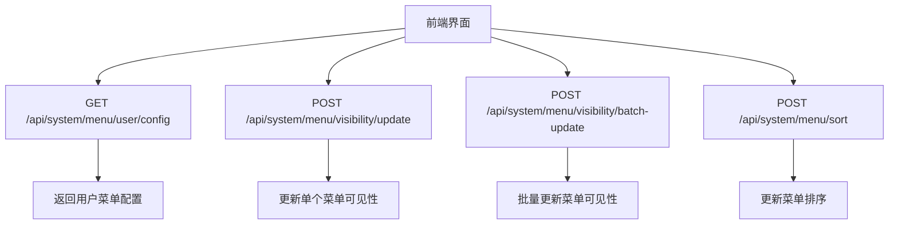
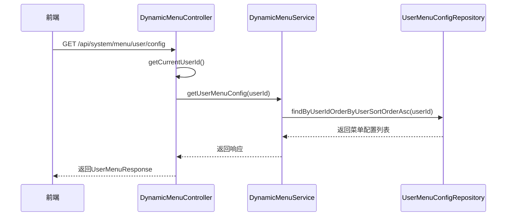
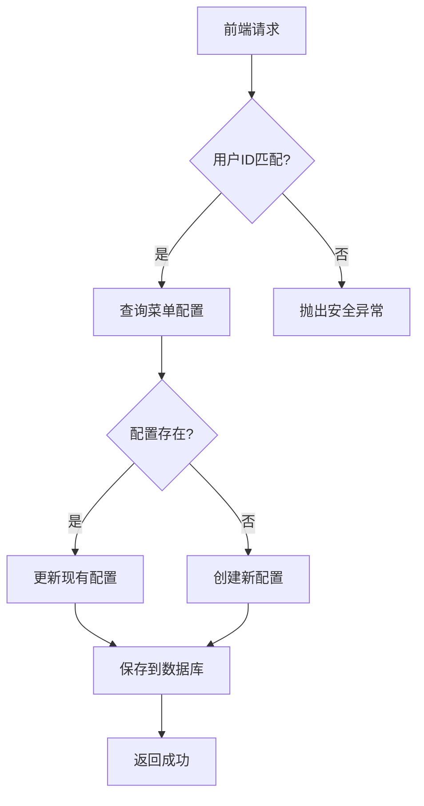
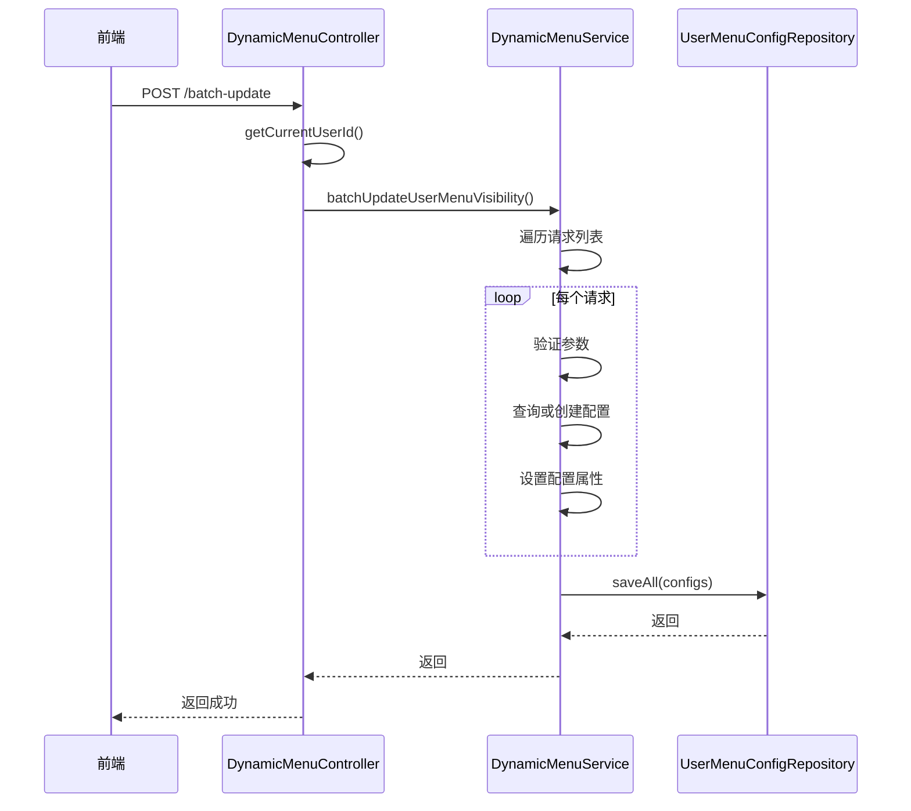
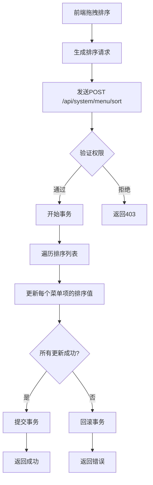
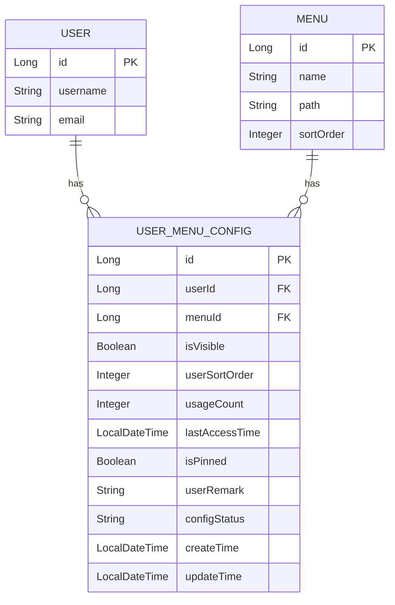

# 用户菜单配置API

<cite>
**本文档引用的文件**  
- [DynamicMenuController.java](file://08-backend/src/main/java/com/enterprise/brain/modules/system/menu/controller/DynamicMenuController.java)
- [DynamicMenuServiceImpl.java](file://08-backend/src/main/java/com/enterprise/brain/modules/system/menu/service/impl/DynamicMenuServiceImpl.java)
- [UserMenuConfig.java](file://08-backend/src/main/java/com/enterprise/brain/modules/system/menu/entity/UserMenuConfig.java)
- [UserMenuResponse.java](file://08-backend/src/main/java/com/enterprise/brain/modules/system/menu/dto/response/UserMenuResponse.java)
- [MenuVisibilityRequest.java](file://08-backend/src/main/java/com/enterprise/brain/modules/system/menu/dto/request/MenuVisibilityRequest.java)
- [MenuSortRequest.java](file://08-backend/src/main/java/com/enterprise/brain/modules/system/menu/dto/request/MenuSortRequest.java)
- [DynamicMenu.vue](file://07-frontend/src/pages/system/components/DynamicMenu.vue)
- [MenuPreview.vue](file://07-frontend/src/pages/system/components/MenuPreview.vue)
</cite>

## 目录
1. [简介](#简介)
2. [核心API接口](#核心api接口)
3. [获取用户菜单配置](#获取用户菜单配置)
4. [更新菜单可见性](#更新菜单可见性)
5. [批量更新菜单可见性](#批量更新菜单可见性)
6. [菜单排序功能](#菜单排序功能)
7. [前端调用示例](#前端调用示例)
8. [安全验证机制](#安全验证机制)
9. [数据模型](#数据模型)
10. [错误处理](#错误处理)

## 简介
用户菜单配置API提供了一套完整的个性化菜单管理功能，允许用户根据个人偏好自定义系统菜单的显示和排序。该API支持获取当前用户的菜单配置、更新单个或批量菜单项的可见性，以及重新排序菜单项。所有操作都通过严格的用户身份验证，确保用户只能修改自己的菜单配置。

**Section sources**
- [DynamicMenuController.java](file://08-backend/src/main/java/com/enterprise/brain/modules/system/menu/controller/DynamicMenuController.java#L1-L106)

## 核心API接口
用户菜单配置系统提供了四个核心API接口：

- `GET /api/system/menu/user/config`：获取当前用户的菜单配置信息
- `POST /api/system/menu/visibility/update`：更新单个菜单项的可见性
- `POST /api/system/menu/visibility/batch-update`：批量更新多个菜单项的可见性
- `POST /api/system/menu/sort`：更新菜单项的排序顺序

这些接口共同构成了用户个性化工作台的基础功能，允许用户隐藏不常用的菜单项、重新排列菜单顺序，从而优化工作流程。



**Diagram sources**
- [DynamicMenuController.java](file://08-backend/src/main/java/com/enterprise/brain/modules/system/menu/controller/DynamicMenuController.java#L1-L106)

**Section sources**
- [DynamicMenuController.java](file://08-backend/src/main/java/com/enterprise/brain/modules/system/menu/controller/DynamicMenuController.java#L1-L106)

## 获取用户菜单配置
`GET /api/system/menu/user/config` 接口用于获取当前用户的菜单配置信息。该接口返回用户对所有菜单项的个性化设置，包括可见状态和自定义排序。

### 接口详情
- **HTTP方法**: GET
- **路径**: `/api/system/menu/user/config`
- **认证要求**: 需要用户已认证
- **返回值**: `UserMenuResponse` 对象，包含用户ID、用户名和菜单配置列表

### 响应结构
```json
{
  "userId": 1,
  "userName": "张三",
  "menuConfigs": [
    {
      "menuId": 101,
      "menuName": "仪表盘",
      "isVisible": true,
      "userSortOrder": 1
    },
    {
      "menuId": 102,
      "menuName": "用户管理",
      "isVisible": false,
      "userSortOrder": 2
    }
  ]
}
```

### 实现逻辑
1. 从安全上下文中获取当前用户ID
2. 调用 `DynamicMenuService.getUserMenuConfig()` 方法
3. 查询 `system_user_menu_config` 表中该用户的所有菜单配置
4. 按 `userSortOrder` 字段升序排序
5. 返回配置信息



**Diagram sources**
- [DynamicMenuController.java](file://08-backend/src/main/java/com/enterprise/brain/modules/system/menu/controller/DynamicMenuController.java#L85-L90)
- [DynamicMenuServiceImpl.java](file://08-backend/src/main/java/com/enterprise/brain/modules/system/menu/service/impl/DynamicMenuServiceImpl.java#L217-L243)
- [UserMenuConfig.java](file://08-backend/src/main/java/com/enterprise/brain/modules/system/menu/entity/UserMenuConfig.java#L1-L461)

**Section sources**
- [DynamicMenuController.java](file://08-backend/src/main/java/com/enterprise/brain/modules/system/menu/controller/DynamicMenuController.java#L85-L90)
- [UserMenuResponse.java](file://08-backend/src/main/java/com/enterprise/brain/modules/system/menu/dto/response/UserMenuResponse.java#L1-L19)

## 更新菜单可见性
`POST /api/system/menu/visibility/update` 接口用于更新单个菜单项的可见性状态。用户可以通过此接口隐藏或显示特定的菜单项。

### 接口详情
- **HTTP方法**: POST
- **路径**: `/api/system/menu/visibility/update`
- **认证要求**: 需要用户已认证
- **请求体**: `MenuVisibilityRequest` 对象
- **审计日志**: 记录"更新菜单可见性"操作

### 请求参数
| 参数 | 类型 | 必需 | 描述 |
|------|------|------|------|
| userId | Long | 是 | 用户ID |
| menuId | Long | 是 | 菜单ID |
| isVisible | Boolean | 是 | 是否可见 |
| userSortOrder | Integer | 否 | 用户自定义排序 |

### 安全验证
该接口包含严格的安全验证机制，确保用户只能修改自己的菜单配置：

```java
Long currentUserId = getCurrentUserId();
if (!currentUserId.equals(request.getUserId())) {
    throw new SecurityException("Cannot modify other user's menu configuration");
}
```

### 实现流程
1. 验证用户身份
2. 检查请求中的用户ID是否与当前登录用户匹配
3. 查询或创建 `UserMenuConfig` 实体
4. 更新可见性和排序信息
5. 保存到数据库



**Diagram sources**
- [DynamicMenuController.java](file://08-backend/src/main/java/com/enterprise/brain/modules/system/menu/controller/DynamicMenuController.java#L73-L83)
- [DynamicMenuServiceImpl.java](file://08-backend/src/main/java/com/enterprise/brain/modules/system/menu/service/impl/DynamicMenuServiceImpl.java#L245-L282)

**Section sources**
- [DynamicMenuController.java](file://08-backend/src/main/java/com/enterprise/brain/modules/system/menu/controller/DynamicMenuController.java#L73-L83)
- [MenuVisibilityRequest.java](file://08-backend/src/main/java/com/enterprise/brain/modules/system/menu/dto/request/MenuVisibilityRequest.java#L1-L11)

## 批量更新菜单可见性
`POST /api/system/menu/visibility/batch-update` 接口允许用户一次性更新多个菜单项的可见性配置，提高操作效率。

### 接口详情
- **HTTP方法**: POST
- **路径**: `/api/system/menu/visibility/batch-update`
- **认证要求**: 需要用户已认证
- **请求体**: `List<MenuVisibilityRequest>` 数组
- **事务处理**: 整个操作在数据库事务中执行
- **审计日志**: 记录"批量更新菜单可见性"操作

### 批量处理机制
1. 接收包含多个 `MenuVisibilityRequest` 的列表
2. 验证所有请求参数的完整性
3. 在单个数据库事务中处理所有更新
4. 使用 `saveAll()` 方法批量保存，提高性能
5. 返回统一的成功响应

### 事务处理
该操作使用Spring的 `@Transactional` 注解确保数据一致性：

```java
@Transactional(rollbackFor = Exception.class)
public ApiResponse<Void> batchUpdateUserMenuVisibility(Long userId, List<MenuVisibilityRequest> requests) {
    // 批量处理逻辑
    userMenuConfigRepository.saveAll(configs);
}
```

这种设计确保了即使在处理大量菜单项时也能保持高性能和数据完整性。



**Diagram sources**
- [DynamicMenuController.java](file://08-backend/src/main/java/com/enterprise/brain/modules/system/menu/controller/DynamicMenuController.java#L92-L98)
- [DynamicMenuServiceImpl.java](file://08-backend/src/main/java/com/enterprise/brain/modules/system/menu/service/impl/DynamicMenuServiceImpl.java#L245-L282)

**Section sources**
- [DynamicMenuController.java](file://08-backend/src/main/java/com/enterprise/brain/modules/system/menu/controller/DynamicMenuController.java#L92-L98)
- [DynamicMenuServiceImpl.java](file://08-backend/src/main/java/com/enterprise/brain/modules/system/menu/service/impl/DynamicMenuServiceImpl.java#L245-L282)

## 菜单排序功能
`POST /api/system/menu/sort` 接口提供了灵活的菜单排序功能，允许用户自定义菜单项的显示顺序。

### 接口详情
- **HTTP方法**: POST
- **路径**: `/api/system/menu/sort`
- **认证要求**: 需要用户已认证
- **权限要求**: `SYSTEM:MENU:SORT`
- **请求体**: `MenuSortRequest` 对象

### 请求结构
```json
{
  "parentId": 1,
  "menuItems": [
    {"menuId": 101, "sortOrder": 1},
    {"menuId": 102, "sortOrder": 2},
    {"menuId": 103, "sortOrder": 3}
  ]
}
```

### 排序算法
1. 接收包含菜单ID和排序值的列表
2. 验证每个菜单项的存在性
3. 按照指定的排序值更新每个菜单项的 `userSortOrder` 字段
4. 在事务中批量保存所有更改
5. 确保排序值的唯一性和连续性

### 持久化策略
- 使用数据库事务确保原子性
- 批量更新减少数据库交互次数
- 乐观锁机制防止并发冲突
- 版本号字段用于并发控制



**Diagram sources**
- [DynamicMenuController.java](file://08-backend/src/main/java/com/enterprise/brain/modules/system/menu/controller/DynamicMenuController.java#L64-L71)
- [MenuSortRequest.java](file://08-backend/src/main/java/com/enterprise/brain/modules/system/menu/dto/request/MenuSortRequest.java#L1-L16)

**Section sources**
- [DynamicMenuController.java](file://08-backend/src/main/java/com/enterprise/brain/modules/system/menu/controller/DynamicMenuController.java#L64-L71)
- [MenuSortRequest.java](file://08-backend/src/main/java/com/enterprise/brain/modules/system/menu/dto/request/MenuSortRequest.java#L1-L16)

## 前端调用示例
以下是一个完整的前端调用示例，展示如何使用Vue.js和Axios实现用户自定义工作台。

### 动态菜单组件
```vue
<template>
  <el-menu :default-active="activeMenu" class="dynamic-menu" router>
    <template v-for="menu in visibleMenus" :key="menu.id">
      <el-submenu v-if="menu.children && menu.children.length > 0" :index="menu.menuPath">
        <template #title>
          <i :class="menu.menuIcon"></i>
          <span>{{ menu.menuName }}</span>
        </el-submenu>
        <template v-for="subMenu in menu.children" :key="subMenu.id">
          <el-menu-item :index="subMenu.menuPath" v-if="subMenu.isVisible">
            <i :class="subMenu.menuIcon"></i>
            <span>{{ subMenu.menuName }}</span>
          </el-menu-item>
        </template>
      </el-submenu>
      <el-menu-item v-else-if="menu.isVisible" :index="menu.menuPath">
        <i :class="menu.menuIcon"></i>
        <span>{{ menu.menuName }}</span>
      </el-menu-item>
    </template>
  </el-menu>
</template>

<script>
import { ref, onMounted, computed } from 'vue'
import { useRoute } from 'vue-router'
import axios from 'axios'

export default {
  name: 'UserCustomMenu',
  setup() {
    const route = useRoute()
    const allMenus = ref([])
    const userConfig = ref({})
    
    const activeMenu = computed(() => {
      return route.path || '/'
    })
    
    // 加载用户菜单配置
    const loadUserConfig = async () => {
      try {
        const response = await axios.get('/api/system/menu/user/config')
        userConfig.value = response.data
        
        // 构建菜单配置映射
        const configMap = {}
        response.data.menuConfigs.forEach(config => {
          configMap[config.menuId] = config
        })
        
        // 应用用户配置到菜单
        allMenus.value = allMenus.value.map(menu => {
          const config = configMap[menu.id]
          if (config) {
            menu.isVisible = config.isVisible
            menu.userSortOrder = config.userSortOrder
          }
          return menu
        })
        
        // 按用户排序重新排列
        allMenus.value.sort((a, b) => (a.userSortOrder || 999) - (b.userSortOrder || 999))
        
      } catch (error) {
        console.error('Failed to load user menu config:', error)
      }
    }
    
    // 更新菜单可见性
    const updateMenuVisibility = async (menuId, isVisible) => {
      try {
        await axios.post('/api/system/menu/visibility/update', {
          userId: 1, // 从用户上下文获取
          menuId,
          isVisible
        })
        // 刷新配置
        await loadUserConfig()
      } catch (error) {
        console.error('Failed to update menu visibility:', error)
      }
    }
    
    // 批量更新排序
    const updateMenuSort = async (sortedMenuIds) => {
      try {
        const menuItems = sortedMenuIds.map((menuId, index) => ({
          menuId,
          sortOrder: index + 1
        }))
        
        await axios.post('/api/system/menu/sort', {
          parentId: null,
          menuItems
        })
        // 刷新配置
        await loadUserConfig()
      } catch (error) {
        console.error('Failed to update menu sort:', error)
      }
    }
    
    onMounted(async () => {
      // 加载基础菜单结构
      const menuResponse = await axios.get('/api/system/menu/tree/full')
      allMenus.value = menuResponse.data
      // 加载用户配置
      await loadUserConfig()
    })
    
    return {
      visibleMenus: computed(() => allMenus.value.filter(m => m.isVisible)),
      activeMenu,
      updateMenuVisibility,
      updateMenuSort
    }
  }
}
</script>
```

**Section sources**
- [DynamicMenu.vue](file://07-frontend/src/pages/system/components/DynamicMenu.vue#L1-L71)
- [MenuPreview.vue](file://07-frontend/src/pages/system/components/MenuPreview.vue#L1-L66)

## 安全验证机制
系统实现了多层次的安全验证机制，确保用户只能修改自己的菜单配置。

### 用户身份验证
所有菜单配置接口都需要用户认证，使用Spring Security的 `@PreAuthorize("isAuthenticated()")` 注解：

```java
@PreAuthorize("isAuthenticated()")
@GetMapping("/user/config")
public UserMenuResponse getUserMenuConfig() {
    // ...
}
```

### 用户权限校验
在更新操作中，系统会验证请求中的用户ID是否与当前登录用户匹配：

```java
Long currentUserId = getCurrentUserId();
if (!currentUserId.equals(request.getUserId())) {
    throw new SecurityException("Cannot modify other user's menu configuration");
}
```

### 权限级别控制
不同操作需要不同的权限级别：
- `SYSTEM:MENU:VIEW` - 查看菜单
- `SYSTEM:MENU:SORT` - 排序菜单
- `SYSTEM:MENU:CREATE` - 创建菜单
- `SYSTEM:MENU:UPDATE` - 更新菜单
- `SYSTEM:MENU:DELETE` - 删除菜单

### 审计日志
所有修改操作都会记录审计日志，使用 `@AuditLogAnnotation` 注解：

```java
@AuditLogAnnotation(operation = "批量更新菜单可见性")
@PostMapping("/visibility/batch-update")
public void batchUpdateUserMenuVisibility(@RequestBody List<MenuVisibilityRequest> requests) {
    // ...
}
```

**Section sources**
- [DynamicMenuController.java](file://08-backend/src/main/java/com/enterprise/brain/modules/system/menu/controller/DynamicMenuController.java#L73-L83)
- [DynamicMenuController.java](file://08-backend/src/main/java/com/enterprise/brain/modules/system/menu/controller/DynamicMenuController.java#L92-L98)

## 数据模型
用户菜单配置的核心数据模型定义了用户与菜单之间的个性化关系。

### UserMenuConfig 实体
`UserMenuConfig` 实体存储了用户对菜单的个性化配置：

| 字段 | 类型 | 描述 |
|------|------|------|
| id | Long | 主键ID |
| userId | Long | 用户ID |
| menuId | Long | 菜单ID |
| isVisible | Boolean | 是否可见 |
| userSortOrder | Integer | 用户自定义排序 |
| usageCount | Integer | 使用频率 |
| lastAccessTime | LocalDateTime | 最后访问时间 |
| isPinned | Boolean | 是否置顶 |
| userRemark | String | 用户备注 |
| configStatus | Enum | 配置状态 |
| createTime | LocalDateTime | 创建时间 |
| updateTime | LocalDateTime | 更新时间 |

### 数据库约束
- 唯一约束：`uk_user_menu_config(user_id, menu_id)` 确保每个用户对每个菜单只有一条配置
- 索引：`idx_user_menu_config_user_id` 提高按用户查询的性能
- 索引：`idx_user_menu_config_menu_id` 提高按菜单查询的性能



**Diagram sources**
- [UserMenuConfig.java](file://08-backend/src/main/java/com/enterprise/brain/modules/system/menu/entity/UserMenuConfig.java#L1-L461)

**Section sources**
- [UserMenuConfig.java](file://08-backend/src/main/java/com/enterprise/brain/modules/system/menu/entity/UserMenuConfig.java#L1-L461)

## 错误处理
系统实现了完善的错误处理机制，确保API的稳定性和用户体验。

### 常见错误类型
| 错误代码 | 描述 | 解决方案 |
|---------|------|---------|
| MENU_NOT_FOUND | 菜单不存在 | 检查菜单ID是否正确 |
| PARAMETER_VALIDATION_FAILED | 参数验证失败 | 检查请求参数格式 |
| SECURITY_EXCEPTION | 安全异常 | 确认用户权限 |
| BUSINESS_EXCEPTION | 业务异常 | 检查业务规则 |

### 异常处理流程
1. 参数校验：使用 `Assert.notNull()` 和 `Assert.hasText()` 验证输入
2. 业务校验：检查菜单是否存在、用户权限等
3. 异常捕获：使用 `@ControllerAdvice` 全局处理异常
4. 统一响应：返回标准化的错误响应格式

### 错误响应示例
```json
{
  "success": false,
  "code": "PARAMETER_VALIDATION_FAILED",
  "message": "菜单可见性配置列表不能为空",
  "timestamp": "2024-01-01T12:00:00Z"
}
```

**Section sources**
- [DynamicMenuServiceImpl.java](file://08-backend/src/main/java/com/enterprise/brain/modules/system/menu/service/impl/DynamicMenuServiceImpl.java#L245-L282)
- [UserMenuConfig.java](file://08-backend/src/main/java/com/enterprise/brain/modules/system/menu/entity/UserMenuConfig.java#L1-L461)