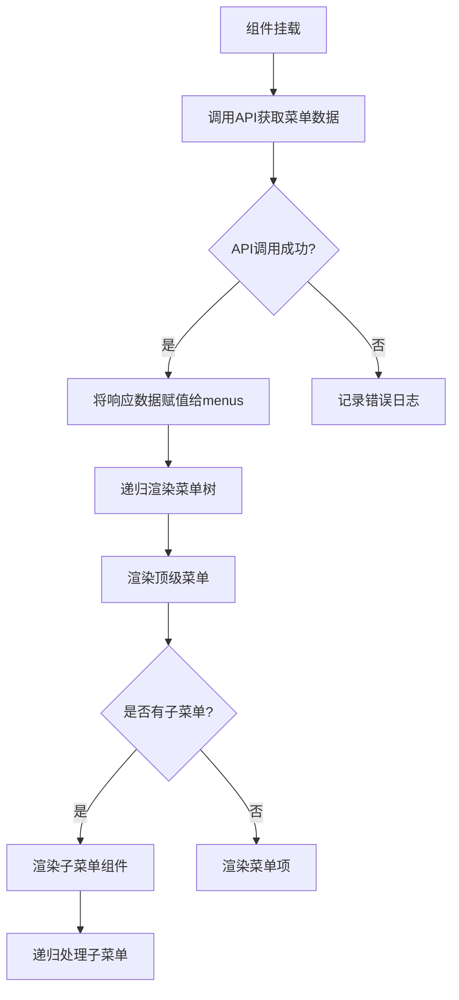

# 菜单查询API

<cite>
**本文档引用的文件**   
- [DynamicMenuController.java](file://08-backend/src/main/java/com/enterprise/brain/modules/system/menu/controller/DynamicMenuController.java)
- [DynamicMenuServiceImpl.java](file://08-backend/src/main/java/com/enterprise/brain/modules/system/menu/service/impl/DynamicMenuServiceImpl.java)
- [MenuTreeResponse.java](file://08-backend/src/main/java/com/enterprise/brain/modules/system/menu/dto/response/MenuTreeResponse.java)
- [DynamicMenu.vue](file://07-frontend/src/pages/system/components/DynamicMenu.vue)
- [MenuPreview.vue](file://07-frontend/src/pages/system/components/MenuPreview.vue)
- [systemMenu.js](file://07-frontend/src/router/modules/systemMenu.js)
</cite>

## 目录
1. [完整菜单树接口](#完整菜单树接口)
2. [用户菜单树接口](#用户菜单树接口)
3. [菜单树响应对象](#菜单树响应对象)
4. [JSON响应示例](#json响应示例)
5. [前端解析与渲染](#前端解析与渲染)

## 完整菜单树接口

GET /api/system/menu/tree/full 接口用于返回系统的完整菜单结构，该接口需要 SYSTEM:MENU:VIEW 权限，适用于管理员配置场景。此接口返回系统中所有启用的菜单项，包括目录、菜单和按钮等不同类型的菜单项，形成完整的树形结构。

该接口通过 DynamicMenuService 的 getFullMenuTree() 方法实现，首先查询所有顶级菜单（父菜单为null），然后递归构建子菜单结构。每个菜单项包含基本信息如ID、名称、路径、图标等，以及子菜单列表和菜单项列表。

**Section sources**
- [DynamicMenuController.java](file://08-backend/src/main/java/com/enterprise/brain/modules/system/menu/controller/DynamicMenuController.java#L48-L53)
- [DynamicMenuServiceImpl.java](file://08-backend/src/main/java/com/enterprise/brain/modules/system/menu/service/impl/DynamicMenuServiceImpl.java#L52-L75)

## 用户菜单树接口

GET /api/system/menu/tree/user 接口用于返回当前用户有权访问的菜单树，该接口仅需认证即可访问，用于前端动态渲染用户专属导航。此接口根据当前登录用户的权限和个性化设置，返回过滤后的菜单树。

该接口通过 DynamicMenuService 的 getUserMenuTree() 方法实现，首先获取当前用户ID，然后查询用户可见的菜单。查询逻辑为：返回所有启用且显示的菜单，同时考虑用户的个性化配置（通过 UserMenuConfig 实体），如果用户对某个菜单有配置，则按配置的可见性决定是否显示；如果没有配置，则默认显示。

**Section sources**
- [DynamicMenuController.java](file://08-backend/src/main/java/com/enterprise/brain/modules/system/menu/controller/DynamicMenuController.java#L55-L62)
- [DynamicMenuRepository.java](file://08-backend/src/main/java/com/enterprise/brain/modules/system/menu/repository/DynamicMenuRepository.java#L57-L61)

## 菜单树响应对象

MenuTreeResponse 响应对象定义了菜单树的层次结构，包含以下主要字段：

- **id**: 菜单项的唯一标识符
- **menuName**: 菜单显示名称
- **menuKey**: 菜单唯一键值
- **menuIcon**: 菜单图标标识
- **menuPath**: 菜单路由路径
- **componentPath**: 组件路径
- **menuLevel**: 菜单层级
- **sortOrder**: 排序序号
- **isEnabled**: 是否启用
- **isShow**: 是否显示
- **permissionCode**: 权限标识码
- **children**: 子菜单列表，类型为 MenuTreeResponse 的集合
- **menuItems**: 菜单项列表

其中 children 字段是关键的递归结构，允许构建任意深度的菜单树。前端通过递归遍历 children 字段来渲染多级菜单。

**Section sources**
- [MenuTreeResponse.java](file://08-backend/src/main/java/com/enterprise/brain/modules/system/menu/dto/response/MenuTreeResponse.java#L8-L21)

## JSON响应示例

以下是一个典型的菜单树JSON响应示例，展示了菜单树的嵌套结构：

```json
[
  {
    "id": 1,
    "menuName": "系统管理",
    "menuKey": "system",
    "menuIcon": "setting",
    "menuPath": "/system",
    "componentPath": "Layout",
    "menuLevel": 1,
    "sortOrder": 1,
    "isEnabled": true,
    "isShow": true,
    "permissionCode": "SYSTEM:MANAGE",
    "children": [
      {
        "id": 2,
        "menuName": "菜单管理",
        "menuKey": "menu-management",
        "menuIcon": "menu",
        "menuPath": "/system/menu-management",
        "componentPath": "system/menu-management/MenuBuilder",
        "menuLevel": 2,
        "sortOrder": 1,
        "isEnabled": true,
        "isShow": true,
        "permissionCode": "SYSTEM:MENU:VIEW",
        "children": []
      },
      {
        "id": 3,
        "menuName": "用户管理",
        "menuKey": "user-management",
        "menuIcon": "user",
        "menuPath": "/system/user-management",
        "componentPath": "system/user-management/UserList",
        "menuLevel": 2,
        "sortOrder": 2,
        "isEnabled": true,
        "isShow": true,
        "permissionCode": "SYSTEM:USER:VIEW",
        "children": []
      }
    ]
  },
  {
    "id": 4,
    "menuName": "财务管理",
    "menuKey": "finance",
    "menuIcon": "money",
    "menuPath": "/finance",
    "componentPath": "Layout",
    "menuLevel": 1,
    "sortOrder": 2,
    "isEnabled": true,
    "isShow": true,
    "permissionCode": "FINANCE:MANAGE",
    "children": [
      {
        "id": 5,
        "menuName": "账户管理",
        "menuKey": "account-management",
        "menuIcon": "bank",
        "menuPath": "/finance/account-management",
        "componentPath": "finance/accounts/AccountList",
        "menuLevel": 2,
        "sortOrder": 1,
        "isEnabled": true,
        "isShow": true,
        "permissionCode": "FINANCE:ACCOUNT:VIEW",
        "children": []
      }
    ]
  }
]
```

## 前端解析与渲染

前端通过 DynamicMenu.vue 组件实现菜单树的动态渲染。组件使用 Vue 3 的 Composition API，在 onMounted 钩子中调用菜单查询API获取数据。



**Diagram sources**
- [DynamicMenu.vue](file://07-frontend/src/pages/system/components/DynamicMenu.vue#L45-L49)

组件使用 Element Plus 的 el-menu 和 el-sub-menu 组件进行渲染，通过 v-for 指令遍历 menus 数据，使用 v-if 判断是否有子菜单来决定渲染子菜单组件还是普通菜单项。activeMenu 计算属性根据当前路由路径确定激活的菜单项，实现菜单高亮功能。

**Section sources**
- [DynamicMenu.vue](file://07-frontend/src/pages/system/components/DynamicMenu.vue)
- [MenuPreview.vue](file://07-frontend/src/pages/system/components/MenuPreview.vue)