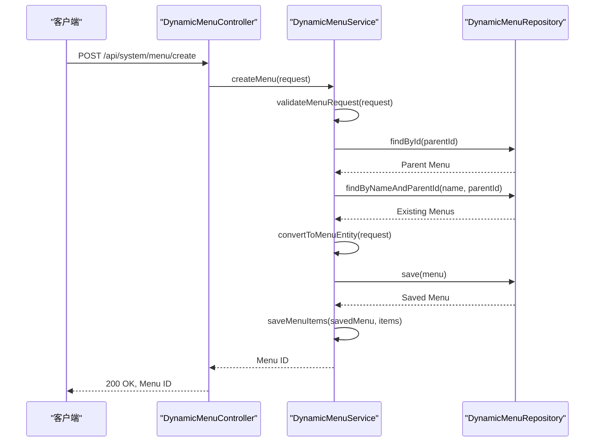
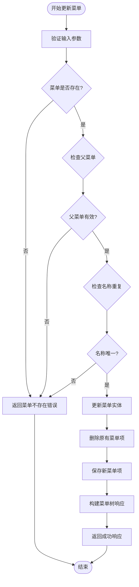
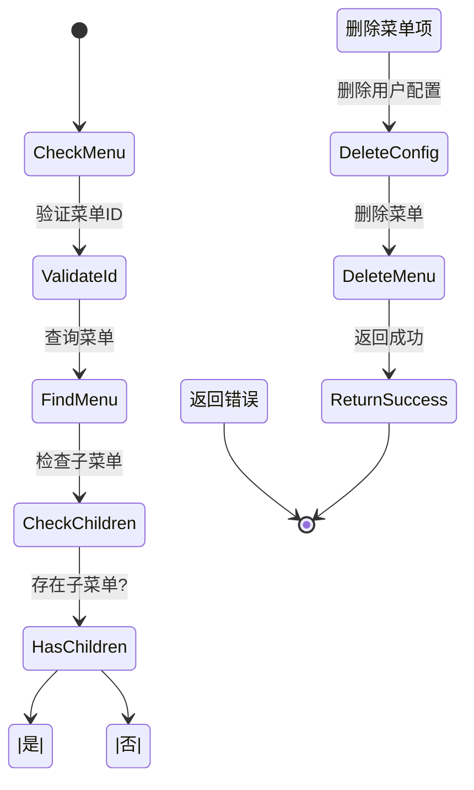
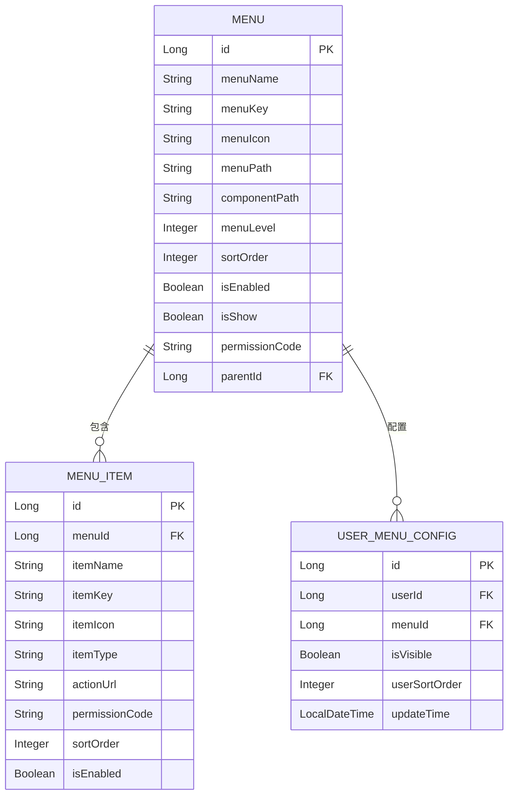
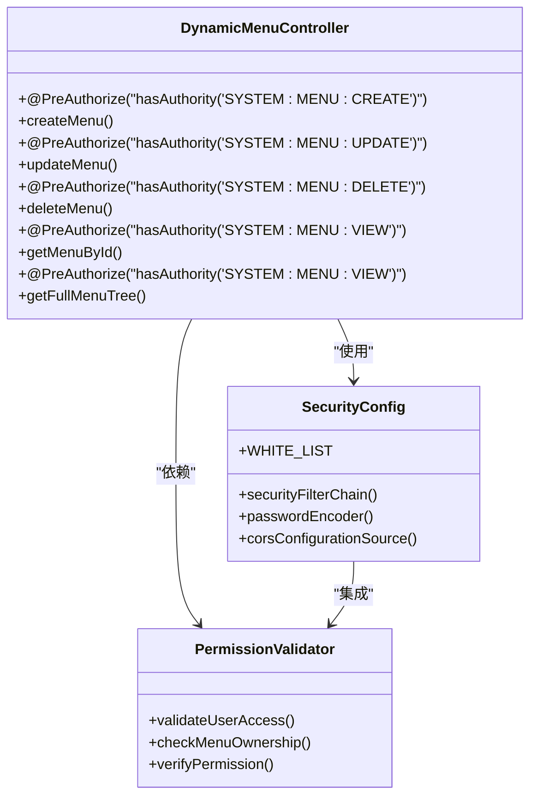

# 菜单管理API

<cite>
**本文档引用的文件**   
- [DynamicMenuController.java](file://08-backend/src/main/java/com/enterprise/brain/modules/system/menu/controller/DynamicMenuController.java)
- [MenuCreateRequest.java](file://08-backend/src/main/java/com/enterprise/brain/modules/system/menu/dto/request/MenuCreateRequest.java)
- [MenuTreeResponse.java](file://08-backend/src/main/java/com/enterprise/brain/modules/system/menu/dto/response/MenuTreeResponse.java)
- [DynamicMenuServiceImpl.java](file://08-backend/src/main/java/com/enterprise/brain/modules/system/menu/service/impl/DynamicMenuServiceImpl.java)
- [SecurityConfig.java](file://08-backend/src/main/java/com/enterprise/brain/common/config/SecurityConfig.java)
- [DynamicMenu.java](file://08-backend/src/main/java/com/enterprise/brain/modules/system/menu/entity/DynamicMenu.java)
- [DynamicMenuRepository.java](file://08-backend/src/main/java/com/enterprise/brain/modules/system/menu/repository/DynamicMenuRepository.java)
</cite>

## 目录
1. [简介](#简介)
2. [核心接口](#核心接口)
3. [创建菜单](#创建菜单)
4. [更新菜单](#更新菜单)
5. [删除菜单](#删除菜单)
6. [查询菜单](#查询菜单)
7. [权限控制](#权限控制)
8. [安全考虑](#安全考虑)
9. [错误处理](#错误处理)
10. [前端集成](#前端集成)

## 简介

菜单管理API提供了完整的菜单系统管理功能，包括菜单的创建、更新、删除和查询操作。该API支持树形结构的菜单管理，允许管理员动态配置系统菜单，并为不同用户定制个性化的菜单显示。API设计遵循RESTful原则，通过清晰的端点和数据结构实现高效的菜单管理。

**Section sources**
- [DynamicMenuController.java](file://08-backend/src/main/java/com/enterprise/brain/modules/system/menu/controller/DynamicMenuController.java#L1-L14)

## 核心接口

菜单管理API提供了一组RESTful接口，用于管理系统的动态菜单。这些接口支持CRUD操作，并通过权限控制确保只有授权用户才能执行特定操作。核心接口包括：

- `POST /api/system/menu/create`：创建新菜单
- `PUT /api/system/menu/{menuId}`：更新菜单信息
- `DELETE /api/system/menu/{menuId}`：删除菜单
- `GET /api/system/menu/{menuId}`：获取单个菜单详情
- `GET /api/system/menu/tree/full`：获取完整菜单树

这些接口构成了菜单管理的基础，支持系统管理员对菜单结构进行完整的生命周期管理。

```mermaid
graph TB
subgraph "菜单管理API"
Create[POST /api/system/menu/create]
Update[PUT /api/system/menu/{menuId}]
Delete[DELETE /api/system/menu/{menuId}]
GetSingle[GET /api/system/menu/{menuId}]
GetTree[GET /api/system/menu/tree/full]
end
Create --> Backend
Update --> Backend
Delete --> Backend
GetSingle --> Backend
GetTree --> Backend
Backend[后端服务]
style Create fill:#4CAF50,stroke:#388E3C
style Update fill:#2196F3,stroke:#1976D2
style Delete fill:#F44336,stroke:#D32F2F
style GetSingle fill:#FF9800,stroke:#F57C00
style GetTree fill:#9C27B0,stroke:#7B1FA2
```

**Diagram sources**
- [DynamicMenuController.java](file://08-backend/src/main/java/com/enterprise/brain/modules/system/menu/controller/DynamicMenuController.java#L19-L53)

## 创建菜单

### POST /api/system/menu/create

创建菜单接口用于添加新的菜单项到系统中。该接口需要管理员权限，通过`SYSTEM:MENU:CREATE`权限码进行保护。

#### 请求体：MenuCreateRequest

`MenuCreateRequest`定义了创建菜单所需的字段，包括：

- **menuName**: 菜单名称，用于显示在菜单栏中
- **menuKey**: 菜单键值，作为菜单的唯一标识符
- **menuIcon**: 菜单图标，指定菜单项的视觉表示
- **menuPath**: 菜单路径，对应前端路由路径
- **componentPath**: 组件路径，指定菜单关联的前端组件
- **menuLevel**: 菜单层级，表示菜单在树形结构中的深度
- **sortOrder**: 排序序号，决定菜单项的显示顺序
- **isEnabled**: 是否启用，控制菜单是否可用
- **isShow**: 是否显示，控制菜单是否在界面中可见
- **permissionCode**: 权限码，关联菜单的访问权限
- **parentId**: 父菜单ID，用于构建菜单的树形结构
- **menuItems**: 子菜单项列表，包含菜单下的操作项

#### 响应

成功创建菜单后，接口返回新创建菜单的ID。该ID可用于后续的更新、删除或查询操作。

#### 业务逻辑

创建菜单时，系统会执行以下验证：
1. 检查父菜单是否存在（如果指定了parentId）
2. 验证同一父菜单下是否存在同名菜单
3. 确保必填字段不为空
4. 为新菜单设置默认的启用状态



**Diagram sources**
- [MenuCreateRequest.java](file://08-backend/src/main/java/com/enterprise/brain/modules/system/menu/dto/request/MenuCreateRequest.java#L7-L20)
- [DynamicMenuServiceImpl.java](file://08-backend/src/main/java/com/enterprise/brain/modules/system/menu/service/impl/DynamicMenuServiceImpl.java#L78-L105)

**Section sources**
- [DynamicMenuController.java](file://08-backend/src/main/java/com/enterprise/brain/modules/system/menu/controller/DynamicMenuController.java#L20-L25)
- [MenuCreateRequest.java](file://08-backend/src/main/java/com/enterprise/brain/modules/system/menu/dto/request/MenuCreateRequest.java#L7-L20)

## 更新菜单

### PUT /api/system/menu/{menuId}

更新菜单接口用于修改现有菜单的信息。该接口需要`SYSTEM:MENU:UPDATE`权限，确保只有授权用户才能修改菜单配置。

#### 请求参数

- **menuId**: 路径参数，指定要更新的菜单ID
- **request**: 请求体，使用`MenuCreateRequest`对象传递更新的数据

#### 业务逻辑

更新菜单时，系统会执行以下操作：
1. 验证菜单ID的有效性
2. 检查父菜单是否存在（如果更改了父级）
3. 验证菜单名称在同级菜单中不重复
4. 禁止将菜单设置为自身的父菜单
5. 更新菜单基础信息
6. 删除原有菜单项并保存新的菜单项

更新操作采用全量更新模式，即请求体中的数据会完全替换原有菜单的对应字段。对于未提供的字段，系统会保留原有值。



**Diagram sources**
- [DynamicMenuController.java](file://08-backend/src/main/java/com/enterprise/brain/modules/system/menu/controller/DynamicMenuController.java#L27-L32)
- [DynamicMenuServiceImpl.java](file://08-backend/src/main/java/com/enterprise/brain/modules/system/menu/service/impl/DynamicMenuServiceImpl.java#L108-L143)

**Section sources**
- [DynamicMenuController.java](file://08-backend/src/main/java/com/enterprise/brain/modules/system/menu/controller/DynamicMenuController.java#L27-L32)
- [DynamicMenuServiceImpl.java](file://08-backend/src/main/java/com/enterprise/brain/modules/system/menu/service/impl/DynamicMenuServiceImpl.java#L108-L143)

## 删除菜单

### DELETE /api/system/menu/{menuId}

删除菜单接口用于从系统中移除指定的菜单。该接口需要`SYSTEM:MENU:DELETE`权限。

#### 级联删除行为

删除菜单时，系统会执行级联删除操作：
1. 首先检查是否存在子菜单
2. 如果存在子菜单，则拒绝删除操作
3. 删除关联的菜单项（MenuItem）
4. 删除用户菜单配置（UserMenuConfig）
5. 最终删除菜单本身

这种级联删除机制确保了数据的一致性，避免了孤儿记录的存在。

#### 批量删除

系统还提供了批量删除接口`batchDeleteMenus`，支持同时删除多个菜单。该接口支持级联删除选项：
- 当`cascade=false`时，仅删除没有子菜单的菜单
- 当`cascade=true`时，递归删除所有子菜单

批量删除会返回操作结果统计，包括成功和失败的数量及原因。



**Diagram sources**
- [DynamicMenuController.java](file://08-backend/src/main/java/com/enterprise/brain/modules/system/menu/controller/DynamicMenuController.java#L34-L39)
- [DynamicMenuServiceImpl.java](file://08-backend/src/main/java/com/enterprise/brain/modules/system/menu/service/impl/DynamicMenuServiceImpl.java#L147-L171)

**Section sources**
- [DynamicMenuController.java](file://08-backend/src/main/java/com/enterprise/brain/modules/system/menu/controller/DynamicMenuController.java#L34-L39)
- [DynamicMenuServiceImpl.java](file://08-backend/src/main/java/com/enterprise/brain/modules/system/menu/service/impl/DynamicMenuServiceImpl.java#L147-L171)

## 查询菜单

### GET /api/system/menu/{menuId}

获取单个菜单详情接口返回指定菜单的完整信息，包括其子菜单和菜单项。该接口需要`SYSTEM:MENU:VIEW`权限。

### GET /api/system/menu/tree/full

获取完整菜单树接口返回系统中所有菜单的树形结构。该接口同样需要`SYSTEM:MENU:VIEW`权限。

#### 响应结构：MenuTreeResponse

`MenuTreeResponse`定义了菜单的树形响应结构，包含以下字段：

- **id**: 菜单ID
- **menuName**: 菜单名称
- **menuKey**: 菜单键值
- **menuIcon**: 菜单图标
- **menuPath**: 菜单路径
- **componentPath**: 组件路径
- **menuLevel**: 菜单层级
- **sortOrder**: 排序序号
- **isEnabled**: 是否启用
- **isShow**: 是否显示
- **permissionCode**: 权限码
- **children**: 子菜单列表，递归包含子菜单的`MenuTreeResponse`
- **menuItems**: 菜单项列表，包含`MenuItemResponse`对象

这种递归的数据结构支持无限层级的菜单树，前端可以轻松地渲染出复杂的菜单界面。



**Diagram sources**
- [MenuTreeResponse.java](file://08-backend/src/main/java/com/enterprise/brain/modules/system/menu/dto/response/MenuTreeResponse.java#L7-L21)
- [DynamicMenu.java](file://08-backend/src/main/java/com/enterprise/brain/modules/system/menu/entity/DynamicMenu.java)
- [MenuItem.java](file://08-backend/src/main/java/com/enterprise/brain/modules/system/menu/entity/MenuItem.java)

**Section sources**
- [DynamicMenuController.java](file://08-backend/src/main/java/com/enterprise/brain/modules/system/menu/controller/DynamicMenuController.java#L41-L53)
- [MenuTreeResponse.java](file://08-backend/src/main/java/com/enterprise/brain/modules/system/menu/dto/response/MenuTreeResponse.java#L7-L21)

## 权限控制

菜单管理API通过Spring Security的权限注解实现细粒度的访问控制。每个接口都有特定的权限要求：

- **SYSTEM:MENU:CREATE**: 创建菜单权限
- **SYSTEM:MENU:UPDATE**: 更新菜单权限
- **SYSTEM:MENU:DELETE**: 删除菜单权限
- **SYSTEM:MENU:VIEW**: 查看菜单权限
- **SYSTEM:MENU:SORT**: 排序菜单权限

这些权限通过`@PreAuthorize("hasAuthority('PERMISSION_CODE')")`注解应用在控制器方法上，确保只有拥有相应权限的用户才能执行操作。

此外，系统还实现了数据级别的权限控制：
- 用户只能修改自己的菜单可见性配置
- 删除菜单时会检查子菜单的存在，防止意外删除
- 创建和更新菜单时会验证父菜单的有效性



**Diagram sources**
- [DynamicMenuController.java](file://08-backend/src/main/java/com/enterprise/brain/modules/system/menu/controller/DynamicMenuController.java#L21-L50)
- [SecurityConfig.java](file://08-backend/src/main/java/com/enterprise/brain/common/config/SecurityConfig.java#L29-L87)

**Section sources**
- [DynamicMenuController.java](file://08-backend/src/main/java/com/enterprise/brain/modules/system/menu/controller/DynamicMenuController.java#L21-L50)
- [SecurityConfig.java](file://08-backend/src/main/java/com/enterprise/brain/common/config/SecurityConfig.java#L29-L87)

## 安全考虑

菜单管理API在设计时充分考虑了安全性，实现了多层防护机制：

1. **认证与授权**: 所有菜单管理接口都需要用户认证，并通过权限码控制访问
2. **输入验证**: 对所有输入参数进行严格验证，防止无效数据进入系统
3. **数据完整性**: 通过级联删除和外键约束确保数据的一致性
4. **审计日志**: 所有菜单操作都会记录到审计日志中，便于追踪和审查
5. **防循环引用**: 在更新菜单时检查父菜单，防止创建循环引用

特别是审计功能，通过`@AuditLogAnnotation`注解自动记录关键操作，包括操作类型、操作人、操作时间和详细信息，为系统安全提供了有力保障。

**Section sources**
- [DynamicMenuController.java](file://08-backend/src/main/java/com/enterprise/brain/modules/system/menu/controller/DynamicMenuController.java#L20-L35)
- [AuditLogAnnotation.java](file://08-backend/src/main/java/com/enterprise/brain/modules/system/annotation/AuditLogAnnotation.java)

## 错误处理

菜单管理API实现了完善的错误处理机制，使用统一的响应格式返回错误信息。常见的错误情况包括：

- **菜单不存在**: 当请求的菜单ID不存在时返回404错误
- **权限不足**: 当用户没有相应权限时返回403错误
- **参数验证失败**: 当请求参数不符合要求时返回400错误
- **名称重复**: 当创建或更新菜单时名称重复返回409错误
- **存在子菜单**: 当删除有子菜单的菜单时返回400错误

所有错误都会通过`GlobalExceptionHandler`统一处理，返回结构化的错误响应，包含错误码、错误消息和详细信息，便于前端进行错误展示和处理。

**Section sources**
- [DynamicMenuServiceImpl.java](file://08-backend/src/main/java/com/enterprise/brain/modules/system/menu/service/impl/DynamicMenuServiceImpl.java#L42-L46)
- [GlobalExceptionHandler.java](file://08-backend/src/main/java/com/enterprise/brain/common/exception/GlobalExceptionHandler.java)

## 前端集成

前端通过`DynamicMenu.vue`和`MenuPreview.vue`组件集成菜单管理功能。这些组件使用axios调用后端API，实现菜单的动态加载和显示。

主要集成点包括：
- 使用`/api/system/menu/tree/user/{userId}`获取用户的个性化菜单
- 监听路由变化，高亮当前激活的菜单项
- 支持菜单的实时预览和配置

前端组件与后端API协同工作，为用户提供流畅的菜单管理体验。

**Section sources**
- [DynamicMenu.vue](file://07-frontend/src/pages/system/components/DynamicMenu.vue#L45-L48)
- [MenuPreview.vue](file://07-frontend/src/pages/system/components/MenuPreview.vue#L35-L37)