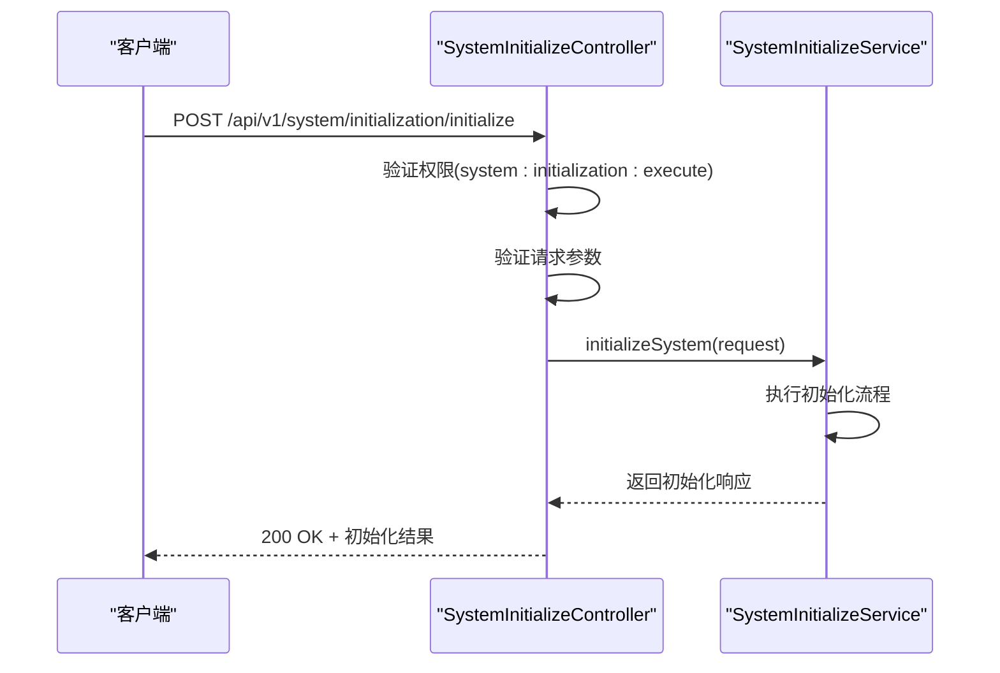
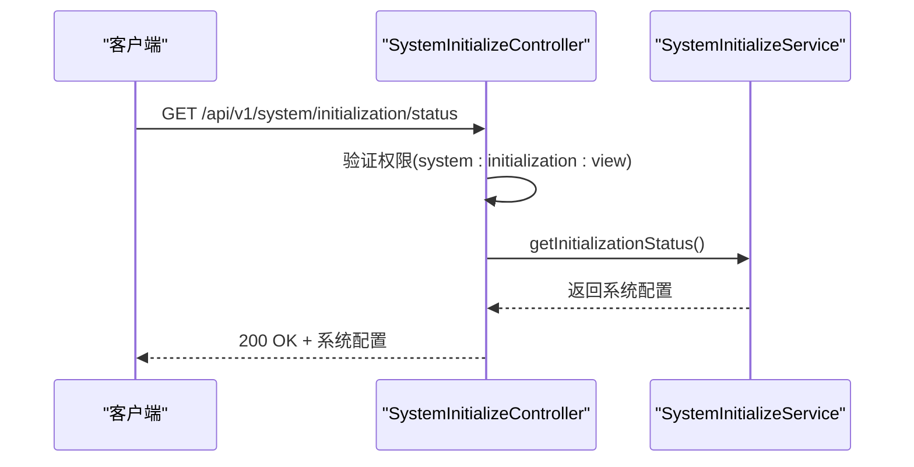
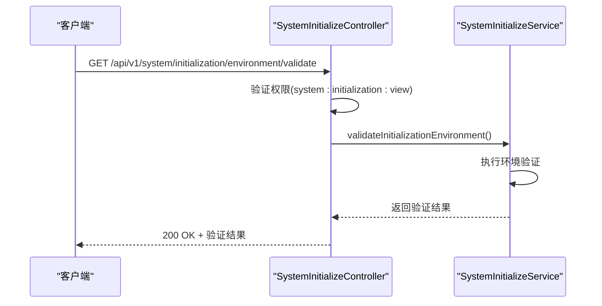
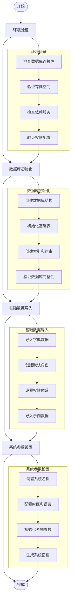
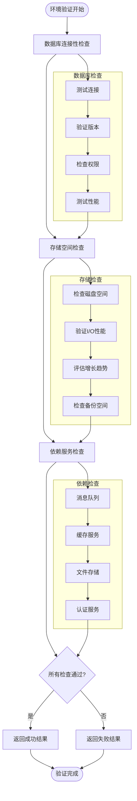
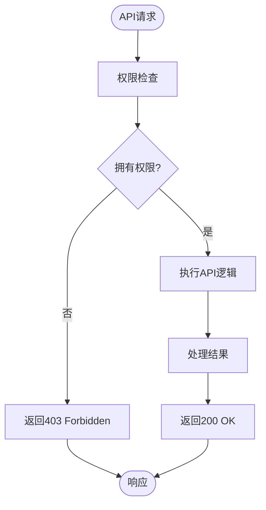
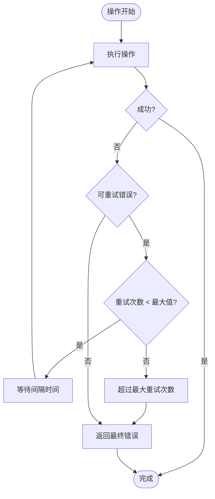

# 初始化管理

<cite>
**本文档引用的文件**
- [SystemInitializeController.java](file://08-backend/src/main/java/com/enterprise/brain/modules/system/initialization/controller/SystemInitializeController.java)
- [SystemInitializeService.java](file://08-backend/src/main/java/com/enterprise/brain/modules/system/initialization/service/SystemInitializeService.java)
- [InitializeRequest.java](file://08-backend/src/main/java/com/enterprise/brain/modules/system/initialization/dto/request/InitializeRequest.java)
- [InitializeResponse.java](file://08-backend/src/main/java/com/enterprise/brain/modules/system/initialization/dto/response/InitializeResponse.java)
- [SystemConfig.java](file://08-backend/src/main/java/com/enterprise/brain/modules/system/initialization/entity/SystemConfig.java)
- [initialization.js](file://07-frontend/src/api/system/initialization.js)
- [initialization-service.js](file://07-frontend/src/services/initialization-service.js)
</cite>

## 目录
1. [简介](#简介)
2. [核心API接口](#核心api接口)
3. [初始化配置参数](#初始化配置参数)
4. [执行流程](#执行流程)
5. [状态信息字段](#状态信息字段)
6. [环境验证规则](#环境验证规则)
7. [使用示例](#使用示例)
8. [权限控制机制](#权限控制机制)
9. [错误处理与重试机制](#错误处理与重试机制)
10. [最佳实践](#最佳实践)

## 简介

系统初始化管理API提供了一套完整的系统初始化解决方案，包括系统初始化、状态查询、环境验证等功能。该功能组主要面向系统管理员和运维人员，用于在系统首次部署或需要重置时进行初始化操作。API设计遵循RESTful规范，提供了清晰的接口定义和详细的错误处理机制。

系统初始化管理包含三个核心接口：POST /api/v1/system/initialization/initialize用于执行系统初始化，GET /api/v1/system/initialization/status用于获取初始化状态，GET /api/v1/system/initialization/environment/validate用于验证初始化环境。这些接口共同构成了系统初始化的完整工作流，确保系统能够安全、可靠地完成初始化过程。

**Section sources**
- [SystemInitializeController.java](file://08-backend/src/main/java/com/enterprise/brain/modules/system/initialization/controller/SystemInitializeController.java#L27-L33)

## 核心API接口

系统初始化管理提供了一组RESTful API接口，用于管理和监控系统初始化过程。这些接口设计遵循标准的HTTP方法和状态码规范，确保了接口的可预测性和易用性。

### 系统初始化接口

POST /api/v1/system/initialization/initialize接口用于执行系统初始化操作。该接口接收一个包含初始化配置的JSON请求体，并返回初始化结果。接口的执行是一个异步过程，系统会返回一个包含初始化批次号的响应，客户端可以通过该批次号查询初始化进度和结果。



**Diagram sources**
- [SystemInitializeController.java](file://08-backend/src/main/java/com/enterprise/brain/modules/system/initialization/controller/SystemInitializeController.java#L58-L74)
- [SystemInitializeService.java](file://08-backend/src/main/java/com/enterprise/brain/modules/system/initialization/service/SystemInitializeService.java#L30-L35)

### 状态查询接口

GET /api/v1/system/initialization/status接口用于获取系统初始化状态。该接口返回当前系统的初始化配置和状态信息，包括是否已初始化、初始化时间、系统版本等关键信息。此接口对于判断系统是否需要初始化或已经完成初始化非常有用。



**Diagram sources**
- [SystemInitializeController.java](file://08-backend/src/main/java/com/enterprise/brain/modules/system/initialization/controller/SystemInitializeController.java#L45-L55)
- [SystemInitializeService.java](file://08-backend/src/main/java/com/enterprise/brain/modules/system/initialization/service/SystemInitializeService.java#L22-L27)

### 环境验证接口

GET /api/v1/system/initialization/environment/validate接口用于验证系统初始化所需的环境条件。该接口检查数据库连接性、存储空间、依赖服务可用性等关键环境因素，确保系统能够在当前环境下成功完成初始化。



**Diagram sources**
- [SystemInitializeController.java](file://08-backend/src/main/java/com/enterprise/brain/modules/system/initialization/controller/SystemInitializeController.java#L149-L165)
- [SystemInitializeService.java](file://08-backend/src/main/java/com/enterprise/brain/modules/system/initialization/service/SystemInitializeService.java#L37-L42)

**Section sources**
- [SystemInitializeController.java](file://08-backend/src/main/java/com/enterprise/brain/modules/system/initialization/controller/SystemInitializeController.java#L36)
- [SystemInitializeService.java](file://08-backend/src/main/java/com/enterprise/brain/modules/system/initialization/service/SystemInitializeService.java#L20)

## 初始化配置参数

POST /api/v1/system/initialization/initialize接口的请求体包含详细的初始化配置参数，这些参数定义了系统初始化的具体行为和配置。请求体采用JSON格式，包含多个嵌套对象，用于组织不同类型的配置信息。

### 请求体结构

初始化请求体的主要结构包括初始化类型、模式、环境配置、数据库连接信息、管理员账户配置和基础数据设置等。这些参数共同决定了系统初始化的具体行为。

```json
{
  "initType": "FULL",
  "initMode": "AUTO",
  "environment": "PROD",
  "forceReinit": false,
  "skipValidation": false,
  "createSampleData": true,
  "databaseConfig": {
    "initSchema": true,
    "initData": true,
    "truncateExisting": false,
    "dataSourceConfig": {
      "url": "jdbc:mysql://localhost:3306/enterprise_db",
      "username": "admin",
      "password": "encrypted_password",
      "driverClassName": "com.mysql.cj.jdbc.Driver"
    }
  },
  "adminConfig": {
    "username": "admin",
    "password": "admin_password",
    "email": "admin@company.com",
    "phone": "13800138000",
    "realName": "系统管理员",
    "department": "IT部门",
    "roles": ["ADMIN"]
  },
  "systemConfig": {
    "systemName": "企业大脑系统",
    "systemVersion": "1.0.0",
    "systemCode": "EBRAIN",
    "timezone": "Asia/Shanghai",
    "language": "zh-CN",
    "theme": "dark",
    "systemParams": {
      "loginAttemptLimit": "5",
      "sessionTimeout": "1800",
      "dataRetentionDays": "365"
    }
  }
}
```

### 核心配置参数

#### 初始化类型和模式
- **initType**: 初始化类型，可选值包括FULL(完全初始化)、PARTIAL(部分初始化)、REPAIR(修复初始化)
- **initMode**: 初始化模式，可选值包括AUTO(自动)、MANUAL(手动)、CUSTOM(自定义)
- **environment**: 环境类型，可选值包括DEV(开发)、TEST(测试)、STAGING(预生产)、PROD(生产)

#### 数据库连接信息
数据库配置包含数据库连接所需的全部信息，包括连接URL、用户名、密码、驱动类名等。系统支持多种数据库类型，通过driverClassName参数指定具体的数据库驱动。

#### 管理员账户配置
管理员配置定义了系统初始化后创建的管理员账户信息，包括用户名、密码、邮箱、手机号、真实姓名、部门和角色等。这些信息将用于创建系统第一个管理员账户。

#### 基础数据设置
系统配置包含了系统级别的参数设置，如系统名称、版本、编码、时区、语言、主题等。此外，还可以通过systemParams字段设置特定的系统参数。

**Section sources**
- [InitializeRequest.java](file://08-backend/src/main/java/com/enterprise/brain/modules/system/initialization/dto/request/InitializeRequest.java#L20-L150)

## 执行流程

系统初始化的执行流程是一个多阶段的过程，每个阶段都有明确的目标和验证机制。整个流程设计为可中断和可恢复的，确保在出现问题时能够安全地停止和重试。

### 初始化阶段划分

系统初始化过程分为四个主要阶段：环境验证、数据库初始化、基础数据导入和系统参数设置。每个阶段都包含多个子步骤，确保初始化过程的完整性和可靠性。



**Diagram sources**
- [SystemInitializeService.java](file://08-backend/src/main/java/com/enterprise/brain/modules/system/initialization/service/SystemInitializeService.java#L138-L151)
- [SystemInitializeService.java](file://08-backend/src/main/java/com/enterprise/brain/modules/system/initialization/service/SystemInitializeService.java#L104-L120)

### 流程详细说明

#### 环境验证阶段
在执行初始化之前，系统首先进行环境验证，确保所有必要的条件都已满足。这包括检查数据库连接是否正常、存储空间是否充足、依赖的外部服务是否可用等。如果环境验证失败，系统将返回详细的错误信息，指导用户修复问题。

#### 数据库初始化阶段
此阶段负责创建和初始化数据库结构。系统会根据配置创建必要的表、索引和约束，并初始化基础数据表。如果选择了"清空现有数据"选项，系统会先清理现有数据再进行初始化。

#### 基础数据导入阶段
在数据库结构准备好后，系统开始导入基础数据。这包括系统字典、默认角色、权限体系等核心数据。如果配置了创建示例数据，系统还会导入一些示例数据用于演示和测试。

#### 系统参数设置阶段
最后阶段设置系统级别的参数，包括系统名称、版本、时区、语言等。系统还会生成必要的密钥和令牌，完成最后的配置工作。

**Section sources**
- [SystemInitializeService.java](file://08-backend/src/main/java/com/enterprise/brain/modules/system/initialization/service/SystemInitializeService.java#L35)
- [SystemInitializeService.java](file://08-backend/src/main/java/com/enterprise/brain/modules/system/initialization/service/SystemInitializeService.java#L104-L120)

## 状态信息字段

GET /api/v1/system/initialization/status接口返回的状态信息包含多个字段，这些字段提供了系统初始化的详细信息，帮助用户了解系统的当前状态。

### 状态信息结构

```json
{
  "id": 1,
  "configKey": "system.initialization.status",
  "configValue": "COMPLETED",
  "configName": "系统初始化状态",
  "description": "系统初始化完成状态",
  "configType": "system",
  "isSystem": 1,
  "isEnabled": 1,
  "createBy": 1,
  "createTime": "2024-01-01T00:00:00",
  "updateBy": 1,
  "updateTime": "2024-01-01T00:00:00",
  "remark": "系统已成功初始化",
  "deleted": 0
}
```

### 字段含义说明

- **id**: 配置记录的唯一标识
- **configKey**: 配置键，用于标识配置项
- **configValue**: 配置值，表示系统初始化状态，可能的值包括PENDING(待初始化)、INITIALIZING(初始化中)、COMPLETED(已完成)、FAILED(失败)
- **configName**: 配置名称，用于显示
- **description**: 配置描述，提供额外信息
- **configType**: 配置类型，system表示系统配置
- **isSystem**: 是否为系统内置配置
- **isEnabled**: 配置是否启用
- **createBy**: 创建者ID
- **createTime**: 创建时间
- **updateBy**: 更新者ID
- **updateTime**: 更新时间
- **remark**: 备注信息
- **deleted**: 逻辑删除标记

**Section sources**
- [SystemConfig.java](file://08-backend/src/main/java/com/enterprise/brain/modules/system/initialization/entity/SystemConfig.java#L20-L108)

## 环境验证规则

GET /api/v1/system/initialization/environment/validate接口执行一系列验证规则，确保系统能够在当前环境下成功完成初始化。这些规则涵盖了数据库连接性、存储空间、依赖服务可用性等多个方面。

### 验证规则详情

#### 数据库连接性验证
系统会尝试使用提供的数据库连接信息建立连接，验证数据库服务是否可用、网络连接是否正常、认证信息是否正确。验证包括：
- 测试数据库连接
- 验证数据库版本兼容性
- 检查数据库用户权限
- 验证连接池配置

#### 存储空间验证
系统会检查目标存储位置的可用空间，确保有足够的空间完成初始化。验证包括：
- 检查数据库存储空间
- 验证文件系统可用空间
- 评估初始化所需空间
- 预留安全余量

#### 依赖服务可用性验证
系统会检查所有依赖的外部服务是否可用，包括：
- 消息队列服务
- 缓存服务
- 文件存储服务
- 认证服务
- 监控服务



**Diagram sources**
- [SystemInitializeService.java](file://08-backend/src/main/java/com/enterprise/brain/modules/system/initialization/service/SystemInitializeService.java#L42)
- [SystemInitializeService.java](file://08-backend/src/main/java/com/enterprise/brain/modules/system/initialization/service/SystemInitializeService.java#L135-L136)

**Section sources**
- [SystemInitializeService.java](file://08-backend/src/main/java/com/enterprise/brain/modules/system/initialization/service/SystemInitializeService.java#L37-L42)
- [SystemInitializeController.java](file://08-backend/src/main/java/com/enterprise/brain/modules/system/initialization/controller/SystemInitializeController.java#L152-L165)

## 使用示例

以下是一些实际使用系统初始化API的示例，展示了如何通过不同的方式调用API完成系统初始化。

### curl命令示例

使用curl命令执行系统初始化：

```bash
# 执行系统初始化
curl -X POST https://api.example.com/api/v1/system/initialization/initialize \
  -H "Content-Type: application/json" \
  -H "Authorization: Bearer your-access-token" \
  -d '{
    "initType": "FULL",
    "initMode": "AUTO",
    "environment": "PROD",
    "forceReinit": false,
    "skipValidation": false,
    "createSampleData": true,
    "databaseConfig": {
      "initSchema": true,
      "initData": true,
      "truncateExisting": false,
      "dataSourceConfig": {
        "url": "jdbc:mysql://localhost:3306/enterprise_db",
        "username": "admin",
        "password": "your-encrypted-password",
        "driverClassName": "com.mysql.cj.jdbc.Driver"
      }
    },
    "adminConfig": {
      "username": "admin",
      "password": "admin-password",
      "email": "admin@company.com",
      "phone": "13800138000",
      "realName": "系统管理员",
      "department": "IT部门",
      "roles": ["ADMIN"]
    },
    "systemConfig": {
      "systemName": "企业大脑系统",
      "systemVersion": "1.0.0",
      "systemCode": "EBRAIN",
      "timezone": "Asia/Shanghai",
      "language": "zh-CN",
      "theme": "dark"
    }
  }'

# 查询初始化状态
curl -X GET https://api.example.com/api/v1/system/initialization/status \
  -H "Authorization: Bearer your-access-token"

# 验证初始化环境
curl -X GET https://api.example.com/api/v1/system/initialization/environment/validate \
  -H "Authorization: Bearer your-access-token"
```

### 前端调用示例

在前端JavaScript中调用系统初始化API：

```javascript
// 导入API服务
import { systemInitApi } from '@/api/system/initialization';

// 执行系统初始化
async function executeInitialization() {
  const initParams = {
    initType: 'FULL',
    initMode: 'AUTO',
    environment: 'PROD',
    forceReinit: false,
    skipValidation: false,
    createSampleData: true,
    databaseConfig: {
      initSchema: true,
      initData: true,
      truncateExisting: false,
      dataSourceConfig: {
        url: 'jdbc:mysql://localhost:3306/enterprise_db',
        username: 'admin',
        password: 'encrypted_password',
        driverClassName: 'com.mysql.cj.jdbc.Driver'
      }
    },
    adminConfig: {
      username: 'admin',
      password: 'admin_password',
      email: 'admin@company.com',
      phone: '13800138000',
      realName: '系统管理员',
      department: 'IT部门',
      roles: ['ADMIN']
    },
    systemConfig: {
      systemName: '企业大脑系统',
      systemVersion: '1.0.0',
      systemCode: 'EBRAIN',
      timezone: 'Asia/Shanghai',
      language: 'zh-CN',
      theme: 'dark'
    }
  };

  try {
    const response = await systemInitApi.executeInit(initParams);
    console.log('初始化结果:', response.data);
    
    // 轮询检查初始化状态
    const status = await checkInitializationStatus();
    console.log('初始化状态:', status);
  } catch (error) {
    console.error('初始化失败:', error);
  }
}

// 检查初始化状态
async function checkInitializationStatus() {
  try {
    const response = await systemInitApi.checkInitStatus();
    return response.data;
  } catch (error) {
    console.error('获取状态失败:', error);
    return null;
  }
}

// 验证初始化环境
async function validateEnvironment() {
  try {
    const response = await systemInitApi.validateEnvironment();
    return response.data;
  } catch (error) {
    console.error('环境验证失败:', error);
    return null;
  }
}
```

**Section sources**
- [initialization.js](file://07-frontend/src/api/system/initialization.js#L9-L51)
- [initialization-service.js](file://07-frontend/src/services/initialization-service.js#L4-L44)

## 权限控制机制

系统初始化功能组采用了严格的权限控制机制，确保只有授权用户才能执行敏感操作。权限控制基于角色和权限的RBAC模型实现，通过Spring Security框架进行管理。

### 权限定义

系统初始化相关的权限定义如下：

| 权限标识 | 描述 | 对应接口 |
|---------|------|---------|
| system:initialization:execute | 执行系统初始化权限 | POST /api/v1/system/initialization/initialize |
| system:initialization:view | 查看初始化状态和日志权限 | GET /api/v1/system/initialization/status, GET /api/v1/system/initialization/environment/validate |
| system:initialization:reset | 重置系统数据权限 | POST /api/v1/system/initialization/data/reset |
| system:initialization:backup | 备份系统数据权限 | POST /api/v1/system/initialization/data/backup |
| system:initialization:restore | 恢复系统数据权限 | POST /api/v1/system/initialization/data/restore |
| system:initialization:cleanup | 清理临时文件权限 | DELETE /api/v1/system/initialization/temp/cleanup |
| system:initialization:optimize | 执行系统优化权限 | POST /api/v1/system/initialization/optimize |

### 权限验证流程



**Diagram sources**
- [SystemInitializeController.java](file://08-backend/src/main/java/com/enterprise/brain/modules/system/initialization/controller/SystemInitializeController.java#L50)
- [SystemInitializeController.java](file://08-backend/src/main/java/com/enterprise/brain/modules/system/initialization/controller/SystemInitializeController.java#L62)

### 权限实现细节

在代码层面，权限控制通过@PreAuthorize注解实现。每个API接口都标注了相应的权限要求，Spring Security会在请求到达控制器方法之前进行权限验证。

```java
// 需要system:initialization:execute权限
@PreAuthorize("hasAuthority('system:initialization:execute')")
public ApiResult<InitializeResponse> initializeSystem(@Valid @RequestBody InitializeRequest request) {
    // 初始化逻辑
}

// 需要system:initialization:view权限
@PreAuthorize("hasAuthority('system:initialization:view')")
public ApiResult<SystemConfig> getInitializationStatus() {
    // 获取状态逻辑
}
```

**Section sources**
- [SystemInitializeController.java](file://08-backend/src/main/java/com/enterprise/brain/modules/system/initialization/controller/SystemInitializeController.java#L20)
- [SystemInitializeController.java](file://08-backend/src/main/java/com/enterprise/brain/modules/system/initialization/controller/SystemInitializeController.java#L50-L63)

## 错误处理与重试机制

系统初始化过程中可能会遇到各种错误情况，系统提供了完善的错误处理和重试机制，确保初始化过程的可靠性和可恢复性。

### 错误处理策略

系统采用分层的错误处理策略，包括：

1. **输入验证**: 在请求处理初期进行参数验证，防止无效请求进入系统
2. **异常捕获**: 在关键操作周围使用try-catch块捕获异常
3. **错误分类**: 将错误分为可恢复错误和不可恢复错误
4. **详细日志**: 记录详细的错误信息和上下文
5. **用户友好消息**: 向用户返回清晰的错误描述

### 重试机制

对于可恢复的临时性错误（如网络超时、数据库连接中断等），系统提供了自动重试机制：



**Diagram sources**
- [SystemInitializeService.java](file://08-backend/src/main/java/com/enterprise/brain/modules/system/initialization/service/SystemInitializeService.java#L182-L184)
- [SystemInitializeController.java](file://08-backend/src/main/java/com/enterprise/brain/modules/system/initialization/controller/SystemInitializeController.java#L67-L73)

### 错误排查方法

当初始化失败时，可以按照以下步骤进行排查：

1. **检查请求参数**: 确认所有必需参数都已提供且格式正确
2. **查看错误信息**: 分析返回的错误消息和错误代码
3. **检查日志**: 查看系统日志获取更详细的错误上下文
4. **验证环境**: 确认数据库连接、存储空间等环境条件满足要求
5. **联系支持**: 如果问题仍然存在，联系技术支持团队

**Section sources**
- [SystemInitializeController.java](file://08-backend/src/main/java/com/enterprise/brain/modules/system/initialization/controller/SystemInitializeController.java#L67-L73)
- [SystemInitializeService.java](file://08-backend/src/main/java/com/enterprise/brain/modules/system/initialization/service/SystemInitializeService.java#L35)

## 最佳实践

为了确保系统初始化过程的顺利进行，建议遵循以下最佳实践：

### 准备工作
- 在生产环境执行初始化前，先在测试环境进行验证
- 备份现有数据（如果存在）
- 确保有足够的系统资源（CPU、内存、存储空间）
- 通知相关用户系统维护时间

### 参数配置
- 仔细检查数据库连接信息，确保准确无误
- 为管理员账户设置强密码
- 根据实际需求选择合适的初始化类型和模式
- 合理配置系统参数，如时区、语言等

### 执行过程
- 在低峰时段执行初始化操作
- 监控初始化进度和系统资源使用情况
- 记录初始化过程中的关键事件
- 准备好回滚计划，以防初始化失败

### 后续工作
- 验证系统功能是否正常
- 检查数据完整性
- 更新相关文档
- 通知用户系统已准备就绪

遵循这些最佳实践可以帮助确保系统初始化过程的顺利进行，减少潜在问题的发生。

**Section sources**
- [SystemInitializeService.java](file://08-backend/src/main/java/com/enterprise/brain/modules/system/initialization/service/SystemInitializeService.java)
- [SystemInitializeController.java](file://08-backend/src/main/java/com/enterprise/brain/modules/system/initialization/controller/SystemInitializeController.java)