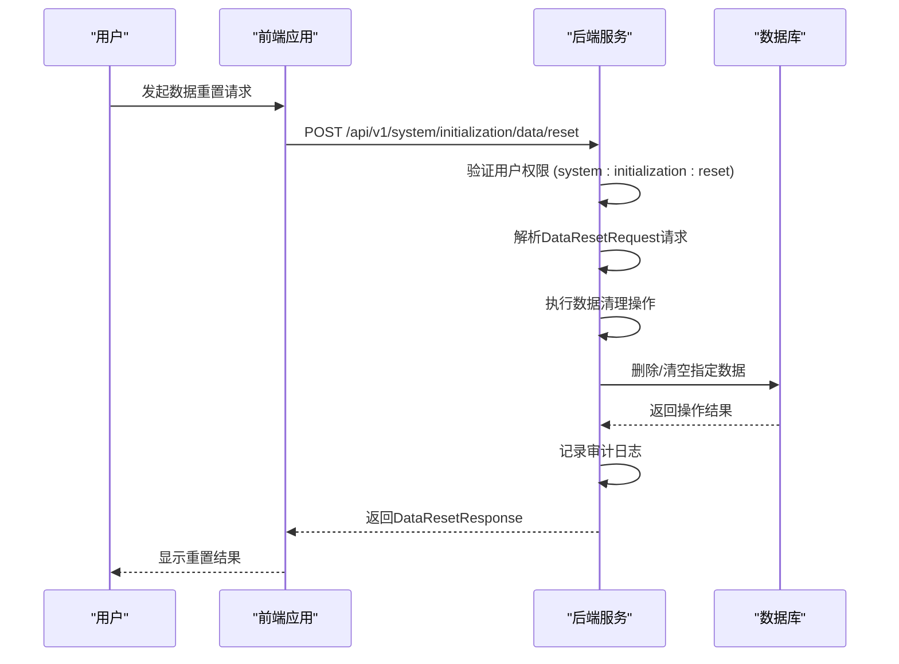
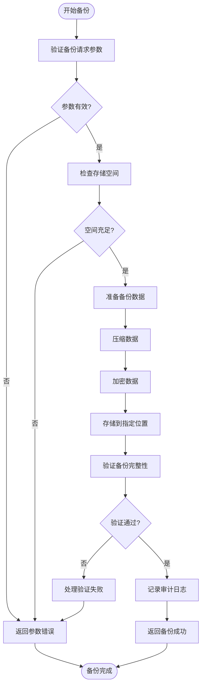
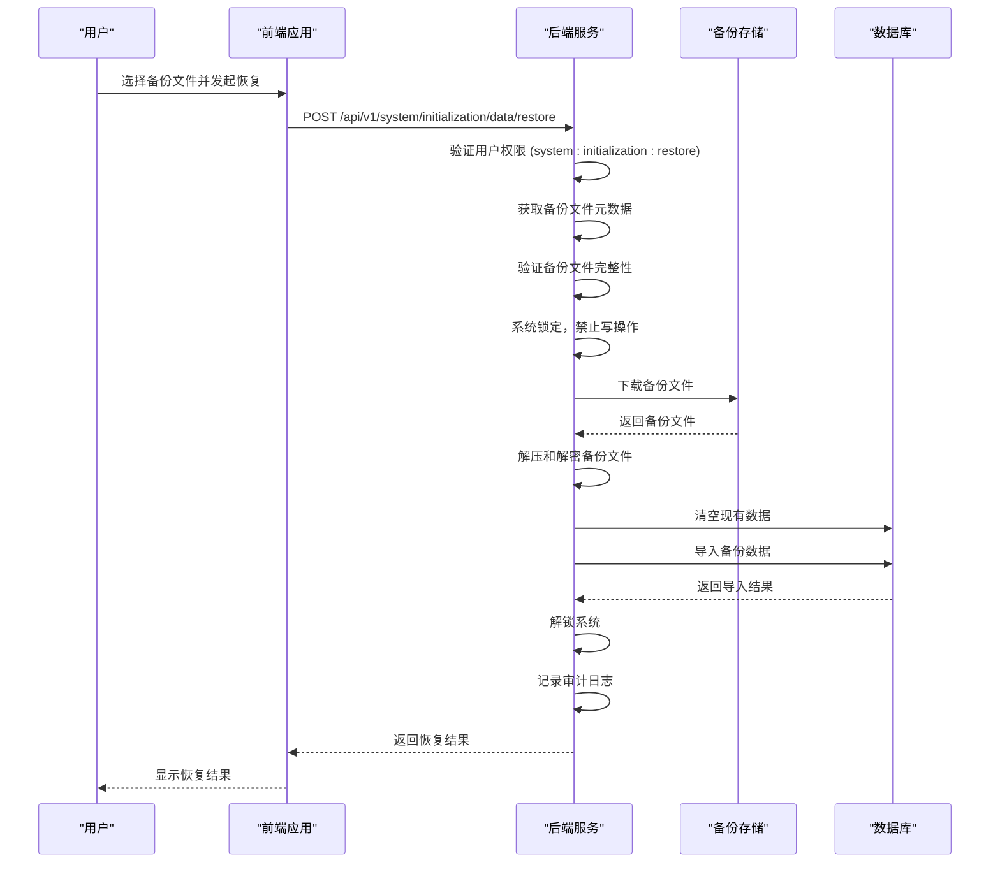
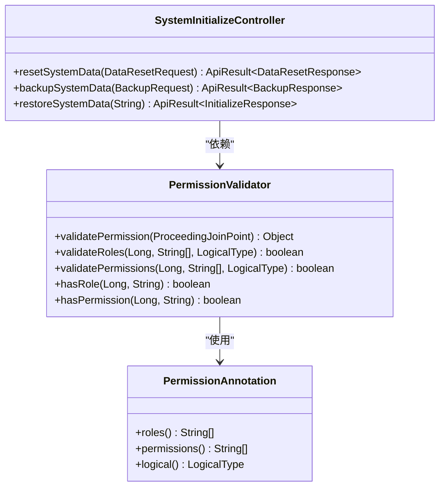

# 数据管理

<cite>
**本文档引用文件**   
- [SystemInitializeController.java](file://08-backend/src/main/java/com/enterprise/brain/modules/system/initialization/controller/SystemInitializeController.java)
- [DataResetRequest.java](file://08-backend/src/main/java/com/enterprise/brain/modules/system/initialization/dto/request/DataResetRequest.java)
- [BackupRequest.java](file://08-backend/src/main/java/com/enterprise/brain/modules/system/initialization/dto/request/BackupRequest.java)
- [DataResetResponse.java](file://08-backend/src/main/java/com/enterprise/brain/modules/system/initialization/dto/response/DataResetResponse.java)
- [BackupResponse.java](file://08-backend/src/main/java/com/enterprise/brain/modules/system/initialization/dto/response/BackupResponse.java)
- [InitializeResponse.java](file://08-backend/src/main/java/com/enterprise/brain/modules/system/initialization/dto/response/InitializeResponse.java)
- [DataResetServiceImpl.java](file://08-backend/src/main/java/com/enterprise/brain/modules/system/initialization/service/impl/DataResetServiceImpl.java)
- [PermissionValidator.java](file://08-backend/src/main/java/com/enterprise/brain/common/security/PermissionValidator.java)
- [AuditLog.java](file://08-backend/src/main/java/com/enterprise/brain/modules/system/audit/entity/AuditLog.java)
- [EnterpriseDataManagement.md](file://07-frontend/src/docs/EnterpriseDataManagement.md)
</cite>

## 目录
1. [简介](#简介)
2. [系统数据重置](#系统数据重置)
3. [系统数据备份](#系统数据备份)
4. [系统数据恢复](#系统数据恢复)
5. [安全限制与审计日志](#安全限制与审计日志)
6. [错误处理场景](#错误处理场景)

## 简介
本文档详细说明了企业智能系统中的数据管理API，重点涵盖系统数据重置、备份与恢复功能。文档详细描述了`POST /api/v1/system/initialization/data/reset`接口的实现机制，包括数据清理范围、重置前的确认流程以及重置后的系统状态。同时，文档解释了`POST /api/v1/system/initialization/data/backup`接口的备份策略、备份文件格式和存储位置配置，以及`POST /api/v1/system/initialization/data/restore`接口的恢复流程、数据一致性校验机制和恢复过程中的系统锁定策略。所有操作均受到严格的安全限制，并记录详细的审计日志以确保操作的可追溯性。

## 系统数据重置

### 重置接口与权限
系统数据重置通过`POST /api/v1/system/initialization/data/reset`接口实现，该接口由`SystemInitializeController`类中的`resetSystemData`方法处理。执行此操作需要`system:initialization:reset`权限，通过Spring Security的`@PreAuthorize`注解进行权限验证。



**Diagram sources**
- [SystemInitializeController.java](file://08-backend/src/main/java/com/enterprise/brain/modules/system/initialization/controller/SystemInitializeController.java#L77-L93)
- [DataResetRequest.java](file://08-backend/src/main/java/com/enterprise/brain/modules/system/initialization/dto/request/DataResetRequest.java#L22-L69)
- [DataResetResponse.java](file://08-backend/src/main/java/com/enterprise/brain/modules/system/initialization/dto/response/DataResetResponse.java#L21-L71)

### 重置范围与模式
数据重置支持多种重置类型和模式，通过`DataResetRequest`对象进行配置。

**重置类型**:
- `FULL`: 完全重置，清除所有业务数据
- `MODULE`: 按模块重置
- `TABLE`: 按表重置
- `CUSTOM`: 自定义重置

**重置模式**:
- `TRUNCATE`: 使用TRUNCATE语句，快速清空表
- `DELETE`: 使用DELETE语句，可带条件删除
- `SOFT_DELETE`: 软删除，仅更新状态字段

**清理范围**:
- **业务数据**: 包括客户、产品、订单等核心业务表
- **日志数据**: 操作日志、活动日志等历史记录
- **缓存数据**: 系统缓存、会话数据等临时信息
- **临时文件**: 上传的临时文件、导出的临时数据

### 重置前确认流程
为防止误操作，系统实施了严格的重置前确认流程：

1. **双重确认**: 用户必须在前端界面进行两次确认操作
2. **密码验证**: 对于敏感操作，需要输入管理员密码进行验证
3. **数据备份**: 可选择在重置前自动备份原数据
4. **影响评估**: 系统会显示重置操作的影响范围和预计执行时间

### 重置后系统状态
重置完成后，系统将返回`DataResetResponse`对象，包含详细的重置结果信息：

- **重置状态**: `PENDING`, `RUNNING`, `SUCCESS`, `FAILED`, `ROLLBACK`
- **执行统计**: 重置的对象数量、记录数量、释放的存储空间
- **操作日志**: 重置过程中生成的操作日志ID列表
- **回滚信息**: 如果支持回滚，提供回滚备份ID和状态

**Section sources**
- [DataResetRequest.java](file://08-backend/src/main/java/com/enterprise/brain/modules/system/initialization/dto/request/DataResetRequest.java#L22-L69)
- [DataResetResponse.java](file://08-backend/src/main/java/com/enterprise/brain/modules/system/initialization/dto/response/DataResetResponse.java#L21-L71)
- [DataResetServiceImpl.java](file://08-backend/src/main/java/com/enterprise/brain/modules/system/initialization/service/impl/DataResetServiceImpl.java#L19-L22)

## 系统数据备份

### 备份接口与权限
系统数据备份通过`POST /api/v1/system/initialization/data/backup`接口实现，该接口由`SystemInitializeController`类中的`backupSystemData`方法处理。执行此操作需要`system:initialization:backup`权限。



**Diagram sources**
- [SystemInitializeController.java](file://08-backend/src/main/java/com/enterprise/brain/modules/system/initialization/controller/SystemInitializeController.java#L98-L112)
- [BackupRequest.java](file://08-backend/src/main/java/com/enterprise/brain/modules/system/initialization/dto/request/BackupRequest.java#L22-L77)
- [BackupResponse.java](file://08-backend/src/main/java/com/enterprise/brain/modules/system/initialization/dto/response/BackupResponse.java#L21-L89)

### 备份策略
系统支持多种备份策略，满足不同场景的需求：

**备份类型**:
- `FULL`: 全量备份，包含所有数据
- `INCREMENTAL`: 增量备份，仅包含自上次备份以来的变更数据
- `DIFFERENTIAL`: 差异备份，包含自上次全量备份以来的变更数据

**备份模式**:
- `MANUAL`: 手动备份，由用户即时触发
- `AUTO`: 自动备份，根据系统策略自动执行
- `SCHEDULED`: 定时备份，按预定计划执行

### 备份文件格式与存储
备份文件采用高效的格式和存储策略，确保数据安全和恢复效率。

**备份文件格式**:
- **SQL脚本**: 以SQL语句形式保存数据，便于查看和编辑
- **压缩包**: 使用ZIP或GZIP格式压缩，减少存储空间占用
- **分卷存储**: 大型备份文件可分割为多个卷，便于传输和管理

**存储位置配置**:
- **本地存储**: 保存在服务器本地磁盘的指定路径
- **FTP服务器**: 上传到远程FTP服务器
- **云存储**: 支持S3、OSS、COS等主流云存储服务
- **网络存储**: 保存在NAS或SAN等网络存储设备

存储配置通过`BackupRequest.StorageConfig`对象进行设置，包括存储类型、路径、访问密钥等信息。

**Section sources**
- [BackupRequest.java](file://08-backend/src/main/java/com/enterprise/brain/modules/system/initialization/dto/request/BackupRequest.java#L22-L77)
- [BackupResponse.java](file://08-backend/src/main/java/com/enterprise/brain/modules/system/initialization/dto/response/BackupResponse.java#L21-L89)
- [SystemInitializeController.java](file://08-backend/src/main/java/com/enterprise/brain/modules/system/initialization/controller/SystemInitializeController.java#L98-L112)

## 系统数据恢复

### 恢复接口与权限
系统数据恢复通过`POST /api/v1/system/initialization/data/restore`接口实现，该接口由`SystemInitializeController`类中的`restoreSystemData`方法处理。执行此操作需要`system:initialization:restore`权限。



**Diagram sources**
- [SystemInitializeController.java](file://08-backend/src/main/java/com/enterprise/brain/modules/system/initialization/controller/SystemInitializeController.java#L117-L131)
- [InitializeResponse.java](file://08-backend/src/main/java/com/enterprise/brain/modules/system/initialization/dto/response/InitializeResponse.java#L21-L68)
- [DataResetServiceImpl.java](file://08-backend/src/main/java/com/enterprise/brain/modules/system/initialization/service/impl/DataResetServiceImpl.java#L19-L22)

### 恢复流程
数据恢复是一个复杂的过程，涉及多个步骤以确保数据的一致性和完整性。

1. **预检查**: 验证备份文件的完整性和兼容性
2. **系统锁定**: 在恢复过程中锁定系统，防止其他用户修改数据
3. **数据清理**: 清空目标数据库中的现有数据
4. **数据导入**: 将备份文件中的数据导入数据库
5. **索引重建**: 重建数据库索引以优化性能
6. **一致性校验**: 验证恢复后的数据一致性
7. **系统解锁**: 恢复完成后解锁系统，恢复正常服务

### 数据一致性校验
为确保恢复后的数据质量，系统实施了严格的数据一致性校验机制：

- **文件完整性校验**: 使用MD5或SHA256校验备份文件的完整性
- **数据结构校验**: 验证数据库表结构与备份文件的兼容性
- **业务规则校验**: 检查恢复后的数据是否符合业务规则
- **外键约束校验**: 验证所有外键约束是否完整
- **数据完整性校验**: 确保所有关联数据的一致性

### 系统锁定策略
在数据恢复过程中，系统采用严格的锁定策略以防止数据冲突：

- **写操作锁定**: 禁止所有数据写入操作，只允许读取
- **会话管理**: 已存在的会话可以继续，但不能执行写操作
- **新连接限制**: 新的写操作连接将被拒绝
- **超时机制**: 如果恢复过程超时，系统将自动解锁并回滚

**Section sources**
- [SystemInitializeController.java](file://08-backend/src/main/java/com/enterprise/brain/modules/system/initialization/controller/SystemInitializeController.java#L117-L131)
- [InitializeResponse.java](file://08-backend/src/main/java/com/enterprise/brain/modules/system/initialization/dto/response/InitializeResponse.java#L21-L68)
- [DataResetServiceImpl.java](file://08-backend/src/main/java/com/enterprise/brain/modules/system/initialization/service/impl/DataResetServiceImpl.java#L19-L22)

## 安全限制与审计日志

### 安全权限控制
所有数据管理操作都受到严格的安全权限控制，确保只有授权用户才能执行敏感操作。

**权限要求**:
- `system:initialization:data:manage`: 数据管理总权限
- `system:initialization:reset`: 数据重置权限
- `system:initialization:backup`: 数据备份权限
- `system:initialization:restore`: 数据恢复权限

权限验证通过`@PreAuthorize`注解和`PermissionValidator`切面实现，确保每个请求都经过权限检查。



**Diagram sources**
- [PermissionValidator.java](file://08-backend/src/main/java/com/enterprise/brain/common/security/PermissionValidator.java#L27-L85)
- [SystemInitializeController.java](file://08-backend/src/main/java/com/enterprise/brain/modules/system/initialization/controller/SystemInitializeController.java#L100-L120)

### 审计日志记录
所有数据管理操作都会被详细记录在审计日志中，确保操作的可追溯性。

**审计日志内容**:
- **操作用户**: 执行操作的用户ID和用户名
- **操作类型**: 重置、备份或恢复
- **操作模块**: 系统初始化管理
- **IP地址**: 用户的IP地址
- **操作时间**: 操作执行的时间戳
- **详细信息**: 操作的详细参数和结果

审计日志存储在`sys_audit_log`表中，通过`AuditLogService`进行管理和查询。

**Section sources**
- [PermissionValidator.java](file://08-backend/src/main/java/com/enterprise/brain/common/security/PermissionValidator.java#L27-L85)
- [AuditLog.java](file://08-backend/src/main/java/com/enterprise/brain/modules/system/audit/entity/AuditLog.java#L1-L22)
- [EnterpriseDataManagement.md](file://07-frontend/src/docs/EnterpriseDataManagement.md#L78-L105)

## 错误处理场景

### 请求/响应示例

**数据重置请求示例**:
```json
{
  "resetType": "FULL",
  "resetMode": "TRUNCATE",
  "backupBeforeReset": true,
  "confirmed": true,
  "reason": "系统重新初始化"
}
```

**数据重置响应示例**:
```json
{
  "resetId": "reset-20240101-001",
  "status": "SUCCESS",
  "success": true,
  "statistics": {
    "totalObjects": 15,
    "successCount": 15,
    "totalRecordsBefore": 10000,
    "totalRecordsAfter": 0,
    "releasedStorage": 52428800
  },
  "logIds": [1001, 1002, 1003]
}
```

**数据备份请求示例**:
```json
{
  "backupType": "FULL",
  "backupMode": "MANUAL",
  "backupScope": "ALL",
  "backupName": "Full Backup 2024-01-01",
  "compressionConfig": {
    "enabled": true,
    "compressionType": "GZIP"
  },
  "storageConfig": {
    "storageType": "S3",
    "bucketName": "enterprise-backup",
    "region": "us-west-1"
  }
}
```

**数据备份响应示例**:
```json
{
  "backupId": 1001,
  "backupNo": "BK20240101001",
  "status": "SUCCESS",
  "success": true,
  "filePath": "s3://enterprise-backup/2024/01/01/full-backup.zip",
  "fileSize": 26214400,
  "compressedSize": 13107200,
  "compressionRatio": 0.5,
  "fileMd5": "d41d8cd98f00b204e9800998ecf8427e"
}
```

**数据恢复请求示例**:
```json
{
  "backupId": "BK20240101001"
}
```

**数据恢复响应示例**:
```json
{
  "batchNo": "INIT20240101001",
  "status": "SUCCESS",
  "success": true,
  "statistics": {
    "totalSteps": 5,
    "successSteps": 5,
    "createdUsers": 1,
    "createdRoles": 3,
    "createdMenus": 15
  },
  "systemInfo": {
    "systemId": "EB-2024-001",
    "systemName": "Enterprise Brain",
    "systemVersion": "1.0.0"
  }
}
```

### 错误处理场景

**备份空间不足**:
```json
{
  "success": false,
  "errorCode": "STORAGE_FULL",
  "errorMessage": "备份存储空间不足，请清理空间或更换存储位置",
  "suggestions": [
    "检查存储设备的可用空间",
    "清理过期的备份文件",
    "配置其他存储位置"
  ]
}
```

**恢复文件损坏**:
```json
{
  "success": false,
  "errorCode": "BACKUP_CORRUPTED",
  "errorMessage": "备份文件校验失败，文件可能已损坏",
  "warnings": [
    "文件MD5校验值不匹配"
  ],
  "suggestions": [
    "重新下载备份文件",
    "尝试其他备份文件",
    "联系系统管理员"
  ]
}
```

**权限不足**:
```json
{
  "success": false,
  "errorCode": "ACCESS_DENIED",
  "errorMessage": "权限不足，无法执行此操作",
  "suggestions": [
    "检查您的用户权限",
    "联系系统管理员获取相应权限"
  ]
}
```

**并发操作冲突**:
```json
{
  "success": false,
  "errorCode": "CONCURRENT_OPERATION",
  "errorMessage": "系统正在进行其他数据操作，请稍后重试",
  "warnings": [
    "另一个用户正在执行数据备份"
  ],
  "suggestions": [
    "等待当前操作完成",
    "查看操作队列状态"
  ]
}
```

**Section sources**
- [DataResetResponse.java](file://08-backend/src/main/java/com/enterprise/brain/modules/system/initialization/dto/response/DataResetResponse.java#L42-L71)
- [BackupResponse.java](file://08-backend/src/main/java/com/enterprise/brain/modules/system/initialization/dto/response/BackupResponse.java#L48-L73)
- [InitializeResponse.java](file://08-backend/src/main/java/com/enterprise/brain/modules/system/initialization/dto/response/InitializeResponse.java#L36-L43)