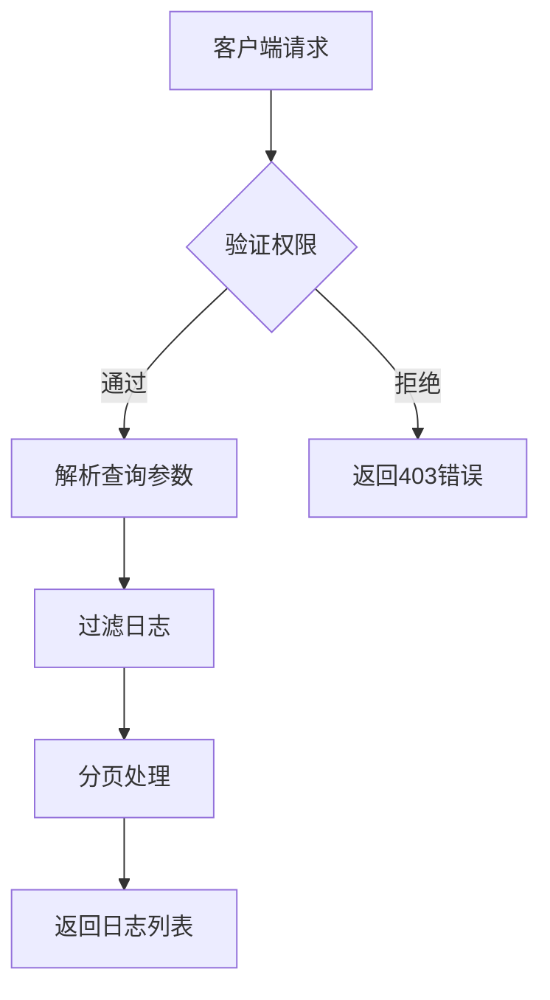
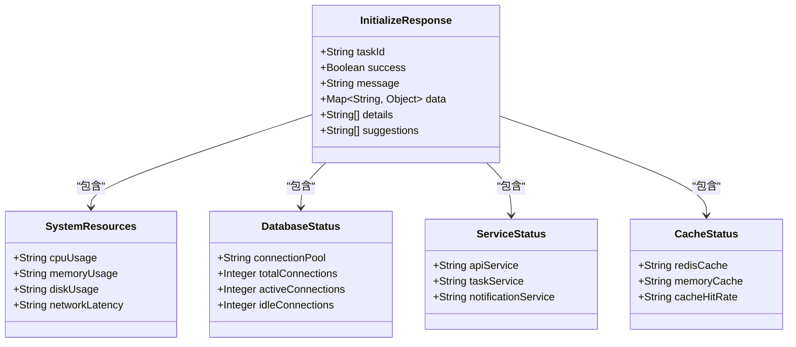
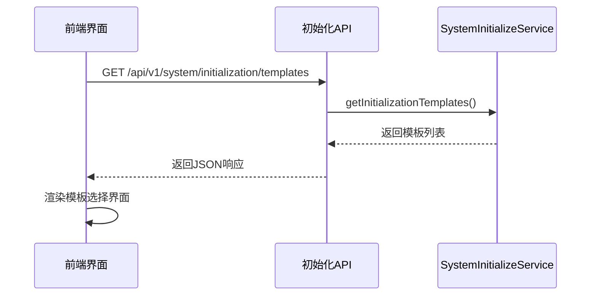
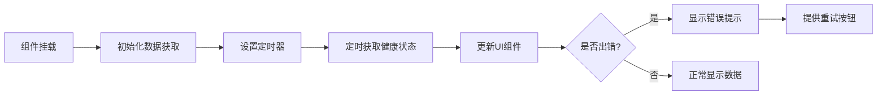

# 状态监控

<cite>
**本文档引用的文件**
- [SystemInitializeController.java](file://08-backend/src/main/java/com/enterprise/brain/modules/system/initialization/controller/SystemInitializeController.java)
- [SystemInitializeServiceImpl.java](file://08-backend/src/main/java/com/enterprise/brain/modules/system/initialization/service/impl/SystemInitializeServiceImpl.java)
- [InitializeResponse.java](file://08-backend/src/main/java/com/enterprise/brain/modules/system/initialization/dto/response/InitializeResponse.java)
- [SystemConfig.java](file://08-backend/src/main/java/com/enterprise/brain/modules/system/initialization/entity/SystemConfig.java)
- [initialization.js](file://07-frontend/src/api/system/initialization.js)
- [ServerMonitor.vue](file://07-frontend/src/pages/system/monitor/ServerMonitor.vue)
- [CacheMonitor.vue](file://07-frontend/src/pages/system/monitor/CacheMonitor.vue)
</cite>

## 目录
1. [简介](#简介)
2. [初始化日志接口](#初始化日志接口)
3. [健康检查接口](#健康检查接口)
4. [初始化模板接口](#初始化模板接口)
5. [前端调用示例](#前端调用示例)
6. [系统仪表盘集成](#系统仪表盘集成)
7. [权限要求](#权限要求)
8. [性能考虑](#性能考虑)

## 简介
状态监控API为系统初始化过程提供了全面的监控与诊断功能。本系统通过三个核心接口——`GET /api/v1/system/initialization/logs`、`GET /api/v1/system/initialization/health`和`GET /api/v1/system/initialization/templates`，实现了对系统初始化过程的全方位监控。这些接口不仅提供了详细的日志记录、系统健康状态检查，还支持基于模板的快速初始化。系统采用Spring Security进行权限控制，确保只有授权用户才能访问敏感的监控信息。前端通过Vue.js组件实现了直观的监控界面，将复杂的系统状态以可视化的方式呈现给用户。

**Section sources**
- [SystemInitializeController.java](file://08-backend/src/main/java/com/enterprise/brain/modules/system/initialization/controller/SystemInitializeController.java#L1-L50)

## 初始化日志接口
`GET /api/v1/system/initialization/logs`接口用于获取系统初始化过程中的日志信息。该接口返回的日志条目采用统一的格式，包含时间戳、日志级别、操作描述和任务ID等关键信息。日志级别分为INFO、ERROR、WARN等标准级别，便于用户快速识别问题严重程度。每条日志都包含一个时间戳，格式为`[YYYY-MM-DD HH:mm:ss]`，确保了日志的时间准确性。操作类型字段记录了具体的初始化操作，如"初始化数据库"、"创建基础配置"等，帮助用户追踪初始化流程的执行情况。

该接口支持多种查询参数，包括页码（page）、每页大小（size）和操作类型（operationType）。通过这些参数，用户可以灵活地过滤和分页查看日志。例如，可以只查看"ERROR"级别的日志，或者只查看与数据库相关的操作日志。日志数据存储在内存中的`initializationLogs`列表中，并通过`ConcurrentHashMap`确保线程安全。为防止内存溢出，系统限制了日志的最大数量为10,000条，超出部分将自动删除最早的日志。



**Diagram sources**
- [SystemInitializeController.java](file://08-backend/src/main/java/com/enterprise/brain/modules/system/initialization/controller/SystemInitializeController.java#L133-L147)
- [SystemInitializeServiceImpl.java](file://08-backend/src/main/java/com/enterprise/brain/modules/system/initialization/service/impl/SystemInitializeServiceImpl.java#L165-L181)

**Section sources**
- [SystemInitializeController.java](file://08-backend/src/main/java/com/enterprise/brain/modules/system/initialization/controller/SystemInitializeController.java#L133-L147)
- [SystemInitializeServiceImpl.java](file://08-backend/src/main/java/com/enterprise/brain/modules/system/initialization/service/impl/SystemInitializeServiceImpl.java#L165-L181)

## 健康检查接口
`GET /api/v1/system/initialization/health`接口提供了全面的系统健康检查功能。该接口返回的健康检查项包括数据库连接、缓存服务、文件存储等多个关键组件的状态。响应数据结构基于`InitializeResponse`类，包含系统资源、数据库状态、服务状态和缓存状态等详细信息。

系统资源检查包括CPU使用率、内存使用率、磁盘使用率和网络延迟等指标。数据库状态检查涵盖了连接池状态、总连接数、活跃连接数和空闲连接数等关键参数。服务状态检查确认API服务、任务服务和通知服务等核心服务的运行状态。缓存状态检查则验证Redis缓存和内存缓存的连接状态，以及缓存命中率等性能指标。

当系统健康检查发现问题时，接口会返回详细的错误信息和建议操作，帮助管理员快速定位和解决问题。例如，如果数据库连接数过高，系统会建议优化数据库连接池配置或检查是否有连接泄漏。健康检查结果以JSON格式返回，便于前端组件解析和展示。



**Diagram sources**
- [InitializeResponse.java](file://08-backend/src/main/java/com/enterprise/brain/modules/system/initialization/dto/response/InitializeResponse.java#L1-L249)
- [SystemInitializeServiceImpl.java](file://08-backend/src/main/java/com/enterprise/brain/modules/system/initialization/service/impl/SystemInitializeServiceImpl.java#L239-L276)

**Section sources**
- [SystemInitializeController.java](file://08-backend/src/main/java/com/enterprise/brain/modules/system/initialization/controller/SystemInitializeController.java#L206-L218)
- [SystemInitializeServiceImpl.java](file://08-backend/src/main/java/com/enterprise/brain/modules/system/initialization/service/impl/SystemInitializeServiceImpl.java#L239-L276)

## 初始化模板接口
`GET /api/v1/system/initialization/templates`接口提供了系统初始化模板的管理功能。该接口返回一个包含多个初始化模板的列表，每个模板都包含模板ID、名称、描述和配置参数等信息。系统预定义了四种标准模板：基础初始化、标准初始化、企业初始化和自定义初始化，满足不同场景的需求。

基础初始化模板包含最基本的系统配置和数据结构，适用于新系统的快速部署。标准初始化模板包含了完整的业务数据和配置，适合大多数企业的日常使用。企业初始化模板则包含了企业级的完整功能和数据，适用于大型企业的复杂需求。自定义初始化模板允许用户根据特定需求定制初始化内容，提供了最大的灵活性。

每个模板通过`SystemConfig`实体类表示，包含配置键、配置值、配置名称、描述、配置类型等属性。前端可以通过该接口获取所有可用的模板，并允许用户选择合适的模板进行系统初始化。选择模板后，系统会根据模板的配置参数自动执行相应的初始化步骤，大大简化了系统部署的复杂性。



**Diagram sources**
- [SystemInitializeController.java](file://08-backend/src/main/java/com/enterprise/brain/modules/system/initialization/controller/SystemInitializeController.java#L169-L183)
- [SystemInitializeServiceImpl.java](file://08-backend/src/main/java/com/enterprise/brain/modules/system/initialization/service/impl/SystemInitializeServiceImpl.java#L186-L203)

**Section sources**
- [SystemInitializeController.java](file://08-backend/src/main/java/com/enterprise/brain/modules/system/initialization/controller/SystemInitializeController.java#L169-L183)
- [SystemInitializeServiceImpl.java](file://08-backend/src/main/java/com/enterprise/brain/modules/system/initialization/service/impl/SystemInitializeServiceImpl.java#L186-L203)

## 前端调用示例
前端通过`initialization.js`文件中的API封装调用后端接口。以下是一个典型的前端调用示例，展示了如何获取初始化日志：

```javascript
import request from '@/services/utils/request'

export const systemInitApi = {
  getInitializationLogs(page = 1, size = 20, operationType = null) {
    return request({
      url: '/api/v1/system/initialization/logs',
      method: 'get',
      params: {
        page,
        size,
        operationType
      }
    })
  },
  
  getSystemHealth() {
    return request({
      url: '/api/v1/system/initialization/health',
      method: 'get'
    })
  },
  
  getInitializationTemplates() {
    return request({
      url: '/api/v1/system/initialization/templates',
      method: 'get'
    })
  }
}
```

在Vue组件中，可以通过以下方式调用这些API：

```javascript
export default {
  data() {
    return {
      logs: [],
      healthStatus: {},
      templates: []
    }
  },
  async mounted() {
    await this.fetchInitializationData()
  },
  methods: {
    async fetchInitializationData() {
      try {
        // 获取初始化日志
        const logResponse = await systemInitApi.getInitializationLogs(1, 50)
        this.logs = logResponse.data
        
        // 获取系统健康状态
        const healthResponse = await systemInitApi.getSystemHealth()
        this.healthStatus = healthResponse.data.data
        
        // 获取初始化模板
        const templateResponse = await systemInitApi.getInitializationTemplates()
        this.templates = templateResponse.data
      } catch (error) {
        console.error('获取初始化数据失败:', error)
      }
    }
  }
}
```

**Section sources**
- [initialization.js](file://07-frontend/src/api/system/initialization.js#L1-L270)

## 系统仪表盘集成
系统仪表盘通过`ServerMonitor.vue`和`CacheMonitor.vue`等组件实现了监控数据的可视化集成。`ServerMonitor.vue`组件负责展示系统资源使用情况，包括CPU、内存、磁盘和网络等关键指标。该组件通过定时轮询`GET /api/v1/system/initialization/health`接口获取最新的系统状态，并以图表形式展示给用户。

`CacheMonitor.vue`组件则专注于缓存服务的监控，显示Redis缓存和内存缓存的连接状态、缓存命中率等信息。当缓存命中率低于预设阈值时，组件会发出警告，提醒管理员进行优化。两个组件都采用了响应式设计，能够适应不同屏幕尺寸的设备。

仪表盘的集成流程如下：首先，组件在`mounted`生命周期钩子中初始化数据获取；然后，通过`setInterval`定时器定期刷新数据；最后，将获取的数据绑定到UI组件上，实现实时监控。为了提高用户体验，系统还实现了错误处理机制，当API调用失败时会显示友好的错误提示，并提供重试功能。



**Diagram sources**
- [ServerMonitor.vue](file://07-frontend/src/pages/system/monitor/ServerMonitor.vue)
- [CacheMonitor.vue](file://07-frontend/src/pages/system/monitor/CacheMonitor.vue)

**Section sources**
- [ServerMonitor.vue](file://07-frontend/src/pages/system/monitor/ServerMonitor.vue)
- [CacheMonitor.vue](file://07-frontend/src/pages/system/monitor/CacheMonitor.vue)

## 权限要求
系统对状态监控API实施了严格的权限控制，确保只有授权用户才能访问敏感的监控信息。所有监控接口都需要`system:initialization:monitor`权限，该权限通过Spring Security的`@PreAuthorize`注解实现。在`SystemInitializeController`中，每个接口方法都使用了`@PreAuthorize("hasAuthority('system:initialization:view')")`注解，确保只有拥有相应权限的用户才能调用。

权限系统基于角色访问控制（RBAC）模型，管理员可以为不同用户角色分配不同的权限。例如，系统管理员拥有所有权限，而普通用户可能只能查看部分监控信息。权限信息存储在数据库的权限表中，并在用户登录时加载到内存中，以提高访问效率。

当用户尝试访问没有权限的接口时，系统会返回HTTP 403 Forbidden错误，并在日志中记录该事件。这种细粒度的权限控制不仅保护了系统的安全性，还确保了监控信息的保密性。

**Section sources**
- [SystemInitializeController.java](file://08-backend/src/main/java/com/enterprise/brain/modules/system/initialization/controller/SystemInitializeController.java#L138-L139)

## 性能考虑
状态监控API在设计时充分考虑了性能因素，采用了多种优化策略。首先，日志查询接口实现了分页机制，通过`page`和`size`参数控制每次返回的日志数量，默认每页20条，最大支持100条。这有效避免了大量数据传输导致的性能问题。

其次，系统对日志存储进行了优化，使用`ConcurrentHashMap`和`ArrayList`等高效数据结构，并限制了日志的最大数量为10,000条。当日志数量超过限制时，系统会自动删除最早的日志，确保内存使用在合理范围内。

对于健康检查接口，系统采用了缓存机制，将频繁访问的健康状态信息缓存到Redis中，减少数据库查询次数。同时，接口响应数据经过精心设计，只返回必要的信息，减少了网络传输的数据量。

前端方面，仪表盘组件采用了虚拟滚动和懒加载技术，只渲染可见区域的数据，大大提高了大容量数据的渲染性能。此外，系统还实现了智能轮询机制，根据系统负载动态调整数据刷新频率，在保证实时性的同时避免了不必要的资源消耗。

**Section sources**
- [SystemInitializeServiceImpl.java](file://08-backend/src/main/java/com/enterprise/brain/modules/system/initialization/service/impl/SystemInitializeServiceImpl.java#L176-L181)
- [ServerMonitor.vue](file://07-frontend/src/pages/system/monitor/ServerMonitor.vue)