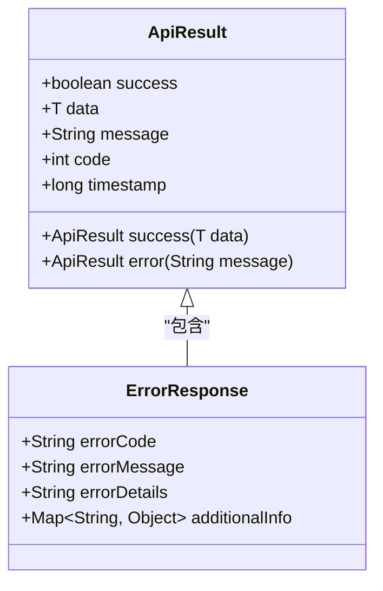

# 系统初始化API

<cite>
**本文档引用的文件**  
- [SystemInitializeController.java](file://08-backend/src/main/java/com/enterprise/brain/modules/system/initialization/controller/SystemInitializeController.java)
- [SystemInitializeService.java](file://08-backend/src/main/java/com/enterprise/brain/modules/system/initialization/service/SystemInitializeService.java)
- [DataResetService.java](file://08-backend/src/main/java/com/enterprise/brain/modules/system/initialization/service/DataResetService.java)
- [SystemConfig.java](file://08-backend/src/main/java/com/enterprise/brain/modules/system/initialization/entity/SystemConfig.java)
- [initialization.js](file://07-frontend/src/api/system/initialization.js)
- [ErrorResponse.java](file://08-backend/src/main/java/com/enterprise/brain/common/exception/ErrorResponse.java)
</cite>

## 目录
1. [系统初始化API概述](#系统初始化api概述)
2. [系统初始化功能组](#系统初始化功能组)
3. [数据管理功能组](#数据管理功能组)
4. [状态监控功能组](#状态监控功能组)
5. [权限管理](#权限管理)
6. [错误处理机制](#错误处理机制)

## 系统初始化API概述

系统初始化API提供了一套完整的系统初始化、数据管理和状态监控功能，确保系统能够安全、可靠地进行初始化操作和数据维护。该API分为三大功能组：系统初始化、数据管理和状态监控，每个功能组都提供了相应的RESTful接口，支持权限控制和详细的错误处理。

**本节来源**  
- [SystemInitializeController.java](file://08-backend/src/main/java/com/enterprise/brain/modules/system/initialization/controller/SystemInitializeController.java#L1-L20)
- [initialization.js](file://07-frontend/src/api/system/initialization.js#L1-L10)

## 系统初始化功能组

系统初始化功能组提供了系统初始化相关的接口，包括执行系统初始化、获取初始化状态和验证初始化环境。

### 执行系统初始化

`POST /api/v1/system/initialization/initialize` 接口用于执行系统初始化操作。该接口需要提供初始化配置参数，包括数据库连接信息、管理员账户信息、系统参数等。

**请求参数**  
- `request` (InitializeRequest): 初始化请求对象，包含所有必要的初始化配置

**权限要求**  
- `system:initialization:execute`

**返回值**  
- `InitializeResponse`: 初始化响应对象，包含初始化结果和相关信息

**本节来源**  
- [SystemInitializeController.java](file://08-backend/src/main/java/com/enterprise/brain/modules/system/initialization/controller/SystemInitializeController.java#L57-L74)
- [SystemInitializeService.java](file://08-backend/src/main/java/com/enterprise/brain/modules/system/initialization/service/SystemInitializeService.java#L30-L35)

### 获取初始化状态

`GET /api/v1/system/initialization/status` 接口用于获取当前系统的初始化状态。该接口返回系统配置信息，包括初始化是否完成、当前初始化步骤等。

**返回值**  
- `SystemConfig`: 系统配置实体，包含配置键、配置值、配置类型等信息

**权限要求**  
- `system:initialization:view`

**本节来源**  
- [SystemInitializeController.java](file://08-backend/src/main/java/com/enterprise/brain/modules/system/initialization/controller/SystemInitializeController.java#L45-L55)
- [SystemConfig.java](file://08-backend/src/main/java/com/enterprise/brain/modules/system/initialization/entity/SystemConfig.java#L1-L108)

### 验证初始化环境

`GET /api/v1/system/initialization/environment/validate` 接口用于验证初始化环境是否满足要求。该接口检查系统环境的各个方面，包括数据库连接、文件系统权限、网络配置等。

**返回值**  
- `InitializeResponse`: 验证结果，包含验证是否通过、错误信息等

**权限要求**  
- `system:initialization:view`

**本节来源**  
- [SystemInitializeController.java](file://08-backend/src/main/java/com/enterprise/brain/modules/system/initialization/controller/SystemInitializeController.java#L149-L165)
- [SystemInitializeService.java](file://08-backend/src/main/java/com/enterprise/brain/modules/system/initialization/service/SystemInitializeService.java#L37-L42)

## 数据管理功能组

数据管理功能组提供了系统数据的重置、备份和恢复功能，确保数据的安全性和可恢复性。

### 重置系统数据

`POST /api/v1/system/initialization/data/reset` 接口用于重置系统数据。该操作会清除所有业务数据，但保留系统配置和元数据。

**请求参数**  
- `request` (DataResetRequest): 重置请求对象，包含重置配置、确认信息等

**权限要求**  
- `system:initialization:reset`

**返回值**  
- `DataResetResponse`: 重置响应对象，包含重置结果、统计信息等

**本节来源**  
- [SystemInitializeController.java](file://08-backend/src/main/java/com/enterprise/brain/modules/system/initialization/controller/SystemInitializeController.java#L76-L93)
- [DataResetService.java](file://08-backend/src/main/java/com/enterprise/brain/modules/system/initialization/service/DataResetService.java#L18-L24)

### 备份系统数据

`POST /api/v1/system/initialization/data/backup` 接口用于备份系统数据。该接口创建系统数据的完整备份，可用于后续的数据恢复。

**请求参数**  
- `request` (BackupRequest): 备份请求对象，包含备份配置、备份路径等

**权限要求**  
- `system:initialization:backup`

**返回值**  
- `BackupResponse`: 备份响应对象，包含备份ID、备份路径、备份大小等信息

**本节来源**  
- [SystemInitializeController.java](file://08-backend/src/main/java/com/enterprise/brain/modules/system/initialization/controller/SystemInitializeController.java#L95-L112)
- [DataResetService.java](file://08-backend/src/main/java/com/enterprise/brain/modules/system/initialization/service/DataResetService.java#L26-L32)

### 恢复系统数据

`POST /api/v1/system/initialization/data/restore` 接口用于恢复系统数据。该接口从指定的备份文件恢复系统数据。

**请求参数**  
- `backupId` (String): 备份文件ID，用于指定要恢复的备份

**权限要求**  
- `system:initialization:restore`

**返回值**  
- `InitializeResponse`: 恢复响应对象，包含恢复结果、进度信息等

**本节来源**  
- [SystemInitializeController.java](file://08-backend/src/main/java/com/enterprise/brain/modules/system/initialization/controller/SystemInitializeController.java#L114-L131)
- [DataResetService.java](file://08-backend/src/main/java/com/enterprise/brain/modules/system/initialization/service/DataResetService.java#L34-L40)

## 状态监控功能组

状态监控功能组提供了系统初始化过程中的日志、健康状态和模板管理功能。

### 获取初始化日志

`GET /api/v1/system/initialization/logs` 接口用于获取初始化日志。该接口支持分页查询和按操作类型过滤。

**请求参数**  
- `page` (int): 页码，默认为1
- `size` (int): 每页大小，默认为20
- `operationType` (String): 操作类型，可选

**权限要求**  
- `system:initialization:view`

**返回值**  
- `List<String>`: 日志列表，包含初始化过程中的所有日志信息

**本节来源**  
- [SystemInitializeController.java](file://08-backend/src/main/java/com/enterprise/brain/modules/system/initialization/controller/SystemInitializeController.java#L133-L147)
- [SystemInitializeService.java](file://08-backend/src/main/java/com/enterprise/brain/modules/system/initialization/service/SystemInitializeService.java#L44-L52)

### 获取系统健康状态

`GET /api/v1/system/initialization/health` 接口用于获取系统健康状态。该接口返回系统的整体健康状况，包括数据库连接、内存使用、磁盘空间等指标。

**返回值**  
- `InitializeResponse`: 健康状态信息，包含各项健康指标和总体状态

**权限要求**  
- `system:initialization:view`

**本节来源**  
- [SystemInitializeController.java](file://08-backend/src/main/java/com/enterprise/brain/modules/system/initialization/controller/SystemInitializeController.java#L203-L219)
- [SystemInitializeService.java](file://08-backend/src/main/java/com/enterprise/brain/modules/system/initialization/service/SystemInitializeService.java#L68-L73)

### 获取初始化模板

`GET /api/v1/system/initialization/templates` 接口用于获取支持的初始化模板。这些模板包含了预定义的系统配置，可以用于快速初始化系统。

**返回值**  
- `List<SystemConfig>`: 模板列表，包含所有可用的初始化模板

**权限要求**  
- `system:initialization:view`

**本节来源**  
- [SystemInitializeController.java](file://08-backend/src/main/java/com/enterprise/brain/modules/system/initialization/controller/SystemInitializeController.java#L167-L183)
- [SystemInitializeService.java](file://08-backend/src/main/java/com/enterprise/brain/modules/system/initialization/service/SystemInitializeService.java#L54-L59)

## 权限管理

系统初始化API采用了基于权限的访问控制机制，确保只有授权用户才能执行敏感操作。

### 权限列表

- `system:initialization:view`: 查看权限，允许获取初始化状态、日志、健康状态等信息
- `system:initialization:execute`: 执行权限，允许执行系统初始化操作
- `system:initialization:reset`: 重置权限，允许重置系统数据
- `system:initialization:backup`: 备份权限，允许备份系统数据
- `system:initialization:restore`: 恢复权限，允许恢复系统数据
- `system:initialization:cleanup`: 清理权限，允许清理临时文件
- `system:initialization:optimize`: 优化权限，允许执行系统优化

**本节来源**  
- [SystemInitializeController.java](file://08-backend/src/main/java/com/enterprise/brain/modules/system/initialization/controller/SystemInitializeController.java#L50-L226)
- [SystemInitializeController.java](file://08-backend/src/main/java/com/enterprise/brain/modules/system/initialization/controller/SystemInitializeController.java#L62-L227)

## 错误处理机制

系统初始化API提供了完善的错误处理机制，确保客户端能够正确处理各种异常情况。

### 错误响应结构

所有API接口都返回统一的响应结构，包含成功状态、数据和错误信息。当操作失败时，返回错误信息而不是抛出异常。

**图示来源**  
- [SystemInitializeController.java](file://08-backend/src/main/java/com/enterprise/brain/modules/system/initialization/controller/SystemInitializeController.java#L55-L73)
- [ErrorResponse.java](file://08-backend/src/main/java/com/enterprise/brain/common/exception/ErrorResponse.java#L1-L50)

### 异常处理

后端使用`GlobalExceptionHandler`统一处理所有异常，将技术性异常转换为用户友好的错误信息，同时记录详细的错误日志用于问题排查。

**本节来源**  
- [SystemInitializeController.java](file://08-backend/src/main/java/com/enterprise/brain/modules/system/initialization/controller/SystemInitializeController.java#L70-L72)
- [SystemInitializeController.java](file://08-backend/src/main/java/com/enterprise/brain/modules/system/initialization/controller/SystemInitializeController.java#L158-L164)
- [ErrorResponse.java](file://08-backend/src/main/java/com/enterprise/brain/common/exception/ErrorResponse.java#L1-L50)