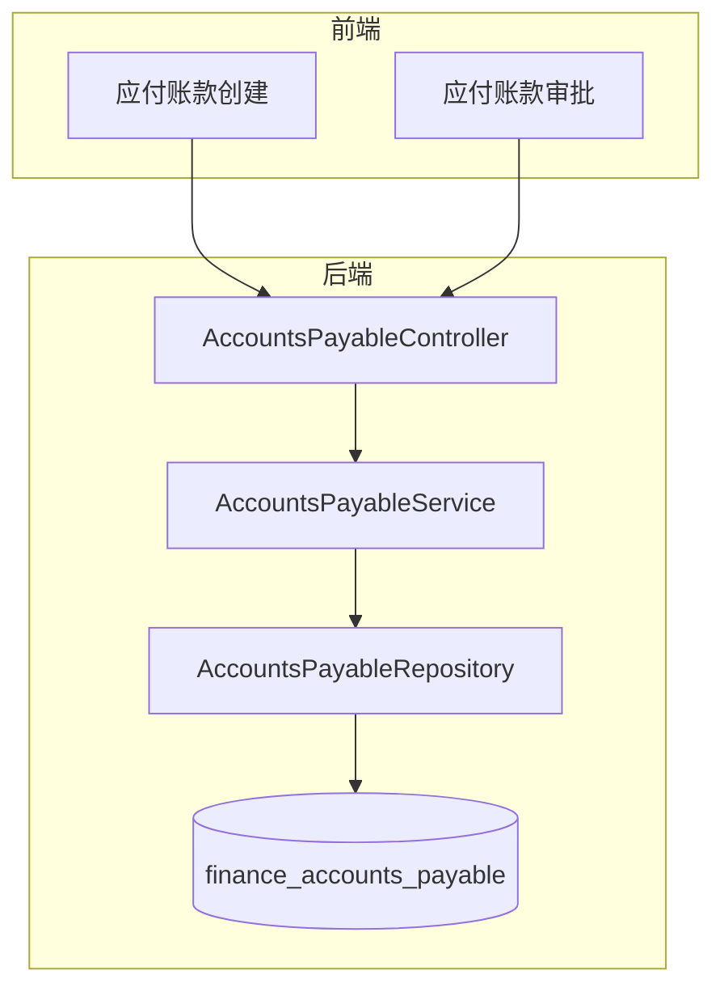
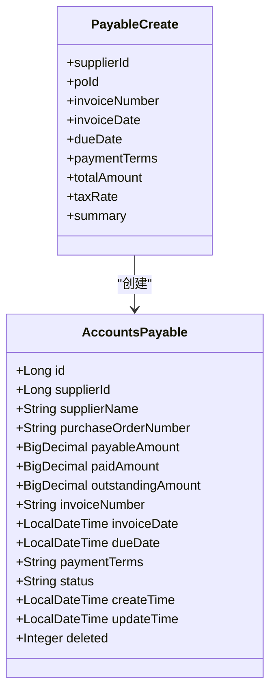
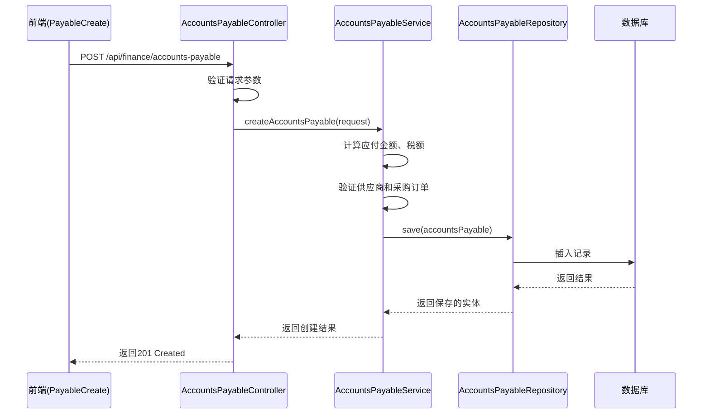
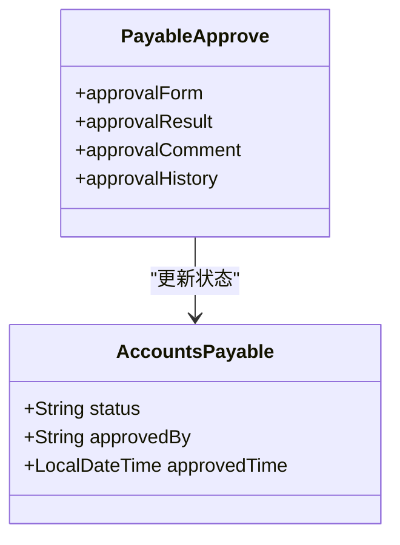
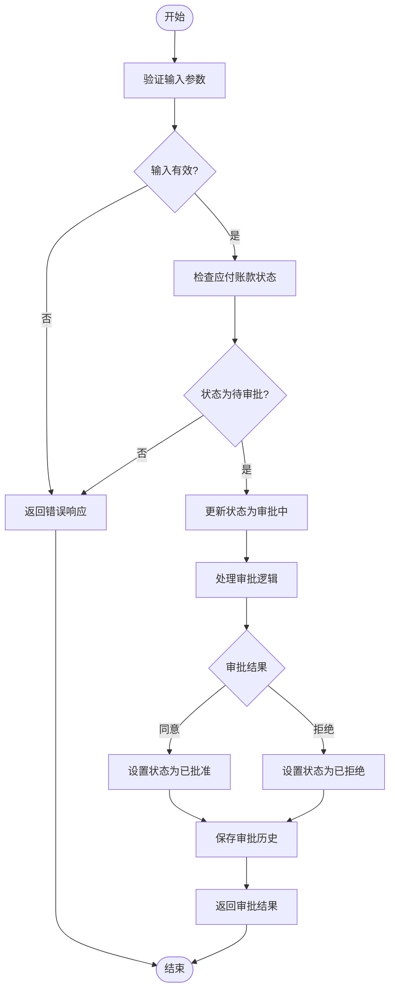
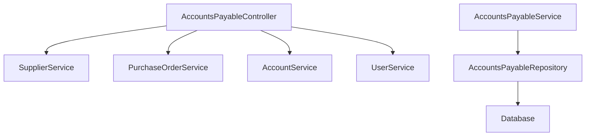

# 应付账款API

<cite>
**本文档引用的文件**   
- [AccountsPayableController.java](file://08-backend/src/main/java/com/enterprise/brain/modules/finance/controller/AccountsPayableController.java)
- [AccountsPayable.java](file://08-backend/src/main/java/com/enterprise/brain/modules/finance/entity/AccountsPayable.java)
- [PayableCreate.vue](file://07-frontend/src/pages/finance/accounts-payable/PayableCreate.vue)
- [PayableApprove.vue](file://07-frontend/src/pages/finance/accounts-payable/PayableApprove.vue)
- [finance.js](file://07-frontend/src/router/modules/finance.js)
- [finance-api.js](file://07-frontend/src/services/api/finance-api.js)
</cite>

## 目录
1. [介绍](#介绍)
2. [核心组件](#核心组件)
3. [架构概述](#架构概述)
4. [详细组件分析](#详细组件分析)
5. [依赖分析](#依赖分析)
6. [性能考虑](#性能考虑)
7. [故障排除指南](#故障排除指南)
8. [结论](#结论)

## 介绍
本文档详细描述了应付账款管理API的功能，重点涵盖供应商应付款的创建、付款、对账和余额管理。文档详细说明了`AccountsPayableController`中创建应付单据的接口，包括供应商ID、采购订单号、应付金额、币种、发票日期、付款到期日等字段的定义与约束。同时记录了付款登记接口的参数，如付款方式、银行账户、付款日期以及与应付单据的核销关系。提供了应付账款分页查询的参数说明（如按供应商、按状态、按日期范围筛选）和响应数据结构。解释了应付账款余额的计算逻辑和账龄分析功能。文档包含应付流程的时序图，并说明处理预付款、部分付款等复杂场景的API调用方式。

## 核心组件

应付账款管理API的核心组件包括应付账款控制器、实体类、服务实现和前端页面。控制器负责处理HTTP请求，实体类定义了应付账款的数据结构，服务实现包含了业务逻辑，前端页面提供了用户交互界面。

**本节来源**
- [AccountsPayableController.java](file://08-backend/src/main/java/com/enterprise/brain/modules/finance/controller/AccountsPayableController.java#L1-L22)
- [AccountsPayable.java](file://08-backend/src/main/java/com/enterprise/brain/modules/finance/entity/AccountsPayable.java#L1-L81)
- [PayableCreate.vue](file://07-frontend/src/pages/finance/accounts-payable/PayableCreate.vue#L1-L326)
- [PayableApprove.vue](file://07-frontend/src/pages/finance/accounts-payable/PayableApprove.vue#L1-L296)

## 架构概述

应付账款管理API采用典型的分层架构，包括前端页面、API服务、业务逻辑层和数据访问层。前端页面通过API服务与后端交互，业务逻辑层处理具体的业务规则，数据访问层负责与数据库交互。

**图表来源**
- [AccountsPayableController.java](file://08-backend/src/main/java/com/enterprise/brain/modules/finance/controller/AccountsPayableController.java#L1-L22)
- [AccountsPayable.java](file://08-backend/src/main/java/com/enterprise/brain/modules/finance/entity/AccountsPayable.java#L1-L81)
- [PayableCreate.vue](file://07-frontend/src/pages/finance/accounts-payable/PayableCreate.vue#L1-L326)
- [PayableApprove.vue](file://07-frontend/src/pages/finance/accounts-payable/PayableApprove.vue#L1-L296)

## 详细组件分析

### 应付账款创建分析
应付账款创建功能允许用户创建新的应付账款记录。用户需要提供供应商信息、采购订单号、发票信息、金额和付款条件等关键信息。

#### 对象导向组件：

**图表来源**
- [AccountsPayable.java](file://08-backend/src/main/java/com/enterprise/brain/modules/finance/entity/AccountsPayable.java#L1-L81)
- [PayableCreate.vue](file://07-frontend/src/pages/finance/accounts-payable/PayableCreate.vue#L1-L326)

#### API/服务组件：

**图表来源**
- [AccountsPayableController.java](file://08-backend/src/main/java/com/enterprise/brain/modules/finance/controller/AccountsPayableController.java#L1-L22)
- [AccountsPayableServiceImpl.java](file://08-backend/src/main/java/com/enterprise/brain/modules/finance/service/impl/AccountsPayableServiceImpl.java#L1-L17)
- [AccountsPayableMapper.java](file://08-backend/src/main/java/com/enterprise/brain/modules/finance/mapper/AccountsPayableMapper.java#L1-L15)
- [PayableCreate.vue](file://07-frontend/src/pages/finance/accounts-payable/PayableCreate.vue#L1-L326)

### 应付账款审批分析
应付账款审批功能允许用户对创建的应付账款进行审批。审批流程包括查看应付账款详情、提交审批意见和更新审批状态。

#### 对象导向组件：

**图表来源**
- [AccountsPayable.java](file://08-backend/src/main/java/com/enterprise/brain/modules/finance/entity/AccountsPayable.java#L1-L81)
- [PayableApprove.vue](file://07-frontend/src/pages/finance/accounts-payable/PayableApprove.vue#L1-L296)

#### 复杂逻辑组件：

**图表来源**
- [PayableApprove.vue](file://07-frontend/src/pages/finance/accounts-payable/PayableApprove.vue#L1-L296)
- [AccountsPayableController.java](file://08-backend/src/main/java/com/enterprise/brain/modules/finance/controller/AccountsPayableController.java#L1-L22)

## 依赖分析

应付账款管理API依赖于多个其他模块和服务，包括供应商管理、采购订单管理、财务科目管理和用户权限管理。

**图表来源**
- [AccountsPayableController.java](file://08-backend/src/main/java/com/enterprise/brain/modules/finance/controller/AccountsPayableController.java#L1-L22)
- [AccountsPayableServiceImpl.java](file://08-backend/src/main/java/com/enterprise/brain/modules/finance/service/impl/AccountsPayableServiceImpl.java#L1-L17)
- [finance.js](file://07-frontend/src/router/modules/finance.js#L1-L437)

**本节来源**
- [AccountsPayableController.java](file://08-backend/src/main/java/com/enterprise/brain/modules/finance/controller/AccountsPayableController.java#L1-L22)
- [AccountsPayableServiceImpl.java](file://08-backend/src/main/java/com/enterprise/brain/modules/finance/service/impl/AccountsPayableServiceImpl.java#L1-L17)
- [finance.js](file://07-frontend/src/router/modules/finance.js#L1-L437)

## 性能考虑

应付账款管理API在设计时考虑了性能优化，包括数据库索引、缓存机制和分页查询。对于大量数据的查询，建议使用分页参数来限制返回结果的数量，避免一次性加载过多数据导致性能问题。

## 故障排除指南

当应付账款管理API出现问题时，可以按照以下步骤进行排查：
1. 检查请求参数是否正确，特别是必填字段是否缺失
2. 验证供应商和采购订单是否存在
3. 检查用户权限是否足够执行相关操作
4. 查看服务器日志以获取详细的错误信息
5. 确认数据库连接是否正常

**本节来源**
- [AccountsPayableController.java](file://08-backend/src/main/java/com/enterprise/brain/modules/finance/controller/AccountsPayableController.java#L1-L22)
- [PayableCreate.vue](file://07-frontend/src/pages/finance/accounts-payable/PayableCreate.vue#L1-L326)
- [PayableApprove.vue](file://07-frontend/src/pages/finance/accounts-payable/PayableApprove.vue#L1-L296)

## 结论

应付账款管理API提供了一套完整的应付账款管理功能，包括应付账款的创建、审批、付款和余额管理。通过清晰的API设计和合理的业务逻辑，系统能够有效地管理企业的应付账款，确保财务数据的准确性和完整性。未来可以考虑增加更多的自动化功能，如自动对账、智能提醒等，以进一步提高财务管理的效率。