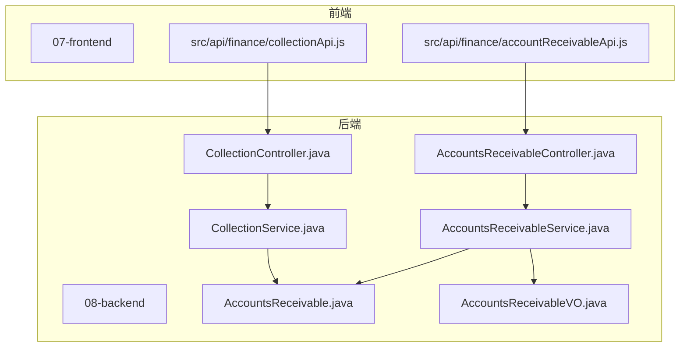
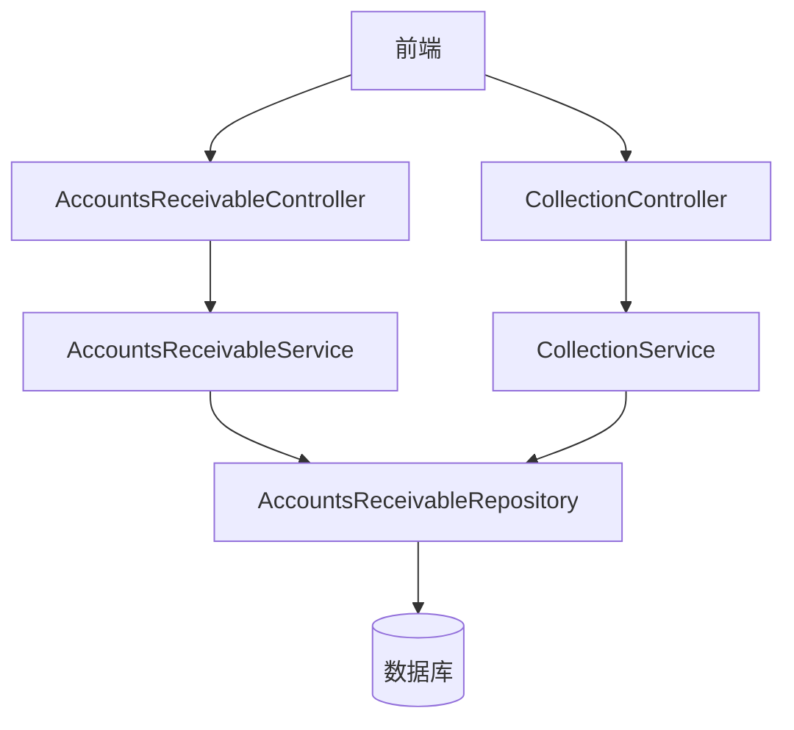
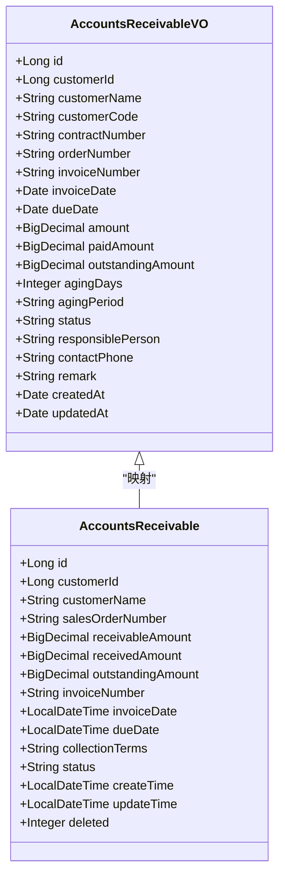
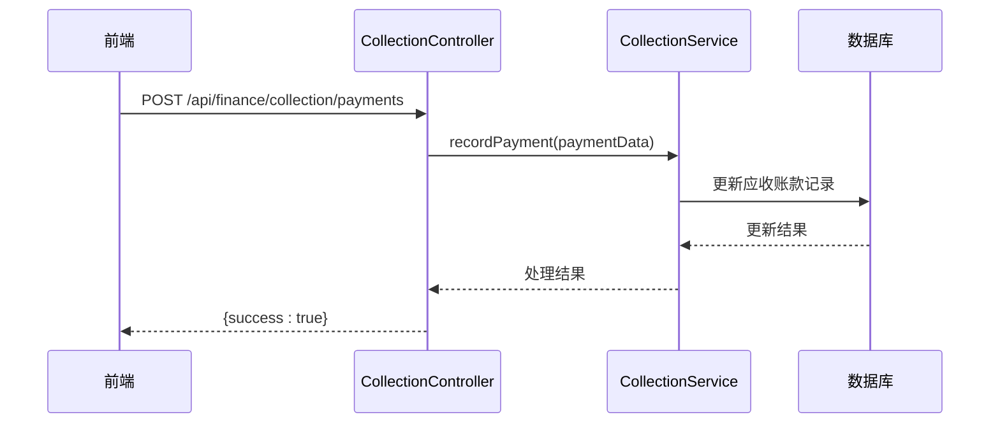
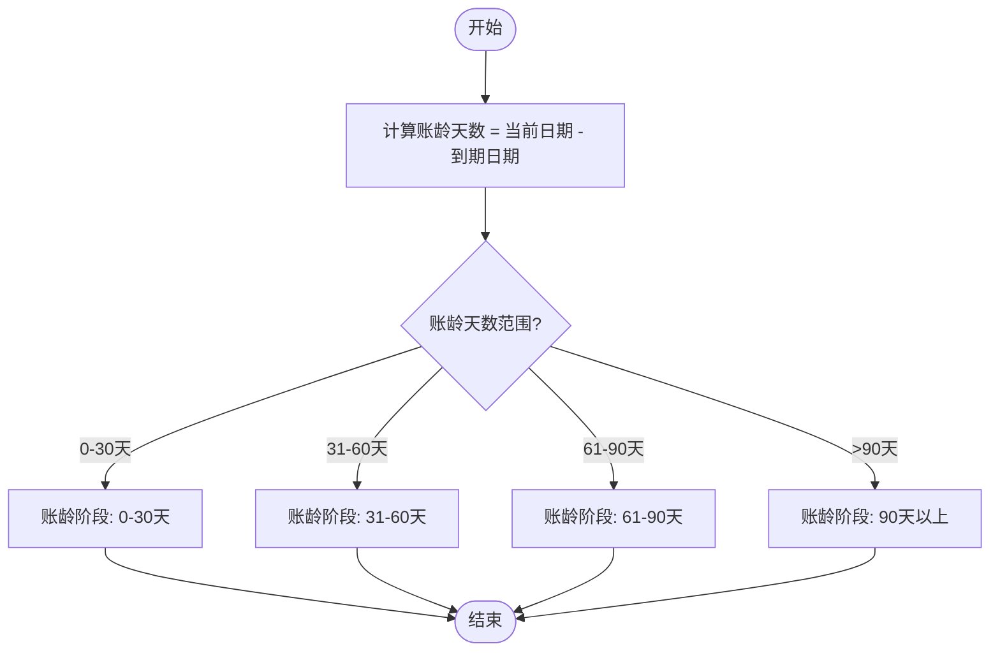
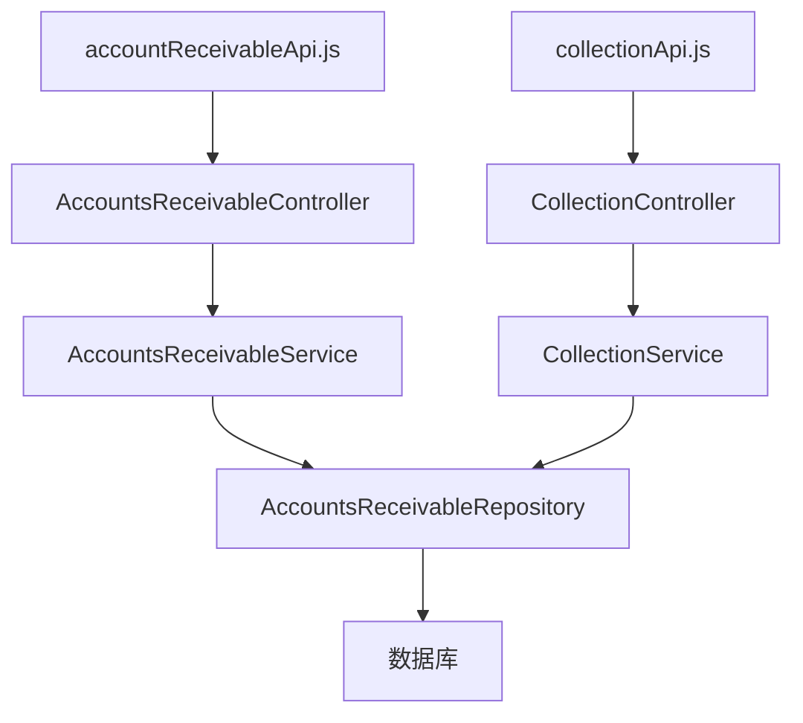

# 应收账款API

<cite>
**本文档引用的文件**
- [accountReceivableApi.js](file://07-frontend/src/api/finance/accountReceivableApi.js)
- [collectionApi.js](file://07-frontend/src/api/finance/collectionApi.js)
- [AccountsReceivableController.java](file://08-backend/src/main/java/com/enterprise/brain/modules/finance/controller/AccountsReceivableController.java)
- [CollectionController.java](file://08-backend/src/main/java/com/enterprise/brain/modules/finance/controller/CollectionController.java)
- [AccountsReceivableService.java](file://08-backend/src/main/java/com/enterprise/brain/modules/finance/service/AccountsReceivableService.java)
- [CollectionService.java](file://08-backend/src/main/java/com/enterprise/brain/modules/finance/service/CollectionService.java)
- [AccountsReceivableVO.java](file://08-backend/src/main/java/com/enterprise/brain/modules/finance/vo/AccountsReceivableVO.java)
- [AccountsReceivable.java](file://08-backend/src/main/java/com/enterprise/brain/modules/finance/entity/AccountsReceivable.java)
</cite>

## 目录
1. [介绍](#介绍)
2. [项目结构](#项目结构)
3. [核心组件](#核心组件)
4. [架构概述](#架构概述)
5. [详细组件分析](#详细组件分析)
6. [依赖分析](#依赖分析)
7. [性能考虑](#性能考虑)
8. [故障排除指南](#故障排除指南)
9. [结论](#结论)
10. [附录](#附录)（如有必要）

## 介绍
本文档详细描述了应收账款管理API的功能，涵盖应收账款创建、收款登记、对账、余额查询和账龄分析等核心功能。文档重点解析了`AccountsReceivableController`中创建应收单据的接口，包括客户ID、合同号、应收金额、币种、开票日期、到期日等关键字段。同时深入分析了`CollectionController`中的收款接口，说明了收款方式（现金、银行转账、票据）、收款账户、核销规则（按单核销、按账龄核销）的实现逻辑。提供了应收单据与收款记录关联的JSON示例，并记录了分页查询接口支持的筛选条件（如客户、状态、日期范围）和聚合统计接口（如未收余额、逾期金额）。此外，文档还解释了账龄分析的计算逻辑和返回的数据结构，包含收款核销的业务流程图和常见问题（如部分核销、超额收款）的处理方案。

## 项目结构
本项目采用前后端分离架构，前端位于`07-frontend`目录，后端位于`08-backend`目录。前端使用Vue.js框架，API调用封装在`src/api/finance/`目录下。后端采用Spring Boot框架，财务模块位于`modules/finance`包中，包含控制器、服务、实体和VO等组件。



**图示来源**
- [accountReceivableApi.js](file://07-frontend/src/api/finance/accountReceivableApi.js)
- [collectionApi.js](file://07-frontend/src/api/finance/collectionApi.js)
- [AccountsReceivableController.java](file://08-backend/src/main/java/com/enterprise/brain/modules/finance/controller/AccountsReceivableController.java)
- [CollectionController.java](file://08-backend/src/main/java/com/enterprise/brain/modules/finance/controller/CollectionController.java)

**本节来源**
- [07-frontend/src/api/finance/accountReceivableApi.js](file://07-frontend/src/api/finance/accountReceivableApi.js)
- [08-backend/src/main/java/com/enterprise/brain/modules/finance/controller/AccountsReceivableController.java](file://08-backend/src/main/java/com/enterprise/brain/modules/finance/controller/AccountsReceivableController.java)

## 核心组件
应收账款管理API的核心组件包括`AccountsReceivableController`和`CollectionController`，分别负责应收账款的创建与管理以及收款的登记与核销。`AccountsReceivableVO`和`AccountsReceivable`类定义了应收账款的数据结构，而`AccountsReceivableService`和`CollectionService`接口则封装了业务逻辑。

**本节来源**
- [AccountsReceivableController.java](file://08-backend/src/main/java/com/enterprise/brain/modules/finance/controller/AccountsReceivableController.java)
- [CollectionController.java](file://08-backend/src/main/java/com/enterprise/brain/modules/finance/controller/CollectionController.java)
- [AccountsReceivableVO.java](file://08-backend/src/main/java/com/enterprise/brain/modules/finance/vo/AccountsReceivableVO.java)
- [AccountsReceivable.java](file://08-backend/src/main/java/com/enterprise/brain/modules/finance/entity/AccountsReceivable.java)

## 架构概述
系统采用典型的三层架构：表现层（前端）、业务逻辑层（后端服务）和数据访问层（数据库）。前端通过API调用后端控制器，控制器调用服务层处理业务逻辑，服务层与数据库交互完成数据持久化。



**图示来源**
- [AccountsReceivableController.java](file://08-backend/src/main/java/com/enterprise/brain/modules/finance/controller/AccountsReceivableController.java)
- [CollectionController.java](file://08-backend/src/main/java/com/enterprise/brain/modules/finance/controller/CollectionController.java)
- [AccountsReceivableService.java](file://08-backend/src/main/java/com/enterprise/brain/modules/finance/service/AccountsReceivableService.java)
- [CollectionService.java](file://08-backend/src/main/java/com/enterprise/brain/modules/finance/service/CollectionService.java)

## 详细组件分析
### 应收账款创建分析
`AccountsReceivableController`提供了创建和管理应收账款的RESTful API。关键字段包括客户ID、合同号、应收金额、币种、开票日期和到期日。创建接口通过`createPaymentReminder`方法实现，接收包含这些字段的JSON数据。



**图示来源**
- [AccountsReceivableVO.java](file://08-backend/src/main/java/com/enterprise/brain/modules/finance/vo/AccountsReceivableVO.java)
- [AccountsReceivable.java](file://08-backend/src/main/java/com/enterprise/brain/modules/finance/entity/AccountsReceivable.java)

**本节来源**
- [AccountsReceivableController.java](file://08-backend/src/main/java/com/enterprise/brain/modules/finance/controller/AccountsReceivableController.java)
- [AccountsReceivableService.java](file://08-backend/src/main/java/com/enterprise/brain/modules/finance/service/AccountsReceivableService.java)

### 收款登记分析
`CollectionController`负责处理收款相关的操作，包括创建回款计划、记录回款和核销。收款方式支持现金、银行转账和票据，核销规则支持按单核销和按账龄核销。



**图示来源**
- [CollectionController.java](file://08-backend/src/main/java/com/enterprise/brain/modules/finance/controller/CollectionController.java)
- [CollectionService.java](file://08-backend/src/main/java/com/enterprise/brain/modules/finance/service/CollectionService.java)

**本节来源**
- [CollectionController.java](file://08-backend/src/main/java/com/enterprise/brain/modules/finance/controller/CollectionController.java)
- [CollectionService.java](file://08-backend/src/main/java/com/enterprise/brain/modules/finance/service/CollectionService.java)

### 账龄分析分析
账龄分析功能通过`getAgingAnalysis`接口实现，计算逻辑基于当前日期与到期日的差值，将应收账款分为不同的账龄阶段（如0-30天、31-60天等）。



**图示来源**
- [AccountsReceivableController.java](file://08-backend/src/main/java/com/enterprise/brain/modules/finance/controller/AccountsReceivableController.java)
- [AccountsReceivableService.java](file://08-backend/src/main/java/com/enterprise/brain/modules/finance/service/AccountsReceivableService.java)

**本节来源**
- [AccountsReceivableController.java](file://08-backend/src/main/java/com/enterprise/brain/modules/finance/controller/AccountsReceivableController.java)
- [AccountsReceivableService.java](file://08-backend/src/main/java/com/enterprise/brain/modules/finance/service/AccountsReceivableService.java)

## 依赖分析
系统各组件之间的依赖关系清晰，前端依赖后端API，后端控制器依赖服务层，服务层依赖数据访问层。这种分层架构确保了代码的可维护性和可扩展性。



**图示来源**
- [accountReceivableApi.js](file://07-frontend/src/api/finance/accountReceivableApi.js)
- [collectionApi.js](file://07-frontend/src/api/finance/collectionApi.js)
- [AccountsReceivableController.java](file://08-backend/src/main/java/com/enterprise/brain/modules/finance/controller/AccountsReceivableController.java)
- [CollectionController.java](file://08-backend/src/main/java/com/enterprise/brain/modules/finance/controller/CollectionController.java)

**本节来源**
- [accountReceivableApi.js](file://07-frontend/src/api/finance/accountReceivableApi.js)
- [collectionApi.js](file://07-frontend/src/api/finance/collectionApi.js)
- [AccountsReceivableController.java](file://08-backend/src/main/java/com/enterprise/brain/modules/finance/controller/AccountsReceivableController.java)
- [CollectionController.java](file://08-backend/src/main/java/com/enterprise/brain/modules/finance/controller/CollectionController.java)

## 性能考虑
为确保系统性能，建议对频繁查询的字段（如客户ID、状态、日期范围）建立数据库索引。分页查询接口应限制每页返回的记录数，避免一次性加载过多数据。账龄分析等复杂计算应在后台异步执行，避免阻塞主线程。

## 故障排除指南
常见问题包括部分核销和超额收款。部分核销时，系统会更新已收金额和未收金额，保持应收总额不变。超额收款时，系统会将超出部分作为预收款处理，可用于抵扣未来的应收账款。

**本节来源**
- [AccountsReceivableService.java](file://08-backend/src/main/java/com/enterprise/brain/modules/finance/service/AccountsReceivableService.java)
- [CollectionService.java](file://08-backend/src/main/java/com/enterprise/brain/modules/finance/service/CollectionService.java)

## 结论
本文档全面介绍了应收账款管理API的设计与实现，涵盖了从创建应收单据到收款核销的完整业务流程。通过清晰的架构设计和详细的接口说明，为开发者提供了充分的技术参考。

## 附录
### 应收账款创建请求示例
```json
{
  "customerId": 1001,
  "contractNumber": "CT2024001",
  "amount": 50000.00,
  "currency": "CNY",
  "invoiceDate": "2024-01-15",
  "dueDate": "2024-02-15"
}
```

### 收款记录请求示例
```json
{
  "collectionMethod": "BANK_TRANSFER",
  "accountId": 2001,
  "amount": 30000.00,
  "writeOffRule": "BY_INVOICE",
  "invoiceIds": [10001]
}
```