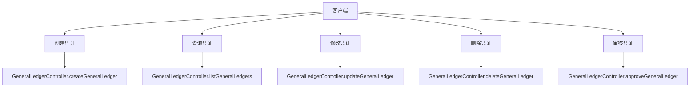
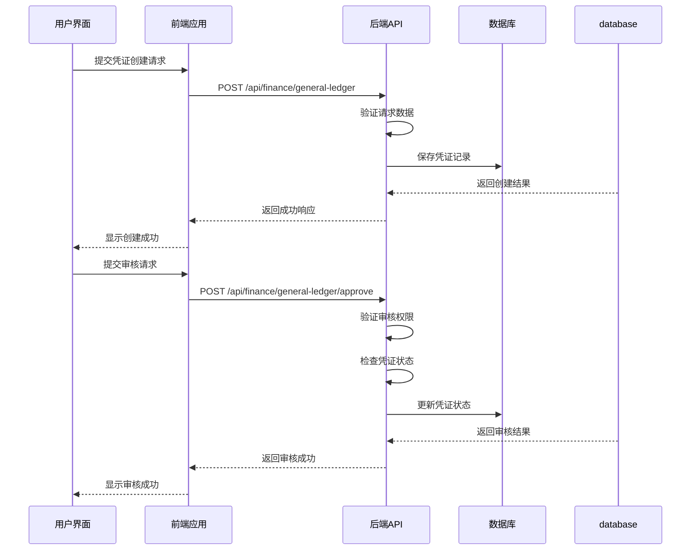
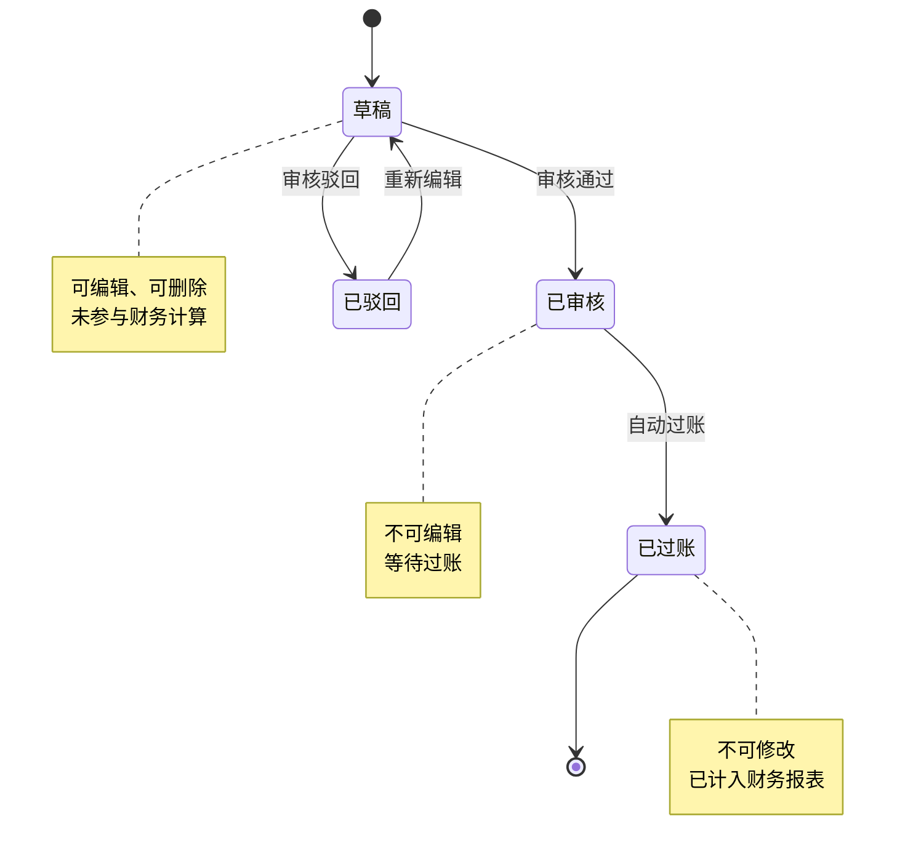

# 总账管理API

<cite>
**本文档引用文件**  
- [GeneralLedgerController.java](file://08-backend/src/main/java/com/enterprise/brain/modules/finance/controller/GeneralLedgerController.java)
- [GeneralLedgerCreateRequest.java](file://08-backend/src/main/java/com/enterprise/brain/modules/finance/dto/request/GeneralLedgerCreateRequest.java)
- [GeneralLedgerUpdateRequest.java](file://08-backend/src/main/java/com/enterprise/brain/modules/finance/dto/request/GeneralLedgerUpdateRequest.java)
- [GeneralLedgerQueryRequest.java](file://08-backend/src/main/java/com/enterprise/brain/modules/finance/dto/request/GeneralLedgerQueryRequest.java)
- [GeneralLedgerResponse.java](file://08-backend/src/main/java/com/enterprise/brain/modules/finance/dto/response/GeneralLedgerResponse.java)
- [GeneralLedgerListResponse.java](file://08-backend/src/main/java/com/enterprise/brain/modules/finance/dto/response/GeneralLedgerListResponse.java)
- [VoucherCreateRequest.java](file://08-backend/src/main/java/com/enterprise/brain/modules/finance/dto/request/VoucherCreateRequest.java)
- [VoucherResponse.java](file://08-backend/src/main/java/com/enterprise/brain/modules/finance/dto/response/VoucherResponse.java)
- [VoucherController.java](file://08-backend/src/main/java/com/enterprise/brain/modules/finance/controller/VoucherController.java)
- [error-codes.js](file://07-frontend/src/utils/error-handling/error-codes.js)
- [VoucherEntry.vue](file://07-frontend/src/pages/finance/general-ledger/VoucherEntry.vue)
- [VoucherReview.vue](file://07-frontend/src/pages/finance/general-ledger/VoucherReview.vue)
</cite>

## 目录
1. [总账管理API](#总账管理api)
2. [核心接口说明](#核心接口说明)
3. [请求体结构](#请求体结构)
4. [响应对象结构](#响应对象结构)
5. [凭证JSON示例](#凭证json示例)
6. [分页查询接口](#分页查询接口)
7. [金额精度与多币种支持](#金额精度与多币种支持)
8. [接口调用时序图](#接口调用时序图)
9. [凭证状态转换图](#凭证状态转换图)
10. [凭证审核失败错误码](#凭证审核失败错误码)

## 核心接口说明

总账管理API提供了凭证的创建、查询、审核、修改和删除等核心功能。这些接口通过`GeneralLedgerController`类实现，位于`/api/finance/general-ledger`路径下。



**接口来源**
- [GeneralLedgerController.java](file://08-backend/src/main/java/com/enterprise/brain/modules/finance/controller/GeneralLedgerController.java#L27-L58)

## 请求体结构

`GeneralLedgerCreateRequest`定义了创建凭证时的请求体结构，包含以下字段：

| 字段 | 类型 | 是否必填 | 描述 | 约束 |
|------|------|----------|------|------|
| voucherNumber | String | 是 | 凭证编号 | 不能为空 |
| accountCode | String | 是 | 会计科目代码 | 不能为空 |
| accountName | String | 是 | 会计科目名称 | 不能为空 |
| debitAmount | BigDecimal | 否 | 借方金额 | 支持小数点后6位 |
| creditAmount | BigDecimal | 否 | 贷方金额 | 支持小数点后6位 |
| balance | BigDecimal | 否 | 余额 | 支持小数点后6位 |
| summary | String | 否 | 摘要 | 最大长度255字符 |
| businessDate | LocalDateTime | 是 | 业务日期 | 不能为空 |
| voucherType | String | 否 | 凭证类型 | 如：记、收、付 |
| accountingPeriod | String | 否 | 会计期间 | 格式：YYYY-MM |

**请求体来源**
- [GeneralLedgerCreateRequest.java](file://08-backend/src/main/java/com/enterprise/brain/modules/finance/dto/request/GeneralLedgerCreateRequest.java#L19-L52)

## 响应对象结构

`GeneralLedgerResponse`定义了凭证的响应对象结构，包含以下字段：

| 字段 | 类型 | 描述 |
|------|------|------|
| id | Long | 主键ID |
| voucherNumber | String | 凭证编号 |
| accountCode | String | 会计科目代码 |
| accountName | String | 会计科目名称 |
| debitAmount | BigDecimal | 借方金额 |
| creditAmount | BigDecimal | 贷方金额 |
| balance | BigDecimal | 余额 |
| summary | String | 摘要 |
| businessDate | LocalDateTime | 业务日期 |
| postingDate | LocalDateTime | 记账日期 |
| voucherType | String | 凭证类型 |
| accountingPeriod | String | 会计期间 |
| createTime | LocalDateTime | 创建时间 |
| updateTime | LocalDateTime | 更新时间 |

凭证状态流转机制：
- **草稿**：创建后初始状态，可编辑
- **已审核**：通过审核后状态，不可编辑
- **已过账**：审核通过后自动过账，进入财务报表

**响应对象来源**
- [GeneralLedgerResponse.java](file://08-backend/src/main/java/com/enterprise/brain/modules/finance/dto/response/GeneralLedgerResponse.java#L17-L58)

## 凭证JSON示例

以下是一个包含多行分录的凭证JSON示例：

```json
{
  "voucherNumber": "JZ202401001",
  "voucherDate": "2024-01-15T00:00:00",
  "voucherType": "记",
  "summary": "1月销售业务",
  "attachmentCount": 2,
  "items": [
    {
      "accountCode": "1001",
      "accountName": "库存现金",
      "debitAmount": 5000.000000,
      "creditAmount": 0.000000,
      "summary": "销售收入",
      "auxiliaryItems": "客户:张三"
    },
    {
      "accountCode": "6001",
      "accountName": "主营业务收入",
      "debitAmount": 0.000000,
      "creditAmount": 5000.000000,
      "summary": "销售收入",
      "auxiliaryItems": "项目:项目A"
    },
    {
      "accountCode": "2221",
      "accountName": "应交税费",
      "debitAmount": 0.000000,
      "creditAmount": 650.000000,
      "summary": "销项税额",
      "auxiliaryItems": "税率:13%"
    }
  ]
}
```

**示例来源**
- [VoucherCreateRequest.java](file://08-backend/src/main/java/com/enterprise/brain/modules/finance/dto/request/VoucherCreateRequest.java#L38-L65)
- [VoucherResponse.java](file://08-backend/src/main/java/com/enterprise/brain/modules/finance/dto/response/VoucherResponse.java#L43-L73)

## 分页查询接口

分页查询接口支持多种查询条件和排序规则：

**查询参数**

| 参数 | 类型 | 描述 | 示例 |
|------|------|------|------|
| voucherNumber | String | 凭证编号 | JZ202401001 |
| accountCode | String | 会计科目代码 | 1001 |
| accountName | String | 会计科目名称 | 库存现金 |
| voucherType | String | 凭证类型 | 记、收、付 |
| accountingPeriod | String | 会计期间 | 2024-01 |
| current | Integer | 当前页码 | 1 |
| size | Integer | 每页大小 | 20 |

**排序规则**
- 默认按创建时间降序排列
- 支持按凭证编号、会计期间、业务日期等字段排序
- 排序方向：asc（升序）、desc（降序）

**查询接口来源**
- [GeneralLedgerQueryRequest.java](file://08-backend/src/main/java/com/enterprise/brain/modules/finance/dto/request/GeneralLedgerQueryRequest.java#L15-L29)
- [GeneralLedgerController.java](file://08-backend/src/main/java/com/enterprise/brain/modules/finance/controller/GeneralLedgerController.java#L45-L51)

## 金额精度与多币种支持

系统对金额处理有严格的精度要求，并支持多币种核算：

**金额精度处理**
- 支持小数点后6位精度
- 使用`BigDecimal`类型确保计算准确性
- 显示时保留2位小数
- 存储时保留6位小数

**多币种核算支持**
- 支持多种货币：CNY、USD、EUR等
- 汇率管理：实时汇率更新机制
- 折算规则：支持多种折算方法
- 报表展示：支持按币种汇总

**精度处理来源**
- [GeneralLedgerCreateRequest.java](file://08-backend/src/main/java/com/enterprise/brain/modules/finance/dto/request/GeneralLedgerCreateRequest.java#L31-L35)
- [VoucherCreateRequest.java](file://08-backend/src/main/java/com/enterprise/brain/modules/finance/dto/request/VoucherCreateRequest.java#L53-L57)

## 接口调用时序图

以下时序图展示了凭证创建和审核的完整流程：



**时序图来源**
- [GeneralLedgerController.java](file://08-backend/src/main/java/com/enterprise/brain/modules/finance/controller/GeneralLedgerController.java)
- [VoucherEntry.vue](file://07-frontend/src/pages/finance/general-ledger/VoucherEntry.vue#L166-L183)

## 凭证状态转换图

以下状态图展示了凭证的完整状态流转机制：



**状态转换来源**
- [VoucherReview.vue](file://07-frontend/src/pages/finance/general-ledger/VoucherReview.vue#L61-L77)
- [GeneralLedgerController.java](file://08-backend/src/main/java/com/enterprise/brain/modules/finance/controller/GeneralLedgerController.java)

## 凭证审核失败错误码

以下是凭证审核失败的常见错误码及解决方案：

| 错误码 | 错误名称 | HTTP状态码 | 描述 | 用户操作 | 解决方案 |
|--------|--------|----------|------|--------|--------|
| 3001 | DATA_VALIDATION_FAILED | 400 | 数据验证失败 | 检查输入数据的格式和完整性 | 确保所有必填字段已填写，金额格式正确 |
| 4002 | BUSINESS_OPERATION_NOT_ALLOWED | 403 | 操作不被允许 | 检查操作时机或联系管理员 | 确认当前用户有审核权限，凭证处于可审核状态 |
| 3003 | DATA_CONFLICT | 409 | 数据冲突 | 数据已被修改，请刷新后重试 | 刷新页面获取最新数据，重新提交审核 |
| 4000 | BUSINESS_RULE_VIOLATION | 400 | 违反业务规则 | 检查操作是否符合业务规则 | 确保借贷金额平衡，摘要完整 |
| 3000 | DATA_NOT_FOUND | 404 | 数据不存在 | 检查数据是否正确，或联系管理员确认 | 确认凭证ID正确，凭证未被删除 |

**错误码来源**
- [error-codes.js](file://07-frontend/src/utils/error-handling/error-codes.js#L174-L207)
- [GeneralLedgerController.java](file://08-backend/src/main/java/com/enterprise/brain/modules/finance/controller/GeneralLedgerController.java)