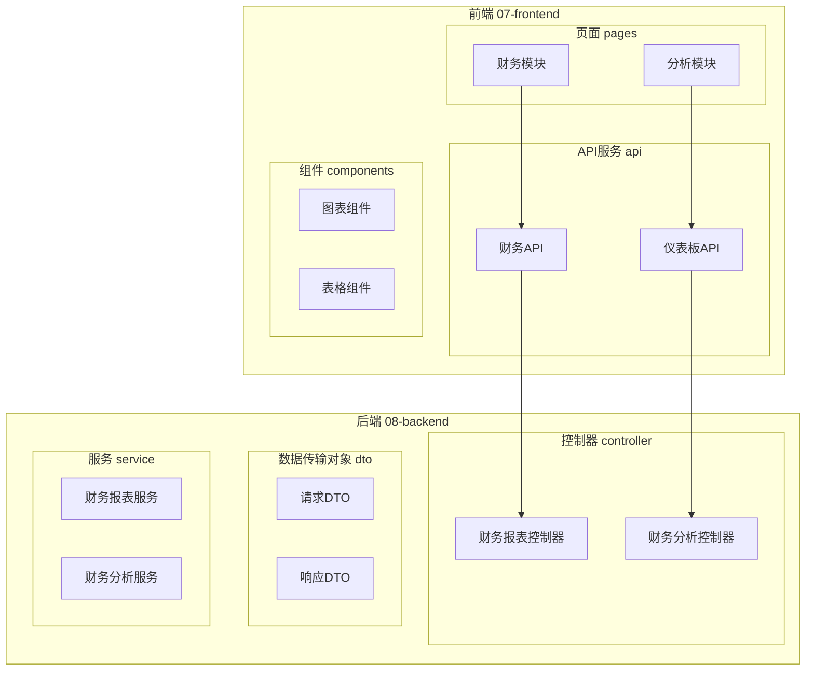
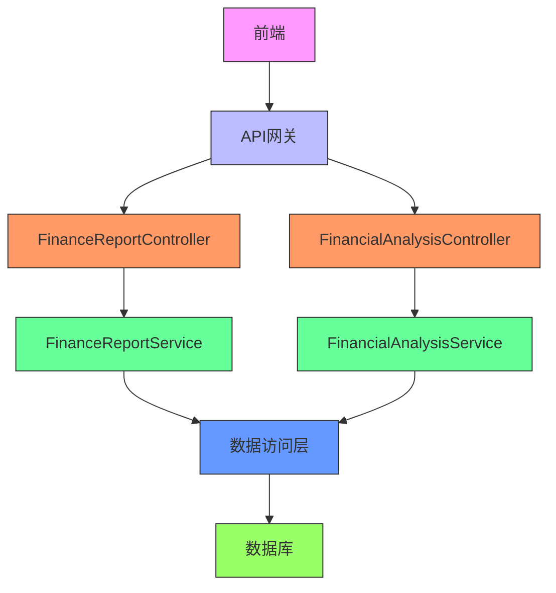
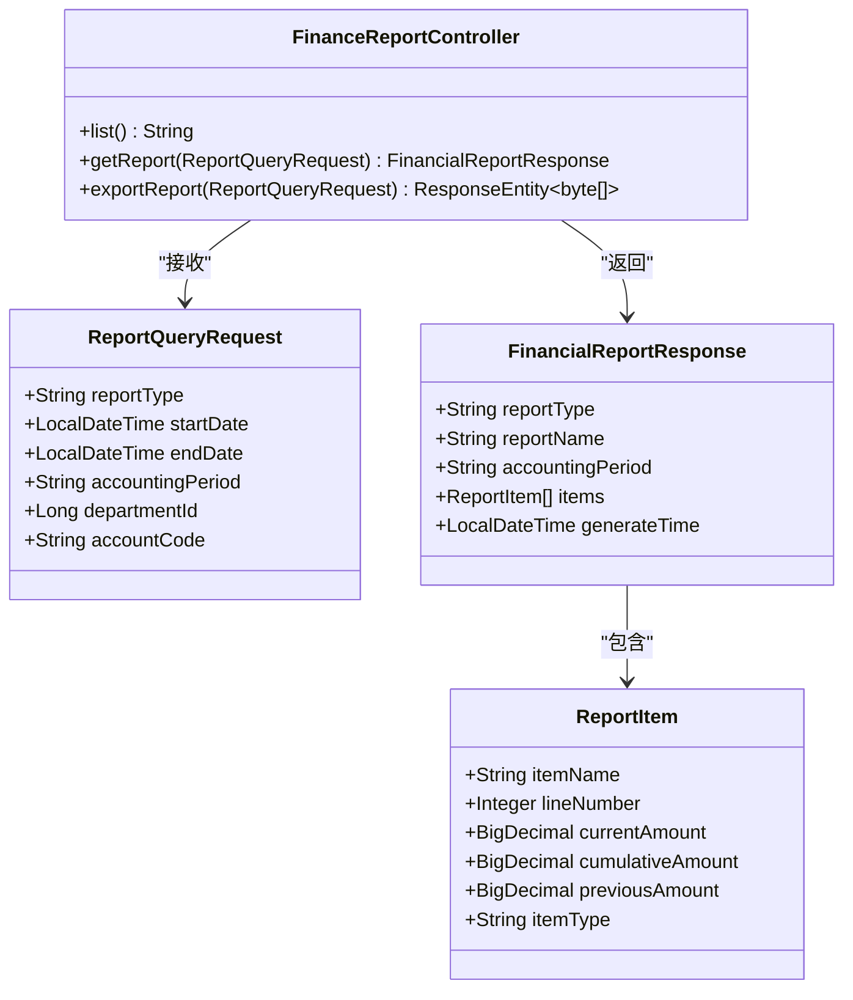
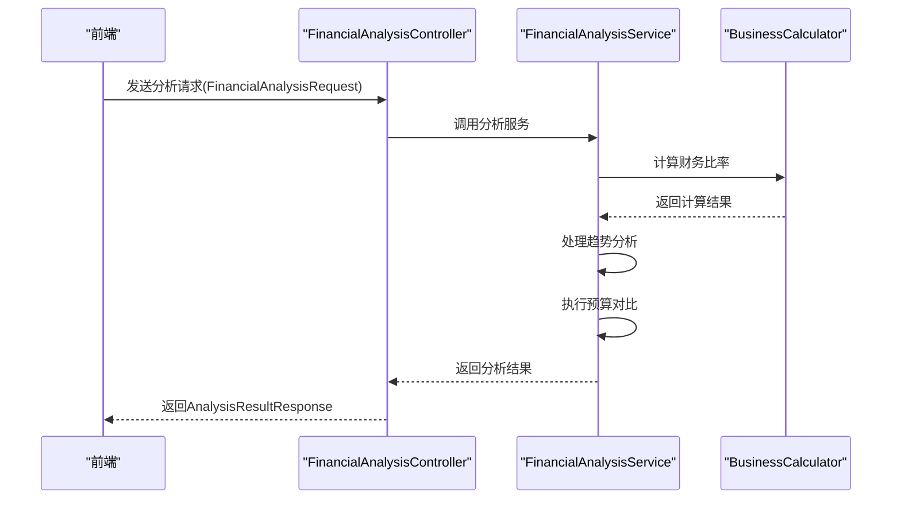
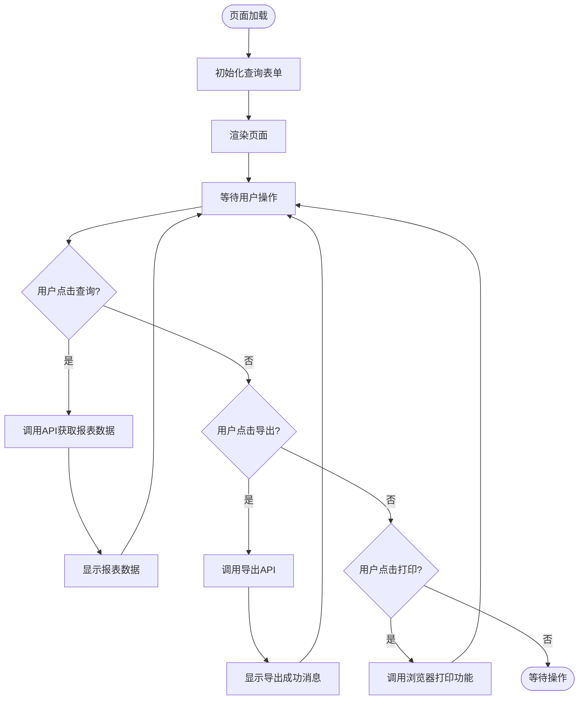
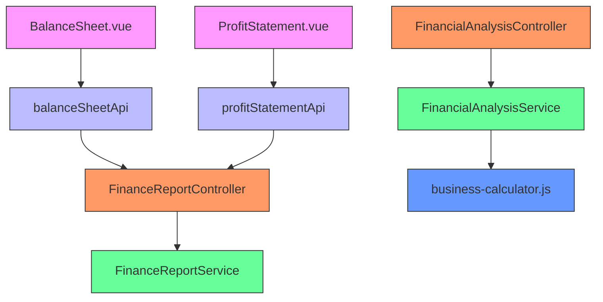
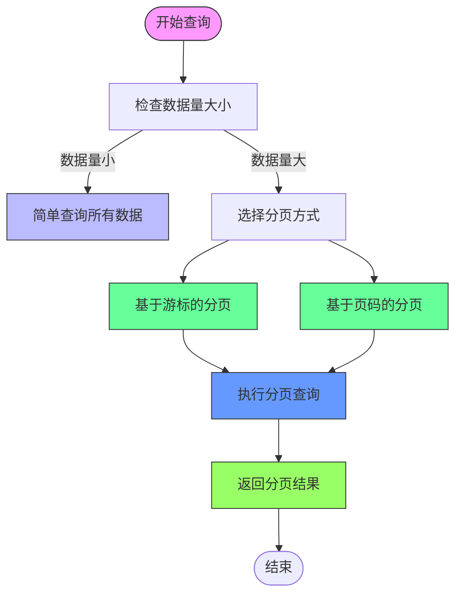

# 财务报表API

<cite>
**本文档引用的文件**   
- [FinanceReportController.java](file://08-backend/src/main/java/com/enterprise/brain/modules/finance/controller/FinanceReportController.java)
- [FinancialAnalysisController.java](file://08-backend/src/main/java/com/enterprise/brain/modules/finance/controller/FinancialAnalysisController.java)
- [ReportQueryRequest.java](file://08-backend/src/main/java/com/enterprise/brain/modules/finance/dto/request/ReportQueryRequest.java)
- [FinancialReportResponse.java](file://08-backend/src/main/java/com/enterprise/brain/modules/finance/dto/response/FinancialReportResponse.java)
- [FinancialAnalysisRequest.java](file://08-backend/src/main/java/com/enterprise/brain/modules/finance/dto/request/FinancialAnalysisRequest.java)
- [AnalysisResultResponse.java](file://08-backend/src/main/java/com/enterprise/brain/modules/finance/dto/response/AnalysisResultResponse.java)
- [balance-sheet-api.js](file://07-frontend/src/api/finance/index.js)
- [profit-statement-api.js](file://07-frontend/src/api/finance/index.js)
- [BalanceSheet.vue](file://07-frontend/src/pages/finance/general-ledger/BalanceSheet.vue)
- [ProfitStatement.vue](file://07-frontend/src/pages/finance/general-ledger/ProfitStatement.vue)
- [business-calculator.js](file://07-frontend/src/utils/business/business-calculator.js)
- [export-utils.js](file://07-frontend/src/services/utils/export-utils.js)
- [pagination.md](file://rules/no-sql-web-sdk/pagination.md)
</cite>

## 目录
1. [简介](#简介)
2. [项目结构](#项目结构)
3. [核心组件](#核心组件)
4. [架构概述](#架构概述)
5. [详细组件分析](#详细组件分析)
6. [依赖分析](#依赖分析)
7. [性能考虑](#性能考虑)
8. [故障排除指南](#故障排除指南)
9. [结论](#结论)

## 简介
本项目提供了一套完整的财务报表与分析API，支持资产负债表、利润表、现金流量表等标准财务报表的生成与查询。系统通过FinanceReportController提供各类报表的获取接口，支持会计期间、组织单元、报表格式（如PDF、Excel）等参数配置。FinancialAnalysisController提供了丰富的财务分析功能，包括比率分析（流动比率、资产负债率）、趋势分析和预算对比分析。系统还支持自定义报表查询，允许用户选择指标、设置维度筛选和数据聚合方式。前端页面通过Vue组件实现，后端服务采用Java Spring Boot框架，确保了系统的高性能和可扩展性。

## 项目结构
项目采用前后端分离架构，前端位于07-frontend目录，后端位于08-backend目录。前端使用Vue框架，包含财务相关的页面组件和API服务，后端使用Spring Boot框架，提供RESTful API服务。

**图表来源**
- [BalanceSheet.vue](file://07-frontend/src/pages/finance/general-ledger/BalanceSheet.vue)
- [FinanceReportController.java](file://08-backend/src/main/java/com/enterprise/brain/modules/finance/controller/FinanceReportController.java)

**本节来源**
- [BalanceSheet.vue](file://07-frontend/src/pages/finance/general-ledger/BalanceSheet.vue)
- [FinanceReportController.java](file://08-backend/src/main/java/com/enterprise/brain/modules/finance/controller/FinanceReportController.java)

## 核心组件
系统的核心组件包括财务报表控制器(FinanceReportController)和财务分析控制器(FinancialAnalysisController)，分别负责标准财务报表的生成与查询以及财务分析功能的实现。报表查询请求体(ReportQueryRequest)定义了查询参数结构，财务报表响应体(FinancialReportResponse)定义了返回数据格式。前端通过Vue组件实现用户界面，如资产负债表(BalanceSheet.vue)和利润表(ProfitStatement.vue)页面。

**本节来源**
- [FinanceReportController.java](file://08-backend/src/main/java/com/enterprise/brain/modules/finance/controller/FinanceReportController.java)
- [FinancialAnalysisController.java](file://08-backend/src/main/java/com/enterprise/brain/modules/finance/controller/FinancialAnalysisController.java)
- [ReportQueryRequest.java](file://08-backend/src/main/java/com/enterprise/brain/modules/finance/dto/request/ReportQueryRequest.java)
- [FinancialReportResponse.java](file://08-backend/src/main/java/com/enterprise/brain/modules/finance/dto/response/FinancialReportResponse.java)

## 架构概述
系统采用典型的三层架构：表现层、业务逻辑层和数据访问层。前端作为表现层，通过API调用后端服务；后端控制器作为业务逻辑入口，处理请求并调用服务层；服务层实现核心业务逻辑，与数据层交互。

**图表来源**
- [FinanceReportController.java](file://08-backend/src/main/java/com/enterprise/brain/modules/finance/controller/FinanceReportController.java)
- [FinancialAnalysisController.java](file://08-backend/src/main/java/com/enterprise/brain/modules/finance/controller/FinancialAnalysisController.java)

## 详细组件分析

### 财务报表控制器分析
财务报表控制器(FinanceReportController)是系统的核心组件之一，负责处理各类财务报表的请求。该控制器提供了标准财务报表的获取接口，支持资产负债表、利润表等多种报表类型。

#### 类图

**图表来源**
- [FinanceReportController.java](file://08-backend/src/main/java/com/enterprise/brain/modules/finance/controller/FinanceReportController.java)
- [ReportQueryRequest.java](file://08-backend/src/main/java/com/enterprise/brain/modules/finance/dto/request/ReportQueryRequest.java)
- [FinancialReportResponse.java](file://08-backend/src/main/java/com/enterprise/brain/modules/finance/dto/response/FinancialReportResponse.java)

### 财务分析控制器分析
财务分析控制器(FinancialAnalysisController)提供财务分析功能，包括比率分析、趋势分析和预算对比分析等。该控制器通过FinancialAnalysisRequest接收分析请求参数，并返回AnalysisResultResponse分析结果。

#### 序列图

**图表来源**
- [FinancialAnalysisController.java](file://08-backend/src/main/java/com/enterprise/brain/modules/finance/controller/FinancialAnalysisController.java)
- [FinancialAnalysisRequest.java](file://08-backend/src/main/java/com/enterprise/brain/modules/finance/dto/request/FinancialAnalysisRequest.java)
- [AnalysisResultResponse.java](file://08-backend/src/main/java/com/enterprise/brain/modules/finance/dto/response/AnalysisResultResponse.java)

### 前端报表页面分析
前端报表页面实现了用户友好的界面，允许用户查询和导出财务报表。以资产负债表页面为例，用户可以设置会计期间并获取报表数据。

#### 流程图

**图表来源**
- [BalanceSheet.vue](file://07-frontend/src/pages/finance/general-ledger/BalanceSheet.vue)
- [profit-statement-api.js](file://07-frontend/src/api/finance/index.js)

**本节来源**
- [BalanceSheet.vue](file://07-frontend/src/pages/finance/general-ledger/BalanceSheet.vue)
- [ProfitStatement.vue](file://07-frontend/src/pages/finance/general-ledger/ProfitStatement.vue)

## 依赖分析
系统各组件之间存在明确的依赖关系。前端页面依赖API服务，API服务依赖后端控制器，控制器依赖服务层，服务层最终依赖数据访问层。

**图表来源**
- [BalanceSheet.vue](file://07-frontend/src/pages/finance/general-ledger/BalanceSheet.vue)
- [ProfitStatement.vue](file://07-frontend/src/pages/finance/general-ledger/ProfitStatement.vue)
- [FinanceReportController.java](file://08-backend/src/main/java/com/enterprise/brain/modules/finance/controller/FinanceReportController.java)
- [FinancialAnalysisController.java](file://08-backend/src/main/java/com/enterprise/brain/modules/finance/controller/FinancialAnalysisController.java)

**本节来源**
- [balance-sheet-api.js](file://07-frontend/src/api/finance/index.js)
- [profit-statement-api.js](file://07-frontend/src/api/finance/index.js)
- [business-calculator.js](file://07-frontend/src/utils/business/business-calculator.js)

## 性能考虑
对于大数据量的报表查询，系统应采用分页策略来优化性能。根据分页文档，可以采用基于页码或基于游标的分页方式。

### 分页策略

**图表来源**
- [pagination.md](file://rules/no-sql-web-sdk/pagination.md)

**本节来源**
- [pagination.md](file://rules/no-sql-web-sdk/pagination.md)

## 故障排除指南
当报表生成或分析功能出现问题时，可以按照以下步骤进行排查：

1. 检查前端请求参数是否正确
2. 验证后端控制器是否正常接收请求
3. 确认服务层业务逻辑是否正确执行
4. 检查数据访问层是否能正确获取数据
5. 查看日志文件中的错误信息

**本节来源**
- [FinanceReportController.java](file://08-backend/src/main/java/com/enterprise/brain/modules/finance/controller/FinanceReportController.java)
- [FinancialAnalysisController.java](file://08-backend/src/main/java/com/enterprise/brain/modules/finance/controller/FinancialAnalysisController.java)

## 结论
本财务报表API系统提供了完整的财务报表生成与分析功能，支持标准财务报表的查询和导出，以及多种财务分析功能。系统架构清晰，前后端分离，易于维护和扩展。通过合理的分页策略和性能优化，系统能够高效处理大数据量的报表查询需求。未来可以进一步完善现金流量表等其他报表功能，并增强自定义报表的灵活性。