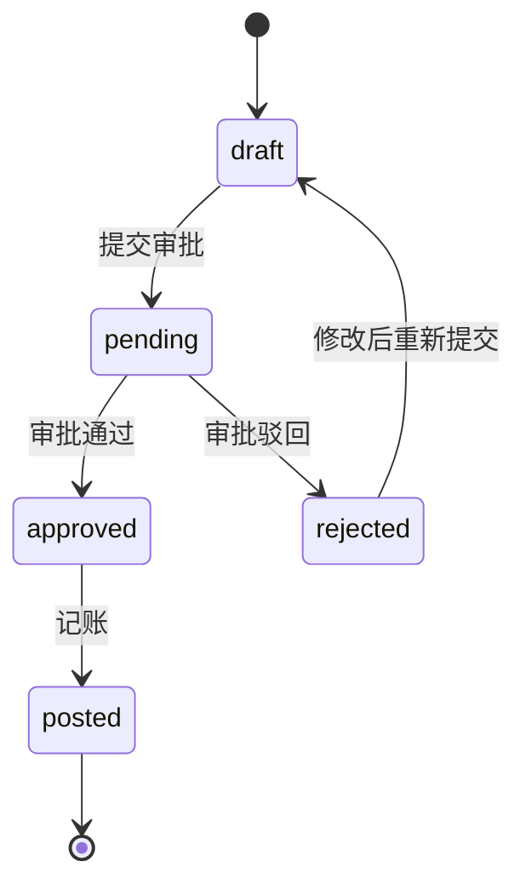

# 财务管理API

<cite>
**本文档引用的文件**   
- [GeneralLedgerController.java](file://08-backend/src/main/java/com/enterprise/brain/modules/finance/controller/GeneralLedgerController.java)
- [GeneralLedgerCreateRequest.java](file://08-backend/src/main/java/com/enterprise/brain/modules/finance/dto/request/GeneralLedgerCreateRequest.java)
- [GeneralLedgerResponse.java](file://08-backend/src/main/java/com/enterprise/brain/modules/finance/dto/response/GeneralLedgerResponse.java)
- [AccountsReceivableController.java](file://08-backend/src/main/java/com/enterprise/brain/modules/finance/controller/AccountsReceivableController.java)
- [CollectionController.java](file://08-backend/src/main/java/com/enterprise/brain/modules/finance/controller/CollectionController.java)
- [GeneralLedger.vue](file://07-frontend/src/pages/finance/general-ledger/GeneralLedgerCreate.vue)
- [VoucherReview.vue](file://07-frontend/src/pages/finance/general-ledger/VoucherReview.vue)
- [currency-calculator.js](file://07-frontend/src/utils/calculation/currency-calculator.js)
</cite>

## 目录
1. [总账管理API](#总账管理api)
2. [应收账款管理API](#应收账款管理api)
3. [财务凭证JSON结构示例](#财务凭证json结构示例)
4. [金额精度处理和货币类型支持](#金额精度处理和货币类型支持)
5. [财务审批流状态转换](#财务审批流状态转换)

## 总账管理API

总账管理API提供了凭证的创建、查询、更新、删除和审批功能。这些接口通过`GeneralLedgerController`类实现，位于`/api/finance/general-ledger`路径下。

### 凭证创建接口

**接口说明**：创建新的总账凭证记录

**请求方法**：POST

**请求路径**：`/api/finance/general-ledger`

**请求体结构**（GeneralLedgerCreateRequest）：

| 字段名 | 类型 | 是否必填 | 说明 |
|-------|------|---------|------|
| voucherNumber | String | 是 | 凭证编号 |
| accountCode | String | 是 | 会计科目代码 |
| accountName | String | 是 | 会计科目名称 |
| debitAmount | BigDecimal | 否 | 借方金额 |
| creditAmount | BigDecimal | 否 | 贷方金额 |
| balance | BigDecimal | 否 | 余额 |
| summary | String | 否 | 摘要 |
| businessDate | LocalDateTime | 是 | 业务日期 |
| voucherType | String | 否 | 凭证类型 |
| accountingPeriod | String | 否 | 会计期间 |

**响应格式**（GeneralLedgerResponse）：

| 字段名 | 类型 | 说明 |
|-------|------|------|
| id | Long | 主键ID |
| voucherNumber | String | 凭证编号 |
| accountCode | String | 会计科目代码 |
| accountName | String | 会计科目名称 |
| debitAmount | BigDecimal | 借方金额 |
| creditAmount | BigDecimal | 贷方金额 |
| balance | BigDecimal | 余额 |
| summary | String | 摘要 |
| businessDate | LocalDateTime | 业务日期 |
| postingDate | LocalDateTime | 记账日期 |
| voucherType | String | 凭证类型 |
| accountingPeriod | String | 会计期间 |
| createTime | LocalDateTime | 创建时间 |
| updateTime | LocalDateTime | 更新时间 |

### 凭证查询接口

**接口说明**：分页查询总账凭证记录

**请求方法**：GET

**请求路径**：`/api/finance/general-ledger`

**请求参数**：

| 参数名 | 类型 | 是否必填 | 说明 |
|-------|------|---------|------|
| voucherNumber | String | 否 | 凭证编号 |
| accountCode | String | 否 | 会计科目代码 |
| accountName | String | 否 | 会计科目名称 |
| voucherType | String | 否 | 凭证类型 |
| accountingPeriod | String | 否 | 会计期间 |
| current | int | 否 | 当前页码，默认为1 |
| size | int | 否 | 每页大小，默认为20 |

**响应格式**（GeneralLedgerListResponse）：

| 字段名 | 类型 | 说明 |
|-------|------|------|
| records | List<GeneralLedgerResponse> | 总账记录列表 |
| total | Long | 总记录数 |
| current | Integer | 当前页码 |
| size | Integer | 每页记录数 |

### 凭证更新接口

**接口说明**：更新总账凭证记录

**请求方法**：PUT

**请求路径**：`/api/finance/general-ledger`

**请求体结构**（GeneralLedgerUpdateRequest）：

| 字段名 | 类型 | 是否必填 | 说明 |
|-------|------|---------|------|
| id | Long | 是 | 主键ID |
| voucherNumber | String | 否 | 凭证编号 |
| accountCode | String | 否 | 会计科目代码 |
| accountName | String | 否 | 会计科目名称 |
| debitAmount | BigDecimal | 否 | 借方金额 |
| creditAmount | BigDecimal | 否 | 贷方金额 |
| balance | BigDecimal | 否 | 余额 |
| summary | String | 否 | 摘要 |
| businessDate | LocalDateTime | 否 | 业务日期 |
| voucherType | String | 否 | 凭证类型 |
| accountingPeriod | String | 否 | 会计期间 |

### 凭证删除接口

**接口说明**：删除总账凭证记录

**请求方法**：DELETE

**请求路径**：`/api/finance/general-ledger/{id}`

**路径参数**：
- id：要删除的凭证ID

**响应格式**：boolean，表示删除是否成功

### 凭证审核接口

**接口说明**：审批总账凭证

**请求方法**：POST

**请求路径**：`/api/finance/general-ledger/approve`

**请求体结构**：

| 字段名 | 类型 | 是否必填 | 说明 |
|-------|------|---------|------|
| id | Long | 是 | 凭证ID |
| result | String | 是 | 审批结果（approved/rejected） |
| comment | String | 是 | 审批意见 |

**响应格式**：审批结果对象

**Section sources**
- [GeneralLedgerController.java](file://08-backend/src/main/java/com/enterprise/brain/modules/finance/controller/GeneralLedgerController.java#L27-L58)
- [GeneralLedgerCreateRequest.java](file://08-backend/src/main/java/com/enterprise/brain/modules/finance/dto/request/GeneralLedgerCreateRequest.java#L1-L52)
- [GeneralLedgerResponse.java](file://08-backend/src/main/java/com/enterprise/brain/modules/finance/dto/response/GeneralLedgerResponse.java#L1-L58)

## 应收账款管理API

应收账款管理API提供了应收账款的创建、收款、对账等操作接口，以及分页查询和统计分析功能。

### 应收账款列表查询

**接口说明**：获取应收账款列表

**请求方法**：GET

**请求路径**：`/api/finance/accounts-receivable/list`

**请求参数**：Map<String, Object>，支持动态查询参数

**响应格式**：AccountsReceivableVO列表

### 账龄分析

**接口说明**：获取账龄分析数据

**请求方法**：GET

**请求路径**：`/api/finance/accounts-receivable/aging-analysis`

**请求参数**：

| 参数名 | 类型 | 是否必填 | 说明 |
|-------|------|---------|------|
| asOfDate | String | 是 | 截至日期 |
| customerCode | String | 否 | 客户编号 |
| status | String | 否 | 状态 |

**响应格式**：账龄分析数据对象

### 回款管理

**接口说明**：回款管理相关操作

**请求路径**：`/api/finance/collection`

**主要接口**：

1. **创建回款计划**：POST `/plans`
2. **更新回款计划**：PUT `/plans`
3. **确认回款计划**：POST `/plans/{id}/confirm`
4. **执行回款计划**：POST `/plans/{id}/execute`
5. **完成回款计划**：POST `/plans/{id}/complete`
6. **终止回款计划**：POST `/plans/{id}/terminate`
7. **记录回款**：POST `/payments`

### 回款提醒管理

**接口说明**：回款提醒相关操作

**请求路径**：`/api/finance/accounts-receivable/payment-reminders`

**主要接口**：

1. **获取回款提醒列表**：GET `/`
2. **创建回款提醒**：POST `/`
3. **更新回款提醒**：PUT `/`
4. **发送回款提醒**：POST `/{id}/send`
5. **取消回款提醒**：POST `/{id}/cancel`

### 付款跟进管理

**接口说明**：付款跟进相关操作

**请求路径**：`/api/finance/accounts-receivable/payment-follow-ups`

**主要接口**：

1. **添加付款跟进记录**：POST `/`
2. **获取付款跟进记录**：GET `/`

**Section sources**
- [AccountsReceivableController.java](file://08-backend/src/main/java/com/enterprise/brain/modules/finance/controller/AccountsReceivableController.java#L28-L145)
- [CollectionController.java](file://08-backend/src/main/java/com/enterprise/brain/modules/finance/controller/CollectionController.java#L29-L159)
- [AccountsReceivableVO.java](file://08-backend/src/main/java/com/enterprise/brain/modules/finance/vo/AccountsReceivableVO.java#L1-L115)

## 财务凭证JSON结构示例

以下是一个完整的财务凭证JSON结构示例：

```json
{
  "id": 1001,
  "voucherNumber": "JZ202401001",
  "accountCode": "1001",
  "accountName": "库存现金",
  "debitAmount": 5000.00,
  "creditAmount": 0.00,
  "balance": 15000.00,
  "summary": "销售商品收入",
  "businessDate": "2024-01-15T00:00:00",
  "postingDate": "2024-01-15T00:00:00",
  "voucherType": "JZ",
  "accountingPeriod": "2024-01",
  "createTime": "2024-01-15T10:30:00",
  "updateTime": "2024-01-15T10:30:00"
}
```

凭证分录示例：

```json
{
  "voucherNumber": "JZ202401001",
  "entries": [
    {
      "accountCode": "1001",
      "accountName": "库存现金",
      "debitAmount": 5000.00,
      "creditAmount": 0.00,
      "summary": "销售商品收入"
    },
    {
      "accountCode": "6001",
      "accountName": "主营业务收入",
      "debitAmount": 0.00,
      "creditAmount": 5000.00,
      "summary": "销售商品收入"
    }
  ],
  "totalDebit": 5000.00,
  "totalCredit": 5000.00,
  "currency": "CNY",
  "exchangeRate": 1.0000,
  "businessDate": "2024-01-15",
  "creator": "张三",
  "approver": "李四",
  "status": "approved"
}
```

**Section sources**
- [GeneralLedger.vue](file://07-frontend/src/pages/finance/general-ledger/GeneralLedgerCreate.vue#L69-L112)
- [VoucherReview.vue](file://07-frontend/src/pages/finance/general-ledger/VoucherReview.vue#L168-L170)

## 金额精度处理和货币类型支持

### 金额精度处理

系统使用`BigDecimal`类型来处理金额，确保财务计算的精确性。所有金额字段都保留两位小数，遵循会计准则。

**精度处理规则**：
- 所有金额计算使用`BigDecimal`进行，避免浮点数精度问题
- 显示时保留两位小数，采用四舍五入规则
- 数据库存储使用DECIMAL类型，精度为19,2
- 计算过程中保持更高精度，最终结果四舍五入到两位小数

### 货币类型支持

系统支持多种货币类型，通过货币代码进行标识。

**支持的货币类型**：

| 货币代码 | 货币名称 | 符号 |
|---------|--------|------|
| CNY | 人民币 | ¥ |
| USD | 美元 | $ |
| EUR | 欧元 | € |
| JPY | 日元 | ¥ |
| GBP | 英镑 | £ |
| HKD | 港币 | HK$ |
| AUD | 澳元 | A$ |
| CAD | 加元 | C$ |

**货币转换功能**：
- 支持实时汇率转换
- 可配置汇率更新频率
- 支持批量货币转换
- 提供货币格式化显示

**货币计算示例**：
```javascript
// 货币转换
const convertedAmount = currencyCalculator.convert(1000, 'CNY', 'USD');

// 货币格式化
const formattedAmount = currencyCalculator.format(1234.56, 'CNY', {
  locale: 'zh-CN',
  showSymbol: true,
  decimals: 2
});
```

**Section sources**
- [currency-calculator.js](file://07-frontend/src/utils/calculation/currency-calculator.js#L1-L295)
- [GeneralLedgerResponse.java](file://08-backend/src/main/java/com/enterprise/brain/modules/finance/dto/response/GeneralLedgerResponse.java#L31-L33)

## 财务审批流状态转换

### 状态转换说明

财务凭证的审批流程包含多个状态，各状态之间有明确的转换规则。

**状态定义**：
- **draft**（草稿）：凭证刚创建，尚未提交审批
- **pending**（待审核）：已提交审批，等待审批人处理
- **approved**（已审核）：已通过审批，凭证生效
- **rejected**（已驳回）：被审批人驳回，需要修改后重新提交
- **posted**（已记账）：凭证已记账，不可再修改

### 状态转换图



### 状态转换规则

1. **草稿 → 待审核**：用户提交凭证进行审批
   - 验证：凭证必须包含至少一条分录，借贷金额必须平衡
   - 操作：设置审批人，生成审批任务

2. **待审核 → 已审核**：审批人通过审批
   - 验证：审批人权限验证，审批意见必填
   - 操作：更新审批人和审批时间，触发后续流程

3. **待审核 → 已驳回**：审批人驳回审批
   - 验证：审批意见必填
   - 操作：返回制单人，可修改后重新提交

4. **已审核 → 已记账**：执行记账操作
   - 验证：检查会计期间是否关闭，余额是否充足
   - 操作：更新记账日期，更新账户余额

### 审批流API

**获取待审批列表**：
- 方法：GET
- 路径：`/api/finance/vouchers?status=pending`
- 功能：获取当前用户需要审批的凭证列表

**执行审批操作**：
- 方法：POST
- 路径：`/api/finance/vouchers/{id}/review`
- 请求体：
  ```json
  {
    "result": "approved",
    "comment": "凭证信息完整，同意审批"
  }
  ```

**审批状态查询**：
- 方法：GET
- 路径：`/api/finance/vouchers/{id}/status`
- 响应：
  ```json
  {
    "status": "pending",
    "currentApprover": "张三",
    "approvalPath": [
      {"level": 1, "approver": "张三", "status": "pending"},
      {"level": 2, "approver": "李四", "status": "not_started"}
    ]
  }
  ```

**Section sources**
- [VoucherReview.vue](file://07-frontend/src/pages/finance/general-ledger/VoucherReview.vue#L175-L187)
- [GeneralLedgerController.java](file://08-backend/src/main/java/com/enterprise/brain/modules/finance/controller/GeneralLedgerController.java#L27-L58)