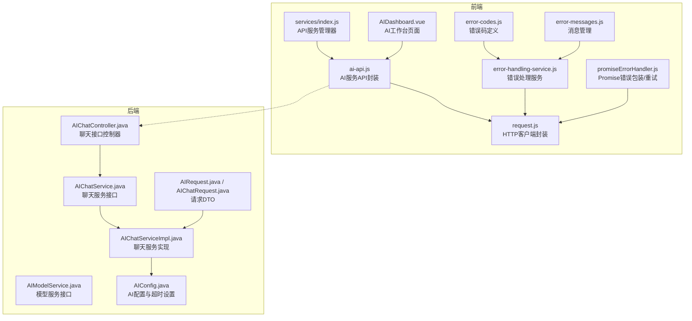
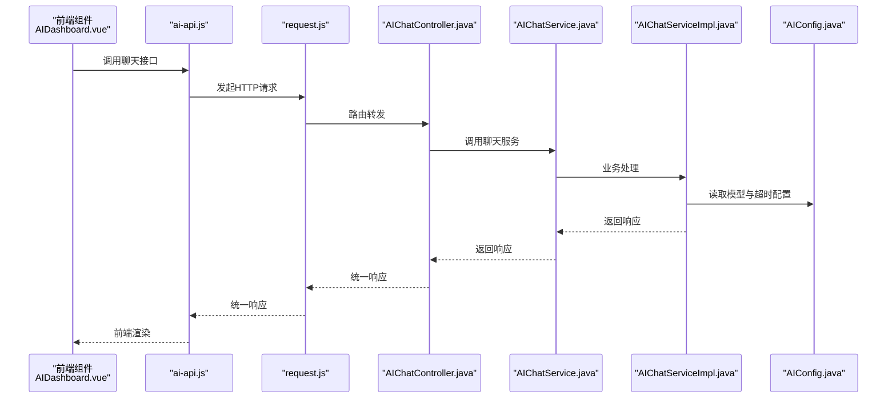
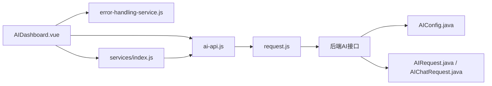

# AI智能服务API

<cite>
**本文引用的文件**
- [ai-api.js](file://07-frontend/src/services/api/ai-api.js)
- [request.js](file://07-frontend/src/utils/request.js)
- [error-handling-service.js](file://07-frontend/src/services/error-handling-service.js)
- [promiseErrorHandler.js](file://07-frontend/src/services/error-handling-service.js)
- [error-codes.js](file://07-frontend/src/utils/error-handling/error-codes.js)
- [error-messages.js](file://07-frontend/src/utils/error-handling/error-messages.js)
- [AIDashboard.vue](file://07-frontend/src/pages/ai/AIDashboard.vue)
- [index.js](file://07-frontend/src/services/index.js)
- [AIChatService.java](file://08-backend/src/main/java/com/enterprise/brain/modules/ai/service/AIChatService.java)
- [AIChatServiceImpl.java](file://08-backend/src/main/java/com/enterprise/brain/modules/ai/service/impl/AIChatServiceImpl.java)
- [AIChatController.java](file://08-backend/src/main/java/com/enterprise/brain/modules/ai/controller/AIChatController.java)
- [AIModelService.java](file://08-backend/src/main/java/com/enterprise/brain/modules/ai/service/AIModelService.java)
- [AIConfig.java](file://08-backend/src/main/java/com/enterprise/brain/modules/ai/config/AIConfig.java)
- [AIRequest.java](file://08-backend/src/main/java/com/enterprise/brain/modules/ai/dto/request/AIRequest.java)
- [AIChatRequest.java](file://08-backend/src/main/java/com/enterprise/brain/modules/ai/dto/request/AIChatRequest.java)
</cite>

## 目录
1. [简介](#简介)
2. [项目结构](#项目结构)
3. [核心组件](#核心组件)
4. [架构总览](#架构总览)
5. [详细组件分析](#详细组件分析)
6. [依赖关系分析](#依赖关系分析)
7. [性能考量](#性能考量)
8. [故障排查指南](#故障排查指南)
9. [结论](#结论)
10. [附录](#附录)

## 简介
本文件围绕前端AI智能服务API封装（ai-api.js）展开，系统化分析其在数据智能分析、推荐引擎、聊天机器人、图像识别、语音服务、自然语言处理、模型管理、数据管理、监控与日志、配置管理等方面的接口设计与实现思路，并结合后端AI服务接口与错误处理机制，给出面向前端组件集成的实践建议与最佳实践。文档同时覆盖长时任务处理、流式响应、模型版本管理等服务层关键能力的设计要点与落地路径。

## 项目结构
前端AI服务API位于服务层目录，采用按功能域分组的模块化组织方式：
- ai-api.js：对外暴露AI相关REST接口集合，涵盖数据分析、推荐、聊天、图像、语音、NLP、模型、数据、监控、配置等子域。
- request.js：统一HTTP客户端封装，内置拦截器、超时、鉴权、统一响应格式与错误提示。
- 错误处理：error-handling-service.js、promiseErrorHandler.js、error-codes.js、error-messages.js 提供统一错误码、错误消息与重试策略。
- 服务聚合：services/index.js 提供API服务管理器，支持批量调用、并发调用、缓存、性能监控等能力。
- 前端页面：AIDashboard.vue 展示AI工作台界面，演示如何与AI服务API对接。

图表来源
- [ai-api.js](file://07-frontend/src/services/api/ai-api.js#L1-L284)
- [request.js](file://07-frontend/src/utils/request.js#L1-L191)
- [error-handling-service.js](file://07-frontend/src/services/error-handling-service.js#L1-L200)
- [promiseErrorHandler.js](file://07-frontend/src/services/error-handling-service.js#L342-L391)
- [error-codes.js](file://07-frontend/src/utils/error-handling/error-codes.js#L1-L460)
- [error-messages.js](file://07-frontend/src/utils/error-handling/error-messages.js#L551-L622)
- [index.js](file://07-frontend/src/services/index.js#L1-L409)
- [AIDashboard.vue](file://07-frontend/src/pages/ai/AIDashboard.vue#L1-L200)
- [AIChatController.java](file://08-backend/src/main/java/com/enterprise/brain/modules/ai/controller/AIChatController.java#L139-L152)
- [AIChatService.java](file://08-backend/src/main/java/com/enterprise/brain/modules/ai/service/AIChatService.java#L1-L57)
- [AIChatServiceImpl.java](file://08-backend/src/main/java/com/enterprise/brain/modules/ai/service/impl/AIChatServiceImpl.java#L21-L82)
- [AIModelService.java](file://08-backend/src/main/java/com/enterprise/brain/modules/ai/service/AIModelService.java#L1-L76)
- [AIConfig.java](file://08-backend/src/main/java/com/enterprise/brain/modules/ai/config/AIConfig.java#L1-L59)
- [AIRequest.java](file://08-backend/src/main/java/com/enterprise/brain/modules/ai/dto/request/AIRequest.java#L1-L54)
- [AIChatRequest.java](file://08-backend/src/main/java/com/enterprise/brain/modules/ai/dto/request/AIChatRequest.java#L1-L18)

章节来源
- [ai-api.js](file://07-frontend/src/services/api/ai-api.js#L1-L284)
- [request.js](file://07-frontend/src/utils/request.js#L1-L191)
- [index.js](file://07-frontend/src/services/index.js#L1-L409)
- [AIDashboard.vue](file://07-frontend/src/pages/ai/AIDashboard.vue#L1-L200)

## 核心组件
- AI智能服务API封装（ai-api.js）
  - 按功能域划分：analysis（数据分析）、recommendation（推荐引擎）、chatbot（聊天机器人）、imageRecognition（图像识别）、voiceService（语音服务）、nlp（自然语言处理）、model（模型管理）、data（数据管理）、monitoring（监控与日志）、config（配置管理）。
  - 统一通过request.js发起HTTP请求，支持GET/POST/PUT/DELETE/PATCH与文件上传/下载。
- HTTP客户端封装（request.js）
  - 全局baseURL、超时、鉴权头、GET防缓存、统一响应格式、错误提示与重定向。
  - 支持文件上传（multipart/form-data）与文件下载（blob）。
- 错误处理体系
  - error-handling-service.js：统一错误对象、日志、消息提示、通知、上报服务器、处理器注册。
  - promiseErrorHandler.js：Promise包装、静默处理、带重试的错误处理。
  - error-codes.js、error-messages.js：错误码定义、消息模板与历史记录。
- API服务管理器（services/index.js）
  - 注册/获取API服务、批量/并发调用、缓存、性能监控、拦截器扩展。

章节来源
- [ai-api.js](file://07-frontend/src/services/api/ai-api.js#L1-L284)
- [request.js](file://07-frontend/src/utils/request.js#L1-L191)
- [error-handling-service.js](file://07-frontend/src/services/error-handling-service.js#L1-L200)
- [promiseErrorHandler.js](file://07-frontend/src/services/error-handling-service.js#L342-L391)
- [error-codes.js](file://07-frontend/src/utils/error-handling/error-codes.js#L1-L460)
- [error-messages.js](file://07-frontend/src/utils/error-handling/error-messages.js#L551-L622)
- [index.js](file://07-frontend/src/services/index.js#L1-L409)

## 架构总览
前端通过ai-api.js向后端AI服务发起REST请求；请求经由request.js统一拦截与处理；后端AIChatController接收请求，委托AIChatService实现业务逻辑，AIChatServiceImpl调用AIConfig配置与模型参数，最终返回统一响应。错误处理贯穿前后端，前端通过error-handling-service与promiseErrorHandler进行统一处理，后端通过全局异常与控制器返回值进行错误封装。

图表来源
- [AIDashboard.vue](file://07-frontend/src/pages/ai/AIDashboard.vue#L1-L200)
- [ai-api.js](file://07-frontend/src/services/api/ai-api.js#L1-L284)
- [request.js](file://07-frontend/src/utils/request.js#L1-L191)
- [AIChatController.java](file://08-backend/src/main/java/com/enterprise/brain/modules/ai/controller/AIChatController.java#L139-L152)
- [AIChatService.java](file://08-backend/src/main/java/com/enterprise/brain/modules/ai/service/AIChatService.java#L1-L57)
- [AIChatServiceImpl.java](file://08-backend/src/main/java/com/enterprise/brain/modules/ai/service/impl/AIChatServiceImpl.java#L21-L82)
- [AIConfig.java](file://08-backend/src/main/java/com/enterprise/brain/modules/ai/config/AIConfig.java#L1-L59)

## 详细组件分析

### AI智能服务API封装（ai-api.js）
- 设计原则
  - 功能域清晰：analysis、recommendation、chatbot、imageRecognition、voiceService、nlp、model、data、monitoring、config。
  - 方法命名语义化：如analyze、predict、detectAnomalies、getPersonalized、sendMessage、classify、speechToText、analyzeText等。
  - 参数传递规范：GET使用params，POST/PUT/DELETE使用data，文件上传使用upload。
- 典型接口示例（路径参考）
  - 数据分析：/ai/analysis/data、/ai/analysis/predict、/ai/analysis/anomaly-detection、/ai/analysis/correlation、/ai/analysis/clustering
  - 推荐引擎：/ai/recommendation/personalized、/ai/recommendation/similar/{type}/{id}、/ai/recommendation/popular、/ai/recommendation/train、/ai/recommendation/feedback
  - 聊天机器人：/ai/chatbot/message、/ai/chatbot/history、/ai/chatbot/history、/ai/chatbot/quick-replies、/ai/chatbot/rate
  - 图像识别：/ai/image/classify、/ai/image/detect-objects、/ai/image/recognize-face、/ai/image/ocr、/ai/image/search
  - 语音服务：/ai/voice/stt、/ai/voice/tts、/ai/voice/emotion、/ai/voice/recognize
  - NLP：/ai/nlp/analyze、/ai/nlp/sentiment、/ai/nlp/keywords、/ai/nlp/summarize、/ai/nlp/detect-language、/ai/nlp/translate
  - 模型管理：/ai/models、/ai/models/{id}、/ai/models/upload、/ai/models/train、/ai/models/{id}/deploy、/ai/models/{id}、/ai/models/{id}/logs
  - 数据管理：/ai/datasets、/ai/datasets/upload、/ai/datasets/preprocess、/ai/datasets/augment、/ai/datasets/annotate
  - 监控与日志：/ai/monitoring/usage、/ai/monitoring/models/{modelId}/metrics、/ai/monitoring/errors、/ai/monitoring/health
  - 配置管理：/ai/config、/ai/config、/ai/config/api-keys、/ai/config/api-keys

章节来源
- [ai-api.js](file://07-frontend/src/services/api/ai-api.js#L1-L284)

### HTTP客户端封装（request.js）
- 能力特性
  - 全局超时（默认15秒）、baseURL动态配置、Content-Type统一设置。
  - 请求拦截：自动注入Authorization头、GET请求附加时间戳防缓存。
  - 响应拦截：统一处理200/401/其他错误码、网络错误分类与提示、超时识别。
  - 文件上传/下载：multipart/form-data与blob下载。
- 错误处理
  - 401自动登出并跳转登录页。
  - 统一错误消息提示与Promise reject，便于上层捕获。

章节来源
- [request.js](file://07-frontend/src/utils/request.js#L1-L191)

### 错误处理体系
- error-handling-service.js
  - 错误类型与级别、错误对象构建、日志存储与上报、消息提示与通知、处理器注册与自定义处理。
- promiseErrorHandler.js
  - 包装Promise自动处理错误、静默处理、带重试的错误处理（指数退避/固定延迟）。
- error-codes.js、error-messages.js
  - 错误码分类（系统、认证、数据、业务、网络、文件、第三方服务），支持自动恢复策略与用户指引。

章节来源
- [error-handling-service.js](file://07-frontend/src/services/error-handling-service.js#L1-L200)
- [promiseErrorHandler.js](file://07-frontend/src/services/error-handling-service.js#L342-L391)
- [error-codes.js](file://07-frontend/src/utils/error-handling/error-codes.js#L1-L460)
- [error-messages.js](file://07-frontend/src/utils/error-handling/error-messages.js#L551-L622)

### API服务管理器（services/index.js）
- 能力特性
  - 注册/获取API服务、批量调用、并发调用（race）、条件调用、缓存（localStorage）、性能监控（localStorage）。
  - 默认请求/响应拦截器，统一处理GET防缓存与响应格式。
- 使用建议
  - 在页面中通过api.get('ai')获取aiApi实例，再调用对应方法。
  - 对高频接口使用cached与monitor进行性能优化与监控。

章节来源
- [index.js](file://07-frontend/src/services/index.js#L1-L409)

### 前端组件集成示例（AIDashboard.vue）
- 场景覆盖
  - 模型管理：筛选、训练、部署、详情查看。
  - 异常检测：统计与可视化。
  - 预测分析：多类型预测切换与趋势图。
  - 智能建议：采纳/忽略交互。
- 集成要点
  - 使用ai-api.js中的analysis、model、monitoring等接口获取数据。
  - 使用error-handling-service与promiseErrorHandler进行错误处理与重试。
  - 使用services/index.js的api.cached/api.monitor进行性能优化。

章节来源
- [AIDashboard.vue](file://07-frontend/src/pages/ai/AIDashboard.vue#L1-L200)
- [ai-api.js](file://07-frontend/src/services/api/ai-api.js#L1-L284)
- [error-handling-service.js](file://07-frontend/src/services/error-handling-service.js#L1-L200)
- [promiseErrorHandler.js](file://07-frontend/src/services/error-handling-service.js#L342-L391)
- [index.js](file://07-frontend/src/services/index.js#L1-L409)

## 依赖关系分析
- 前端依赖链
  - AIDashboard.vue → ai-api.js → request.js → 后端AI接口。
  - 错误处理：AIDashboard.vue → error-handling-service.js → request.js。
  - API管理：AIDashboard.vue → services/index.js → ai-api.js。
- 后端依赖链
  - AIChatController → AIChatService → AIChatServiceImpl → AIConfig。
  - AIRequest/AIChatRequest作为请求DTO参与参数校验与配置。

图表来源
- [AIDashboard.vue](file://07-frontend/src/pages/ai/AIDashboard.vue#L1-L200)
- [ai-api.js](file://07-frontend/src/services/api/ai-api.js#L1-L284)
- [request.js](file://07-frontend/src/utils/request.js#L1-L191)
- [AIConfig.java](file://08-backend/src/main/java/com/enterprise/brain/modules/ai/config/AIConfig.java#L1-L59)
- [AIRequest.java](file://08-backend/src/main/java/com/enterprise/brain/modules/ai/dto/request/AIRequest.java#L1-L54)
- [AIChatRequest.java](file://08-backend/src/main/java/com/enterprise/brain/modules/ai/dto/request/AIChatRequest.java#L1-L18)

章节来源
- [AIDashboard.vue](file://07-frontend/src/pages/ai/AIDashboard.vue#L1-L200)
- [ai-api.js](file://07-frontend/src/services/api/ai-api.js#L1-L284)
- [request.js](file://07-frontend/src/utils/request.js#L1-L191)
- [AIConfig.java](file://08-backend/src/main/java/com/enterprise/brain/modules/ai/config/AIConfig.java#L1-L59)
- [AIRequest.java](file://08-backend/src/main/java/com/enterprise/brain/modules/ai/dto/request/AIRequest.java#L1-L54)
- [AIChatRequest.java](file://08-backend/src/main/java/com/enterprise/brain/modules/ai/dto/request/AIChatRequest.java#L1-L18)

## 性能考量
- 超时与重试
  - request.js默认15秒超时，网络错误与超时会触发错误提示与Promise reject。
  - promiseErrorHandler提供带重试的错误处理，支持固定延迟或指数退避。
- 缓存与批量调用
  - services/index.js提供cached与batch/race/conditional等能力，适合高频接口与并发场景。
- 性能监控
  - services/index.js提供monitor与性能报告，可用于定位慢接口与失败率。
- 后端配置
  - AIConfig提供连接超时、读超时、最大连接数、默认模型、缓存开关与TTL等配置，有助于控制后端资源与响应时间。

章节来源
- [request.js](file://07-frontend/src/utils/request.js#L1-L191)
- [promiseErrorHandler.js](file://07-frontend/src/services/error-handling-service.js#L342-L391)
- [index.js](file://07-frontend/src/services/index.js#L1-L409)
- [AIConfig.java](file://08-backend/src/main/java/com/enterprise/brain/modules/ai/config/AIConfig.java#L1-L59)

## 故障排查指南
- 常见错误与处理
  - 401未授权：自动弹窗提示并跳转登录页；前端需确保token有效与刷新策略。
  - 408超时：检查网络状况与后端超时配置；前端可结合promiseErrorHandler.retry进行重试。
  - 500/503：服务端异常或过载；前端记录错误日志并提示用户稍后重试。
- 错误码与消息
  - 使用error-codes.js定义的错误码与error-messages.js的消息模板，统一错误提示与用户指引。
- 日志与上报
  - error-handling-service.js记录本地错误日志并异步上报服务器，便于问题追踪。
- 建议流程
  - 页面加载前先调用monitor对关键接口进行性能评估。
  - 对长时任务（如模型训练、预测分析）使用cached与进度反馈，避免重复请求。
  - 对网络不稳定场景，启用promiseErrorHandler.retry并设置合理的重试次数与延迟。

章节来源
- [request.js](file://07-frontend/src/utils/request.js#L1-L191)
- [error-codes.js](file://07-frontend/src/utils/error-handling/error-codes.js#L1-L460)
- [error-messages.js](file://07-frontend/src/utils/error-handling/error-messages.js#L551-L622)
- [error-handling-service.js](file://07-frontend/src/services/error-handling-service.js#L1-L200)

## 结论
ai-api.js以清晰的功能域划分与一致的接口风格，为前端AI组件提供了完备的服务入口；配合request.js的统一HTTP封装与services/index.js的API管理器，实现了良好的可维护性与可扩展性。后端通过AIChatService/Impl与AIConfig的配置化设计，为长时任务、模型版本管理与超时控制提供了基础能力。结合error-handling-service与promiseErrorHandler，前端可在复杂场景下实现稳健的错误处理与用户体验保障。

## 附录
- 服务层关键能力与落地建议
  - 长时任务处理：后端AIChatServiceImpl中模拟响应时间，实际应接入真实AI服务并支持任务状态轮询或回调；前端通过services/index.js的cached与monitor进行进度反馈与性能监控。
  - 流式响应：后端AIChatRequest支持stream字段，前端可结合WebSocket或Server-Sent Events实现流式输出；request.js目前未直接支持流式传输，需在具体场景中扩展。
  - 模型版本管理：后端AIModelService提供模型列表、详情、部署、删除、训练日志等接口；前端通过ai-api.js的model子域与AIDashboard.vue进行可视化管理。
  - 前端集成示例：AIDashboard.vue展示了如何调用ai-api.js中的analysis、model、monitoring等接口，并结合error-handling-service与promiseErrorHandler进行错误处理与重试。

章节来源
- [AIChatServiceImpl.java](file://08-backend/src/main/java/com/enterprise/brain/modules/ai/service/impl/AIChatServiceImpl.java#L21-L82)
- [AIChatRequest.java](file://08-backend/src/main/java/com/enterprise/brain/modules/ai/dto/request/AIChatRequest.java#L1-L18)
- [AIModelService.java](file://08-backend/src/main/java/com/enterprise/brain/modules/ai/service/AIModelService.java#L1-L76)
- [AIDashboard.vue](file://07-frontend/src/pages/ai/AIDashboard.vue#L1-L200)
- [ai-api.js](file://07-frontend/src/services/api/ai-api.js#L1-L284)