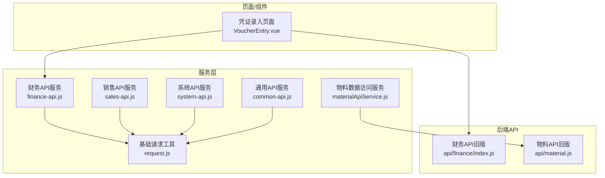
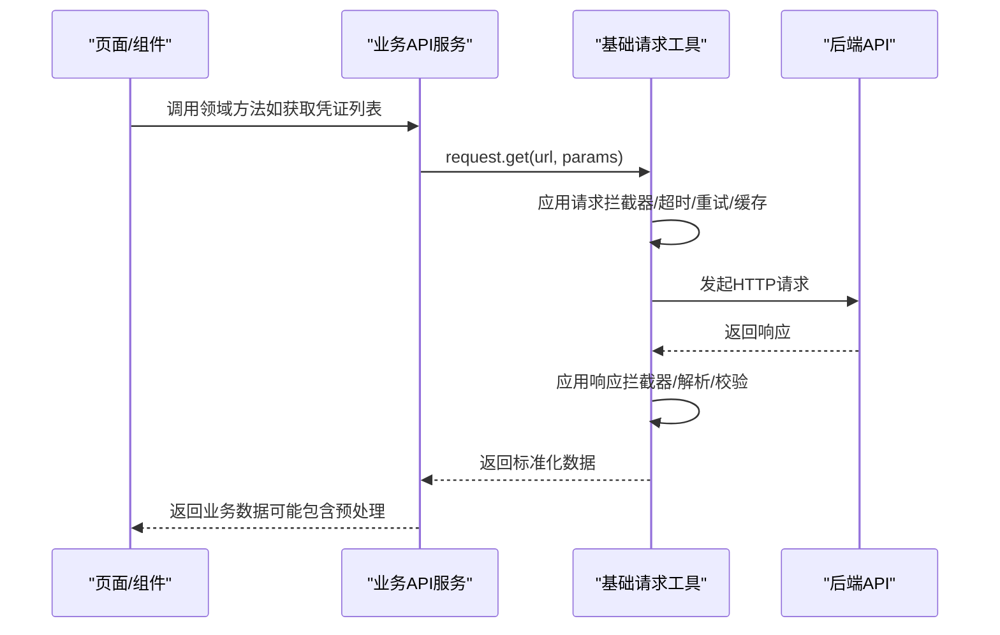
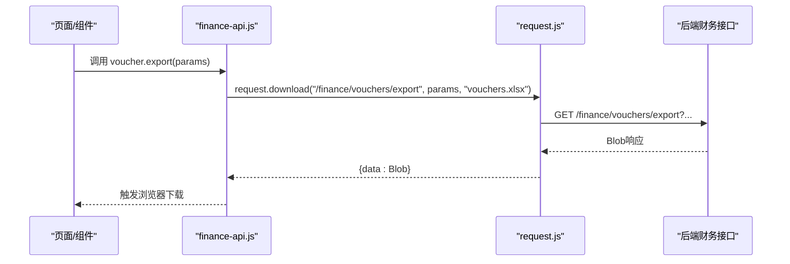
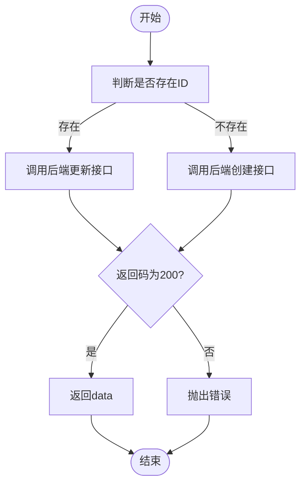
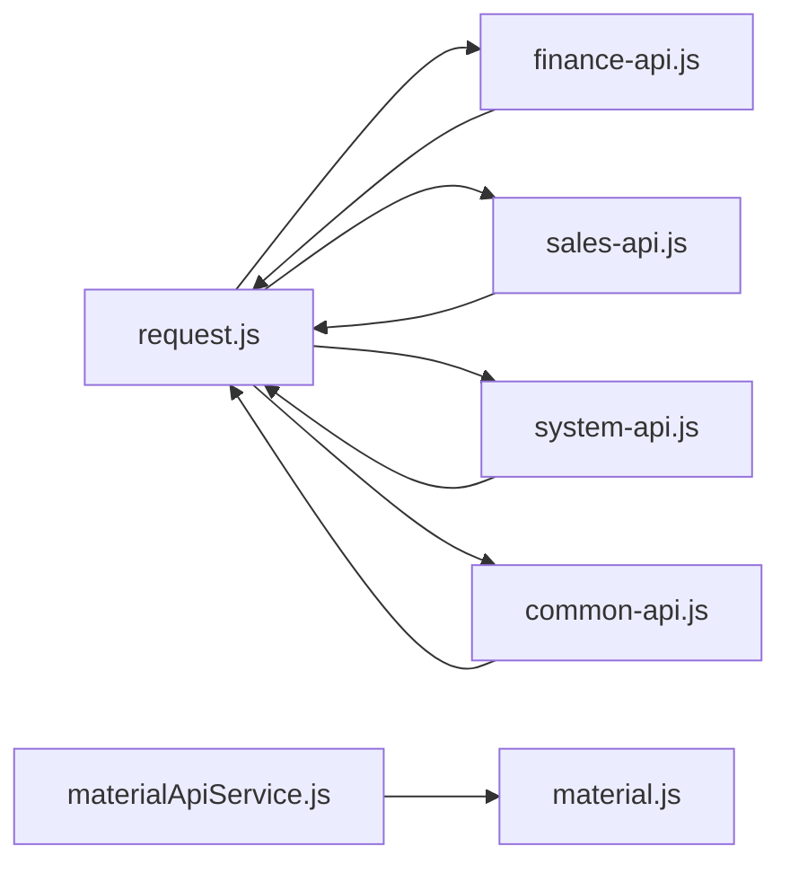

# API服务层封装

<cite>
**本文引用的文件**
- [request.js](file://07-frontend/src/services/utils/request.js)
- [finance-api.js](file://07-frontend/src/services/api/finance-api.js)
- [sales-api.js](file://07-frontend/src/services/api/sales-api.js)
- [system-api.js](file://07-frontend/src/services/api/system-api.js)
- [materialApiService.js](file://07-frontend/src/services/api/materialApiService.js)
- [material.js](file://07-frontend/src/api/material.js)
- [common-api.js](file://07-frontend/src/services/api/common-api.js)
- [index.js](file://07-frontend/src/api/finance/index.js)
- [VoucherEntry.vue](file://07-frontend/src/pages/finance/general-ledger/VoucherEntry.vue)
</cite>

## 目录
1. [引言](#引言)
2. [项目结构](#项目结构)
3. [核心组件](#核心组件)
4. [架构总览](#架构总览)
5. [详细组件分析](#详细组件分析)
6. [依赖关系分析](#依赖关系分析)
7. [性能考量](#性能考量)
8. [故障排查指南](#故障排查指南)
9. [结论](#结论)

## 引言
本文件聚焦于前端“服务层”对后端API的封装设计，重点解析以下模块：
- 基础请求工具：统一的HTTP客户端，提供拦截器、重试、缓存、取消、批量/链式请求、下载上传等能力
- 业务API服务：finance-api、sales-api、system-api等，围绕财务、销售、系统管理等业务域构建领域专用接口
- 数据访问服务：materialApiService，面向物料数据的统一访问层，负责与后端数据库交互并进行字段命名转换
- 通用API服务：common-api，提供上传、下载、地区、字典、通知、验证码、系统信息、统计分析、缓存等跨域通用能力

目标是说明服务层如何通过“领域方法+基础请求”的组合，实现业务逻辑与网络请求的解耦，向上提供简洁、类型安全且具备参数适配与响应预处理能力的接口。

## 项目结构
服务层位于前端工程的 services 目录，按“基础工具 + 业务服务 + 数据访问服务 + 通用服务”的方式组织，形成清晰的分层与职责边界。

图示来源
- [request.js](file://07-frontend/src/services/utils/request.js#L1-L798)
- [finance-api.js](file://07-frontend/src/services/api/finance-api.js#L1-L296)
- [sales-api.js](file://07-frontend/src/services/api/sales-api.js#L1-L346)
- [system-api.js](file://07-frontend/src/services/api/system-api.js#L1-L253)
- [materialApiService.js](file://07-frontend/src/services/api/materialApiService.js#L1-L211)
- [material.js](file://07-frontend/src/api/material.js#L1-L76)
- [common-api.js](file://07-frontend/src/services/api/common-api.js#L1-L240)
- [index.js](file://07-frontend/src/api/finance/index.js#L1-L417)
- [VoucherEntry.vue](file://07-frontend/src/pages/finance/general-ledger/VoucherEntry.vue#L1-L200)

章节来源
- [request.js](file://07-frontend/src/services/utils/request.js#L1-L798)
- [finance-api.js](file://07-frontend/src/services/api/finance-api.js#L1-L296)
- [sales-api.js](file://07-frontend/src/services/api/sales-api.js#L1-L346)
- [system-api.js](file://07-frontend/src/services/api/system-api.js#L1-L253)
- [materialApiService.js](file://07-frontend/src/services/api/materialApiService.js#L1-L211)
- [material.js](file://07-frontend/src/api/material.js#L1-L76)
- [common-api.js](file://07-frontend/src/services/api/common-api.js#L1-L240)
- [index.js](file://07-frontend/src/api/finance/index.js#L1-L417)
- [VoucherEntry.vue](file://07-frontend/src/pages/finance/general-ledger/VoucherEntry.vue#L1-L200)

## 核心组件
- 基础请求工具（request.js）
  - 提供统一的HTTP客户端，封装fetch，内置超时、重试、缓存、取消、拦截器、批量/链式请求、下载/上传等能力
  - 支持请求/响应/错误三类拦截器，便于在统一入口做鉴权、日志、错误处理、数据转换等横切关注点
  - 提供便捷的快捷方法（get/post/put/delete等），以及download/upload等高级能力
- 业务API服务
  - finance-api：财务域接口集合，覆盖科目、凭证、账簿、报表、收支、预算、资金、税务、成本等
  - sales-api：销售域接口集合，覆盖客户、订单、报价、合同、机会、目标、统计、团队、活动等
  - system-api：系统域接口集合，覆盖用户、角色、权限、部门、字典、配置、监控、日志等
- 数据访问服务
  - materialApiService：物料数据访问层，直接对接后端数据库，负责字段命名转换、增删改查、批量操作、搜索等
- 通用API服务
  - common-api：提供上传/下载、地区、字典、通知、搜索、验证码、系统信息、统计分析、缓存等通用能力

章节来源
- [request.js](file://07-frontend/src/services/utils/request.js#L1-L798)
- [finance-api.js](file://07-frontend/src/services/api/finance-api.js#L1-L296)
- [sales-api.js](file://07-frontend/src/services/api/sales-api.js#L1-L346)
- [system-api.js](file://07-frontend/src/services/api/system-api.js#L1-L253)
- [materialApiService.js](file://07-frontend/src/services/api/materialApiService.js#L1-L211)
- [common-api.js](file://07-frontend/src/services/api/common-api.js#L1-L240)

## 架构总览
服务层采用“基础请求工具 + 领域API服务 + 数据访问服务”的分层设计，遵循以下原则：
- 解耦：业务组件只依赖服务层接口，不直接调用底层HTTP库或后端路由
- 可扩展：新增业务只需在对应API服务中添加方法，复用基础请求工具的能力
- 可维护：统一的拦截器、错误处理、重试、缓存策略集中管理
- 可测试：服务层方法语义明确，便于单元测试与模拟

图示来源
- [request.js](file://07-frontend/src/services/utils/request.js#L395-L476)
- [finance-api.js](file://07-frontend/src/services/api/finance-api.js#L1-L296)
- [sales-api.js](file://07-frontend/src/services/api/sales-api.js#L1-L346)
- [system-api.js](file://07-frontend/src/services/api/system-api.js#L1-L253)

## 详细组件分析

### 基础请求工具（request.js）
- 设计要点
  - 统一配置：baseURL、超时、响应类型、withCredentials、重试策略、缓存模式等
  - 拦截器：请求前统一注入token、签名、日志；响应后统一脱壳、格式化；错误统一转换
  - 能力矩阵：GET/POST/PUT/PATCH/DELETE/HEAD/OPTIONS、上传（含进度）、下载（Blob）、批量/链式请求、取消、缓存
  - 安全与健壮性：超时、指数退避重试、可缓存GET、取消控制、错误对象标准化
- 关键流程
  - 请求准备：合并默认配置、拼接URL、格式化查询参数、序列化请求体
  - 执行请求：fetch + 超时包装、响应解析、状态校验、应用响应拦截器、缓存
  - 错误处理：应用错误拦截器、抛出标准化错误对象
  - 重试机制：指数退避、可配置重试次数与状态码白名单
  - 取消与清理：AbortController映射、请求完成后清理
- 适用场景
  - 任何需要HTTP通信的业务模块均可复用该工具，避免重复造轮子

章节来源
- [request.js](file://07-frontend/src/services/utils/request.js#L1-L798)

### 财务API服务（finance-api.js）
- 职责定位
  - 财务域专用接口集合，围绕科目、凭证、账簿、报表、收支、预算、资金、税务、成本等提供方法
  - 以“account/voucher/ledger/report/incomeExpense/budget/fund/tax/cost”等命名空间组织，层次清晰
- 设计模式
  - 方法即领域动作：如getList/getDetail/create/update/delete/approve/unapprove/export等
  - 参数适配：统一通过params传递查询参数，data传递请求体
  - 响应预处理：由基础请求工具统一处理，服务层保持薄层封装
- 典型流程（凭证导出）
  - 调用：financeApi.voucher.export(params)
  - 流程：基础请求工具发起GET请求，设置responseType为blob，再通过download封装触发浏览器下载

图示来源
- [finance-api.js](file://07-frontend/src/services/api/finance-api.js#L1-L296)
- [request.js](file://07-frontend/src/services/utils/request.js#L642-L674)

章节来源
- [finance-api.js](file://07-frontend/src/services/api/finance-api.js#L1-L296)
- [request.js](file://07-frontend/src/services/utils/request.js#L480-L531)
- [request.js](file://07-frontend/src/services/utils/request.js#L642-L674)

### 销售API服务（sales-api.js）
- 职责定位
  - 销售域专用接口集合，覆盖客户、订单、报价、合同、机会、目标、统计、团队、活动等
  - 以customer/order/quotation/contract/opportunity/target/statistics/team/activity命名空间组织
- 设计模式
  - 领域方法命名规范：如getList/getDetail/create/update/delete/approve/ship/complete/cancel/export等
  - 参数适配：统一通过params传递查询参数，data传递请求体
  - 统一导出：通过download封装统一导出行为

章节来源
- [sales-api.js](file://07-frontend/src/services/api/sales-api.js#L1-L346)
- [request.js](file://07-frontend/src/services/utils/request.js#L642-L674)

### 系统API服务（system-api.js）
- 职责定位
  - 系统管理域专用接口集合，覆盖用户、角色、权限、部门、字典、配置、监控、日志等
  - 以user/role/permission/department/dictionary/config/monitor/log命名空间组织
- 设计模式
  - 领域方法命名规范：如getList/getDetail/create/update/delete/resetPassword/updateStatus等
  - 统一导出：日志导出通过download封装

章节来源
- [system-api.js](file://07-frontend/src/services/api/system-api.js#L1-L253)
- [request.js](file://07-frontend/src/services/utils/request.js#L642-L674)

### 物料数据访问服务（materialApiService.js）
- 职责定位
  - 物料数据的统一访问层，直接与后端数据库交互，替代本地IndexedDB
  - 负责字段命名转换（下划线转驼峰）、增删改查、批量操作、搜索、ID生成等
- 设计模式
  - 类封装：MaterialAPIService类提供getAllMaterials/saveMaterial/saveMaterials/deleteMaterial/deleteMaterials/searchMaterials/getNextMaterialId等方法
  - 响应预处理：统一将后端返回的下划线命名转换为驼峰命名，便于上层组件使用
  - 错误处理：捕获异常并抛出，保留原始错误信息与堆栈
- 典型流程（保存物料）
  - 判断是否存在id决定创建或更新
  - 调用后端接口，校验返回码，成功则返回data，否则抛出错误
  - 在控制台输出调试信息，便于问题定位

图示来源
- [materialApiService.js](file://07-frontend/src/services/api/materialApiService.js#L1-L211)
- [material.js](file://07-frontend/src/api/material.js#L1-L76)

章节来源
- [materialApiService.js](file://07-frontend/src/services/api/materialApiService.js#L1-L211)
- [material.js](file://07-frontend/src/api/material.js#L1-L76)

### 通用API服务（common-api.js）
- 职责定位
  - 提供跨业务域的通用能力：文件上传/下载、地区、字典、通知、搜索、验证码、系统信息、统计分析、缓存管理
- 设计模式
  - 命名空间：upload/download/region/dict/notification/search/captcha/system/statistics/cache
  - 参数适配：统一通过params传递查询参数，data传递请求体
  - 统一导出：download封装统一导出行为

章节来源
- [common-api.js](file://07-frontend/src/services/api/common-api.js#L1-L240)
- [request.js](file://07-frontend/src/services/utils/request.js#L642-L674)

### 与页面/组件的集成示例
- 凭证录入页面（VoucherEntry.vue）
  - 依赖财务API：import { voucherApi } from '@/api/finance'
  - 调用：await voucherApi.createVoucher(form)
  - 体现：页面仅关心业务动作，不关心HTTP细节，实现业务与网络的解耦

章节来源
- [VoucherEntry.vue](file://07-frontend/src/pages/finance/general-ledger/VoucherEntry.vue#L1-L200)
- [index.js](file://07-frontend/src/api/finance/index.js#L1-L121)

## 依赖关系分析
- 低耦合高内聚
  - 业务API服务均依赖基础请求工具，不直接依赖后端路由或第三方库
  - 数据访问服务独立于业务API服务，专注数据层转换与交互
- 可观测性
  - request.js提供统计接口（activeRequests/cachedRequests等），便于监控
- 可扩展性
  - 新增业务只需在对应API服务中添加方法，复用request.js的拦截器与能力
- 循环依赖风险
  - 当前结构无明显循环依赖；若未来引入跨域服务，需确保导入路径与职责边界清晰

图示来源
- [request.js](file://07-frontend/src/services/utils/request.js#L1-L798)
- [finance-api.js](file://07-frontend/src/services/api/finance-api.js#L1-L296)
- [sales-api.js](file://07-frontend/src/services/api/sales-api.js#L1-L346)
- [system-api.js](file://07-frontend/src/services/api/system-api.js#L1-L253)
- [common-api.js](file://07-frontend/src/services/api/common-api.js#L1-L240)
- [materialApiService.js](file://07-frontend/src/services/api/materialApiService.js#L1-L211)
- [material.js](file://07-frontend/src/api/material.js#L1-L76)

章节来源
- [request.js](file://07-frontend/src/services/utils/request.js#L1-L798)
- [finance-api.js](file://07-frontend/src/services/api/finance-api.js#L1-L296)
- [sales-api.js](file://07-frontend/src/services/api/sales-api.js#L1-L346)
- [system-api.js](file://07-frontend/src/services/api/system-api.js#L1-L253)
- [common-api.js](file://07-frontend/src/services/api/common-api.js#L1-L240)
- [materialApiService.js](file://07-frontend/src/services/api/materialApiService.js#L1-L211)
- [material.js](file://07-frontend/src/api/material.js#L1-L76)

## 性能考量
- 请求缓存
  - 对GET请求支持缓存，减少重复请求；可通过配置开启强制缓存
- 重试与超时
  - 可配置重试次数与延迟，结合指数退避降低抖动；统一超时控制避免阻塞
- 取消请求
  - 通过AbortController映射，支持取消单个或全部请求，避免竞态与内存泄漏
- 批量/链式请求
  - 批量请求支持快速失败或全部等待；链式请求保证顺序依赖
- 下载/上传
  - 下载使用Blob与URL.createObjectURL，避免内存占用；上传支持进度监听

章节来源
- [request.js](file://07-frontend/src/services/utils/request.js#L93-L115)
- [request.js](file://07-frontend/src/services/utils/request.js#L280-L311)
- [request.js](file://07-frontend/src/services/utils/request.js#L313-L386)
- [request.js](file://07-frontend/src/services/utils/request.js#L478-L531)
- [request.js](file://07-frontend/src/services/utils/request.js#L642-L674)
- [request.js](file://07-frontend/src/services/utils/request.js#L553-L577)

## 故障排查指南
- 常见问题
  - 跨域/鉴权失败：检查请求拦截器是否正确注入token或headers
  - 响应格式异常：确认后端返回结构与基础请求工具的解析策略一致
  - 超时/重试：根据业务特性调整超时与重试策略
  - 下载失败：确认responseType为blob且后端返回正确的文件流
- 定位手段
  - 使用错误拦截器统一记录错误上下文（状态码、响应体、堆栈）
  - 通过统计接口观察活跃请求与缓存命中情况
  - 在服务层方法中增加必要的日志输出，便于定位问题
- 修复建议
  - 对于字段命名差异，优先在服务层进行转换（如物料服务的驼峰转换）
  - 对于复杂参数，统一通过params/data传递，避免路径拼接导致的歧义

章节来源
- [request.js](file://07-frontend/src/services/utils/request.js#L146-L162)
- [request.js](file://07-frontend/src/services/utils/request.js#L265-L279)
- [request.js](file://07-frontend/src/services/utils/request.js#L740-L753)
- [materialApiService.js](file://07-frontend/src/services/api/materialApiService.js#L1-L211)

## 结论
该服务层通过“基础请求工具 + 领域API服务 + 数据访问服务 + 通用服务”的分层设计，实现了：
- 业务与网络解耦：上层组件仅依赖服务层方法，不感知HTTP细节
- 统一能力：拦截器、重试、缓存、取消、批量/链式请求、下载/上传等能力集中管理
- 易扩展：新增业务只需在对应API服务中添加方法，复用现有能力
- 可维护：统一的错误处理与日志策略，便于问题定位与优化

建议后续持续完善：
- 为服务层方法补充类型定义（如TS），提升开发体验与IDE提示
- 对高频接口增加缓存策略与失效机制
- 在服务层增加统一的错误码映射与用户友好提示