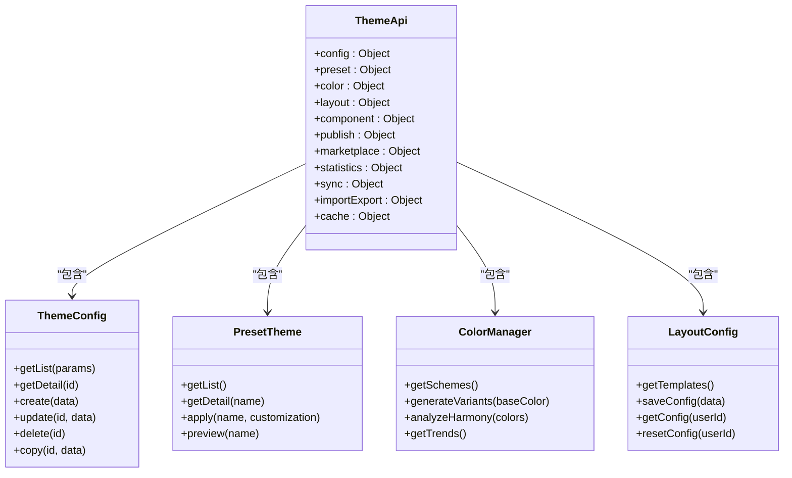
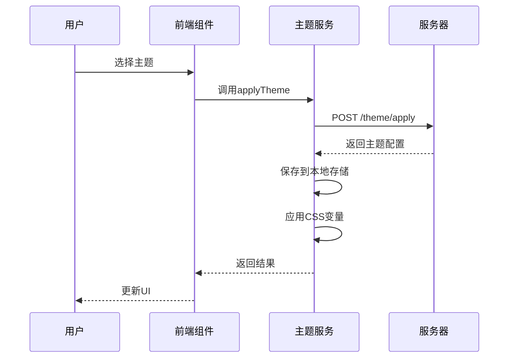
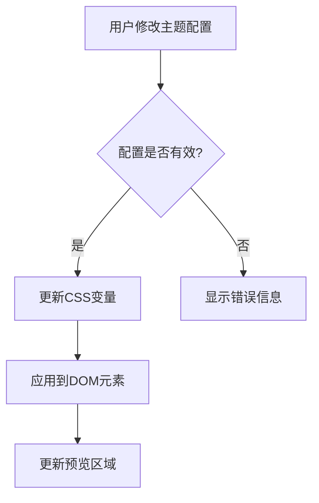
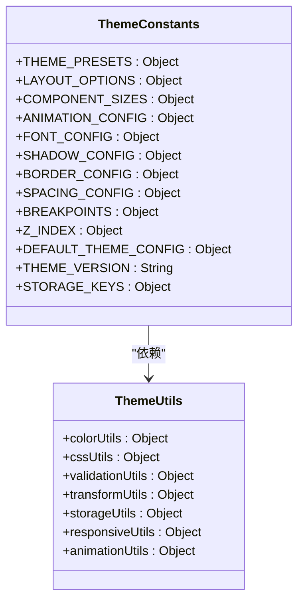

# 主题管理API服务

<cite>
**本文档引用的文件**   
- [theme-api.js](file://07-frontend/src/services/api/theme-api.js)
- [theme-service.js](file://07-frontend/src/services/theme-service.js)
- [ThemeProvider.vue](file://07-frontend/src/components/theme/ThemeProvider.vue)
- [themeConstants.js](file://07-frontend/src/components/theme/constants/themeConstants.js)
- [themeUtils.js](file://07-frontend/src/components/theme/utils/themeUtils.js)
- [useTheme.js](file://07-frontend/src/components/theme/hooks/useTheme.js)
- [useCustomization.js](file://07-frontend/src/components/theme/hooks/useCustomization.js)
- [ThemeConfig.vue](file://07-frontend/src/components/theme/ThemeConfig.vue)
- [LayoutCustomizer.vue](file://07-frontend/src/components/theme/LayoutCustomizer.vue)
- [ColorPicker.vue](file://07-frontend/src/components/theme/ColorPicker.vue)
- [default.scss](file://07-frontend/src/assets/styles/themes/default.scss)
- [dark.scss](file://07-frontend/src/assets/styles/themes/dark.scss)
- [blue.scss](file://07-frontend/src/assets/styles/themes/blue.scss)
- [green.scss](file://07-frontend/src/assets/styles/themes/green.scss)
</cite>

## 目录
1. [主题管理API服务概述](#主题管理api服务概述)
2. [API接口封装机制](#api接口封装机制)
3. [主题数据存储与加载](#主题数据存储与加载)
4. [多主题切换与个性化设置](#多主题切换与个性化设置)
5. [前端组件交互机制](#前端组件交互机制)
6. [动态更新与实时预览](#动态更新与实时预览)
7. [兼容性与自适应显示](#兼容性与自适应显示)
8. [主题配置与样式定制](#主题配置与样式定制)
9. [布局设置与组件主题](#布局设置与组件主题)
10. [主题发布与市场功能](#主题发布与市场功能)

## 主题管理API服务概述

主题管理API服务是前端系统中负责UI主题配置、样式定制和布局设置的核心服务。该服务通过提供一系列RESTful API接口，实现了主题的创建、更新、删除、应用和同步等功能。服务架构采用模块化设计，将不同功能划分为独立的模块，包括主题配置、预设主题、颜色管理、布局配置、组件主题、主题发布、主题市场、主题统计、主题同步、导入导出和缓存管理等。

服务通过`theme-api.js`文件中的`themeApi`对象暴露所有API接口，每个模块都包含一组相关的操作方法。例如，主题配置模块提供获取主题列表、获取主题详情、创建、更新和删除主题等方法；预设主题模块提供获取预设主题列表、应用预设主题和预览预设主题等方法。这种模块化设计使得API接口清晰、易于维护和扩展。

**Section sources**
- [theme-api.js](file://07-frontend/src/services/api/theme-api.js#L1-L272)

## API接口封装机制

主题管理API服务通过`theme-api.js`文件中的`themeApi`对象对后端API接口进行封装。每个API接口都使用`request`对象进行HTTP请求，支持GET、POST、PUT和DELETE等HTTP方法。封装过程中，API接口的URL路径与后端路由保持一致，参数和数据通过函数参数传递。



**Diagram sources**
- [theme-api.js](file://07-frontend/src/services/api/theme-api.js#L1-L272)

**Section sources**
- [theme-api.js](file://07-frontend/src/services/api/theme-api.js#L1-L272)

## 主题数据存储与加载

主题数据的存储与加载通过`theme-service.js`文件中的`themeService`对象实现。服务使用`storageService`进行本地存储，将主题配置和当前主题信息保存在浏览器的localStorage中。当应用启动时，服务会从本地存储中读取主题配置，如果不存在则从服务器获取默认主题。

```javascript
// 获取当前主题
getCurrentTheme: async () => {
  try {
    const theme = await request.get('/theme/current')
    storageService.setItem('current-theme', theme)
    return theme
  } catch (error) {
    console.error('获取当前主题失败:', error)
    return storageService.getItem('current-theme', { name: 'default' })
  }
}
```

主题数据的加载过程包括以下几个步骤：
1. 从本地存储中读取当前主题名称
2. 根据主题名称从服务器获取主题配置
3. 将主题配置应用到DOM元素
4. 监听主题变化并更新UI

**Section sources**
- [theme-service.js](file://07-frontend/src/services/theme-service.js#L1-L310)

## 多主题切换与个性化设置

多主题切换功能通过`themeService`对象的`applyTheme`方法实现。该方法接收主题名称和自定义配置作为参数，向服务器发送POST请求应用主题，并将主题配置保存到本地存储。同时，服务会调用`applyThemeToDOM`方法将主题配置应用到DOM元素。

```javascript
// 应用主题
applyTheme: async (themeName, customization = {}) => {
  try {
    const result = await request.post('/theme/apply', { 
      themeName, 
      customization 
    })
    
    // 保存到本地存储
    storageService.setItem('current-theme', { name: themeName, ...customization })
    
    // 应用CSS变量
    this.applyThemeToDOM(result)
    
    return result
  } catch (error) {
    console.error('应用主题失败:', error)
    throw error
  }
}
```

个性化设置功能通过`useCustomization`钩子函数实现。该函数提供了一系列方法用于更新布局、组件、外观和行为设置，并将这些设置应用到DOM元素。



**Diagram sources**
- [theme-service.js](file://07-frontend/src/services/theme-service.js#L1-L310)
- [useCustomization.js](file://07-frontend/src/components/theme/hooks/useCustomization.js#L1-L652)

**Section sources**
- [theme-service.js](file://07-frontend/src/services/theme-service.js#L1-L310)
- [useCustomization.js](file://07-frontend/src/components/theme/hooks/useCustomization.js#L1-L652)

## 前端组件交互机制

主题管理服务与前端主题管理组件通过`ThemeProvider`组件进行交互。`ThemeProvider`是一个Vue组件，它使用`provide`和`inject`机制将主题服务提供给所有子组件。组件通过`useStorage`钩子函数从本地存储中读取当前主题名称和自定义主题配置。

```vue
<template>
  <div class="theme-provider" :class="themeClasses" :style="customStyles">
    <slot />
  </div>
</template>

<script setup lang="ts">
// 提供给子组件的主题服务
provide('themeService', {
  theme: currentTheme,
  setTheme,
  updateThemeProperty,
  resetTheme,
  getAvailableThemes,
  getCustomThemes,
  exportTheme,
  importTheme,
  currentThemeName
})
</script>
```

`ThemeProvider`组件的主要功能包括：
- 提供主题服务给所有子组件
- 监听系统主题变化并自动切换主题
- 提供主题切换、更新属性、重置主题等方法
- 导出和导入主题配置

**Section sources**
- [ThemeProvider.vue](file://07-frontend/src/components/theme/ThemeProvider.vue#L1-L326)

## 动态更新与实时预览

动态更新和实时预览功能通过CSS变量和响应式设计实现。`ThemeProvider`组件将主题配置转换为CSS变量，并应用到根元素的`style`属性中。当主题配置发生变化时，CSS变量会自动更新，从而实现UI的实时预览。

```javascript
// 应用主题到DOM
applyThemeToDOM: (themeConfig) => {
  const root = document.documentElement
  
  // 应用颜色变量
  if (themeConfig.colors) {
    Object.entries(themeConfig.colors).forEach(([key, value]) => {
      root.style.setProperty(`--theme-color-${key}`, value)
    })
  }

  // 应用字体变量
  if (themeConfig.fonts) {
    Object.entries(themeConfig.fonts).forEach(([key, value]) => {
      root.style.setProperty(`--theme-font-${key}`, value)
    })
  }
}
```

实时预览功能通过`ThemeConfig`组件实现。该组件提供了一个主题编辑器，用户可以在编辑器中修改主题配置，修改结果会实时反映在预览区域。



**Diagram sources**
- [theme-service.js](file://07-frontend/src/services/theme-service.js#L1-L310)
- [ThemeConfig.vue](file://07-frontend/src/components/theme/ThemeConfig.vue#L1-L800)

**Section sources**
- [theme-service.js](file://07-frontend/src/services/theme-service.js#L1-L310)
- [ThemeConfig.vue](file://07-frontend/src/components/theme/ThemeConfig.vue#L1-L800)

## 兼容性与自适应显示

主题管理服务通过响应式设计和CSS媒体查询实现不同设备和屏幕尺寸的自适应显示。`useCustomization`钩子函数提供了`detectDeviceType`方法，用于检测当前设备类型（移动设备、平板设备或桌面设备）。

```javascript
// 检测设备类型
const detectDeviceType = () => {
  if (typeof window === 'undefined') return

  const width = window.innerWidth
  
  isMobile.value = width <= 768
  isTablet.value = width > 768 && width <= 1024
  isDesktop.value = width > 1024
}
```

服务还支持系统主题跟随功能，可以根据用户的系统设置自动切换浅色主题或深色主题。

```javascript
// 检测系统主题
const detectSystemTheme = () => {
  if (typeof window !== 'undefined' && window.matchMedia) {
    const darkModeQuery = window.matchMedia('(prefers-color-scheme: dark)')
    
    return darkModeQuery.matches ? 'dark' : 'light'
  }
  
  return 'light'
}
```

**Section sources**
- [useCustomization.js](file://07-frontend/src/components/theme/hooks/useCustomization.js#L1-L652)
- [useTheme.js](file://07-frontend/src/components/theme/hooks/useTheme.js#L1-L610)

## 主题配置与样式定制

主题配置与样式定制功能通过`themeConstants.js`和`themeUtils.js`文件实现。`themeConstants.js`文件定义了主题系统的常量，包括预设主题、布局选项、组件尺寸、动画配置、字体配置、阴影配置、边框配置、间距配置、断点配置和Z-index层级配置。

```javascript
// 预设主题列表
export const THEME_PRESETS = {
  default: {
    name: '默认主题',
    description: '系统默认蓝色主题',
    primary: '#1890ff',
    success: '#52c41a',
    warning: '#faad14',
    error: '#f5222d',
    info: '#1890ff',
    type: 'default'
  },
  dark: {
    name: '深色主题',
    description: '适合夜间使用的深色主题',
    primary: '#177ddc',
    success: '#49aa19',
    warning: '#d89614',
    error: '#d32029',
    info: '#177ddc',
    type: 'dark'
  }
}
```

`themeUtils.js`文件提供了主题工具函数，包括颜色工具、CSS变量操作、主题验证、主题转换和本地存储工具。



**Diagram sources**
- [themeConstants.js](file://07-frontend/src/components/theme/constants/themeConstants.js#L1-L211)
- [themeUtils.js](file://07-frontend/src/components/theme/utils/themeUtils.js#L1-L355)

**Section sources**
- [themeConstants.js](file://07-frontend/src/components/theme/constants/themeConstants.js#L1-L211)
- [themeUtils.js](file://07-frontend/src/components/theme/utils/themeUtils.js#L1-L355)

## 布局设置与组件主题

布局设置与组件主题功能通过`LayoutCustomizer`组件和`useCustomization`钩子函数实现。`LayoutCustomizer`组件提供了一个布局定制面板，用户可以通过该面板调整侧边栏宽度、头部高度、内容边距等布局参数。

```vue
<template>
  <div class="layout-customizer">
    <el-drawer v-model="visible" title="布局定制" :size="400" direction="rtl">
      <!-- 布局模式 -->
      <div class="customizer-section">
        <h4 class="section-title">布局模式</h4>
        <div class="layout-modes">
          <div v-for="mode in layoutModes" :key="mode.value" class="layout-mode-item" :class="{ active: currentLayoutMode === mode.value }" @click="setLayoutMode(mode.value)">
            <div class="mode-preview" :class="mode.previewClass"></div>
            <span class="mode-label">{{ mode.label }}</span>
          </div>
        </div>
      </div>
    </el-drawer>
  </div>
</template>
```

组件主题功能通过`theme-api.js`文件中的`component`模块实现，提供获取组件主题列表、获取组件主题详情、创建、更新和删除组件主题等方法。

```javascript
// 组件主题
component: {
  // 获取组件主题列表
  getList: (params) => {
    return request.get('/theme/components', params)
  },
  
  // 获取组件主题详情
  getDetail: (componentType) => {
    return request.get(`/theme/components/${componentType}`)
  },
  
  // 创建组件主题
  create: (data) => {
    return request.post('/theme/components', data)
  },
  
  // 更新组件主题
  update: (componentType, data) => {
    return request.put(`/theme/components/${componentType}`, data)
  },
  
  // 删除组件主题
  delete: (componentType) => {
    return request.delete(`/theme/components/${componentType}`)
  }
}
```

**Section sources**
- [LayoutCustomizer.vue](file://07-frontend/src/components/theme/LayoutCustomizer.vue#L1-L672)
- [theme-api.js](file://07-frontend/src/services/api/theme-api.js#L1-L272)

## 主题发布与市场功能

主题发布与市场功能通过`theme-api.js`文件中的`publish`和`marketplace`模块实现。`publish`模块提供发布主题、获取发布历史、回滚版本和获取预览链接等方法；`marketplace`模块提供获取市场主题列表、获取主题详情、购买主题、评价主题和获取购买记录等方法。

```javascript
// 主题发布
publish: {
  // 发布主题
  publish: (themeId, data) => {
    return request.post(`/theme/publish/${themeId}`, data)
  },
  
  // 获取发布历史
  getHistory: (themeId) => {
    return request.get(`/theme/publish/${themeId}/history`)
  },
  
  // 回滚版本
  rollback: (themeId, version) => {
    return request.post(`/theme/publish/${themeId}/rollback`, { version })
  },
  
  // 获取预览链接
  getPreviewUrl: (themeId) => {
    return request.get(`/theme/publish/${themeId}/preview`)
  }
},

// 主题市场
marketplace: {
  // 获取市场主题列表
  getList: (params) => {
    return request.get('/theme/marketplace', params)
  },
  
  // 获取主题详情
  getDetail: (themeId) => {
    return request.get(`/theme/marketplace/${themeId}`)
  },
  
  // 购买主题
  purchase: (themeId, data) => {
    return request.post(`/theme/marketplace/${themeId}/purchase`, data)
  },
  
  // 评价主题
  rate: (themeId, data) => {
    return request.post(`/theme/marketplace/${themeId}/rate`, data)
  },
  
  // 获取我的购买记录
  getPurchases: (params) => {
    return request.get('/theme/marketplace/purchases', params)
  }
}
```

这些功能使得用户可以将自定义主题发布到主题市场，供其他用户购买和使用，同时也支持对已发布的主题进行版本管理和回滚。

**Section sources**
- [theme-api.js](file://07-frontend/src/services/api/theme-api.js#L1-L272)