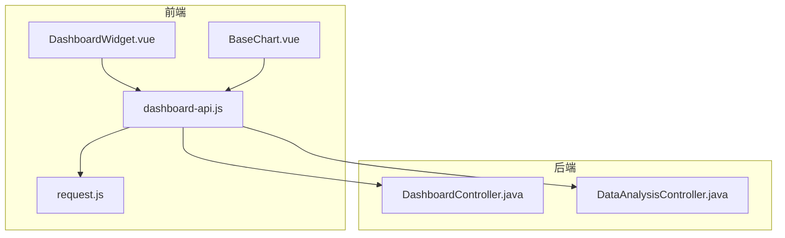
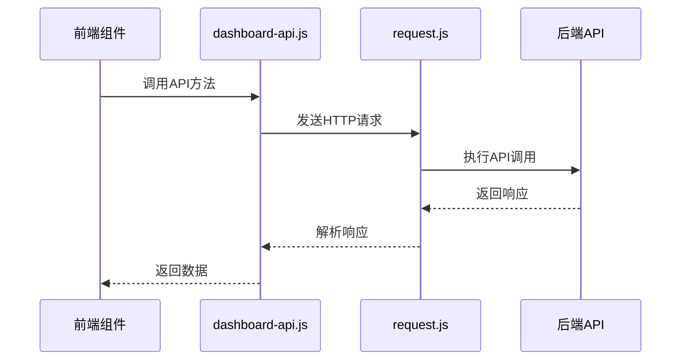
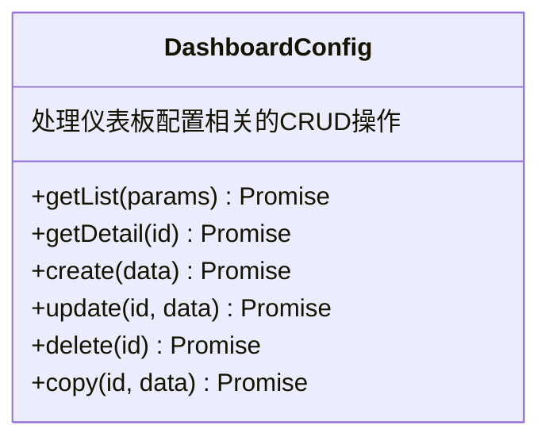
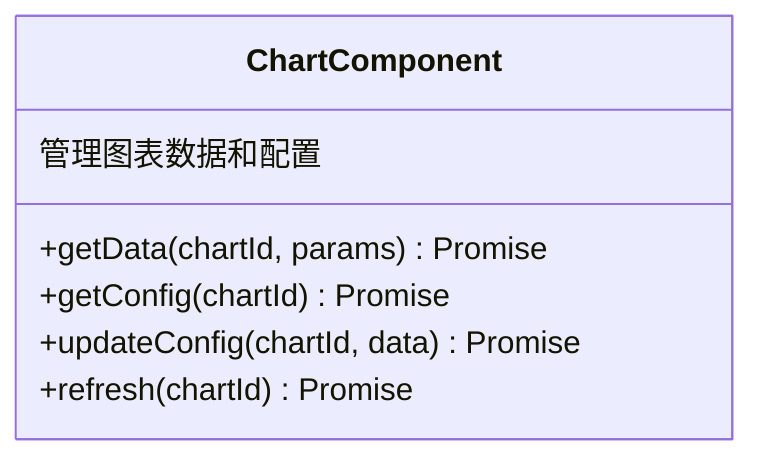
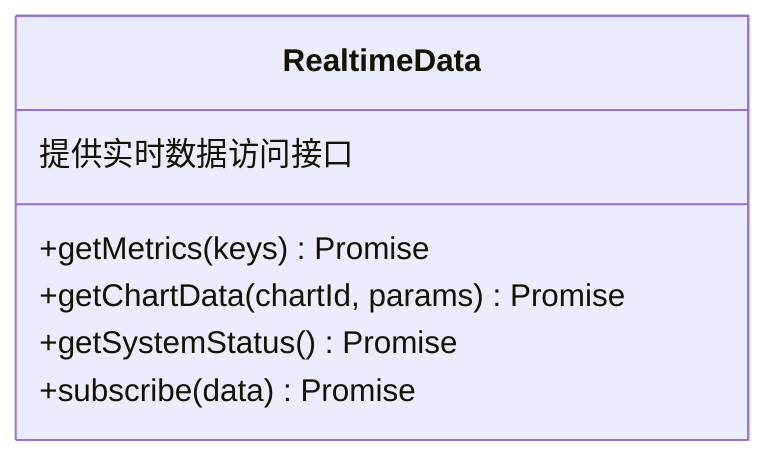
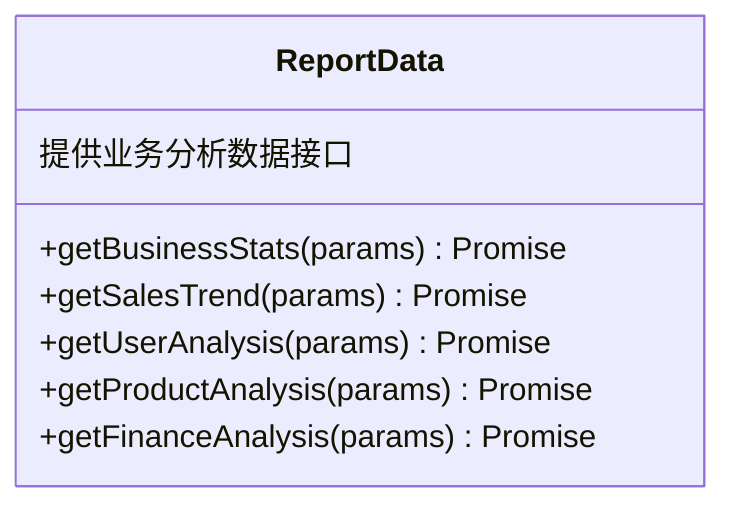
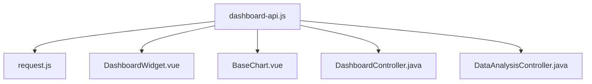

# 仪表板API服务

<cite>
**本文档引用的文件**
- [dashboard-api.js](file://07-frontend/src/services/api/dashboard-api.js)
- [request.js](file://07-frontend/src/utils/request.js)
- [DashboardWidget.vue](file://07-frontend/src/components/common/charts/DashboardWidget.vue)
- [BaseChart.vue](file://07-frontend/src/components/common/charts/BaseChart.vue)
- [KPIChart.vue](file://07-frontend/src/components/common/charts/KPIChart.vue)
- [DashboardController.java](file://08-backend/src/main/java/com/enterprise/brain/modules/analytics/controller/DashboardController.java)
- [DataAnalysisController.java](file://08-backend/src/main/java/com/enterprise/brain/modules/analytics/controller/DataAnalysisController.java)
</cite>

## 目录
1. [引言](#引言)
2. [项目结构](#项目结构)
3. [核心组件](#核心组件)
4. [架构概述](#架构概述)
5. [详细组件分析](#详细组件分析)
6. [依赖分析](#依赖分析)
7. [性能考虑](#性能考虑)
8. [故障排除指南](#故障排除指南)
9. [结论](#结论)

## 引言
仪表板API服务是企业级前端应用中的核心数据服务层，负责为各类数据可视化组件提供统一的数据查询接口。该服务封装了KPI指标、趋势图表、数据表格等组件所需的数据访问逻辑，通过模块化设计实现了数据聚合、时间范围过滤、多维度分析等复杂查询需求。服务层与前端组件协同工作，支持动态数据刷新和交互式分析功能，为用户提供实时、准确的业务洞察。

## 项目结构
仪表板API服务位于前端项目的`services/api`目录下，作为独立的服务模块与其他业务API并列。该服务通过请求工具与后端RESTful API进行通信，为前端组件提供数据支持。

**图示来源**
- [dashboard-api.js](file://07-frontend/src/services/api/dashboard-api.js)
- [request.js](file://07-frontend/src/utils/request.js)
- [DashboardController.java](file://08-backend/src/main/java/com/enterprise/brain/modules/analytics/controller/DashboardController.java)

**章节来源**
- [dashboard-api.js](file://07-frontend/src/services/api/dashboard-api.js)
- [07-frontend/src/services/api](file://07-frontend/src/services/api)

## 核心组件
仪表板API服务由多个功能模块组成，包括仪表盘配置、图表组件、首页数据、实时数据、报表数据、数据导出、个性化设置、权限管理和模板管理等。每个模块提供特定的API接口，满足不同场景下的数据查询需求。

**章节来源**
- [dashboard-api.js](file://07-frontend/src/services/api/dashboard-api.js#L4-L258)

## 架构概述
仪表板API服务采用分层架构设计，前端服务层通过统一的请求工具与后端控制器进行通信。服务层对API调用进行封装，提供简洁的接口供前端组件使用，同时处理请求拦截、响应解析、错误处理等横切关注点。

**图示来源**
- [dashboard-api.js](file://07-frontend/src/services/api/dashboard-api.js)
- [request.js](file://07-frontend/src/utils/request.js)

## 详细组件分析

### 仪表板配置模块分析
仪表板配置模块提供对仪表板生命周期的完整管理，包括创建、读取、更新和删除操作。该模块支持仪表板的复制功能，便于用户快速创建相似的仪表板。

**图示来源**
- [dashboard-api.js](file://07-frontend/src/services/api/dashboard-api.js#L6-L35)

### 图表组件模块分析
图表组件模块负责管理图表数据和配置，支持动态数据刷新。该模块为前端图表组件提供数据支持，确保数据的实时性和准确性。

**图示来源**
- [dashboard-api.js](file://07-frontend/src/services/api/dashboard-api.js#L39-L58)

### 实时数据模块分析
实时数据模块提供实时指标和图表数据的获取接口，支持数据订阅功能。该模块用于构建实时监控系统，为用户提供即时的业务洞察。

**图示来源**
- [dashboard-api.js](file://07-frontend/src/services/api/dashboard-api.js#L90-L109)

### 报表数据模块分析
报表数据模块封装了各类业务分析接口，包括销售趋势、用户分析、产品分析和财务分析等。该模块支持多维度数据分析，满足复杂的业务查询需求。

**图示来源**
- [dashboard-api.js](file://07-frontend/src/services/api/dashboard-api.js#L113-L137)

**章节来源**
- [dashboard-api.js](file://07-frontend/src/services/api/dashboard-api.js#L113-L137)
- [DataAnalysisController.java](file://08-backend/src/main/java/com/enterprise/brain/modules/analytics/controller/DataAnalysisController.java)

## 依赖分析
仪表板API服务依赖于请求工具进行HTTP通信，同时与多个前端组件和后端控制器存在依赖关系。服务层作为中间层，解耦了前端组件与后端API的直接依赖。

**图示来源**
- [dashboard-api.js](file://07-frontend/src/services/api/dashboard-api.js)
- [request.js](file://07-frontend/src/utils/request.js)

**章节来源**
- [dashboard-api.js](file://07-frontend/src/services/api/dashboard-api.js)
- [request.js](file://07-frontend/src/utils/request.js)

## 性能考虑
仪表板API服务通过请求拦截器添加时间戳防止缓存，确保获取最新数据。服务层对响应进行统一处理，优化了错误处理和用户体验。对于大数据量的查询，服务支持分页参数，避免一次性加载过多数据。

## 故障排除指南
当仪表板API服务调用失败时，首先检查网络连接和认证状态。如果返回401状态码，表示认证过期，需要重新登录。对于500错误，可能是后端服务异常，需要检查服务器状态。在开发环境中，可以通过浏览器开发者工具查看具体的请求和响应信息，定位问题原因。

**章节来源**
- [request.js](file://07-frontend/src/utils/request.js#L50-L70)

## 结论
仪表板API服务通过模块化设计，为前端应用提供了统一的数据访问接口。服务层封装了复杂的查询逻辑，简化了前端组件的开发。通过与后端控制器的协同工作，实现了数据聚合、时间范围过滤、多维度分析等复杂功能。该服务支持实时数据刷新和交互式分析，为用户提供了强大的数据可视化能力。