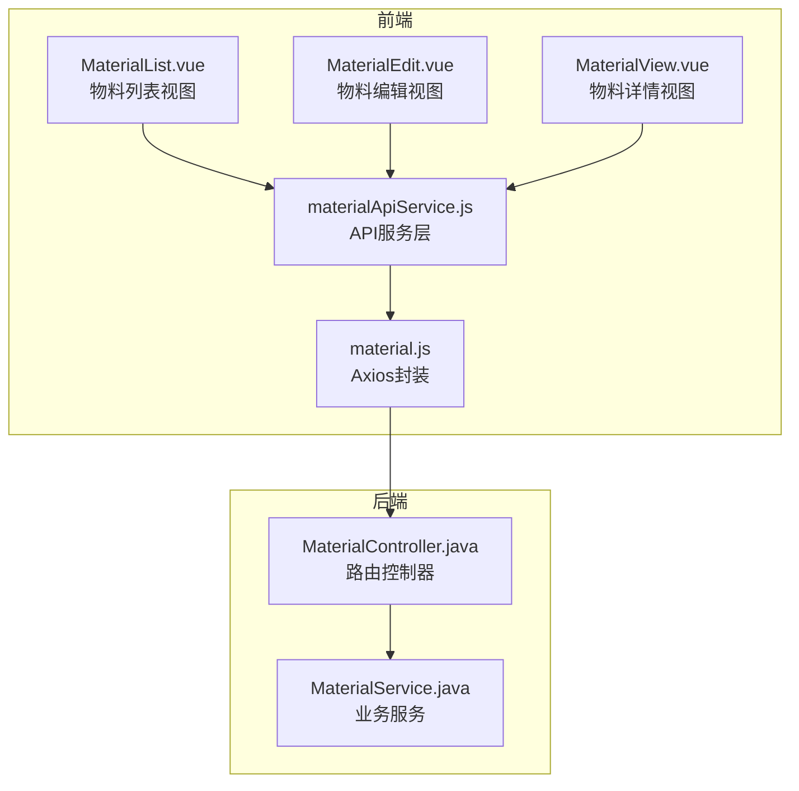
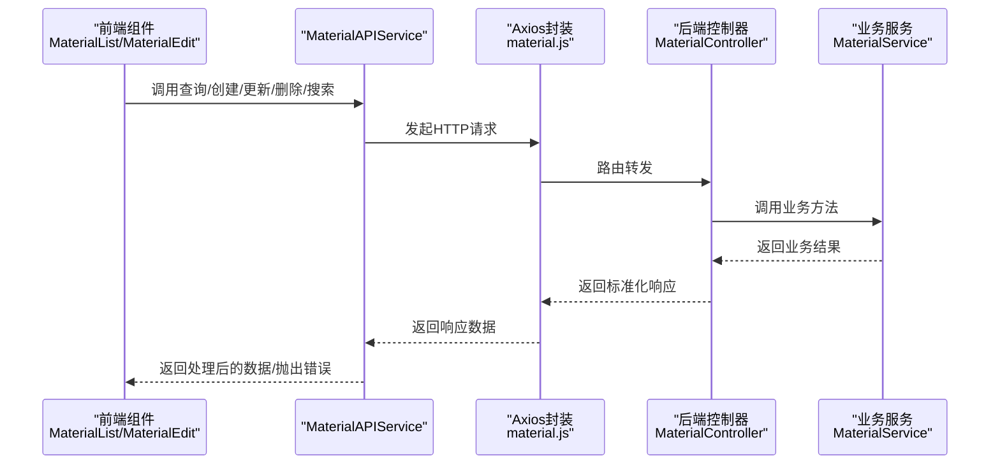
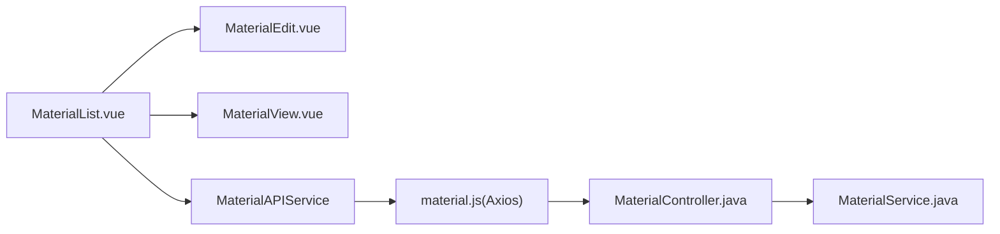

# 物料管理API服务

<cite>
**本文引用的文件**
- [materialApiService.js](file://07-frontend/src/services/api/materialApiService.js)
- [material.js](file://07-frontend/src/api/material.js)
- [MaterialList.vue](file://07-frontend/src/pages/material/MaterialList.vue)
- [MaterialEdit.vue](file://07-frontend/src/pages/material/MaterialEdit.vue)
- [MaterialView.vue](file://07-frontend/src/pages/material/MaterialView.vue)
- [material.js](file://08-backend/src/main/java/com/enterprise/brain/modules/material/controller/MaterialController.java)
- [materialService.js](file://08-backend/src/main/java/com/enterprise/brain/modules/material/service/MaterialService.java)
- [input-validator.js](file://07-frontend/src/utils/validation/input-validator.js)
- [business-rules.js](file://07-frontend/src/utils/validation/business-rules.js)
- [data-transformer.js](file://07-frontend/src/utils/data/data-transformer.js)
- [file-processor.js](file://07-frontend/src/utils/integration/file-processor.js)
</cite>

## 目录
1. [简介](#简介)
2. [项目结构](#项目结构)
3. [核心组件](#核心组件)
4. [架构总览](#架构总览)
5. [详细组件分析](#详细组件分析)
6. [依赖分析](#依赖分析)
7. [性能考量](#性能考量)
8. [故障排查指南](#故障排查指南)
9. [结论](#结论)
10. [附录](#附录)

## 简介
本文件围绕前端物料管理API服务（materialApiService.js）展开，系统性解析其设计与实现，重点说明：
- 如何封装物料的查询、创建、更新、删除等CRUD操作；
- 服务层如何处理命名转换、复杂属性结构、批量操作与导入导出；
- 与前端物料管理组件（列表、编辑、详情）的交互流程；
- 错误处理策略与数据验证规则。

## 项目结构
物料管理相关前端模块位于07-前端目录，后端控制器与服务位于08-后端目录。前端通过materialApiService.js统一调度HTTP请求，后端通过Express路由转发至MaterialService。

图表来源
- [MaterialList.vue](file://07-frontend/src/pages/material/MaterialList.vue#L1-L200)
- [MaterialEdit.vue](file://07-frontend/src/pages/material/MaterialEdit.vue#L1-L120)
- [MaterialView.vue](file://07-frontend/src/pages/material/MaterialView.vue#L1-L109)
- [materialApiService.js](file://07-frontend/src/services/api/materialApiService.js#L1-L211)
- [material.js](file://07-frontend/src/api/material.js#L1-L79)
- [MaterialController.java](file://08-backend/src/main/java/com/enterprise/brain/modules/material/controller/MaterialController.java#L1-L200)
- [MaterialService.java](file://08-backend/src/main/java/com/enterprise/brain/modules/material/service/MaterialService.java#L1-L200)

章节来源
- [MaterialList.vue](file://07-frontend/src/pages/material/MaterialList.vue#L1-L200)
- [materialApiService.js](file://07-frontend/src/services/api/materialApiService.js#L1-L211)
- [material.js](file://07-frontend/src/api/material.js#L1-L79)
- [MaterialController.java](file://08-backend/src/main/java/com/enterprise/brain/modules/material/controller/MaterialController.java#L1-L200)
- [MaterialService.java](file://08-backend/src/main/java/com/enterprise/brain/modules/material/service/MaterialService.java#L1-L200)

## 核心组件
- 物料API服务（MaterialAPIService）：封装后端接口调用，负责命名转换、批量操作、错误处理与日志记录。
- Axios封装（material.js）：统一请求/响应拦截、超时与基础URL配置。
- 前端物料组件：MaterialList.vue（列表）、MaterialEdit.vue（编辑）、MaterialView.vue（详情）。
- 后端控制器与服务：MaterialController.java、MaterialService.java。

章节来源
- [materialApiService.js](file://07-frontend/src/services/api/materialApiService.js#L1-L211)
- [material.js](file://07-frontend/src/api/material.js#L1-L79)
- [MaterialList.vue](file://07-frontend/src/pages/material/MaterialList.vue#L1-L200)
- [MaterialEdit.vue](file://07-frontend/src/pages/material/MaterialEdit.vue#L1-L120)
- [MaterialView.vue](file://07-frontend/src/pages/material/MaterialView.vue#L1-L109)
- [MaterialController.java](file://08-backend/src/main/java/com/enterprise/brain/modules/material/controller/MaterialController.java#L1-L200)
- [MaterialService.java](file://08-backend/src/main/java/com/enterprise/brain/modules/material/service/MaterialService.java#L1-L200)

## 架构总览
前端通过materialApiService.js调用material.js封装的HTTP接口，后端路由MaterialController.java接收请求并委托MaterialService.java执行业务逻辑，最终返回标准响应结构。

图表来源
- [materialApiService.js](file://07-frontend/src/services/api/materialApiService.js#L1-L211)
- [material.js](file://07-frontend/src/api/material.js#L1-L79)
- [MaterialController.java](file://08-backend/src/main/java/com/enterprise/brain/modules/material/controller/MaterialController.java#L1-L200)
- [MaterialService.java](file://08-backend/src/main/java/com/enterprise/brain/modules/material/service/MaterialService.java#L1-L200)

## 详细组件分析

### 物料API服务（MaterialAPIService）
- 查询所有物料：调用后端/list接口，返回后端数据；若响应code为200，则将后端下划线命名转换为驼峰命名，便于前端使用。
- 保存物料：根据是否存在id决定创建或更新；统一处理响应与异常，打印详细日志，包含错误堆栈与响应体。
- 批量保存：调用后端/batch-create接口，返回成功计数。
- 删除物料：支持单删与批量删；统一处理响应与异常。
- 搜索物料：调用后端/search接口，返回匹配结果。
- 下一ID：当前版本后端自动生成ID，前端占位返回固定值。

命名转换逻辑（驼峰化）覆盖字段包括：物料编码、BOM编号、物料名称、尺寸规格、颜色、材质、分类层级、型号、系列、来源、描述、物料图片、基础单位、销售/采购单位与转化率、kg/pcs、pcs/kg、工序名称、标准工额、定额工时、工序单价、采购周期、采购单价、状态、创建/更新时间等。

章节来源
- [materialApiService.js](file://07-frontend/src/services/api/materialApiService.js#L1-L211)

### Axios封装（material.js）
- 基础URL：通过Vite代理统一走/api前缀，避免跨域与端口差异。
- 请求/响应拦截：请求阶段透传配置；响应阶段统一返回data，便于服务层直接消费。
- 接口清单：list、create、batch-create、update、delete、batch-delete、search。

章节来源
- [material.js](file://07-frontend/src/api/material.js#L1-L79)

### 前端物料组件交互

#### 列表组件（MaterialList.vue）
- 工具栏：新增、批量删除、导入、导出、打印、刷新。
- 表格列：覆盖基础属性、销售属性、生产属性、采购属性等关键字段。
- 交互流程：
  - 新增/编辑：打开MaterialEdit对话框，编辑完成后通过emit回调触发保存。
  - 查看：打开MaterialView对话框展示详情。
  - 删除：单删/批量删，调用服务层对应方法。
  - 导入：读取Excel文件，按物料编码比对合并规则更新系统数据，随后批量保存并重新拉取后端数据。
  - 导出：将过滤后的数据转为Excel并下载。
  - 刷新：重新从后端拉取全量数据。

导入合并规则（来源于导入逻辑）：
- 导入表格有、系统表格没有 = 新增
- 导入表格有、系统表格也有 = 保留导入表格的字段
- 导入表格没有、系统表格有 = 保留系统表格

章节来源
- [MaterialList.vue](file://07-frontend/src/pages/material/MaterialList.vue#L1-L200)
- [MaterialList.vue](file://07-frontend/src/pages/material/MaterialList.vue#L549-L702)
- [MaterialList.vue](file://07-frontend/src/pages/material/MaterialList.vue#L704-L762)
- [MaterialList.vue](file://07-frontend/src/pages/material/MaterialList.vue#L769-L786)

#### 编辑组件（MaterialEdit.vue）
- 分类标签页：基础属性、销售属性、技术研发属性、生产属性、采购属性、品质属性、财务属性、仓储属性。
- 表单字段：涵盖物料编码、BOM编号、名称、规格、颜色、材质、分类层级、来源、描述、图片、基础单位、销售/采购单位与转化率、kg/pcs、pcs/kg、工序名称、标准工额、定额工时、工序单价、采购周期、采购单价等。
- 导航：支持上一项/下一项快速切换，保存当前项并导航到相邻项。
- 事件：save（仅保存不关闭）、success（提交并关闭）、cancel（取消）、navigate（导航）。

章节来源
- [MaterialEdit.vue](file://07-frontend/src/pages/material/MaterialEdit.vue#L1-L120)
- [MaterialEdit.vue](file://07-frontend/src/pages/material/MaterialEdit.vue#L120-L215)

#### 详情组件（MaterialView.vue）
- 展示基础属性、销售属性、生产属性、采购属性等字段，支持图片预览与来源标签展示。
- 关闭按钮通过事件回传至父组件。

章节来源
- [MaterialView.vue](file://07-frontend/src/pages/material/MaterialView.vue#L1-L109)

### 后端控制器与服务（MaterialController.java、MaterialService.java）
- 控制器：提供/list、/create、/batch-create、/update/:id、/delete/:id、/batch-delete、/search接口，统一返回code/data/message结构。
- 服务：实现物料的增删改查、批量处理与搜索逻辑，供控制器调用。

章节来源
- [MaterialController.java](file://08-backend/src/main/java/com/enterprise/brain/modules/material/controller/MaterialController.java#L1-L200)
- [MaterialService.java](file://08-backend/src/main/java/com/enterprise/brain/modules/material/service/MaterialService.java#L1-L200)

### 数据结构与命名转换
- 后端返回字段采用下划线命名（如material_code、base_unit等），服务层统一转换为驼峰命名（如materialCode、baseUnit等），保证前后端一致的数据模型。
- 复杂字段如source（来源）在转换时支持字符串解析为数组，便于前端渲染标签。

章节来源
- [materialApiService.js](file://07-frontend/src/services/api/materialApiService.js#L34-L69)

### 批量操作与导入导出
- 批量保存：MaterialList.vue导入完成后，将全量数据克隆后调用服务层批量保存接口，随后重新从后端拉取最新数据。
- 导入：基于Excel解析，按物料编码进行合并更新，遵循“导入有、系统无=新增；导入有、系统也有=覆盖；导入无、系统有=保留”的规则。
- 导出：将过滤后的数据转为Excel，注意字段长度限制（如超过32767字符截断），并以带时间戳的文件名下载。

章节来源
- [MaterialList.vue](file://07-frontend/src/pages/material/MaterialList.vue#L549-L702)
- [MaterialList.vue](file://07-frontend/src/pages/material/MaterialList.vue#L704-L762)

### 错误处理与日志
- 服务层：对每个接口调用try/catch捕获异常，统一抛出错误；在保存流程中打印详细日志（请求体、响应体、错误堆栈）。
- Axios封装：响应拦截器统一返回data，便于上层处理；请求拦截器透传配置。
- 前端组件：对删除、导入、导出、刷新等操作使用Element Plus的消息提示与确认框，增强用户体验。

章节来源
- [materialApiService.js](file://07-frontend/src/services/api/materialApiService.js#L12-L27)
- [materialApiService.js](file://07-frontend/src/services/api/materialApiService.js#L77-L114)
- [materialApiService.js](file://07-frontend/src/services/api/materialApiService.js#L121-L134)
- [materialApiService.js](file://07-frontend/src/services/api/materialApiService.js#L141-L154)
- [materialApiService.js](file://07-frontend/src/services/api/materialApiService.js#L161-L174)
- [materialApiService.js](file://07-frontend/src/services/api/materialApiService.js#L181-L194)
- [material.js](file://07-frontend/src/api/material.js#L31-L40)
- [MaterialList.vue](file://07-frontend/src/pages/material/MaterialList.vue#L403-L446)
- [MaterialList.vue](file://07-frontend/src/pages/material/MaterialList.vue#L549-L702)
- [MaterialList.vue](file://07-frontend/src/pages/material/MaterialList.vue#L704-L762)

### 数据验证与业务规则
- 输入验证：前端提供通用InputValidator，支持必填、字符串、数值、数组、对象、长度、范围、正负、整数/浮点、唯一性、模式匹配等规则。
- 业务规则：提供BusinessRules，支持依赖关系、业务规则约束等，可用于复杂字段联动与业务校验。
- 注意：物料管理组件当前主要依赖前端表单校验与服务层响应错误提示；如需更强的业务规则集成，可在服务层或组件内扩展。

章节来源
- [input-validator.js](file://07-frontend/src/utils/validation/input-validator.js#L1-L200)
- [business-rules.js](file://07-frontend/src/utils/validation/business-rules.js#L1-L225)

### 数据转换与文件处理
- 数据转换：DataTransformer提供深拷贝、数组/对象互转、键名映射、数组扁平化、透视聚合、去重、对象合并、CSV/JSON互转、树形结构转换等能力，可用于导入导出前的数据清洗与格式化。
- 文件处理：FileProcessor支持文件验证、上传（直传/分块）、下载、解析（CSV/JSON）、预览、压缩、合并/分割、格式转换等，可作为导入导出的辅助工具。

章节来源
- [data-transformer.js](file://07-frontend/src/utils/data/data-transformer.js#L1-L200)
- [file-processor.js](file://07-frontend/src/utils/integration/file-processor.js#L1-L200)

## 依赖分析
- 前端依赖关系：
  - MaterialList.vue依赖MaterialEdit.vue、MaterialView.vue与MaterialAPIService。
  - MaterialAPIService依赖material.js（Axios封装）。
  - material.js依赖Element Plus与第三方库（如xlsx）。
- 后端依赖关系：
  - MaterialController.java依赖MaterialService.java。
  - MaterialService.java依赖数据访问层（未在本仓库中展示）。

图表来源
- [MaterialList.vue](file://07-frontend/src/pages/material/MaterialList.vue#L1-L200)
- [MaterialEdit.vue](file://07-frontend/src/pages/material/MaterialEdit.vue#L1-L120)
- [MaterialView.vue](file://07-frontend/src/pages/material/MaterialView.vue#L1-L109)
- [materialApiService.js](file://07-frontend/src/services/api/materialApiService.js#L1-L211)
- [material.js](file://07-frontend/src/api/material.js#L1-L79)
- [MaterialController.java](file://08-backend/src/main/java/com/enterprise/brain/modules/material/controller/MaterialController.java#L1-L200)
- [MaterialService.java](file://08-backend/src/main/java/com/enterprise/brain/modules/material/service/MaterialService.java#L1-L200)

## 性能考量
- 前端列表：当前实现使用本地过滤与分页，适合中小规模数据；大规模数据建议后端分页与筛选。
- 导入导出：导入时一次性读取全量数据并批量保存，建议后端支持分批写入与事务处理，避免内存压力。
- 命名转换：服务层对每条物料进行字段映射，建议在后端统一返回驼峰命名，减少前端转换开销。
- 日志与错误：服务层打印大量日志，建议在生产环境降低日志级别或按需输出。

[本节为通用指导，不涉及具体文件分析]

## 故障排查指南
- 请求失败：检查material.js的响应拦截器是否正确返回data；确认后端路由是否可达。
- 保存失败：查看服务层异常捕获与日志输出，关注错误消息与响应状态。
- 导入异常：确认Excel格式与字段映射；检查导入合并规则是否符合预期。
- 导出异常：确认过滤数据非空；检查字段长度是否超过Excel限制。
- 删除异常：确认ids数组与后端批量删除接口是否匹配。

章节来源
- [material.js](file://07-frontend/src/api/material.js#L31-L40)
- [materialApiService.js](file://07-frontend/src/services/api/materialApiService.js#L77-L114)
- [MaterialList.vue](file://07-frontend/src/pages/material/MaterialList.vue#L549-L702)
- [MaterialList.vue](file://07-frontend/src/pages/material/MaterialList.vue#L704-L762)

## 结论
materialApiService.js通过统一的服务层封装，实现了物料管理的完整CRUD与批量/导入导出能力，并在命名转换、错误处理与日志方面提供了良好的工程实践。结合前端物料组件与后端控制器/服务，形成清晰的职责边界与交互流程。后续可在以下方面优化：
- 后端统一返回驼峰命名，减少前端转换；
- 大数据量场景引入后端分页与筛选；
- 强化业务规则与输入验证的集成；
- 导入导出支持增量与事务处理。

[本节为总结性内容，不涉及具体文件分析]

## 附录
- 物料字段一览（驼峰命名）：materialCode、bomNumber、materialName、sizeSpec、color、material、majorCategory、middleCategory、minorCategory、model、series、source、description、materialImage、baseUnit、saleUnit、saleConversionRate、purchaseUnit、purchaseConversionRate、kgPerPcs、pcsPerKg、processName、standardTime、quotaTime、processPrice、purchaseCycle、purchasePrice、status、createTime、updateTime。
- 命名转换映射参考：convertToCamelCase方法。

章节来源
- [materialApiService.js](file://07-frontend/src/services/api/materialApiService.js#L34-L69)