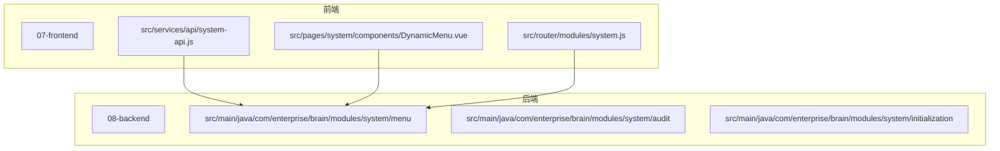
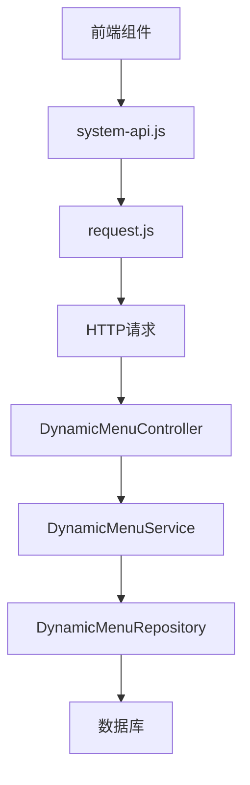
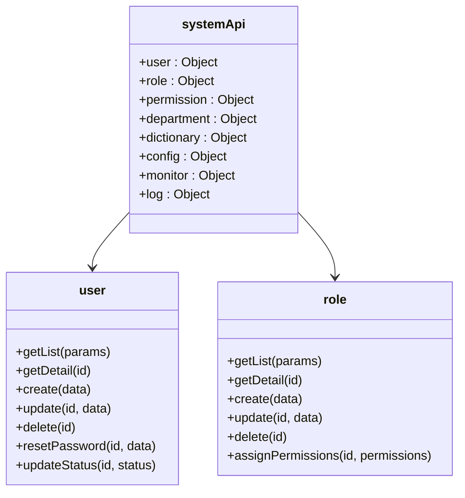
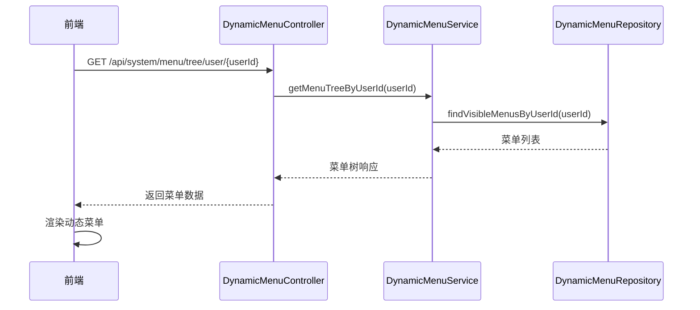
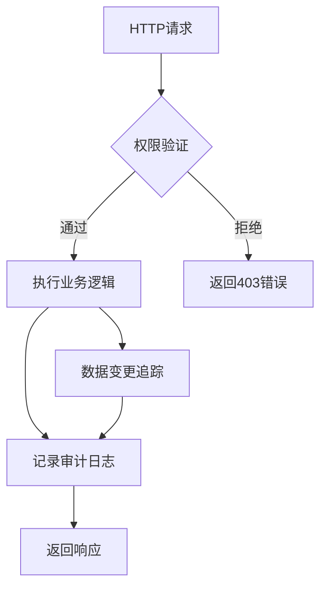
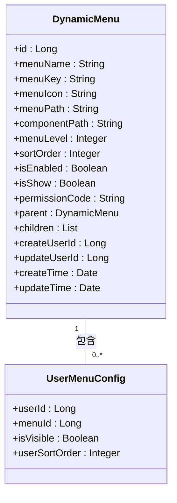
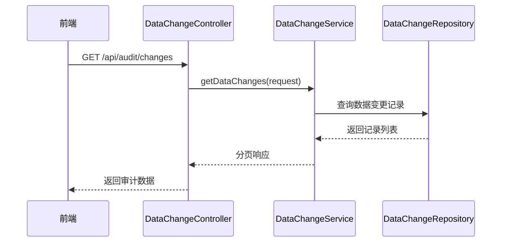
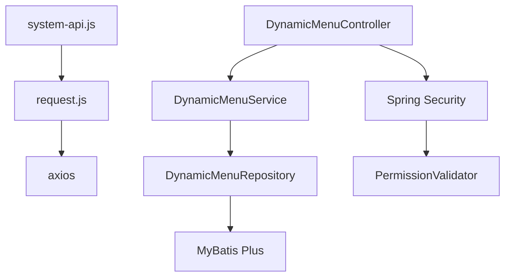

# 系统管理API服务

<cite>
**本文档引用文件**  
- [system-api.js](file://07-frontend/src/services/api/system-api.js)
- [auditService.ts](file://07-frontend/src/services/api/auditService.ts)
- [DynamicMenuController.java](file://08-backend/src/main/java/com/enterprise/brain/modules/system/menu/controller/DynamicMenuController.java)
- [DynamicMenu.java](file://08-backend/src/main/java/com/enterprise/brain/modules/system/menu/entity/DynamicMenu.java)
- [DynamicMenuService.java](file://08-backend/src/main/java/com/enterprise/brain/modules/system/menu/service/DynamicMenuService.java)
- [request.js](file://07-frontend/src/utils/request.js)
- [DataChangeController.java](file://08-backend/src/main/java/com/enterprise/brain/modules/system/audit/controller/DataChangeController.java)
- [DataChangeService.java](file://08-backend/src/main/java/com/enterprise/brain/modules/system/audit/service/DataChangeService.java)
- [DataChangeRecord.java](file://08-backend/src/main/java/com/enterprise/brain/modules/system/audit/entity/DataChangeRecord.java)
- [SystemInitializeService.java](file://08-backend/src/main/java/com/enterprise/brain/modules/system/initialization/service/SystemInitializeService.java)
- [InitializeResponse.java](file://08-backend/src/main/java/com/enterprise/brain/modules/system/initialization/dto/response/InitializeResponse.java)
- [business-rules.js](file://07-frontend/src/utils/validation/business-rules.js)
- [security-rules.md](file://rules/no-sql-web-sdk/security-rules.md)
- [PermissionValidator.java](file://08-backend/src/main/java/com/enterprise/brain/common/security/PermissionValidator.java)
</cite>

## 目录
1. [简介](#简介)
2. [项目结构](#项目结构)
3. [核心组件](#核心组件)
4. [架构概述](#架构概述)
5. [详细组件分析](#详细组件分析)
6. [依赖分析](#依赖分析)
7. [性能考虑](#性能考虑)
8. [故障排除指南](#故障排除指南)
9. [结论](#结论)

## 简介
系统管理API服务是企业级应用的核心管理模块，提供用户管理、角色权限、菜单配置、审计日志等系统级功能的接口封装。该服务通过前后端分离架构实现，前端通过`system-api.js`文件封装RESTful API调用，后端通过Spring Boot实现业务逻辑和安全控制。服务层实现了完整的权限验证、操作审计和数据变更追踪机制，支持多租户环境下的系统配置隔离。

## 项目结构
系统管理功能分布在前端和后端两个主要部分。前端代码位于`07-frontend`目录，包含API服务封装、路由配置和UI组件；后端代码位于`08-backend`目录，包含控制器、服务层、数据访问层和实体类。

**图示来源**  
- [system-api.js](file://07-frontend/src/services/api/system-api.js)
- [DynamicMenuController.java](file://08-backend/src/main/java/com/enterprise/brain/modules/system/menu/controller/DynamicMenuController.java)

**本节来源**  
- [system-api.js](file://07-frontend/src/services/api/system-api.js)
- [DynamicMenuController.java](file://08-backend/src/main/java/com/enterprise/brain/modules/system/menu/controller/DynamicMenuController.java)

## 核心组件
系统管理API服务的核心组件包括用户管理、角色权限、菜单配置、系统监控和操作日志等模块。这些组件通过`system-api.js`文件中的`systemApi`对象进行封装，每个模块提供增删改查等基本操作接口。

**本节来源**  
- [system-api.js](file://07-frontend/src/services/api/system-api.js)

## 架构概述
系统管理API服务采用分层架构设计，包括前端API封装层、后端控制器层、服务层和数据访问层。前端通过`request.js`工具类发送HTTP请求，后端通过Spring Security和自定义注解实现权限控制和操作审计。

**图示来源**  
- [system-api.js](file://07-frontend/src/services/api/system-api.js)
- [request.js](file://07-frontend/src/utils/request.js)
- [DynamicMenuController.java](file://08-backend/src/main/java/com/enterprise/brain/modules/system/menu/controller/DynamicMenuController.java)
- [DynamicMenuService.java](file://08-backend/src/main/java/com/enterprise/brain/modules/system/menu/service/DynamicMenuService.java)

## 详细组件分析

### 用户与权限管理分析
系统管理API服务提供了完整的用户和权限管理功能。用户管理模块支持用户列表获取、详情查询、创建、更新、删除、密码重置和状态变更等操作。角色管理模块支持角色的增删改查和权限分配功能。

**图示来源**  
- [system-api.js](file://07-frontend/src/services/api/system-api.js)

**本节来源**  
- [system-api.js](file://07-frontend/src/services/api/system-api.js)

### 动态菜单加载分析
动态菜单功能允许系统根据用户权限动态加载和配置菜单。前端通过`DynamicMenu.vue`组件实现菜单渲染，后端通过`DynamicMenuController`提供菜单树接口。

**图示来源**  
- [DynamicMenuController.java](file://08-backend/src/main/java/com/enterprise/brain/modules/system/menu/controller/DynamicMenuController.java)
- [DynamicMenuService.java](file://08-backend/src/main/java/com/enterprise/brain/modules/system/menu/service/DynamicMenuService.java)
- [DynamicMenuRepository.java](file://08-backend/src/main/java/com/enterprise/brain/modules/system/menu/repository/DynamicMenuRepository.java)
- [DynamicMenu.vue](file://07-frontend/src/pages/system/components/DynamicMenu.vue)

**本节来源**  
- [DynamicMenuController.java](file://08-backend/src/main/java/com/enterprise/brain/modules/system/menu/controller/DynamicMenuController.java)
- [DynamicMenu.vue](file://07-frontend/src/pages/system/components/DynamicMenu.vue)

### 安全控制分析
系统管理API服务实现了多层次的安全控制机制。后端通过`@PreAuthorize`注解和`PermissionValidator`类实现权限验证，通过`@AuditLogAnnotation`注解实现操作审计。

**图示来源**  
- [DynamicMenuController.java](file://08-backend/src/main/java/com/enterprise/brain/modules/system/menu/controller/DynamicMenuController.java)
- [PermissionValidator.java](file://08-backend/src/main/java/com/enterprise/brain/common/security/PermissionValidator.java)

**本节来源**  
- [DynamicMenuController.java](file://08-backend/src/main/java/com/enterprise/brain/modules/system/menu/controller/DynamicMenuController.java)
- [PermissionValidator.java](file://08-backend/src/main/java/com/enterprise/brain/common/security/PermissionValidator.java)

### 系统配置与多租户分析
系统配置管理模块支持配置的获取、更新和批量更新操作。多租户支持通过用户ID隔离不同租户的配置数据，确保数据安全和隔离。

**图示来源**  
- [DynamicMenu.java](file://08-backend/src/main/java/com/enterprise/brain/modules/system/menu/entity/DynamicMenu.java)

**本节来源**  
- [DynamicMenu.java](file://08-backend/src/main/java/com/enterprise/brain/modules/system/menu/entity/DynamicMenu.java)
- [SystemInitializeService.java](file://08-backend/src/main/java/com/enterprise/brain/modules/system/initialization/service/SystemInitializeService.java)

### 审计日志分析
审计日志功能记录所有敏感操作，包括数据变更、用户操作和系统事件。后端通过`DataChangeController`和`DataChangeService`提供数据变更记录的查询和存储接口。

**图示来源**  
- [DataChangeController.java](file://08-backend/src/main/java/com/enterprise/brain/modules/system/audit/controller/DataChangeController.java)
- [DataChangeService.java](file://08-backend/src/main/java/com/enterprise/brain/modules/system/audit/service/DataChangeService.java)
- [DataChangeRecord.java](file://08-backend/src/main/java/com/enterprise/brain/modules/system/audit/entity/DataChangeRecord.java)

**本节来源**  
- [DataChangeController.java](file://08-backend/src/main/java/com/enterprise/brain/modules/system/audit/controller/DataChangeController.java)
- [auditService.ts](file://07-frontend/src/services/api/auditService.ts)

## 依赖分析
系统管理API服务依赖于多个核心组件和外部服务。前端依赖`request.js`进行HTTP通信，后端依赖Spring Security进行权限控制，MyBatis Plus进行数据访问。

**图示来源**  
- [system-api.js](file://07-frontend/src/services/api/system-api.js)
- [request.js](file://07-frontend/src/utils/request.js)
- [DynamicMenuController.java](file://08-backend/src/main/java/com/enterprise/brain/modules/system/menu/controller/DynamicMenuController.java)

**本节来源**  
- [system-api.js](file://07-frontend/src/services/api/system-api.js)
- [request.js](file://07-frontend/src/utils/request.js)

## 性能考虑
系统管理API服务在设计时考虑了性能优化。前端通过请求拦截器添加缓存控制，后端通过分页查询和索引优化提高数据访问效率。动态菜单加载采用树形结构查询，减少数据库访问次数。

## 故障排除指南
当系统管理功能出现问题时，可以按照以下步骤进行排查：
1. 检查前端网络请求是否正常发送
2. 验证后端接口是否返回正确的HTTP状态码
3. 查看权限配置是否正确
4. 检查数据库连接和查询性能
5. 查阅审计日志定位问题根源

**本节来源**  
- [request.js](file://07-frontend/src/utils/request.js)
- [DynamicMenuController.java](file://08-backend/src/main/java/com/enterprise/brain/modules/system/menu/controller/DynamicMenuController.java)

## 结论
系统管理API服务通过前后端分离架构实现了完整的系统管理功能。服务层提供了用户管理、角色权限、菜单配置、审计日志等核心功能的接口封装，通过权限验证、操作审计和数据变更追踪机制确保系统安全。动态菜单加载和多租户支持使系统具有良好的灵活性和可扩展性，能够满足企业级应用的复杂需求。