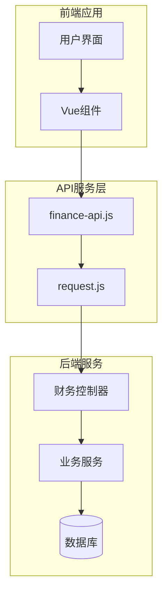
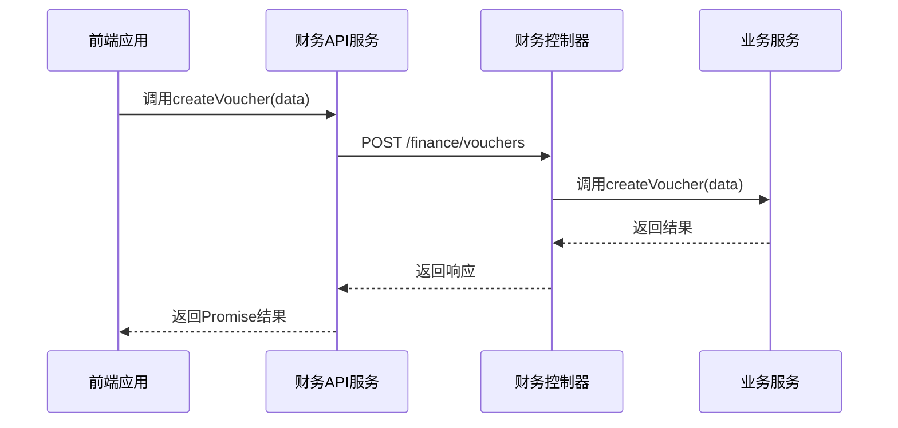
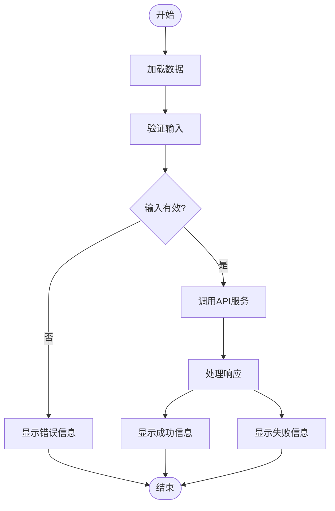

# 财务模块API服务

<cite>
**本文档引用文件**   
- [finance-api.js](file://07-frontend/src/services/api/finance-api.js)
- [request.js](file://07-frontend/src/utils/request.js)
- [accountReceivableApi.js](file://07-frontend/src/api/finance/accountReceivableApi.js)
- [collectionApi.js](file://07-frontend/src/api/finance/collectionApi.js)
- [AccountsReceivableController.java](file://08-backend/src/main/java/com/enterprise/brain/modules/finance/controller/AccountsReceivableController.java)
- [GeneralLedgerList.vue](file://07-frontend/src/pages/finance/general-ledger/GeneralLedgerList.vue)
- [VoucherEntry.vue](file://07-frontend/src/pages/finance/general-ledger/VoucherEntry.vue)
</cite>

## 目录
1. [引言](#引言)
2. [财务API服务架构](#财务api服务架构)
3. [核心财务功能实现](#核心财务功能实现)
4. [财务数据特殊处理](#财务数据特殊处理)
5. [服务层设计模式与参数验证](#服务层设计模式与参数验证)
6. [前端组件与API服务集成](#前端组件与api服务集成)
7. [安全与审计追踪](#安全与审计追踪)
8. [总结](#总结)

## 引言
财务模块API服务是企业管理系统中至关重要的组成部分，负责封装和管理所有财务相关的业务操作。该服务通过统一的接口层，为前端应用提供账户应收、应付账款、财务报表、预算管理等核心财务功能的访问能力。服务层不仅实现了与后端财务控制器的映射，还特别关注财务数据的特殊需求，如金额精度处理、财务期间验证和多币种支持。通过精心设计的服务方法和严格的参数验证机制，确保了财务数据操作的安全性和准确性，同时提供了完善的审计追踪能力。

## 财务API服务架构
财务API服务采用模块化设计，将不同的财务功能划分为独立的子模块，每个模块封装了特定领域的API调用。这种架构提高了代码的可维护性和可扩展性，使得开发人员可以专注于特定功能的开发和优化。

**图示来源**
- [finance-api.js](file://07-frontend/src/services/api/finance-api.js)
- [request.js](file://07-frontend/src/utils/request.js)
- [AccountsReceivableController.java](file://08-backend/src/main/java/com/enterprise/brain/modules/finance/controller/AccountsReceivableController.java)

**本节来源**
- [finance-api.js](file://07-frontend/src/services/api/finance-api.js)
- [request.js](file://07-frontend/src/utils/request.js)

## 核心财务功能实现
财务API服务实现了多个核心财务功能模块，包括财务科目管理、凭证管理、账簿管理、财务报表、收支管理、预算管理、资金管理和税务管理。每个模块都提供了完整的CRUD（创建、读取、更新、删除）操作，以及特定业务场景下的特殊功能。

### 财务科目管理
财务科目管理模块提供了对会计科目的全面管理功能，包括获取科目列表、获取科目树、获取科目详情、创建科目、更新科目和删除科目。这些功能通过`financeApi.account`对象暴露，使用标准的HTTP方法与后端进行通信。

### 凭证管理
凭证管理模块是财务系统的核心，负责处理所有会计凭证的操作。该模块提供了获取凭证列表、获取凭证详情、创建凭证、更新凭证、删除凭证、审核凭证、反审核凭证和导出凭证等功能。特别是审核和反审核功能，确保了财务数据的准确性和合规性。

### 账簿管理
账簿管理模块提供了多种账簿的查询和导出功能，包括明细账、总账、日记账和科目余额表。这些功能帮助财务人员全面了解企业的财务状况，支持日常的账务核对和审计工作。

### 财务报表
财务报表模块提供了生成和导出主要财务报表的能力，包括资产负债表、利润表、现金流量表和所有者权益变动表。这些报表是企业财务分析和决策的重要依据。

### 收支管理
收支管理模块处理企业的收入和支出记录，支持创建、更新和删除收支记录。该模块还提供了获取收入和支出列表的功能，便于财务人员跟踪企业的现金流。

### 预算管理
预算管理模块支持预算的创建、更新、删除和执行情况查询。通过预算调整功能，企业可以根据实际情况灵活调整预算计划，确保财务目标的实现。

### 资金管理
资金管理模块关注企业的资金流动，提供了账户管理、资金流水查询、资金余额查询、资金转账和资金报表生成等功能。这些功能帮助企业有效管理现金流，优化资金使用效率。

### 税务管理
税务管理模块处理企业的税务相关事务，包括税种管理、税额计算、税务申报和发票管理。通过发票认证功能，确保了税务数据的准确性和合规性。

### 成本管理
成本管理模块支持成本中心管理、成本分摊、成本核算和成本报表生成。这些功能帮助企业精确计算产品和服务的成本，支持定价决策和成本控制。

**本节来源**
- [finance-api.js](file://07-frontend/src/services/api/finance-api.js)

## 财务数据特殊处理
财务数据的处理需要特别关注精度、期间验证和多币种支持等特殊需求。服务层通过一系列机制确保这些需求得到满足。

### 金额精度处理
财务数据中的金额通常需要高精度处理，以避免计算误差。服务层通过使用高精度的数据类型和专门的计算函数，确保金额的精确性。例如，在处理借贷金额时，系统会自动计算借方合计和贷方合计，并验证两者是否平衡。

### 财务期间验证
财务期间是财务数据的重要属性，确保数据按正确的会计期间进行归集和报告。服务层在处理财务数据时，会验证财务期间的有效性，防止跨期记账等错误。

### 多币种支持
对于跨国企业，多币种支持是必不可少的。服务层通过汇率转换机制，支持不同币种之间的转换和计算。在生成财务报表时，系统可以根据需要将不同币种的数据转换为统一的报告货币。

**本节来源**
- [finance-api.js](file://07-frontend/src/services/api/finance-api.js)
- [request.js](file://07-frontend/src/utils/request.js)

## 服务层设计模式与参数验证
服务层采用了多种设计模式和参数验证机制，确保API调用的可靠性和安全性。

### 设计模式
服务层采用了模块化设计模式，将不同的财务功能划分为独立的模块。每个模块内部采用了工厂模式，根据不同的业务场景创建相应的服务实例。此外，服务层还使用了装饰器模式，在不修改原有代码的情况下，为API调用添加额外的功能，如日志记录和性能监控。

### 参数验证机制
参数验证是确保API调用安全性的关键。服务层在调用API之前，会对传入的参数进行严格的验证。例如，在创建凭证时，系统会验证凭证日期、凭证字号和附件数等参数的有效性。如果参数验证失败，系统会返回相应的错误信息，防止无效数据进入系统。

### 与后端财务控制器的映射关系
服务层与后端财务控制器之间存在明确的映射关系。每个API调用都对应后端控制器中的一个方法。例如，`financeApi.voucher.create`方法对应后端`VoucherController`中的`createVoucher`方法。这种映射关系通过统一的API路径和HTTP方法实现，确保了前后端的无缝集成。

**图示来源**
- [finance-api.js](file://07-frontend/src/services/api/finance-api.js)
- [AccountsReceivableController.java](file://08-backend/src/main/java/com/enterprise/brain/modules/finance/controller/AccountsReceivableController.java)

**本节来源**
- [finance-api.js](file://07-frontend/src/services/api/finance-api.js)
- [AccountsReceivableController.java](file://08-backend/src/main/java/com/enterprise/brain/modules/finance/controller/AccountsReceivableController.java)

## 前端组件与API服务集成
前端组件通过导入和使用财务API服务，实现了与后端财务功能的集成。以总账列表组件为例，该组件通过`generalLedgerApi`对象调用`getGeneralLedgerList`方法，获取总账数据并显示在表格中。

### 总账列表组件
总账列表组件展示了如何使用财务API服务获取和显示总账数据。组件通过`onMounted`生命周期钩子，在页面加载时调用`loadLedgerList`方法，获取总账列表。该方法内部调用了`generalLedgerApi.getGeneralLedgerList`，并将返回的数据绑定到`ledgerList`响应式变量中。

### 凭证录入组件
凭证录入组件展示了如何使用财务API服务创建和保存凭证。组件通过`submitForm`方法，在用户点击"保存凭证"按钮时，调用`voucherApi.createVoucher`方法，将凭证数据提交到后端。在提交之前，组件会验证凭证的借贷平衡性，确保数据的准确性。

**图示来源**
- [GeneralLedgerList.vue](file://07-frontend/src/pages/finance/general-ledger/GeneralLedgerList.vue)
- [VoucherEntry.vue](file://07-frontend/src/pages/finance/general-ledger/VoucherEntry.vue)

**本节来源**
- [GeneralLedgerList.vue](file://07-frontend/src/pages/finance/general-ledger/GeneralLedgerList.vue)
- [VoucherEntry.vue](file://07-frontend/src/pages/finance/general-ledger/VoucherEntry.vue)

## 安全与审计追踪
财务数据操作的安全性和审计追踪能力是财务系统的重要要求。服务层通过多种机制确保这些要求得到满足。

### 安全性
服务层通过请求拦截器，在每个API调用中自动添加认证令牌，确保只有授权用户才能访问财务数据。此外，服务层还实现了错误处理机制，在请求失败时提供友好的错误提示，并在必要时重定向到登录页面。

### 审计追踪
后端财务控制器通过注解和日志记录，实现了对财务数据操作的审计追踪。每个API调用都会被记录到审计日志中，包括操作时间、操作用户、操作类型和操作结果。这些日志可以用于后续的审计和问题排查。

**本节来源**
- [request.js](file://07-frontend/src/utils/request.js)
- [AccountsReceivableController.java](file://08-backend/src/main/java/com/enterprise/brain/modules/finance/controller/AccountsReceivableController.java)

## 总结
财务模块API服务通过模块化设计和丰富的功能实现，为前端应用提供了全面的财务功能支持。服务层不仅实现了与后端财务控制器的映射，还特别关注财务数据的特殊需求，如金额精度处理、财务期间验证和多币种支持。通过精心设计的服务方法和严格的参数验证机制，确保了财务数据操作的安全性和准确性。前端组件通过导入和使用财务API服务，实现了与后端财务功能的无缝集成。未来，可以进一步优化服务层的性能，增加更多的财务分析功能，提升系统的整体价值。