# 销售模块API服务

<cite>
**本文档引用文件**   
- [sales-api.js](file://07-frontend/src/services/api/sales-api.js)
- [sales.js](file://07-frontend/src/router/modules/sales.js)
- [request.js](file://07-frontend/src/utils/request.js)
- [business-calculator.js](file://07-frontend/src/utils/business/business-calculator.js)
- [business-rules.js](file://07-frontend/src/utils/validation/business-rules.js)
- [useRealTimeSales.js](file://07-frontend/src/composables/useRealTimeSales.js)
- [sales.js](file://backend/models/sales.js)
- [005_create_sales_tables.js](file://backend/migrations/005_create_sales_tables.js)
- [SalesDashboard.vue](file://07-frontend/src/pages/dashboard/SalesDashboard.vue)
- [SalesOrderForm.vue](file://07-frontend/src/pages/sales/orders/SalesOrderForm.vue)
- [QuotationConvert.vue](file://07-frontend/src/pages/quotation/QuotationConvert.vue)
</cite>

## 目录
1. [引言](#引言)
2. [项目结构](#项目结构)
3. [核心组件](#核心组件)
4. [架构概述](#架构概述)
5. [详细组件分析](#详细组件分析)
6. [依赖分析](#依赖分析)
7. [性能考虑](#性能考虑)
8. [故障排除指南](#故障排除指南)
9. [结论](#结论)

## 引言
销售模块API服务是企业销售管理系统的核心组成部分，负责封装销售订单、客户管理、报价单、销售合同等核心业务接口。该服务通过清晰的模块化设计，实现了销售业务流程中的复杂状态转换，如订单审批流、报价转订单、销售退货等场景。服务层与前端销售组件紧密协同，支持销售漏斗分析和业绩预测功能，为销售团队提供全面的业务支持。

## 项目结构
销售模块的项目结构体现了前后端分离的设计理念。前端代码位于`07-frontend`目录，后端代码位于`backend`目录。前端通过API服务层与后端进行通信，实现了业务逻辑与界面展示的分离。

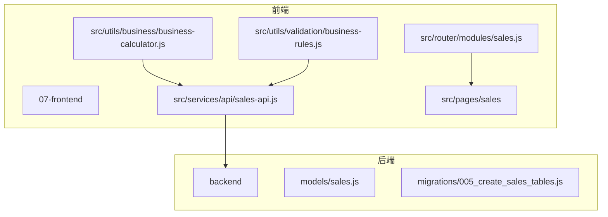

**图表来源**
- [sales-api.js](file://07-frontend/src/services/api/sales-api.js)
- [sales.js](file://07-frontend/src/router/modules/sales.js)
- [business-calculator.js](file://07-frontend/src/utils/business/business-calculator.js)
- [business-rules.js](file://07-frontend/src/utils/validation/business-rules.js)
- [sales.js](file://backend/models/sales.js)
- [005_create_sales_tables.js](file://backend/migrations/005_create_sales_tables.js)

**章节来源**
- [sales-api.js](file://07-frontend/src/services/api/sales-api.js)
- [sales.js](file://07-frontend/src/router/modules/sales.js)
- [sales.js](file://backend/models/sales.js)
- [005_create_sales_tables.js](file://backend/migrations/005_create_sales_tables.js)

## 核心组件
销售模块API服务的核心组件包括客户管理、销售订单、销售报价、销售合同、销售机会、销售目标、销售统计和销售团队等模块。每个模块都提供了完整的CRUD操作和特定业务流程的处理方法。

**章节来源**
- [sales-api.js](file://07-frontend/src/services/api/sales-api.js)

## 架构概述
销售模块API服务采用分层架构设计，包括API服务层、业务逻辑层、数据访问层和数据库层。API服务层提供统一的接口供前端调用，业务逻辑层处理复杂的业务规则和流程，数据访问层负责与数据库交互，数据库层存储所有销售相关数据。

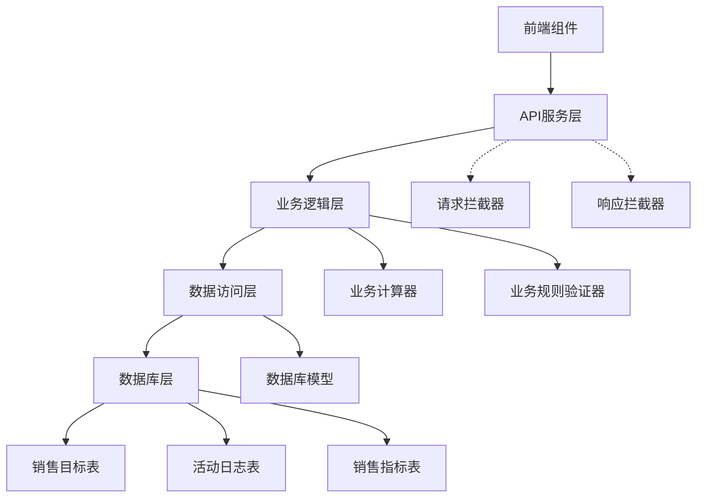

**图表来源**
- [sales-api.js](file://07-frontend/src/services/api/sales-api.js)
- [request.js](file://07-frontend/src/utils/request.js)
- [business-calculator.js](file://07-frontend/src/utils/business/business-calculator.js)
- [business-rules.js](file://07-frontend/src/utils/validation/business-rules.js)
- [sales.js](file://backend/models/sales.js)

## 详细组件分析

### 客户管理模块分析
客户管理模块提供了客户列表获取、客户详情查看、客户创建、客户更新和客户删除等基本操作。此外，还支持获取客户联系人、添加联系人和获取客户订单历史等高级功能。

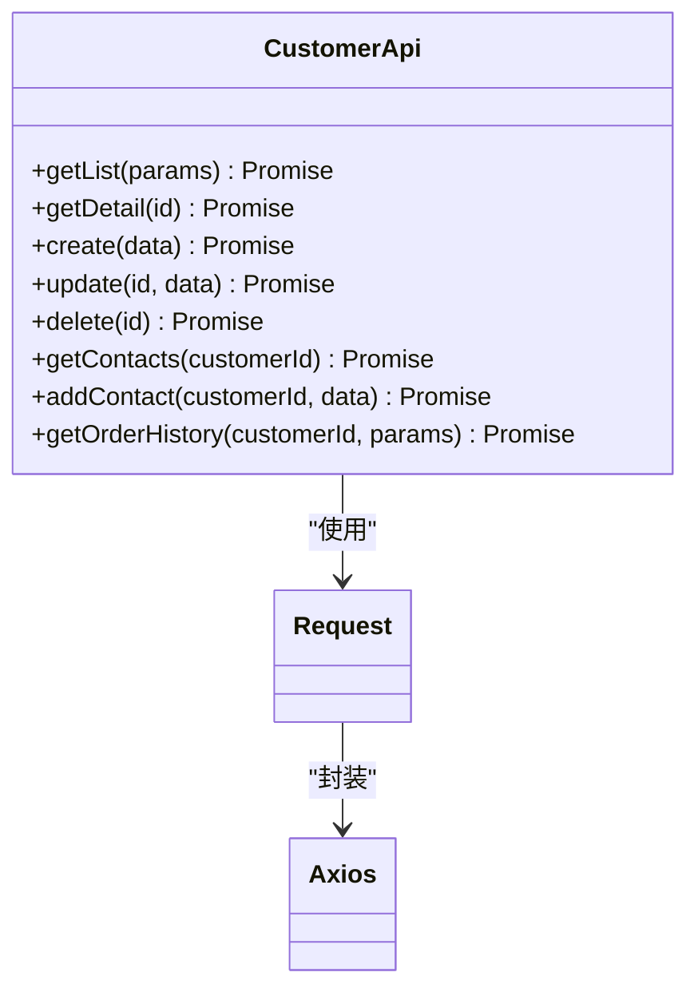

**图表来源**
- [sales-api.js](file://07-frontend/src/services/api/sales-api.js)
- [request.js](file://07-frontend/src/utils/request.js)

### 销售订单模块分析
销售订单模块是销售系统的核心，提供了订单的全生命周期管理。从订单创建、更新、删除，到订单审核、发货、完成和取消，每个状态转换都有相应的API方法支持。

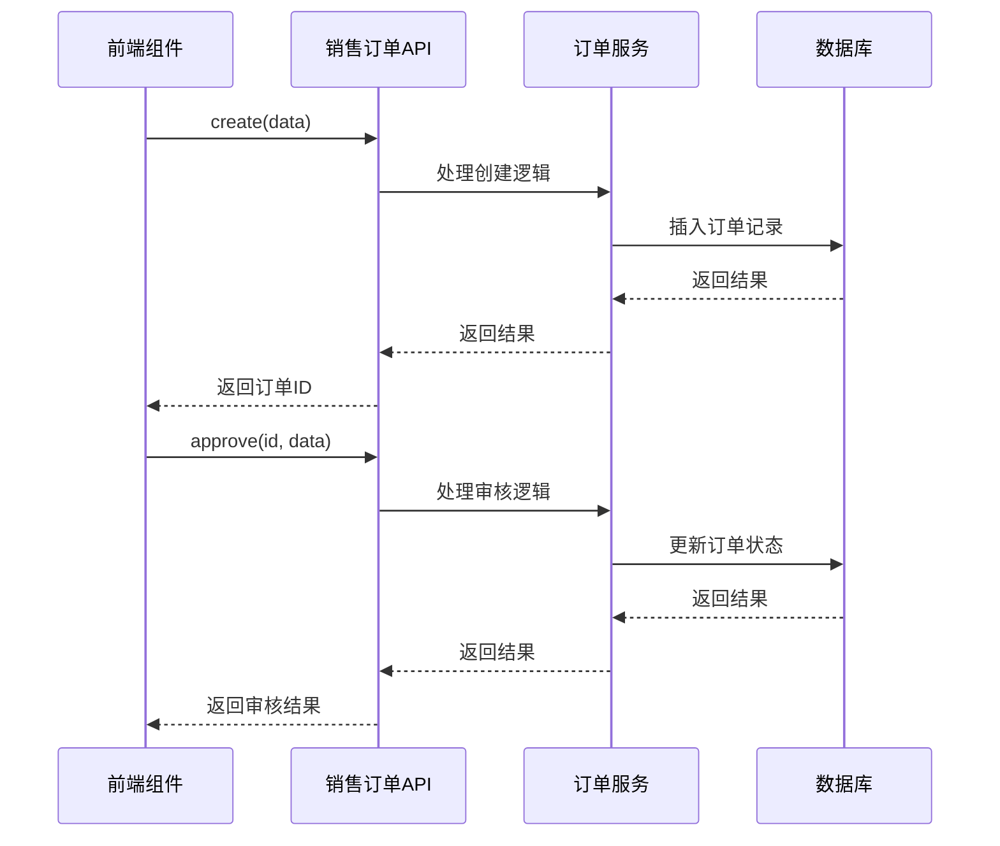

**图表来源**
- [sales-api.js](file://07-frontend/src/services/api/sales-api.js)
- [SalesOrderForm.vue](file://07-frontend/src/pages/sales/orders/SalesOrderForm.vue)

### 销售报价模块分析
销售报价模块支持报价的创建、管理以及向订单的转换。报价转订单功能是销售流程中的关键环节，确保了报价信息能够无缝传递到订单系统。

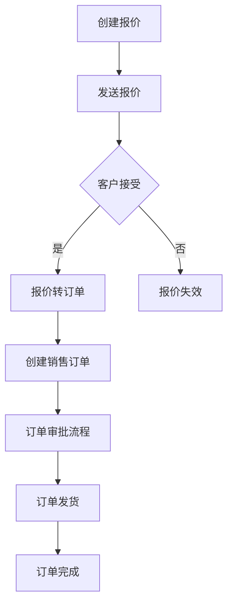

**图表来源**
- [sales-api.js](file://07-frontend/src/services/api/sales-api.js)
- [QuotationConvert.vue](file://07-frontend/src/pages/quotation/QuotationConvert.vue)

### 销售合同模块分析
销售合同模块管理销售合同的全生命周期，包括合同的创建、签署和终止。合同管理确保了销售交易的法律效力和合规性。

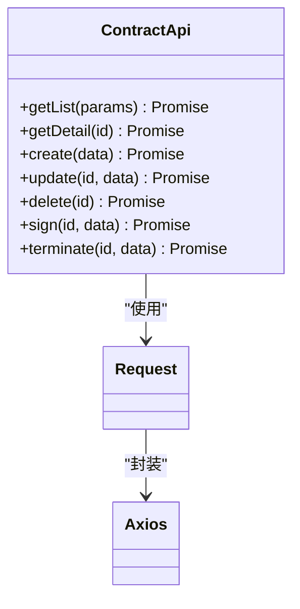

**图表来源**
- [sales-api.js](file://07-frontend/src/services/api/sales-api.js)
- [request.js](file://07-frontend/src/utils/request.js)

### 销售机会模块分析
销售机会模块支持销售漏斗管理，通过推进阶段、赢单和输单等操作，帮助销售团队跟踪和管理潜在客户。

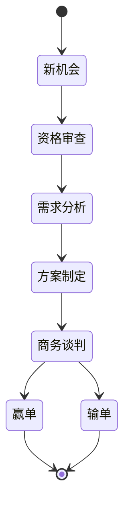

**图表来源**
- [sales-api.js](file://07-frontend/src/services/api/sales-api.js)

### 销售目标模块分析
销售目标模块帮助销售团队设定和跟踪销售目标，支持按收入、订单、客户和利润等不同类型的目标管理。

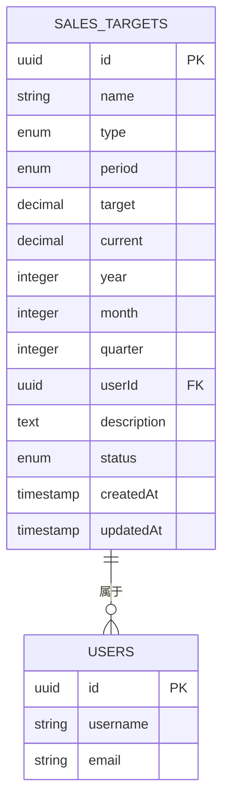

**图表来源**
- [sales.js](file://backend/models/sales.js)
- [005_create_sales_tables.js](file://backend/migrations/005_create_sales_tables.js)

### 销售统计模块分析
销售统计模块提供销售概览、销售趋势、销售排行、客户分析和产品分析等统计功能，支持销售业绩的全面分析。

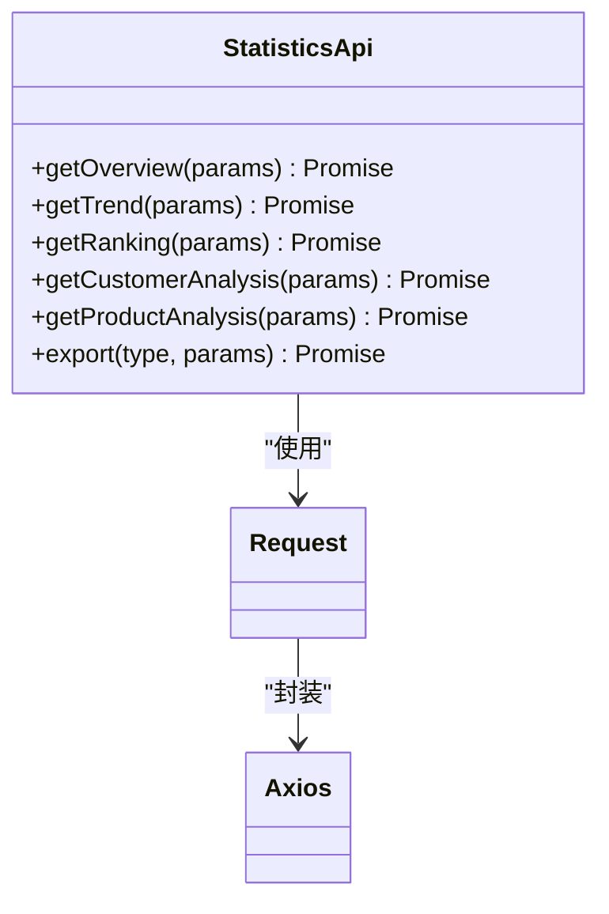

**图表来源**
- [sales-api.js](file://07-frontend/src/services/api/sales-api.js)
- [request.js](file://07-frontend/src/utils/request.js)

### 销售团队模块分析
销售团队模块管理销售团队的组织结构，支持团队的创建、成员分配和团队信息维护。

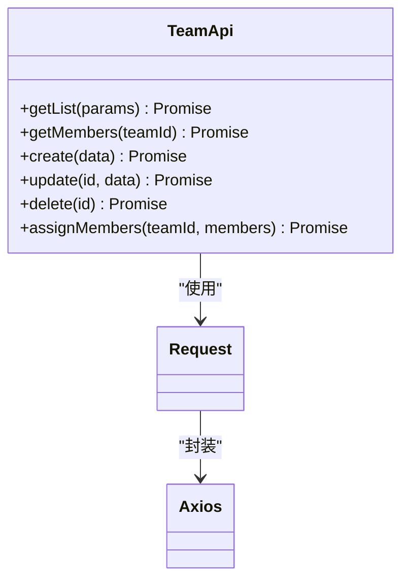

**图表来源**
- [sales-api.js](file://07-frontend/src/services/api/sales-api.js)
- [request.js](file://07-frontend/src/utils/request.js)

### 销售活动模块分析
销售活动模块记录和管理销售相关的各种活动，如客户拜访、电话沟通等，帮助销售团队跟踪客户互动。

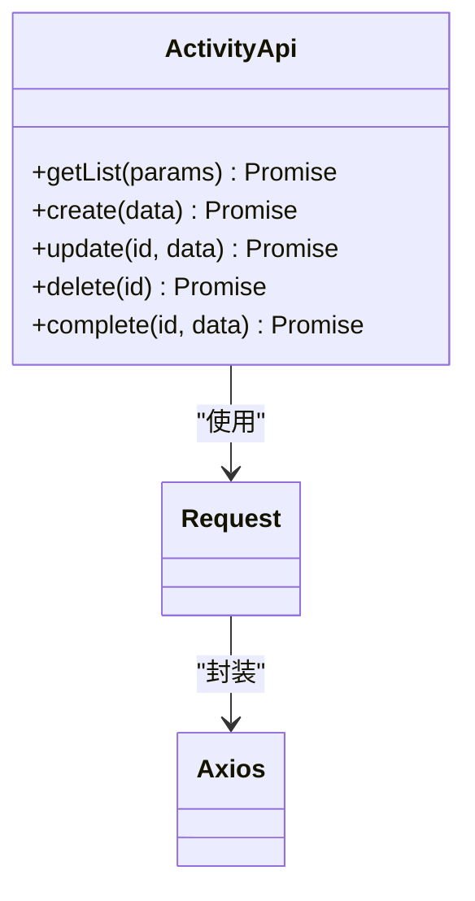

**图表来源**
- [sales-api.js](file://07-frontend/src/services/api/sales-api.js)
- [request.js](file://07-frontend/src/utils/request.js)

**章节来源**
- [sales-api.js](file://07-frontend/src/services/api/sales-api.js)

## 依赖分析
销售模块API服务依赖于多个核心组件和工具，包括请求工具、业务计算器、业务规则验证器和实时销售数据组件。这些依赖关系确保了服务的完整性和可靠性。

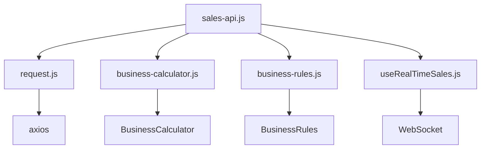

**图表来源**
- [sales-api.js](file://07-frontend/src/services/api/sales-api.js)
- [request.js](file://07-frontend/src/utils/request.js)
- [business-calculator.js](file://07-frontend/src/utils/business/business-calculator.js)
- [business-rules.js](file://07-frontend/src/utils/validation/business-rules.js)
- [useRealTimeSales.js](file://07-frontend/src/composables/useRealTimeSales.js)

**章节来源**
- [sales-api.js](file://07-frontend/src/services/api/sales-api.js)
- [request.js](file://07-frontend/src/utils/request.js)
- [business-calculator.js](file://07-frontend/src/utils/business/business-calculator.js)
- [business-rules.js](file://07-frontend/src/utils/validation/business-rules.js)
- [useRealTimeSales.js](file://07-frontend/src/composables/useRealTimeSales.js)

## 性能考虑
销售模块API服务在设计时充分考虑了性能因素。通过请求拦截器添加时间戳防止缓存，使用WebSocket实现实时数据更新，以及在数据库层面创建适当的索引，确保了系统的高效运行。

**章节来源**
- [request.js](file://07-frontend/src/utils/request.js)
- [useRealTimeSales.js](file://07-frontend/src/composables/useRealTimeSales.js)
- [005_create_sales_tables.js](file://backend/migrations/005_create_sales_tables.js)

## 故障排除指南
当销售模块API服务出现问题时，可以按照以下步骤进行排查：检查网络连接、验证API端点、检查请求参数、查看服务器日志和数据库状态。对于实时数据问题，还需要检查WebSocket连接状态。

**章节来源**
- [request.js](file://07-frontend/src/utils/request.js)
- [useRealTimeSales.js](file://07-frontend/src/composables/useRealTimeSales.js)

## 结论
销售模块API服务通过清晰的模块化设计和完整的功能覆盖，为企业的销售管理提供了强大的支持。服务层与前端组件的紧密协同，以及对复杂业务流程的全面支持，使得销售团队能够高效地管理客户关系、订单流程和销售业绩。通过持续优化和扩展，该服务将成为企业销售增长的重要驱动力。