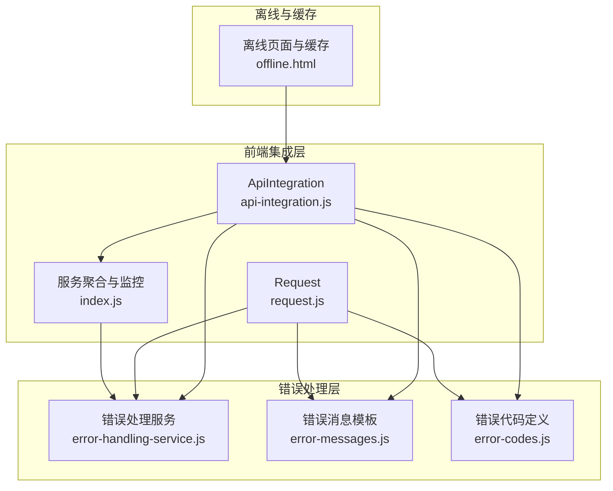
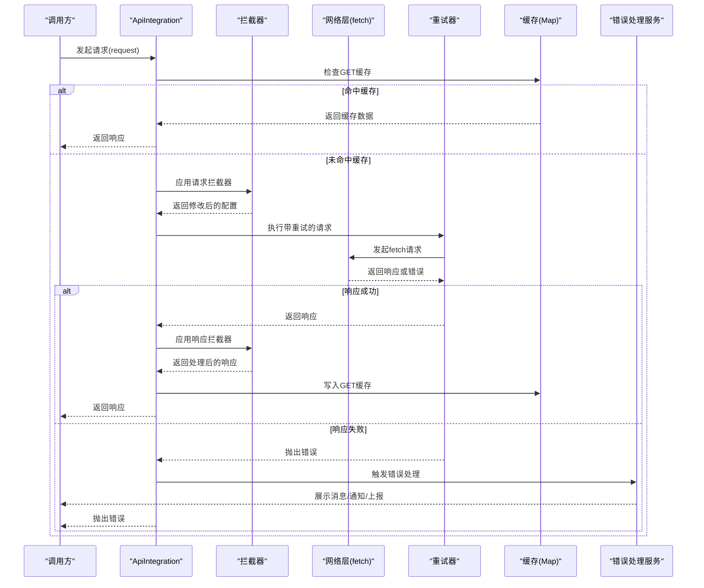
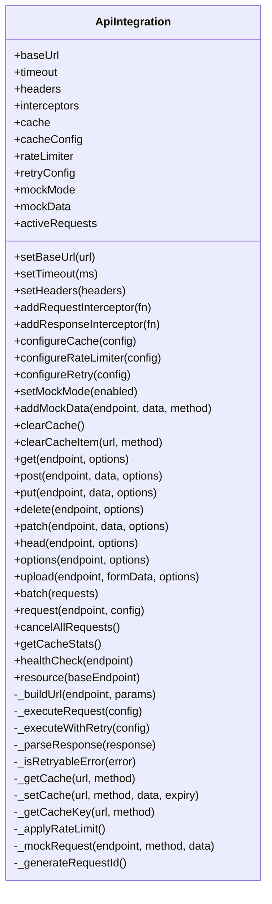
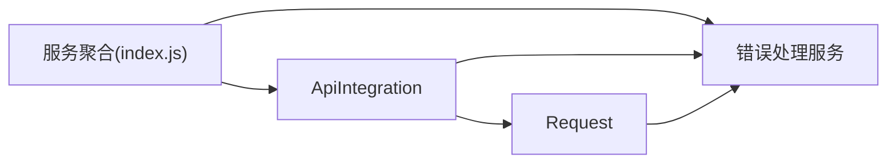

# API调用最佳实践

<cite>
**本文引用的文件**
- [api-integration.js](file://07-frontend/src/utils/integration/api-integration.js)
- [error-handling-service.js](file://07-frontend/src/services/error-handling-service.js)
- [request.js](file://07-frontend/src/services/utils/request.js)
- [index.js](file://07-frontend/src/services/index.js)
- [offline.html](file://07-frontend/public/offline.html)
- [error-messages.js](file://07-frontend/src/utils/error-handling/error-messages.js)
- [error-codes.js](file://07-frontend/src/utils/error-handling/error-codes.js)
</cite>

## 目录
1. [简介](#简介)
2. [项目结构](#项目结构)
3. [核心组件](#核心组件)
4. [架构总览](#架构总览)
5. [详细组件分析](#详细组件分析)
6. [依赖关系分析](#依赖关系分析)
7. [性能考量](#性能考量)
8. [故障排查指南](#故障排查指南)
9. [结论](#结论)
10. [附录](#附录)

## 简介
本文件围绕前端API调用的最佳实践展开，重点基于 ApiIntegration 类提供的统一API调用、拦截、缓存与错误处理能力，系统讲解：
- 请求重试策略（retryConfig）
- 速率限制（rateLimiter）
- 数据缓存（cacheConfig）
- 快速创建RESTful资源管理器（resource）
- 加载状态管理、错误边界处理、请求取消等实战建议
- 结合现有错误处理与性能监控工具，帮助构建高性能、高可用的前端应用

## 项目结构
与API调用相关的核心文件分布如下：
- 统一API封装与高级特性：ApiIntegration（api-integration.js）
- 错误处理与消息展示：error-handling-service.js、error-messages.js、error-codes.js
- 通用请求工具（对比参考）：request.js
- 服务层聚合与性能监控：index.js
- 离线场景下的缓存与回退：offline.html

图表来源
- [api-integration.js](file://07-frontend/src/utils/integration/api-integration.js#L1-L705)
- [request.js](file://07-frontend/src/services/utils/request.js#L1-L476)
- [index.js](file://07-frontend/src/services/index.js#L112-L257)
- [error-handling-service.js](file://07-frontend/src/services/error-handling-service.js#L1-L433)
- [error-messages.js](file://07-frontend/src/utils/error-handling/error-messages.js#L1-L56)
- [error-codes.js](file://07-frontend/src/utils/error-handling/error-codes.js#L1-L56)
- [offline.html](file://07-frontend/public/offline.html#L352-L396)

章节来源
- [api-integration.js](file://07-frontend/src/utils/integration/api-integration.js#L1-L705)
- [error-handling-service.js](file://07-frontend/src/services/error-handling-service.js#L1-L433)
- [request.js](file://07-frontend/src/services/utils/request.js#L1-L476)
- [index.js](file://07-frontend/src/services/index.js#L112-L257)
- [offline.html](file://07-frontend/public/offline.html#L352-L396)

## 核心组件
- ApiIntegration：统一的API调用入口，支持链式配置、拦截器、缓存、重试、速率限制、模拟模式、批量请求、健康检查、资源管理器等。
- 错误处理服务：集中化错误分类、消息展示、通知、上报与日志记录。
- 通用请求工具：对比参考，展示拦截器、缓存、重试、超时等机制的另一种实现思路。
- 服务聚合与性能监控：对API调用进行并发、竞态、条件调用、缓存与性能记录。
- 离线页面与缓存：离线场景下读取本地缓存数据，保障用户体验。

章节来源
- [api-integration.js](file://07-frontend/src/utils/integration/api-integration.js#L1-L705)
- [error-handling-service.js](file://07-frontend/src/services/error-handling-service.js#L1-L433)
- [request.js](file://07-frontend/src/services/utils/request.js#L1-L476)
- [index.js](file://07-frontend/src/services/index.js#L112-L257)
- [offline.html](file://07-frontend/public/offline.html#L352-L396)

## 架构总览
下面以序列图展示一次典型请求从发起到完成的关键步骤，包括拦截、重试、缓存与错误处理。

图表来源
- [api-integration.js](file://07-frontend/src/utils/integration/api-integration.js#L283-L380)
- [api-integration.js](file://07-frontend/src/utils/integration/api-integration.js#L448-L491)
- [api-integration.js](file://07-frontend/src/utils/integration/api-integration.js#L497-L520)
- [api-integration.js](file://07-frontend/src/utils/integration/api-integration.js#L560-L596)
- [error-handling-service.js](file://07-frontend/src/services/error-handling-service.js#L44-L96)

## 详细组件分析

### ApiIntegration 类与高级功能
- 统一配置与链式调用
  - 基础URL、超时、默认请求头、拦截器注册、缓存开关与容量、重试策略、速率限制、模拟模式、活跃请求跟踪。
- 请求方法族
  - 支持 GET/POST/PUT/DELETE/PATCH/HEAD/OPTIONS/UPLOAD 等常用方法；upload 方法自动设置 multipart/form-data。
- 批量请求
  - batch 支持并发发送多个请求，并行等待全部完成。
- 资源管理器
  - resource(baseEndpoint) 返回 list/get/create/update/patch/delete 的快捷方法，便于快速构建RESTful资源管理器。
- 缓存策略
  - GET请求命中缓存直接返回；支持自定义过期时间与最大条目数；提供清理接口。
- 重试策略
  - 可配置最大重试次数、初始延迟、指数退避因子、可重试状态码集合；支持跳过重试。
- 速率限制
  - 可配置每秒请求数与窗口；当前实现为简单队列限流，适合低并发场景。
- 拦截器
  - 请求拦截器与响应拦截器均支持链式处理；可中止请求或响应。
- 健康检查
  - healthCheck 提供轻量级健康探测，便于监控后端可用性。
- 取消与超时
  - 使用 AbortController 实现请求超时；cancelAllRequests 提供批量取消能力（当前为清理活跃请求集合）。

图表来源
- [api-integration.js](file://07-frontend/src/utils/integration/api-integration.js#L1-L705)

章节来源
- [api-integration.js](file://07-frontend/src/utils/integration/api-integration.js#L1-L705)

### 请求重试策略（retryConfig）
- 关键配置
  - enabled：是否启用重试
  - maxRetries：最大重试次数
  - retryableStatuses：可重试的状态码集合（如超时、限流、服务端错误）
  - initialDelay：首次重试延迟（毫秒）
  - backoffFactor：指数退避倍数
- 行为特征
  - 对网络错误与可重试状态码进行重试；
  - 指数退避延迟，避免雪崩效应；
  - 支持跳过重试（skipRetry）以满足幂等性要求的场景。
- 最佳实践
  - 对幂等请求（GET/PUT/PATCH/DELETE）优先启用重试；
  - 对非幂等请求谨慎开启重试，必要时配合唯一标识与后端幂等性设计；
  - 为不同环境设置不同的初始延迟与退避因子，平衡用户体验与后端压力。

章节来源
- [api-integration.js](file://07-frontend/src/utils/integration/api-integration.js#L29-L35)
- [api-integration.js](file://07-frontend/src/utils/integration/api-integration.js#L497-L520)
- [api-integration.js](file://07-frontend/src/utils/integration/api-integration.js#L545-L557)

### 速率限制（rateLimiter）
- 关键配置
  - enabled：是否启用
  - requests/perSeconds：每秒允许的请求数
  - queue：内部队列（当前实现为简单队列，适合低并发）
- 行为特征
  - 在请求前检查队列长度与时间窗口，必要时等待；
  - 清理过期队列项，维持滑动窗口。
- 最佳实践
  - 与后端限流策略协同，避免前端过度节流导致用户体验下降；
  - 对批量任务或后台任务使用独立的限流策略；
  - 在UI层提供“排队/等待”反馈，提升透明度。

章节来源
- [api-integration.js](file://07-frontend/src/utils/integration/api-integration.js#L23-L28)
- [api-integration.js](file://07-frontend/src/utils/integration/api-integration.js#L606-L624)

### 数据缓存（cacheConfig）
- 关键配置
  - enabled：是否启用缓存
  - defaultExpiry：默认过期时间（毫秒）
  - maxEntries：最大缓存条目数
- 行为特征
  - 仅对GET请求生效；
  - Map结构存储，键为“方法:URL”，值包含数据与过期时间；
  - 过期自动清理，支持按URL清理单项。
- 最佳实践
  - 对静态或低频变更的数据启用缓存；
  - 对实时性要求高的数据禁用缓存或缩短过期时间；
  - 与版本号/ETag结合，确保缓存一致性。

章节来源
- [api-integration.js](file://07-frontend/src/utils/integration/api-integration.js#L18-L22)
- [api-integration.js](file://07-frontend/src/utils/integration/api-integration.js#L560-L596)

### 快速创建RESTful资源管理器（resource）
- 作用
  - 为给定基础端点生成一组常用操作方法：list/get/create/update/patch/delete；
  - 降低样板代码，提升开发效率。
- 使用建议
  - 与后端REST规范保持一致；
  - 对复杂资源（分页、过滤、排序）在调用侧补充参数传递与校验。

章节来源
- [api-integration.js](file://07-frontend/src/utils/integration/api-integration.js#L685-L700)

### 加载状态管理、错误边界处理、请求取消
- 加载状态管理
  - 在组件层维护 loading 状态，结合请求生命周期（开始/结束/错误）更新UI；
  - 对批量请求采用“全部完成/任一完成”的策略，分别使用 Promise.all/Promise.race。
- 错误边界处理
  - 使用统一错误处理服务，按错误类型（网络、API、认证、业务等）进行差异化处理；
  - 提供消息提示、通知、日志上报与导出能力。
- 请求取消
  - 使用 AbortController 实现超时与取消；
  - cancelAllRequests 提供批量清理活跃请求的能力（当前为清理集合，后续可扩展为真正的中断）。

章节来源
- [error-handling-service.js](file://07-frontend/src/services/error-handling-service.js#L44-L96)
- [error-handling-service.js](file://07-frontend/src/services/error-handling-service.js#L225-L282)
- [error-handling-service.js](file://07-frontend/src/services/error-handling-service.js#L284-L341)
- [api-integration.js](file://07-frontend/src/utils/integration/api-integration.js#L382-L390)
- [api-integration.js](file://07-frontend/src/utils/integration/api-integration.js#L448-L491)

### 与通用请求工具（Request）的对比
- Request 提供了更完整的拦截器体系（请求/响应/错误三类），以及基于URL与请求体的缓存键生成；
- Request 支持超时包装与重试封装，便于在通用层复用；
- 两者互补：ApiIntegration偏向于应用层统一入口与高级特性，Request偏向于通用请求封装。

章节来源
- [request.js](file://07-frontend/src/services/utils/request.js#L1-L476)

### 服务聚合与性能监控（index.js）
- 并发与竞态
  - all：并发等待所有调用完成；
  - race：并发等待最快一个调用完成；
  - conditional：根据条件选择调用分支。
- 缓存
  - cached：基于localStorage的键值缓存，支持TTL。
- 性能监控
  - monitor：记录调用耗时并持久化到localStorage，便于分析与优化。

章节来源
- [index.js](file://07-frontend/src/services/index.js#L112-L257)

### 离线场景与缓存回退
- 离线页面会尝试从本地缓存加载数据，若不可用则提示用户连接网络后重试；
- 建议在应用层对关键数据建立本地缓存策略，提升离线体验。

章节来源
- [offline.html](file://07-frontend/public/offline.html#L352-L396)

## 依赖关系分析
- ApiIntegration 与错误处理服务之间通过错误对象与类型进行解耦，便于统一处理与扩展。
- 服务聚合层（index.js）对具体API调用进行编排，便于引入并发、竞态与缓存策略。
- 通用请求工具（request.js）提供了另一种实现思路，可作为参考或迁移目标。

图表来源
- [api-integration.js](file://07-frontend/src/utils/integration/api-integration.js#L1-L705)
- [error-handling-service.js](file://07-frontend/src/services/error-handling-service.js#L1-L433)
- [request.js](file://07-frontend/src/services/utils/request.js#L1-L476)
- [index.js](file://07-frontend/src/services/index.js#L112-L257)

## 性能考量
- 重试与退避
  - 合理设置初始延迟与退避因子，避免对后端造成瞬时压力峰值；
  - 对非幂等请求谨慎重试，必要时结合唯一标识。
- 缓存策略
  - 对热点数据启用缓存，缩短首屏与二次访问时间；
  - 控制缓存大小与过期时间，避免内存占用过高。
- 速率限制
  - 与后端限流策略协同，避免前端过度节流；
  - 对批量任务使用独立限流通道。
- 并发与竞态
  - 对需要“最快响应”的场景使用 race，对需要“全部成功”的场景使用 all；
  - 对条件调用使用 conditional，减少不必要的请求。
- 性能监控
  - 使用 monitor 记录调用耗时，定期导出分析报告，识别慢调用与瓶颈。

章节来源
- [api-integration.js](file://07-frontend/src/utils/integration/api-integration.js#L29-L35)
- [api-integration.js](file://07-frontend/src/utils/integration/api-integration.js#L18-L22)
- [api-integration.js](file://07-frontend/src/utils/integration/api-integration.js#L23-L28)
- [index.js](file://07-frontend/src/services/index.js#L112-L257)

## 故障排查指南
- 常见问题定位
  - 网络错误：检查超时、断网、代理与跨域配置；
  - API错误：根据状态码区分401/403/404/5xx，结合错误处理服务进行提示与跳转；
  - 业务错误：查看后端返回的错误字段，使用表单错误处理工具进行字段级提示。
- 日志与上报
  - 错误处理服务会记录错误日志并可上报至服务端，便于追踪；
  - 可导出错误日志，辅助问题复盘。
- 重试与缓存
  - 若出现“假失败”，检查重试策略与缓存命中情况；
  - 对非幂等请求，确认是否需要禁用重试或调整退避策略。
- 离线回退
  - 离线页面会尝试从本地缓存加载数据，若失败需引导用户联网重试。

章节来源
- [error-handling-service.js](file://07-frontend/src/services/error-handling-service.js#L44-L96)
- [error-handling-service.js](file://07-frontend/src/services/error-handling-service.js#L225-L282)
- [error-handling-service.js](file://07-frontend/src/services/error-handling-service.js#L284-L341)
- [error-messages.js](file://07-frontend/src/utils/error-handling/error-messages.js#L1-L56)
- [error-codes.js](file://07-frontend/src/utils/error-handling/error-codes.js#L1-L56)
- [offline.html](file://07-frontend/public/offline.html#L352-L396)

## 结论
通过 ApiIntegration 提供的统一入口与高级特性，可以显著提升前端API调用的一致性、可靠性与可维护性。结合错误处理服务、性能监控与缓存策略，能够有效提升用户体验与系统稳定性。建议在团队内推广以下实践：
- 统一使用 ApiIntegration 进行API调用；
- 对关键路径启用重试与缓存；
- 使用资源管理器快速构建RESTful接口；
- 在组件层做好加载状态与错误边界的处理；
- 建立完善的性能监控与错误日志体系。

## 附录
- 术语
  - 幂等：多次执行与一次执行效果相同（如GET/PUT/PATCH/DELETE）。
  - 竞态：多个请求同时竞争同一资源，需采用race/all/conditional策略。
- 参考实现
  - 通用请求工具（Request）展示了拦截器、缓存、重试与超时的另一种实现方式，可作为迁移或对比参考。

章节来源
- [request.js](file://07-frontend/src/services/utils/request.js#L1-L476)