# API集成

<cite>
**本文档引用的文件**   
- [request.js](file://07-frontend/src/services/utils/request.js)
- [finance-api.js](file://07-frontend/src/services/api/finance-api.js)
- [materialApiService.js](file://07-frontend/src/services/api/materialApiService.js)
- [sales-api.js](file://07-frontend/src/services/api/sales-api.js)
- [accountReceivableApi.js](file://07-frontend/src/api/finance/accountReceivableApi.js)
- [employee.js](file://07-frontend/src/api/hr/employee.js)
- [orderApi.js](file://07-frontend/src/api/sales/orderApi.js)
- [auth.js](file://07-frontend/src/services/utils/auth.js)
- [material.js](file://07-frontend/src/api/material.js)
- [product.js](file://07-frontend/src/api/product.js)
</cite>

## 目录
1. [API集成架构概述](#api集成架构概述)
2. [请求封装机制](#请求封装机制)
3. [业务API服务层](#业务api服务层)
4. [API定义层](#api定义层)
5. [最佳实践与使用示例](#最佳实践与使用示例)
6. [错误处理与安全机制](#错误处理与安全机制)
7. [缓存与性能优化](#缓存与性能优化)

## API集成架构概述

本项目采用分层架构设计，将API集成划分为三个主要层次：请求封装层、服务层和定义层。这种分层设计实现了关注点分离，提高了代码的可维护性和可测试性。

在请求封装层，系统基于fetch API实现了自定义的Request类，提供了统一的请求处理、拦截器、错误处理和重试机制。服务层则封装了各个业务模块的API调用，如财务、物料和销售等，为上层应用提供简洁的接口。定义层包含了具体的API端点定义，与后端服务直接对接。

这种架构设计使得前端开发人员可以专注于业务逻辑的实现，而不必关心底层的网络通信细节。同时，统一的错误处理和认证机制确保了系统的安全性和稳定性。

**Section sources**
- [request.js](file://07-frontend/src/services/utils/request.js)
- [finance-api.js](file://07-frontend/src/services/api/finance-api.js)
- [sales-api.js](file://07-frontend/src/services/api/sales-api.js)

## 请求封装机制

### 请求类实现

系统核心的请求封装位于`services/utils/request.js`文件中，通过一个功能丰富的Request类实现。该类不仅封装了基本的HTTP请求方法，还提供了拦截器、错误处理、重试机制和缓存等高级功能。

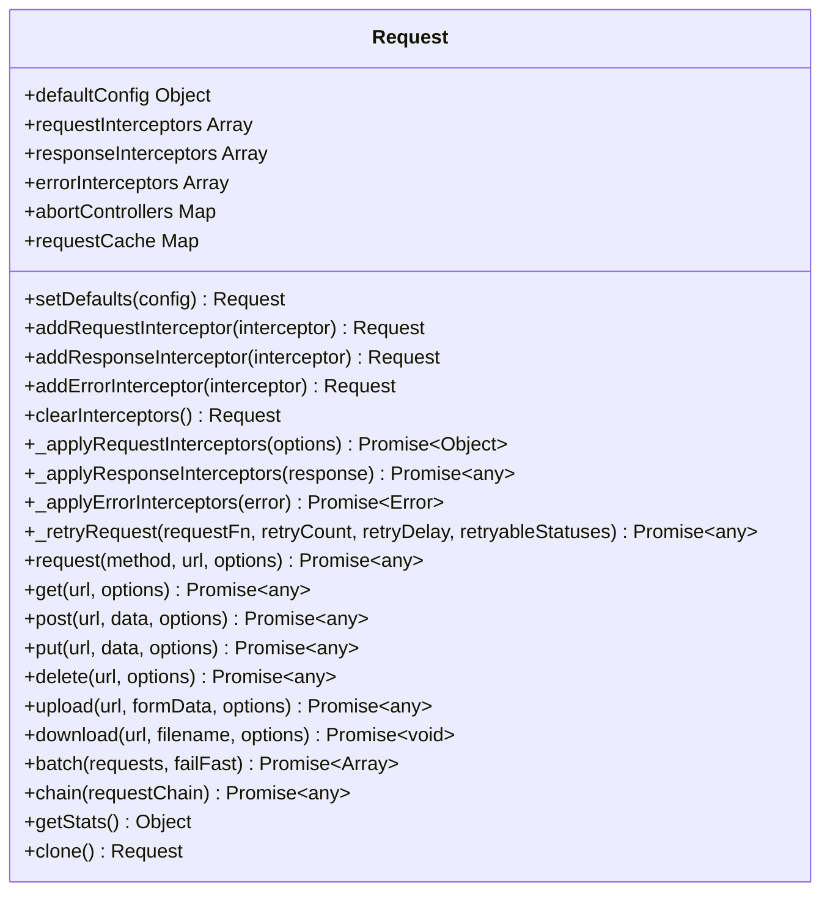

**Diagram sources **
- [request.js](file://07-frontend/src/services/utils/request.js#L5-L798)

**Section sources**
- [request.js](file://07-frontend/src/services/utils/request.js#L5-L798)

### 拦截器机制

请求拦截器在发送请求前执行，主要用于添加认证令牌、设置请求头和处理请求参数。响应拦截器在接收到响应后执行，负责解析响应数据、检查响应状态和处理业务逻辑。错误拦截器则捕获和处理请求过程中发生的错误。

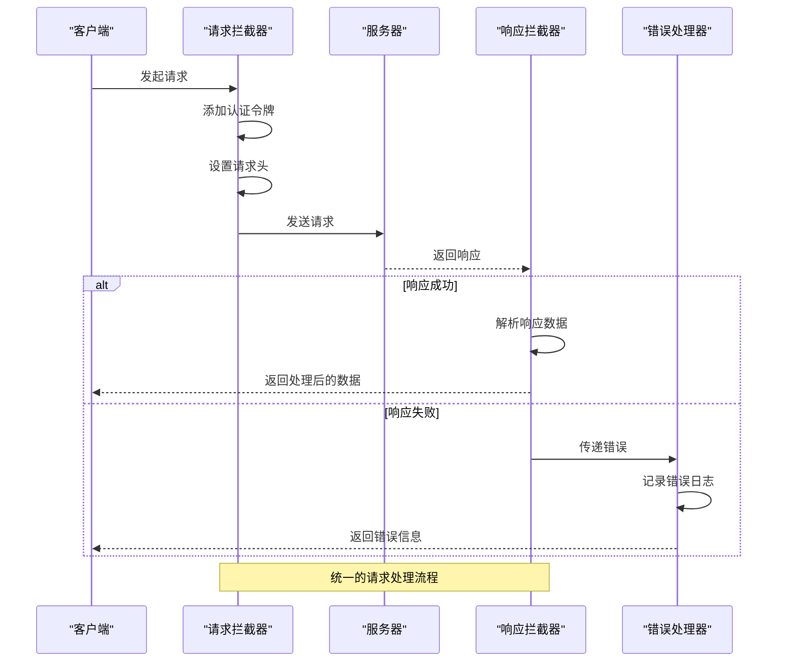

**Diagram sources **
- [request.js](file://07-frontend/src/services/utils/request.js#L121-L144)
- [request.js](file://07-frontend/src/services/utils/request.js#L136-L143)
- [request.js](file://07-frontend/src/services/utils/request.js#L151-L161)

**Section sources**
- [request.js](file://07-frontend/src/services/utils/request.js#L121-L161)

### 认证令牌注入

系统通过请求拦截器自动注入认证令牌，确保每个请求都携带有效的身份验证信息。令牌存储在本地存储中，每次请求时从存储中读取并添加到请求头的Authorization字段中。

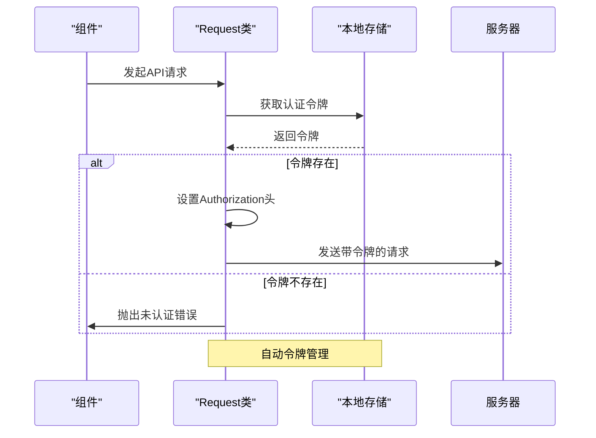

**Diagram sources **
- [auth.js](file://07-frontend/src/services/utils/auth.js#L346-L357)
- [request.js](file://07-frontend/src/services/utils/request.js#L121-L126)

**Section sources**
- [auth.js](file://07-frontend/src/services/utils/auth.js#L346-L357)
- [request.js](file://07-frontend/src/services/utils/request.js#L121-L126)

### 请求重试机制

系统实现了智能的请求重试机制，当请求因网络问题或服务器临时故障失败时，会自动进行重试。重试策略采用指数退避算法，避免对服务器造成过大压力。

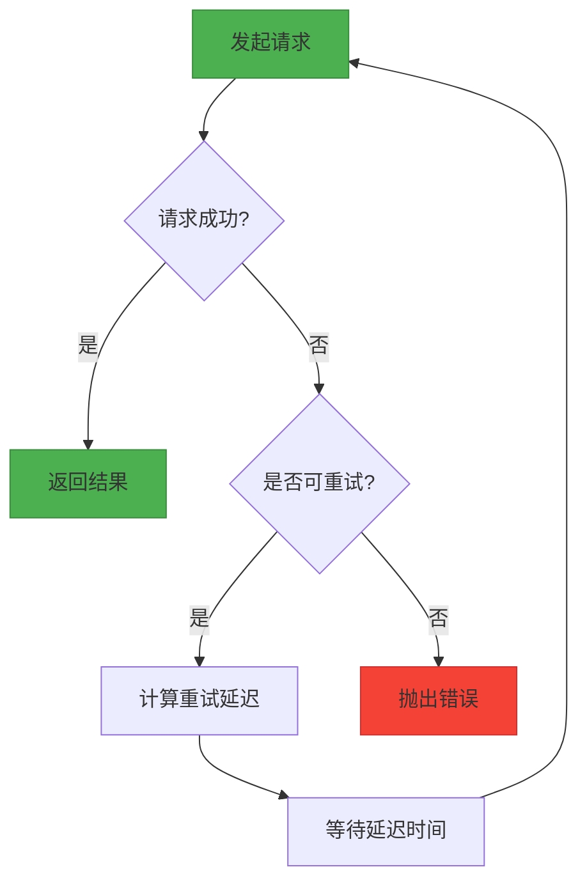

**Diagram sources **
- [request.js](file://07-frontend/src/services/utils/request.js#L288-L310)

**Section sources**
- [request.js](file://07-frontend/src/services/utils/request.js#L288-L310)

## 业务API服务层

### 财务API服务

财务API服务（finance-api.js）提供了全面的财务管理功能，包括科目管理、凭证管理、账簿管理、财务报表、收支管理、预算管理、资金管理和税务管理等模块。每个模块都封装了相应的CRUD操作和业务方法。

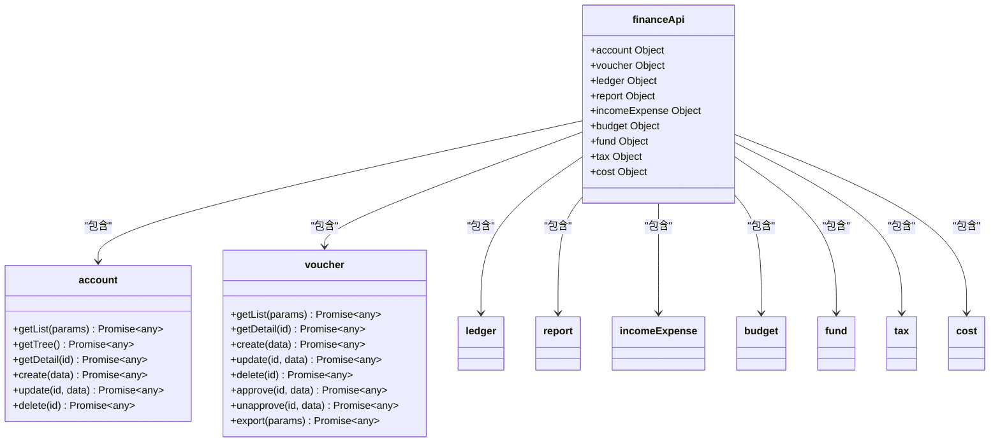

**Diagram sources **
- [finance-api.js](file://07-frontend/src/services/api/finance-api.js#L4-L296)

**Section sources**
- [finance-api.js](file://07-frontend/src/services/api/finance-api.js#L4-L296)

### 物料API服务

物料API服务（materialApiService.js）作为后端数据库的接口层，提供了物料管理的完整功能。该服务不仅封装了基本的CRUD操作，还实现了数据格式转换、错误处理和日志记录等高级功能。

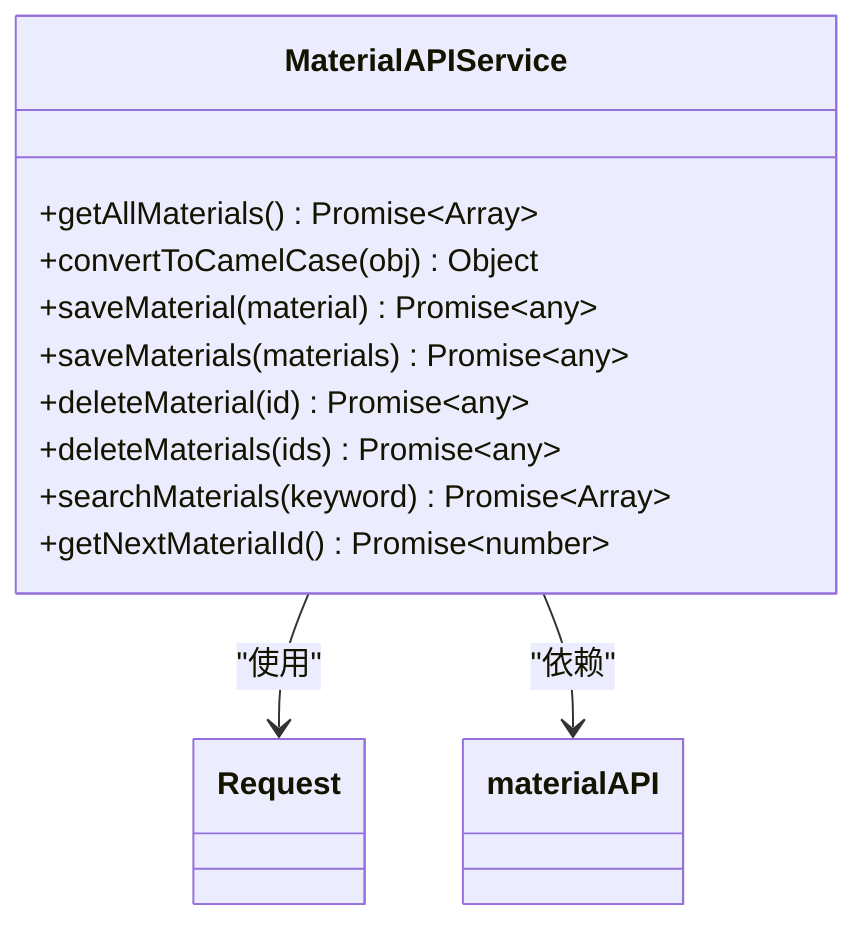

**Diagram sources **
- [materialApiService.js](file://07-frontend/src/services/api/materialApiService.js#L7-L211)

**Section sources**
- [materialApiService.js](file://07-frontend/src/services/api/materialApiService.js#L7-L211)

### 销售API服务

销售API服务（sales-api.js）涵盖了销售管理的各个方面，包括客户管理、销售订单、销售报价、销售合同、销售机会、销售目标、销售统计和销售团队等模块。每个模块都提供了完整的业务操作接口。

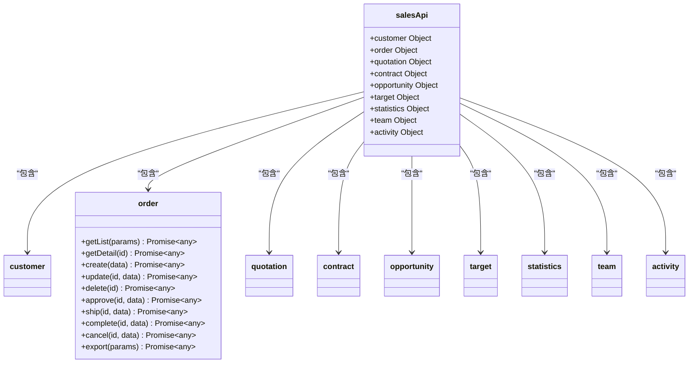

**Diagram sources **
- [sales-api.js](file://07-frontend/src/services/api/sales-api.js#L4-L346)

**Section sources**
- [sales-api.js](file://07-frontend/src/services/api/sales-api.js#L4-L346)

## API定义层

### 财务API定义

财务API定义文件（accountReceivableApi.js）提供了应收账款管理的具体端点。这些定义与后端API直接对应，为上层服务提供了精确的接口契约。

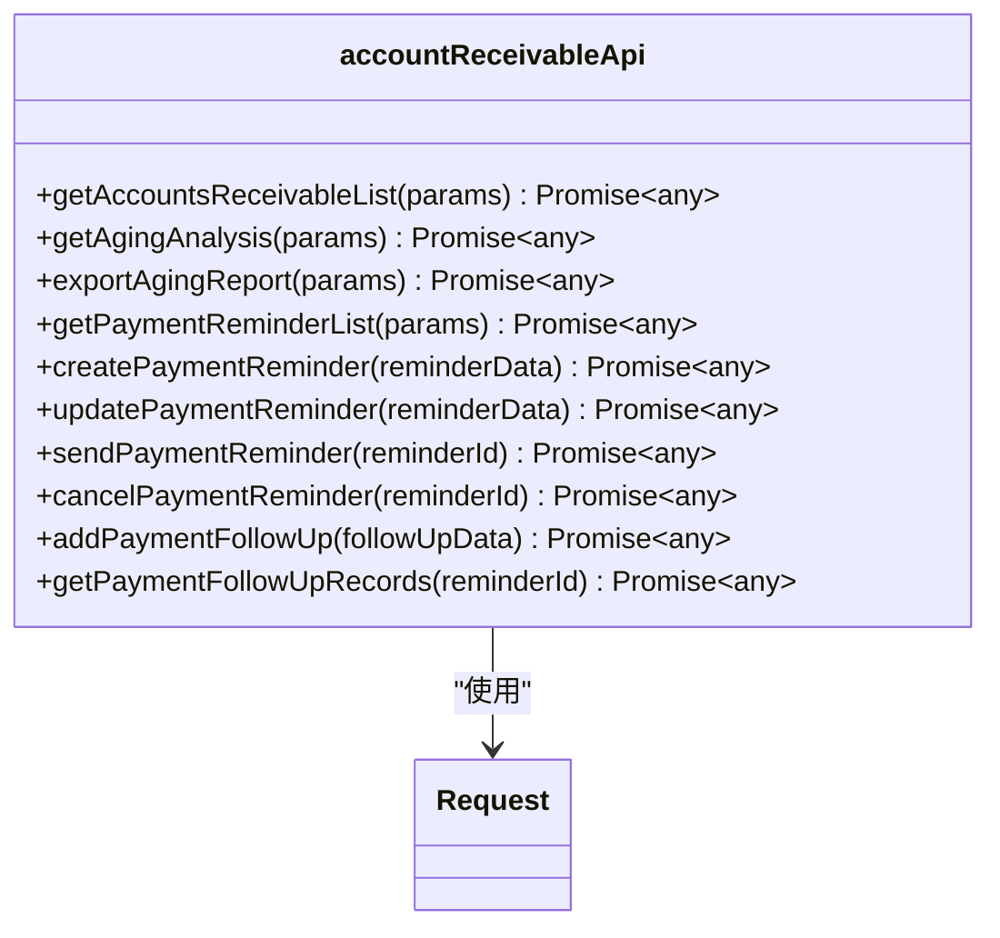

**Diagram sources **
- [accountReceivableApi.js](file://07-frontend/src/api/finance/accountReceivableApi.js#L6-L135)

**Section sources**
- [accountReceivableApi.js](file://07-frontend/src/api/finance/accountReceivableApi.js#L6-L135)

### 人力资源API定义

人力资源API定义文件（employee.js）提供了员工管理、入职、离职、调动、薪资和绩效等多个模块的API接口。这些接口按照业务功能进行了清晰的划分。

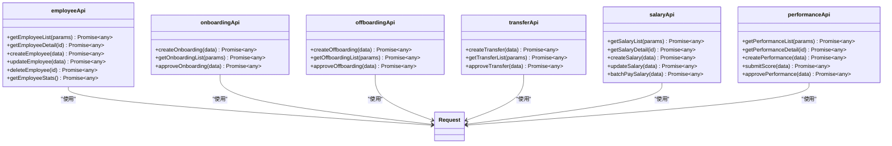

**Diagram sources **
- [employee.js](file://07-frontend/src/api/hr/employee.js#L9-L369)

**Section sources**
- [employee.js](file://07-frontend/src/api/hr/employee.js#L9-L369)

### 销售订单API定义

销售订单API定义文件（orderApi.js）提供了订单管理的核心功能，包括订单的增删改查、批量操作和状态变更等。该文件通过导入通用API实例来实现网络请求。

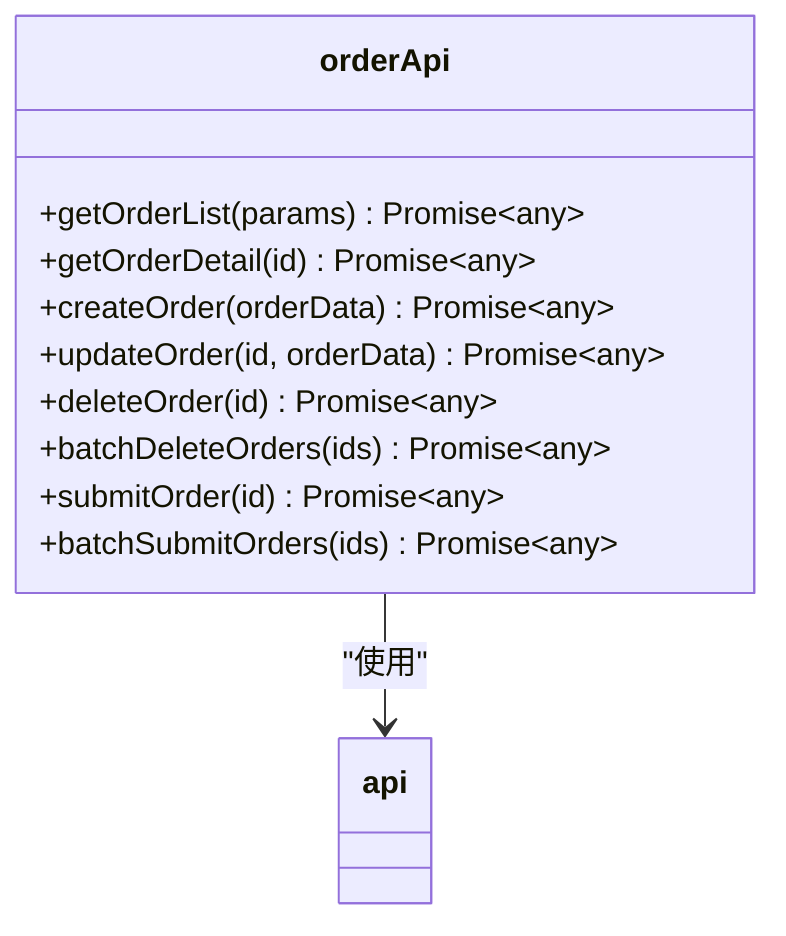

**Diagram sources **
- [orderApi.js](file://07-frontend/src/api/sales/orderApi.js#L6-L87)

**Section sources**
- [orderApi.js](file://07-frontend/src/api/sales/orderApi.js#L6-L87)

## 最佳实践与使用示例

### API调用模式

系统推荐使用一致的API调用模式，通过服务层提供的方法进行调用，而不是直接使用底层请求工具。这种模式提高了代码的可读性和可维护性。

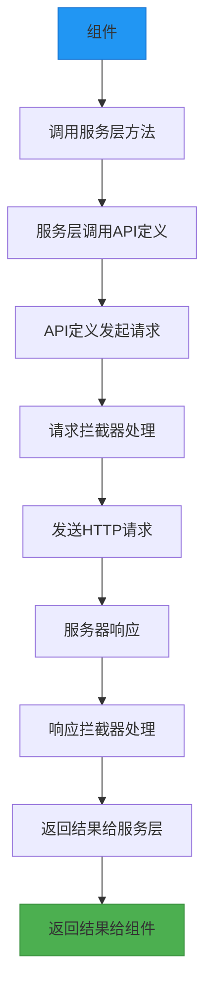

**Diagram sources **
- [finance-api.js](file://07-frontend/src/services/api/finance-api.js#L8-L10)
- [orderApi.js](file://07-frontend/src/api/sales/orderApi.js#L18-L20)

**Section sources**
- [finance-api.js](file://07-frontend/src/services/api/finance-api.js#L8-L10)
- [orderApi.js](file://07-frontend/src/api/sales/orderApi.js#L18-L20)

### 加载状态管理

在进行API调用时，建议使用加载状态来提升用户体验。系统提供了统一的加载指示器，可以在请求开始时显示，在请求完成或失败时隐藏。

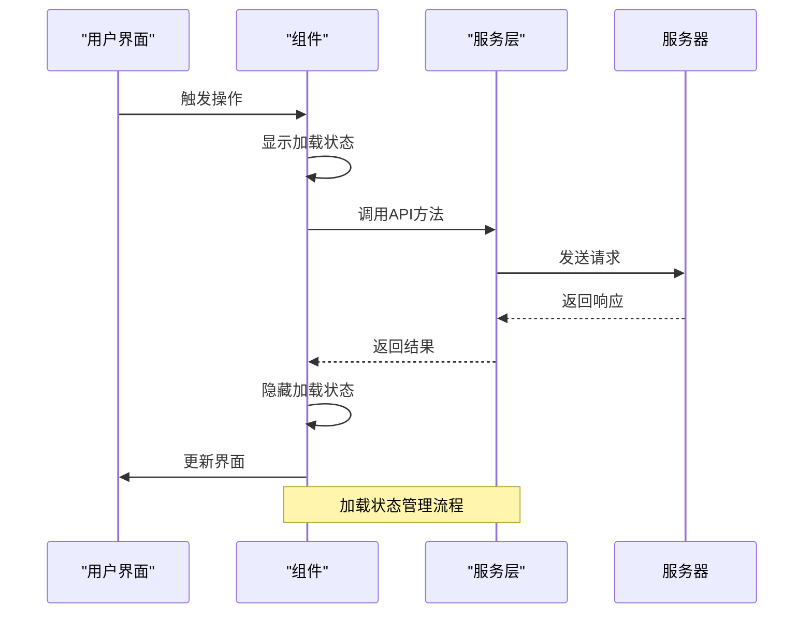

**Diagram sources **
- [finance-api.js](file://07-frontend/src/services/api/finance-api.js#L8-L10)
- [sales-api.js](file://07-frontend/src/services/api/sales-api.js#L8-L10)

**Section sources**
- [finance-api.js](file://07-frontend/src/services/api/finance-api.js#L8-L10)
- [sales-api.js](file://07-frontend/src/services/api/sales-api.js#L8-L10)

## 错误处理与安全机制

### 统一错误处理

系统实现了统一的错误处理机制，通过拦截器捕获和处理各种类型的错误，包括网络错误、API错误、认证错误等。错误信息会被格式化后显示给用户，同时记录到错误日志中。

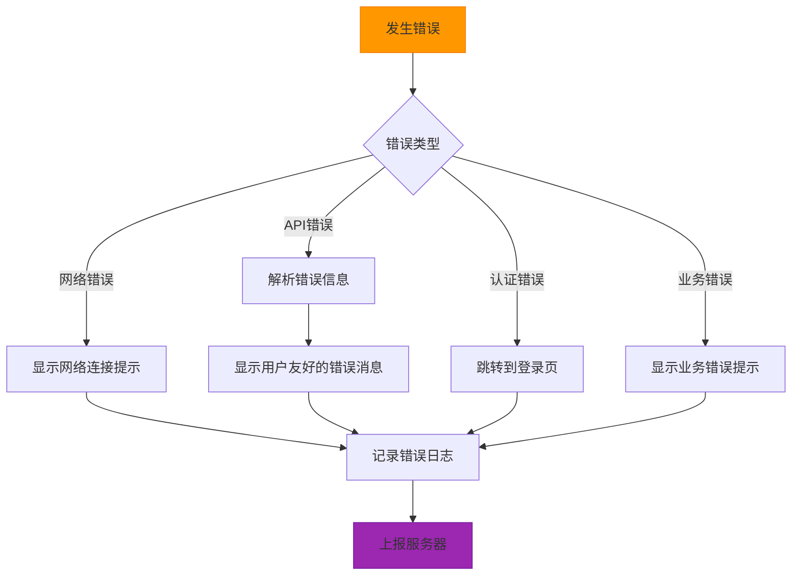

**Diagram sources **
- [request.js](file://07-frontend/src/services/utils/request.js#L472-L474)
- [error-handling-service.js](file://07-frontend/src/services/error-handling-service.js#L44-L96)

**Section sources**
- [request.js](file://07-frontend/src/services/utils/request.js#L472-L474)
- [error-handling-service.js](file://07-frontend/src/services/error-handling-service.js#L44-L96)

### 安全认证机制

系统采用基于JWT的认证机制，通过localStorage存储认证令牌。请求拦截器会自动将令牌添加到每个请求的Authorization头中，确保请求的安全性。

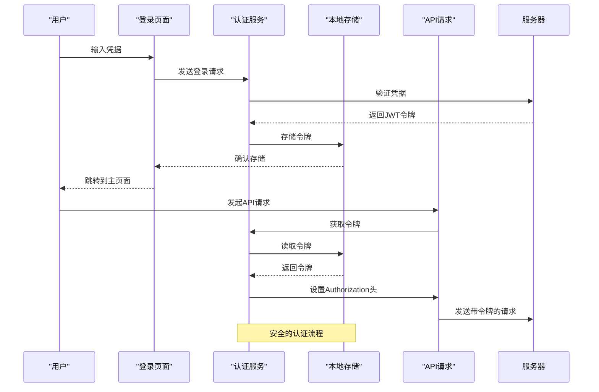

**Diagram sources **
- [auth.js](file://07-frontend/src/services/utils/auth.js#L211-L223)
- [request.js](file://07-frontend/src/services/utils/request.js#L116-L120)

**Section sources**
- [auth.js](file://07-frontend/src/services/utils/auth.js#L211-L223)
- [request.js](file://07-frontend/src/services/utils/request.js#L116-L120)

## 缓存与性能优化

### 请求缓存机制

系统实现了智能的请求缓存机制，对于GET请求的响应结果会自动缓存，避免重复请求相同的资源，提高应用性能。

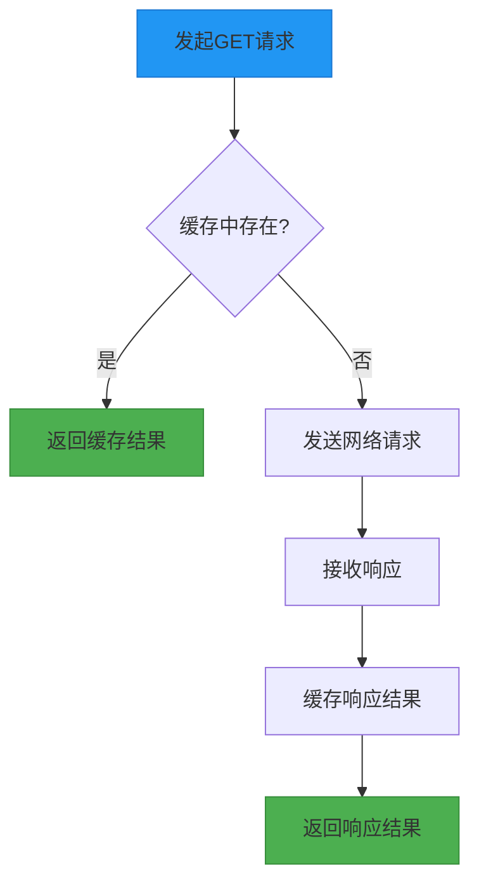

**Diagram sources **
- [request.js](file://07-frontend/src/services/utils/request.js#L406-L410)
- [request.js](file://07-frontend/src/services/utils/request.js#L451-L454)

**Section sources**
- [request.js](file://07-frontend/src/services/utils/request.js#L406-L410)
- [request.js](file://07-frontend/src/services/utils/request.js#L451-L454)

### 批量操作优化

对于需要处理大量数据的场景，系统提供了批量操作接口，通过单个请求处理多个数据项，减少网络往返次数，提高效率。

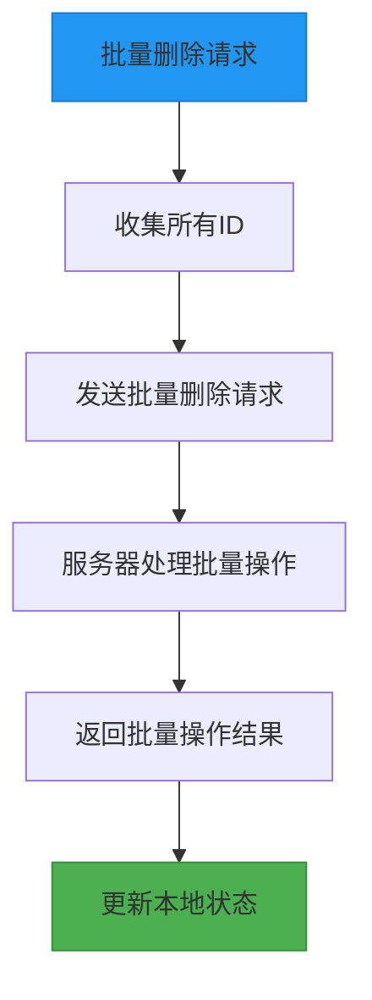

**Diagram sources **
- [materialApiService.js](file://07-frontend/src/services/api/materialApiService.js#L161-L173)
- [sales-api.js](file://07-frontend/src/services/api/sales-api.js#L71-L73)

**Section sources**
- [materialApiService.js](file://07-frontend/src/services/api/materialApiService.js#L161-L173)
- [sales-api.js](file://07-frontend/src/services/api/sales-api.js#L71-L73)