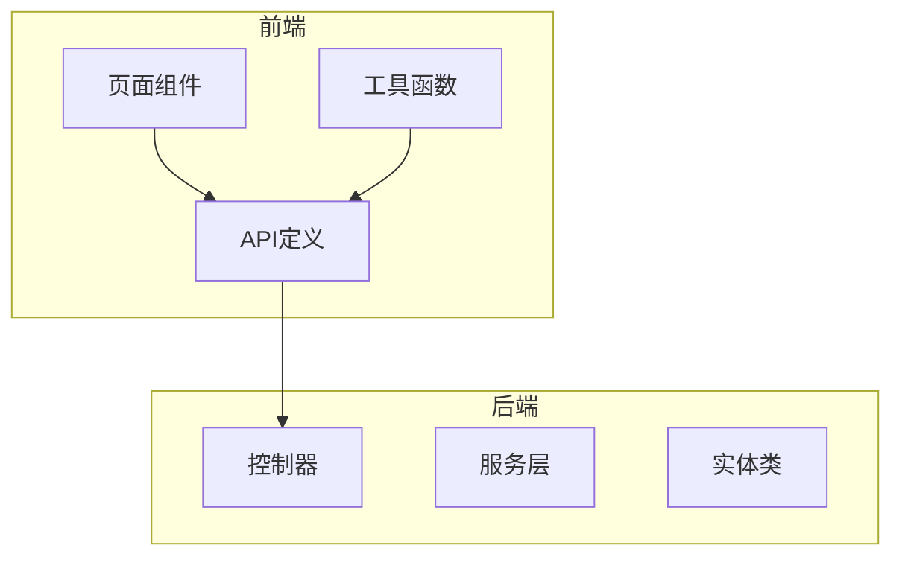
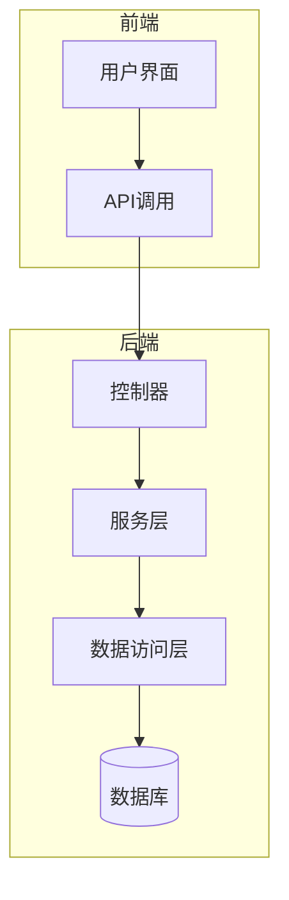
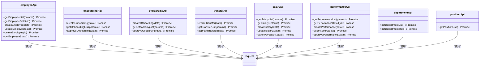
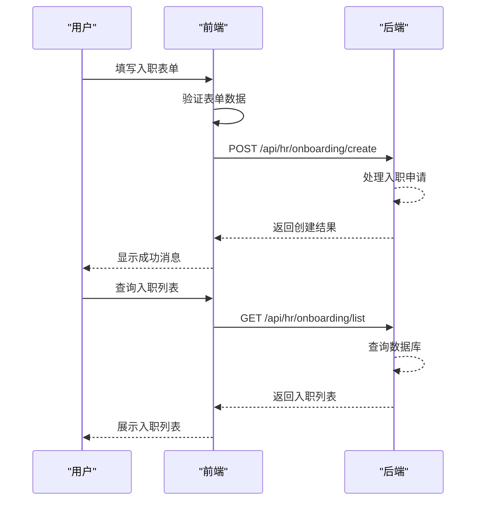
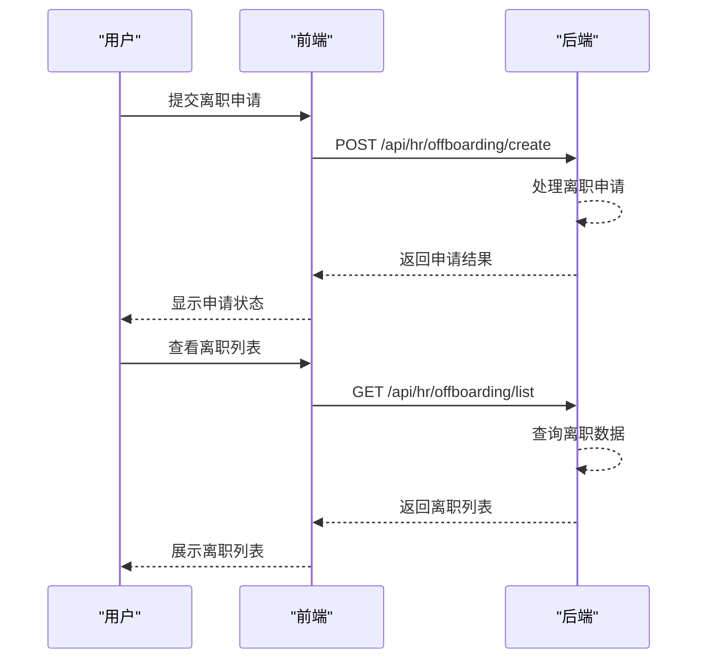
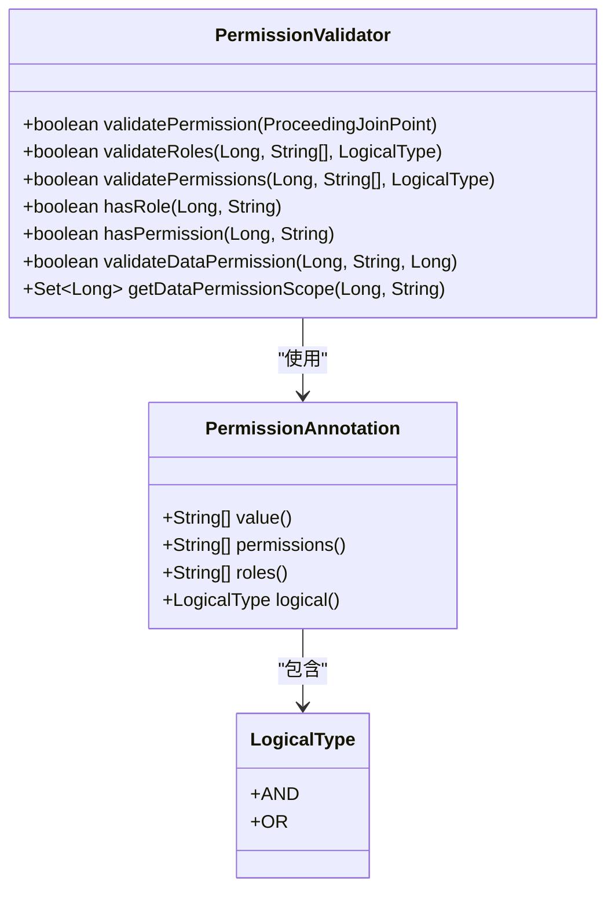
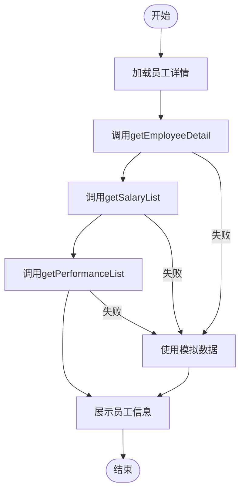
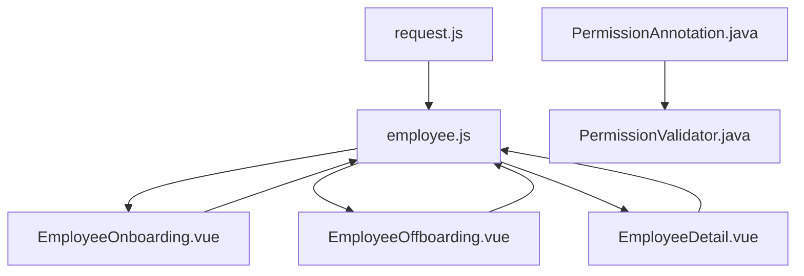

# 人力资源模块API

<cite>
**本文档引用的文件**   
- [employee.js](file://07-frontend/src/api/hr/employee.js)
- [request.js](file://07-frontend/src/services/utils/request.js)
- [EmployeeOnboarding.vue](file://07-frontend/src/pages/human-resources/employee-management/EmployeeOnboarding.vue)
- [EmployeeOffboarding.vue](file://07-frontend/src/pages/human-resources/employee-management/EmployeeOffboarding.vue)
- [EmployeeDetail.vue](file://07-frontend/src/pages/human-resources/employee-management/EmployeeDetail.vue)
- [PermissionAnnotation.java](file://08-backend/src/main/java/com/enterprise/brain/common/annotation/PermissionAnnotation.java)
- [PermissionValidator.java](file://08-backend/src/main/java/com/enterprise/brain/common/security/PermissionValidator.java)
</cite>

## 目录
1. [引言](#引言)
2. [项目结构](#项目结构)
3. [核心组件](#核心组件)
4. [架构概述](#架构概述)
5. [详细组件分析](#详细组件分析)
6. [依赖分析](#依赖分析)
7. [性能考虑](#性能考虑)
8. [故障排除指南](#故障排除指南)
9. [结论](#结论)

## 引言
本文档深入分析人力资源模块员工管理API的实现细节。重点解析`employee.js`中定义的员工信息增删改查接口，包括员工档案获取、入职离职流程、组织架构同步等操作。详细说明接口如何处理敏感数据（如薪资信息）的权限控制与字段过滤机制。通过实际代码示例展示复杂表单提交、附件上传、级联选择器数据加载等场景的API调用模式，并解释接口与前端表单验证、权限指令的协同工作机制。

## 项目结构
项目结构清晰地分为前端和后端两个主要部分。前端代码位于`07-frontend`目录下，包含API定义、页面组件和工具函数。人力资源相关的API定义在`src/api/hr/employee.js`文件中，而页面组件位于`src/pages/human-resources/employee-management/`目录下。后端代码位于`08-backend`目录，采用Java Spring框架实现，包含控制器、服务层和实体类。API请求通过前端的`request.js`工具进行封装和管理，实现了统一的请求处理、拦截器和错误处理机制。

**图表来源**
- [employee.js](file://07-frontend/src/api/hr/employee.js)
- [EmployeeOnboarding.vue](file://07-frontend/src/pages/human-resources/employee-management/EmployeeOnboarding.vue)
- [PermissionAnnotation.java](file://08-backend/src/main/java/com/enterprise/brain/common/annotation/PermissionAnnotation.java)

**章节来源**
- [employee.js](file://07-frontend/src/api/hr/employee.js)
- [EmployeeOnboarding.vue](file://07-frontend/src/pages/human-resources/employee-management/EmployeeOnboarding.vue)

## 核心组件
人力资源模块的核心组件包括员工管理、入职管理、离职管理、调动管理、薪资管理和绩效考核六大API模块。每个模块都提供了完整的增删改查功能，通过统一的请求工具进行网络通信。前端组件与API紧密配合，实现了员工信息的全生命周期管理。权限控制机制贯穿整个系统，确保敏感数据的安全访问。

**章节来源**
- [employee.js](file://07-frontend/src/api/hr/employee.js)
- [EmployeeOnboarding.vue](file://07-frontend/src/pages/human-resources/employee-management/EmployeeOnboarding.vue)
- [EmployeeOffboarding.vue](file://07-frontend/src/pages/human-resources/employee-management/EmployeeOffboarding.vue)

## 架构概述
系统采用前后端分离的架构模式，前端使用Vue.js框架，后端采用Java Spring Boot框架。API通信基于RESTful设计原则，通过JSON格式交换数据。前端通过`request.js`封装的HTTP客户端与后端进行交互，实现了请求拦截、响应处理、错误捕获等通用功能。权限控制通过注解方式在后端实现，前端根据用户权限动态显示相应功能。

**图表来源**
- [employee.js](file://07-frontend/src/api/hr/employee.js)
- [PermissionAnnotation.java](file://08-backend/src/main/java/com/enterprise/brain/common/annotation/PermissionAnnotation.java)

## 详细组件分析

### 员工管理API分析
员工管理API提供了员工信息的完整生命周期管理功能，包括创建、读取、更新和删除操作。API设计遵循RESTful原则，使用标准的HTTP方法对应不同的操作类型。敏感数据如薪资信息通过权限控制进行保护，确保只有授权用户才能访问。

#### 员工管理API类图

**图表来源**
- [employee.js](file://07-frontend/src/api/hr/employee.js)

**章节来源**
- [employee.js](file://07-frontend/src/api/hr/employee.js)

### 入职流程API分析
入职流程API管理新员工的入职申请和审批流程。系统支持创建入职申请、查询入职列表和审批入职等功能。前端页面`EmployeeOnboarding.vue`展示了如何使用这些API构建用户界面，包括表单验证、数据提交和列表展示。

#### 入职流程序列图

**图表来源**
- [employee.js](file://07-frontend/src/api/hr/employee.js)
- [EmployeeOnboarding.vue](file://07-frontend/src/pages/human-resources/employee-management/EmployeeOnboarding.vue)

**章节来源**
- [employee.js](file://07-frontend/src/api/hr/employee.js)
- [EmployeeOnboarding.vue](file://07-frontend/src/pages/human-resources/employee-management/EmployeeOnboarding.vue)

### 离职流程API分析
离职流程API管理员工的离职申请和审批。与入职流程类似，系统支持创建离职申请、查询离职列表和审批离职等功能。前端页面`EmployeeOffboarding.vue`实现了离职管理的用户界面，展示了如何通过API与后端交互。

#### 离职流程序列图

**图表来源**
- [employee.js](file://07-frontend/src/api/hr/employee.js)
- [EmployeeOffboarding.vue](file://07-frontend/src/pages/human-resources/employee-management/EmployeeOffboarding.vue)

**章节来源**
- [employee.js](file://07-frontend/src/api/hr/employee.js)
- [EmployeeOffboarding.vue](file://07-frontend/src/pages/human-resources/employee-management/EmployeeOffboarding.vue)

### 权限控制机制分析
系统采用基于注解的权限控制机制，通过`PermissionAnnotation`注解定义接口的权限要求。后端的`PermissionValidator`类负责实际的权限验证逻辑，支持角色和权限码的多种组合方式。这种设计使得权限控制既灵活又易于维护。

#### 权限控制类图

**图表来源**
- [PermissionAnnotation.java](file://08-backend/src/main/java/com/enterprise/brain/common/annotation/PermissionAnnotation.java)
- [PermissionValidator.java](file://08-backend/src/main/java/com/enterprise/brain/common/security/PermissionValidator.java)

**章节来源**
- [PermissionAnnotation.java](file://08-backend/src/main/java/com/enterprise/brain/common/annotation/PermissionAnnotation.java)
- [PermissionValidator.java](file://08-backend/src/main/java/com/enterprise/brain/common/security/PermissionValidator.java)

### 员工详情展示分析
员工详情页面通过多个API调用获取员工的完整信息，包括基本信息、工作信息、履历记录、薪资信息和绩效考核等。系统采用标签页的形式组织这些信息，提高了用户体验。`EmployeeDetail.vue`组件展示了如何整合多个API调用，构建复杂的用户界面。

#### 员工详情获取流程图

**图表来源**
- [employee.js](file://07-frontend/src/api/hr/employee.js)
- [EmployeeDetail.vue](file://07-frontend/src/pages/human-resources/employee-management/EmployeeDetail.vue)

**章节来源**
- [employee.js](file://07-frontend/src/api/hr/employee.js)
- [EmployeeDetail.vue](file://07-frontend/src/pages/human-resources/employee-management/EmployeeDetail.vue)

## 依赖分析
系统各组件之间的依赖关系清晰明确。前端API模块依赖于`request.js`提供的HTTP客户端工具，而各个页面组件则依赖相应的API模块进行数据交互。后端的权限控制机制通过注解方式与业务逻辑解耦，提高了代码的可维护性。整体架构体现了高内聚、低耦合的设计原则。

**图表来源**
- [employee.js](file://07-frontend/src/api/hr/employee.js)
- [request.js](file://07-frontend/src/services/utils/request.js)
- [PermissionAnnotation.java](file://08-backend/src/main/java/com/enterprise/brain/common/annotation/PermissionAnnotation.java)

**章节来源**
- [employee.js](file://07-frontend/src/api/hr/employee.js)
- [request.js](file://07-frontend/src/services/utils/request.js)
- [PermissionAnnotation.java](file://08-backend/src/main/java/com/enterprise/brain/common/annotation/PermissionAnnotation.java)

## 性能考虑
系统在性能方面进行了多项优化。前端的`request.js`工具实现了请求缓存机制，对于GET请求可以避免重复的网络调用。API设计遵循RESTful原则，利用HTTP缓存头提高响应效率。后端通过合理的数据库索引和查询优化，确保了数据访问的高性能。此外，系统还实现了请求超时和重试机制，提高了网络通信的可靠性。

## 故障排除指南
当遇到API调用问题时，首先检查网络连接和服务器状态。如果返回403错误，可能是权限不足，需要检查用户角色和权限配置。对于500错误，应查看后端日志以获取详细错误信息。前端可以通过浏览器的开发者工具监控网络请求，检查请求参数和响应数据是否正确。如果遇到缓存问题，可以尝试清除请求缓存或禁用缓存功能进行调试。

**章节来源**
- [request.js](file://07-frontend/src/services/utils/request.js)
- [employee.js](file://07-frontend/src/api/hr/employee.js)

## 结论
人力资源模块的员工管理API设计合理，功能完整，安全可靠。通过前后端分离的架构和清晰的API设计，实现了员工信息的全生命周期管理。权限控制机制有效保护了敏感数据，确保了系统的安全性。前端组件与API的紧密配合提供了良好的用户体验。整体系统具有良好的可扩展性和可维护性，为人力资源管理提供了强大的技术支持。