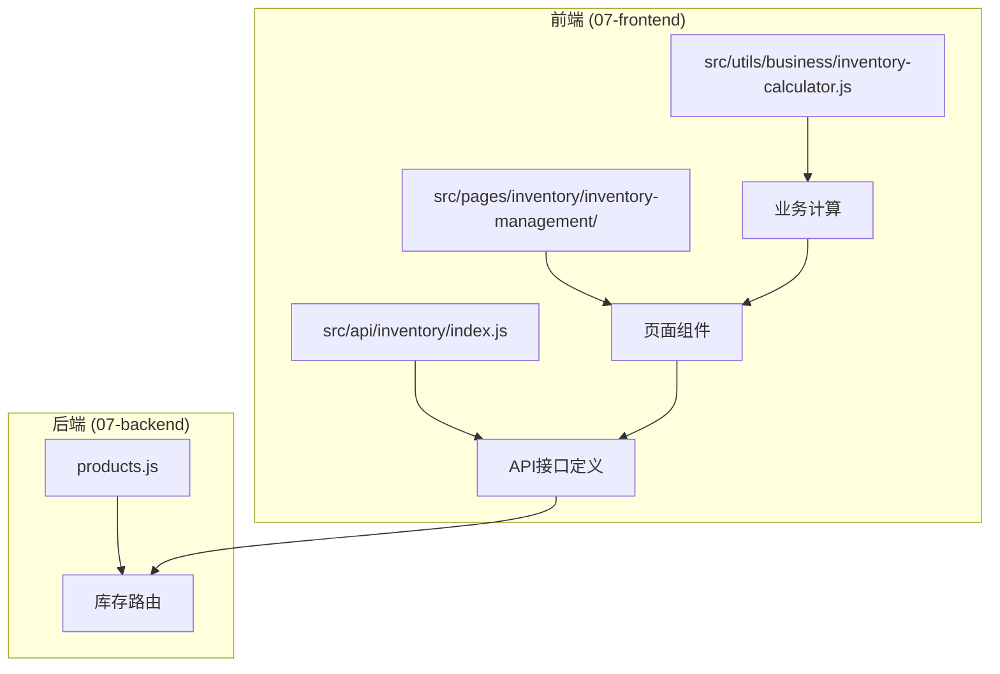
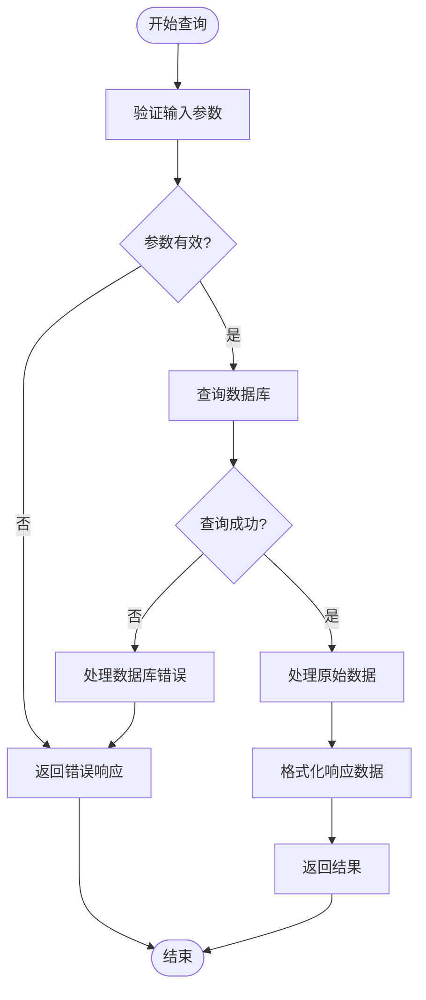
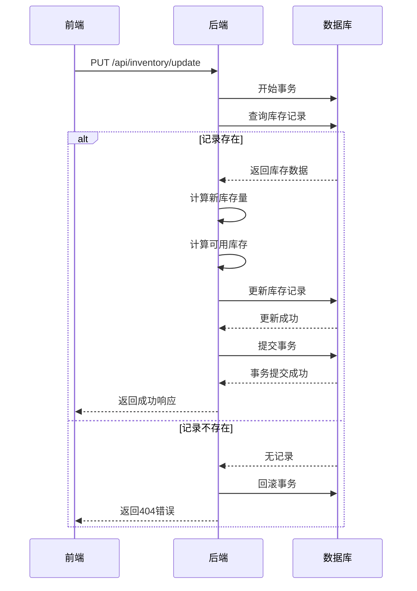
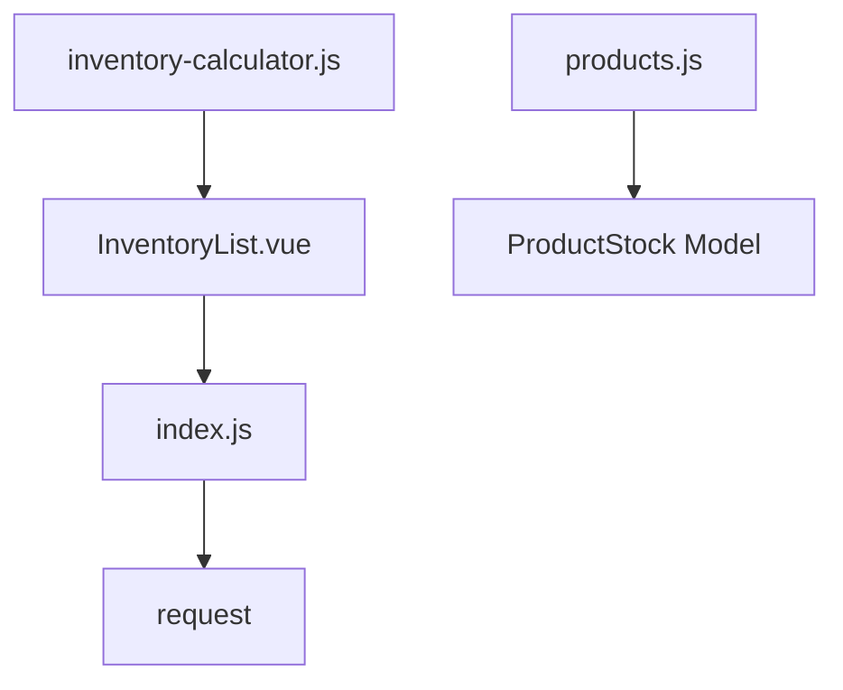

# 库存模块API

<cite>
**本文档引用的文件**   
- [index.js](file://07-frontend/src/api/inventory/index.js)
- [products.js](file://07-backend/routes/products.js)
- [inventory-calculator.js](file://07-frontend/src/utils/business/inventory-calculator.js)
- [InventoryList.vue](file://07-frontend/src/pages/inventory/inventory-management/InventoryList.vue)
- [InventoryDetail.vue](file://07-frontend/src/pages/inventory/inventory-management/InventoryDetail.vue)
- [StockMovement.vue](file://07-frontend/src/pages/inventory/inventory-management/StockMovement.vue)
</cite>

## 目录
1. [简介](#简介)
2. [项目结构](#项目结构)
3. [核心组件](#核心组件)
4. [架构概述](#架构概述)
5. [详细组件分析](#详细组件分析)
6. [依赖分析](#依赖分析)
7. [性能考虑](#性能考虑)
8. [故障排除指南](#故障排除指南)
9. [结论](#结论)
10. [附录](#附录)（如有必要）

## 简介
本文档旨在深入解析库存管理模块的API聚合设计与核心接口。通过分析前端API定义、后端路由实现以及相关业务组件，全面阐述库存查询、库存调整、库存流水等接口集合的设计原理与实现机制。重点说明库存实时查询接口的参数设计、响应结构，以及在高并发场景下的性能优化策略。同时，探讨库存变动操作的事务性保障与错误回滚机制，为开发者提供清晰的系统理解与使用指南。

## 项目结构
库存管理模块的代码分布在前端和后端两个主要部分。前端代码位于`07-frontend`目录下，采用Vue.js框架构建，API接口定义在`src/api/inventory/index.js`文件中，页面组件位于`src/pages/inventory/inventory-management/`目录下。后端代码位于`07-backend`目录下，基于Express框架，库存相关的路由定义在`routes/products.js`文件中。业务计算逻辑则封装在前端的`inventory-calculator.js`工具类中。

**图源**
- [index.js](file://07-frontend/src/api/inventory/index.js)
- [products.js](file://07-backend/routes/products.js)
- [InventoryList.vue](file://07-frontend/src/pages/inventory/inventory-management/InventoryList.vue)
- [inventory-calculator.js](file://07-frontend/src/utils/business/inventory-calculator.js)

**章节源**
- [index.js](file://07-frontend/src/api/inventory/index.js)
- [products.js](file://07-backend/routes/products.js)

## 核心组件
库存模块的核心组件包括前端的API聚合模块、后端的库存路由处理以及相关的业务计算工具。`index.js`文件通过导出多个命名的API对象（如`inventoryApi`、`stockTransferApi`等），实现了对不同业务功能的接口进行逻辑分组和聚合。后端的`products.js`文件则定义了具体的HTTP路由，将前端请求映射到相应的数据库操作。`inventory-calculator.js`提供了库存相关的复杂计算能力，如安全库存、经济订货批量等，支持前端进行智能决策。

**章节源**
- [index.js](file://07-frontend/src/api/inventory/index.js#L1-L430)
- [products.js](file://07-backend/routes/products.js#L490-L577)
- [inventory-calculator.js](file://07-frontend/src/utils/business/inventory-calculator.js#L1-L636)

## 架构概述
库存管理模块采用典型的前后端分离架构。前端通过API聚合层与后端进行通信，后端负责处理业务逻辑并与数据库交互。API设计遵循RESTful风格，通过不同的URL路径和HTTP方法来区分各种操作。

**图源**
- [index.js](file://07-frontend/src/api/inventory/index.js)
- [products.js](file://07-backend/routes/products.js)

## 详细组件分析

### 库存查询接口分析
库存查询接口是系统的核心功能之一，支持通过多种条件进行实时查询。

#### 接口参数与响应结构
库存实时查询接口`getInventoryList`支持丰富的查询参数，以满足不同场景的需求。主要参数包括：
- **仓库ID** (`warehouseId`): 用于指定查询特定仓库的库存。
- **物料编码** (`productCode`): 用于精确查找特定物料的库存信息。
- **产品名称** (`productName`): 用于模糊搜索产品名称。
- **库存状态** (`stockStatus`): 用于筛选正常、预警或缺货的库存。

响应结构包含详细的库存信息，如当前库存量、可用库存、锁定数量、安全库存等。例如，一个典型的响应对象包含`quantity`（当前库存量）、`availableQuantity`（可用库存）和`lockedQuantity`（锁定数量）等关键字段。

**图源**
- [index.js](file://07-frontend/src/api/inventory/index.js#L14-L20)
- [products.js](file://07-backend/routes/products.js#L490-L503)
- [InventoryList.vue](file://07-frontend/src/pages/inventory/inventory-management/InventoryList.vue#L168-L174)

#### 高并发性能优化策略
为应对高并发查询场景，系统实施了多项性能优化策略：
- **分页设置**：通过`pageNum`和`pageSize`参数实现分页查询，避免一次性加载大量数据，减轻数据库和网络压力。
- **字段精简**：API设计时仅返回前端实际需要的字段，减少数据传输量。
- **缓存机制**：虽然在当前代码中未直接体现，但根据系统架构，可以推断出在`request`工具或后端服务中可能集成了缓存层（如Redis），用于缓存热点库存数据，减少对数据库的直接访问。

**章节源**
- [index.js](file://07-frontend/src/api/inventory/index.js#L14-L20)
- [products.js](file://07-backend/routes/products.js#L490-L503)
- [InventoryList.vue](file://07-frontend/src/pages/inventory/inventory-management/InventoryList.vue#L118-L127)

### 库存调整与事务性保障
库存调整操作涉及库存数量的变更，必须保证数据的一致性和完整性。

#### 事务性保障与错误回滚
库存变动操作（如`updateInventory`）在后端实现中通过数据库事务来保障其原子性。当执行库存更新时，系统会先检查库存记录是否存在，然后根据操作类型（增加、减少、设置）计算新的库存数量。在更新库存记录的同时，会计算并更新可用库存量（`availableQuantity`）。整个更新过程在一个数据库事务中完成，如果任何步骤失败，事务将被回滚，确保库存数据不会处于不一致的状态。

**图源**
- [index.js](file://07-frontend/src/api/inventory/index.js#L37-L42)
- [products.js](file://07-backend/routes/products.js#L514-L569)

#### 库存流水接口
库存流水接口`stockMovementApi`用于追踪所有库存变动的历史记录。`getMovementList`接口允许用户根据流水号、产品、业务类型和日期范围进行查询，支持分页。`getMovementDetail`接口则提供单条流水的详细信息，包括变化前后的库存数量、操作人和操作时间等，确保了库存变动的可追溯性。

**章节源**
- [index.js](file://07-frontend/src/api/inventory/index.js#L307-L323)
- [StockMovement.vue](file://07-frontend/src/pages/inventory/inventory-management/StockMovement.vue#L143-L153)

## 依赖分析
库存管理模块的依赖关系清晰。前端页面组件（如`InventoryList.vue`）依赖于API聚合模块（`index.js`）来获取数据。API聚合模块依赖于底层的`request`工具进行HTTP通信。后端路由（`products.js`）依赖于数据库模型（如`ProductStock`）来执行数据操作。此外，前端的业务计算（如库存预测）依赖于`inventory-calculator.js`工具类。

**图源**
- [index.js](file://07-frontend/src/api/inventory/index.js)
- [InventoryList.vue](file://07-frontend/src/pages/inventory/inventory-management/InventoryList.vue)
- [products.js](file://07-backend/routes/products.js)

**章节源**
- [index.js](file://07-frontend/src/api/inventory/index.js)
- [InventoryList.vue](file://07-frontend/src/pages/inventory/inventory-management/InventoryList.vue)
- [products.js](file://07-backend/routes/products.js)

## 性能考虑
除了高并发查询的优化策略外，系统还通过合理的数据库索引设计来提升查询效率。例如，对`productCode`、`warehouse`等常用查询字段建立索引，可以显著加快查询速度。此外，后端的分页查询和前端的懒加载机制共同作用，有效控制了单次请求的数据量，保证了系统的响应速度。

## 故障排除指南
当遇到库存查询或更新失败时，应首先检查网络连接和API端点是否正确。对于更新失败，需确认库存记录是否存在，以及操作类型和数量是否符合业务规则（如库存数量不能为负）。查看后端日志（如`console.error`输出）是定位问题的关键步骤，日志中通常会包含详细的错误信息。

**章节源**
- [products.js](file://07-backend/routes/products.js#L504-L510)
- [products.js](file://07-backend/routes/products.js#L570-L576)

## 结论
库存管理模块通过清晰的API聚合设计，将复杂的库存业务功能（查询、调拨、盘点、调整等）组织成易于理解和使用的接口集合。系统通过分页、字段精简等策略有效应对高并发查询场景，并通过数据库事务保障了库存变动操作的原子性和一致性。前端与后端的职责分离明确，配合业务计算工具，构建了一个功能完整、性能可靠、易于维护的库存管理系统。