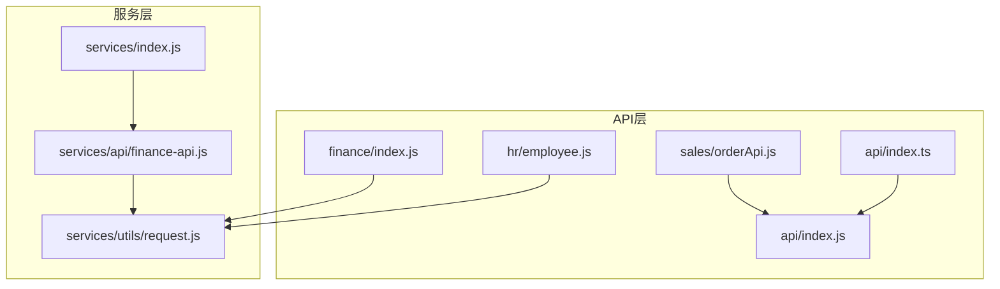
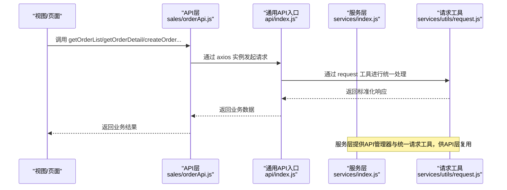
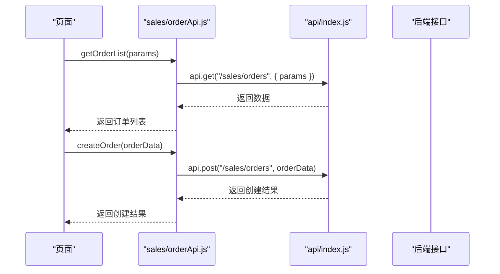
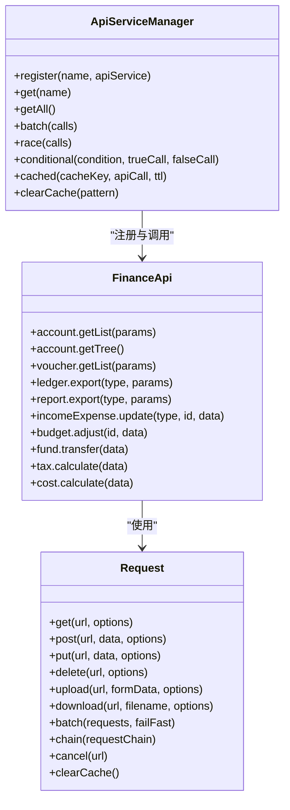
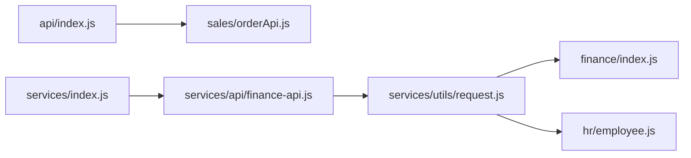

# 模块化API定义

<cite>
**本文引用的文件**
- [finance/index.js](file://07-frontend/src/api/finance/index.js)
- [hr/employee.js](file://07-frontend/src/api/hr/employee.js)
- [sales/orderApi.js](file://07-frontend/src/api/sales/orderApi.js)
- [api/index.js](file://07-frontend/src/api/index.js)
- [api/index.ts](file://07-frontend/src/api/index.ts)
- [finance-api.js](file://07-frontend/src/services/api/finance-api.js)
- [request.js](file://07-frontend/src/services/utils/request.js)
- [services/index.js](file://07-frontend/src/services/index.js)
</cite>

## 目录
1. [引言](#引言)
2. [项目结构](#项目结构)
3. [核心组件](#核心组件)
4. [架构总览](#架构总览)
5. [详细组件分析](#详细组件分析)
6. [依赖关系分析](#依赖关系分析)
7. [性能考量](#性能考量)
8. [故障排查指南](#故障排查指南)
9. [结论](#结论)
10. [附录](#附录)

## 引言
本文件聚焦于前端src/api目录下的模块化API定义与组织方式，重点解析以下内容：
- finance/index.js如何以聚合模式组织财务相关API；
- hr/employee.js如何定义人力资源接口；
- sales/orderApi.js如何封装销售订单操作；
- 对比分析index.js聚合模式与单文件定义模式的适用场景；
- API定义文件如何与services/api层协同工作，形成清晰的调用链路；
- 展示如何定义GET、POST等不同HTTP方法的API接口，以及如何处理复杂参数和文件上传下载。

## 项目结构
前端API层采用“按业务域分包 + 单文件或聚合文件”的组织策略：
- 按业务域划分：finance、hr、sales等目录分别承载对应领域的API定义；
- 聚合模式：finance/index.js将多个财务子模块API聚合为一个入口，便于集中管理和导入；
- 单文件模式：如hr/employee.js、sales/orderApi.js等，每个文件专注一个领域或一组紧密相关的接口；
- 通用API入口：api/index.js提供统一的axios实例、拦截器、通用导出/上传/模板/通用API等；
- 服务层协同：services/api/finance-api.js提供更细粒度的服务封装，与API层互补。

图表来源
- [finance/index.js](file://07-frontend/src/api/finance/index.js#L1-L417)
- [hr/employee.js](file://07-frontend/src/api/hr/employee.js#L1-L369)
- [sales/orderApi.js](file://07-frontend/src/api/sales/orderApi.js#L1-L87)
- [api/index.js](file://07-frontend/src/api/index.js#L1-L372)
- [api/index.ts](file://07-frontend/src/api/index.ts#L1-L39)
- [services/index.js](file://07-frontend/src/services/index.js#L1-L409)
- [finance-api.js](file://07-frontend/src/services/api/finance-api.js#L1-L296)
- [request.js](file://07-frontend/src/services/utils/request.js#L1-L798)

章节来源
- [finance/index.js](file://07-frontend/src/api/finance/index.js#L1-L417)
- [hr/employee.js](file://07-frontend/src/api/hr/employee.js#L1-L369)
- [sales/orderApi.js](file://07-frontend/src/api/sales/orderApi.js#L1-L87)
- [api/index.js](file://07-frontend/src/api/index.js#L1-L372)
- [api/index.ts](file://07-frontend/src/api/index.ts#L1-L39)
- [services/index.js](file://07-frontend/src/services/index.js#L1-L409)
- [finance-api.js](file://07-frontend/src/services/api/finance-api.js#L1-L296)
- [request.js](file://07-frontend/src/services/utils/request.js#L1-L798)

## 核心组件
- 财务聚合API（finance/index.js）：以命名空间形式导出多个财务子模块API，包括总账、凭证、科目余额、试算平衡、利润表、资产负债表、付款跟进、收款管理、发票、应收账款、付款申请、会计科目等。
- 人力资源API（hr/employee.js）：以命名空间形式导出员工管理、入职、离职、调动、薪资、绩效、部门、职位等子模块API。
- 销售订单API（sales/orderApi.js）：基于通用API入口（api/index.js）提供的axios实例，封装订单列表、详情、创建、更新、删除、批量删除、提交、批量提交等操作。
- 通用API入口（api/index.js）：提供统一的axios实例、请求/响应拦截器、销售订单、产品、客户、上传、模板、通用API等；同时提供dataUtils工具集（导出、格式化、编号生成等）。
- 服务层协同（services/index.js + services/api/finance-api.js + services/utils/request.js）：services/index.js提供API服务管理器，统一注册与调用各API模块；services/api/finance-api.js提供更细粒度的财务服务封装；services/utils/request.js提供统一的底层请求工具（支持拦截器、重试、缓存、取消、批量、链式等），被API层复用。

章节来源
- [finance/index.js](file://07-frontend/src/api/finance/index.js#L1-L417)
- [hr/employee.js](file://07-frontend/src/api/hr/employee.js#L1-L369)
- [sales/orderApi.js](file://07-frontend/src/api/sales/orderApi.js#L1-L87)
- [api/index.js](file://07-frontend/src/api/index.js#L1-L372)
- [services/index.js](file://07-frontend/src/services/index.js#L1-L409)
- [finance-api.js](file://07-frontend/src/services/api/finance-api.js#L1-L296)
- [request.js](file://07-frontend/src/services/utils/request.js#L1-L798)

## 架构总览
API层与服务层的协作关系如下：
- API层负责面向业务的接口定义与封装；
- 服务层提供统一的请求工具与API服务管理器；
- 两者通过共享的请求工具（services/utils/request.js）实现一致的错误处理、拦截器、重试与下载能力。

图表来源
- [sales/orderApi.js](file://07-frontend/src/api/sales/orderApi.js#L1-L87)
- [api/index.js](file://07-frontend/src/api/index.js#L1-L372)
- [services/index.js](file://07-frontend/src/services/index.js#L1-L409)
- [request.js](file://07-frontend/src/services/utils/request.js#L1-L798)

## 详细组件分析

### 财务聚合API（finance/index.js）
- 设计模式：聚合模式。将财务相关的一系列API以命名空间导出，便于按模块导入与使用。
- 结构特点：
  - 每个子模块（如generalLedgerApi、voucherApi、accountBalanceApi等）均提供标准的CRUD与业务操作方法；
  - 统一使用request工具发起HTTP请求，支持GET/POST/PUT/DELETE等方法；
  - 对导出类操作（如报表导出）设置responseType为blob，便于前端下载。
- 适用场景：当某业务域接口数量较多、功能相近时，采用聚合模式可提升可维护性与可发现性。

```mermaid
classDiagram
class GeneralLedgerApi {
+getGeneralLedgerList(params)
+getGeneralLedgerDetail(id)
+createGeneralLedger(data)
+updateGeneralLedger(data)
+deleteGeneralLedger(id)
+approveGeneralLedger(data)
}
class VoucherApi {
+getVoucherList(params)
+createVoucher(data)
+reviewVoucher(data)
+getVoucherDetail(id)
}
class AccountBalanceApi {
+getAccountBalanceReport(params)
+exportAccountBalance(params)
}
class TrialBalanceApi {
+getTrialBalance(params)
+exportTrialBalance(params)
}
class ProfitStatementApi {
+getProfitStatement(params)
+exportProfitStatement(params)
}
class BalanceSheetApi {
+getBalanceSheet(params)
+exportBalanceSheet(params)
}
class PaymentFollowUpApi {
+getPaymentFollowUpList(params)
+createFollowUpRecord(data)
+markAsPaid(data)
}
class CollectionApi {
+getCollectionList(params)
+createCollection(data)
}
class InvoiceApi {
+getInvoiceList(params)
+createInvoice(data)
}
class AccountReceivableApi {
+getAccountReceivableList(params)
+getAgingAnalysis(params)
}
class PaymentApplicationApi {
+getPaymentApplicationList(params)
+createPaymentApplication(data)
+approvePaymentApplication(data)
}
class AccountSubjectApi {
+getAccountSubjectList(params)
+getAccountSubjectTree()
}
GeneralLedgerApi --> Request : "使用"
VoucherApi --> Request : "使用"
AccountBalanceApi --> Request : "使用"
TrialBalanceApi --> Request : "使用"
ProfitStatementApi --> Request : "使用"
BalanceSheetApi --> Request : "使用"
PaymentFollowUpApi --> Request : "使用"
CollectionApi --> Request : "使用"
InvoiceApi --> Request : "使用"
AccountReceivableApi --> Request : "使用"
PaymentApplicationApi --> Request : "使用"
AccountSubjectApi --> Request : "使用"
```

图表来源
- [finance/index.js](file://07-frontend/src/api/finance/index.js#L1-L417)
- [request.js](file://07-frontend/src/services/utils/request.js#L1-L798)

章节来源
- [finance/index.js](file://07-frontend/src/api/finance/index.js#L1-L417)
- [request.js](file://07-frontend/src/services/utils/request.js#L1-L798)

### 人力资源API（hr/employee.js）
- 设计模式：聚合模式。将员工管理、入职、离职、调动、薪资、绩效、部门、职位等子模块API以命名空间导出。
- 特点：
  - 提供标准CRUD与业务流程方法（如入职审批、离职审批、薪资批量发放、绩效评分与审批等）；
  - 统一使用request工具，支持GET/POST/PUT/DELETE等方法；
  - 部分接口支持无参或简单参数，便于在页面中直接调用。

章节来源
- [hr/employee.js](file://07-frontend/src/api/hr/employee.js#L1-L369)
- [request.js](file://07-frontend/src/services/utils/request.js#L1-L798)

### 销售订单API（sales/orderApi.js）
- 设计模式：单文件定义模式。该文件直接封装销售订单相关接口，并基于通用API入口（api/index.js）提供的axios实例进行请求。
- 特点：
  - 通过api.get/post/put/delete等方法封装常用HTTP操作；
  - 支持复杂参数（如分页、日期范围、状态过滤等）；
  - 支持批量操作（批量删除、批量提交）；
  - 通过通用API入口的拦截器实现统一鉴权与错误处理。

图表来源
- [sales/orderApi.js](file://07-frontend/src/api/sales/orderApi.js#L1-L87)
- [api/index.js](file://07-frontend/src/api/index.js#L1-L372)

章节来源
- [sales/orderApi.js](file://07-frontend/src/api/sales/orderApi.js#L1-L87)
- [api/index.js](file://07-frontend/src/api/index.js#L1-L372)

### 通用API入口（api/index.js）
- 功能：
  - 创建axios实例并配置baseURL、超时、Content-Type等；
  - 请求拦截器：从本地存储读取token并注入Authorization头；
  - 响应拦截器：统一提取响应数据，401时清理token并跳转登录；
  - 提供销售订单、产品、客户、上传、模板、通用API等；
  - 提供dataUtils工具集：导出响应处理、金额格式化、日期格式化、订单号生成等。
- 适用场景：作为通用HTTP客户端，为业务API提供统一的请求与响应处理。

章节来源
- [api/index.js](file://07-frontend/src/api/index.js#L1-L372)

### 服务层协同（services/index.js + services/api/finance-api.js + services/utils/request.js）
- services/index.js：
  - 提供API服务管理器，统一注册与获取API服务；
  - 提供批量调用、并发调用、条件调用、缓存调用、性能监控等高级能力；
  - 提供默认请求/响应拦截器，统一处理鉴权与响应结构。
- services/api/finance-api.js：
  - 在服务层提供更细粒度的财务API封装，如科目、凭证、账簿、报表、收支、预算、资金、税务、成本等；
  - 与底层request工具配合，支持下载、重试、缓存等能力。
- services/utils/request.js：
  - 提供统一的请求工具类，支持拦截器、重试、缓存、取消、批量、链式、下载、上传进度等；
  - 作为API层与服务层的共同依赖，确保一致的行为与体验。

图表来源
- [services/index.js](file://07-frontend/src/services/index.js#L1-L409)
- [finance-api.js](file://07-frontend/src/services/api/finance-api.js#L1-L296)
- [request.js](file://07-frontend/src/services/utils/request.js#L1-L798)

章节来源
- [services/index.js](file://07-frontend/src/services/index.js#L1-L409)
- [finance-api.js](file://07-frontend/src/services/api/finance-api.js#L1-L296)
- [request.js](file://07-frontend/src/services/utils/request.js#L1-L798)

## 依赖关系分析
- API层对底层请求工具的依赖：
  - finance/index.js、hr/employee.js等直接依赖services/utils/request.js；
  - sales/orderApi.js依赖api/index.js提供的axios实例；
- 服务层对API层的依赖：
  - services/index.js统一注册与管理API模块（如finance-api.js），并通过管理器对外提供便捷调用；
- 通用API入口与服务层的关系：
  - api/index.js提供axios实例与拦截器，服务于API层；
  - services/index.js提供API服务管理器，服务于上层业务逻辑。

图表来源
- [finance/index.js](file://07-frontend/src/api/finance/index.js#L1-L417)
- [hr/employee.js](file://07-frontend/src/api/hr/employee.js#L1-L369)
- [sales/orderApi.js](file://07-frontend/src/api/sales/orderApi.js#L1-L87)
- [api/index.js](file://07-frontend/src/api/index.js#L1-L372)
- [services/index.js](file://07-frontend/src/services/index.js#L1-L409)
- [finance-api.js](file://07-frontend/src/services/api/finance-api.js#L1-L296)
- [request.js](file://07-frontend/src/services/utils/request.js#L1-L798)

章节来源
- [finance/index.js](file://07-frontend/src/api/finance/index.js#L1-L417)
- [hr/employee.js](file://07-frontend/src/api/hr/employee.js#L1-L369)
- [sales/orderApi.js](file://07-frontend/src/api/sales/orderApi.js#L1-L87)
- [api/index.js](file://07-frontend/src/api/index.js#L1-L372)
- [services/index.js](file://07-frontend/src/services/index.js#L1-L409)
- [finance-api.js](file://07-frontend/src/services/api/finance-api.js#L1-L296)
- [request.js](file://07-frontend/src/services/utils/request.js#L1-L798)

## 性能考量
- 请求拦截与统一处理：通过请求/响应拦截器减少重复代码，提升一致性与可维护性。
- 重试与超时：底层request工具支持重试与超时控制，有助于提升网络不稳定环境下的成功率。
- 缓存与取消：底层request工具支持缓存与取消请求，避免重复请求与内存泄漏。
- 批量与链式：支持批量请求与链式请求，优化多步操作的性能与可靠性。
- 导出与下载：统一的下载机制与blob处理，避免大文件导致的内存压力。

[本节为通用指导，无需列出具体文件来源]

## 故障排查指南
- 401未授权：
  - 通用API入口会在响应拦截器中检测401并清理token与跳转登录；
  - 检查本地存储中的token是否存在且有效。
- 跨域与CORS：
  - 确认baseURL与后端接口一致，检查CORS配置；
  - 如使用代理，请确认代理规则正确。
- 参数格式问题：
  - GET参数需为对象，复杂参数建议序列化为字符串或数组；
  - POST/PUT请求体需为JSON或FormData，注意Content-Type设置。
- 文件上传/下载：
  - 上传使用FormData，确保Content-Type由浏览器自动设置；
  - 下载使用blob并触发浏览器下载，注意文件名与MIME类型。
- 请求取消与缓存：
  - 需要取消请求时，使用底层request工具的cancel方法；
  - 缓存仅对GET生效，必要时清除缓存或禁用缓存。

章节来源
- [api/index.js](file://07-frontend/src/api/index.js#L1-L372)
- [request.js](file://07-frontend/src/services/utils/request.js#L1-L798)

## 结论
- 聚合模式（finance/index.js）适合接口数量多、功能相近的业务域，便于集中管理与导入；
- 单文件模式（hr/employee.js、sales/orderApi.js）适合接口数量较少或功能相对独立的模块；
- API层与服务层通过共享的请求工具与API管理器形成清晰的调用链路，既保证了统一性，又提供了灵活的扩展能力；
- 通过拦截器、重试、缓存、取消、批量与链式等能力，整体API体系具备良好的稳定性与可维护性。

[本节为总结性内容，无需列出具体文件来源]

## 附录

### HTTP方法与复杂参数示例（路径引用）
- GET列表与分页参数
  - 示例路径：[sales/orderApi.js](file://07-frontend/src/api/sales/orderApi.js#L18-L20)
  - 示例路径：[api/index.js](file://07-frontend/src/api/index.js#L156-L179)
- POST创建与PUT更新
  - 示例路径：[sales/orderApi.js](file://07-frontend/src/api/sales/orderApi.js#L36-L48)
  - 示例路径：[api/index.js](file://07-frontend/src/api/index.js#L106-L118)
- DELETE与批量删除
  - 示例路径：[sales/orderApi.js](file://07-frontend/src/api/sales/orderApi.js#L55-L66)
  - 示例路径：[api/index.js](file://07-frontend/src/api/index.js#L116-L123)
- 复杂参数（对象、数组、日期范围）
  - 示例路径：[sales/orderApi.js](file://07-frontend/src/api/sales/orderApi.js#L18-L20)
  - 示例路径：[api/index.js](file://07-frontend/src/api/index.js#L181-L190)
- 文件上传与下载
  - 上传（单文件/多文件）
    - 示例路径：[api/index.js](file://07-frontend/src/api/index.js#L218-L257)
    - 示例路径：[api/index.ts](file://07-frontend/src/api/index.ts#L1-L39)
  - 下载（blob）
    - 示例路径：[finance/index.js](file://07-frontend/src/api/finance/index.js#L141-L148)
    - 示例路径：[finance/index.js](file://07-frontend/src/api/finance/index.js#L169-L176)
    - 示例路径：[finance/index.js](file://07-frontend/src/api/finance/index.js#L197-L204)
    - 示例路径：[finance/index.js](file://07-frontend/src/api/finance/index.js#L225-L232)
    - 示例路径：[finance/index.js](file://07-frontend/src/api/finance/index.js#L264-L269)
    - 示例路径：[finance/index.js](file://07-frontend/src/api/finance/index.js#L291-L296)
    - 示例路径：[finance/index.js](file://07-frontend/src/api/finance/index.js#L318-L324)
    - 示例路径：[finance/index.js](file://07-frontend/src/api/finance/index.js#L345-L351)
    - 示例路径：[finance/index.js](file://07-frontend/src/api/finance/index.js#L372-L379)
    - 示例路径：[finance/index.js](file://07-frontend/src/api/finance/index.js#L383-L389)
    - 示例路径：[finance/index.js](file://07-frontend/src/api/finance/index.js#L409-L416)
  - 服务层下载
    - 示例路径：[finance-api.js](file://07-frontend/src/services/api/finance-api.js#L76-L78)
    - 示例路径：[finance-api.js](file://07-frontend/src/services/api/finance-api.js#L104-L106)
    - 示例路径：[finance-api.js](file://07-frontend/src/services/api/finance-api.js#L137-L139)