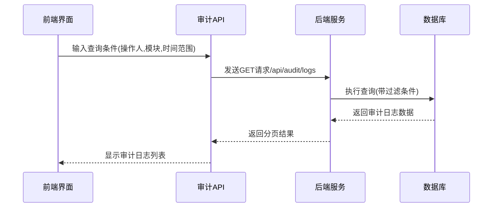
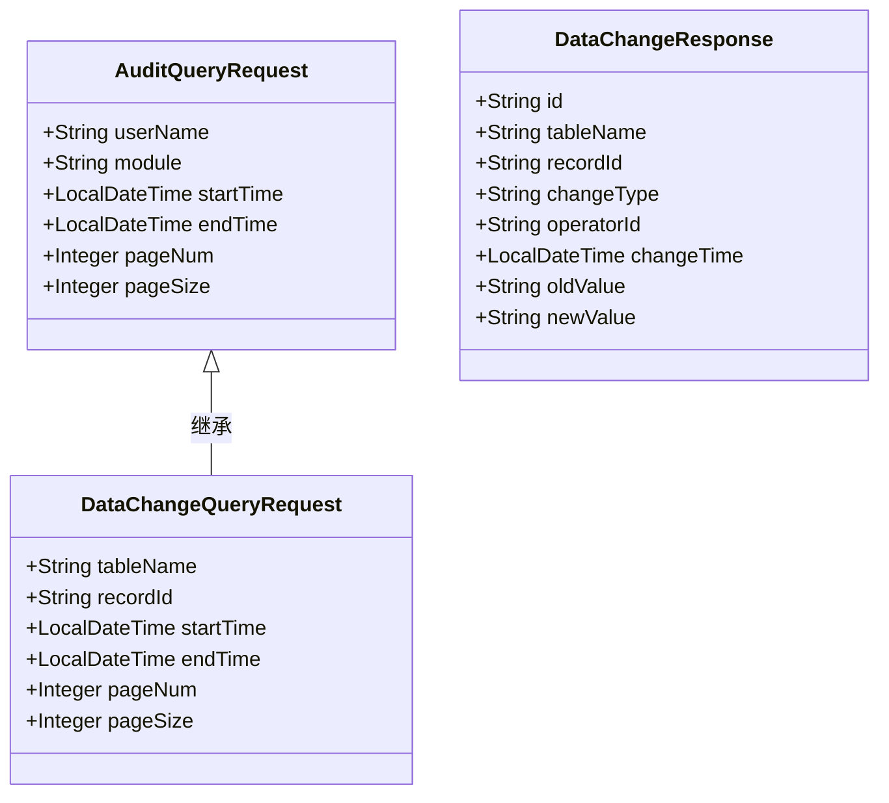
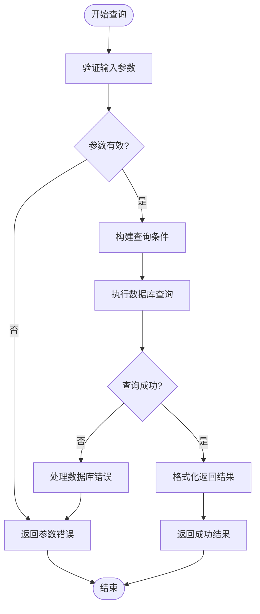
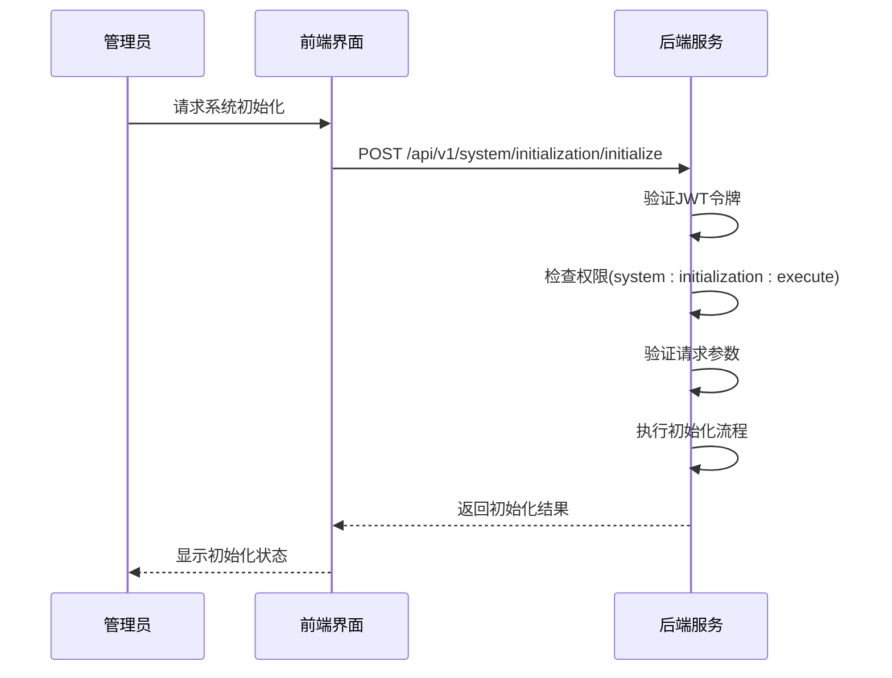
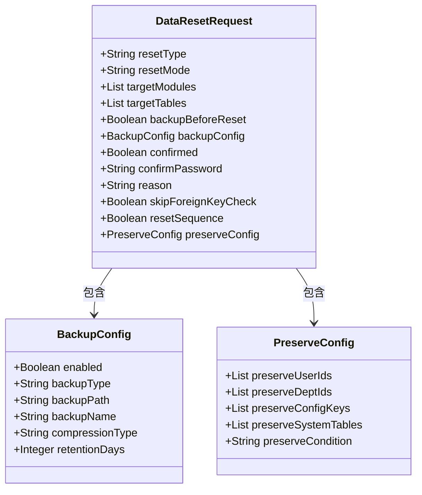
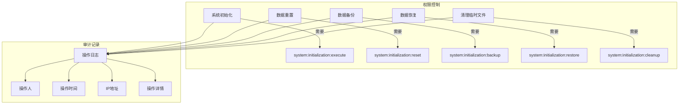
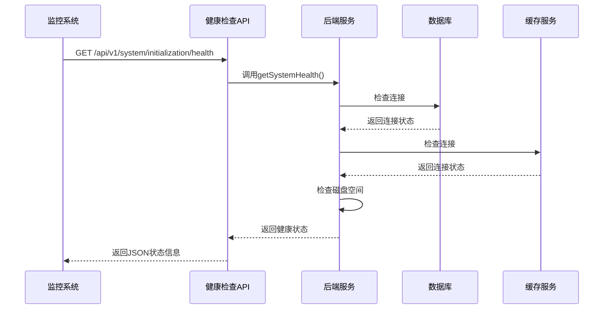
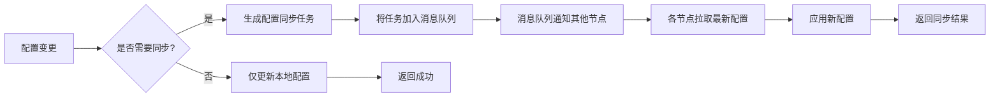
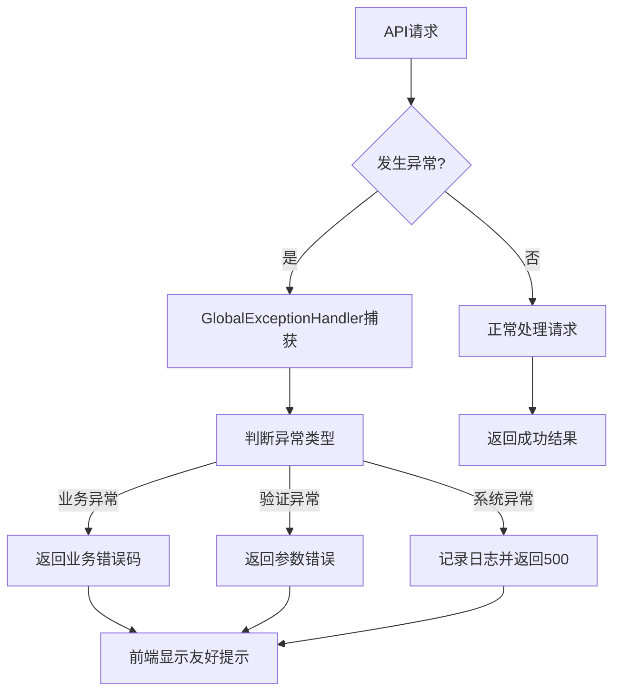
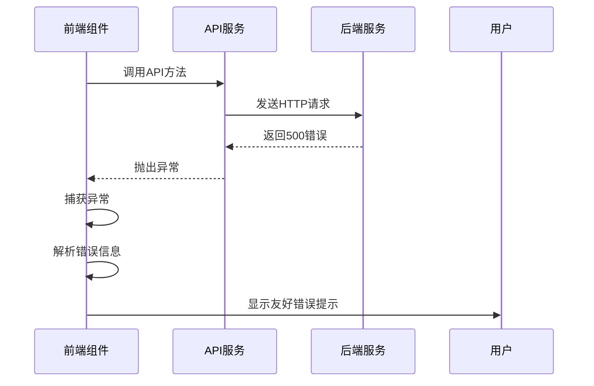

# 系统模块API

<cite>
**本文档引用的文件**   
- [audit.js](file://07-frontend/src/api/system/audit.js)
- [initialization.js](file://07-frontend/src/api/system/initialization.js)
- [initialization-service.js](file://07-frontend/src/services/initialization-service.js)
- [AuditLogController.java](file://08-backend/src/main/java/com/enterprise/brain/modules/system/audit/controller/AuditLogController.java)
- [DataChangeController.java](file://08-backend/src/main/java/com/enterprise/brain/modules/system/audit/controller/DataChangeController.java)
- [SystemInitializeController.java](file://08-backend/src/main/java/com/enterprise/brain/modules/system/initialization/controller/SystemInitializeController.java)
- [SystemInitializeService.java](file://08-backend/src/main/java/com/enterprise/brain/modules/system/initialization/service/SystemInitializeService.java)
- [InitializeRequest.java](file://08-backend/src/main/java/com/enterprise/brain/modules/system/initialization/dto/request/InitializeRequest.java)
- [DataResetRequest.java](file://08-backend/src/main/java/com/enterprise/brain/modules/system/initialization/dto/request/DataResetRequest.java)
- [AuditLogList.vue](file://07-frontend/src/pages/system/audit-management/AuditLogList.vue)
- [DataChangeList.vue](file://07-frontend/src/pages/system/audit-management/DataChangeList.vue)
- [OperationTrace.vue](file://07-frontend/src/pages/system/audit-management/OperationTrace.vue)
</cite>

## 目录
1. [引言](#引言)
2. [审计API设计与实现](#审计api设计与实现)
3. [初始化与数据重置安全控制](#初始化与数据重置安全控制)
4. [运维类接口调用模式](#运维类接口调用模式)
5. [异常处理策略](#异常处理策略)
6. [总结](#总结)

## 引言
本文档深入解析企业级系统管理模块中的审计与初始化API。重点分析操作日志查询、数据变更追溯等审计功能的设计原理，以及系统初始化、数据重置等高危操作的安全控制机制。通过前后端代码分析，展示系统健康检查、配置同步等运维接口的调用模式与异常处理策略，为系统管理员和开发人员提供全面的技术参考。

## 审计API设计与实现

系统审计模块提供了全面的操作日志记录与查询功能，支持通过多种参数实现精准过滤。

### 操作日志查询接口
审计日志API支持通过操作人、操作模块、时间范围等参数进行精确查询。前端通过`auditLogApi.getAuditLogs`方法调用后端接口，传递查询参数实现灵活检索。

**图示来源**
- [audit.js](file://07-frontend/src/api/system/audit.js#L5-L9)
- [AuditLogController.java](file://08-backend/src/main/java/com/enterprise/brain/modules/system/audit/controller/AuditLogController.java#L20-L22)
- [AuditQueryRequest.java](file://08-backend/src/main/java/com/enterprise/brain/modules/system/audit/dto/request/AuditQueryRequest.java)

**本节来源**
- [audit.js](file://07-frontend/src/api/system/audit.js)
- [AuditLogController.java](file://08-backend/src/main/java/com/enterprise/brain/modules/system/audit/controller/AuditLogController.java)
- [AuditLogList.vue](file://07-frontend/src/pages/system/audit-management/AuditLogList.vue)

### 数据变更追溯接口
数据变更追溯功能记录了所有数据表的增删改操作，支持按表名、记录ID和时间范围进行查询。变更类型通过标签颜色区分：新增(绿色)、更新(黄色)、删除(红色)。

**图示来源**
- [DataChangeQueryRequest.java](file://08-backend/src/main/java/com/enterprise/brain/modules/system/audit/dto/request/DataChangeQueryRequest.java)
- [dataChangeApi.js](file://07-frontend/src/api/system/audit.js#L19-L23)
- [DataChangeList.vue](file://07-frontend/src/pages/system/audit-management/DataChangeList.vue)

**本节来源**
- [audit.js](file://07-frontend/src/api/system/audit.js)
- [DataChangeController.java](file://08-backend/src/main/java/com/enterprise/brain/modules/system/audit/controller/DataChangeController.java)
- [DataChangeList.vue](file://07-frontend/src/pages/system/audit-management/DataChangeList.vue)

### 操作轨迹跟踪
操作轨迹功能记录了用户会话级别的操作流程，包括开始时间、结束时间和执行状态。支持按用户ID、会话ID和操作状态进行过滤查询。

**图示来源**
- [operationTraceApi.js](file://07-frontend/src/api/system/audit.js#L28-L32)
- [OperationTrace.vue](file://07-frontend/src/pages/system/audit-management/OperationTrace.vue)
- [AuditLogController.java](file://08-backend/src/main/java/com/enterprise/brain/modules/system/audit/controller/AuditLogController.java)

**本节来源**
- [audit.js](file://07-frontend/src/api/system/audit.js)
- [OperationTrace.vue](file://07-frontend/src/pages/system/audit-management/OperationTrace.vue)

## 初始化与数据重置安全控制

系统初始化和数据重置属于高危操作，系统通过多重安全机制确保操作的安全性。

### 系统初始化安全机制
系统初始化接口通过权限验证、环境检查和二次确认等机制确保操作安全。只有具备`system:initialization:execute`权限的管理员才能执行初始化操作。

**图示来源**
- [initialization.js](file://07-frontend/src/api/system/initialization.js#L14-L19)
- [SystemInitializeController.java](file://08-backend/src/main/java/com/enterprise/brain/modules/system/initialization/controller/SystemInitializeController.java#L60-L74)
- [InitializeRequest.java](file://08-backend/src/main/java/com/enterprise/brain/modules/system/initialization/dto/request/InitializeRequest.java)

**本节来源**
- [initialization.js](file://07-frontend/src/api/system/initialization.js)
- [SystemInitializeController.java](file://08-backend/src/main/java/com/enterprise/brain/modules/system/initialization/controller/SystemInitializeController.java)
- [SystemInitializeService.java](file://08-backend/src/main/java/com/enterprise/brain/modules/system/initialization/service/SystemInitializeService.java)

### 数据重置双重确认机制
数据重置操作采用双重确认机制，要求操作者提供确认密码并明确操作原因。系统还支持重置前自动备份，防止数据丢失。

**图示来源**
- [DataResetRequest.java](file://08-backend/src/main/java/com/enterprise/brain/modules/system/initialization/dto/request/DataResetRequest.java)
- [initialization.js](file://07-frontend/src/api/system/initialization.js#L61-L66)
- [SystemInitializeController.java](file://08-backend/src/main/java/com/enterprise/brain/modules/system/initialization/controller/SystemInitializeController.java#L79-L93)

**本节来源**
- [initialization.js](file://07-frontend/src/api/system/initialization.js)
- [DataResetRequest.java](file://08-backend/src/main/java/com/enterprise/brain/modules/system/initialization/dto/request/DataResetRequest.java)
- [SystemInitializeController.java](file://08-backend/src/main/java/com/enterprise/brain/modules/system/initialization/controller/SystemInitializeController.java)

### 权限隔离与审计
所有高危操作都受到严格的权限控制，不同操作需要不同的权限码。同时，所有操作都会被记录到审计日志中，实现操作可追溯。

**图示来源**
- [SystemInitializeController.java](file://08-backend/src/main/java/com/enterprise/brain/modules/system/initialization/controller/SystemInitializeController.java#L50-L190)
- [AuditLogController.java](file://08-backend/src/main/java/com/enterprise/brain/modules/system/audit/controller/AuditLogController.java)
- [initialization.js](file://07-frontend/src/api/system/initialization.js)

**本节来源**
- [SystemInitializeController.java](file://08-backend/src/main/java/com/enterprise/brain/modules/system/initialization/controller/SystemInitializeController.java)
- [AuditLogController.java](file://08-backend/src/main/java/com/enterprise/brain/modules/system/audit/controller/AuditLogController.java)

## 运维类接口调用模式

系统提供了丰富的运维类接口，用于系统健康检查、配置同步等日常维护操作。

### 系统健康检查接口
健康检查接口用于监控系统运行状态，包括数据库连接、缓存服务、文件系统等关键组件的健康状况。

**图示来源**
- [SystemInitializeController.java](file://08-backend/src/main/java/com/enterprise/brain/modules/system/initialization/controller/SystemInitializeController.java#L206-L218)
- [SystemInitializeService.java](file://08-backend/src/main/java/com/enterprise/brain/modules/system/initialization/service/SystemInitializeService.java#L73-L74)

**本节来源**
- [SystemInitializeController.java](file://08-backend/src/main/java/com/enterprise/brain/modules/system/initialization/controller/SystemInitializeController.java)
- [SystemInitializeService.java](file://08-backend/src/main/java/com/enterprise/brain/modules/system/initialization/service/SystemInitializeService.java)

### 配置同步接口
配置同步接口用于在集群环境中同步系统配置，确保所有节点使用一致的配置。

**图示来源**
- [SystemInitializeController.java](file://08-backend/src/main/java/com/enterprise/brain/modules/system/initialization/controller/SystemInitializeController.java)
- [SystemInitializeService.java](file://08-backend/src/main/java/com/enterprise/brain/modules/system/initialization/service/SystemInitializeService.java)

**本节来源**
- [SystemInitializeController.java](file://08-backend/src/main/java/com/enterprise/brain/modules/system/initialization/controller/SystemInitializeController.java)
- [SystemInitializeService.java](file://08-backend/src/main/java/com/enterprise/brain/modules/system/initialization/service/SystemInitializeService.java)

## 异常处理策略

系统采用统一的异常处理机制，确保API返回一致的错误信息格式。

### 统一异常处理
后端使用`GlobalExceptionHandler`统一处理所有异常，返回标准化的错误响应，便于前端进行错误处理。

**图示来源**
- [SystemInitializeController.java](file://08-backend/src/main/java/com/enterprise/brain/modules/system/initialization/controller/SystemInitializeController.java#L71-L73)
- [SystemInitializeController.java](file://08-backend/src/main/java/com/enterprise/brain/modules/system/initialization/controller/SystemInitializeController.java#L90-L92)

**本节来源**
- [SystemInitializeController.java](file://08-backend/src/main/java/com/enterprise/brain/modules/system/initialization/controller/SystemInitializeController.java)
- [AuditException.java](file://08-backend/src/main/java/com/enterprise/brain/modules/system/audit/exception/AuditException.java)

### 前端错误处理
前端在调用API时使用try-catch捕获异常，将技术性错误转换为用户友好的提示信息。

**图示来源**
- [AuditLogList.vue](file://07-frontend/src/pages/system/audit-management/AuditLogList.vue#L85-L87)
- [DataChangeList.vue](file://07-frontend/src/pages/system/audit-management/DataChangeList.vue#L109-L111)
- [OperationTrace.vue](file://07-frontend/src/pages/system/audit-management/OperationTrace.vue#L87-L88)

**本节来源**
- [AuditLogList.vue](file://07-frontend/src/pages/system/audit-management/AuditLogList.vue)
- [DataChangeList.vue](file://07-frontend/src/pages/system/audit-management/DataChangeList.vue)
- [OperationTrace.vue](file://07-frontend/src/pages/system/audit-management/OperationTrace.vue)

## 总结
本文档详细解析了系统管理模块的审计与初始化API。审计模块通过灵活的查询参数支持精准的日志过滤和数据变更追溯；初始化模块采用权限控制、二次确认和操作审计等多重安全机制保障高危操作的安全性；运维接口提供了系统健康检查和配置同步等功能，配合完善的异常处理策略，确保系统的稳定可靠运行。这些设计体现了企业级系统在安全性、可维护性和用户体验方面的综合考量。