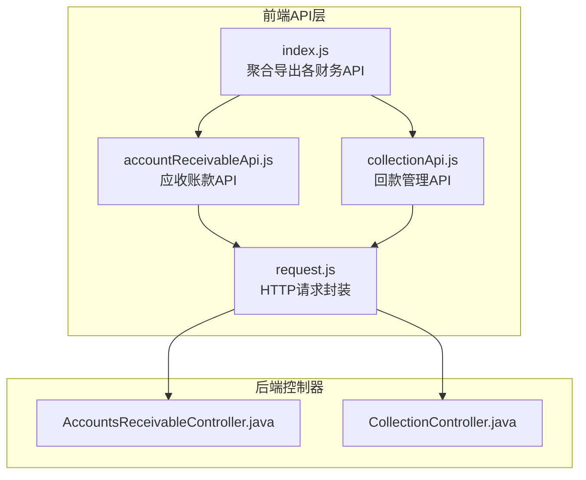
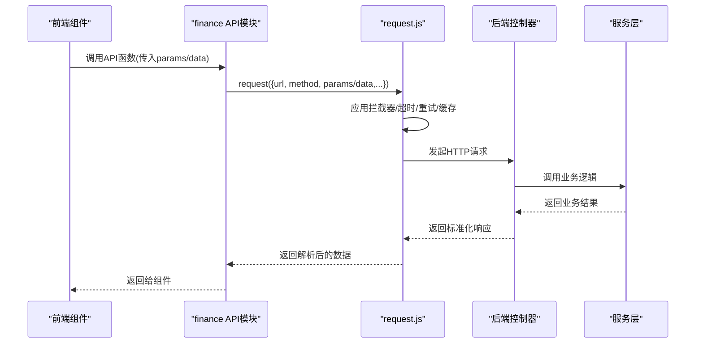
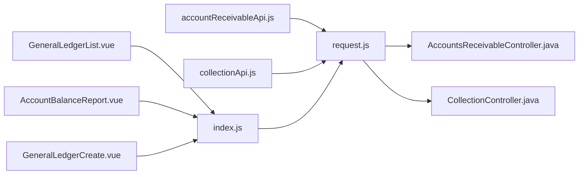

# 财务模块API

<cite>
**本文引用的文件**
- [index.js](file://07-frontend/src/api/finance/index.js)
- [accountReceivableApi.js](file://07-frontend/src/api/finance/accountReceivableApi.js)
- [collectionApi.js](file://07-frontend/src/api/finance/collectionApi.js)
- [request.js](file://07-frontend/src/services/utils/request.js)
- [AccountsReceivableController.java](file://08-backend/src/main/java/com/enterprise/brain/modules/finance/controller/AccountsReceivableController.java)
- [CollectionController.java](file://08-backend/src/main/java/com/enterprise/brain/modules/finance/controller/CollectionController.java)
- [GeneralLedgerList.vue](file://07-frontend/src/pages/finance/general-ledger/GeneralLedgerList.vue)
- [AccountBalanceReport.vue](file://07-frontend/src/pages/finance/general-ledger/AccountBalanceReport.vue)
- [GeneralLedgerCreate.vue](file://07-frontend/src/pages/finance/general-ledger/GeneralLedgerCreate.vue)
- [finance-api.js](file://07-frontend/src/services/api/finance-api.js)
</cite>

## 目录
1. [简介](#简介)
2. [项目结构](#项目结构)
3. [核心组件](#核心组件)
4. [架构总览](#架构总览)
5. [详细组件分析](#详细组件分析)
6. [依赖关系分析](#依赖关系分析)
7. [性能考量](#性能考量)
8. [故障排查指南](#故障排查指南)
9. [结论](#结论)

## 简介
本文件系统性解析前端财务模块API的组织结构与实现方式，重点覆盖：
- index.js 如何聚合应收账款、收款管理等子模块API
- accountReceivableApi.js 定义应收单据查询与状态更新接口
- collectionApi.js 封装回款计划与实际回款操作
- axios 封装的 GET/POST 请求、分页查询、金额计算、状态变更等业务场景
- API 函数的参数设计（分页参数、过滤条件）与响应数据结构
- 错误处理机制及与全局 loading 的集成方式

## 项目结构
财务模块API位于前端 07-frontend/src/api/finance 目录下，采用“按功能域划分”的组织方式：
- index.js：集中导出各类财务API（总账、凭证、报表、付款跟进、收款、发票、应收账款、付款申请、会计科目等）
- accountReceivableApi.js：应收账款相关接口（列表、账龄分析、提醒、跟进）
- collectionApi.js：回款计划与回款记录相关接口（计划 CRUD、状态流转、执行记录、导出）

同时，请求封装层位于 07-frontend/src/services/utils/request.js，提供统一的 HTTP 请求能力、拦截器、重试、缓存、取消、下载等能力。

图表来源
- [index.js](file://07-frontend/src/api/finance/index.js#L1-L417)
- [accountReceivableApi.js](file://07-frontend/src/api/finance/accountReceivableApi.js#L1-L135)
- [collectionApi.js](file://07-frontend/src/api/finance/collectionApi.js#L1-L144)
- [request.js](file://07-frontend/src/services/utils/request.js#L1-L798)
- [AccountsReceivableController.java](file://08-backend/src/main/java/com/enterprise/brain/modules/finance/controller/AccountsReceivableController.java#L1-L145)
- [CollectionController.java](file://08-backend/src/main/java/com/enterprise/brain/modules/finance/controller/CollectionController.java#L1-L159)

章节来源
- [index.js](file://07-frontend/src/api/finance/index.js#L1-L417)
- [accountReceivableApi.js](file://07-frontend/src/api/finance/accountReceivableApi.js#L1-L135)
- [collectionApi.js](file://07-frontend/src/api/finance/collectionApi.js#L1-L144)
- [request.js](file://07-frontend/src/services/utils/request.js#L1-L798)

## 核心组件
- 财务API聚合器（index.js）
  - 提供总账、凭证、报表、付款跟进、收款、发票、应收账款、付款申请、会计科目等模块的统一导出
  - 所有接口均通过 request.js 进行底层网络调用
- 应收账款API（accountReceivableApi.js）
  - 列表查询、账龄分析、导出、回款提醒、跟进记录等
- 回款管理API（collectionApi.js）
  - 回款计划 CRUD、状态流转（确认/执行/完成/终止）、记录回款、执行记录、导出
- 请求封装（request.js）
  - 统一的 GET/POST/PUT/PATCH/DELETE 等方法
  - 支持超时、重试、缓存、取消、拦截器、下载、批量/链式请求等

章节来源
- [index.js](file://07-frontend/src/api/finance/index.js#L1-L417)
- [accountReceivableApi.js](file://07-frontend/src/api/finance/accountReceivableApi.js#L1-L135)
- [collectionApi.js](file://07-frontend/src/api/finance/collectionApi.js#L1-L144)
- [request.js](file://07-frontend/src/services/utils/request.js#L1-L798)

## 架构总览
前端通过各模块API文件调用 request.js，后者基于 fetch 实现请求，并在必要时应用拦截器、重试、缓存与取消控制；后端控制器接收请求并调用对应服务层，返回标准响应结构。

图表来源
- [index.js](file://07-frontend/src/api/finance/index.js#L1-L417)
- [accountReceivableApi.js](file://07-frontend/src/api/finance/accountReceivableApi.js#L1-L135)
- [collectionApi.js](file://07-frontend/src/api/finance/collectionApi.js#L1-L144)
- [request.js](file://07-frontend/src/services/utils/request.js#L1-L798)
- [AccountsReceivableController.java](file://08-backend/src/main/java/com/enterprise/brain/modules/finance/controller/AccountsReceivableController.java#L1-L145)
- [CollectionController.java](file://08-backend/src/main/java/com/enterprise/brain/modules/finance/controller/CollectionController.java#L1-L159)

## 详细组件分析

### index.js 聚合器
- 职责
  - 将财务相关API按功能域拆分导出，便于按需引入
  - 统一通过 request.js 发起请求，保持一致的错误处理与拦截器机制
- 关键点
  - 所有 GET/POST/PUT/PATCH/DELETE 方法最终委托给 request.js 的 request/get/post/put/delete 等快捷方法
  - 对于需要导出二进制文件的接口（如报表导出），设置 responseType: 'blob'

章节来源
- [index.js](file://07-frontend/src/api/finance/index.js#L1-L417)
- [request.js](file://07-frontend/src/services/utils/request.js#L1-L798)

### accountReceivableApi.js（应收账款）
- 接口清单
  - 列表查询：getAccountsReceivableList(params)
  - 账龄分析：getAgingAnalysis(params)
  - 导出账龄分析：exportAgingReport(params)
  - 回款提醒列表：getPaymentReminderList(params)
  - 创建/更新提醒：createPaymentReminder(data)/updatePaymentReminder(data)
  - 发送/取消提醒：sendPaymentReminder(id)/cancelPaymentReminder(id)
  - 添加/查询跟进：addPaymentFollowUp(data)/getPaymentFollowUpRecords(reminderId)
- 参数设计
  - 分页参数：pageNum/pageSize（在组件中传入）
  - 过滤条件：如客户、单据号、状态、日期范围等（由后端控制器@RequestParam Map<String,Object> params 接收）
  - 导出：params 中携带筛选条件，responseType: 'blob'
- 响应结构
  - 列表/详情/分析类接口返回标准结构（由后端服务返回，前端统一通过 request.js 解析）
  - 导出接口返回二进制流，前端通过下载工具进行保存
- 业务场景
  - 分页查询：在组件中组合搜索表单与分页参数，调用 getAccountsReceivableList
  - 状态变更：通过发送/取消提醒、添加跟进记录等接口实现闭环管理

章节来源
- [accountReceivableApi.js](file://07-frontend/src/api/finance/accountReceivableApi.js#L1-L135)
- [AccountsReceivableController.java](file://08-backend/src/main/java/com/enterprise/brain/modules/finance/controller/AccountsReceivableController.java#L1-L145)

### collectionApi.js（回款管理）
- 接口清单
  - 计划列表：getCollectionPlanList(params)
  - 计划详情：getCollectionPlanDetail(planId)
  - 创建/更新计划：createCollectionPlan(data)/updateCollectionPlan(data)
  - 状态流转：confirmCollectionPlan(id)/executeCollectionPlan(id)/completeCollectionPlan(id)/terminateCollectionPlan(id)
  - 记录回款：recordPayment(paymentData)
  - 执行记录：getCollectionPlanExecutionRecords(planId)
  - 导出计划：exportCollectionPlans(params)
- 参数设计
  - 分页参数：pageNum/pageSize（在组件中传入）
  - 过滤条件：如计划状态、客户、计划日期范围等
  - 状态变更：通过路径参数 id 与不同动作后缀（/confirm,/execute,/complete,/terminate）
- 响应结构
  - 成功/失败布尔值或业务数据集合
  - 导出接口返回二进制流，前端下载保存

章节来源
- [collectionApi.js](file://07-frontend/src/api/finance/collectionApi.js#L1-L144)
- [CollectionController.java](file://08-backend/src/main/java/com/enterprise/brain/modules/finance/controller/CollectionController.java#L1-L159)

### request.js（axios 封装）
- 设计要点
  - 统一的 request(method,url,options) 实现，内部负责 URL 拼接、查询参数格式化、请求体序列化、响应解析、状态判断、错误对象构造
  - 支持请求/响应/错误拦截器链式处理
  - 超时控制、指数退避重试、GET 请求缓存、请求取消（AbortController）
  - 下载（responseType: 'blob'）、批量请求、链式请求、上传（含进度监听）
- 错误处理
  - 非 OK 状态抛出带 status/statusText/data/response 的错误对象
  - 可通过错误拦截器统一处理（如弹窗、日志上报、跳转登录等）
- 与全局 loading 的集成
  - 在组件中通过 loading 变量控制加载态（见后续组件示例）
  - 可在请求拦截器中注入 loading 控制逻辑（例如根据 URL 或标识符显示/隐藏全局 loading）

章节来源
- [request.js](file://07-frontend/src/services/utils/request.js#L1-L798)

### 组件使用示例（分页/金额/状态）
- 总账列表（分页查询）
  - 组件：GeneralLedgerList.vue
  - 关键流程：组装搜索表单与分页参数，调用 generalLedgerApi.getGeneralLedgerList，finally 中关闭 loading
  - 金额格式化：组件内对金额字段进行本地格式化
- 科目余额报表（查询）
  - 组件：AccountBalanceReport.vue
  - 关键流程：调用 accountBalanceApi.getAccountBalanceReport，finally 中关闭 loading
- 总账新增（状态变更）
  - 组件：GeneralLedgerCreate.vue
  - 关键流程：校验表单 -> 调用 generalLedgerApi.createGeneralLedger -> 成功提示并跳转列表
- 付款申请审批（状态变更）
  - 组件：PayableApprove.vue（示例）
  - 关键流程：表单校验 -> 弹框确认 -> 提交审批 -> 更新本地状态

章节来源
- [GeneralLedgerList.vue](file://07-frontend/src/pages/finance/general-ledger/GeneralLedgerList.vue#L176-L238)
- [AccountBalanceReport.vue](file://07-frontend/src/pages/finance/general-ledger/AccountBalanceReport.vue#L111-L165)
- [GeneralLedgerCreate.vue](file://07-frontend/src/pages/finance/general-ledger/GeneralLedgerCreate.vue#L1-L113)

### 参数设计与响应结构
- 分页参数
  - 常见字段：pageNum、pageSize
  - 作用：控制后端分页返回的数据条数与页码
- 过滤条件
  - 字段：如客户名称、单据号、状态、日期范围等
  - 传递方式：GET 查询参数或 POST 请求体（视后端控制器定义）
- 响应结构
  - 成功：通常包含 data 字段承载业务数据，total/records 等分页信息
  - 失败：后端返回包含 success/message 的结构，前端通过 request.js 抛出错误对象
- 导出接口
  - 通过 responseType: 'blob' 获取二进制流，前端使用下载工具保存文件

章节来源
- [index.js](file://07-frontend/src/api/finance/index.js#L1-L417)
- [AccountsReceivableController.java](file://08-backend/src/main/java/com/enterprise/brain/modules/finance/controller/AccountsReceivableController.java#L1-L145)
- [CollectionController.java](file://08-backend/src/main/java/com/enterprise/brain/modules/finance/controller/CollectionController.java#L1-L159)

### 错误处理机制与全局 loading 集成
- 错误处理
  - request.js 内部对非 OK 响应抛出错误对象，包含 status、statusText、data、response
  - 可通过 addErrorInterceptor 注入统一错误处理逻辑（如消息提示、路由跳转、埋点上报）
- 全局 loading
  - 组件中通过 loading 变量控制加载态，在 try/catch/finally 中切换
  - 可在请求拦截器中根据请求标识显示/隐藏全局 loading（例如基于 URL 或自定义标识）

章节来源
- [request.js](file://07-frontend/src/services/utils/request.js#L1-L798)
- [GeneralLedgerList.vue](file://07-frontend/src/pages/finance/general-ledger/GeneralLedgerList.vue#L176-L238)
- [AccountBalanceReport.vue](file://07-frontend/src/pages/finance/general-ledger/AccountBalanceReport.vue#L111-L165)

## 依赖关系分析
- 前端依赖
  - index.js 依赖 request.js
  - accountReceivableApi.js 依赖 request.js
  - collectionApi.js 依赖 request.js
  - 组件依赖对应 API 模块
- 后端依赖
  - AccountsReceivableController 依赖 AccountsReceivableService
  - CollectionController 依赖 CollectionService

图表来源
- [index.js](file://07-frontend/src/api/finance/index.js#L1-L417)
- [accountReceivableApi.js](file://07-frontend/src/api/finance/accountReceivableApi.js#L1-L135)
- [collectionApi.js](file://07-frontend/src/api/finance/collectionApi.js#L1-L144)
- [request.js](file://07-frontend/src/services/utils/request.js#L1-L798)
- [GeneralLedgerList.vue](file://07-frontend/src/pages/finance/general-ledger/GeneralLedgerList.vue#L176-L238)
- [AccountBalanceReport.vue](file://07-frontend/src/pages/finance/general-ledger/AccountBalanceReport.vue#L111-L165)
- [GeneralLedgerCreate.vue](file://07-frontend/src/pages/finance/general-ledger/GeneralLedgerCreate.vue#L1-L113)
- [AccountsReceivableController.java](file://08-backend/src/main/java/com/enterprise/brain/modules/finance/controller/AccountsReceivableController.java#L1-L145)
- [CollectionController.java](file://08-backend/src/main/java/com/enterprise/brain/modules/finance/controller/CollectionController.java#L1-L159)

## 性能考量
- 请求缓存
  - GET 请求可启用缓存，减少重复请求
- 重试策略
  - 对瞬时性错误（如 408/429/5xx）进行指数退避重试
- 超时控制
  - 统一超时阈值，避免长时间阻塞 UI
- 并发控制
  - 使用批量/链式请求时注意失败策略（failFast 或允许部分失败）
- 导出优化
  - 导出接口使用二进制流，前端下载时避免内存峰值过高

[本节为通用建议，无需列出具体文件来源]

## 故障排查指南
- 常见问题
  - 请求超时：检查 timeout 配置与网络状况
  - 非 OK 响应：查看错误对象中的 status/statusText/data/response
  - 导出失败：确认后端返回二进制流且前端 responseType: 'blob'
- 排查步骤
  - 在组件中捕获异常并打印错误对象
  - 在 request.js 的错误拦截器中统一记录日志
  - 使用浏览器开发者工具 Network 面板查看请求与响应
- 修复建议
  - 对可重试状态码开启重试
  - 对必填参数缺失进行前端校验并在拦截器中统一提示
  - 对导出接口增加下载失败的兜底提示

章节来源
- [request.js](file://07-frontend/src/services/utils/request.js#L1-L798)

## 结论
- index.js 作为财务API的聚合层，清晰地将各功能域 API 暴露给组件使用
- accountReceivableApi.js 与 collectionApi.js 提供了完整的应收与回款业务闭环接口
- request.js 以统一的封装提供了强大的请求能力与错误处理机制
- 组件侧通过 loading 与拦截器配合，实现了良好的用户体验与可观测性
- 建议在后续迭代中进一步完善拦截器与错误处理策略，提升稳定性与可维护性