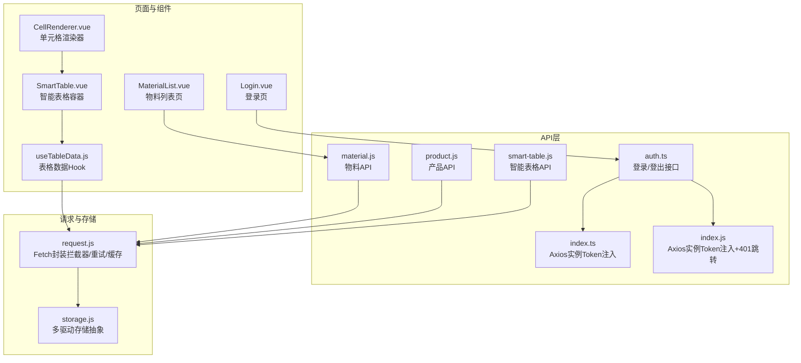
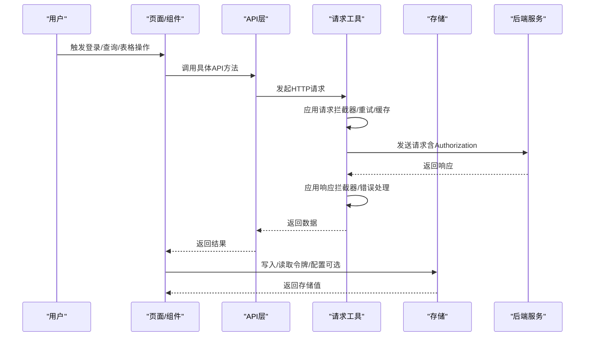
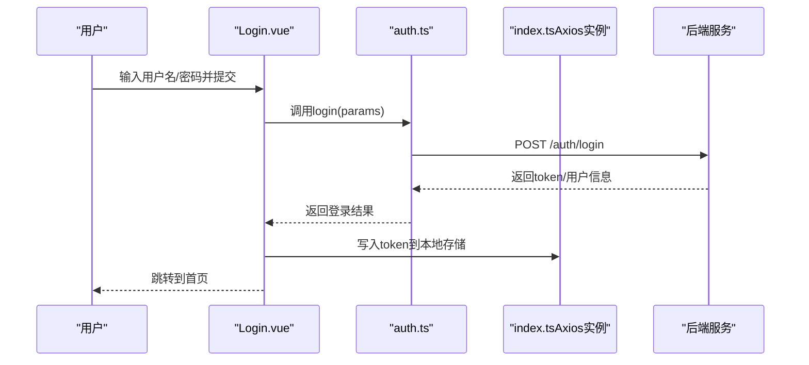
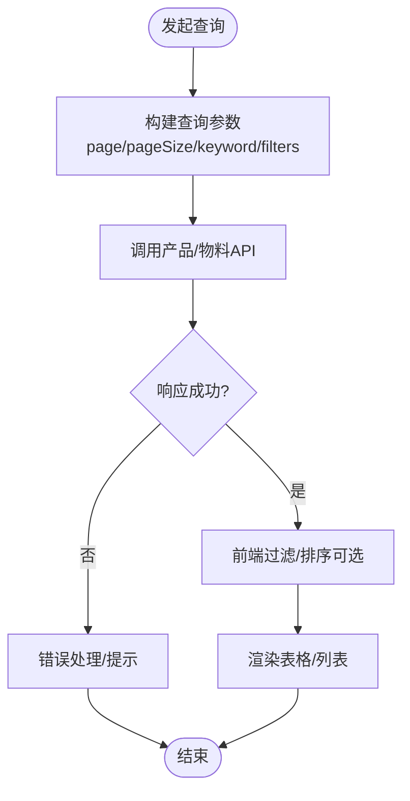
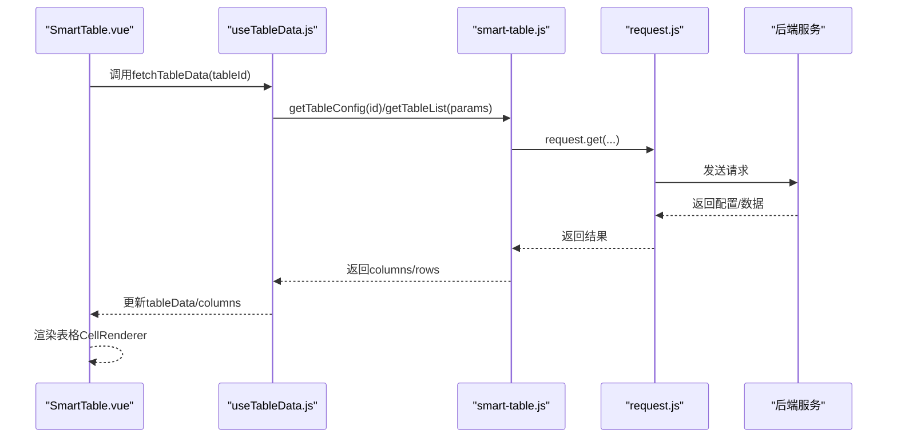
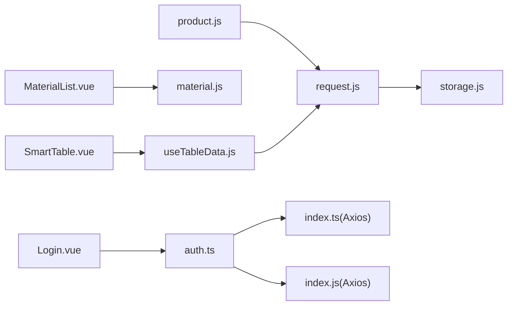

# 通用功能API

<cite>
**本文引用的文件**
- [auth.ts](file://07-frontend/src/api/auth.ts)
- [index.ts](file://07-frontend/src/api/index.ts)
- [index.js](file://07-frontend/src/api/index.js)
- [material.js](file://07-frontend/src/api/material.js)
- [product.js](file://07-frontend/src/api/product.js)
- [smart-table.js](file://07-frontend/src/api/smart-table.js)
- [request.js](file://07-frontend/src/services/utils/request.js)
- [storage.js](file://07-frontend/src/services/utils/storage.js)
- [Login.vue](file://07-frontend/src/views/auth/Login.vue)
- [MaterialList.vue](file://07-frontend/src/pages/material/MaterialList.vue)
- [material.js](file://07-frontend/src/router/modules/material.js)
- [SmartTable.vue](file://07-frontend/src/components/smart-table/SmartTable.vue)
- [CellRenderer.vue](file://07-frontend/src/components/smart-table/CellRenderer.vue)
- [useTableData.js](file://07-frontend/src/components/smart-table/hooks/useTableData.js)
</cite>

## 目录
1. [简介](#简介)
2. [项目结构](#项目结构)
3. [核心组件](#核心组件)
4. [架构总览](#架构总览)
5. [详细组件分析](#详细组件分析)
6. [依赖关系分析](#依赖关系分析)
7. [性能考量](#性能考量)
8. [故障排查指南](#故障排查指南)
9. [结论](#结论)

## 简介
本文件系统性梳理通用功能模块的API设计模式，重点覆盖以下方面：
- 认证与授权：登录、登出、令牌注入与过期处理
- 主数据查询：物料与产品接口的统一设计规范（分页、搜索、字段过滤）
- 智能表格：动态列配置、单元格渲染与编辑、公式计算的前后端协同方案
- 通用工具：请求封装、存储抽象、拦截器与错误处理

目标是帮助开发者快速理解并复用这些通用API设计模式，降低重复开发成本，提升一致性与可维护性。

## 项目结构
前端采用模块化组织，API层与业务层分离，请求工具统一封装，路由按功能域划分，组件按职责拆分。

图表来源
- [auth.ts](file://07-frontend/src/api/auth.ts#L1-L28)
- [index.ts](file://07-frontend/src/api/index.ts#L1-L39)
- [index.js](file://07-frontend/src/api/index.js#L1-L41)
- [material.js](file://07-frontend/src/api/material.js#L1-L79)
- [product.js](file://07-frontend/src/api/product.js#L1-L103)
- [smart-table.js](file://07-frontend/src/api/smart-table.js#L1-L49)
- [request.js](file://07-frontend/src/services/utils/request.js#L1-L120)
- [storage.js](file://07-frontend/src/services/utils/storage.js#L1-L120)
- [Login.vue](file://07-frontend/src/views/auth/Login.vue#L1-L167)
- [MaterialList.vue](file://07-frontend/src/pages/material/MaterialList.vue#L1-L200)
- [SmartTable.vue](file://07-frontend/src/components/smart-table/SmartTable.vue#L1-L46)
- [CellRenderer.vue](file://07-frontend/src/components/smart-table/CellRenderer.vue#L1-L120)
- [useTableData.js](file://07-frontend/src/components/smart-table/hooks/useTableData.js#L1-L33)

章节来源
- [auth.ts](file://07-frontend/src/api/auth.ts#L1-L28)
- [index.ts](file://07-frontend/src/api/index.ts#L1-L39)
- [index.js](file://07-frontend/src/api/index.js#L1-L41)
- [material.js](file://07-frontend/src/api/material.js#L1-L79)
- [product.js](file://07-frontend/src/api/product.js#L1-L103)
- [smart-table.js](file://07-frontend/src/api/smart-table.js#L1-L49)
- [request.js](file://07-frontend/src/services/utils/request.js#L1-L120)
- [storage.js](file://07-frontend/src/services/utils/storage.js#L1-L120)
- [Login.vue](file://07-frontend/src/views/auth/Login.vue#L1-L167)
- [MaterialList.vue](file://07-frontend/src/pages/material/MaterialList.vue#L1-L200)
- [SmartTable.vue](file://07-frontend/src/components/smart-table/SmartTable.vue#L1-L46)
- [CellRenderer.vue](file://07-frontend/src/components/smart-table/CellRenderer.vue#L1-L120)
- [useTableData.js](file://07-frontend/src/components/smart-table/hooks/useTableData.js#L1-L33)

## 核心组件
- 认证API：提供登录、登出接口，配合请求拦截器自动注入Authorization头；响应拦截器统一处理401并跳转登录。
- 通用请求工具：基于fetch封装，支持请求/响应/错误拦截器、重试、缓存、取消、批量/链式请求、下载/上传等。
- 存储抽象：统一的多驱动存储接口，支持localStorage/sessionStorage/cookie/indexedDB/memory，并提供事件与配额监控。
- 物料API：提供列表、创建、批量创建、更新、删除、批量删除、搜索等REST风格接口。
- 产品API：提供列表、详情、分类、搜索、库存、批量库存等接口，统一使用GET参数作为分页/筛选载体。
- 智能表格API：提供表格列表、配置、保存、删除等接口，结合前端组件实现动态列与单元格渲染。

章节来源
- [auth.ts](file://07-frontend/src/api/auth.ts#L1-L28)
- [index.ts](file://07-frontend/src/api/index.ts#L1-L39)
- [index.js](file://07-frontend/src/api/index.js#L1-L41)
- [request.js](file://07-frontend/src/services/utils/request.js#L1-L120)
- [storage.js](file://07-frontend/src/services/utils/storage.js#L1-L120)
- [material.js](file://07-frontend/src/api/material.js#L1-L79)
- [product.js](file://07-frontend/src/api/product.js#L1-L103)
- [smart-table.js](file://07-frontend/src/api/smart-table.js#L1-L49)

## 架构总览
整体采用“页面/组件 -> API层 -> 请求工具 -> 后端”的调用链路。认证与授权通过请求拦截器统一处理；主数据查询遵循统一参数规范；智能表格通过API与组件协作实现动态配置与渲染。

图表来源
- [index.ts](file://07-frontend/src/api/index.ts#L1-L39)
- [index.js](file://07-frontend/src/api/index.js#L1-L41)
- [request.js](file://07-frontend/src/services/utils/request.js#L396-L551)
- [storage.js](file://07-frontend/src/services/utils/storage.js#L752-L800)
- [auth.ts](file://07-frontend/src/api/auth.ts#L1-L28)
- [material.js](file://07-frontend/src/api/material.js#L1-L79)
- [product.js](file://07-frontend/src/api/product.js#L1-L103)
- [smart-table.js](file://07-frontend/src/api/smart-table.js#L1-L49)

## 详细组件分析

### 认证与授权：登录、登出与令牌管理
- 登录接口：定义登录参数与返回结构，调用后端登录接口获取token。
- 登出接口：调用后端登出接口，清理本地状态。
- 令牌注入：Axios实例在请求前从本地存储读取token并附加到Authorization头。
- 401处理：响应拦截器检测401，清理token并跳转登录页。
- 登录页集成：登录页示例演示如何调用登录接口、写入token并跳转。

图表来源
- [auth.ts](file://07-frontend/src/api/auth.ts#L1-L28)
- [index.ts](file://07-frontend/src/api/index.ts#L1-L39)
- [Login.vue](file://07-frontend/src/views/auth/Login.vue#L102-L136)

章节来源
- [auth.ts](file://07-frontend/src/api/auth.ts#L1-L28)
- [index.ts](file://07-frontend/src/api/index.ts#L1-L39)
- [index.js](file://07-frontend/src/api/index.js#L1-L41)
- [Login.vue](file://07-frontend/src/views/auth/Login.vue#L102-L136)

### 令牌存储与自动刷新策略
- 存储介质：建议使用安全存储（如HttpOnly Cookie或受控的IndexedDB），避免明文localStorage暴露风险。
- 自动注入：请求拦截器统一添加Authorization头，减少业务侧样板代码。
- 过期处理：响应拦截器统一处理401，清理token并跳转登录页，避免重复判断。
- 刷新机制：当前仓库未提供refresh接口实现。建议后端提供refresh endpoint，前端在401时尝试刷新并重试原请求，若失败则引导登录。

章节来源
- [index.ts](file://07-frontend/src/api/index.ts#L1-L39)
- [index.js](file://07-frontend/src/api/index.js#L1-L41)
- [storage.js](file://07-frontend/src/services/utils/storage.js#L1-L120)

### 物料与产品主数据查询接口统一设计规范
- 统一参数载体：列表查询使用GET参数承载分页、搜索、筛选等通用字段，便于前后端约定与扩展。
- 分页参数：page/pageSize、quickFilter等常见字段，便于快速接入。
- 搜索与过滤：支持关键词、分类、价格区间、库存状态、标签、状态等多维过滤。
- 工具与缓存：产品模块提供格式化、排序、过滤、缓存等工具，提升前端体验与性能。
- 物料接口：提供列表、创建、批量创建、更新、删除、批量删除、搜索等REST风格接口，便于CRUD场景。

图表来源
- [product.js](file://07-frontend/src/api/product.js#L20-L103)
- [product.js](file://07-frontend/src/api/product.js#L108-L374)
- [material.js](file://07-frontend/src/api/material.js#L1-L79)
- [MaterialList.vue](file://07-frontend/src/pages/material/MaterialList.vue#L236-L333)

章节来源
- [product.js](file://07-frontend/src/api/product.js#L20-L103)
- [product.js](file://07-frontend/src/api/product.js#L108-L374)
- [material.js](file://07-frontend/src/api/material.js#L1-L79)
- [MaterialList.vue](file://07-frontend/src/pages/material/MaterialList.vue#L236-L333)

### 智能表格：动态列配置、公式计算、单元格编辑
- API接口：提供表格列表、配置、保存、删除等接口，支撑表格的动态配置与持久化。
- 组件协作：SmartTable.vue作为容器，useTableData.js负责数据加载，CellRenderer.vue负责单元格渲染与交互。
- 动态列：通过配置接口返回的columns定义列类型、可编辑性、选项等，CellRenderer根据类型渲染不同UI控件。
- 单元格编辑：CellRenderer通过事件向上抛出变更，由容器组件处理保存与刷新。
- 公式计算：可在容器组件中基于列配置与数据进行计算，CellRenderer提供数值/货币/百分比等格式化能力。

图表来源
- [SmartTable.vue](file://07-frontend/src/components/smart-table/SmartTable.vue#L1-L46)
- [useTableData.js](file://07-frontend/src/components/smart-table/hooks/useTableData.js#L1-L33)
- [smart-table.js](file://07-frontend/src/api/smart-table.js#L1-L49)
- [request.js](file://07-frontend/src/services/utils/request.js#L396-L551)
- [CellRenderer.vue](file://07-frontend/src/components/smart-table/CellRenderer.vue#L1-L120)

章节来源
- [smart-table.js](file://07-frontend/src/api/smart-table.js#L1-L49)
- [useTableData.js](file://07-frontend/src/components/smart-table/hooks/useTableData.js#L1-L33)
- [SmartTable.vue](file://07-frontend/src/components/smart-table/SmartTable.vue#L1-L46)
- [CellRenderer.vue](file://07-frontend/src/components/smart-table/CellRenderer.vue#L1-L120)

## 依赖关系分析
- API层依赖请求工具：所有API最终通过request.js或Axios实例发起HTTP请求。
- 页面/组件依赖API层：页面通过API层调用后端接口，组件通过Hook与API层交互。
- 认证拦截：index.ts与index.js分别提供Axios实例，统一注入Authorization与401处理。
- 存储抽象：storage.js为多驱动存储抽象，可被任意模块使用。

图表来源
- [Login.vue](file://07-frontend/src/views/auth/Login.vue#L102-L136)
- [material.js](file://07-frontend/src/api/material.js#L1-L79)
- [product.js](file://07-frontend/src/api/product.js#L1-L103)
- [request.js](file://07-frontend/src/services/utils/request.js#L1-L120)
- [storage.js](file://07-frontend/src/services/utils/storage.js#L1-L120)
- [index.ts](file://07-frontend/src/api/index.ts#L1-L39)
- [index.js](file://07-frontend/src/api/index.js#L1-L41)
- [SmartTable.vue](file://07-frontend/src/components/smart-table/SmartTable.vue#L1-L46)
- [useTableData.js](file://07-frontend/src/components/smart-table/hooks/useTableData.js#L1-L33)

章节来源
- [Login.vue](file://07-frontend/src/views/auth/Login.vue#L102-L136)
- [material.js](file://07-frontend/src/api/material.js#L1-L79)
- [product.js](file://07-frontend/src/api/product.js#L1-L103)
- [request.js](file://07-frontend/src/services/utils/request.js#L1-L120)
- [storage.js](file://07-frontend/src/services/utils/storage.js#L1-L120)
- [index.ts](file://07-frontend/src/api/index.ts#L1-L39)
- [index.js](file://07-frontend/src/api/index.js#L1-L41)
- [SmartTable.vue](file://07-frontend/src/components/smart-table/SmartTable.vue#L1-L46)
- [useTableData.js](file://07-frontend/src/components/smart-table/hooks/useTableData.js#L1-L33)

## 性能考量
- 请求缓存：request.js支持GET请求缓存，适合静态或低频变更数据，减少网络开销。
- 重试策略：指数退避重试，提高弱网环境下的成功率。
- 取消请求：支持AbortController取消，避免竞态与资源浪费。
- 批量/链式请求：支持批量发送与串行链式请求，优化复杂流程。
- 前端过滤与分页：物料列表页采用前端过滤与分页，适合中小规模数据；大规模数据建议后端分页与筛选。

章节来源
- [request.js](file://07-frontend/src/services/utils/request.js#L396-L551)
- [request.js](file://07-frontend/src/services/utils/request.js#L553-L798)
- [MaterialList.vue](file://07-frontend/src/pages/material/MaterialList.vue#L327-L333)

## 故障排查指南
- 401未登录：检查请求拦截器是否正确注入Authorization头，确认token是否过期或被清理。
- 请求超时/失败：启用重试与超时控制，查看错误拦截器输出，定位网络或后端异常。
- 缓存命中问题：确认缓存键生成规则与请求方法，必要时禁用缓存或清理缓存。
- 存储异常：storage.js提供驱动可用性检测与配额预警，关注配额警告事件。
- 表格渲染异常：检查CellRenderer的列配置与事件绑定，确认容器组件对变更事件的处理。

章节来源
- [index.ts](file://07-frontend/src/api/index.ts#L1-L39)
- [index.js](file://07-frontend/src/api/index.js#L1-L41)
- [request.js](file://07-frontend/src/services/utils/request.js#L280-L395)
- [storage.js](file://07-frontend/src/services/utils/storage.js#L202-L230)
- [CellRenderer.vue](file://07-frontend/src/components/smart-table/CellRenderer.vue#L180-L210)

## 结论
本仓库的通用功能API设计体现了“统一参数规范、拦截器驱动、可扩展工具链”的理念。认证层通过拦截器实现零散样板代码；主数据查询遵循GET参数约定，便于前后端协作；智能表格通过API与组件解耦，支持动态配置与丰富渲染。建议后续补充令牌刷新机制与更完善的错误码体系，以进一步提升用户体验与可维护性。