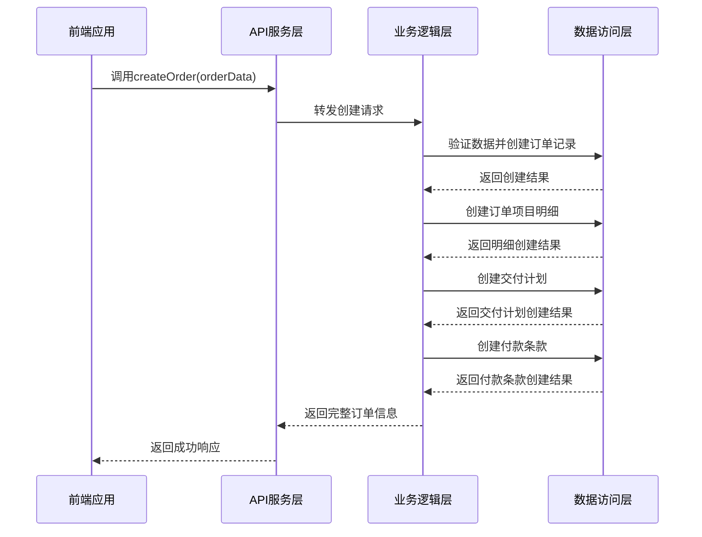
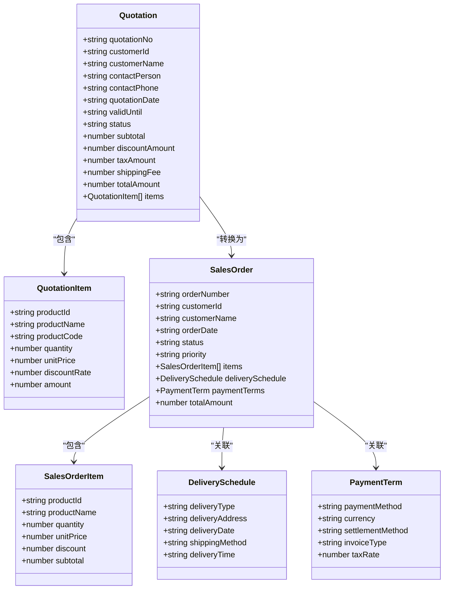
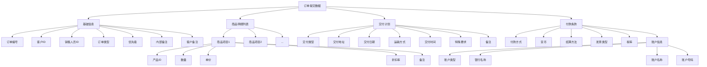
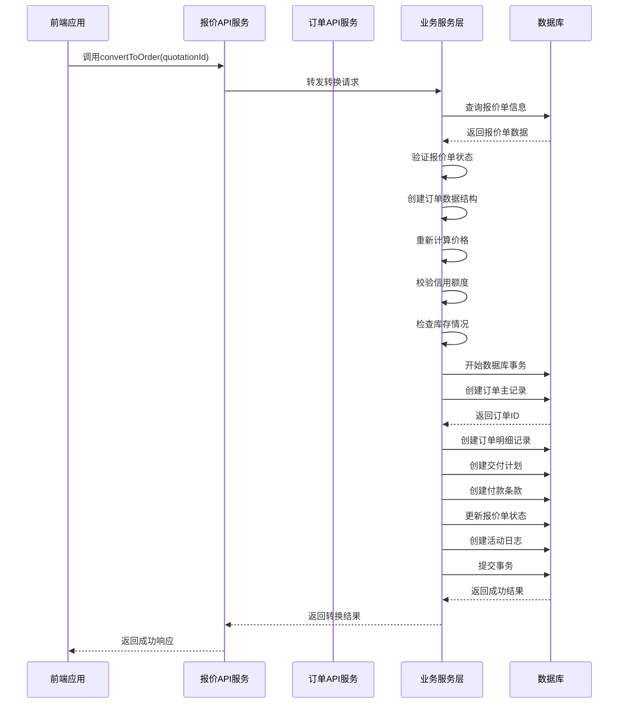
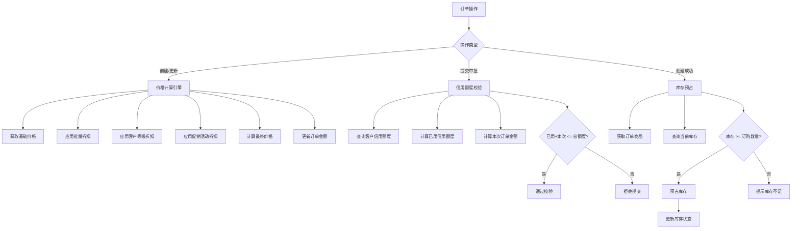
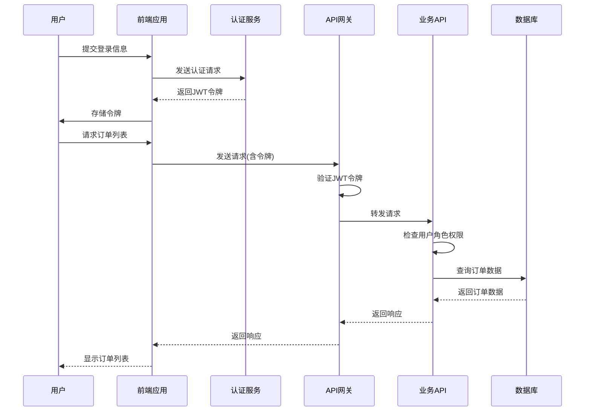
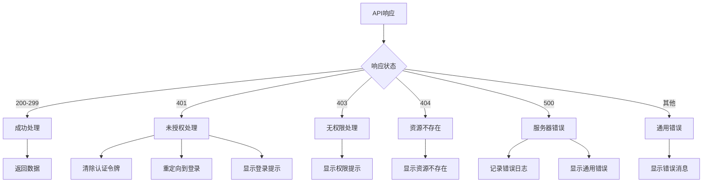
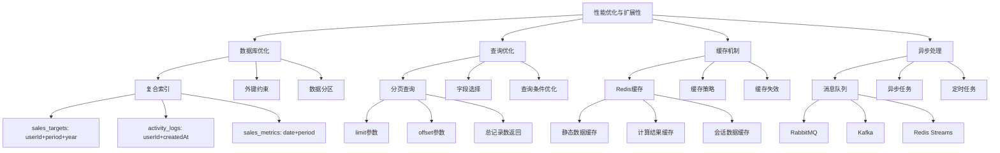

# 销售模块API

<cite>
**本文档引用的文件**   
- [orderApi.js](file://07-frontend/src/api/sales/orderApi.js)
- [sales.ts](file://07-frontend/src/api/sales.ts)
- [quotation.ts](file://07-frontend/src/api/quotation.ts)
- [sales-api.js](file://07-frontend/src/services/api/sales-api.js)
- [salesOrders.js](file://07-backend/routes/salesOrders.js)
- [salesController.js](file://backend/controllers/salesController.js)
- [salesService.js](file://backend/services/salesService.js)
- [sales.js](file://backend/models/sales.js)
- [005_create_sales_tables.js](file://backend/migrations/005_create_sales_tables.js)
</cite>

## 目录
1. [引言](#引言)
2. [销售订单API全生命周期管理](#销售订单api全生命周期管理)
3. [报价单与订单数据流转关系](#报价单与订单数据流转关系)
4. [复杂订单提交结构示例](#复杂订单提交结构示例)
5. [报价转订单转换逻辑](#报价转订单转换逻辑)
6. [业务规则集成机制](#业务规则集成机制)
7. [接口安全与权限控制](#接口安全与权限控制)
8. [错误处理与响应规范](#错误处理与响应规范)
9. [性能优化与扩展性设计](#性能优化与扩展性设计)
10. [总结](#总结)

## 引言

销售模块API是企业业务系统的核心组成部分，负责管理销售订单的全生命周期以及报价单与订单之间的数据流转。该模块实现了从订单创建、审批、变更到关闭的完整流程，并与报价单、销售机会等业务实体紧密集成。系统通过前端API服务层与后端业务逻辑层的协同工作，确保了数据的一致性和业务流程的完整性。

API设计遵循RESTful原则，采用分层架构模式，前端通过axios实例进行HTTP请求封装，后端使用Express框架处理路由和业务逻辑。整个系统集成了价格计算引擎、信用额度校验、库存预占等关键业务规则，确保销售业务的合规性和准确性。

**Section sources**
- [orderApi.js](file://07-frontend/src/api/sales/orderApi.js#L1-L87)
- [sales.ts](file://07-frontend/src/api/sales.ts#L1-L522)
- [quotation.ts](file://07-frontend/src/api/quotation.ts#L1-L331)

## 销售订单API全生命周期管理

销售订单API提供了完整的订单生命周期管理功能，包括创建、查询、更新、删除、提交和审批等操作。前端通过`orderApi.js`文件暴露了标准化的API接口，这些接口基于统一的API基础服务进行封装。

订单创建接口接收包含客户信息、商品明细、交付计划和付款条款的完整订单数据，生成唯一的订单编号并初始化订单状态为"待处理"。订单审批接口需要管理员或经理角色权限，可以批量处理多个订单的审批请求。系统对订单状态转换进行了严格控制，已进入生产或交付阶段的订单不允许编辑或删除。

**Diagram sources**
- [orderApi.js](file://07-frontend/src/api/sales/orderApi.js#L36-L38)
- [salesOrders.js](file://07-backend/routes/salesOrders.js#L168-L265)

**Section sources**
- [orderApi.js](file://07-frontend/src/api/sales/orderApi.js#L6-L85)
- [salesOrders.js](file://07-backend/routes/salesOrders.js#L167-L420)

## 报价单与订单数据流转关系

报价单与订单之间存在紧密的数据流转关系，系统通过`quotation.ts`和`sales.ts`两个API服务文件实现了这一关系的管理。报价单作为销售流程的前置环节，包含了客户意向、商品明细、价格条款等关键信息，当报价被批准后可以转换为正式订单。

报价单API提供了从创建、审核、审批到转换为订单的完整流程。报价单状态包括草稿、待审核、审核中、已审核、待审批、已批准、已拒绝、已取消和已完成等。只有状态为"已批准"的报价单才能转换为订单。转换过程中，系统会将报价单中的商品明细、客户信息、价格条款等数据复制到新创建的订单中，并保持数据的一致性。

**Diagram sources**
- [quotation.ts](file://07-frontend/src/api/quotation.ts#L74-L107)
- [salesOrders.js](file://07-backend/routes/salesOrders.js#L188-L249)

**Section sources**
- [quotation.ts](file://07-frontend/src/api/quotation.ts#L169-L307)
- [sales-api.js](file://07-frontend/src/services/api/sales-api.js#L128-L131)

## 复杂订单提交结构示例

复杂订单的提交结构需要包含多个业务实体的数据，以支持多物料、分批交货和复杂价格条款的需求。系统通过嵌套的对象结构来组织这些数据，确保信息的完整性和一致性。

订单数据结构包括基础信息、商品明细列表、交付计划和付款条款四个主要部分。商品明细列表支持多个商品项目，每个项目包含产品ID、数量、单价、折扣率和小计金额。交付计划支持分批交货，可以定义多个交付批次，每个批次有独立的交付日期、地址和运输方式。付款条款支持多种付款方式、货币类型、结算方法和发票类型。

**Diagram sources**
- [salesOrders.js](file://07-backend/routes/salesOrders.js#L170-L182)
- [sales.js](file://backend/models/sales.js#L5-L295)

**Section sources**
- [salesOrders.js](file://07-backend/routes/salesOrders.js#L188-L249)
- [salesService.js](file://backend/services/salesService.js#L207-L220)

## 报价转订单转换逻辑

报价转订单的转换逻辑是销售流程中的关键环节，系统通过`convertToOrder`接口实现这一功能。转换过程不仅仅是简单的数据复制，还包括状态验证、数据转换和业务规则校验等多个步骤。

转换逻辑首先验证源报价单的状态必须为"已批准"，然后创建新的销售订单记录，将报价单中的客户信息、商品明细、价格条款等数据复制到订单中。在数据复制过程中，系统会重新计算价格，应用最新的价格策略和折扣规则。同时，系统会检查客户的信用额度和库存情况，确保订单的可行性。

转换完成后，原报价单的状态会更新为"已完成"，并在系统中创建相应的活动日志记录。整个转换过程在数据库事务中执行，确保数据的一致性和完整性。如果转换过程中出现任何错误，所有操作都会回滚，保持系统状态的一致性。

**Diagram sources**
- [quotation.ts](file://07-frontend/src/api/quotation.ts#L245-L248)
- [salesOrders.js](file://07-backend/routes/salesOrders.js#L188-L249)

**Section sources**
- [quotation.ts](file://07-frontend/src/api/quotation.ts#L245-L248)
- [sales-api.js](file://07-frontend/src/services/api/sales-api.js#L128-L131)

## 业务规则集成机制

销售模块集成了多个关键业务规则，包括价格计算引擎、信用额度校验和库存预占等。这些规则在订单创建和修改过程中被触发，确保业务操作的合规性和数据的准确性。

价格计算引擎负责处理复杂的定价策略，包括基础价格、批量折扣、客户等级折扣和促销活动折扣等。系统在订单创建和修改时自动重新计算价格，确保价格的准确性和一致性。信用额度校验在订单提交审批前执行，检查客户当前的信用使用情况，防止超信用额度交易。库存预占机制在订单创建后立即执行，锁定相关商品的库存数量，防止超卖。

**Diagram sources**
- [salesService.js](file://backend/services/salesService.js#L564-L579)
- [salesOrders.js](file://07-backend/routes/salesOrders.js#L204-L215)

**Section sources**
- [salesService.js](file://backend/services/salesService.js#L564-L600)
- [salesOrders.js](file://07-backend/routes/salesOrders.js#L204-L215)

## 接口安全与权限控制

系统实现了严格的接口安全与权限控制机制，确保只有授权用户才能访问和操作销售数据。安全控制分为认证和授权两个层面，通过JWT令牌和角色权限系统实现。

认证机制使用JWT（JSON Web Token）进行用户身份验证。用户登录后获得一个包含用户信息的JWT令牌，后续请求需要在Authorization头中携带该令牌。服务器通过中间件验证令牌的有效性，确保请求来源的合法性。授权机制基于角色的访问控制（RBAC），不同角色拥有不同的操作权限。例如，销售人员可以创建和编辑订单，经理可以审批订单，而普通用户只能查看订单。

**Diagram sources**
- [sales.ts](file://07-frontend/src/api/sales.ts#L19-L31)
- [salesOrders.js](file://07-backend/routes/salesOrders.js#L16-L15)
- [salesOrders.js](file://07-backend/routes/salesOrders.js#L168-L169)

**Section sources**
- [sales.ts](file://07-frontend/src/api/sales.ts#L18-L71)
- [salesOrders.js](file://07-backend/routes/salesOrders.js#L16-L15)

## 错误处理与响应规范

系统实现了统一的错误处理与响应规范，确保客户端能够准确理解和处理各种异常情况。错误响应遵循标准化的JSON格式，包含成功标志、错误代码、错误消息和详细信息等字段。

前端API服务层通过拦截器统一处理HTTP响应，将后端返回的错误信息转换为用户友好的提示。对于401未授权错误，系统会自动清除本地认证信息并重定向到登录页面。对于403无权限访问错误，显示相应的权限提示。对于500服务器内部错误，记录错误日志并向用户显示通用的错误消息。

**Diagram sources**
- [sales.ts](file://07-frontend/src/api/sales.ts#L34-L70)
- [quotation.ts](file://07-frontend/src/api/quotation.ts#L34-L70)

**Section sources**
- [sales.ts](file://07-frontend/src/api/sales.ts#L34-L70)
- [quotation.ts](file://07-frontend/src/api/quotation.ts#L34-L70)

## 性能优化与扩展性设计

系统在性能优化和扩展性方面进行了精心设计，以支持大规模数据处理和高并发访问。主要优化措施包括数据库索引优化、数据分页查询、缓存机制和异步处理等。

数据库层面，系统为关键查询字段创建了复合索引，如销售目标表的(userId, period, year)索引和活动日志表的(userId, createdAt)索引，显著提升了查询性能。数据访问采用分页机制，限制单次查询返回的记录数量，避免内存溢出。系统还实现了Redis缓存，缓存常用的静态数据和计算结果，减少数据库访问压力。

**Diagram sources**
- [005_create_sales_tables.js](file://backend/migrations/005_create_sales_tables.js#L205-L219)
- [salesOrders.js](file://07-backend/routes/salesOrders.js#L19-L20)

**Section sources**
- [005_create_sales_tables.js](file://backend/migrations/005_create_sales_tables.js#L205-L219)
- [salesOrders.js](file://07-backend/routes/salesOrders.js#L19-L20)

## 总结

销售模块API通过前后端协同设计，实现了销售订单全生命周期的精细化管理。系统采用分层架构，前端API服务层与后端业务逻辑层职责分明，通过RESTful接口进行通信。订单管理功能覆盖了创建、查询、更新、删除、提交和审批等完整流程，并通过严格的状态机控制确保业务流程的正确性。

报价单与订单之间的数据流转关系设计合理，支持从报价到订单的平滑转换。复杂订单的提交结构灵活，能够满足多物料、分批交货和复杂价格条款的业务需求。系统集成了价格计算、信用校验、库存预占等关键业务规则，确保了销售业务的合规性和数据的准确性。

安全控制方面，系统通过JWT认证和RBAC授权机制，实现了细粒度的权限管理。错误处理规范统一，提供了良好的用户体验。性能优化措施有效，支持大规模数据处理和高并发访问。整体设计具有良好的扩展性，能够适应业务发展的需要。