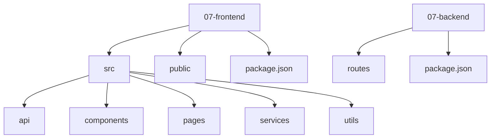
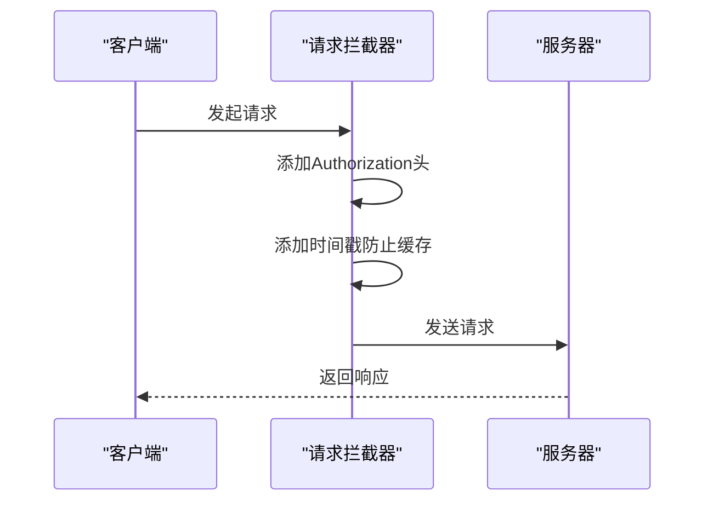
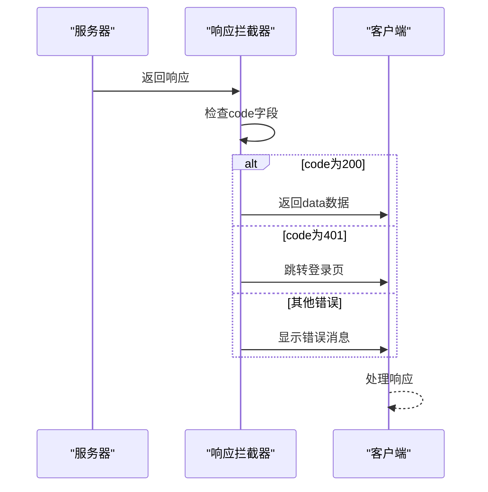
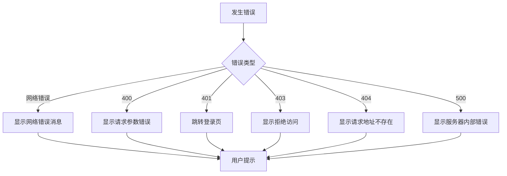
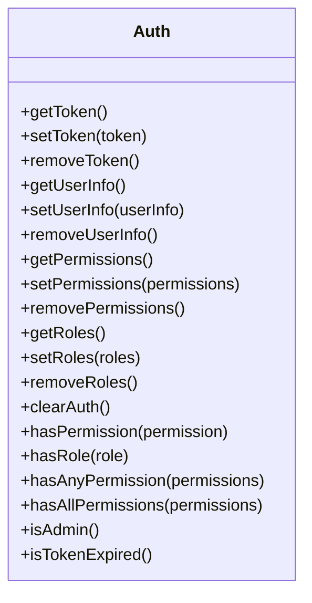
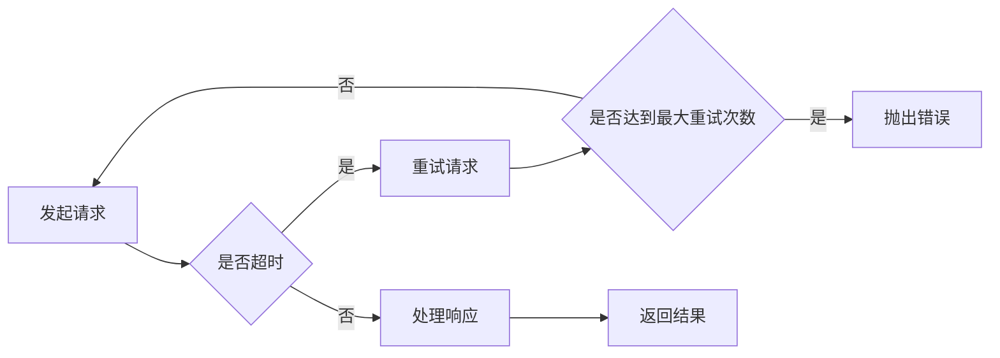

# 请求拦截与响应处理

<cite>
**本文档引用的文件**   
- [request.js](file://07-frontend/src/utils/request.js)
- [auth.js](file://07-frontend/src/utils/auth.js)
- [error-handling-service.js](file://07-frontend/src/services/error-handling-service.js)
</cite>

## 目录
1. [项目结构](#项目结构)
2. [核心组件](#核心组件)
3. [请求拦截器机制](#请求拦截器机制)
4. [响应拦截器机制](#响应拦截器机制)
5. [错误处理策略](#错误处理策略)
6. [认证与授权管理](#认证与授权管理)
7. [API调用示例](#api调用示例)
8. [性能与可靠性](#性能与可靠性)
9. [结论](#结论)

## 项目结构

项目采用模块化设计，主要包含前端和后端两个部分。前端位于`07-frontend`目录下，使用Vue 3和Element Plus构建，后端位于`07-backend`目录下，使用Node.js和Express框架。



**Diagram sources**
- [07-frontend](file://07-frontend)
- [07-backend](file://07-backend)

**Section sources**
- [07-frontend](file://07-frontend)
- [07-backend](file://07-backend)

## 核心组件

项目的核心组件包括请求拦截器、响应拦截器、认证管理、错误处理等。这些组件通过模块化的方式组织，确保代码的可维护性和可扩展性。

**Section sources**
- [request.js](file://07-frontend/src/utils/request.js)
- [auth.js](file://07-frontend/src/utils/auth.js)

## 请求拦截器机制

请求拦截器在发送请求前对请求进行预处理，主要功能包括添加认证令牌、防止缓存等。



**Diagram sources**
- [request.js](file://07-frontend/src/utils/request.js#L15-L32)

**Section sources**
- [request.js](file://07-frontend/src/utils/request.js#L15-L32)

## 响应拦截器机制

响应拦截器在接收到响应后对响应进行处理，主要功能包括统一API响应格式处理、错误处理等。



**Diagram sources**
- [request.js](file://07-frontend/src/utils/request.js#L40-L70)

**Section sources**
- [request.js](file://07-frontend/src/utils/request.js#L40-L70)

## 错误处理策略

错误处理策略包括网络异常、HTTP状态码（400/401/403/404/500）的处理，以及自动跳转登录页、Element Plus消息提示等用户体验优化。



**Diagram sources**
- [request.js](file://07-frontend/src/utils/request.js#L72-L107)
- [error-handling-service.js](file://07-frontend/src/services/error-handling-service.js#L225-L282)

**Section sources**
- [request.js](file://07-frontend/src/utils/request.js#L72-L107)
- [error-handling-service.js](file://07-frontend/src/services/error-handling-service.js#L225-L282)

## 认证与授权管理

认证与授权管理通过`auth.js`文件实现，包括获取、设置和移除token，以及检查权限和角色。



**Diagram sources**
- [auth.js](file://07-frontend/src/utils/auth.js#L1-L110)

**Section sources**
- [auth.js](file://07-frontend/src/utils/auth.js#L1-L110)

## API调用示例

以下是一些API调用的示例，展示了如何使用封装的请求方法。

```javascript
// GET请求
request.get('/api/users', { params: { page: 1, limit: 10 } })
  .then(response => {
    console.log(response);
  })
  .catch(error => {
    console.error(error);
  });

// POST请求
request.post('/api/users', { name: 'John Doe', email: 'john@example.com' })
  .then(response => {
    console.log(response);
  })
  .catch(error => {
    console.error(error);
  });

// 文件上传
const formData = new FormData();
formData.append('file', fileInput.files[0]);
request.upload('/api/upload', formData)
  .then(response => {
    console.log(response);
  })
  .catch(error => {
    console.error(error);
  });
```

**Section sources**
- [request.js](file://07-frontend/src/utils/request.js#L111-L188)

## 性能与可靠性

项目通过请求重试、超时处理、缓存等机制提高性能和可靠性。



**Diagram sources**
- [request.js](file://07-frontend/src/utils/request.js#L288-L310)

**Section sources**
- [request.js](file://07-frontend/src/utils/request.js#L288-L310)

## 结论

通过深入解析基于Axios的请求拦截器和响应拦截器实现机制，我们了解了如何在前端项目中实现统一的请求预处理和响应标准化处理。这些机制不仅提高了代码的可维护性，还增强了用户体验和系统的健壮性。