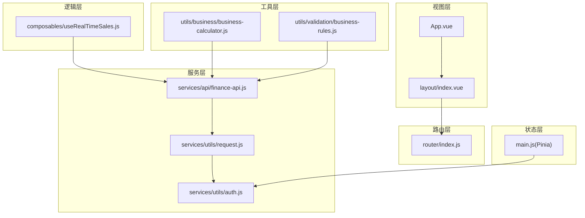
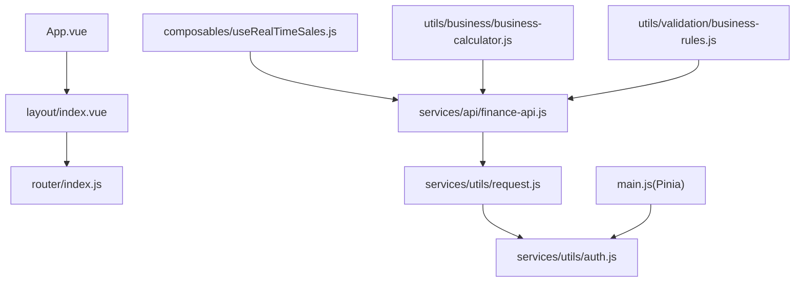
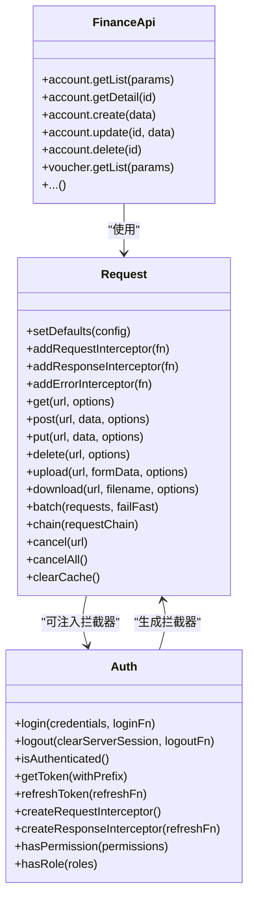
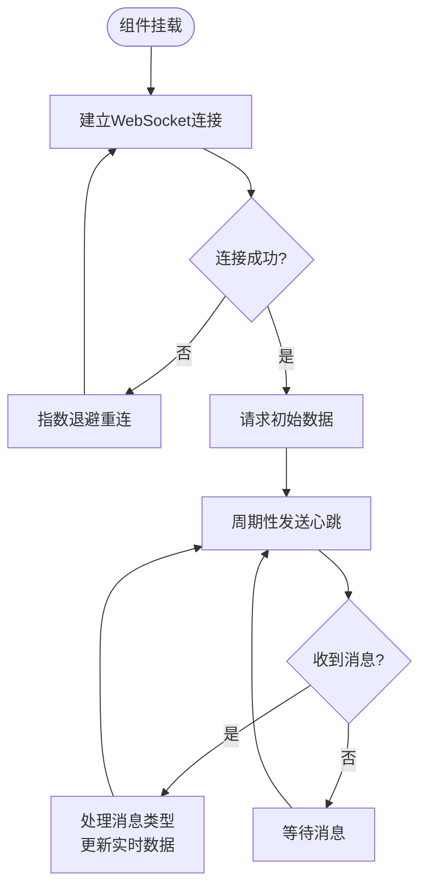
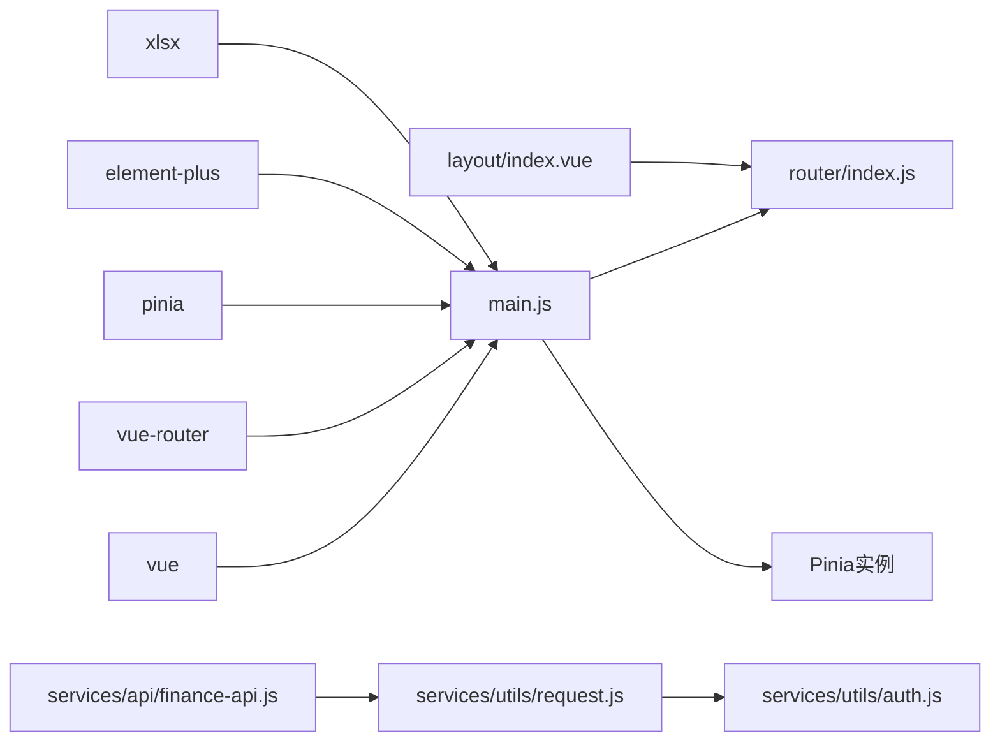

# 前端架构

<cite>
**本文引用的文件**
- [07-frontend/src/App.vue](file://07-frontend/src/App.vue)
- [07-frontend/src/main.js](file://07-frontend/src/main.js)
- [07-frontend/src/router/index.js](file://07-frontend/src/router/index.js)
- [07-frontend/src/layout/index.vue](file://07-frontend/src/layout/index.vue)
- [07-frontend/src/services/utils/request.js](file://07-frontend/src/services/utils/request.js)
- [07-frontend/src/services/api/finance-api.js](file://07-frontend/src/services/api/finance-api.js)
- [07-frontend/src/services/utils/auth.js](file://07-frontend/src/services/utils/auth.js)
- [07-frontend/src/composables/useRealTimeSales.js](file://07-frontend/src/composables/useRealTimeSales.js)
- [07-frontend/src/utils/business/business-calculator.js](file://07-frontend/src/utils/business/business-calculator.js)
- [07-frontend/src/utils/validation/business-rules.js](file://07-frontend/src/utils/validation/business-rules.js)
- [07-frontend/package.json](file://07-frontend/package.json)
</cite>

## 目录
1. [引言](#引言)
2. [项目结构](#项目结构)
3. [核心组件](#核心组件)
4. [架构总览](#架构总览)
5. [详细组件分析](#详细组件分析)
6. [依赖分析](#依赖分析)
7. [性能考量](#性能考量)
8. [故障排查指南](#故障排查指南)
9. [结论](#结论)
10. [附录](#附录)

## 引言
本文件面向07-frontend项目的前端架构与实现，聚焦于基于Vue 3组合式API的组件化开发模式，系统梳理根组件App.vue、应用初始化流程main.js、模块化路由router、服务层REST API封装、Pinia状态管理、工具函数库与业务支撑，并通过序列图展示“用户操作到API请求”的完整数据流，帮助开发者理解视图层、逻辑层与服务层之间的协作关系。

## 项目结构
07-frontend采用模块化与分层架构：
- 视图层：App.vue作为根组件，layout/index.vue承载布局与导航；大量页面组件位于pages目录，通用组件位于components目录。
- 逻辑层：组合式API（composables）封装可复用逻辑，如实时销售数据useRealTimeSales.js。
- 服务层：services/utils封装HTTP请求与认证工具，services/api提供按领域划分的API服务。
- 工具层：utils目录提供业务计算与校验工具，支撑复杂业务逻辑。
- 路由层：router/index.js集中定义路由与前置守卫，模块化拆分至modules目录。
- 状态层：main.js集成Pinia，配合services/utils/auth.js实现认证状态管理。

图表来源
- [07-frontend/src/App.vue](file://07-frontend/src/App.vue#L1-L80)
- [07-frontend/src/layout/index.vue](file://07-frontend/src/layout/index.vue#L1-L120)
- [07-frontend/src/router/index.js](file://07-frontend/src/router/index.js#L1-L120)
- [07-frontend/src/services/utils/request.js](file://07-frontend/src/services/utils/request.js#L1-L120)
- [07-frontend/src/services/utils/auth.js](file://07-frontend/src/services/utils/auth.js#L1-L120)
- [07-frontend/src/services/api/finance-api.js](file://07-frontend/src/services/api/finance-api.js#L1-L60)
- [07-frontend/src/composables/useRealTimeSales.js](file://07-frontend/src/composables/useRealTimeSales.js#L1-L60)
- [07-frontend/src/utils/business/business-calculator.js](file://07-frontend/src/utils/business/business-calculator.js#L1-L60)
- [07-frontend/src/utils/validation/business-rules.js](file://07-frontend/src/utils/validation/business-rules.js#L1-L120)
- [07-frontend/src/main.js](file://07-frontend/src/main.js#L1-L27)

章节来源
- [07-frontend/src/App.vue](file://07-frontend/src/App.vue#L1-L80)
- [07-frontend/src/main.js](file://07-frontend/src/main.js#L1-L27)
- [07-frontend/src/router/index.js](file://07-frontend/src/router/index.js#L1-L120)
- [07-frontend/src/layout/index.vue](file://07-frontend/src/layout/index.vue#L1-L120)
- [07-frontend/src/services/utils/request.js](file://07-frontend/src/services/utils/request.js#L1-L120)
- [07-frontend/src/services/utils/auth.js](file://07-frontend/src/services/utils/auth.js#L1-L120)
- [07-frontend/src/services/api/finance-api.js](file://07-frontend/src/services/api/finance-api.js#L1-L60)
- [07-frontend/src/composables/useRealTimeSales.js](file://07-frontend/src/composables/useRealTimeSales.js#L1-L60)
- [07-frontend/src/utils/business/business-calculator.js](file://07-frontend/src/utils/business/business-calculator.js#L1-L60)
- [07-frontend/src/utils/validation/business-rules.js](file://07-frontend/src/utils/validation/business-rules.js#L1-L120)
- [07-frontend/package.json](file://07-frontend/package.json#L1-L34)

## 核心组件
- 根组件App.vue：负责顶层路由视图渲染与全局过渡动画，作为整个应用的容器。
- 应用初始化main.js：创建Vue实例，注册Element Plus与图标，挂载Pinia与路由，完成应用启动。
- 布局组件layout/index.vue：提供侧边栏、面包屑、顶部导航与路由视图容器，承担导航与权限控制的职责。
- 路由router/index.js：集中定义路由表与前置守卫，实现登录态校验、页面标题设置与重定向。
- 服务层request.js：封装fetch，提供请求/响应/错误拦截器、重试、缓存、取消、批量与链式请求等能力。
- 认证工具auth.js：提供令牌存储、刷新、过期检测、权限判断与请求拦截器生成。
- 财务API finance-api.js：按领域聚合REST接口，统一调用request.js。
- 组合式API useRealTimeSales.js：封装WebSocket实时数据流，提供连接管理、订阅与配置更新。
- 工具函数business-calculator.js与business-rules.js：分别提供业务计算与规则校验，支撑复杂业务逻辑。

章节来源
- [07-frontend/src/App.vue](file://07-frontend/src/App.vue#L1-L80)
- [07-frontend/src/main.js](file://07-frontend/src/main.js#L1-L27)
- [07-frontend/src/layout/index.vue](file://07-frontend/src/layout/index.vue#L1-L120)
- [07-frontend/src/router/index.js](file://07-frontend/src/router/index.js#L1-L120)
- [07-frontend/src/services/utils/request.js](file://07-frontend/src/services/utils/request.js#L1-L120)
- [07-frontend/src/services/utils/auth.js](file://07-frontend/src/services/utils/auth.js#L1-L120)
- [07-frontend/src/services/api/finance-api.js](file://07-frontend/src/services/api/finance-api.js#L1-L60)
- [07-frontend/src/composables/useRealTimeSales.js](file://07-frontend/src/composables/useRealTimeSales.js#L1-L60)
- [07-frontend/src/utils/business/business-calculator.js](file://07-frontend/src/utils/business/business-calculator.js#L1-L60)
- [07-frontend/src/utils/validation/business-rules.js](file://07-frontend/src/utils/validation/business-rules.js#L1-L120)

## 架构总览
整体采用“视图-逻辑-服务-工具-路由-状态”分层：
- 视图层：App.vue与layout/index.vue负责UI与导航；页面组件按功能域分布。
- 逻辑层：组合式API useRealTimeSales.js抽象实时数据流；业务计算与规则校验在工具层。
- 服务层：request.js统一HTTP；finance-api.js按领域封装REST；auth.js统一认证。
- 路由层：router/index.js集中路由与守卫。
- 状态层：main.js集成Pinia，结合auth.js维护认证状态。

图表来源
- [07-frontend/src/App.vue](file://07-frontend/src/App.vue#L1-L80)
- [07-frontend/src/layout/index.vue](file://07-frontend/src/layout/index.vue#L1-L120)
- [07-frontend/src/router/index.js](file://07-frontend/src/router/index.js#L1-L120)
- [07-frontend/src/composables/useRealTimeSales.js](file://07-frontend/src/composables/useRealTimeSales.js#L1-L60)
- [07-frontend/src/services/api/finance-api.js](file://07-frontend/src/services/api/finance-api.js#L1-L60)
- [07-frontend/src/services/utils/request.js](file://07-frontend/src/services/utils/request.js#L1-L120)
- [07-frontend/src/services/utils/auth.js](file://07-frontend/src/services/utils/auth.js#L1-L120)
- [07-frontend/src/utils/business/business-calculator.js](file://07-frontend/src/utils/business/business-calculator.js#L1-L60)
- [07-frontend/src/utils/validation/business-rules.js](file://07-frontend/src/utils/validation/business-rules.js#L1-L120)
- [07-frontend/src/main.js](file://07-frontend/src/main.js#L1-L27)

## 详细组件分析

### 根组件App.vue
- 职责：顶层容器，使用router-view渲染当前路由组件，并包裹过渡动画。
- 设计要点：简洁的模板与全局样式，便于统一主题与过渡效果。

章节来源
- [07-frontend/src/App.vue](file://07-frontend/src/App.vue#L1-L80)

### 应用初始化main.js
- 职责：创建Vue实例，注册Element Plus与图标，挂载Pinia与路由，完成应用启动。
- 设计要点：集中引入第三方库与全局插件，保证应用启动的一致性与可扩展性。

章节来源
- [07-frontend/src/main.js](file://07-frontend/src/main.js#L1-L27)

### 布局组件layout/index.vue
- 职责：侧边栏菜单、面包屑、顶部导航与路由视图容器；登录态检查与菜单加载；权限控制占位。
- 设计要点：通过计算属性与watch监听路由变化动态更新面包屑；提供用户信息读取与登出流程。

章节来源
- [07-frontend/src/layout/index.vue](file://07-frontend/src/layout/index.vue#L1-L120)

### 路由router/index.js
- 职责：集中定义路由表与前置守卫；设置页面标题、登录态校验与重定向。
- 设计要点：模块化导入各业务模块路由，统一前置守卫逻辑，提升可维护性。

章节来源
- [07-frontend/src/router/index.js](file://07-frontend/src/router/index.js#L1-L120)

### 服务层：REST API封装与请求工具
- request.js：封装fetch，提供请求/响应/错误拦截器、重试、缓存、取消、批量与链式请求等能力。
- finance-api.js：按领域聚合REST接口，统一调用request.js，屏蔽底层细节。
- auth.js：提供令牌存储、刷新、过期检测、权限判断与请求拦截器生成，与request.js协同实现认证横切关注点。

图表来源
- [07-frontend/src/services/utils/request.js](file://07-frontend/src/services/utils/request.js#L1-L200)
- [07-frontend/src/services/api/finance-api.js](file://07-frontend/src/services/api/finance-api.js#L1-L120)
- [07-frontend/src/services/utils/auth.js](file://07-frontend/src/services/utils/auth.js#L560-L786)

章节来源
- [07-frontend/src/services/utils/request.js](file://07-frontend/src/services/utils/request.js#L1-L200)
- [07-frontend/src/services/api/finance-api.js](file://07-frontend/src/services/api/finance-api.js#L1-L120)
- [07-frontend/src/services/utils/auth.js](file://07-frontend/src/services/utils/auth.js#L560-L786)

### 组合式API：useRealTimeSales.js
- 职责：封装WebSocket实时数据流，提供连接管理、订阅与配置更新。
- 设计要点：指数退避重连、心跳维持、页面可见性优化、生命周期清理。

图表来源
- [07-frontend/src/composables/useRealTimeSales.js](file://07-frontend/src/composables/useRealTimeSales.js#L1-L120)

章节来源
- [07-frontend/src/composables/useRealTimeSales.js](file://07-frontend/src/composables/useRealTimeSales.js#L1-L120)

### 工具函数库：业务计算与规则校验
- business-calculator.js：提供财务、运营等多类业务计算，统一返回格式与精度控制。
- business-rules.js：提供可扩展的业务规则引擎，支持异步与同步规则、分类管理与建议生成。

章节来源
- [07-frontend/src/utils/business/business-calculator.js](file://07-frontend/src/utils/business/business-calculator.js#L1-L120)
- [07-frontend/src/utils/validation/business-rules.js](file://07-frontend/src/utils/validation/business-rules.js#L1-L120)

## 依赖分析
- 第三方依赖：Vue 3、Vue Router、Pinia、Element Plus、xlsx等。
- 内部依赖：main.js依赖router与Pinia；layout/index.vue依赖router与Element Plus；finance-api.js依赖request.js；auth.js与request.js双向协作。

图表来源
- [07-frontend/package.json](file://07-frontend/package.json#L1-L34)
- [07-frontend/src/main.js](file://07-frontend/src/main.js#L1-L27)
- [07-frontend/src/router/index.js](file://07-frontend/src/router/index.js#L1-L120)
- [07-frontend/src/services/utils/request.js](file://07-frontend/src/services/utils/request.js#L1-L120)
- [07-frontend/src/services/utils/auth.js](file://07-frontend/src/services/utils/auth.js#L1-L120)
- [07-frontend/src/services/api/finance-api.js](file://07-frontend/src/services/api/finance-api.js#L1-L60)
- [07-frontend/src/layout/index.vue](file://07-frontend/src/layout/index.vue#L1-L120)

章节来源
- [07-frontend/package.json](file://07-frontend/package.json#L1-L34)
- [07-frontend/src/main.js](file://07-frontend/src/main.js#L1-L27)
- [07-frontend/src/router/index.js](file://07-frontend/src/router/index.js#L1-L120)
- [07-frontend/src/services/utils/request.js](file://07-frontend/src/services/utils/request.js#L1-L120)
- [07-frontend/src/services/utils/auth.js](file://07-frontend/src/services/utils/auth.js#L1-L120)
- [07-frontend/src/services/api/finance-api.js](file://07-frontend/src/services/api/finance-api.js#L1-L60)
- [07-frontend/src/layout/index.vue](file://07-frontend/src/layout/index.vue#L1-L120)

## 性能考量
- 请求缓存与重试：request.js支持GET请求缓存与可配置重试策略，减少网络抖动影响。
- 取消与批量：支持请求取消与批量/链式请求，避免竞态与资源浪费。
- WebSocket优化：useRealTimeSales.js提供指数退避重连、心跳维持与页面可见性优化，降低无效连接开销。
- 组件过渡与懒加载：App.vue与layout/index.vue使用过渡动画与路由懒加载，改善首屏与切换体验。

[本节为通用指导，不涉及具体文件分析]

## 故障排查指南
- 登录态异常：检查router/index.js前置守卫与localStorage中的token；确认auth.js的令牌刷新与过期检测逻辑。
- 请求失败：通过request.js的错误拦截器与响应拦截器定位问题；关注状态码与超时重试配置。
- WebSocket断连：useRealTimeSales.js提供重连与心跳机制，检查连接URL、服务端状态与浏览器网络策略。
- 权限校验：layout/index.vue与auth.js的权限判断存在占位逻辑，需按实际后端策略完善。

章节来源
- [07-frontend/src/router/index.js](file://07-frontend/src/router/index.js#L199-L228)
- [07-frontend/src/services/utils/auth.js](file://07-frontend/src/services/utils/auth.js#L560-L786)
- [07-frontend/src/services/utils/request.js](file://07-frontend/src/services/utils/request.js#L200-L320)
- [07-frontend/src/composables/useRealTimeSales.js](file://07-frontend/src/composables/useRealTimeSales.js#L1-L120)
- [07-frontend/src/layout/index.vue](file://07-frontend/src/layout/index.vue#L1-L120)

## 结论
07-frontend以Vue 3组合式API为核心，构建了清晰的分层架构：视图层简洁统一、逻辑层通过组合式API抽象复杂交互、服务层以request.js为中心实现HTTP横切关注点、工具层提供业务计算与规则校验、路由与状态管理保障用户体验与安全。该架构具备良好的可维护性、可扩展性与性能表现，适合企业级前端工程实践。

[本节为总结性内容，不涉及具体文件分析]

## 附录
- 依赖清单：Vue、Vue Router、Pinia、Element Plus、xlsx等。
- 开发脚本：dev、build、preview、lint、format等。

章节来源
- [07-frontend/package.json](file://07-frontend/package.json#L1-L34)