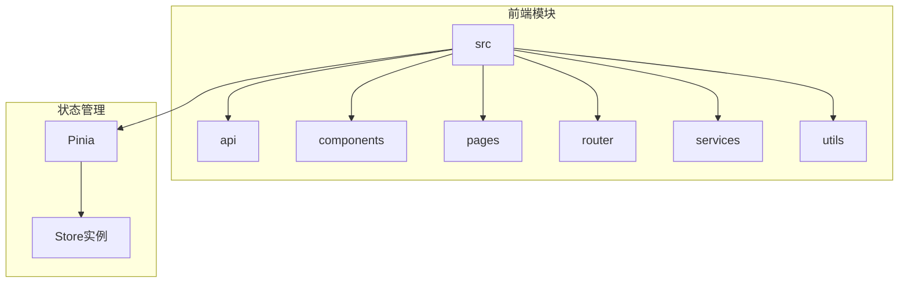
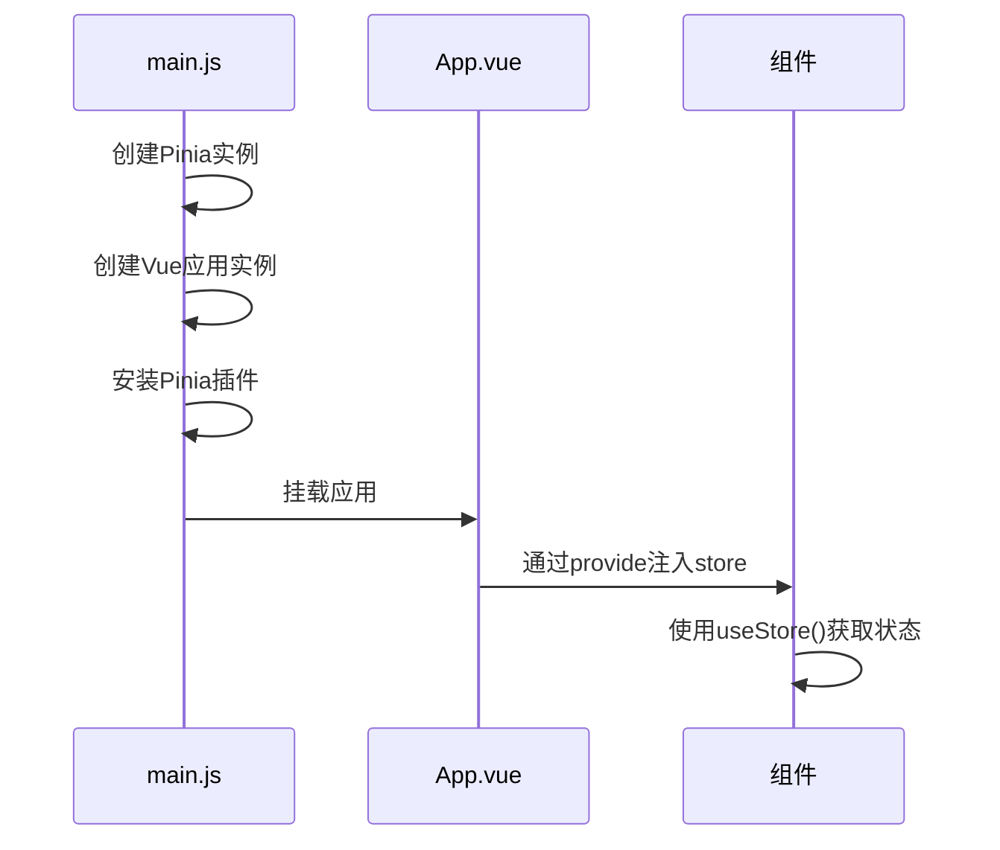
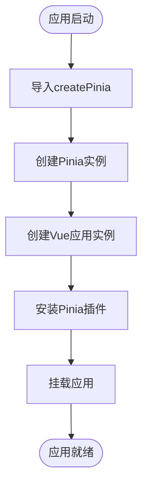
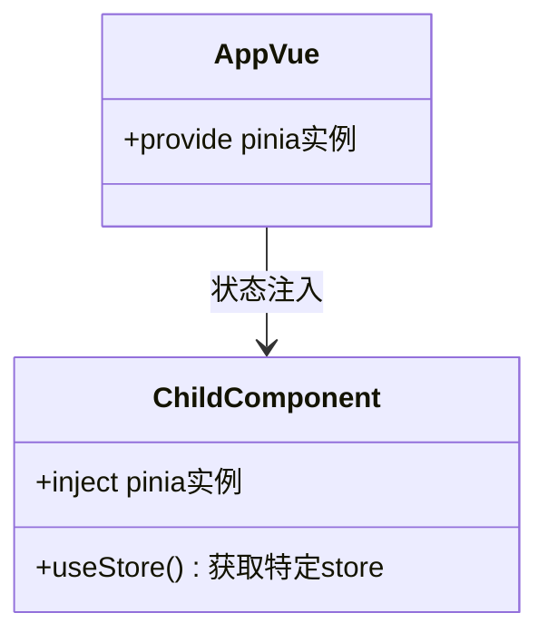
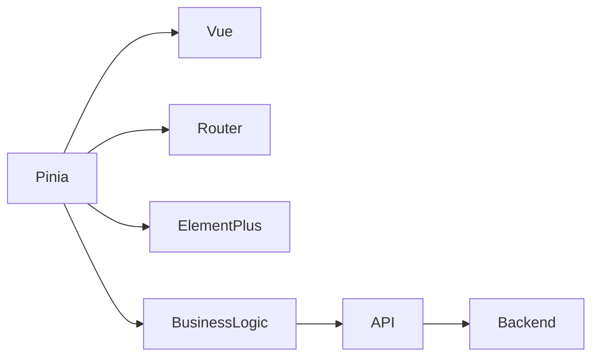

# Pinia状态管理集成

<cite>
**本文档引用文件**  
- [main.js](file://07-frontend/src/main.js)
- [App.vue](file://07-frontend/src/App.vue)
- [Sidebar.vue](file://07-frontend/src/components/common/Sidebar.vue)
- [package.json](file://07-frontend/package.json)
- [router/index.js](file://07-frontend/src/router/index.js)
</cite>

## 目录
1. [项目结构](#项目结构)
2. [核心组件](#核心组件)
3. [架构概述](#架构概述)
4. [详细组件分析](#详细组件分析)
5. [依赖分析](#依赖分析)
6. [性能考虑](#性能考虑)
7. [故障排除指南](#故障排除指南)
8. [结论](#结论)

## 项目结构

项目采用模块化前端架构，Pinia作为核心状态管理方案集成在Vue 3应用中。src目录下包含api、components、pages、router、services等标准模块，其中状态管理通过Pinia实现全局状态共享。

**图示来源**  
- [main.js](file://07-frontend/src/main.js#L1-L27)
- [package.json](file://07-frontend/package.json#L1-L34)

**本节来源**  
- [main.js](file://07-frontend/src/main.js#L1-L27)
- [package.json](file://07-frontend/package.json#L1-L34)

## 核心组件

Pinia状态管理的核心在于其简洁的API设计和模块化store组织。通过createPinia()创建实例并挂载到Vue应用，实现了全局状态的集中管理和响应式更新。

**本节来源**  
- [main.js](file://07-frontend/src/main.js#L7-L10)
- [package.json](file://07-frontend/package.json#L15)

## 架构概述

Pinia在应用中的集成遵循Vue 3的Composition API设计模式，通过provide/inject机制将store实例注入到整个组件树中，确保所有组件都能访问到统一的状态源。

**图示来源**  
- [main.js](file://07-frontend/src/main.js#L7-L26)
- [App.vue](file://07-frontend/src/App.vue#L1-L80)

## 详细组件分析

### Pinia实例创建分析

在main.js中，Pinia实例的创建和安装过程体现了现代Vue应用的标准初始化流程。首先导入createPinia函数，然后创建实例并将其作为插件安装到Vue应用中。

#### 初始化流程

**图示来源**  
- [main.js](file://07-frontend/src/main.js#L7-L26)

**本节来源**  
- [main.js](file://07-frontend/src/main.js#L7-L26)

### 全局状态注入分析

App.vue作为根组件，通过Vue的provide/inject机制实现了Pinia store的全局注入。这种设计模式使得所有子组件都能通过useStore()函数访问到共享状态。

#### 状态注入机制

**图示来源**  
- [App.vue](file://07-frontend/src/App.vue#L1-L80)
- [Sidebar.vue](file://07-frontend/src/components/common/Sidebar.vue#L54-L59)

**本节来源**  
- [App.vue](file://07-frontend/src/App.vue#L1-L80)
- [Sidebar.vue](file://07-frontend/src/components/common/Sidebar.vue#L54-L59)

## 依赖分析

Pinia与其他核心模块的依赖关系体现了其在应用架构中的中心地位。作为状态管理层，它与路由、UI组件库和业务逻辑层紧密协作。

**图示来源**  
- [main.js](file://07-frontend/src/main.js#L1-L27)
- [router/index.js](file://07-frontend/src/router/index.js#L1-L228)

**本节来源**  
- [main.js](file://07-frontend/src/main.js#L1-L27)
- [package.json](file://07-frontend/package.json#L13-L18)

## 性能考虑

Pinia的状态管理方案在性能方面表现出色，其基于Proxy的响应式系统确保了高效的依赖追踪和更新。通过模块化store设计，避免了单一状态树的性能瓶颈。

**本节来源**  
- [main.js](file://07-frontend/src/main.js#L7-L10)
- [package.json](file://07-frontend/package.json#L15)

## 故障排除指南

在使用Pinia过程中可能遇到的常见问题包括store未正确安装、状态更新不及时等。确保在main.js中正确调用app.use(pinia)是解决这些问题的关键。

**本节来源**  
- [main.js](file://07-frontend/src/main.js#L22)
- [App.vue](file://07-frontend/src/App.vue#L1-L80)

## 结论

Pinia作为Vue 3应用的状态管理解决方案，通过简洁的API和模块化设计，有效解决了复杂应用中的状态共享问题。其与Vue 3 Composition API的完美集成，使得状态管理更加直观和高效。