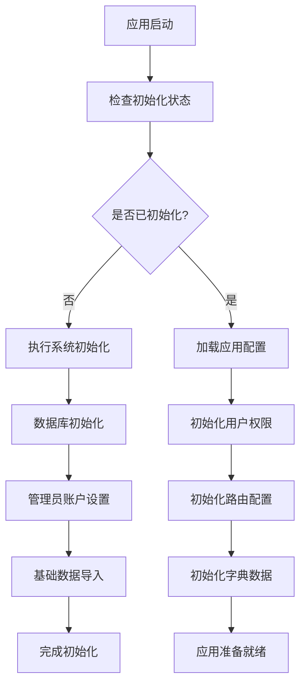
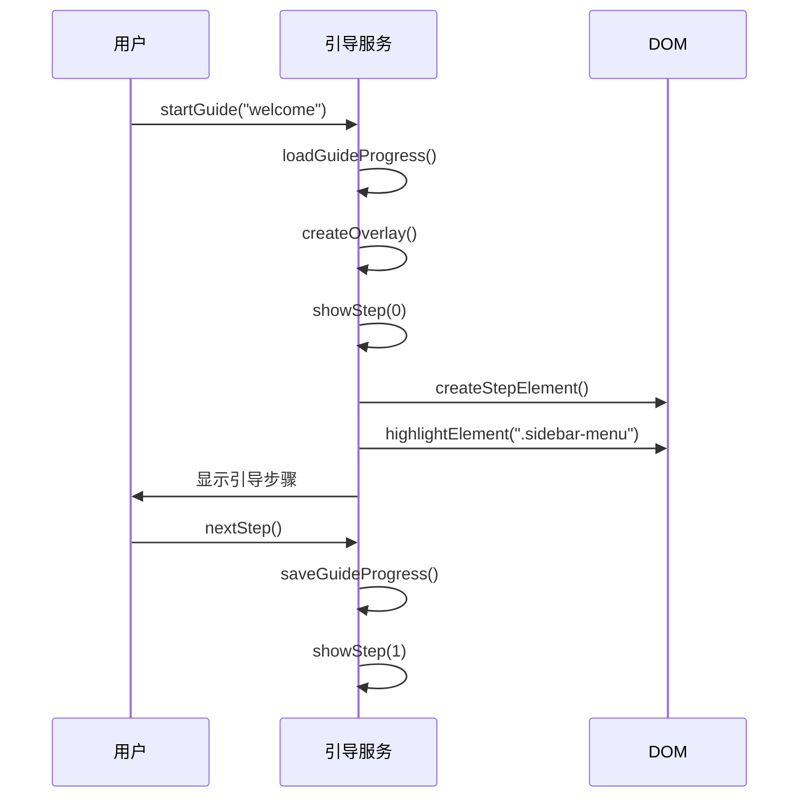
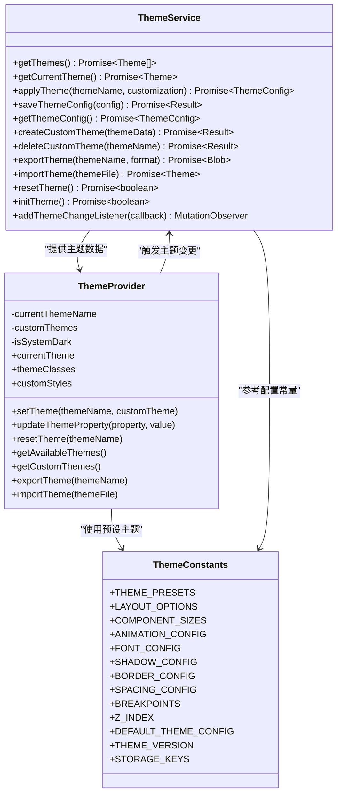
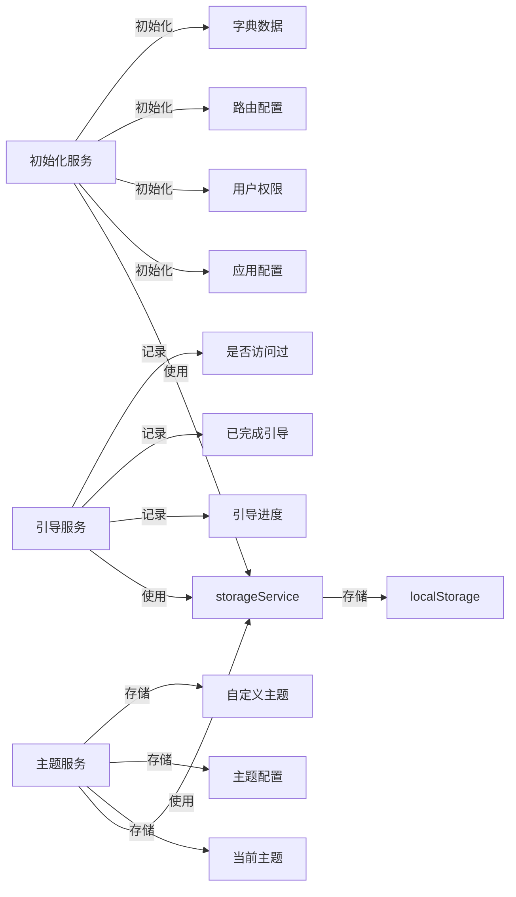
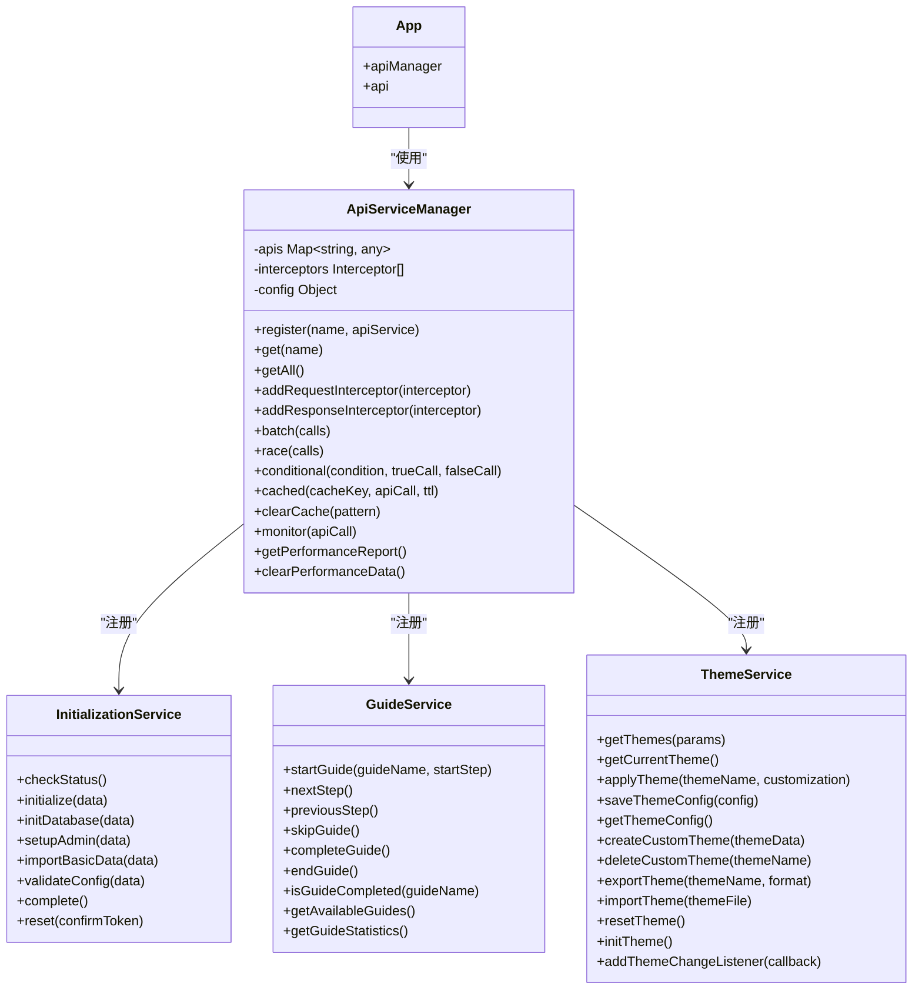

# 应用级状态服务

<cite>
**本文档引用文件**   
- [initialization-service.js](file://07-frontend/src/services/initialization-service.js)
- [guide-service.js](file://07-frontend/src/services/guide-service.js)
- [theme-service.js](file://07-frontend/src/services/theme-service.js)
- [ThemeProvider.vue](file://07-frontend/src/components/theme/ThemeProvider.vue)
- [themeConstants.js](file://07-frontend/src/components/theme/constants/themeConstants.js)
- [themeUtils.js](file://07-frontend/src/components/theme/utils/themeUtils.js)
- [index.js](file://07-frontend/src/services/index.js)
- [request.js](file://07-frontend/src/utils/request.js)
</cite>

## 目录
1. [应用级状态服务架构概述](#应用级状态服务架构概述)
2. [初始化服务](#初始化服务)
3. [引导服务](#引导服务)
4. [主题服务](#主题服务)
5. [服务间通信与状态同步](#服务间通信与状态同步)
6. [服务注册与注入模式](#服务注册与注入模式)
7. [最佳实践与使用指南](#最佳实践与使用指南)

## 应用级状态服务架构概述

本文档深入剖析企业大脑AI桌面应用中的三大核心应用级状态管理模块：初始化服务、引导服务和主题服务。这些服务共同构成了应用的基础设施层，负责管理应用的启动流程、用户引导体验和界面主题配置。通过分析这些服务的架构设计和实现模式，开发者可以更好地理解复杂应用状态的组织与维护方法。

这些服务采用模块化设计，通过清晰的接口定义和职责分离，实现了高内聚低耦合的架构。每个服务都封装了特定领域的业务逻辑，同时通过统一的API调用模式和本地存储机制，实现了状态的持久化和跨组件共享。

**Section sources**
- [initialization-service.js](file://07-frontend/src/services/initialization-service.js#L1-L174)
- [guide-service.js](file://07-frontend/src/services/guide-service.js#L1-L575)
- [theme-service.js](file://07-frontend/src/services/theme-service.js#L1-L310)

## 初始化服务

初始化服务负责协调应用启动时的配置加载与数据初始化流程。该服务分为两个主要部分：系统初始化服务和应用初始化服务。

系统初始化服务提供了一套完整的系统级初始化接口，包括检查系统状态、执行数据库初始化、设置管理员账户、导入基础数据等。这些接口通过HTTP请求与后端服务通信，确保系统在首次使用时能够正确配置。

**Diagram sources **
- [initialization-service.js](file://07-frontend/src/services/initialization-service.js#L1-L44)
- [initialization-service.js](file://07-frontend/src/services/initialization-service.js#L104-L174)

应用初始化服务则专注于应用层面的配置加载，通过并行调用多个API接口，高效地完成应用配置、用户权限、路由配置和字典数据的初始化。该服务利用本地存储机制缓存这些配置，减少重复的网络请求，提升应用性能。

**Section sources**
- [initialization-service.js](file://07-frontend/src/services/initialization-service.js#L1-L174)

## 引导服务

引导服务负责管理用户引导流程和操作提示的状态。该服务提供了一套完整的引导功能，包括引导步骤管理、进度跟踪、用户交互处理等。

引导服务的核心是引导步骤数据结构，它定义了每个引导流程的步骤信息，包括步骤标题、内容、目标元素和显示位置。服务通过动态创建DOM元素来显示引导步骤，并使用遮罩层和高亮效果引导用户注意力。

**Diagram sources **
- [guide-service.js](file://07-frontend/src/services/guide-service.js#L24-L109)
- [guide-service.js](file://07-frontend/src/services/guide-service.js#L124-L149)

引导服务还支持键盘导航、进度保存和重新开始等功能，提供了良好的用户体验。通过本地存储，用户的引导进度得以持久化，避免重复引导。服务还提供了丰富的配置选项，如是否显示跳过按钮、是否允许键盘导航等，满足不同场景的需求。

**Section sources**
- [guide-service.js](file://07-frontend/src/services/guide-service.js#L1-L575)

## 主题服务

主题服务实现了动态主题切换与样式管理功能。该服务通过CSS变量和本地存储的结合，实现了主题的实时切换和持久化。

主题服务的核心是主题应用机制，它将主题配置转换为CSS变量并应用到文档根元素上。通过这种方式，整个应用的样式可以基于这些变量动态调整，实现主题的即时切换。

**Diagram sources **
- [theme-service.js](file://07-frontend/src/services/theme-service.js#L5-L257)
- [ThemeProvider.vue](file://07-frontend/src/components/theme/ThemeProvider.vue#L1-L326)
- [themeConstants.js](file://07-frontend/src/components/theme/constants/themeConstants.js#L1-L55)

主题服务支持多种主题操作，包括获取主题列表、应用主题、保存自定义主题、导入导出主题等。服务还提供了主题初始化功能，在应用启动时自动加载用户上次使用的主题，确保用户体验的一致性。

**Section sources**
- [theme-service.js](file://07-frontend/src/services/theme-service.js#L1-L310)
- [ThemeProvider.vue](file://07-frontend/src/components/theme/ThemeProvider.vue#L1-L326)
- [themeConstants.js](file://07-frontend/src/components/theme/constants/themeConstants.js#L1-L211)

## 服务间通信与状态同步

三大应用级状态服务通过共享的本地存储服务实现状态同步。`storageService`作为基础服务，为其他服务提供统一的本地存储接口，确保状态数据的一致性和可靠性。

**Diagram sources **
- [initialization-service.js](file://07-frontend/src/services/initialization-service.js#L47-L102)
- [guide-service.js](file://07-frontend/src/services/guide-service.js#L2-L3)
- [theme-service.js](file://07-frontend/src/services/theme-service.js#L2-L3)

服务间通过事件机制和状态监听实现通信。例如，主题服务提供了`addThemeChangeListener`方法，允许其他组件监听主题变化事件，及时更新界面。这种发布-订阅模式降低了服务间的耦合度，提高了系统的可维护性。

**Section sources**
- [initialization-service.js](file://07-frontend/src/services/initialization-service.js#L47-L102)
- [guide-service.js](file://07-frontend/src/services/guide-service.js#L2-L3)
- [theme-service.js](file://07-frontend/src/services/theme-service.js#L2-L3)

## 服务注册与注入模式

应用通过服务注册模式统一管理所有服务实例。在`services/index.js`中，通过`ApiServiceManager`类实现了服务的注册、获取和管理功能。这种模式提供了统一的服务访问接口，简化了服务的使用。

**Diagram sources **
- [index.js](file://07-frontend/src/services/index.js#L45-L314)
- [index.js](file://07-frontend/src/services/index.js#L317-L334)

服务通过ES6模块的导出导入机制实现依赖注入。在需要使用服务的组件中，通过import语句导入相应服务，即可直接调用其方法。这种模式简单直观，符合现代JavaScript开发的最佳实践。

**Section sources**
- [index.js](file://07-frontend/src/services/index.js#L1-L409)

## 最佳实践与使用指南

在使用这些应用级状态服务时，应遵循以下最佳实践：

1. **服务初始化时机**：在应用启动时尽早初始化这些服务，确保应用状态的正确加载。通常在主应用组件的`created`或`mounted`生命周期钩子中进行初始化。

2. **错误处理**：每个服务方法都应包含适当的错误处理机制，确保在服务调用失败时能够优雅降级，不影响应用的主要功能。

3. **性能优化**：利用服务提供的缓存机制，避免重复的网络请求。对于频繁访问的数据，优先从本地存储读取。

4. **状态同步**：当多个服务需要共享状态时，通过`storageService`进行同步，确保状态的一致性。

5. **用户体验**：在执行耗时操作时，提供适当的加载提示，避免用户困惑。对于引导服务，应尊重用户的操作习惯，提供跳过和重新开始的选项。

通过遵循这些最佳实践，开发者可以充分利用这些应用级状态服务，构建稳定、高效且用户体验良好的复杂应用。

**Section sources**
- [initialization-service.js](file://07-frontend/src/services/initialization-service.js#L1-L174)
- [guide-service.js](file://07-frontend/src/services/guide-service.js#L1-L575)
- [theme-service.js](file://07-frontend/src/services/theme-service.js#L1-L310)
- [index.js](file://07-frontend/src/services/index.js#L1-L409)