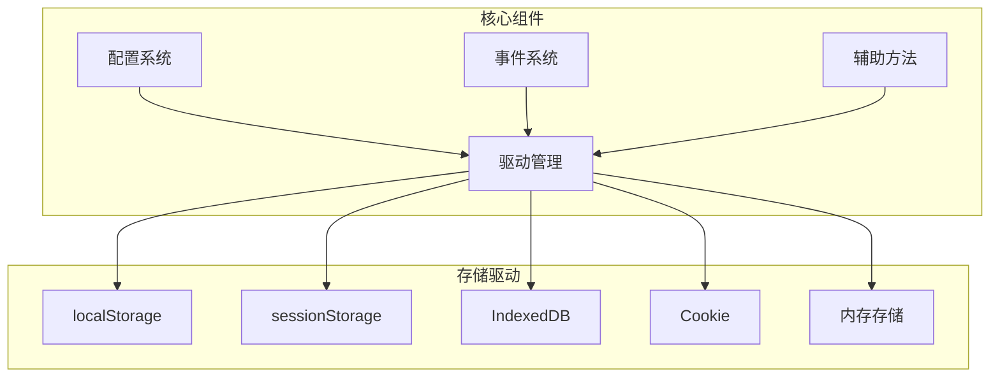
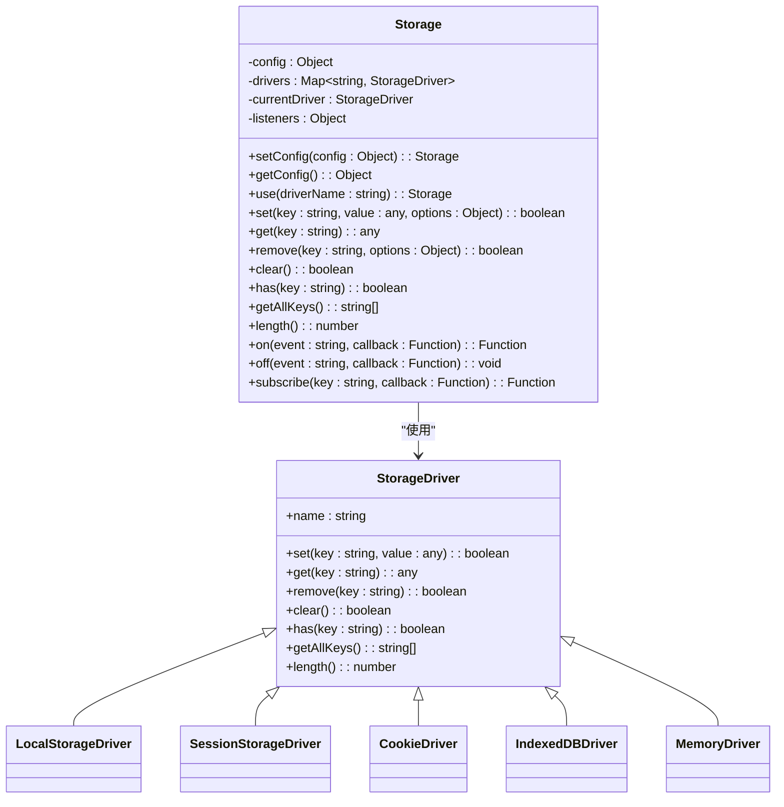
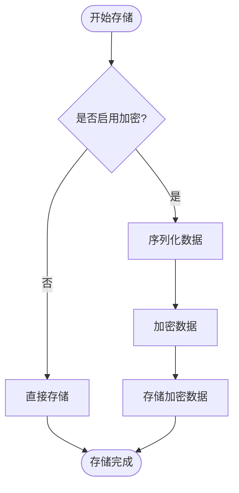
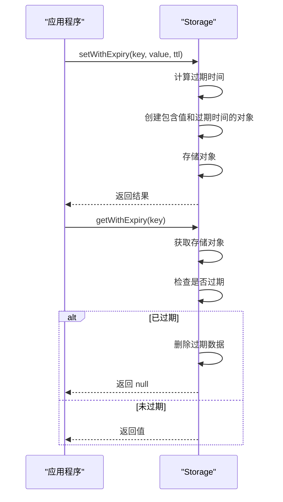
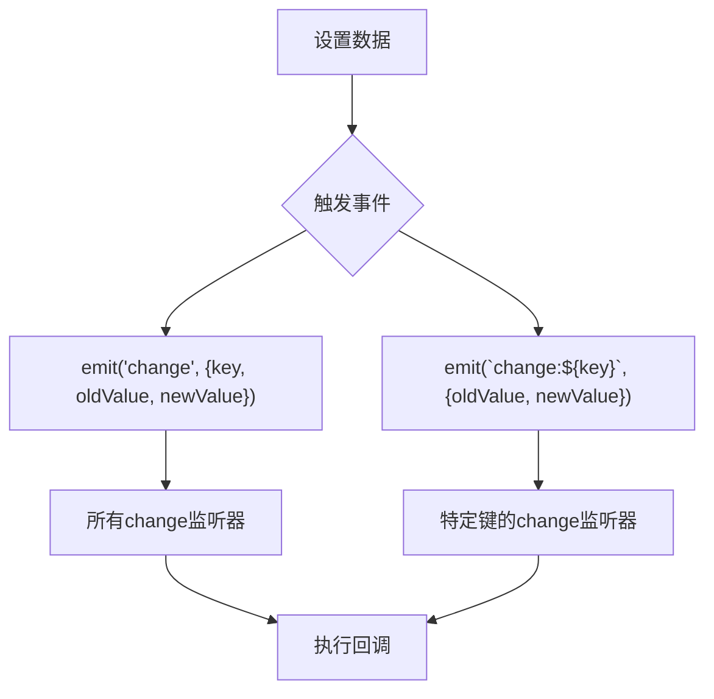
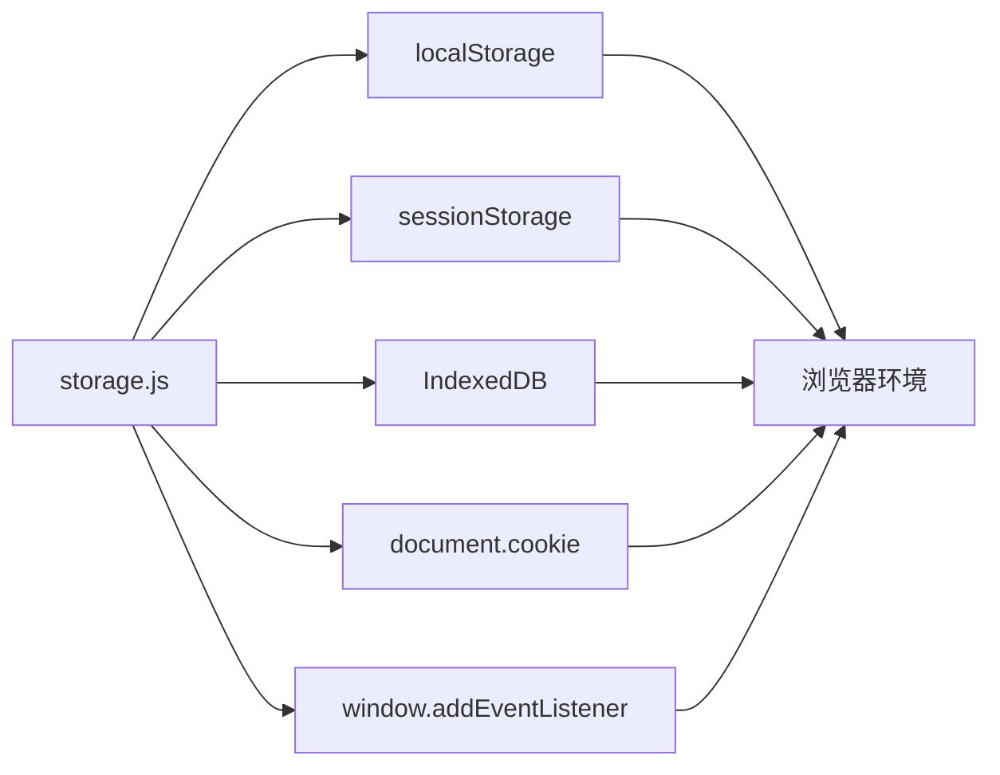

# 本地存储持久化

<cite>
**本文档引用的文件**   
- [storage.js](file://07-frontend/src/services/utils/storage.js)
- [DataPersistence.md](file://07-frontend/src/docs/DataPersistence.md)
- [themeUtils.js](file://07-frontend/src/components/theme/utils/themeUtils.js)
</cite>

## 目录
1. [简介](#简介)
2. [项目结构](#项目结构)
3. [核心组件](#核心组件)
4. [架构概述](#架构概述)
5. [详细组件分析](#详细组件分析)
6. [依赖分析](#依赖分析)
7. [性能考虑](#性能考虑)
8. [故障排除指南](#故障排除指南)
9. [结论](#结论)

## 简介
本文档全面解析了`storage.js`提供的本地存储解决方案，重点说明其对浏览器原生Storage API的封装与增强。文档详细描述了加密存储、过期时间管理、数据序列化/反序列化等核心功能的实现原理。通过实际用例展示了如何安全地存储用户偏好设置、会话数据和缓存信息。同时，文档解释了存储事件监听机制和跨标签页通信的实现方式，提供了性能优化建议和存储容量管理策略，帮助开发者有效利用本地存储提升用户体验。

## 项目结构
`storage.js`文件位于`07-frontend/src/services/utils/`目录下，是前端项目中用于管理本地存储的核心工具。该文件实现了对多种存储方式的统一接口，包括localStorage、sessionStorage、IndexedDB和Cookie。通过分析项目结构，可以看出存储功能被设计为一个独立的服务工具，与其他业务逻辑分离，便于维护和扩展。

**Section sources**
- [storage.js](file://07-frontend/src/services/utils/storage.js#L1-L1122)

## 核心组件
`storage.js`的核心是一个名为`Storage`的类，它提供了统一的存储接口。该类支持多种存储驱动，包括localStorage、sessionStorage、IndexedDB、Cookie和内存存储。通过配置系统，开发者可以灵活选择默认驱动、设置前缀、启用加密等功能。类中还实现了事件系统，支持监听存储变化，便于实现跨组件通信。

**Section sources**
- [storage.js](file://07-frontend/src/services/utils/storage.js#L5-L1122)

## 架构概述
`storage.js`的架构设计遵循了模块化和可扩展的原则。核心架构包括配置系统、驱动管理、事件系统和辅助方法四个主要部分。配置系统允许开发者自定义存储行为；驱动管理实现了对不同存储方式的抽象和封装；事件系统提供了存储变化的监听机制；辅助方法则提供了序列化、反序列化、错误处理等通用功能。

**Diagram sources **
- [storage.js](file://07-frontend/src/services/utils/storage.js#L8-L31)

## 详细组件分析

### 存储驱动分析
`storage.js`实现了多种存储驱动，每种驱动都遵循相同的接口规范。驱动通过工厂方法创建，封装了具体的存储操作。当某个驱动不可用时，系统会自动回退到备用驱动，确保存储功能的可靠性。

#### 驱动接口实现

**Diagram sources **
- [storage.js](file://07-frontend/src/services/utils/storage.js#L25-L31)

### 加密存储分析
`storage.js`提供了加密存储的配置选项，虽然在当前实现中加密逻辑被注释掉了，但架构上已经预留了扩展点。通过配置`encryption.enabled`和`encryption.key`，可以启用数据加密功能，保护敏感信息的安全。

**Diagram sources **
- [storage.js](file://07-frontend/src/services/utils/storage.js#L1030-L1064)

### 过期时间管理分析
`storage.js`通过`setWithExpiry`和`getWithExpiry`方法实现了数据过期管理。存储时将数据和过期时间一起保存，读取时检查是否过期，如果过期则自动删除并返回null。

**Diagram sources **
- [storage.js](file://07-frontend/src/services/utils/storage.js#L913-L939)

### 事件系统分析
`storage.js`实现了完整的事件系统，支持监听存储变化。当数据发生变化时，会触发相应的事件，包括通用的`change`事件和针对特定键的`change:key`事件。这使得不同组件可以订阅感兴趣的存储变化，实现松耦合的通信。

**Diagram sources **
- [storage.js](file://07-frontend/src/services/utils/storage.js#L761-L771)

## 依赖分析
`storage.js`主要依赖于浏览器的原生API，如localStorage、sessionStorage、IndexedDB和document.cookie。这些API提供了底层的存储能力，`storage.js`在此基础上进行了封装和增强。通过检查这些API的可用性，`storage.js`能够自动选择最适合的存储驱动。

**Diagram sources **
- [storage.js](file://07-frontend/src/services/utils/storage.js#L120-L156)

## 性能考虑
`storage.js`在设计时考虑了性能优化。通过驱动选择机制，优先使用性能更好的存储方式。对于大量数据的存储，推荐使用IndexedDB驱动，它提供了更好的查询性能和更大的存储容量。同时，`storage.js`实现了存储配额检查，在存储使用接近限制时发出警告，帮助开发者及时处理存储问题。

**Section sources**
- [storage.js](file://07-frontend/src/services/utils/storage.js#L206-L229)
- [DataPersistence.md](file://07-frontend/src/docs/DataPersistence.md#L1-L143)

## 故障排除指南
当遇到存储问题时，可以按照以下步骤进行排查：
1. 检查浏览器是否支持所需的存储API
2. 查看控制台是否有存储错误信息
3. 检查存储配额是否已满
4. 验证存储键名是否正确
5. 确认数据序列化/反序列化是否正常

`storage.js`提供了`getStats`方法，可以获取存储使用统计信息，帮助诊断问题。同时，通过启用`debug`模式，可以查看详细的存储操作日志。

**Section sources**
- [storage.js](file://07-frontend/src/services/utils/storage.js#L1089-L1096)
- [storage.js](file://07-frontend/src/services/utils/storage.js#L1079-L1083)

## 结论
`storage.js`提供了一个功能强大且灵活的本地存储解决方案。通过对多种存储方式的封装，它为开发者提供了一致的API接口，简化了本地存储的使用。其模块化的设计使得功能扩展和维护变得容易。通过加密、过期管理、事件系统等特性，`storage.js`不仅满足了基本的存储需求，还提供了高级功能来应对复杂的应用场景。结合`DataPersistence.md`文档中描述的IndexedDB持久化方案，该存储系统为应用的数据可靠性提供了有力保障。