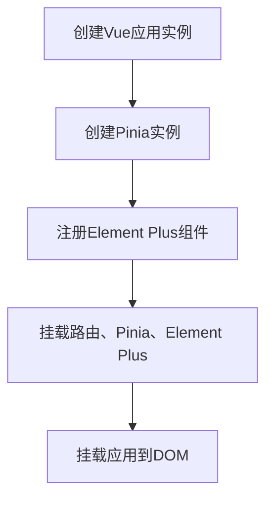
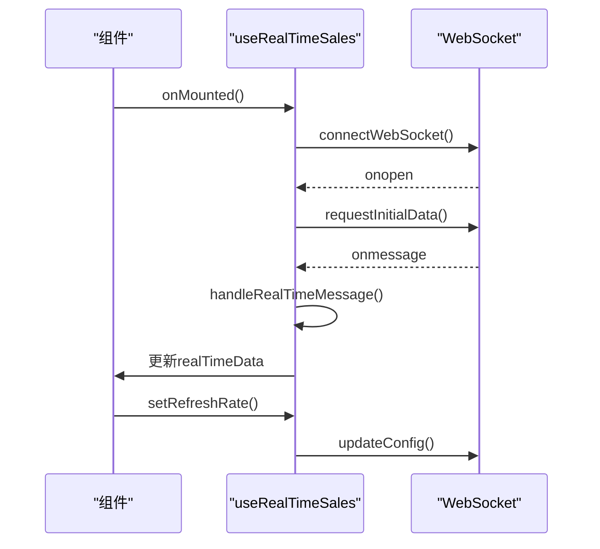
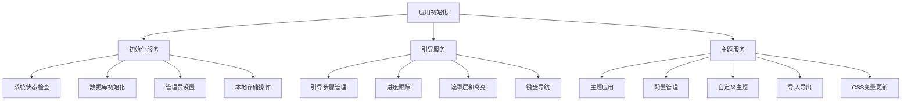
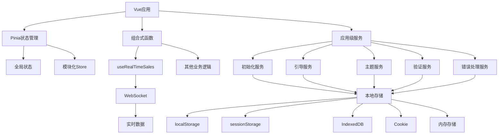

# 状态管理

<cite>
**本文档引用的文件**
- [main.js](file://07-frontend/src/main.js)
- [App.vue](file://07-frontend/src/App.vue)
- [useRealTimeSales.js](file://07-frontend/src/composables/useRealTimeSales.js)
- [storage.js](file://07-frontend/src/services/utils/storage.js)
- [initialization-service.js](file://07-frontend/src/services/initialization-service.js)
- [guide-service.js](file://07-frontend/src/services/guide-service.js)
- [theme-service.js](file://07-frontend/src/services/theme-service.js)
</cite>

## 目录
1. [引言](#引言)
2. [Pinia状态管理集成](#pinia状态管理集成)
3. [自定义组合式函数](#自定义组合式函数)
4. [本地存储持久化策略](#本地存储持久化策略)
5. [应用级状态服务](#应用级状态服务)
6. [状态管理架构图](#状态管理架构图)
7. [总结](#总结)

## 引言
本项目采用Pinia作为核心状态管理方案，结合组合式API和自定义服务，构建了一套完整的前端状态管理体系。系统通过Pinia实现全局状态的集中管理，利用组合式函数封装业务逻辑，并通过本地存储服务实现数据持久化。同时，各类应用级服务负责管理主题、引导流程和系统初始化等应用级状态，确保了应用的一致性和可维护性。

## Pinia状态管理集成
Pinia在本项目中作为Vue应用的全局状态管理器，通过在main.js中初始化并注入到应用实例中，实现了跨组件的状态共享和管理。

在main.js文件中，首先从pinia包中导入createPinia函数，然后创建Pinia实例，并通过app.use()方法将其挂载到Vue应用实例上。这一过程确保了Pinia能够拦截所有组件的状态访问，提供响应式的数据管理能力。



**图示来源**
- [main.js](file://07-frontend/src/main.js#L1-L27)

App.vue作为应用的根组件，虽然不直接包含复杂的业务逻辑，但其结构设计体现了状态管理的全局性。组件通过router-view实现路由内容的动态加载，同时应用的全局样式和过渡动画确保了用户体验的一致性。

**本节来源**
- [main.js](file://07-frontend/src/main.js#L1-L27)
- [App.vue](file://07-frontend/src/App.vue#L1-L80)

## 自定义组合式函数
项目通过组合式函数（Composables）的方式封装了复杂的业务状态逻辑，其中useRealTimeSales.js是典型的示例，它封装了实时销售数据的WebSocket连接管理和状态更新逻辑。

useRealTimeSales函数返回一个包含响应式数据和操作方法的对象，实现了WebSocket连接的自动重连、消息处理、配置更新等完整功能。该函数利用Vue的ref和响应式系统，确保了状态的实时性和一致性。

核心功能包括：
- WebSocket连接管理：自动建立连接、处理连接状态变化
- 消息处理：解析不同类型的消息并更新相应的状态
- 配置管理：支持动态调整刷新率和时间范围
- 生命周期管理：在组件挂载时建立连接，卸载时清理资源
- 可见性优化：根据页面可见性调整刷新频率以节省资源



**图示来源**
- [useRealTimeSales.js](file://07-frontend/src/composables/useRealTimeSales.js#L1-L309)

**本节来源**
- [useRealTimeSales.js](file://07-frontend/src/composables/useRealTimeSales.js#L1-L309)

## 本地存储持久化策略
storage.js文件实现了一个功能完整的存储管理工具，支持多种存储方式的统一接口，包括localStorage、sessionStorage、IndexedDB、Cookie和内存存储。

该存储管理器具有以下特点：
- **多驱动支持**：支持多种存储方式，可根据需求和环境自动切换
- **前缀管理**：通过配置前缀避免键名冲突
- **加密支持**：可配置数据加密，增强数据安全性
- **事件系统**：提供存储变更事件，支持跨组件通信
- **配额监控**：监控存储使用情况，避免超出限制
- **回退机制**：当首选驱动不可用时，自动回退到备用驱动

存储管理器通过类的方式实现，提供了set、get、remove、clear等核心方法，并支持链式调用和事件监听。这种设计使得存储操作更加安全和可控，同时保持了良好的扩展性。

```mermaid
classDiagram
class Storage {
+config : Object
+drivers : Object
+currentDriver : Object
+listeners : Object
+setConfig(config) : Storage
+getConfig() : Object
+use(driverName) : Storage
+set(key, value, options) : boolean
+get(key) : any
+remove(key, options) : boolean
+clear() : boolean
+getAllKeys() : Array
+length() : number
}
class Driver {
+name : string
+set(key, value) : boolean
+get(key) : any
+remove(key) : boolean
+clear() : boolean
+has(key) : boolean
+getAllKeys() : Array
+length() : number
}
Storage --> Driver : "包含"
Storage --> "localStorage" : "驱动"
Storage --> "sessionStorage" : "驱动"
Storage --> "cookie" : "驱动"
Storage --> "indexedDB" : "驱动"
Storage --> "memory" : "驱动"
```

**图示来源**
- [storage.js](file://07-frontend/src/services/utils/storage.js#L1-L800)

**本节来源**
- [storage.js](file://07-frontend/src/services/utils/storage.js#L1-L800)

## 应用级状态服务
项目通过services目录下的各类服务管理应用级状态和配置，这些服务通过模块化的方式组织，提供了清晰的职责划分和接口定义。

### 初始化服务
initialization-service.js提供了系统初始化相关的服务，包括：
- 系统状态检查
- 数据库初始化
- 管理员账户设置
- 基础数据导入
- 本地存储操作

该服务通过export const的方式导出多个独立的服务实例，便于在不同场景下按需使用。

### 引导服务
guide-service.js实现了用户引导功能，包括：
- 引导步骤管理
- 进度跟踪和持久化
- 遮罩层和高亮效果
- 键盘导航支持
- 统计和重置功能

引导服务利用本地存储记录用户进度，确保用户不会重复经历已完成的引导，同时提供了重新开始的选项。

### 主题服务
theme-service.js负责主题管理，主要功能包括：
- 主题列表获取和应用
- 主题配置的保存和加载
- 自定义主题创建
- 主题导入导出
- CSS变量动态更新

主题服务通过applyThemeToDOM方法将主题配置应用到DOM元素，实现了主题的实时切换效果。



**图示来源**
- [initialization-service.js](file://07-frontend/src/services/initialization-service.js#L1-L174)
- [guide-service.js](file://07-frontend/src/services/guide-service.js#L1-L575)
- [theme-service.js](file://07-frontend/src/services/theme-service.js#L1-L310)

**本节来源**
- [initialization-service.js](file://07-frontend/src/services/initialization-service.js#L1-L174)
- [guide-service.js](file://07-frontend/src/services/guide-service.js#L1-L575)
- [theme-service.js](file://07-frontend/src/services/theme-service.js#L1-L310)

## 状态管理架构图
综合以上分析，项目的整体状态管理架构如下：



**图示来源**
- [main.js](file://07-frontend/src/main.js#L1-L27)
- [useRealTimeSales.js](file://07-frontend/src/composables/useRealTimeSales.js#L1-L309)
- [storage.js](file://07-frontend/src/services/utils/storage.js#L1-L800)
- [initialization-service.js](file://07-frontend/src/services/initialization-service.js#L1-L174)
- [guide-service.js](file://07-frontend/src/services/guide-service.js#L1-L575)
- [theme-service.js](file://07-frontend/src/services/theme-service.js#L1-L310)

## 总结
本项目的状态管理方案体现了现代前端应用的最佳实践，通过Pinia实现全局状态管理，利用组合式函数封装业务逻辑，结合本地存储服务实现数据持久化，并通过模块化的应用级服务管理各种应用配置。

这种分层架构的优势在于：
- **关注点分离**：不同类型的状体由不同的模块管理
- **可维护性**：代码结构清晰，易于理解和维护
- **可扩展性**：新的状态管理需求可以通过新增服务或组合式函数实现
- **性能优化**：通过合理的状态管理策略减少不必要的渲染和网络请求

开发者在使用这套状态管理方案时，应遵循以下原则：
1. 全局共享状态使用Pinia管理
2. 业务逻辑封装在组合式函数中
3. 持久化数据通过storage服务统一管理
4. 应用级配置通过专门的服务模块管理
5. 保持状态的单一来源，避免数据冗余和不一致

通过遵循这些原则，可以确保应用的状态管理既强大又易于维护。