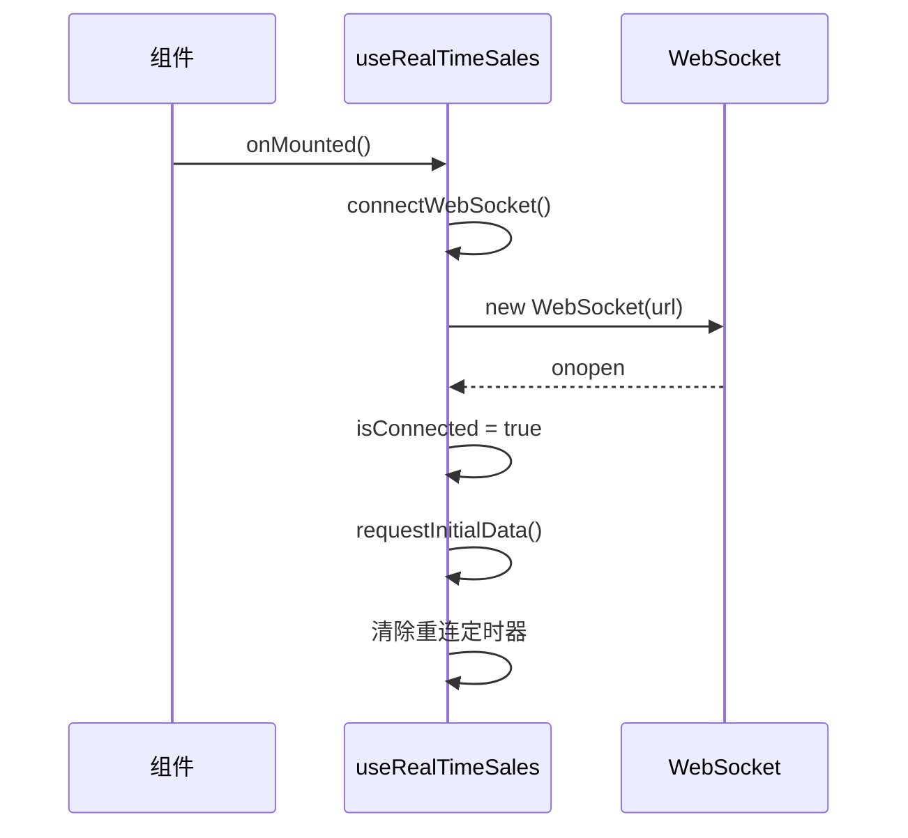
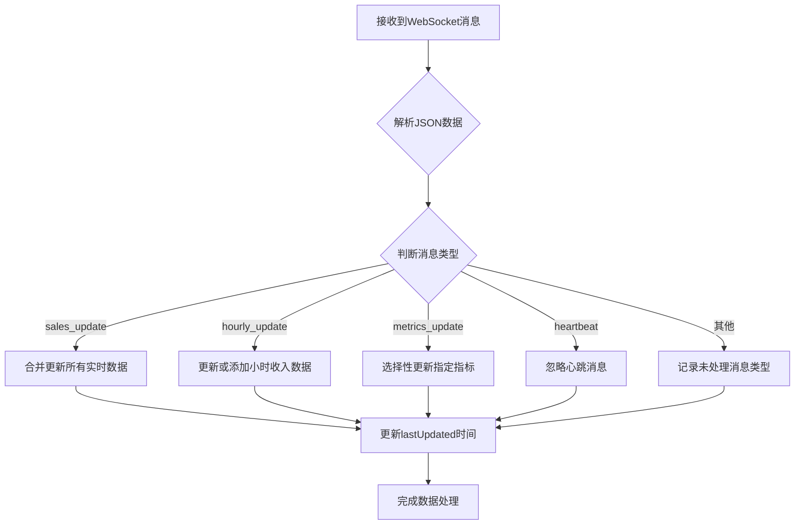

# 组合式函数状态管理

<cite>
**本文档引用的文件**   
- [useRealTimeSales.js](file://07-frontend/src/composables/useRealTimeSales.js)
- [sales.ts](file://07-frontend/src/api/sales.ts)
- [SalesDashboard.vue](file://07-frontend/src/pages/dashboard/SalesDashboard.vue)
- [KPIDashboard.vue](file://07-frontend/src/pages/dashboard/KPIDashboard.vue)
</cite>

## 目录
1. [引言](#引言)
2. [核心响应式数据对象](#核心响应式数据对象)
3. [WebSocket连接生命周期管理](#websocket连接生命周期管理)
4. [实时数据处理机制](#实时数据处理机制)
5. [配置更新与事件订阅](#配置更新与事件订阅)
6. [组件使用示例](#组件使用示例)
7. [错误处理与性能优化](#错误处理与性能优化)
8. [最佳实践](#最佳实践)

## 引言

`useRealTimeSales`组合式函数是前端应用中用于管理实时销售数据流的核心模块。该函数通过WebSocket技术实现了与后端服务的实时通信，为销售仪表板等组件提供了实时更新的销售数据。本文档将详细解析该组合式函数的实现机制，重点说明其如何封装WebSocket实时数据流管理逻辑。

该组合式函数的设计目标是提供一个可复用、易于使用的API，使开发者能够轻松地在各种组件中集成实时销售数据功能。通过封装复杂的WebSocket连接管理、数据解析和错误处理逻辑，该函数大大简化了实时数据功能的实现过程。

**本文档引用的文件**   
- [useRealTimeSales.js](file://07-frontend/src/composables/useRealTimeSales.js)
- [sales.ts](file://07-frontend/src/api/sales.ts)

## 核心响应式数据对象

`useRealTimeSales`组合式函数定义了多个响应式数据对象，用于存储和管理实时销售数据及相关状态。

### 连接状态与基础数据

函数使用Vue的`ref`函数创建了多个响应式引用，用于跟踪WebSocket连接状态和相关数据：

```javascript
const isConnected = ref(false)
const lastUpdated = ref(new Date())
const error = ref(null)
const ws = ref(null)
```

这些响应式对象提供了连接的基本状态信息：
- `isConnected`：布尔值，表示当前是否已成功建立WebSocket连接
- `lastUpdated`：日期对象，记录最后一次数据更新的时间
- `error`：存储连接或数据处理过程中发生的错误信息
- `ws`：存储WebSocket实例引用

### 实时销售数据结构

`realTimeData`响应式对象是该组合式函数的核心，用于存储实时销售数据：

```javascript
const realTimeData = ref({
  currentRevenue: 0,
  todayRevenue: 0,
  todayOrders: 0,
  todayCustomers: 0,
  hourlyRevenue: [],
  activeUsers: 0
})
```

该数据结构包含了销售监控所需的关键指标：
- `currentRevenue`：当前收入
- `todayRevenue`：今日总收入
- `todayOrders`：今日订单数量
- `todayCustomers`：今日新增客户数
- `hourlyRevenue`：每小时收入数据数组
- `activeUsers`：当前活跃用户数

### 配置参数管理

`config`响应式对象用于管理实时数据流的配置参数：

```javascript
const config = ref({
  timeRange: 60, // 分钟数
  refreshRate: 30 // 秒数
})
```

这些配置参数允许动态调整数据更新频率和时间范围，为用户提供灵活的实时数据查看体验。

**本文档引用的文件**   
- [useRealTimeSales.js](file://07-frontend/src/composables/useRealTimeSales.js#L5-L24)

## WebSocket连接生命周期管理

`useRealTimeSales`组合式函数实现了完整的WebSocket连接生命周期管理，包括连接建立、重连机制和连接关闭等关键功能。

### 连接建立与事件处理

`connectWebSocket`方法负责建立WebSocket连接并设置相应的事件处理器：



当WebSocket连接成功建立时（`onopen`事件），函数会：
1. 更新`isConnected`状态为`true`
2. 清除错误状态
3. 重置重连尝试次数
4. 请求初始数据
5. 清除重连定时器

### 重连机制实现

函数实现了智能的重连机制，以应对网络不稳定或服务器临时不可用的情况：

```javascript
const scheduleReconnect = () => {
  if (reconnectTimer) {
    clearTimeout(reconnectTimer)
  }
  
  reconnectAttempts++
  const delay = Math.min(1000 * Math.pow(2, reconnectAttempts), 30000)
  
  reconnectTimer = setTimeout(() => {
    connectWebSocket()
  }, delay)
}
```

重连机制的特点包括：
- **指数退避策略**：重连间隔时间随尝试次数指数增长，最大不超过30秒
- **最大尝试次数限制**：最多尝试5次重连，避免无限重连
- **非主动关闭才重连**：只有在非主动关闭（code !== 1000）的情况下才尝试重连

### 心跳检测与连接保持

为确保连接的稳定性，函数实现了定期心跳检测机制：

```javascript
onMounted(() => {
  connectWebSocket()
  
  // 每30秒发送一次心跳
  const heartbeatInterval = setInterval(() => {
    if (ws.value && ws.value.readyState === WebSocket.OPEN) {
      ws.value.send(JSON.stringify({
        type: 'heartbeat',
        timestamp: new Date().toISOString()
      }))
    }
  }, 30000)
})
```

此外，函数还监听页面可见性变化，优化资源使用：

```javascript
const handleVisibilityChange = () => {
  if (document.hidden) {
    // 页面不可见时降低刷新率
    setRefreshRate(60)
  } else {
    // 页面可见时恢复正常刷新率
    setRefreshRate(config.value.refreshRate)
    
    // 如果连接已断开，尝试重新连接
    if (!isConnected.value) {
      connectWebSocket()
    }
  }
}
```

**本文档引用的文件**   
- [useRealTimeSales.js](file://07-frontend/src/composables/useRealTimeSales.js#L30-L271)

## 实时数据处理机制

`useRealTimeSales`组合式函数通过`handleRealTimeMessage`方法处理从WebSocket接收到的实时数据，实现了高效的数据更新策略。

### 消息类型处理

函数根据消息类型采用不同的处理策略：



### 数据更新策略

不同消息类型采用不同的数据更新策略：

#### 销售更新处理

对于`sales_update`类型的消息，函数采用对象扩展运算符进行数据合并：

```javascript
case 'sales_update':
  realTimeData.value = {
    ...realTimeData.value,
    ...data.data
  }
  break
```

这种策略确保了所有收到的数据字段都能被正确更新，同时保留了未在消息中包含的现有数据。

#### 小时收入更新

对于`hourly_update`类型的消息，函数实现了更精细的更新逻辑：

```javascript
case 'hourly_update':
  if (data.data.hour) {
    const existingIndex = realTimeData.value.hourlyRevenue.findIndex(
      item => item.hour === data.data.hour
    )
    
    if (existingIndex >= 0) {
      realTimeData.value.hourlyRevenue[existingIndex] = data.data
    } else {
      realTimeData.value.hourlyRevenue.push(data.data)
      // 保持最近24小时的数据
      if (realTimeData.value.hourlyRevenue.length > 24) {
        realTimeData.value.hourlyRevenue.shift()
      }
    }
  }
  break
```

该策略的特点包括：
- **存在性检查**：首先检查是否已存在对应小时的数据
- **更新或添加**：如果存在则更新，否则添加新数据
- **数据量控制**：限制`hourlyRevenue`数组长度不超过24，保持最近24小时的数据

#### 指标选择性更新

对于`metrics_update`类型的消息，函数实现了选择性更新：

```javascript
case 'metrics_update':
  if (data.metrics) {
    Object.keys(data.metrics).forEach(key => {
      if (realTimeData.value.hasOwnProperty(key)) {
        realTimeData.value[key] = data.metrics[key]
      }
    })
  }
  break
```

这种策略确保只更新`realTimeData`中已定义的属性，避免引入未知字段。

**本文档引用的文件**   
- [useRealTimeSales.js](file://07-frontend/src/composables/useRealTimeSales.js#L83-L131)

## 配置更新与事件订阅

`useRealTimeSales`组合式函数提供了丰富的API，支持动态配置更新和事件订阅功能。

### 配置更新机制

函数通过`updateConfig`方法支持运行时配置更新：

```javascript
const updateConfig = (newConfig) => {
  Object.assign(config.value, newConfig)
  
  if (ws.value && ws.value.readyState === WebSocket.OPEN) {
    ws.value.send(JSON.stringify({
      type: 'update_config',
      config: config.value
    }))
  }
}
```

基于此方法，函数提供了两个便捷的配置更新API：

```javascript
// 切换刷新率
const setRefreshRate = (rate) => {
  updateConfig({ refreshRate: rate })
}

// 切换时间范围
const setTimeRange = (range) => {
  updateConfig({ timeRange: range })
}
```

这些方法允许组件根据用户交互或应用状态动态调整数据流配置。

### 事件订阅系统

函数实现了灵活的事件订阅机制，允许组件订阅特定类型的实时事件：

```javascript
// 订阅特定事件
const subscribe = (eventTypes) => {
  if (ws.value && ws.value.readyState === WebSocket.OPEN) {
    ws.value.send(JSON.stringify({
      type: 'subscribe',
      events: Array.isArray(eventTypes) ? eventTypes : [eventTypes]
    }))
  }
}

// 取消订阅
const unsubscribe = (eventTypes) => {
  if (ws.value && ws.value.readyState === WebSocket.OPEN) {
    ws.value.send(JSON.stringify({
      type: 'unsubscribe',
      events: Array.isArray(eventTypes) ? eventTypes : [eventTypes]
    }))
  }
}
```

事件订阅系统的特点包括：
- **类型安全**：支持单个事件类型或事件类型数组
- **连接状态检查**：只在WebSocket连接打开时发送订阅消息
- **灵活的订阅粒度**：允许订阅特定事件类型，减少不必要的数据传输

### 其他实用方法

函数还提供了其他实用方法，增强了其功能性和易用性：

```javascript
// 手动刷新数据
const refreshData = () => {
  requestInitialData()
}

// 获取连接状态
const getConnectionStatus = () => {
  return {
    isConnected: isConnected.value,
    lastUpdated: lastUpdated.value,
    error: error.value,
    reconnectAttempts
  }
}

// 获取当前配置
const getConfig = () => {
  return { ...config.value }
}

// 手动发送消息
const sendMessage = (message) => {
  if (ws.value && ws.value.readyState === WebSocket.OPEN) {
    ws.value.send(JSON.stringify(message))
  } else {
    console.warn('WebSocket未连接，无法发送消息')
  }
}

// 关闭连接
const disconnect = () => {
  if (ws.value) {
    ws.value.close(1000, '手动关闭')
  }
}
```

这些方法为组件提供了对实时数据流的全面控制能力。

**本文档引用的文件**   
- [useRealTimeSales.js](file://07-frontend/src/composables/useRealTimeSales.js#L143-L287)

## 组件使用示例

虽然在代码库中没有找到直接使用`useRealTimeSales`组合式函数的组件示例，但基于函数的设计和API，可以展示如何在组件中使用该函数。

### 基本使用模式

```javascript
import { useRealTimeSales } from '@/composables/useRealTimeSales'

export default {
  setup() {
    const { 
      isConnected, 
      realTimeData, 
      config,
      connectWebSocket,
      refreshData,
      subscribe,
      setRefreshRate
    } = useRealTimeSales()
    
    // 订阅销售更新事件
    subscribe('sales_update')
    
    // 根据需要调整刷新率
    setRefreshRate(15) // 每15秒更新一次
    
    return {
      isConnected,
      realTimeData,
      config
    }
  }
}
```

### 在销售仪表板中的应用

在销售仪表板组件中，可以这样使用`useRealTimeSales`：

```javascript
import { useRealTimeSales } from '@/composables/useRealTimeSales'
import { ref, computed } from 'vue'

export default {
  setup() {
    const { realTimeData, isConnected, refreshData } = useRealTimeSales()
    
    // 计算属性：格式化收入数据
    const formattedRevenue = computed(() => {
      return `¥${realTimeData.value.todayRevenue.toLocaleString()}`
    })
    
    // 计算属性：计算平均每单金额
    const avgOrderValue = computed(() => {
      return realTimeData.value.todayOrders > 0 
        ? (realTimeData.value.todayRevenue / realTimeData.value.todayOrders).toFixed(2)
        : '0.00'
    })
    
    return {
      realTimeData,
      isConnected,
      formattedRevenue,
      avgOrderValue,
      refreshData
    }
  }
}
```

### 高级使用场景

对于更复杂的使用场景，可以结合Vue的响应式系统实现高级功能：

```javascript
import { useRealTimeSales } from '@/composables/useRealTimeSales'
import { ref, watch, computed } from 'vue'

export default {
  setup() {
    const { 
      realTimeData, 
      isConnected, 
      subscribe, 
      unsubscribe,
      setRefreshRate,
      setTimeRange
    } = useRealTimeSales()
    
    const activeTab = ref('overview')
    
    // 根据当前标签页调整订阅和配置
    watch(activeTab, (newTab) => {
      // 取消所有订阅
      unsubscribe(['sales_update', 'hourly_update', 'metrics_update'])
      
      if (newTab === 'overview') {
        // 订阅所有相关事件
        subscribe(['sales_update', 'hourly_update'])
        setRefreshRate(30)
        setTimeRange(60)
      } else if (newTab === 'detailed') {
        // 订阅详细数据事件
        subscribe(['sales_update', 'metrics_update'])
        setRefreshRate(15)
        setTimeRange(24 * 60) // 24小时
      }
    })
    
    return {
      realTimeData,
      isConnected,
      activeTab
    }
  }
}
```

**本文档引用的文件**   
- [useRealTimeSales.js](file://07-frontend/src/composables/useRealTimeSales.js)
- [SalesDashboard.vue](file://07-frontend/src/pages/dashboard/SalesDashboard.vue)

## 错误处理与性能优化

`useRealTimeSales`组合式函数在错误处理和性能优化方面采用了多种最佳实践，确保了系统的稳定性和用户体验。

### 错误处理策略

函数实现了多层次的错误处理机制：

```javascript
// WebSocket错误处理
ws.value.onerror = (event) => {
  console.error('WebSocket错误:', event)
  error.value = 'WebSocket连接错误'
  isConnected.value = false
}

// 消息解析错误处理
ws.value.onmessage = (event) => {
  try {
    const data = JSON.parse(event.data)
    handleRealTimeMessage(data)
  } catch (error) {
    console.error('解析WebSocket消息失败:', error)
  }
}

// 连接创建错误处理
} catch (error) {
  console.error('创建WebSocket连接失败:', error)
  error.value = '创建WebSocket连接失败'
}
```

这些错误处理策略的特点包括：
- **全面覆盖**：处理连接、消息解析和通信过程中的各种错误
- **用户友好**：将技术性错误信息转换为用户可理解的提示
- **状态同步**：确保错误状态与连接状态保持一致

### 性能优化措施

函数采用了多种性能优化措施：

#### 智能重连策略

```javascript
const delay = Math.min(1000 * Math.pow(2, reconnectAttempts), 30000)
```

指数退避重连策略减少了对服务器的频繁请求，避免了网络拥塞。

#### 页面可见性优化

```javascript
const handleVisibilityChange = () => {
  if (document.hidden) {
    // 页面不可见时降低刷新率
    setRefreshRate(60)
  } else {
    // 页面可见时恢复正常刷新率
    setRefreshRate(config.value.refreshRate)
  }
}
```

根据页面可见性调整数据刷新频率，节省了不必要的网络请求和计算资源。

#### 内存管理

```javascript
// 保持最近24小时的数据
if (realTimeData.value.hourlyRevenue.length > 24) {
  realTimeData.value.hourlyRevenue.shift()
}
```

限制数据存储量，防止内存无限增长。

#### 资源清理

```javascript
onUnmounted(() => {
  clearInterval(heartbeatInterval)
  
  if (reconnectTimer) {
    clearTimeout(reconnectTimer)
  }
  
  if (ws.value) {
    ws.value.close(1000, '组件卸载')
  }
  
  document.removeEventListener('visibilitychange', handleVisibilityChange)
})
```

在组件卸载时清理所有定时器、事件监听器和WebSocket连接，防止内存泄漏。

**本文档引用的文件**   
- [useRealTimeSales.js](file://07-frontend/src/composables/useRealTimeSales.js)

## 最佳实践

基于`useRealTimeSales`组合式函数的实现，总结出以下最佳实践建议。

### 使用最佳实践

1. **合理配置刷新率**：根据数据的重要性和更新频率需求设置合适的刷新率，避免过于频繁的更新影响性能。

2. **按需订阅事件**：只订阅组件实际需要的事件类型，减少不必要的数据传输和处理开销。

3. **处理连接状态变化**：在组件中监听`isConnected`状态，为用户提供连接状态的视觉反馈。

4. **优雅降级**：当WebSocket连接失败时，提供降级方案，如使用轮询方式获取数据。

### 性能优化建议

1. **批量更新数据**：尽量减少对`realTimeData`的频繁更新，可以考虑使用防抖或节流技术。

2. **选择性渲染**：在模板中使用`v-if`或`v-show`根据连接状态控制相关UI的显示。

3. **内存监控**：定期检查`hourlyRevenue`等数组的长度，确保不会无限增长。

### 错误处理建议

1. **提供用户反馈**：当连接失败或数据更新异常时，通过UI向用户显示友好的错误提示。

2. **日志记录**：在开发环境中记录详细的错误信息，便于问题排查。

3. **重试机制**：对于临时性错误，实现合理的重试策略，提高系统的容错能力。

### 扩展性考虑

1. **配置可扩展**：`config`对象的设计允许轻松添加新的配置选项，如数据过滤条件等。

2. **消息类型可扩展**：`handleRealTimeMessage`中的`switch`语句便于添加新的消息类型处理逻辑。

3. **API可组合**：提供的各种方法可以灵活组合，满足不同的使用场景需求。

**本文档引用的文件**   
- [useRealTimeSales.js](file://07-frontend/src/composables/useRealTimeSales.js)