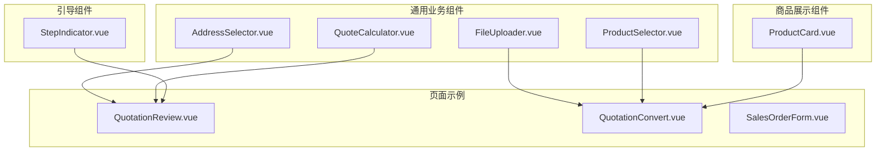
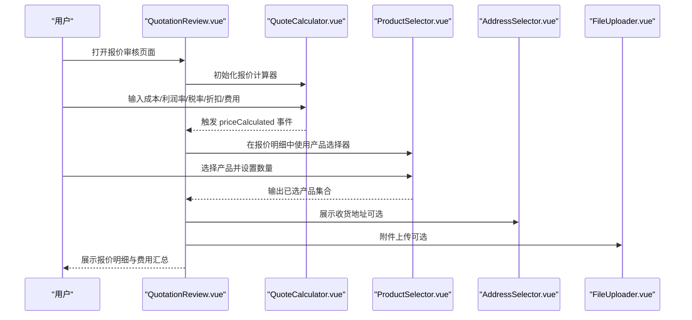
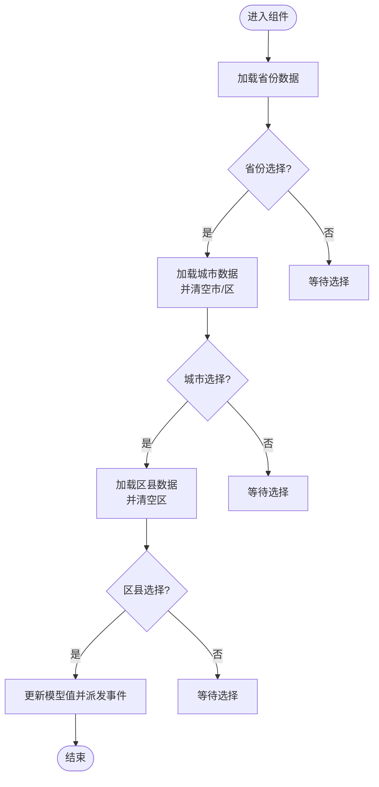
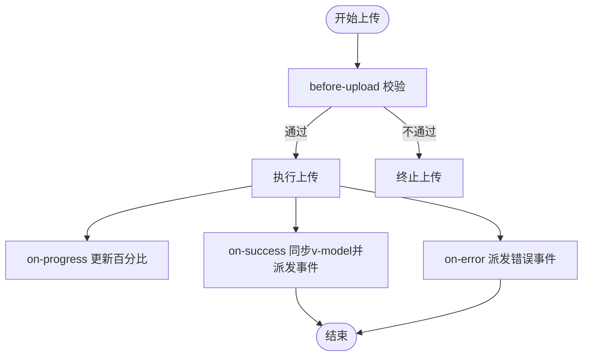
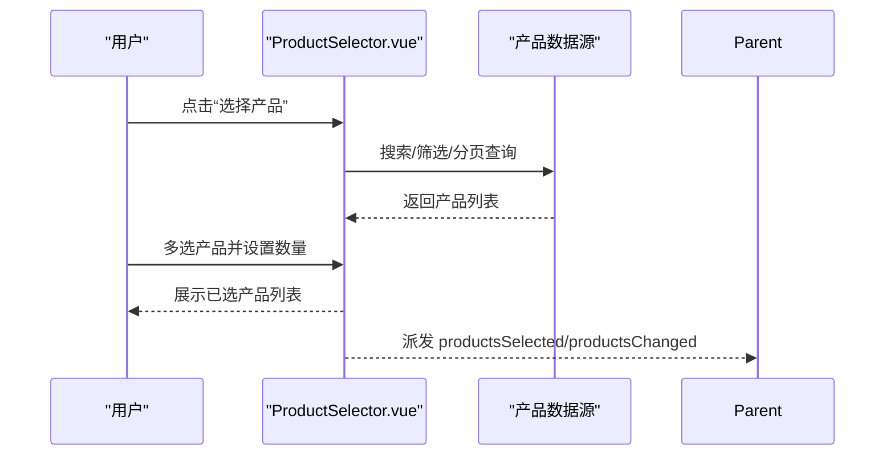
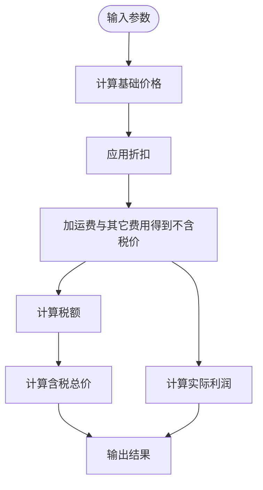
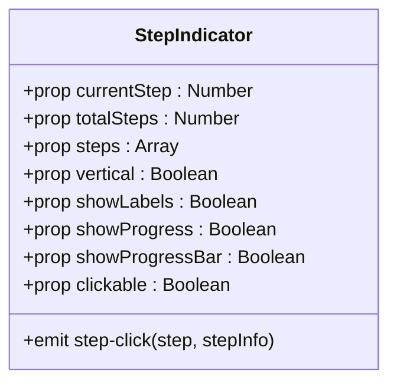
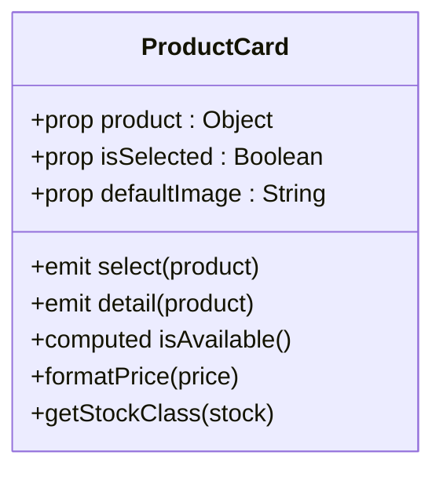
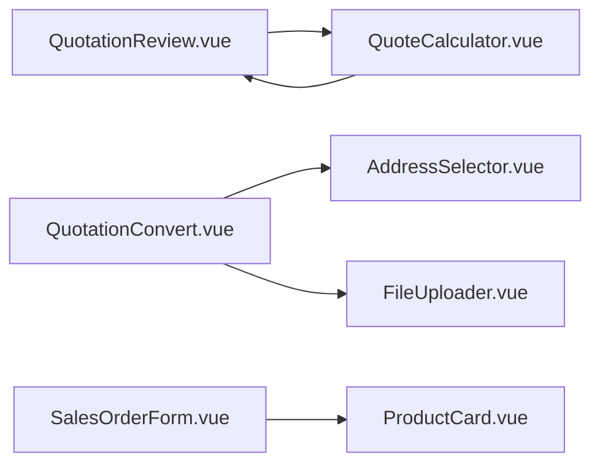

# 业务组件

<cite>
**本文引用的文件**
- [AddressSelector.vue](file://07-frontend/src/components/common/business/AddressSelector.vue)
- [FileUploader.vue](file://07-frontend/src/components/common/business/FileUploader.vue)
- [ProductSelector.vue](file://07-frontend/src/components/common/business/ProductSelector.vue)
- [QuoteCalculator.vue](file://07-frontend/src/components/common/business/QuoteCalculator.vue)
- [StepIndicator.vue](file://07-frontend/src/components/guide/StepIndicator.vue)
- [ProductCard.vue](file://07-frontend/src/components/product/ProductCard.vue)
- [QuotationReview.vue](file://07-frontend/src/pages/quotation/QuotationReview.vue)
- [QuotationConvert.vue](file://07-frontend/src/pages/quotation/QuotationConvert.vue)
- [SalesOrderForm.vue](file://07-frontend/src/pages/sales/orders/SalesOrderForm.vue)
- [quotation.ts](file://07-frontend/src/utils/quotation.ts)
</cite>

## 目录
1. [引言](#引言)
2. [项目结构](#项目结构)
3. [核心组件](#核心组件)
4. [架构总览](#架构总览)
5. [详细组件分析](#详细组件分析)
6. [依赖关系分析](#依赖关系分析)
7. [性能考量](#性能考量)
8. [故障排查指南](#故障排查指南)
9. [结论](#结论)
10. [附录](#附录)

## 引言
本文件围绕业务组件的设计原理与应用场景展开，重点解析以下组件：
- AddressSelector：封装省市区三级联动与详细地址输入，提供简洁的双向绑定与事件输出。
- FileUploader：封装文件上传校验、进度反馈、预览与批量管理，统一上传行为。
- ProductSelector：封装产品选择、筛选、分页与数量变更，输出标准化的产品集合。
- QuoteCalculator：封装报价计算模型与用户交互，提供重置、应用与模板能力。
- StepIndicator：封装步骤指示与进度可视化，支持垂直布局、可点击跳转与可配置项。
- ProductCard：封装商品卡片的数据绑定与状态管理，提供选择与详情交互。

文档还通过报价审核、报价转订单、销售订单等业务流程示例，展示这些组件如何协同工作，提升开发效率与用户体验一致性。

## 项目结构
业务组件主要位于前端工程的通用业务组件目录与引导组件目录，并在页面中被广泛复用。整体组织以“按功能域”为主，便于跨页面共享与维护。

图表来源
- [AddressSelector.vue](file://07-frontend/src/components/common/business/AddressSelector.vue#L1-L338)
- [FileUploader.vue](file://07-frontend/src/components/common/business/FileUploader.vue#L1-L398)
- [ProductSelector.vue](file://07-frontend/src/components/common/business/ProductSelector.vue#L1-L131)
- [QuoteCalculator.vue](file://07-frontend/src/components/common/business/QuoteCalculator.vue#L1-L228)
- [StepIndicator.vue](file://07-frontend/src/components/guide/StepIndicator.vue#L1-L445)
- [ProductCard.vue](file://07-frontend/src/components/product/ProductCard.vue#L1-L223)
- [QuotationReview.vue](file://07-frontend/src/pages/quotation/QuotationReview.vue#L1-L262)
- [QuotationConvert.vue](file://07-frontend/src/pages/quotation/QuotationConvert.vue#L1-L332)
- [SalesOrderForm.vue](file://07-frontend/src/pages/sales/orders/SalesOrderForm.vue#L1-L151)

章节来源
- [AddressSelector.vue](file://07-frontend/src/components/common/business/AddressSelector.vue#L1-L338)
- [FileUploader.vue](file://07-frontend/src/components/common/business/FileUploader.vue#L1-L398)
- [ProductSelector.vue](file://07-frontend/src/components/common/business/ProductSelector.vue#L1-L131)
- [QuoteCalculator.vue](file://07-frontend/src/components/common/business/QuoteCalculator.vue#L1-L228)
- [StepIndicator.vue](file://07-frontend/src/components/guide/StepIndicator.vue#L1-L445)
- [ProductCard.vue](file://07-frontend/src/components/product/ProductCard.vue#L1-L223)
- [QuotationReview.vue](file://07-frontend/src/pages/quotation/QuotationReview.vue#L1-L262)
- [QuotationConvert.vue](file://07-frontend/src/pages/quotation/QuotationConvert.vue#L1-L332)
- [SalesOrderForm.vue](file://07-frontend/src/pages/sales/orders/SalesOrderForm.vue#L1-L151)

## 核心组件
本节对四个关键业务组件进行深入剖析，包括数据结构、处理逻辑、错误处理与性能特征。

- AddressSelector
  - 设计要点：三层联动（省/市/区），支持详细地址输入；通过 v-model 与 change 事件输出标准化地址对象；内部维护当前选中地址的计算值。
  - 关键路径：[省/市/区加载与清空逻辑](file://07-frontend/src/components/common/business/AddressSelector.vue#L198-L234)，[更新模型值与事件派发](file://07-frontend/src/components/common/business/AddressSelector.vue#L258-L268)，[外部 modelValue 同步](file://07-frontend/src/components/common/business/AddressSelector.vue#L270-L298)。
  - 错误处理：加载阶段异常捕获与日志输出，保证组件可用性。
  - 性能：模拟数据与延迟，避免真实网络请求；watch 深度监听与分步异步更新，降低首屏渲染压力。

- FileUploader
  - 设计要点：基于 Element Plus Upload 的二次封装，内置文件类型判断、大小限制、进度条、预览与删除确认；支持多文件、限制数量、自动上传控制。
  - 关键路径：[上传成功/失败/进度回调](file://07-frontend/src/components/common/business/FileUploader.vue#L201-L219)，[删除与确认对话框](file://07-frontend/src/components/common/business/FileUploader.vue#L220-L259)，[上传前校验](file://07-frontend/src/components/common/business/FileUploader.vue#L227-L242)。
  - 错误处理：统一消息提示与错误事件抛出；删除前确认，防止误删。
  - 性能：文件大小格式化与截断显示，减少 DOM 渲染负担；响应式布局适配移动端。

- ProductSelector
  - 设计要点：弹窗内搜索筛选、分页与多选；表格列包含数量编辑与删除；对外输出已选产品集合与变更事件。
  - 关键路径：[弹窗打开与关闭](file://07-frontend/src/components/common/business/ProductSelector.vue#L48-L53)，[搜索与分页](file://07-frontend/src/components/common/business/ProductSelector.vue#L55-L101)，[数量变更与删除](file://07-frontend/src/components/common/business/ProductSelector.vue#L18-L39)。
  - 错误处理：空状态提示与交互引导。
  - 性能：分页与选择变更事件分离，避免全量刷新。

- QuoteCalculator
  - 设计要点：输入成本、利润率、税率、折扣、运输与其它费用；计算不含税价、税额、含税总价与利润；提供重置与应用价格事件。
  - 关键路径：[计算公式与结果输出](file://07-frontend/src/components/common/business/QuoteCalculator.vue#L96-L123)，[应用价格与消息提示](file://07-frontend/src/components/common/business/QuoteCalculator.vue#L137-L144)。
  - 错误处理：输入范围校验（最小值、最大值、步进）；模板保存占位提示。
  - 性能：计算结果使用 computed 缓存，减少重复计算。

章节来源
- [AddressSelector.vue](file://07-frontend/src/components/common/business/AddressSelector.vue#L1-L338)
- [FileUploader.vue](file://07-frontend/src/components/common/business/FileUploader.vue#L1-L398)
- [ProductSelector.vue](file://07-frontend/src/components/common/business/ProductSelector.vue#L1-L131)
- [QuoteCalculator.vue](file://07-frontend/src/components/common/business/QuoteCalculator.vue#L1-L228)

## 架构总览
下面以报价审核页面为例，展示组件间的协作关系与数据流向。

图表来源
- [QuotationReview.vue](file://07-frontend/src/pages/quotation/QuotationReview.vue#L1-L262)
- [QuoteCalculator.vue](file://07-frontend/src/components/common/business/QuoteCalculator.vue#L1-L228)
- [ProductSelector.vue](file://07-frontend/src/components/common/business/ProductSelector.vue#L1-L131)
- [AddressSelector.vue](file://07-frontend/src/components/common/business/AddressSelector.vue#L1-L338)
- [FileUploader.vue](file://07-frontend/src/components/common/business/FileUploader.vue#L1-L398)

## 详细组件分析

### AddressSelector 组件分析
- 数据结构与状态
  - 内部维护省/市/区列表与当前选中值，以及详细地址字段。
  - 通过 computed 生成当前地址对象，包含省市区名称与编码及详细地址。
- 处理逻辑
  - 省份变化触发城市加载并清空后续层级；城市变化触发区县加载并清空区县。
  - 任一层级或详细地址变化均会更新 v-model 并派发 change 事件。
- 错误处理
  - 加载过程异常捕获并记录日志，保证组件稳定运行。
- 性能与可扩展性
  - 使用模拟数据便于演示；生产环境建议替换为真实 API 调用。
  - 支持禁用与加载态，适配复杂表单场景。

图表来源
- [AddressSelector.vue](file://07-frontend/src/components/common/business/AddressSelector.vue#L198-L268)

章节来源
- [AddressSelector.vue](file://07-frontend/src/components/common/business/AddressSelector.vue#L1-L338)

### FileUploader 组件分析
- 数据结构与状态
  - 文件列表为 UploadFile 数组，包含名称、URL、大小、状态、百分比与原始文件等。
- 处理逻辑
  - 上传前校验：大小限制与类型匹配；超出限制或类型不符则阻止上传。
  - 上传成功/失败分别派发 success/error 事件，并同步 v-model。
  - 删除文件前弹出确认对话框，防止误删。
  - 进度回调实时更新百分比，结合进度条展示。
- 错误处理
  - 统一的消息提示与错误事件；删除确认采用确认对话框。
- 性能与可扩展性
  - 图片预览与文件大小格式化优化用户体验；响应式布局适配移动端。

图表来源
- [FileUploader.vue](file://07-frontend/src/components/common/business/FileUploader.vue#L201-L259)

章节来源
- [FileUploader.vue](file://07-frontend/src/components/common/business/FileUploader.vue#L1-L398)

### ProductSelector 组件分析
- 数据结构与状态
  - 已选产品列表、弹窗开关、搜索条件、分类过滤、分页参数与产品类别列表。
- 处理逻辑
  - 打开弹窗后，支持搜索与筛选；多选后在主面板展示已选产品，支持数量编辑与删除。
  - 通过事件向父组件传递选择结果与变更通知。
- 错误处理
  - 空状态友好提示，引导用户选择产品。
- 性能与可扩展性
  - 分页与选择变更事件分离，避免全量刷新；可扩展为远程搜索与缓存策略。

图表来源
- [ProductSelector.vue](file://07-frontend/src/components/common/business/ProductSelector.vue#L48-L108)

章节来源
- [ProductSelector.vue](file://07-frontend/src/components/common/business/ProductSelector.vue#L1-L131)

### QuoteCalculator 组件分析
- 计算模型
  - 基础价格 = 成本 × (1 + 利润率/100)
  - 折扣后价格 = 基础价格 × (1 - 折扣率/100)
  - 不含税价格 = 折扣后价格 + 运输费用 + 其它费用
  - 税额 = 不含税价格 × 税率/100
  - 含税总价 = 不含税价格 + 税额
  - 实际利润 = 不含税价格 - 成本 - 运输费用 - 其它费用
- 用户交互
  - 输入框支持数值范围与步进；重置按钮恢复默认值；应用价格按钮派发计算结果。
- 错误处理
  - 输入范围校验；模板保存为占位提示，便于后续扩展。
- 性能
  - 使用 computed 缓存计算结果，减少重复计算。

图表来源
- [QuoteCalculator.vue](file://07-frontend/src/components/common/business/QuoteCalculator.vue#L96-L123)

章节来源
- [QuoteCalculator.vue](file://07-frontend/src/components/common/business/QuoteCalculator.vue#L1-L228)

### StepIndicator 组件分析
- 可配置性
  - 支持 currentStep、totalSteps、steps、vertical、showLabels、showProgress、showProgressBar、clickable 等属性。
  - 支持 step-click 事件，允许点击步骤跳转。
- 视觉与交互
  - 根据步骤状态切换图标与样式；连接线随完成度变化；支持垂直布局与进度条。
- 错误处理
  - 参数校验（正整数）；点击事件仅在可点击且非当前步骤时触发。
- 性能
  - 无额外副作用，渲染开销极低。

图表来源
- [StepIndicator.vue](file://07-frontend/src/components/guide/StepIndicator.vue#L75-L171)

章节来源
- [StepIndicator.vue](file://07-frontend/src/components/guide/StepIndicator.vue#L1-L445)

### ProductCard 组件分析
- 数据绑定
  - 接收 product 对象与 isSelected 标记；内部根据 isActive 与 stock 计算可用状态。
- 状态管理
  - 价格格式化、库存分级样式、热销/新品/停售徽标；选择按钮根据可用状态启用/禁用。
- 交互
  - 选择与详情两个事件，便于父组件处理业务逻辑。
- 性能
  - 计算属性减少重复计算；样式与布局简洁，利于大量卡片渲染。

图表来源
- [ProductCard.vue](file://07-frontend/src/components/product/ProductCard.vue#L62-L108)

章节来源
- [ProductCard.vue](file://07-frontend/src/components/product/ProductCard.vue#L1-L223)

## 依赖关系分析
- 组件间耦合
  - QuotationReview 与 QuoteCalculator：通过 priceCalculated 事件接收计算结果，驱动页面展示。
  - QuotationConvert 与 AddressSelector/FileUploader：在订单创建流程中复用地址与附件能力。
  - SalesOrderForm 与 ProductCard：在订单编辑/查看场景中展示商品卡片。
- 外部依赖
  - Element Plus 组件库（Select、Upload、Table、Dialog、Pagination 等）作为 UI 基础。
  - Vue 响应式系统（ref、reactive、computed、watch）支撑状态管理与数据流。
- 潜在循环依赖
  - 组件间通过事件与 props 解耦，未见直接循环导入。

图表来源
- [QuotationReview.vue](file://07-frontend/src/pages/quotation/QuotationReview.vue#L1-L262)
- [QuoteCalculator.vue](file://07-frontend/src/components/common/business/QuoteCalculator.vue#L1-L228)
- [QuotationConvert.vue](file://07-frontend/src/pages/quotation/QuotationConvert.vue#L1-L332)
- [AddressSelector.vue](file://07-frontend/src/components/common/business/AddressSelector.vue#L1-L338)
- [FileUploader.vue](file://07-frontend/src/components/common/business/FileUploader.vue#L1-L398)
- [SalesOrderForm.vue](file://07-frontend/src/pages/sales/orders/SalesOrderForm.vue#L1-L151)
- [ProductCard.vue](file://07-frontend/src/components/product/ProductCard.vue#L1-L223)

章节来源
- [QuotationReview.vue](file://07-frontend/src/pages/quotation/QuotationReview.vue#L1-L262)
- [QuoteCalculator.vue](file://07-frontend/src/components/common/business/QuoteCalculator.vue#L1-L228)
- [QuotationConvert.vue](file://07-frontend/src/pages/quotation/QuotationConvert.vue#L1-L332)
- [SalesOrderForm.vue](file://07-frontend/src/pages/sales/orders/SalesOrderForm.vue#L1-L151)

## 性能考量
- 计算与缓存
  - QuoteCalculator 使用 computed 缓存计算结果，避免重复计算。
  - AddressSelector 与 ProductCard 使用 computed 与少量 watch，保持轻量。
- 渲染优化
  - FileUploader 与 ProductSelector 采用分页与局部更新，减少大列表渲染压力。
  - ProductCard 与 StepIndicator 结构简单，适合大量实例渲染。
- 网络与异步
  - AddressSelector 使用模拟数据演示；生产环境建议改为真实 API 并增加缓存与错误重试。
  - FileUploader 的 before-upload 校验提前拦截无效文件，减少无效请求。

## 故障排查指南
- AddressSelector
  - 症状：省/市/区无法联动或清空异常
  - 排查：检查省份变化与城市/区县加载逻辑；确认外部传入的 modelValue 是否正确更新。
  - 参考路径：[省份变化处理](file://07-frontend/src/components/common/business/AddressSelector.vue#L236-L241)，[城市变化处理](file://07-frontend/src/components/common/business/AddressSelector.vue#L242-L247)，[外部 modelValue 同步](file://07-frontend/src/components/common/business/AddressSelector.vue#L270-L298)。

- FileUploader
  - 症状：上传失败或进度不更新
  - 排查：确认 before-upload 校验规则与 accept 类型；检查 on-error 回调与错误事件。
  - 参考路径：[上传前校验](file://07-frontend/src/components/common/business/FileUploader.vue#L227-L242)，[上传失败处理](file://07-frontend/src/components/common/business/FileUploader.vue#L208-L212)，[进度处理](file://07-frontend/src/components/common/business/FileUploader.vue#L214-L219)。

- ProductSelector
  - 症状：弹窗无法打开或已选产品不更新
  - 排查：确认 showProductList 开关与 selection-change 事件；检查分页与搜索逻辑。
  - 参考路径：[弹窗开关](file://07-frontend/src/components/common/business/ProductSelector.vue#L48-L53)，[选择变更](file://07-frontend/src/components/common/business/ProductSelector.vue#L78-L79)。

- QuoteCalculator
  - 症状：计算结果异常或应用按钮无效
  - 排查：检查输入范围与步进；确认 priceCalculated 事件是否被父组件正确监听。
  - 参考路径：[计算公式](file://07-frontend/src/components/common/business/QuoteCalculator.vue#L96-L123)，[应用价格](file://07-frontend/src/components/common/business/QuoteCalculator.vue#L137-L144)。

- StepIndicator
  - 症状：点击无效或进度不显示
  - 排查：确认 clickable 与 currentStep/totalSteps 参数；检查 step-click 事件绑定。
  - 参考路径：[点击处理](file://07-frontend/src/components/guide/StepIndicator.vue#L152-L162)，[参数校验](file://07-frontend/src/components/guide/StepIndicator.vue#L81-L94)。

章节来源
- [AddressSelector.vue](file://07-frontend/src/components/common/business/AddressSelector.vue#L236-L298)
- [FileUploader.vue](file://07-frontend/src/components/common/business/FileUploader.vue#L208-L242)
- [ProductSelector.vue](file://07-frontend/src/components/common/business/ProductSelector.vue#L48-L79)
- [QuoteCalculator.vue](file://07-frontend/src/components/common/business/QuoteCalculator.vue#L96-L144)
- [StepIndicator.vue](file://07-frontend/src/components/guide/StepIndicator.vue#L81-L162)

## 结论
上述业务组件通过清晰的 props/emits 设计、完善的事件与状态管理、以及良好的可配置性，实现了复杂业务逻辑的封装与简化。它们在报价审核、报价转订单、销售订单等流程中协同工作，既提升了开发效率，也保障了用户体验的一致性。建议在生产环境中进一步完善网络层、错误重试与缓存策略，并持续优化交互细节与可访问性。

## 附录
- 实际业务流程示例
  - 报价审核流程：页面通过 QuoteCalculator 生成报价结果，再结合 ProductSelector 的产品清单与 AddressSelector 的收货地址，最终在 QuotationReview 中展示明细与汇总。
  - 报价转订单流程：页面读取报价详情，填充订单表单（DeliveryMethod、PaymentMethod、DeliveryAddress 等），并可选择复制报价备注；完成后创建销售订单。
  - 销售订单流程：页面使用 ProductCard 展示商品卡片，支持选择与查看详情；订单明细表格支持增删改。

章节来源
- [QuotationReview.vue](file://07-frontend/src/pages/quotation/QuotationReview.vue#L1-L262)
- [QuotationConvert.vue](file://07-frontend/src/pages/quotation/QuotationConvert.vue#L1-L332)
- [SalesOrderForm.vue](file://07-frontend/src/pages/sales/orders/SalesOrderForm.vue#L1-L151)
- [quotation.ts](file://07-frontend/src/utils/quotation.ts#L1-L469)